## 其它

### typora快捷键

- 无序列表：- + 空格
- 有序列表：输入数字+“.”之后输入空格
- 任务列表：-[空格]空格 文字
- 标题：ctrl+数字
- 表格：ctrl+t
- 生成目录：`[TOC]`按回车
- 选中一整行：ctrl+l
- 选中单词：ctrl+d
- 选中相同格式的文字：ctrl+e
- 跳转到文章开头：ctrl+home
- 跳转到文章结尾：ctrl+end
- 搜索：ctrl+f
- 替换：ctrl+h
- 引用：输入>之后输入空格
- 代码块：ctrl+alt+f
- 加粗：ctrl+b
- 倾斜：ctrl+i
- 下划线：ctrl+u
- 删除线：alt+shift+5
- 插入图片：直接拖动到指定位置即可或者ctrl+shift+i
- 插入链接：ctrl + k
- 打开类结构： ctrl+f12
- 

### idea

#### 微服务多个显示

view->tool windows->service

#### 一键启动多个微服务

+compound

#### 快捷键

- 全局查找: 双击shift: 


- 格式化代码：ctrl+alt+l 
- 整行上下移动：ctrl+shift+上下键
- 注释：ctrl+shirft+/
- 查看类的继承关系：ctrl+H
- 缩进:shift+tab / tab
- 查看文件popu : ctl+1e
- 弹窗类的方法：ctl+F12
- 生成try-catch：ctl+alt+t
- 抽取方法：ctrl+alt+m
- 查看方法直接跳转实现类：ctrl+alt+左键
- 查源码查看调用者：ctrl+alt+<-

### windows命令

```bash
services.msc 查看服务器（windows）

找到占用端口的进程
netstat -ano | findstr "4000"

找到继承名字
tasklist | findstr "20616"

杀死进程
taskkill /f /t /im "node.exe"

hexo clean // 删除public文件的内容
hexo g // 生成静态文件到public
hexo s // 本地运行
hexo d // 发布静态文件
博客标题
---
title
---
```

#### 无法打开文件，包含病毒

[博客](https://jingyan.baidu.com/article/36d6ed1fb7b35f1bce488379.html)

#### github加速

##### **通过修改 HOSTS 文件进行加速**

手动把cdn和ip地址绑定。

第一步：获取 github 的 global.ssl.fastly 地址访问：http://github.global.ssl.fastly.net.ipaddress.com/#ipinfo 获取cdn和ip域名：


得到：199.232.69.194 [https://github.global.ssl.fastly.net](https://github.global.ssl.fastly.net/)

第二步：获取github.com地址

访问：https://github.com.ipaddress.com/#ipinfo 获取cdn和ip：


得到：140.82.114.4 [http://github.com](http://github.com/)

第三步：修改 host 文件映射上面查找到的 IP

windows系统：

1、修改C:WindowsSystem32driversetchosts文件的权限，指定可写入：右击->hosts->属性->安全->编辑->点击Users->在Users的权限“写入”后面打勾。如下：


然后点击确定。

2、右击->hosts->打开方式->选定记事本（或者你喜欢的编辑器）->在末尾处添加以下内容：

```
199.232.69.194 github.global.ssl.fastly.net
140.82.114.4 github.com
```

#### vaware安装虚拟机

[博客](https://www.runoob.com/w3cnote/vmware-install-centos7.html)

#### 安装vueDevtools

1. 克隆

```
git clone -b v5.1.1 https://github.com/vuejs/devtools.git
cd devtools
```

2. 修改persistant属性为true

修改manifest.json文件中的persistant属性为true

3. npm i 安装依赖包
4. npm run build

5. 添加扩展程序
   点击Chrome浏览器右上角的三个点>更多工具>扩展程序>加载已解压的扩展程序>选定chrome文件夹，得到如下结果：

## Spring

### SpringBoot自动装配

SpringBootApplication被由下面三个注解标注

#### 1、@SpringBootConfiguration

#### 2、@EnableAutoConfiguration

使用@EnableAutoConfiguration开启自动装配，它又被@AutoConfigurationPackage和@Import(AutoConfigurationImportSelector.class)标注

@AutoConfigurationPackage负责扫描

@Import(AutoConfigurationImportSelector.class)导入了**AutoConfigurationImportSelector**这个类，由它扫描META-INFO下面的spring.factories里面的类，类似Java SPI机制。

自动配置类本身也是条件加载，注入各种需要的类

```java
@Configuration(proxyBeanMethods = false)
@ConditionalOnClass(RedisOperations.class)
@EnableConfigurationProperties(RedisProperties.class)
@Import({ LettuceConnectionConfiguration.class, JedisConnectionConfiguration.class })
public class RedisAutoConfiguration {

	@Bean
	@ConditionalOnMissingBean(name = "redisTemplate")
	@ConditionalOnSingleCandidate(RedisConnectionFactory.class)
	public RedisTemplate<Object, Object> redisTemplate(RedisConnectionFactory redisConnectionFactory) {
		RedisTemplate<Object, Object> template = new RedisTemplate<>();
		template.setConnectionFactory(redisConnectionFactory);
		return template;
	}
```


```java
	/**
	 * Return the {@link AutoConfigurationEntry} based on the {@link AnnotationMetadata}
	 * of the importing {@link Configuration @Configuration} class.
	 * @param annotationMetadata the annotation metadata of the configuration class
	 * @return the auto-configurations that should be imported
	 */
	protected AutoConfigurationEntry getAutoConfigurationEntry(AnnotationMetadata annotationMetadata) {
		if (!isEnabled(annotationMetadata)) {
			return EMPTY_ENTRY;
		}
		AnnotationAttributes attributes = getAttributes(annotationMetadata);
		List<String> configurations = getCandidateConfigurations(annotationMetadata, attributes); // 获取spring.factories中的全类名
		configurations = removeDuplicates(configurations);
		Set<String> exclusions = getExclusions(annotationMetadata, attributes);
		checkExcludedClasses(configurations, exclusions);
		configurations.removeAll(exclusions);
		configurations = getConfigurationClassFilter().filter(configurations);
		fireAutoConfigurationImportEvents(configurations, exclusions);
		return new AutoConfigurationEntry(configurations, exclusions);
	}
```


AutoConfigurationImportSelector中getCandidateConfigurations方法类似Java SPI负责扫描META-INF/spring.factories下的包

```java
	protected List<String> getCandidateConfigurations(AnnotationMetadata metadata, AnnotationAttributes attributes) {
		List<String> configurations = SpringFactoriesLoader.loadFactoryNames(getSpringFactoriesLoaderFactoryClass(),
				getBeanClassLoader());
		Assert.notEmpty(configurations, "No auto configuration classes found in META-INF/spring.factories. If you "
				+ "are using a custom packaging, make sure that file is correct.");
		return configurations;
	}
```

#### 3、@ComponentScan

### Spring事务传播行为

事务传播行为是为了解决业务层方法之间互相调用的事务问题。

当事务方法被另一个事务方法调用时，必须指定事务应该如何传播。例如：方法可能继续在现有事务中运行，也可能开启一个新事务，并在自己的事务中运行。

正确的事务传播行为可能的值如下:TransactionDefinition.PROPAGATION_**

#### 1.REQUIRED

使用的最多的一个事务传播行为，我们平时经常使用的`@Transactional`注解**默认使用**就是这个事务传播行为。如果当前存在事务，则加入该事务；如果当前没有事务，则创建一个新的事务。

#### 2.REQUIRES_NEW

创建一个新的事务，如果当前存在事务，则把当前事务挂起。也就是说不管外部方法是否开启事务，`Propagation.REQUIRES_NEW`修饰的内部方法会**新开启自己的事务**，且开启的事务相互独立，互不干扰。

#### 3.NESTED

如果当前存在事务，则创建一个事务作为当前事务的嵌套事务来运行；如果当前没有事务，则该取值等价于`TransactionDefinition.PROPAGATION_REQUIRED`。

#### 4.MANDATORY

如果当前存在事务，则加入该事务；如果当前没有事务，则**抛出异常。（mandatory：强制性）**

这个使用的很少。

若是错误的配置以下 3 种事务传播行为，事务将不会发生回滚：

- **SUPPORTS**: 如果当前存在事务，则加入该事务；如果当前没有事务，则以非事务的方式继续运行。
- **NOT_SUPPORTED**: 以非事务方式运行，如果当前存在事务，则把当前**事务挂起**。
- **NEVER**: 以非事务方式运行，如果当前存在事务，则**抛出异常**

### Spring设计模式

#### 1、简单工厂

spring中的BeanFactory就是简单工厂模式的体现，**传入id来获取bean对象**

#### 2、工厂方法

通常由应用程序直接使用new创建新的对象，为了将对象的创建和使用相分离，采用工厂模式，即应用程序将对象的创建及初始化职责交给工厂对象。

实现了**FactoryBean**接口的bean是一类叫做factory的bean。其特点是，spring会在使用getBean()调 用获得该bean时，会自动调用该bean的getObject()方法，所以返回的不是factory这个bean，而是这个 bean.getOjbect()方法的返回值。

#### 3、单例模式

spring的bean模式都是单例的 **singleton**

#### 4、代理模式

切面在应用运行的时刻被织入。一般情况下，在织入切面时，**AOP**容器会为目标对象创建动态的创建一个代理 对象。SpringAOP就是以这种方式织入切面的。

织入：把切面应用到目标对象并创建新的代理对象的过程。

#### 5、模板方法

各种**template**，但是 Spring 并没有使用这种方式，而是使用Callback 模式与模板方法模式配合，既达到了代码复用的效果，同时增加了灵活性。

spring启动流程有个**onRefresh()**方法是空方法，留给子类来重写，在springboot中来内嵌tomcat。

模板方法：**不改变算法的骨架**而重定义该算法的某些具体实现

#### 6、适配器模式

在**Spring MVC中的HandlerAdapter**

当Spring容器启动后，会将所有定义好的适配器对象存放在一个List集合中，当一个请求来临时，DispatcherServlet会通过handler的类型找到对应适配器，并将该适配器对象返回给用户，然后就可以统一通过适配器的hanle()方法来调用Controller中的用于处理请求的方法。

#### 7、装饰器模式

**不改变原类的情况下动态功能增强**，通过组合的方式

Spring中用到的包装器模式在类名上有两种表现：一种是类名中含有**Wrapper**，另一种是类名中含有 **Decorator**。

#### 8、观察者模式

spring的**事件驱动模型**使用的是观察者模式，**listener**的实现

#### 9、策略模式

在不同的场景下切换不同的算法，可以替代代码中大量的 if-else。

### @lookup

https://blog.csdn.net/Wisimer/article/details/110880047

1、**单例bean**获取**原型bean**，为了每次**获取到最新的实例**，spring提供了方法级别的注入,实现了与spring代码的解耦
2、原理是当调用这个方法的时候，spring使用**cglib动态代理**，调用代理方法**获取proto最新的对象**
3、实现**解耦**：如果使用applicationContext获取到bean的话，就跟spring代码耦合了；@Autowire的话只能得到最初的bean

应用场景：lookup-method 方 法的返回值对象即可实现动态的对象返回。 

 在工厂方法难以定制的时候使用。 也是模板的一种应用。是工厂方法的扩展。 如：工厂方法返回对象类型为接口类型。且不同版本应用返回的对象未必相同时使用。 可以避免多次开发工厂类。

```java
@RestController
@RequestMapping("/lookup")
public class LookUpTest {

    @GetMapping("/proto")
    public String toy(){
        Toy toy = getToy();
        return "利用ciglib自动获取最新的proto对象:"+toy;
    }

    @Lookup // 自动获取最新的proto对象
    public Toy getToy(){
        return null;
    }
}

@Component
@Scope(scopeName = ConfigurableBeanFactory.SCOPE_PROTOTYPE) // 原型bean
public class Toy {
    public Toy(){
        System.out.println("create proto 对象");
    }
}

```

@replaced-method原理类似，动态替换掉 bean 中的一些方法

### IOC

有很多够钩子函数，主要分为BeanFactoryPostProcessor，BeanPostProcessor

refresh方法

```java
@Override
public void refresh() throws BeansException, IllegalStateException {
   // 来个锁，不然 refresh() 还没结束，你又来个启动或销毁容器的操作，那不就乱套了嘛
   synchronized (this.startupShutdownMonitor) {

      // 准备工作，记录下容器的启动时间、标记“已启动”状态、处理配置文件中的占位符
      prepareRefresh();
	
      // 创建新的容器。DefaultListableBeanFactory,有旧的容器进行关闭，
      // 自定义beanFactory。(beanFactory.setAllowBeanDefinitionOverriding,setAllowCircularReferences)
      // 加载beanDefinitions。将配置文件就会解析成一个个 BeanDefinition 定义，注册到BeanFactory的map中（beanName-> beanDefinition）
      // 当然，这里说的 Bean 还没有初始化，只是配置信息都提取出来了，
      ConfigurableListableBeanFactory beanFactory = obtainFreshBeanFactory(); // 调用refreshBeanFactory

      // 设置 BeanFactory 的类加载器，添加几个BeanPostProcessor（ApplicationContextAwareProcessor，ApplicationListenerDetector，LoadTimeWeaverAwareProcessor），手动注册几个特殊的 bean(environment,systemProperties)
      prepareBeanFactory(beanFactory);

      try {
         // Bean 如果实现了BeanFactoryPostProcessor接口，那么在容器初始化以后，Spring 会负责调用里面的 postProcessBeanFactory 方法。

         // 这里是提供给子类的扩展点，到这里的时候，所有的Bean都加载、注册完成了，但是都还没有初始化
         // 子类可添加BeanFactoryPostProcessor的实现类修改beanDefinition
         postProcessBeanFactory(beanFactory);
         // 调用 BeanFactoryPostProcessor 各个实现类的 postProcessBeanFactory(factory) 方法，可修改beanDefinition
         invokeBeanFactoryPostProcessors(beanFactory);

         // 注册 BeanPostProcessor 的实现类，注意看和 BeanFactoryPostProcessor 的区别
         // 此接口两个方法: postProcessBeforeInitialization 和 postProcessAfterInitialization
         // 两个方法分别在 Bean 初始化之前和初始化之后得到执行。注意，到这里 Bean 还没初始化
         registerBeanPostProcessors(beanFactory);

         // 初始化当前 ApplicationContext 的 MessageSource，国际化这里就不展开说了，不然没完没了了
         initMessageSource();

         // 初始化当前 ApplicationContext 的事件广播器，这里也不展开了
         initApplicationEventMulticaster();

         // 从方法名就可以知道，典型的模板方法(钩子方法)，
         // 具体的子类可以在这里初始化一些特殊的 Bean（在初始化 singleton beans 之前）
         onRefresh();

         // 注册事件监听器，监听器需要实现 ApplicationListener 接口。这也不是我们的重点，过
         registerListeners();

         // 重点，重点，重点
         // 初始化所有的 singleton beans
         //（lazy-init 的除外）
         finishBeanFactoryInitialization(beanFactory);

         // 最后，广播事件，ApplicationContext 初始化完成
         finishRefresh();
      }

      catch (BeansException ex) {
         if (logger.isWarnEnabled()) {
            logger.warn("Exception encountered during context initialization - " +
                  "cancelling refresh attempt: " + ex);
         }

         // Destroy already created singletons to avoid dangling resources.
         // 销毁已经初始化的 singleton 的 Beans，以免有些 bean 会一直占用资源
         destroyBeans();

         // Reset 'active' flag.
         cancelRefresh(ex);

         // 把异常往外抛
         throw ex;
      }

      finally {
         // Reset common introspection caches in Spring's core, since we
         // might not ever need metadata for singleton beans anymore...
         resetCommonCaches();
      }
   }
}
```

refreshBeanFactory

```java
@Override
protected final void refreshBeanFactory() throws BeansException {
   // 如果 ApplicationContext 中已经加载过 BeanFactory 了，销毁所有 Bean，关闭 BeanFactory
   // 注意，应用中 BeanFactory 本来就是可以多个的，这里可不是说应用全局是否有 BeanFactory，而是当前
   // ApplicationContext 是否有 BeanFactory
   if (hasBeanFactory()) {
      destroyBeans();
      closeBeanFactory();
   }
   try {
      // 初始化一个 DefaultListableBeanFactory，为什么用这个，我们马上说。
      DefaultListableBeanFactory beanFactory = createBeanFactory();
      // 用于 BeanFactory 的序列化，我想不部分人应该都用不到
      beanFactory.setSerializationId(getId());

      // 下面这两个方法很重要，别跟丢了，具体细节之后说
      // 设置 BeanFactory 的两个配置属性：是否允许 Bean 覆盖、是否允许循环引用
      customizeBeanFactory(beanFactory);

      // 加载 Bean 到 BeanFactory 中
      loadBeanDefinitions(beanFactory);
      synchronized (this.beanFactoryMonitor) {
         this.beanFactory = beanFactory;
      }
   }
   catch (IOException ex) {
      throw new ApplicationContextException("I/O error parsing bean definition source for " + getDisplayName(), ex);
   }
}
```


doCreateBean 真正创建bean和初始化，依赖注入，循环依赖

```java
protected Object doCreateBean(final String beanName, final RootBeanDefinition mbd, final @Nullable Object[] args)
			throws BeanCreationException {

		// Instantiate the bean. 实例化bean
		BeanWrapper instanceWrapper = null;
		if (mbd.isSingleton()) {
			instanceWrapper = this.factoryBeanInstanceCache.remove(beanName);
		}
		if (instanceWrapper == null) {
			instanceWrapper = createBeanInstance(beanName, mbd, args); // 构造器推断，反射创建bean实例
		}
		final Object bean = instanceWrapper.getWrappedInstance();
		Class<?> beanType = instanceWrapper.getWrappedClass();
		if (beanType != NullBean.class) {
			mbd.resolvedTargetType = beanType;
		}

		// Allow post-processors to modify the merged bean definition.
		synchronized (mbd.postProcessingLock) {
			if (!mbd.postProcessed) {
				try {
					applyMergedBeanDefinitionPostProcessors(mbd, beanType, beanName);
				}
				catch (Throwable ex) {
					throw new BeanCreationException(mbd.getResourceDescription(), beanName,
							"Post-processing of merged bean definition failed", ex);
				}
				mbd.postProcessed = true;
			}
		}

		// Eagerly cache singletons to be able to resolve circular references
		// even when triggered by lifecycle interfaces like BeanFactoryAware.
		boolean earlySingletonExposure = (mbd.isSingleton() && this.allowCircularReferences &&
				isSingletonCurrentlyInCreation(beanName));
		if (earlySingletonExposure) {
			if (logger.isTraceEnabled()) {
				logger.trace("Eagerly caching bean '" + beanName +
						"' to allow for resolving potential circular references");
			}
			addSingletonFactory(beanName, () -> getEarlyBeanReference(beanName, mbd, bean));
		}

		// Initialize the bean instance.
		Object exposedObject = bean;
		try {
			populateBean(beanName, mbd, instanceWrapper); // 属性注入
			exposedObject = initializeBean(beanName, exposedObject, mbd); // 处理各种回调 BP initializeBean
		}
		...

		if (earlySingletonExposure) {
			Object earlySingletonReference = getSingleton(beanName, false);
			if (earlySingletonReference != null) {
				if (exposedObject == bean) {
					exposedObject = earlySingletonReference;
				}
				else if (!this.allowRawInjectionDespiteWrapping && hasDependentBean(beanName)) {
					String[] dependentBeans = getDependentBeans(beanName);
					Set<String> actualDependentBeans = new LinkedHashSet<>(dependentBeans.length);
					for (String dependentBean : dependentBeans) {
						if (!removeSingletonIfCreatedForTypeCheckOnly(dependentBean)) {
							actualDependentBeans.add(dependentBean);
						}
					}
					if (!actualDependentBeans.isEmpty()) {
						throw new BeanCurrentlyInCreationException(beanName,
								"Bean with name '" + beanName + "' has been injected into other beans [" +
								StringUtils.collectionToCommaDelimitedString(actualDependentBeans) +
								"] in its raw version as part of a circular reference, but has eventually been " +
								"wrapped. This means that said other beans do not use the final version of the " +
								"bean. This is often the result of over-eager type matching - consider using " +
								"'getBeanNamesOfType' with the 'allowEagerInit' flag turned off, for example.");
					}
				}
			}
		}

		// Register bean as disposable.
		try {
			registerDisposableBeanIfNecessary(beanName, bean, mbd);
		}
		catch (BeanDefinitionValidationException ex) {
			throw new BeanCreationException(
					mbd.getResourceDescription(), beanName, "Invalid destruction signature", ex);
		}

		return exposedObject;
	}
```

initializeBean aware接口、 BeanPostProcessor的BeforeInitialization回调、 InitializingBean的afterPropertiesSet、BeanPostProcessor的AfterInitialization回调

```java
	protected Object initializeBean(final String beanName, final Object bean, @Nullable RootBeanDefinition mbd) {
		if (System.getSecurityManager() != null) {
			AccessController.doPrivileged((PrivilegedAction<Object>) () -> {
				invokeAwareMethods(beanName, bean);
				return null;
			}, getAccessControlContext());
		}
		else {
			invokeAwareMethods(beanName, bean); // 如果bean实现了BeanNameAware，BeanClassLoaderAware，BeanFactoryAware接口
		}

		Object wrappedBean = bean;
		if (mbd == null || !mbd.isSynthetic()) { // BeanPostProcessor的BeforeInitialization回调
			wrappedBean = applyBeanPostProcessorsBeforeInitialization(wrappedBean, beanName);
		}

		try {
            // InitializingBean的afterPropertiesSet
            // init-method
			invokeInitMethods(beanName, wrappedBean, mbd); 
		}
		catch (Throwable ex) {
			throw new BeanCreationException(
					(mbd != null ? mbd.getResourceDescription() : null),
					beanName, "Invocation of init method failed", ex);
		}
		if (mbd == null || !mbd.isSynthetic()) { // BeanPostProcessor的AfterInitialization回调
			wrappedBean = applyBeanPostProcessorsAfterInitialization(wrappedBean, beanName);
		}

		return wrappedBean;
	}
```


```java
	protected void invokeInitMethods(String beanName, final Object bean, @Nullable RootBeanDefinition mbd)
			throws Throwable {
			...
				((InitializingBean) bean).afterPropertiesSet();
			...
		}
```

model和session

```
session数据保存在服务器，model数据放入视图中,存入request域中。
session可以在不同页面使用。model只能在Controller返回的页面使用
```

#### Bean生命周期图

https://www.cnblogs.com/zrtqsk/p/3735273.html

```
现在开始初始化容器

这是BeanFactoryPostProcessor实现类构造器！！
BeanFactoryPostProcessor调用postProcessBeanFactory方法

这是BeanPostProcessor实现类构造器！！
这是InstantiationAwareBeanPostProcessorAdapter实现类构造器！！

InstantiationAwareBeanPostProcessor调用postProcessBeforeInstantiation方法
【构造器】调用Person的构造器实例化
InstantiationAwareBeanPostProcessor调用postProcessPropertyValues方法

【注入属性】注入属性address
【注入属性】注入属性name
【注入属性】注入属性phone

【BeanNameAware接口】调用BeanNameAware.setBeanName()
【BeanFactoryAware接口】调用BeanFactoryAware.setBeanFactory()

BeanPostProcessor接口方法postProcessBeforeInitialization对属性进行更改！
【InitializingBean接口】调用InitializingBean.afterPropertiesSet()
【init-method】调用<bean>的init-method属性指定的初始化方法
BeanPostProcessor接口方法postProcessAfterInitialization对属性进行更改！

InstantiationAwareBeanPostProcessor调用postProcessAfterInitialization方法

容器初始化成功
Person [address=广州, name=张三, phone=110]
现在开始关闭容器！
【DiposibleBean接口】调用DiposibleBean.destory()
【destroy-method】调用<bean>的destroy-method属性指定的初始化方法
```


```java
单例bean实例化后调用的方法
// Callback interface triggered at the end of the singleton pre-instantiation phase
// during {@link BeanFactory} bootstrap.
public interface SmartInitializingSingleton {

	void afterSingletonsInstantiated();

}

通过CommandLineRunner接口，可以实现在Spring Boot完全启动后执行一些代码逻辑
```

postProcessBeanDefinitionRegistry负责扫描注解变成beanDefinition对象，放入Map中


### AOP

 AOP（Aspect Orient Programming），作为面向对象编程的一种补充，应用于具有**横切性质的系统级服务**，如**事务**管理、**安全检查**、缓存、对象池管理等、**日志**。AOP 代理则可分为静态代理和动态代理两大类：

#### 静态代理

在编译阶段就可生成 AOP 代理类，因此也称为编译时增强，**ApectJ主要采用的是编译期织入**，在这个期间使用AspectJ的acj编译器(类似javac)把aspect类编译成class字节码后，在java目标类编译时织入，即先编译aspect类再编译目标类。

#### 动态代理

 Spring代理实际上是对**JDK代理**（基于接口）和**CGLIB代理（**基于子类）做了一层封装，而动态代理则在运行时借助于 JDK 动态代理、CGLIB 等在内存中“临时”生成 **AOP 动态代理类**，因此也被称为运行时增强。

并且引入了AOP概念:Aspect、advice、joinpoint等等，同时引入了AspectJ中的一些注解@pointCut,@after,@before等等。


##### spring事务


### 循环依赖

```
	/**
	 * 一级缓存，缓存beanName对应经过了完整生命周期的bean
	  */
	private final Map<String, Object> singletonObjects = new ConcurrentHashMap<>(256);

	/**
	 * 三级缓存，缓存bean的对象工厂ObjectFactory，可通过ObjectFactory得到普通对象或AOP对象（如果bean被代理的话）
	  */
	private final Map<String, ObjectFactory<?>> singletonFactories = new HashMap<>(16);

	/**
	 * 二级缓存，缓存提前拿原始对象进行AOP之后的代理对象，原始对象还没有进行属性注入和后续BeanPostProcessor生命周期
	  */
	private final Map<String, Object> earlySingletonObjects = new ConcurrentHashMap<>(16);
```


#### ObjectFactory

将半成品对象提前暴露，本质是一个Lambda表达式`**() ->getEarlyBeanReference(beanName, mbd, bean)**`，被AbstractAutoProxy实现，即该类用来实现APO的。


#### 可以用两级缓存吗

用一级缓存和三级缓存就可以解决循环依赖：将半成品对象提前暴露在ObjectFactory中

但如果有aop的话，每次调用ObjectFactory都会产生一个代理对象，这就不能保证单例了，所以需要二级缓存来存代理对象

### 日志级别

```
DEBUG>INFO
ALL、TRACE、DEBUG 、INFO、WARN、ERROR 、FATAL 、OFF
```

### MyBatis批量更新

foreach

[批量更新](https://www.cnblogs.com/exmyth/p/5757137.html)

### beanFactory&factoryBean

factortbean:不需要遵循bean生命周期地创建对象，适合自定义创建一些复杂对象


### SpringMVC

1. 客户端（浏览器）发送请求， `DispatcherServlet`拦截请求。
2. `DispatcherServlet` 根据请求信息调用 `HandlerMapping` 。`HandlerMapping` 根据 uri 去匹配查找能处理的 `Handler`（也就是我们平常说的 `Controller` 控制器） ，并会将请求涉及到的拦截器和 `Handler` 一起封装。
3. `DispatcherServlet` 调用 `HandlerAdapter`适配执行 `Handler` 。
4. `Handler` 完成对用户请求的处理后，会返回一个 `ModelAndView` 对象给`DispatcherServlet`，`ModelAndView` 顾名思义，包含了数据模型以及相应的视图的信息。`Model` 是返回的数据对象，`View` 是个逻辑上的 `View`。
5. `ViewResolver` 会根据逻辑 `View` 查找实际的 `View`。
6. `DispaterServlet` 把返回的 `Model` 传给 `View`（视图渲染）。
7. 把 `View` 返回给请求者（浏览器）


### 配置文件加载顺序 

[博客](https://blog.51cto.com/u_3631118/3032964)

**数字小的优先级越高，越先加载。高优先级配置会覆盖低优先级配置内容。**

```
1.命令行参数
2.Java系统属性（System.getProperties()）
3.OS环境变量
4.jar包外部的application-{profile}.properties配置文件
5.jar包内部的application-{profile}.properties配置文件
6.jar包外部的application.properties配置文件（此级别在测试环境经常使用。比如就在jar包同级目录放置一个配置文件，就内覆盖jar包内部所有的配置文件了）
7.jar包内部的application.properties配置文件
8.@Configuration注解类上的@PropertySource（手动指定导入外部配置文件）
```


```
spring boot默认依赖的日志框架是logback，因此必须在zookeeper中把slf4j-log4j12排除掉，zookeeper默认依赖的过时的log4j，log4j和logback会出现包冲突。也不建议在使用log4j。当然这里具体每个依赖使用什么版本最好根据dubbo官方的版本来。
```


### RewritePath

去除前缀或者路径重写

spring cloud gateway利用RewritePath可以实现原来的zuul的stripPrefix的效果，而且功能更强大。

```
spring:
  cloud:
    gateway:
      default-filters:
      - AddResponseHeader=X-Response-Default-Foo, Default-Bar
      routes:
      - id: demo
        uri: http://demo.com.cn:80
        order: 8999 ## 越小越优先
        predicates: 
        - Path=/demo/**
        filters:
        - RewritePath=/demo/(?<segment>.*), /$\{segment}
```

```

 filters:
    - StripPrefix=1
```

### @RequestBody注解

**加@RequestBody**

Content-type**只能处理application/json**

@RequestBody作用： 
      1. 该注解用于读取Request请求的**body**部分数据，使用系统默认配置的**HttpMessageConverter**进行解析，然后把相应的数据绑定到要返回的对象上；

2. 再把HttpMessageConverter返回的对象数据绑定到 controller中方法的参数上。

**不加@RequestBody**

Content-type为x-www-form-urlencoded和form-data，不能处理json对象

### 拦截器

①preHandle：在业务处理器处理请求之前被调用。预处理，可以进行编码、安全控制、权限校验等处理；

②postHandle：在业务处理器处理请求执行完成后，生成视图之前执行。后处理（调用了Service并返回ModelAndView，但未进行页面渲染），有机会修改ModelAndView （这个博主就基本不怎么用了）；
③afterCompletion：在DispatcherServlet完全处理完请求后被调用，可用于清理资源等。返回处理（已经渲染了页面）；


### Pagehelper原理

```
Pagehelper是MyBatis的分页插件，加载PageInterceptor拦截器到拦截链中，PageHelper.startPage相当于向线程上下文中设置ThreadLocal中，拦截从中拿到分页信息，然后对Sql进行拼接，最后再把ThreadLocal清楚
```

```
List<Job> jobDataList = jobDataMapper.getJobDataList(jobId, params);
jobDataList这个已经变成Page分页对象对象了，里面也已经包含了总页数之类的信息了。并且在父类中设置总条数
    public PageSerializable(List<T> list) {
        this.list = list;
        if(list instanceof Page){
            this.total = ((Page)list).getTotal();
        } else {
            this.total = list.size();
        }
    }


public class Page<E> extends ArrayList<E> implements Closeable {}

```

### MyBatis返回自增主键

```java
/**
 * 插入一条数据，返回自增主键
 *
 * @param sysRolePo
 * @return
 */
@Insert({"insert into sys_role(role_name, enable, create_by, create_time)",
        "values(#{roleName}, #{enable}, #{createBy}, #{createTime})"})
@Options(useGeneratedKeys = true, keyProperty = "id")
int insert2(SysRolePo sysRolePo);

/**
 * 插入一条数据，返回非自增主键
 *
 * @param sysRolePo
 * @return
 */
@Insert({"insert into sys_role(role_name, enable, create_by, create_time)",
        "values(#{roleName}, #{enable}, #{createBy}, #{createTime})"})
@SelectKey(statement = "SELECT LAST_INSERT_ID()",
        keyProperty = "id",
        resultType = Long.class,
        before = false)
int insert3(SysRolePo sysRolePo);

```

注解动态sql <if test=''>不用加#去取


### MyBatis TypeHandler

MyBatis 中的 TypeHandler 类型处理器用于 JavaType 与 JdbcType 之间的转换，用于 PreparedStatement 设置参数值和从 ResultSet 或 CallableStatement 中取出一个值。

自定义 TypeHandler

```java
@MappedTypes(value = { Enum1.class, Enum2.class})
public class EnumTypeHandler extends BaseTypeHandler<BaseEnum> {}
```

自定义类型处理器是通过实现 org.apache.ibatis.type.TypeHandler 接口实现的。这个接口定义了类型处理器的基本功能，接口定义如下所示。


其中 setParameter 方法用于把 java 对象设置到 PreparedStatement 的参数中，getResult 方法用于从 ResultSet（根据列名或者索引位置获取） 或 CallableStatement（根据存储过程获取） 中取出数据转换为 java 对象。

### Executor执行器

** `SimpleExecutor` ：**每执行一次 update 或 select，就开启一个 Statement 对象，用完立刻关闭 Statement 对象。

** `ReuseExecutor` ：**执行 update 或 select，以 sql 作为 key 查找 Statement 对象，存在就使用，不存在就创建，用完后，不关闭 Statement 对象，而是放置于 Map<String, Statement>内，供下一次使用。简言之，就是重复使用 Statement 对象。

** `BatchExecutor` ：**执行 update（没有 select，JDBC 批处理不支持 select），将所有 sql 都添加到批处理中（addBatch()），等待统一执行（executeBatch()），它缓存了多个 Statement 对象，每个 Statement 对象都是 addBatch()完毕后，等待逐一执行 executeBatch()批处理。与 JDBC 批处理相同。

作用范围：Executor 的这些特点，都严格限制在 SqlSession 生命周期范围内。

### 延迟加载

https://blog.csdn.net/qq_41775769/article/details/120090159

它的原理是，使⽤ CGLIB 或 Javassist( 默认 ) 创建⽬标对象的代理对象。当**调⽤代理对象的延迟加载属性的 getting ⽅法**时，进⼊**拦截器⽅法**。⽐如调⽤ a.getB().getName() ⽅法，进⼊拦截器的invoke(...) ⽅法，发现 a.getB() 需要延迟加载时，那么就会**单独发送事先保存好的查询关联 B对象的 SQL ，把 B 查询上来**，然后调⽤a.setB(b) ⽅法，于是 a 对象 b 属性就有值了，接着完
成a.getB().getName() ⽅法的调⽤。

总结：延迟加载主要是通过**动态代理**的形式实现，通过**代理拦截到指定⽅法**，**执⾏数据加载**。 

有效减少 Java 程序与数据库交互次数，从而提升整个系统的运行效率，延迟加载**适用于多表关联查询的业务场景**，而单表查询本身只涉及到一张数据表的查询，所以也没有优化的余地了

## java基础

### @Inherited

子类会继承父类的注解，接口继承和类实现接口都不会生效。


### 卸载自带[jdk](https://www.cnblogs.com/linjiqin/archive/2013/03/23/2977377.html)

```
rpm -qa|grep jdk
rpm -qa|grep gcj
yum -y remove java java-1.6.0-openjdk-1.6.0.0-1.50.1.11.5.el6_3.x86_64
yum list java*
yum install -y java-1.8.0-openjdk-devel.x86_64
```

### 枚举

```
 // XxxEnum->枚举类; e.getXxx()->根据哪个属性获取枚举对象
 public static XxxEnum getEnumObjByKey(Integer key){
        Optional<XxxEnum> any = Arrays.stream(XxxEnum.class.getEnumConstants())
        		.filter(e -> e.getXxx().equals(key)).findAny();
        if (any.isPresent()){
            return any.get();
        }
        return null;
 }

```


### ThreadLocal

为了叙述方便，我们先声明变量ThreadLocal<T> threadLocal=new ThreadLocal<>()

ThreadLocal字面意思线程变量，每个线程都有自己的变量副本，起到线程隔离的作用。

ThreadLocal其实只是一个工具包装，真正存变量副本还是Thread线程对象里面的ThreadLocalMap

**ThreadLocalMap**是ThreadLocal的静态内部类，维护着一个Entry<K,V>数组，数组的下标就是threadLocalHashCode（threadLocal对象的独一无二的threadLocalHashCode）,K存放ThreadLocal对象，V存放线程的变量副本（value）

**Entry<K,V>**又是ThreadLocalMap的静态内部类，声明如下

Entry类定义如下，继承了WeakReference弱引用，由于是弱引用，下一次垃圾回收的就会被清除。那么问题来了，value又是强引用，那岂不是**内存泄漏**了。

所以手动ThreadLocalMap.remove()很关键了，用完就要调用

```java
        static class Entry extends WeakReference<ThreadLocal<?>> {
            /** The value associated with this ThreadLocal. */
            Object value;

            Entry(ThreadLocal<?> k, Object v) {
                super(k);
                value = v;
            }
        }
```

ThreadLocalMap又都是每个线程私有的变量，自然就起到了线程隔离的作用


threadLocal.set()其实就是设置当前Thread线程对象的成员变量ThreadLocalMap

```java
	// threadLocal.set()    
	public void set(T value) {
        Thread t = Thread.currentThread();
        ThreadLocalMap map = getMap(t);
        if (map != null)
            map.set(this, value);
        else
            createMap(t, value);
    }
	// 本质调用的是ThreadLocalMap.set()
    private void set(ThreadLocal<?> key, Object value) {
        Entry[] tab = table;
        int len = tab.length;
        int i = key.threadLocalHashCode & (len-1);

        for (Entry e = tab[i];
             e != null;
             e = tab[i = nextIndex(i, len)]) {
            ThreadLocal<?> k = e.get();

            if (k == key) {
                e.value = value;
                return;
            }

            if (k == null) {
                replaceStaleEntry(key, value, i);
                return;
            }
        }

        tab[i] = new Entry(key, value);
        int sz = ++size;
        if (!cleanSomeSlots(i, sz) && sz >= threshold)
            rehash();
    }
```


threadLocal.remove()

```java
    // threadLocal.remove()
	public void remove() {
         ThreadLocalMap m = getMap(Thread.currentThread());
         if (m != null)
             m.remove(this);
     }
    // 本质调用的是ThreadLocalMap.remove()
    private void remove(ThreadLocal<?> key) {
        Entry[] tab = table;
        int len = tab.length;
        int i = key.threadLocalHashCode & (len-1);
        for (Entry e = tab[i];
             e != null;
             e = tab[i = nextIndex(i, len)]) {
            if (e.get() == key) {
                e.clear();
                expungeStaleEntry(i);
                return;
            }
        }
    }
```


threadLocal.get()

```java
    // threadLocal.get()
	public T get() {
        Thread t = Thread.currentThread();
        ThreadLocalMap map = getMap(t);
        if (map != null) {
            ThreadLocalMap.Entry e = map.getEntry(this);
            if (e != null) {
                @SuppressWarnings("unchecked")
                T result = (T)e.value;
                return result;
            }
        }
        return setInitialValue();
    }
	// 本质调用的是ThreadLocalMap.getEntry()
    private Entry getEntry(ThreadLocal<?> key) {
        int i = key.threadLocalHashCode & (table.length - 1);
        Entry e = table[i];
        if (e != null && e.get() == key)
            return e;
        else
            return getEntryAfterMiss(key, i, e);
    }
```

### synchronized

有个锁升级的过程，尽量避免用户态和内核态的切换

**无锁-》偏向锁-》轻量级锁-》重量级锁**

- 无锁：就是不加锁，对象头标志位 0 01

- 偏向锁：大部分场景下只有一个线程来获取资源，该线程访问同步代码块并获取锁时，对象头标志位 1 01（偏向模式），使用CAS把线程id记录在Mark Word中。以后这个线程进来就不用同步操作了

- 轻量级锁：多个线程竞争就会切换到轻量级锁，也就是自旋锁，避免了用户态到内核态的切换（monitor会阻塞和唤醒线程，线程的阻塞和唤醒需要CPU从用户态到内核态的切换）

  适应性自旋锁是一种优化，动态调准自旋时间（对某个锁很少自旋成功直接跳过；刚获得过这个锁，那么运行自旋时间长一点）

- 重量级锁：获取不到锁直接阻塞

注意锁的升级是不可逆的

**对象头**

补充：对象在内存中分为三块区域：对象头，实例数据和对齐填充。

对象头包括标记字段（Mark Word）和类型指针（Klass Pointer）

- 标记字段：对象hahCode，分代年龄，锁标志位
- 类型指针：指向类元数据的指针，表示哪个类的实例

### AQS

AQS（**AbstractQueuedSynchronizer**）是一个基于FIFO队列实现同步器，帮我们实现了**入队规则**和**线程队列的唤醒**工作，可基于它实现独占锁，共享锁和信号量。

AQS维护了两种队列，一个是本身的FIFO**阻塞队列**（结点叫做Node），另一个基于ConditionObject的**条件队列**。

**Node和ConditionObject是两个重要的内部类**


#### Node

Node是对线程的封装，它有个核心状态**waitStatus**，决定当前结点的后续操作（是否等待唤醒还唤醒后续结点），有如下四种状态

```java
    // 表示线程已取消调度
    static final int CANCELLED =  1;
    // 等待唤醒
    static final int SIGNAL    = -1;
    // 等待同步锁
    static final int CONDITION = -2;
    // 共享模式下无条件传播（递归唤醒下一个结点线程）
    static final int PROPAGATE = -3;
```

- CANCEL(1)：当timeout或中断可变更为此状态，进入该状态的结点将不再发送变化
- SIGNAL(-1)：表示后续结点依赖当前结点唤醒，后继结点入队时，会将前继结点置为SIGNAL
- CONDITION(-2)：表示在获取对应条件的同步锁，当有线程调用Condition.signal()后，处于条件队列的线程就会转移到阻塞队列竞争锁
- PROPAGATE(-3)：共享模式下，前继结点会不断递归唤醒下一个结点
- 0：新节点的默认状态

负值表示为有效状态

#### ConditionObject

比如ReentrantLock.newCondition()就是基于ConditionObject实现的，条件队列的结点也是Node

```java
    public class ConditionObject implements Condition, java.io.Serializable {
        private static final long serialVersionUID = 1173984872572414699L;
        /** First node of condition queue. */
        private transient Node firstWaiter;
        /** Last node of condition queue. */
        private transient Node lastWaiter;
```


#### AQS阻塞队列和条件队列

1. 当多个线程调用lock.lock()的时候只有一个获取到了锁，其他的就会转为node结点添加到阻塞队列中，并CAS自旋竞争锁。

2. 当获取锁的线程的条件变量的await()被调用时，就会释放当前锁，并加入到条件变量对应的条件队列中

3. 有一个线程调用了条件变量的signal()或signalAll()方法，就会把对应条件队列中的线程加入到阻塞队列中

   

#### 基于AQS实现并发锁

可重写以下四个方法操控资源变量**state**

- tryAcquire(int arg)：获取独占锁

- tryRelease(int arg)：释放独占锁

- tryAcquireShared(int arg)：获取共享锁

- tryReleaseShared(int arg)：释放共享锁

### maven更改源


### gradle

```
50		==>		jdk1.6
51		==>		jdk1.7
52		==>		jdk1.8
53		==>		jdk9
54		==>		jdk10
55		==>		jdk11
56		==>		jdk12
57		==>		jdk13
58		==>		jdk14
59		==>		jdk15
```

### 线程安全集合

**Vector和hashtable**使用synchronized关键字实现，效率低

**Collections.synchronized**


**JUC包下的Concurrent和CopyOnwrite**

ConcurrentHashMap  -->volatile 分段锁，效率高

CopyOnWriteArrayList 类型,通过动态数组与线程安全

```java
    /** The lock protecting all mutators */
    final transient ReentrantLock lock = new ReentrantLock();
通过可重入锁ReentrantLock和volatile关键字实现，效率较高

    /** The array, accessed only via getArray/setArray. */
    private transient volatile Object[] array;

public boolean add(E e) {
        final ReentrantLock lock = this.lock;
        lock.lock();
        try {
            Object[] elements = getArray();
            int len = elements.length;
            // 复制新的数组，所以修改效率较低
            Object[] newElements = Arrays.copyOf(elements, len + 1);
            newElements[len] = e;
            setArray(newElements);
            return true;
        } finally {
            lock.unlock();
        }
    }
```

### SPI机制

SPI即**扩展点发现机制**，就是通过读取指定目录下的配置文件，从配置文件中读取扩展点接口的具体实现类并加载，然后依据注解上的配置以及URL参数中的属性值来决定到底要是用哪个实现类执行相应操作。

```
读取指定目录下的配置文件并加载，并根据注解配置以及URL属性值确定哪个实现类执行操作
```

### 数据类型

```
 (byte，short，char)--int--long--float—double
 自动转为访问更大的类型，否则就要强转
 
 char类型向整形转的时候，转为对应的ascii码
 
 像short和char这种是平级的就得强制转换
```

### 接口和抽象类

**抽象类好处**

负责方法约定和逻辑调用（免去大量重复的代码和逻辑），让实现延迟到子类实现，也让子类更加简洁

使用上转型，不需要修改方法代码，只需要替换实现类即可

抽象能让代码复用和简洁

**接口**

都是抽象的

### 实例方法

Java变量分为成员变量和局部变量

成员变量又包括类变量和实例变量

成员变量是有默认初始化的，局部变量要显示初始化，不然会报错


下面答案选D,因为A还受到超类方法修饰符的影响。

因为超类方法是**私有**或者**protect且不同包**则不可以访问


```
在类方法中，不能引用实例成员（变量，方法）

不能使用super、this关键字

不考虑访问修饰符的话，

实例方法可以通过super.方法名，对象名.方法名调用父类的实例方法

实例方法可以通过类名.方法名，super.方法名调用父类的静态方法

实例方法通过this.方法名调用本类的其他方法

本类的静态方法还可以用类名.方法名调用。
```

二、java中super关键字

1.在子类构造器中显示调用父类构造器(super必须出现在子类构造器的第一行)

2..可以在子类中充当临时父类对象，super.方法名调用父类的方法

三、java中this关键字

1.代表当前对象，指向成员变量和成员方法

2.指向某个构造方法，通过this调用其他构造方法。

this();//代表无参构造方法

### 修饰符

```
protect比def不同包子类也可以访问
```

访问级别       访问控制修饰符        同类       同包       子类      不同的包

公开级别：       public                        y          y              y             y

受保护             protected                   y          y              y

默认             没有访问控制符             y          y

私有                 private                       y

### HashMap

**put()方法逻辑**


hashCode()用于获取哈希码（散列码），eauqls()用于比较两个对象是否相等，它们应遵守如下规定：

- 如果两个对象相等，则它们必须有相同的哈希码。
- 如果两个对象有相同的哈希码，则它们未必相等。

**重写equals一定要hashCode方法**

保证equals相等的两个对象hashCode（默认比较地址）一定要相等

#### **put方法**

- 调用key的hashCode方法计算出hash值，再和`数组长度-1`按位与得到哈希表的下标，判断桶是否为null，为null直接插入
- 桶存在，就产生了hash冲突，接下来和桶上的元素比较hash值是否相同，如果不一致，新建一个结点来存储，如果一致，那么再调用equals判断内容相等，相等则覆盖，不相等继续往下找，如果都不相等，再新建结点存储数据

```java
// 负载因子，默认0.75 防止hash冲突过于严重。比如当键值对数量达到达到capacity*loadFactor后就会进行扩容。loadFactor=键值对数目（size）/数组长度(capacity)
final float loadFactor;

// 当桶的元素个数大于等于8且数组长度大于64进行树化，否则进行扩容；从空间时间考虑，利用泊松分布，大于等于8的情况很少
static final int TREEIFY_THRESHOLD = 8;

// 当桶的元素小于等于6重新转换成链表
static final int UNTREEIFY_THRESHOLD = 6;

// 只有桶的个数达到64才会进行树化，还没达到则应该扩容而不是树形化
static final int MIN_TREEIFY_CAPACITY = 64;

// 存储元素的数组，总是2的幂次倍,当hash&(len-1)可减少hash冲突,且其值与取余相同，即hash值%len==hash&(len-1),且性能更高
transient Node<K,V>[] table;

// 阈值（threshold）=数组容量（capacity）*负载因子（loadFactor），键值对数量阈值，超过就会进行扩容，
int threshold;

// 键值对的数目
transient int size;

static final int hash(Object key) {
    int h;
    return (key == null) ? 0 : (h = key.hashCode()) ^ (h >>> 16); // 原理：最终通过hash&(len-1)计算桶的位置，假设len-1=111,这样按位与操作只用到了hash值得后四位，如果hash值高位变化很大，低位变化很小，那么hash冲突就会很严重。经过右移按位异或后，高位
}

// 先比较hashCode是否相同，再比较是否是同个对象或者equals()相同
final V putVal(int hash, K key, V value, boolean onlyIfAbsent,
                   boolean evict) {
        Node<K,V>[] tab; Node<K,V> p; int n, i;
        if ((tab = table) == null || (n = tab.length) == 0)
            n = (tab = resize()).length;
    	// 如果桶位存在
        if ((p = tab[i = (n - 1) & hash]) == null)   // 先判断hash之后的桶位是否存在，为null直接新建node
            tab[i] = newNode(hash, key, value, null);// 重写hashCode之后才会字面量相同的key才会映射到同一个桶上
        // 如果桶位不存在
    	else { 
            Node<K,V> e; K k;
            // hashCode是否相等并且地址或equals要相等
            if (p.hash == hash && // 比较hash值是否相等，并且key的地址或equals方法要相等
                ((k = p.key) == key || (key != null && key.equals(k)))) 
                e = p;
            else if (p instanceof TreeNode) // 是否是红黑树结点类型，是直接插入
                e = ((TreeNode<K,V>)p).putTreeVal(this, tab, hash, key, value);
            else {
                for (int binCount = 0; ; ++binCount) {
                    if ((e = p.next) == null) {
                        p.next = newNode(hash, key, value, null);
                        // 若链表长度大于等于8
                        if (binCount >= TREEIFY_THRESHOLD - 1) // -1 for 1st
                            // 转化为红黑树
                            treeifyBin(tab, hash);
                        break;
                    }
                    if (e.hash == hash &&
                        ((k = e.key) == key || (key != null && key.equals(k))))
                        break;
                    p = e; // 记录下一个结点
                }
            }
            if (e != null) { // 找到了相同的key
                V oldValue = e.value;
                if (!onlyIfAbsent || oldValue == null)
                    e.value = value; // 进行覆盖
                afterNodeAccess(e);
                return oldValue;
            }
        }
        ++modCount;
        if (++size > threshold) // 如果键值对长度大于阈值，扩容
            resize();
        afterNodeInsertion(evict);
        return null;
    }
```


```
    // 得到大于给定的最小2的幂次方数
    static final int tableSizeFor(int cap) {
        int n = cap - 1;
        n |= n >>> 1;
        n |= n >>> 2;
        n |= n >>> 4;
        n |= n >>> 8;
        n |= n >>> 16; // 把首位1右边全部置为1，再加一
        return (n < 0) ? 1 : (n >= MAXIMUM_CAPACITY) ? MAXIMUM_CAPACITY : n + 1;
    }
```

#### **resize()扩容**

由于2倍扩容，所以原桶元素**不用rehash()**,要么在原位置要么在移动原容量。

原理：首先我们知道，按公式hash&(oldCap-1)来计算元素下标，而2倍扩容，即高位增加1，那么增加的哪一位如果原hash值就是0,那么该元素位置不变；反之就是计算出来的下标增加了原来的容量

```java
    /**
    * 初始化或者扩容2倍	
    */
	final Node<K,V>[] resize() {
        Node<K,V>[] oldTab = table;
        int oldCap = (oldTab == null) ? 0 : oldTab.length;
        int oldThr = threshold;
        int newCap, newThr = 0;
        if (oldCap > 0) {
            if (oldCap >= MAXIMUM_CAPACITY) {
                threshold = Integer.MAX_VALUE;
                return oldTab;
            }
            else if ((newCap = oldCap << 1) < MAXIMUM_CAPACITY &&
                     oldCap >= DEFAULT_INITIAL_CAPACITY)
                newThr = oldThr << 1; // double threshold
        }
        else if (oldThr > 0) // initial capacity was placed in threshold
            newCap = oldThr;
        else {               // zero initial threshold signifies using defaults
            newCap = DEFAULT_INITIAL_CAPACITY; // 第一次插入元素，设置处置容量16
            newThr = (int)(DEFAULT_LOAD_FACTOR * DEFAULT_INITIAL_CAPACITY);
        }
        if (newThr == 0) {
            float ft = (float)newCap * loadFactor;
            newThr = (newCap < MAXIMUM_CAPACITY && ft < (float)MAXIMUM_CAPACITY ?
                      (int)ft : Integer.MAX_VALUE);
        }
        threshold = newThr;
        @SuppressWarnings({"rawtypes","unchecked"})
        Node<K,V>[] newTab = (Node<K,V>[])new Node[newCap];
        table = newTab;
        if (oldTab != null) {
            for (int j = 0; j < oldCap; ++j) {
                Node<K,V> e;
                if ((e = oldTab[j]) != null) {
                    oldTab[j] = null;
                    if (e.next == null)
                        newTab[e.hash & (newCap - 1)] = e; // 只有一个元素直接rehash
                    else if (e instanceof TreeNode)
                        ((TreeNode<K,V>)e).split(this, newTab, j, oldCap); // 桉树的逻辑处理，可能会转为链表
                    else { // preserve order
                        Node<K,V> loHead = null, loTail = null; // 不需要rehash的元素
                        Node<K,V> hiHead = null, hiTail = null; // 需要rehash的元素
                        Node<K,V> next;
                        do {
                            next = e.next;
                            if ((e.hash & oldCap) == 0) { // 如果hash值对应新增的高位值等于0，那么不用移动位置
                                if (loTail == null)
                                    loHead = e;
                                else
                                    loTail.next = e;
                                loTail = e;
                            }
                            else {                      // 如果hash值对应新增的高位值等于1，那么移动oldCap位置
                                if (hiTail == null)
                                    hiHead = e;
                                else
                                    hiTail.next = e;
                                hiTail = e;
                            }
                        } while ((e = next) != null);
                        if (loTail != null) {
                            loTail.next = null;
                            newTab[j] = loHead;
                        }
                        if (hiTail != null) {
                            hiTail.next = null;
                            newTab[j + oldCap] = hiHead;
                        }
                    }
                }
            }
        }
        return newTab;
    }

	// 数的扩容机制类似，只不过树节点数小于等于6会重新转换成链表
	final void split(HashMap<K,V> map, Node<K,V>[] tab, int index, int bit) {
            TreeNode<K,V> b = this;
            // Relink into lo and hi lists, preserving order
            TreeNode<K,V> loHead = null, loTail = null;
            TreeNode<K,V> hiHead = null, hiTail = null;
            int lc = 0, hc = 0;
            for (TreeNode<K,V> e = b, next; e != null; e = next) {
                next = (TreeNode<K,V>)e.next;
                e.next = null;
                if ((e.hash & bit) == 0) {
                    if ((e.prev = loTail) == null)
                        loHead = e;
                    else
                        loTail.next = e;
                    loTail = e;
                    ++lc;
                }
                else {
                    if ((e.prev = hiTail) == null)
                        hiHead = e;
                    else
                        hiTail.next = e;
                    hiTail = e;
                    ++hc;
                }
            }

            if (loHead != null) {
                if (lc <= UNTREEIFY_THRESHOLD)
                    tab[index] = loHead.untreeify(map);
                else {
                    tab[index] = loHead;
                    if (hiHead != null) // (else is already treeified)
                        loHead.treeify(tab);
                }
            }
            if (hiHead != null) {
                if (hc <= UNTREEIFY_THRESHOLD)
                    tab[index + bit] = hiHead.untreeify(map);
                else {
                    tab[index + bit] = hiHead;
                    if (loHead != null)
                        hiHead.treeify(tab);
                }
            }
        }
```

#### **remove()删除**

判断两个key的hash值相同并且是同一个对象或equals方法相同，那么就删除

```java
f (e.hash == hash &&
                    ((k = e.key) == key ||
                     (key != null && key.equals(k)))) {
                            node = e;
                            break;
                        }
```

#### 初始容量设置

减少扩容

```
initCap/loadfactor+1，如果暂时无法知道初始值，请设置16（初始值）
```

推荐使用entrySet遍历,遍历一次就去出key和value

### HashMap.computeIfAbsent

如果需要向Map中push一个键值对，需要判断K key在当前map中是否已经存在，不存在则通过后面的 Function<? super K, ? extends V> mappingFunction 来进行value计算，且将结果当作value同key一起push到Map中。

### Class.getEnclosingClass 和 Class.getDeclaringClass

1、getDeclaringClass
  return the declaring class for this class
  获取对应类的声明类Class对象
2、getEnclosingClass
  return the immediately enclosing class of the underlying class
  (获取对应类的直接外部类Class对象)

区别：
两者的区别在于匿名内部类的使用上、getEnclosingClass能够获取匿名内部类对应的外部类Class对象，而getDeclaringClass不能够获取匿名内部类对应的声明类Class对象。

### canal-starter


### addShutdownHook

```
Runtime.getRuntime().addShutdownHook(new Thread(() -> {  // JVM关闭前执行清理工作（钩子函数），这些线程是就绪但未运行
```

**JVM关闭前执行**一些清理工作，注意不能出现死锁或者干太多的话，因为底层操作系统等待你执行的时间也是有限的

##### 触发场景

1. 程序正常关闭：最后一个非守护线程退出或System.exit()
2. 用户中端（比如ctrl+c）

##### 异常情况

1. JVM意外关闭
2. 强制杀死进程钩子函数不执行

### 重写和重载

```
d不同子类对象表现出不同的行为

重写：运行时多态，但当调用父类静态方法表现为编译时多态（因为static是属于类的）

重载：编译时多态
```


### ArrayList的扩容机制

https://zhuanlan.zhihu.com/p/145554951

```
// 无参构造的时候，初始为空数组DEFAULTCAPACITY_EMPTY_ELEMENTDATA = {}
// 第一次add添加元素后，会扩容为10，扩容大小为原始的1.5倍，数次扩容时由于小于默认的10，所以取10，之后每次扩容都是0.5
```

### Maven多模块构建找不到指定类Jenkins

```
/root/.jenkins/workspace/pipeLine02/health-community/src/main/java/com/hu/health/community/controller/AreaController.java:[6,34] package com.hu.health.common.utils does not exist
```

因为如果common已经进行build成common.jar,依赖common的其他模块在进行构建的时候，会把common.jar再build一次，导致后面显示找不到指定的类

解决方案：common模块不需要添加build构建插件

另外，如果显示

```
diamond operator is not supported in -source 1.5
```

说明maven默认使用的是1.5进行编译，需要使用1.8进行编译。

解决方案：修改`/opt/maven/conf/settings.xml`路径下全局配置文件为

```
  <profiles>
    <profile>
      <id>jdk1.8</id>
      <activation>
        <activeByDefault>true</activeByDefault>
        <jdk>1.8</jdk>
      </activation>
      <properties>
        <maven.compiler.source>1.8</maven.compiler.source>
        <maven.compiler.target>1.8</maven.compiler.target>
        <maven.compiler.compilerVersion>1.8</maven.compiler.compilerVersion>
      </properties>
    </profile>
  </profiles>

  <activeProfiles>
    <activeProfile>jdk1.8</activeProfile>
  </activeProfiles>
```


### Maven scope

1. compile：默认的scope，运行期有效，需要打入包中
2. provided：编译期有效，运行期不需要提供，不会打入包中
3. runtime：编译不需要，在运行期有效，需要导入包中。（接口与实现分离）
4. test：测试需要，不会打入包中

### 线程池四种拒绝策略

```
AbortPolicy：丢弃并报异常
DiscardPolicy：丢弃不报异常
DiscardOldestPolicy：丢弃最老的请求
CallerRunsPolicy：让调用者的线程运行任务
```


### 技术路线图


### 集合


```java
public E getFirst() {// 会抛出异常
        final Node<E> f = first;
        if (f == null)
            throw new NoSuchElementException();
        return f.item;
}
public E peekFirst() {
        final Node<E> f = first;
        return (f == null) ? null : f.item;
}
```

```txt
当key值是Integer类型时，HashMap和TreeMap都是“有序”的；
当key值是String类型的数字时，HashMap和TreeMap都是“无序”的；
当key值是String类型的字母时，HashMap是“无序”的，TreeMap是有序的。
```

#### 双端队列Deque

使用详解 [链接](https://blog.csdn.net/devnn/article/details/82716447)

Deque是一个双端队列接口，继承自Queue接口，Deque的实现类是LinkedList、ArrayDeque、LinkedBlockingDeque，其中LinkedList是最常用的。

**Deque有三种用途：**

- 普通队列(一端进另一端出):

  ```
  Queue queue = new LinkedList()或Deque deque = new LinkedList()
  ```

- 双端队列(两端都可进出)

  ```
  Deque deque = new LinkedList()
  ```

- 堆栈

  ```
  Deque deque = new LinkedList()
  ```

**注意：Java堆栈Stack类已经过时，Java官方推荐使用Deque替代Stack使用。Deque堆栈操作方法：push()、pop()、peek()。**

Deque是一个线性collection，支持在两端插入和移除元素。名称 deque 是“double ended queue（双端队列）”的缩写，通常读为“deck”。大多数 Deque 实现对于它们能够包含的元素数没有固定限制，但此接口既支持有容量限制的双端队列，也支持没有固定大小限制的双端队列。

此接口定义在双端队列两端访问元素的方法。提供插入、移除和检查元素的方法。每种方法都存在两种形式：一种形式在操作失败时抛出异常，另一种形式返回一个特殊值（null 或 false，具体取决于操作）。插入操作的后一种形式是专为使用有容量限制的 Deque 实现设计的；在大多数实现中，插入操作不能失败。

下表总结了上述 12 种方法：

第一个元素 (头部)	最后一个元素 (尾部)
抛出异常	特殊值	抛出异常	特殊值
**插入**	addFirst(e)	offerFirst(e)	addLast(e)	offerLast(e)
**删除**	removeFirst()	pollFirst()	removeLast()	pollLast()
检查	getFirst()	peekFirst()	getLast()	peekLast()
Deque接口扩展(继承)了 Queue 接口。在将双端队列用作队列时，将得到 FIFO（先进先出）行为。将元素添加到双端队列的末尾，从双端队列的开头移除元素。从 Queue 接口继承的方法完全等效于 Deque 方法，如下表所示：

**Queue方法**	等效Deque方法
add(e)	addLast(e)
**offer(e)**	offerLast(e)
remove()	removeFirst()
**poll()**	pollFirst()
element()	getFirst()
peek()	peekFirst()
双端队列也可用作 LIFO（后进先出）**堆栈**。应优先使用此接口而不是遗留 Stack 类。在将双端队列用作堆栈时，元素被推入双端队列的开头并从双端队列开头弹出。堆栈方法完全等效于 Deque 方法，如下表所示：

堆栈方法	等效Deque方法
**push(e)**	addFirst(e)
**pop()**	removeFirst()
peek()	peekFirst()

#### 能否存null值

list（Vector,ArrayList,LinkedList）天生可以,因为是数组或链表

hashSet和LinkedHashSet可以存null，**treeSet不可以**（compareTo报空指针,底层也是基于TreeMap（红黑树）实现）

HashMap,LinkedHashMapk可以存null，**TreeMap key不能为null**（空指针）

**HashTable**,ConcurrentHashMap, 可以和value都不能为null

### ' >> ' 和 ‘ >>> ’

前者是有符号，即符号位不动

后者是无符号

正确的计算方式如下(移位计算是在补码上操作)： 先说>>： 2的二进制为0000~0010(32位)，>>1得到0000~0001，即为1； -2的二进制为1000~0010(32位，原码)=1111~1110(32位，补码)，>>1得到1111~1111(32位，补码)=1000~0001(32位，原码)，即为-1； 再说>>>： 2的二进制为0000~0010(32位)，>>>1得到0000~0001，即为1； -2的二进制为1000~0010(32位，原码)=1111~1110(32位，补码)，>>>1得到0111~1111(32位，补码)=0111~1111(32位，原码)，即为int最大值

```java
    @SuppressWarnings("unchecked")
	// 小根堆插入新节点，寻找合适的位置
    private void siftUpUsingComparator(int k, E x) {
        while (k > 0) {
            int parent = (k - 1) >>> 1;  // 父节点
            Object e = queue[parent];
            if (comparator.compare(x, (E) e) >= 0) 
                // 当前k的值大于父节点，则找到了插入的位置，退出循环
                break;
            queue[k] = e; 
            k = parent; // 否则父节点向上k寻找
        }
        queue[k] = x;
    }
```

### IO流


### final关键字


### 位运算


从上往下优先级逐渐降低


### 泛型类

```
（2）Box类的泛型定义

public class MyBox<T>{
	private T t;
	
	public void add(T t) {
		this.t = t;
	}
	public T get() {
		return t;
	}
}

在MyBox类的泛型定义中，将类声明中的“public class MyBox”改为“public class MyBox<T>”，并且把MyBox类体中所有的Object都用T进行替换，从而将MyBox定义为能存放各种确定类型对象容器的抽象类型。
```

### 对象序列化

implements Serializable

Java中对象的序列化指的是将对象**转换成以字节序列的形式**来表示，这些字节序列包含了对象的数据和信息，一个序列化后的对象可以被**写到数据库或文件**中，也可用于**网络传输**，一般当我们使用缓存cache（内存空间不够有可能会本地存储到硬盘）或远程调用rpc（网络传输）的时候，经常需要让我们的实体类实现Serializable接口，目的就是为了让其可序列化。

当然，序列化后的**最终目的是为了反序列化，恢复成原先的Java对象**，要不然序列化后干嘛呢，所以序列化后的字节序列都是可以恢复成Java对象的，这个过程就是反序列化。

### transient关键字

概要：transient是短暂的意思，**不被序列化**，生命周期**仅存于调用者的内存**中，不会写到磁盘进行持久化

Java中transient关键字的作用，简单地说，就是让某些被修饰的成员属性变量不被序列化，这一看好像很好理解，就是不被序列化，那么什么情况下，一个对象的某些字段不需要被序列化呢？如果有如下情况，可以考虑使用关键字transient修饰：

1. **类中的字段值可以根据其它字段推导出来**，如一个长方形类有三个属性：长度、宽度、面积（示例而已，一般不会这样设计），那么在序列化的时候，面积这个属性就没必要被序列化了；
2. **银行密码**为了保密，不被序列化哪些字段不想被序列化；

注意：**静态变量不可以序列化**，因为transient修饰的是对象属性，而static是类成员

代码演示：

```java
package tmp;

import java.io.FileInputStream;
import java.io.FileOutputStream;
import java.io.ObjectInputStream;
import java.io.ObjectOutputStream;
import java.io.Serializable;

class Rectangle implements Serializable{

    /**
     *
     */
    private static final long serialVersionUID = 1710022455003682613L;
    private Integer width;
    private Integer height;
    private transient Integer area;


    public Rectangle (Integer width, Integer height){
        this.width = width;
        this.height = height;
        this.area = width * height;
    }

    public void setArea(){
        this.area = this.width * this.height;
    }

    @Override
    public String toString(){
        StringBuffer sb = new StringBuffer(40);
        sb.append("width : ");
        sb.append(this.width);
        sb.append("\nheight : ");
        sb.append(this.height);
        sb.append("\narea : ");
        sb.append(this.area);
        return sb.toString();
    }
}

public class TransientExample{
    public static void main(String args[]) throws Exception {
        Rectangle rectangle = new Rectangle(3,4);
        System.out.println("1.原始对象\n"+rectangle);
        ObjectOutputStream o = new ObjectOutputStream(new FileOutputStream("rectangle"));
        // 往流写入对象
        o.writeObject(rectangle);
        o.close();

        // 从流读取对象
        ObjectInputStream in = new ObjectInputStream(new FileInputStream("rectangle"));
        Rectangle rectangle1 = (Rectangle)in.readObject();
        System.out.println("2.反序列化后的对象\n"+rectangle1);
        rectangle1.setArea();
        System.out.println("3.恢复成原始对象\n"+rectangle1);
        in.close();
    }
}
```

运行结果：

```bash
1.原始对象
width : 3
height : 4
area : 12
2.反序列化后的对象
width : 3
height : 4
area : null
3.恢复成原始对象
width : 3
height : 4
area : 12
```

### String.intern


```
package cn.hgnulb.jd;

/**
 * true
 * false
 * true
 */
public class Demo {

    public static void main(String[] args) {
        String s1 = "abc";
        String s2 = "abc";
        String s3 = new String("abc");
        String s4 = s3.intern();
        System.out.println(s1 == s2); //true
        System.out.println(s1 == s3); // false
        System.out.println(s1 == s4); // true
    }
}
```

节省内存demo

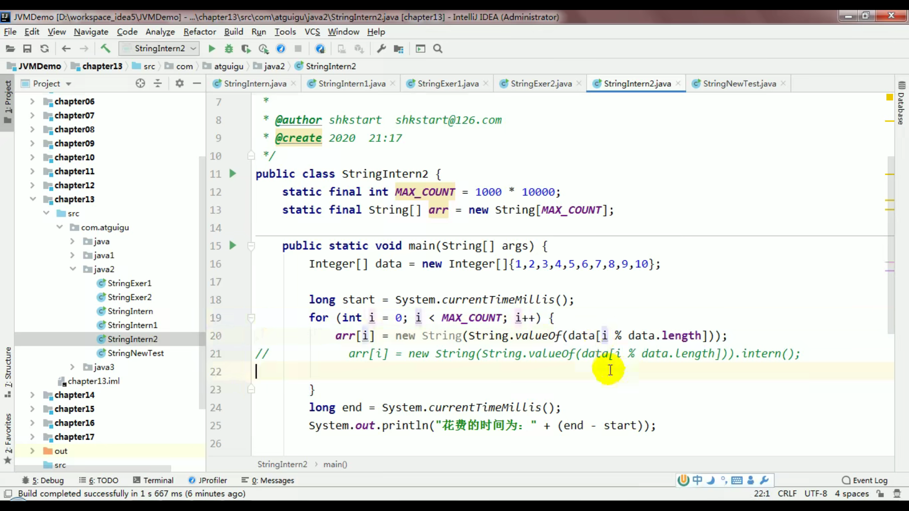

### 深拷贝和浅拷贝

[博客地址](https://www.cnblogs.com/shakinghead/p/7651502.html)

#### 浅拷贝：引用类型的属性指向的是同一个地址

字段如果是引用类型，指向的是同一个地址，如果是基本数据类型则重新复制一份

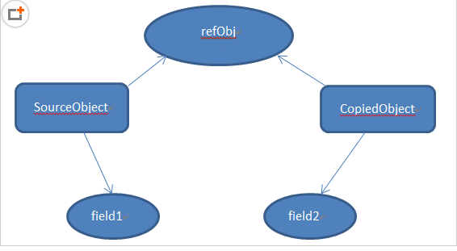

实现方式一：**拷贝构造方法**指的是该类的构造方法参数为该类的对象。使用拷贝构造方法可以很好地完成浅拷贝，直接通过一个现有的对象创建出与该对象属性相同的新的对象

```java
/* 拷贝构造方法实现浅拷贝 */
public class CopyConstructor {
    public static void main(String[] args) {
        Age a=new Age(20);
        Person p1=new Person(a,"摇头耶稣");
        Person p2=new Person(p1);
        System.out.println("p1是"+p1);
        System.out.println("p2是"+p2);
        //修改p1的各属性值，观察p2的各属性值是否跟随变化
        p1.setName("小傻瓜");
        a.setAge(99);
        System.out.println("修改后的p1是"+p1);
        System.out.println("修改后的p2是"+p2);
    }
}

class Person{
    //两个属性值：分别代表值传递和引用传递
    private Age age;
    private String name;
    public Person(Age age,String name) {
        this.age=age;
        this.name=name;
    }
    //拷贝构造方法
    public Person(Person p) {
        this.name=p.name;
        this.age=p.age;
    }
    
    public void setName(String name) {
        this.name=name;
    }
    
    public String toString() {
        return this.name+" "+this.age;
    }
}

class Age{
    private int age;
    public Age(int age) {
        this.age=age;
    }
    
    public void setAge(int age) {
        this.age=age;
    }
    
    public int getAge() {
        return this.age;
    }
    
    public String toString() {
        return getAge()+"";
    }
}
```

实现方式二：**重写clone()方法:**

```java
/* clone方法实现浅拷贝 */
public class ShallowCopy {
    public static void main(String[] args) {
        Age a=new Age(20);
        Student stu1=new Student("摇头耶稣",a,175);
        
        //通过调用重写后的clone方法进行浅拷贝
        Student stu2=(Student)stu1.clone();
        System.out.println(stu1.toString());
        System.out.println(stu2.toString());
        
        //尝试修改stu1中的各属性，观察stu2的属性有没有变化
        stu1.setName("大傻子");
        //改变age这个引用类型的成员变量的值
        a.setAge(99);
        //stu1.setaAge(new Age(99));    使用这种方式修改age属性值的话，stu2是不会跟着改变的。因为创建了一个新的Age类对象而不是改变原对象的实例值
        stu1.setLength(216);
        System.out.println(stu1.toString());
        System.out.println(stu2.toString());
    }
}

/*
 * 创建年龄类
 */
class Age{
    //年龄类的成员变量（属性）
    private int age;
    //构造方法
    public Age(int age) {
        this.age=age;
    }
    
    public int getAge() {
        return age;
    }
    
    public void setAge(int age) {
        this.age = age;
    }
    
    public String toString() {
        return this.age+"";
    }
}
/*
 * 创建学生类
 */
class Student implements Cloneable{
    //学生类的成员变量（属性）,其中一个属性为类的对象
    private String name;
    private Age aage;
    private int length;
    //构造方法,其中一个参数为另一个类的对象
    public Student(String name,Age a,int length) {
        this.name=name;
        this.aage=a;
        this.length=length;
    }
    //eclipe中alt+shift+s自动添加所有的set和get方法
    public String getName() {
        return name;
    }

    public void setName(String name) {
        this.name = name;
    }
    
    public Age getaAge() {
        return this.aage;
    }
    
    public void setaAge(Age age) {
        this.aage=age;
    }
    
    public int getLength() {
        return this.length;
    }
    
    public void setLength(int length) {
        this.length=length;
    }
    //设置输出的字符串形式
    public String toString() {
        return "姓名是： "+this.getName()+"， 年龄为： "+this.getaAge().toString()+", 长度是： "+this.getLength();
    }
    //重写Object类的clone方法
    public Object clone() {
        Object obj=null;
        //调用Object类的clone方法，返回一个Object实例
        try {
            obj= super.clone();
        } catch (CloneNotSupportedException e) {
            e.printStackTrace();
        }
        return obj;
    }
}
```

#### 深拷贝：引用类型的属性也重新拷贝一份

实现方式一：**重写clone方法**

**对象图**的概念。设想一下，一个类有一个对象，其成员变量中又有一个对象，该对象指向另一个对象，另一个对象又指向另一个对象，直到一个确定的实例。这就形成了对象图。那么，对于深拷贝来说，不仅要复制对象的所有基本数据类型的成员变量值，还要为所有引用数据类型的成员变量申请存储空间，并复制每个引用数据类型成员变量所引用的对象，直到该对象可达的所有对象。也就是说，对象进行深拷贝要**对整个对象图进行拷贝**！

解决方法是使用递归，引用类型的字段也进行递归clone

为对象图的**每一层的每一个对象都实现Cloneable接口并重写clone方法**，最后在最顶层的类的重写的clone方法中调用所有的clone方法即可实现深拷贝。简单的说就是：每一层的每个对象都进行浅拷贝=深拷贝

```java
package linearList;
/* 层次调用clone方法实现深拷贝 */
public class DeepCopy {
    public static void main(String[] args) {
        Age a=new Age(20);
        Student stu1=new Student("摇头耶稣",a,175);
        
        //通过调用重写后的clone方法进行浅拷贝
        Student stu2=(Student)stu1.clone();
        System.out.println(stu1.toString());
        System.out.println(stu2.toString());
        System.out.println();
        
        //尝试修改stu1中的各属性，观察stu2的属性有没有变化
        stu1.setName("大傻子");
        //改变age这个引用类型的成员变量的值
        a.setAge(99);
        //stu1.setaAge(new Age(99));    使用这种方式修改age属性值的话，stu2是不会跟着改变的。因为创建了一个新的Age类对象而不是改变原对象的实例值
        stu1.setLength(216);
        System.out.println(stu1.toString());
        System.out.println(stu2.toString());
    }
}

/*
 * 创建年龄类
 */
class Age implements Cloneable{
    //年龄类的成员变量（属性）
    private int age;
    //构造方法
    public Age(int age) {
        this.age=age;
    }
    
    public int getAge() {
        return age;
    }
    
    public void setAge(int age) {
        this.age = age;
    }
    
    public String toString() {
        return this.age+"";
    }
    
    //重写Object的clone方法
    public Object clone() {
        Object obj=null;
        try {
            obj=super.clone();
        } catch (CloneNotSupportedException e) {
            e.printStackTrace();
        }
        return obj;
    }
}
/*
 * 创建学生类
 */
class Student implements Cloneable{
    //学生类的成员变量（属性）,其中一个属性为类的对象
    private String name;
    private Age aage;
    private int length;
    //构造方法,其中一个参数为另一个类的对象
    public Student(String name,Age a,int length) {
        this.name=name;
        this.aage=a;
        this.length=length;
    }
    public String getName() {
        return name;
    }

    public void setName(String name) {
        this.name = name;
    }
    
    public Age getaAge() {
        return this.aage;
    }
    
    public void setaAge(Age age) {
        this.aage=age;
    }
    
    public int getLength() {
        return this.length;
    }
    
    public void setLength(int length) {
        this.length=length;
    }
    public String toString() {
        return "姓名是： "+this.getName()+"， 年龄为： "+this.getaAge().toString()+", 长度是： "+this.getLength();
    }
    //重写Object类的clone方法
    public Object clone() {
        Object obj=null;
        //调用Object类的clone方法——浅拷贝
        try {
            obj= super.clone();
        } catch (CloneNotSupportedException e) {
            e.printStackTrace();
        }
        //调用Age类的clone方法进行深拷贝
        //先将obj转化为学生类实例
        Student stu=(Student)obj;
        //学生类实例的Age对象属性，调用其clone方法进行拷贝
        stu.aage=(Age)stu.getaAge().clone();
        return obj;
    }
}
```

实现方式二：通过**对象序列化和反序列化**

注意对象得实现serizable, 但transient修饰的属性不能序列化

```java
import java.io.ByteArrayInputStream;
import java.io.ByteArrayOutputStream;
import java.io.IOException;
import java.io.ObjectInputStream;
import java.io.ObjectOutputStream;
import java.io.Serializable;

/* 通过序列化实现深拷贝 */
public class DeepCopyBySerialization {
    public static void main(String[] args) throws IOException, ClassNotFoundException  {
        Age a=new Age(20);
        Student stu1=new Student("摇头耶稣",a,175);
        //通过序列化方法实现深拷贝
        ByteArrayOutputStream bos=new ByteArrayOutputStream();
        ObjectOutputStream oos=new ObjectOutputStream(bos);
        oos.writeObject(stu1);
        oos.flush();
        ObjectInputStream ois=new ObjectInputStream(new ByteArrayInputStream(bos.toByteArray()));
        Student stu2=(Student)ois.readObject();
        System.out.println(stu1.toString());
        System.out.println(stu2.toString());
        System.out.println();
        //尝试修改stu1中的各属性，观察stu2的属性有没有变化
        stu1.setName("大傻子");
        //改变age这个引用类型的成员变量的值
        a.setAge(99);
        stu1.setLength(216);
        System.out.println(stu1.toString());
        System.out.println(stu2.toString());
    }
}

/*
 * 创建年龄类
 */
class Age implements Serializable{
    //年龄类的成员变量（属性）
    private int age;
    //构造方法
    public Age(int age) {
        this.age=age;
    }
    
    public int getAge() {
        return age;
    }
    
    public void setAge(int age) {
        this.age = age;
    }
    
    public String toString() {
        return this.age+"";
    }
}
/*
 * 创建学生类
 */
class Student implements Serializable{
    //学生类的成员变量（属性）,其中一个属性为类的对象
    private String name;
    private Age aage;
    private int length;
    //构造方法,其中一个参数为另一个类的对象
    public Student(String name,Age a,int length) {
        this.name=name;
        this.aage=a;
        this.length=length;
    }
    //eclipe中alt+shift+s自动添加所有的set和get方法
    public String getName() {
        return name;
    }

    public void setName(String name) {
        this.name = name;
    }
    
    public Age getaAge() {
        return this.aage;
    }
    
    public void setaAge(Age age) {
        this.aage=age;
    }
    
    public int getLength() {
        return this.length;
    }
    
    public void setLength(int length) {
        this.length=length;
    }
    //设置输出的字符串形式
    public String toString() {
        return "姓名是： "+this.getName()+"， 年龄为： "+this.getaAge().toString()+", 长度是： "+this.getLength();
    }
}
```

### maven

##### dependencyManagement

```
子项目中引用一个依赖而不用显示的列出版本号。Maven会沿着父子层次向上走，直到找到一个拥有dependencyManagement元素的项目，然后它就会使用在这个dependencyManagement元素中指定的版本号。

dependencyManagement里只是声明依赖，并不实现引入，因此子项目需要显示的声明需要用的依赖。如果不在子项目中声明依赖，是不会从父项目中继承下来的；只有在子项目中写了该依赖项，并且没有指定具体版本，才会从父项目中继承该项，并且version和scope都读取自父pom;另外如果子项目中指定了版本号，那么会使用子项目中指定的jar版本。
```

##### dependencies

```
相对于dependencyManagement，所有生命在dependencies里的依赖都会自动引入，并默认被所有的子项目继承。
```

### command line is too long. shorten command line for xxx

```
.idea 
在 workspace.xml 文件中搜索：

<component name="PropertiesComponent">
1
在这块配置中加上一条：

<property name="dynamic.classpath" value="true" />
```

### Java Web

#### webapp中的jsp文件访问静态类

webapp中的jsp文件访问不到java下的静态成员frame.jsp访问不到		Constants.USER_SESSION

#### maven的jsp依赖

```xml
<dependency>
  <groupId>javax.servlet.jsp</groupId>
  <artifactId>javax.servlet.jsp-api</artifactId>
  <version>2.3.1</version>
  <scope>provided</scope>
</dependency>

<dependency>
  <groupId>javax.servlet</groupId>
  <artifactId>javax.servlet-api</artifactId>
  <version>3.1.0</version>
  <scope>provided</scope>
</dependency>
```

#### jsp异常报错

1. 报错信息

   ```java
   catalina.loader.WebappClassLoaderBase.checkThreadLocalsForLeaks
   ```

2. 在Java 9上运行时，需要在JVM命令行参数中添加“-add opens=Java.base/Java.

3. **原因**：

   - 一个tomcat启动了两个进程。
   - sh shutdown.sh不能完全杀死tomcat或者是不能立马杀死tomcat
   - tomcat的con/server.xml中的context属性reloadable默认为true导致。

#### ${name}无法解析

或者The content of element type "web-app" must match "(icon?,display-name?,description?,

1. **解决**：web.xml版本过低导致不能解析，web-app换成下面高级版本就行

```java
<?xml version="1.0" encoding="UTF-8"?>
<web-app version="3.0" xmlns="http://java.sun.com/xml/ns/javaee"
         xmlns:xsi="http://www.w3.org/2001/XMLSchema-instance"
         xsi:schemaLocation="http://java.sun.com/xml/ns/javaee
	http://java.sun.com/xml/ns/javaee/web-app_3_0.xsd">
```

#### $pagecontext无法解析

1. **解决**：在jsp页面头部加上

```
<%@ page language="java" contentType="text/html; charset=utf-8" pageEncoding="utf-8" isELIgnored="false"%>
```

#### 解决端口占用

```
#查询出8080端口被那些进程占用着
netstat -ano | findstr 8080
#关闭进程
tasklist | findstr <进程号>
#强制关闭
taskkill -PID <进程号> -F
```

#### HttpServletResponse

NoClassDefFoundError

```java
javax/servlet/http/HttpServletResponse NoClassDefFoundError
```

1. 打开file--ProjectStructure--Libraries
2. 添加tomcat安装目录下lib目录下的Servlet-api.jar包，问题就解决了

#### tomcat10一些莫名奇妙的错误

1. 可能就是tomcat10 需要jakarta,然而jakarta和javax可能许多内容不兼容，所以导致出错
2. 可以降低tomcat为9或8

#### Error java 错误 不支持发行版本5

1. 用maven模板maven-archetype-web-app创建即可解决

#### /**  和 / 等的区别

?    匹配任何单字符         

/  当前页面

/*    匹配0或者任意数量的字符         

/**    匹配0或者更多的目录 

post处理视图解析之前执行


#### jsp访问本地页面


requestMpaping(produces="utf8")解决中文乱码


内容协商：

messageconverter 

获取客户端的accept: xml;q=0.9 json;q=0.8之类

获取服务器能生产的producible 

 进行最佳匹配。能生产什么记得导相应坐标，比如xml得自己导

```xml
 <dependency>
     <groupId>com.fasterxml.jackson.dataformat</groupId>
     <artifactId>jackson-dataformat-xml</artifactId>
</dependency>
```


可以使用@Ordered(int)来设置优先级

## JVM

### 垃圾回收

吞吐量：用户线程/（运行用户代码时间+运行垃圾收集时间）。


标记清除算法（低延迟）

- 从跟集合扫描，标记存活的对象。标记完毕后，再扫描整个空间未标记的对象进行回收。

- 只对未存活对象进行处理，因此适合老年代存活对象比较多的。由于直接清除未存活对象，会造成内存碎片。
- CMS（低延迟）

复制算法

- 在开始时把堆分成一个对象面和空闲面，当对象满了，扫描GC Root标记存活对象，复制到空闲面。
- 直接复制存活对象，因此适合新生代朝生夕死比较多的对象。但会浪费一半的空间。
- Serial，ParNew，Parallel Scavenge（可控制的吞吐量）

标记整理算法（吞吐量高，因为内存分配频率比垃圾回收高）

- 采用和标记清除算法一样的方式标记存活对象，但在清除的时候不同，在回收不存活对象后，会将所有存活对象往左端移动，并更新对应的指针
- 成本较高，但不会产生内存碎片问题
- SerialOld，Parallel Old


JVM系统线程：GC 编译 信号 中断任务调度 虚拟机线程（stop word 栈回收）


如何确定是垃圾

引用计数，可达性分析（GCRoot对象)

每次死一堆：用复制算法

存活率高的，如老年代：标记清除或压缩算法，因为只标记活的，然后清除少量死对象

ParNew就是serial的多线程版本，parScange是采用多线程复制，重点在吞吐量（用户线程占cpu的时间）

Serial-old cms parold

Cms:初始标记（stop），并发标记，重新标记（stop），并发清除,

最前沿就是g1 他比较复杂，比较智能，可根据规定的时间，最大努力清楚最多的空间

### 强软弱虚引用

软引用：不够再回收

弱引用：下一次垃圾回收就收

### HotSpot

热点代码探测技术

- 通过计数器找到最具编译价值代码，触发即时编译或栈上替换
- 通过编译器与解释器协同工作，在最优化的程序响应时间与最佳执行性能中取得平衡
- 备注：现代编译器雏形：解释器（一行一行解释，有很好的响应时间，但性能慢）+即时编译器（把经常要用到的代码先编译成机器语言，以提高性能）之间取得平衡


### 类加载子系统

**加载->链接（验证，准备，解析）->初始化**


#### 一、加载load：

将字节码文件加载成方法区的运行时数据结构

#### 二、链接linking

1. 验证（Verify）：文件格式验证等

2. 准备(Prepare)：

   2.1 static类变量**分配内存**和**默认初始值**（零值）

   2.2 static+final修饰的基本数据类型或String类型**显示初始化**（final在编译的时候就会分配）

3. 解析(Resolve）

   常量池的符 b  号引用替换为直接引用

#### 三、初始化initialize

静态变量和静态代码块显示初始化，即执行 clinit() 方法


### 触发类的加载

- 访问**类变量**或类方法会触发类加载
- 其它启动类的main方法，new对象，创建子类对象，反射class.forName


注意事项

```
注意访问编译期常量不会触发类加载(final修饰的基本类型和字符串（用字面量赋值）)
```


```
下面是final修饰，但不是编译器常量（因为通过new）
```


```
下面没有用final修饰，连常量都不是
```


```
ClassLoader.loadClass只会加载把类加载JVM,但不会触发初始化
Class.forName则触发类加载和初始化
```


### 父子类加载顺序

父类静态子类静态，父类非静态变量代码块构造，子类非静态变量代码块构造

父类 > 子类

静态 > 非静态

变量 > 代码块 > 构造方法

父类静态成员变量--》父类静态代码块--》子类静态成员变量--》子类静态代码块--》父类非静态成员变量--》父类非静态代码块--》父类构造方法--》子类非静态成员变量--》子类非非静态代码块--》子类构造方法

```
father 静态成员变量
father 静态代码块
Son 静态成员变量
Son 静态代码块
father 非静态成员变量
father 非静态代码块
father 构造方法
Son 非静态成员变量
Son 非静态代码块
son 构造方法
```


```
类加载只会初始化静态变量和静态代码块，非静态代码块是在创建对象的时候初始化的
```


### 双亲委派机制


### 运行时数据区

#### 程序计数器

用来存储指令指向下一条的地址，也即将要执行的指令代码。由执行引擎读取下一条指令。


它程序控制流的指示器，控制分支、异常处理等，存储当前指令的位置，大小很小可忽略不计。没有GC（垃圾回收）和OOM（内存溢出）


**面试题一：使用PC寄存器存储字节码指令地址有什么用**

1. 因为CPU需要不停地切换各个线程，这时候切换回来以后，就得知道从哪开始继续执行。


2. JVM的字节码解释器就需要通过改变PC寄存器存储的值来明确下一条应该执行什么样的字节码指令

**面试题二：PC寄存器为什么会被设定为线程私有**

1. 多线程在特定的时间段内只会执行线程的某一个方法，CPU会不停的做任务切换，这样必然导致经常中断或恢复，如何保证分毫无差？为了能够准确的记录各个线程正在执行的当前字节码地址，最好的方法自然是为每一个线程都分配一个PC寄存器，这样一来各个线程之间便可以进行独立计算，从而不会出现相互干扰的情况。
2. 由于CPU的时间片轮限制，众多线程在并发执行过程中，任何一个确定的时刻，一个处理器或者多核处理器的内核，只会执行某个线程中的一条指令
3. 这样必然导致经常中断或恢复，如何保证分毫无差？每个线程在创建后，都会产生自己的程序计数器和栈帧，程序计数器在各个线程之间互不影响。


#### 虚拟机栈

一个线程对应一个虚拟机栈，栈帧对应一个方法


**面试题：栈可能出现的问题**


##### 局部变量表


##### 操作数栈


栈顶缓存技术


##### 动态链接

指向运行时常量池的方法引用

为什么要常量池？使用方便，符号引用就行


##### 方法返回地址


虚拟机栈五道面试题


#### 堆


##### 堆的核心概述：内存细分


##### 堆空间大小的设置


##### 年轻代与老年代及参数占比


##### 对象分配过程


##### TLAB（Thread Local Allocation Buffer线程私有）

所以堆空间的内容不一定都是共享的


##### 堆空间的参数设置


##### 栈上分配


##### 代码优化之标量替换


#### 方法区

##### 栈、堆、方法区的交互关系


##### 方法区概述


##### 设置方法区内存的大小


##### 方法区内部结构


常量池


##### 常量池


##### 运行时常量池（真实地址）

不再是符号引用


 


##### 指令执行过程


##### 方法区的演进细节


##### 永久代为什么要被元空间替换


##### 方法区的垃圾回收


##### 常见面试题


### 对象的实例化


##### 直接内存


### 执行引擎

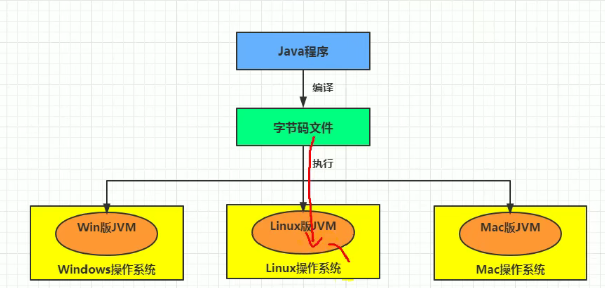


#### 解释器


#### GC


**GC** **Roots**


**对象的finalization机制**


##### CMS()


##### G1


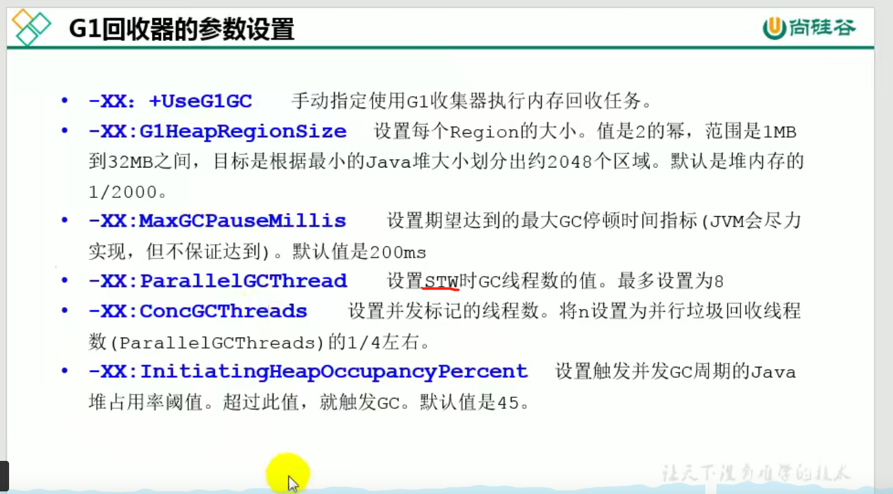


## 操作系统

### 父子进程

子进程是父进程的一个副本，得到父进程的资源副本和所有堆栈数据。

但两者不共享虚拟地址空间，因为是两个独立的进程。


### 上下文切换

1. **内存管理**上下文。 包括加载页表、刷出地址转换后备缓冲器，向内存管理单元提供新的信息。
2. **页表切换**，这就是重新装载全局页表，用于**给进程安装一个新的虚拟地址空间**。
3. 由于进程的栈都在内核态，所以**切换内核态堆栈上下文数据**。
4. 硬件上下文，主要部分就是**进程和CPU的任务状态寄存器**，就是TSS中的字段。在这里CPU为了减轻很多切换的工作，很多地方都是如果有必要，就切换，就是所谓的惰性原则。

进程上下文切换：

保存CPU寄存器和程序计数器

进程状态到PCB中

虚拟内存，内核堆栈


引起上下文切换：

时间片用完

系统资源不足，进程挂起等待资源满足

调用sleep主动挂起

高优先级的进程抢占

硬件中断，CPOU进程挂起，转而执行硬件中断服务程序


进程调度信息，不属于上下文的内容，那是操作系统进程调度的范畴


```
CPU调度的是线程，而不是作业
```


### 文件磁盘分配

文件分配对应于文件的物理结构，是指如何为文件分配磁盘块。常用的磁盘空间分配方 法有三种：连续分配、链接分配和索引分配。

- 顺序分配：顺序 分配方法要求每个文件在磁盘上占有一组连续的块。
- 隐式链接分配： 每个文件对应一个磁盘块的链表；磁盘块分布在磁盘的任何地方，除最后一个盘块外，每一个盘块都有指向下一个盘块的指针，这些指针对用户是透明的。
- 显式链接分配：是指把用于链接文件各物理块的指针，**显式地存放在内存的一张链接表**中。 该表在**整个磁盘仅设置一张**，**每个表项中存放链接指针，即下一个盘块号**。 在该表中，凡是 属于某一文件的第一个盘块号，或者说是每一条链的链首指针所对应的盘块号，均作为文件地址被填入相应文件的FCB的“物理地址”字段中。由于查找记录的过程是在内存中进行 的，因而不仅显著地提高了检索速度，而且大大减少了访问磁盘的次数。由于**分配给文件的所有盘块号都放在该表中**，故称该表为**文件分配表**（File Allocation Table, **FAT)。MS-DOS 采用的就是这种方式**。


### 磁盘调度

**为什么需要磁盘调度算法？**

磁盘调度算法是为了提高磁盘的访问性能，一般是通过优化磁盘的访问请求顺序来做的。其中**寻道是磁盘较为耗时的部分**，因此如果请求顺序得当，可以节省一些不必要的寻道时间。

**寻道算法有几种？**

1、先来先服务 FCFS
根据进程请求的先后顺序进行调度。
优点：**公平**、算法简单，每个进程的请求都可以得到满足，不会出现某进程的长期请求得不到处理的情况。
缺点：没有对寻道算法进行优化，平**均寻道时间可能比较长**。
2、最短寻道时间有限 SSTF
选择要求访问的磁盘与当前磁头所在的磁道距离最近，这样**每次的寻道时间最短**，但不能保证平均寻道时间最短。

可以会来回循环
3、扫描算法 SCAN 电梯算法
优先考虑磁头当前的移动方向，然后是访问的磁道和当前磁道的距离。
4、循环扫描算法 CSCAN

算法 规定磁头只能做**单向移动**，返回时 I confirm that I will attend the online paper test

5、LOOK与C-LOOK算法

LOOK算法和C-LOOK算法分别是对扫描算法和循环扫描算法的优化，优化的思路就是：**磁头在移动到最远的请求位置，然后立刻向反方向移动。**

#### **先来先服务算法**

如果请求的顺序如下：

98，183，37，122，14，124，65，67

那么磁盘的写入顺序如下图：


大量应用进程竞争使用磁道，访问的磁道一般比较分散，这种算法性能低下，寻道时间过长。

#### **最短寻道算法**

该算法优先选择从当前磁头位置所需寻道时间最短的请求，

如果请求的顺序如下：

98，183，37，122，14，124，65，67

那么磁盘的写入顺序为：65，67，37，14，98，122，如下图：


该算法相对于先来先服务寻道时间会减少很多，但是会造成饥饿现象，因为我们的磁盘的请求随时都可能产生，假设后续的请求都是小于183磁道，那么183磁道的请求永远不会被响应，于是就产生了饥饿现象。

#### **扫描算法**（电梯算法）

磁头在一个方向上移动，访问所有未完成的请求，直到磁头到达该方向上的最后的磁道才调换方向。

如果请求的顺序如下：

98，183，37，122，14，124，65，67

假设前进的方向是磁道号减少的方向，那么处理请求的顺序是37，14，0，65，67，98，122，124，183，如下图：


扫描算法虽然不会产生饥饿，但是对于中间部分的磁道来说响应较快，边缘部分响应较慢。

#### **循环扫描算法**

循环扫描算法规定：磁头只能朝某个方向移动，**返回时直接复位磁头**（这个很快），并且返回过程中不处理任何请求。

如果请求的顺序如下：

98，183，37，122，14，124，65，67

假设磁头先朝磁道增加的方向移动，处理请求顺序则是：65，67，98，122，124，183，199，0，14，37，如下图：


循环扫描算法相比于扫描算法，每个磁道的响应频率比较平均。

#### **LOOK与C-LOOK算法**

LOOK算法和C-LOOK算法分别是对扫描算法和循环扫描算法的优化，优化的思路就是：**磁头在移动到最远的请求位置，然后立刻向反方向移动。**

- LOOK算法反向移动途中会响应请求
- C-LOOK反向移动途中不响应请求

### Reactor模式

```
NIO+IO多路复用
```

#### 1.3.2 IO复用

对于accept、connect、read、write等系统调用，实际上都属于慢系统调用，他可能会永远阻塞直到套接字上发生 可读\可写 事件。事实上，通常不希望一直阻塞直到IO就绪，而应该等待IO就绪之后再通知我们过来处理。

IO复用可以通过 select、poll、epoll来实现。这里只简单说下epoll。

epoll就是实现这个功能的，使用epoll只需要三步：

1. 调用epoll_create创建套接字epfd。
2. 调用epoll_ctl 增加需要关心的套接字的事件，如 listenfd的可读事件。
3. 调用epoll_wait沉睡，直到有关心的事件发生后epoll_wait会主动返回,此时我们去处理发生了IO事件的相应套接字即可。


具体的epoll用法这里不再细说。在这里把epoll看成一个黑匣子即可，暂时不关心原理。我们只需要将关心得套接字事件注册到epoll上，epoll就会在这些事件发生时通知我们。

#### 1.4 Reactor模型

讲了这么多，终于轮到Reactor模式登场了。

什么是Reactor模式? Reactor模式又叫反应堆模式，是一种常见的高性能的服务器开发模式，著名的Netty、Redis等软件都使用到了Reactor模式。

Reacor模式是一种事件驱动机制，他逆转了事件处理的流程，不再是主动地等事件就绪，而是它提前注册好的回调函数，当有对应事件发生时就调用回调函数。 由陈硕所述，Reactor即为非阻塞IO + IO复用，单个Reactor的逻辑大致如下

```text
while(!stop) {
    // 1.取得下次定时任务的时间，与设定time_out去较大值，即若下次定时任务时间超过1s就取下次定时任务时间为超时时间，否则取1s
    int time_out = Max(1000, getNextTimerCallback());
    // 2.调用Epoll等待事件发生，超时时间为上述的time_out
    int rt = epoll_wait(epfd, fds, ...., time_out); 
    if(rt < 0) {
        // epoll调用失败。。
    } else {
        if (rt > 0 ) {
            // 3. 以此处理发生IO时间的fd，调用其回调函数
        }
    }
}
```

它的核心思想就是利用IO复用技术来监听套接字上的读写事件，一旦某个fd上发生相应事件，就反过来处理该套接字上的回调函数。

#### 1.4.1 one loop per thread

Reactor模式只是一个框架，它可以由单个线程简单实现，也可以通过线程池实现主从reactor模式。

即一个线程有且只有一个reactor，执行以上loop循环。程序中通常有多个Reactor，例如一种常见的模式是mainReactor只监听connfd连接事件，当发生连接后就交给subReactor去监听IO事件。在这里由于要将新连接交给其他线程的reactor，那么reactor的实现就得是线程安全的。

为什么不能多个线程一个loop？

1. 多个线程进行同一个loop，会导致大量的竞争条件，影响性能，这种做法也没多大意义。
2. 多个线程同时沉睡在同一个epoll_wait上，可能会发生惊群效应。

为什么不能一个线程多个loop

\1. reactor可以认为是一个死循环，一个线程只可能同时执行一个循环就可以了。

#### 1.4.2 单Reactor服务器模型

单Reactor服务器模型就是只有一个主线程运行Reactor。整个线程有一个epoll句柄，用于管理所有的套接字。服务器将listenfd的读事件注册到epoll上，当epoll_wait返回时说明listenfd可读，即有新的连接建立。此时再调用accept函数获取新连接clientfd，然后将clientfd的读写事件也注册到这个epoll上，等待clientfd发生读写事件从epoll_wait返回后，再处理clientfd的事件。


```cpp
// 单Reactor模型
while(!stop) {
    // 1.取得下次定时任务的时间，与设定time_out去较大值，即若下次定时任务时间超过1s就取下次定时任务时间为超时时间，否则取1s
    int time_out = Max(1000, getNextTimerCallback());
    // 2.调用Epoll等待事件发生，超时时间为上述的time_out
    int rt = epoll_wait(epfd, fds, ...., time_out); 
    if(rt < 0) {
        // epoll调用失败。。
    } else {
        if (rt > 0 ) {
          foreach (fd in fds) {
            if (是listenfd的可读事件) {
            // 如果是连接事件
              1. 获取连接 clientfd = accept();
              2. 将clientfd的IO注册到epoll上
            } else {
            // 不是连接事件，那就是clientfd的读写事件，此时需要处理业务逻辑
              dothing(fds[i]）;
            }
          }
          
        }
    }
}
```

对于clienfd发生读写事件后，需要进行业务逻辑处理。业务逻辑处理通常是耗时的，这会影响主线程的执行，也就是说主线程会等到 dothing(fds[i])做完之后才进入下一次循环过程。

加入线程池可以一定程度上优化：

```text
// 单Reactor + 线程池模型
while(!stop) {
    // 1.取得下次定时任务的时间，与设定time_out去较大值，即若下次定时任务时间超过1s就取下次定时任务时间为超时时间，否则取1s
    int time_out = Max(1000, getNextTimerCallback());
    // 2.调用Epoll等待事件发生，超时时间为上述的time_out
    int rt = epoll(epfd, fds, ...., time_out); 
    if(rt < 0) {
        // epoll调用失败。。
    } else {
        if (rt > 0 ) {
          foreach (fd in fds) {
            if (是listenfd的可读事件) {
            // 如果是连接事件
              1. 获取连接 clientfd = accept();
              2. 将clientfd的IO注册到epoll上
            } else {
            // 不是连接事件，那就是clientfd的读写事件，此时需要处理业务逻辑
              // 1.线程池里面取一个线程
              // 2.用该线程处理这个套接字上的业务逻辑
              thread = threadpoll.get();
              thread.dothing(fd[i]);
            }
          }
          
        }
    }
}
```

将业务逻辑处理也可以交给线程池来做，主线程继续进行Reactor循环。从而很大程度上减小了主线程的负担，提高并发量。这就是单Reactor+线程池的模型。

#### 1.4.3 主从Reactor服务器模型

单Reactor模式+线程池能够很大程度上支持并发了，但还可以优化。注意到单Reactor模式只有一个Reactor线程，所有的关心套接字都需要注册到这个Reactor上。可以看到，这个主线程的Reactor既要负责客户端连接事件的处理(即关心listenfd的事件)，又要关心已连接套接字的事件（即关心clientfd的io事件）。


能不能用多个Reactor，其中一个Reactor只监听listenfd，获取到新连接后就把clientfd甩给其他Reactor来监听呢？

这就是主从Reactor模式：


服务器有一个mainReactor和多个subReactor。

mainReactor由主线程运行，他作用如下：通过epoll监听listenfd的可读事件，当可读事件发生后，调用accept函数获取clientfd，然后随机取出一个subReactor，将cliednfd的读写事件注册到这个subReactor的epoll上即可。也就是说，mainReactor只负责建立连接事件，不进行业务处理，也不关心已连接套接字的IO事件。

subReactor通常有多个，每个subReactor由一个线程来运行。subReactor的epoll中注册了clientfd的读写事件，当发生IO事件后，需要进行业务处理。

### Ext3

**1、高可用性**
系统使用了ext3文件系统后，即使在非正常关机后，系统也不需要检查文件系统。宕机发生后，恢复ext3文件系统的时间只要数十秒钟。
**2、数据的完整性**
ext3文件系统能够极大地提高文件系统的完整性，避免了意外宕机对文件系统的破坏。在保证数据完整性方面，ext3文件系统有2种模式可供选择。其中之一就是“同时保持文件系统及数据的一致性”模式。采用这种方式，你永远不再会看到由于非正常关机而存储在磁盘上的垃圾文件。
**3、文件系统的速度**
尽管使用ext3文件系统时，有时在存储数据时可能要多次写数据，但是，从总体上看来，ext3比ext2的性能还要好一些。这是因为ext3的日志功能对磁盘的驱动器读写头进行了优化。所以，文件系统的读写性能较之Ext2文件系统并来说，性能并没有降低。
**4、数据转换**
由ext2文件系统转换成ext3文件系统非常容易，只要简单地键入两条命令即可完成整个转换过程，用户不用花时间备份、恢复、格式化分区等。用一个ext3文件系统提供的小工具tune2fs，它可以将ext2文件系统轻松转换为ext3日志文件系统。另外，ext3文件系统可以不经任何更改，而直接加载成为ext2文件系统。
**5、多种日志模式**
Ext3有多种日志模式，一种工作模式是对所有的文件数据及metadata（定义文件系统中数据的数据,即数据的数据）进行日志记录（data=journal模式）；另一种工作模式则是只对metadata记录日志，而不对数据进行日志记录，也即所谓data=ordered或者data=writeback模式。系统管理人员可以根据系统的实际工作要求，在系统的工作速度与文件数据的一致性之间作出选择。

### 死锁

死锁：在多道程序设计环境下，多个进程可能竞争一定数量的资源，。一个进程申请资源，如果资源不可用，那么进程进入等待状态。如果所申请的资源被其他等待进程占有，那么该等待的进程有可能无法改变状态，这种情况下称之为死锁。

**死锁的四个条件：**

- 互斥：**至少有一个资源**必须处在**非共享**模式，即一次只能有一个进程使用，如果另一进程申请该资源，那么申请进程必须延迟直到该资源释放为止。

- 占有并等待：一个进程必须**占有**至少一个资源，并**等待**另一个资源，而该资源为其他进程所占有。

- 非抢占：**资源不能被抢占**
- 循环等待：有一组进程{P0,P1,...Pn},P0等待的资源被P1占有，P1等待的资源被P2占有，Pn-1等待的资源被Pn占有，Pn等待的资源被P0占有。

形成死锁必须要满足这四个条件。那么违背这几个条件中的任何一个就不会形成死锁，这种方式成为 死锁预防，而死锁避免是动态的检测分配资源的状态是否安全

**死锁解决方式**

1. 死锁预防

2. 死锁避免

3. 死锁检测并恢复

三者处理死锁的方式可以类比为：死锁预防，直接铲平坑；死锁避免，直接跳过坑；死锁检测并恢复，摔到坑里，修正一下继续前行。

- 对于互斥而言：有的资源本身就是互斥的，所以通常无法破坏这一必要条件。

- 对于占有并等待：破坏它，可以指定这样的规则（协议）：每一个进程执行前一次性申请完所有资源。或者 每个进程申请当前所需要的资源，当需要使用其他资源时，需要把之前申请的资源释放掉。前者可以理解为破坏**等待**，后者可以理解为破坏**占有**。这样做使得资源得利用率很低（最后阶段可能需要用一下打印机，而将其在整个运行期占有）；对于优先级低得进程来说，多次释放资源很容易造成它们饥饿。

- 对于非抢占：破坏它，即对于已经分配的资源可以进行抢占。当一个优先级比较低，那么它的资源往往会被优先级高得剥夺，导致它饥饿。

- 对于循环等待：对所有资源类型进排序，要求每个进程按照资源编号递增顺序申请资源。可以用反证法证明。简要描述一下，在进程按照资源编号递增顺序申请资源的条件下，假设一个循环等待存在，即有一组进程{P0,P1,...Pn},P0等待的资源被P1占有，P1等待的资源被P2占有，Pn-1等待的资源被Pn占有，Pn等待的资源被P0占有。那么Pi+1占有了Ri资源，同时又申请Ri+1，所以资源Ri的编号必然小于Ri+1，那么R0的编号小于R1的....Rn资源的编号小于R0资源的编号（Pn进程）。根据传递性，R0的编号小于R0的编号，显然矛盾，因此，在上述条件下，不会产生循环等待。

### 进程线程协程

进程

系统资源分配和独立运行的基本单位。
进程控制块（PCB），用来描述进程的


线程

轻型进程，CPU调度的基本单位。

与自己独立的寄存器和栈，切换开销小

共享地址空间和文件等资源，所以不用进行页表切换

线程之间传递数据不需要经过内核态

减少并发执行的时间和空间开销


线程的实现

(1)用户级线程
存在用户空间，被用户进程进行创建和调度，无需切换内核，切换速度快，只有当系统调用时，才会映射到内核控制线程LWP(Light Weight Process)

进程内没有特权进行线程切换，所以只能等线程自己执行完

(2)内核级线程
内核线程是由操作系统管理的，线程对应的 TCB 自然是放在操作系统里的，这样线程的创建、终止和管理都是由操作系统负责。

进程的三种基本状态：
（1）就绪（Ready）: 得到Cpu以外的所有资源，会存入就绪队列
（2）运行（running）: 获得CPU正在执行
（3）阻塞（Block）: 运行中的线程IO请求或申请资源失败，会进入阻塞队列

引入挂起操作
（1）用户自己要停止进程查看问题
（2）父进程要修改子进程
（3）系统自己操作，进行负荷调节，系统繁忙，挂起一些不重要的进程

进程如何创建
（1）申请一个空白PCB
（2）分配运行所需要的资源，如内存、文件、IO设备、CPU
（3）初始化PCB,比如设置进程为就绪状态或静止就绪状态，优先级，程序计数器指向程序入口地址，栈指针指向栈顶

PCB：保存进程的控制和管理信息
（1）外部标识符（用户提供），内部标识符（OS设置的序号）
（2）进程调度信息：比如当前进程状态（以等待CPU多长时间，已执行多长时间）优先级等
（3）进程控制信息：进程同步和通信机制存放在PCB，比如消息对列指针和信号量，下一个PCB的指针

**进程的同步**：信号量和管程（Monitors）
管程：定义公共的数据结构如消息队列，主要进行同步操作
操作系统内核
简介：常用设备的驱动程序，一些频率高的模块如时钟管理和进程调度，他们常驻内存。
作用：比较保护他们防止被破坏，同时提高OS的运行效率。
终止进程：正常结束，异常退出（越界，算术异常等）


1、协程只是一个特殊的函数，是用户态，只是能在某个地方挂起，并且可以在挂起处外继续运行，所以不会太消耗资源
2、进程是内核态，进程包括CPU，数据和PCB进程控制块

A正确  协程不是被操作系统内核所管理的，而是完全由程序所控制，也就是在用户态执行，所以A正确。这样带来的好处是性能大幅度的提升，因为不会像线程切换那样消耗资源。
B正确 操作系统进行资源管理的最小单位是进程，操作系统的最小调度单位是线程，进程给线程提供执行环境。
C错误 协程不是进程也不是线程，而是一个特殊的函数，这个函数可以在某个地方挂起，并且可以重新在挂起处外继续运行。所以说，协程与进程、线程相比并不是一个维度的概念。
D正确  一个进程中可以有多个线程，而线程独有的资源有栈和寄存器和线程局部存储，简称TLS，其实就是个线程私有的全局变量。


### 进程通信方式

进程用户地址空间是相互隔离的，所以要通信要经过内核

#### 1、管道

匿名管道

没有名称，本质是**内核的一段缓存**，只能单向通信，数据是**无格式的字节流**且大小受限，符合先进先出，生命周期跟进程一样

通过调用pipe得到读写描述符进行，由于存在同一个进程中，所以匿名管道只用于父子进程通信，子进程会复制父进程的文件描述符。

命名管道

可进行不同进程的通信，提前建立了类型为管道的设备文件，访问这个设备文件就可以通信

#### 2、消息队列

保存在内核的**消息链表**，使用用户**自定义数据类型**的消息体为单位传递数据，**发送消息后就可以返回**，读完就删除消息

消息队列**通信不及时**，**消息大小有限制**，内核态到用户态的**消息拷贝开销**

需要主动释放消息队列，如果没有释放消息队列进程终止也还会继续存在

#### 3、共享内存

**解决了数据拷贝的开销**，通过虚拟地址，映射到一块公共的物理内存空间，即共享内存

一个进程读写，另外进程就能够快速看到，**通信速度快**

#### 4、信号量

由于共享内存操作同块内存，所以会有互相覆盖的危险，所以需要信号量来进行同步。

一个**整形计数器**表示资源的数量，实现互斥操作，通过PV原子操作控制信号量

- **P操作**需要减少信号量，如果<0表明资源已被占用，需要阻塞等待。相减后>=0，表明还有资源，进程可继续运行

- **V操作**增加信号量，相加后<=0表明有进程处于阻塞，需要唤醒操作。相加后>0表明当前没有阻塞的进程

  

#### 5、信号

信号是进程间通信的唯一异步通信机制，可以在任何时候发送信号给某一进程，用户进程收到信号有如下几种处理方式：

忽略信号。SIGKILL和SIGSTOP无法捕捉和忽略，用于任何时候中断或结束某一进程。

执行默认操作。每种信号都规定了默认操作

捕捉信号。我们可以为信号定义一个信号处理函数。当信号发生时，我们就执行相应的信号处理函数。

kill -9就是SIGKILL信号

Ctrl+C产生SIGTINT信号，终止进程

Ctrl+Z产生SIGISTP信号，停止进程

#### 6、Socket

要想跨网络与不同主机通信，就需要Socket通信。

前面提到的管道、消息队列、共享内存、信号量和信号都是在同一台主机上进行进程间通信，那要想**跨网络与不同主机上的进程之间通信，就需要 Socket 通信了。**

实际上，Socket 通信不仅可以跨网络与不同主机的进程间通信，还可以在同主机上进程间通信。

我们来看看创建 socket 的系统调用：

```c
int socket(int domain, int type, int protocal)
```

三个参数分别代表：

- domain 参数用来指定协议族，比如 AF_INET 用于 IPV4、AF_INET6 用于 IPV6、AF_LOCAL/AF_UNIX 用于本机；
- type 参数用来指定通信特性，比如 SOCK_STREAM 表示的是字节流，对应 TCP、SOCK_DGRAM 表示的是数据报，对应 UDP、SOCK_RAW 表示的是原始套接字；
- protocal 参数原本是用来指定通信协议的，但现在基本废弃。因为协议已经通过前面两个参数指定完成，protocol 目前一般写成 0 即可；

根据创建 socket 类型的不同，通信的方式也就不同：

- 实现 TCP 字节流通信： socket 类型是 AF_INET 和 SOCK_STREAM；
- 实现 UDP 数据报通信：socket 类型是 AF_INET 和 SOCK_DGRAM；
- 实现本地进程间通信： 「本地字节流 socket 」类型是 AF_LOCAL 和 SOCK_STREAM，「本地数据报 socket 」类型是 AF_LOCAL 和 SOCK_DGRAM。另外，AF_UNIX 和 AF_LOCAL 是等价的，所以 AF_UNIX 也属于本地 socket；

接下来，简单说一下这三种通信的编程模式。

> 针对 TCP 协议通信的 socket 编程模型


- 服务端和客户端初始化 `socket`，得到文件描述符；
- 服务端调用 `bind`，将绑定在 IP 地址和端口;
- 服务端调用 `listen`，进行监听；
- 服务端调用 `accept`，等待客户端连接；
- 客户端调用 `connect`，向服务器端的地址和端口发起连接请求；
- 服务端 `accept` 返回用于传输的 `socket` 的文件描述符；
- 客户端调用 `write` 写入数据；服务端调用 `read` 读取数据；
- 客户端断开连接时，会调用 `close`，那么服务端 `read` 读取数据的时候，就会读取到了 `EOF`，待处理完数据后，服务端调用 `close`，表示连接关闭。

这里需要注意的是，服务端调用 `accept` 时，连接成功了会返回一个已完成连接的 socket，后续用来传输数据。

所以，监听的 socket 和真正用来传送数据的 socket，是「**两个**」 socket，一个叫作**监听 socket**，一个叫作**已完成连接 socket**。

成功连接建立之后，双方开始通过 read 和 write 函数来读写数据，就像往一个文件流里面写东西一样。

> 针对 UDP 协议通信的 socket 编程模型


UDP 是没有连接的，所以不需要三次握手，也就不需要像 TCP 调用 listen 和 connect，但是 UDP 的交互仍然需要 IP 地址和端口号，因此也需要 bind。

对于 UDP 来说，不需要要维护连接，那么也就没有所谓的发送方和接收方，甚至都不存在客户端和服务端的概念，只要有一个 socket 多台机器就可以任意通信，因此每一个 UDP 的 socket 都需要 bind。

另外，每次通信时，调用 sendto 和 recvfrom，都要传入目标主机的 IP 地址和端口。

> 针对本地进程间通信的 socket 编程模型

本地 socket 被用于在**同一台主机上进程间通信**的场景：

- 本地 socket 的编程接口和 IPv4 、IPv6 套接字编程接口是一致的，可以支持「字节流」和「数据报」两种协议；
- 本地 socket 的实现效率大大高于 IPv4 和 IPv6 的字节流、数据报 socket 实现；

对于本地字节流 socket，其 socket 类型是 AF_LOCAL 和 SOCK_STREAM。

对于本地数据报 socket，其 socket 类型是 AF_LOCAL 和 SOCK_DGRAM。

本地字节流 socket 和 本地数据报 socket 在 bind 的时候，不像 TCP 和 UDP 要绑定 IP 地址和端口，而是**绑定一个本地文件**，这也就是它们之间的最大区别。

### 同步和互斥

#### 同步

线程在某个点互相等待和唤醒操作，比如线程AB互相协助，A等待B处理完唤醒他

##### 1、哲学家就餐问题

哲学家围着就餐，中间只有一把叉子，但每个则学家需要两把叉子才能就餐

方案一：使用信号量解决，奇数先拿左边再拿右边的叉子，偶数先拿右边再拿左边


方案二：只有左右两边都没有进餐，我才可以进餐


比如生**产消费模型**，可使用信号量PV实现同步操作


##### 2、读写问题

「读-读」允许：同一时刻，允许多个读者同时读

「读-写」互斥：没有写者时读者才能读，没有读者时写者才能写

「写-写」互斥：没有其他写者时，写者才能写

读优先锁：读读互斥，读写互斥，当读线程获取锁的时候，另外读线程可以继续获取读锁，可能导致写饥饿

写优先锁：当读获取到锁的时候，写获取锁的时候阻塞，但另外读进程再获取读锁的时候会阻塞

读写公平锁：把所有获取锁的都用队列存起来，按先进先出加锁

方案二：使用一个信号量falg解决,防止读者无线读叠加，避免了读写饥饿问题


而这里 `flag` 的作用就是阻止读者的这种特殊权限（特殊权限是只要读者到达，就可以进入读者队列）。

比如：开始来了一些读者读数据，它们全部进入读者队列，此时来了一个写者，执行 `P(falg)` 操作，使得后续到来的读者都阻塞在 `flag` 上，不能进入读者队列，这会使得读者队列逐渐为空，即 `rCount` 减为 0。

这个写者也不能立马开始写（因为此时读者队列不为空），会阻塞在信号量 `wDataMutex` 上，读者队列中的读者全部读取结束后，最后一个读者进程执行 `V(wDataMutex)`，唤醒刚才的写者，写者则继续开始进行写操作

#### 互斥

临界区同一时刻只允许一个线程进行访问

使用加锁或信号量实现

### 中断

```
异步的时间处理机制，提高CPU并发效率，系统调用的实现方式，比如IO中断

作用：
提高处理器效率，利用中断功能，处理器在IO操作执行过程中执行其它程序，实现并发

分类：
一、IO中断，让CPU执行其它线程，不用干等，提高了CPU的使用效率
二、程序中断（系统调用）：系统调用是通过中断实现，CPU响应中断，切换内核态进行中断处理程序运行
三、时钟中断
四、硬件失效中断（运算溢出、访问越界、被0除）
```

MMU进程隔离，保护内核

内核：线程调度，文件管理，驱动程序，网络支持

不让用户执行一些特权指令

```
DMA直接内存读取，发一个命令（包含IP设备地址、是否一次读写、字节数）给它就行，处理器继续其它工作。传送完成，DMA发送中断信号给处理器就行了
```

高速缓存：根据局部性原理，把一小部分的指令集合加载到告诉缓存中，匹配CPU的处理速度

### 页面置换算法

LRU(Least Recently Used) 最近最少使用算法

### 补码和原码

```
正数补码是本身
负数补码是各位取反（不包括符号位），末位加一
```

**计算机只有加法**

```
1-1=1原+（-1）原=1（补）+（-1）补=（）补=（）原
```

**为什么byte是-128至127**

```
+0 0000 0000  补码：0000 0000
-0 1000 0000  补码：0000 0000（溢出）
根据补码原则0000 0000表示0，1000 0000却不能表示0（没有-0这种东西），
既然1000 0000谁要表示不了，那就表示-128吧
```

常规文件读将文件页拷贝到也缓存

#### vim set nu显示行号

#### 容器重启命令

```
docker restart ` docker ps -a | grep "health-" | awk '{print $1}'`
```

### 关机命令

重启：shutdown -r 、reboot、init 6 

关机：shutdown -h 、 halt、init 0

#### 一、Linux 的五个关机重启命令

　　1、shutdown

　　2、poweroff

　　3、init

　　4、reboot

　　5、halt

#### 二、具体说明

　　在linux下一些常用的关机/重启命令有shutdown、halt、reboot、及init，它们都可以达到重启系统的目的，但每个命令的内部工作过程是不同的。

##### 　　1. shutdown

　　shutdown命令安全地将系统关机。 有些用户会使用直接断掉电源的方式来关闭linux，这是十分危险的。因为linux与windows不同，其后台运行着许多进程，所以强制关机可能会导致进程的数据丢失﹐使系统处于不稳定的状态﹐甚至在有的系统中会损坏硬件设备。而在系统关机前使用shutdown命令﹐系统管理员会通知所有登录的用户系统将要关闭。并且login指令会被冻结﹐即新的用户不能再登录。直接关机或者延迟一定的时间才关机都是可能的﹐还可能重启。这是由所有进程〔process〕都会收到系统所送达的信号〔signal〕决定的。这让像vi之类的程序有时间储存目前正在编辑的文档﹐而像处理邮件〔mail〕和新闻〔news〕的程序则可以正常地离开等等。

　　shutdown执行它的工作是送信号〔signal〕给init程序﹐要求它改变runlevel。

　　Runlevel 0被用来停机〔halt〕﹐runlevel 6是用来重新激活〔reboot〕系统﹐而runlevel 1则是被用来让系统进入管理工作可以进行的状态﹔这是预设的﹐假定没有-h也没有-r参数给shutdown。要想了解在停机〔halt〕或者重新开机〔reboot〕过程中做了哪些动作﹐你可以在这个文件/etc/inittab里看到这些runlevels相关的资料。

```
shutdown 参数说明:

　　[-t] 在改变到其它runlevel之前﹐告诉init多久以后关机。

　　[-r] 重启计算器。

　　[-k] 并不真正关机﹐只是送警告信号给每位登录者〔login〕。

　　[-h] 关机后关闭电源〔halt〕。

　　[-c] cancel current process取消目前正在执行的关机程序。所以这个选项当然没有时间参数﹐但是可以输入一个用来解释的讯息﹐而这信息将会送到每位使用者。

　　[-f] 在重启计算器〔reboot〕时忽略fsck。

　　[-F] 在重启计算器〔reboot〕时强迫fsck。

　　[-time] 设定关机〔shutdown〕前的时间。

```

##### 　　2.halt----最简单的关机命令

　　其实halt就是调用shutdown -h。halt执行时﹐杀死应用进程﹐执行sync系统调用﹐文件系统写操作完成后就会停止内核。

　　参数说明:

　　[-n] 防止sync系统调用﹐它用在用fsck修补根分区之后﹐以阻止内核用老版本的超级块〔superblock〕覆盖修补过的超级块。

　　[-w] 并不是真正的重启或关机﹐只是写wtmp〔/var/log/wtmp〕纪录。

　　[-d] 不写wtmp纪录〔已包含在选项[-n]中〕。

　　[-f] 没有调用shutdown而强制关机或重启。

　　[-i] 关机〔或重启〕前﹐关掉所有的网络接口。

　　[-p] 该选项为缺省选项。就是关机时调用poweroff。

##### 　　3.reboot

　　reboot的工作过程差不多跟halt一样﹐不过它是引发主机重启﹐而halt是关机。它 的参数与halt相差不多。

##### 　　4.init

```
语法：init(选项)(参数)

-b：不执行相关脚本而直接进入单用户模式；
-s：切换到单用户模式。

0 停机（千万不能把initdefault 设置为0）
1 单用户模式
2 多用户，没有 NFS(和级别3相似，会停止部分服务)
3 完全多用户模式
4 没有用到
5 x11(Xwindow)
6 重新启动（千万不要把initdefault 设置为6）

```

### 后台运行命令

```
   1. command & ： 后台运行，你关掉终端会停止运行
   2. nohup command & ： 后台运行，你关掉终端也会继续运行
```

### 分布式锁的实现

- 使用数据库的分布式锁
- 使用Redis的setnx和expire
- 基于Zookeeper实现分布式锁

### 电梯调度SCAN

从小到大直到顶再返回

```
根据电梯扫描算法，磁头会一直朝着增加方向走，直到到达磁盘的一端。在到达磁盘的一端后，磁头掉头，再朝着磁盘另一端去扫描。这个过程就跟电梯一样所以叫电梯扫描算法。

```

### 端口访问失败

```
解决：开启安全组，开启防火墙
```

- 查看防火墙所有已开放的端口

  ```bash
  firewall-cmd --list-all
  ```


- 基本使用

  ```bash
  启动与关闭
  systemctl start（stop） firewalld
  查看状态
  systemctl status firewalld
  ```

- 关闭防火墙命令是 

  ```bash
  iptables -P INPUT ACCEPT 
  iptables -P FORWARD ACCEPT 
  iptables -P OUTPUT ACCEPT 
  iptables -F 
  ```


- 给防火墙开启一个端口

  ```bash
  开启端口
  firewall-cmd --zone=public --add-port=3306/tcp --permanent
  重启生效
  firewall-cmd --reload
  ```

- 保存配置

  ```
  service iptables save #保存iptables规则  centOS
  iptables-save > /etc/iptables.up.rules  #保存iptables规则 ubuntu
  ```

- 查看端口号

  ```查看
   iptables -L -n 
  ```

- 查看端口占用情况

  ```
  netstat -ntulp | grep 3306   //查看所有3306端口使用情况
  ```

- centos安装宝塔命令 

  ```bash
  yum install -y wget && wget -O install.sh http://download.bt.cn/install/install.sh && sh install.sh
  ```

- Ubuntu/Deepin安装脚本

  ```bash
  wget -O install.sh http://download.bt.cn/install/install-ubuntu.sh && sudo bash install.sh
  ```

- 切换root用户

  ```bash
  su
  ```


- 查看服务对应的进程

  ```bash
  ps -ef|grep redis
  ```

  

- **lsof命令，用法：lsof -i:端口号，比如redis默认端口号6379，就使用**

  ```bash
  lsof -i:6379
  ```

**windows刷新dns **

```bash
ipconfig /displaydns 
ipconfig /flushdns
```

**hosts目录：C:\Windows\System32\drivers\etc\\hosts**

### 查看IP地址

```
linux：ifconfig
windows：ipconfig # 注意这个是电脑的私有IP，网页看到的才是网关的全球ip
```

### nohup后台运行命令

```bash
# & 表示后台运行
nohup java -jar demo01-0.0.1-SNAPSHOT.jar &
```

### 杀死进程脚本

```
ps -ef|grep XXX|grep -v grep|awk '{printf $2}'|xargs kill -9
或
kill -9 `ps -ef|grep XXX|grep -v grep|awk '{printf $2}'`
```

### 桥连、Nat、仅主机

```
桥接：选择桥接模式的话虚拟机和宿主机在网络上就是平级的关系，相当于连接在同一交换机上。

NAT：NAT模式就是虚拟机要联网得先通过宿主机才能和外面进行通信。

仅主机：虚拟机与宿主机直接连起来
```

### 修改主机名

```
vi /etc/hostname
```


### 虚拟机静态ip设置

[博客](https://blog.csdn.net/qq_36254571/article/details/97146842)

很多人可能在刚开始使用CentOS7的时候，总会发现虚拟机的ip地址随时都会改变。

一、VM平台的配置

1.设置虚拟机的网络连接方式为NAT


2.配置虚拟机的NAT模式具体地址参数

编辑(E)–>虚拟网络编辑器(N)–>更改设置–>选中VMnet8

设置子网IP

由于要设置的地址为192.168.119.121，故在设置子网的时候取前三段，为192.168.119.0

在这里插入图片描述


设置网关

点击NAT设置(S)

在这里插入图片描述


二、 CentOS配置文件配置

首先用 vim /etc/sysconfig/network-scripts/ifcfg-ens33 打开配置文件ifcfg-ens33

修改配置文件中的以下2个属性


再向改配置文件中加入如下代码


IPADDR=192.168.119.121

GATEWAY=192.168.119.2

NETMASK=255.255.255.0

DNS1=8.8.8.8

DNS2=8.8.4.4

IPADDR ：要固定的虚拟机的IP地址，前三位与应主机的ip地址一致

GATEWAY ：之前再VM中设置的网关地址

NETMASK ：广播地址


再向vim etc/resolv.conf中加入

nameserver 8.8.8.8

nameserver 8.8.4.4

nameserver ：定义DNS服务器的IP地址，在此可指定多个DNS服务器，则用户端将会依序提出查询要求。

最后重启网卡

service network restart

检查配置情况

静态IP设置完毕

### 用户

```
su - user #切换用户
su -  # 切换管理员

useradd -d /home/hf hf
password hf
userdel hf

sudo 采用管理员身份执行

# 查看所有用户（组）
cat /etc/passwd
cat /etc/group
```

### 文件系统

为一个文件分配inode节点和目录项

#### 1、inode

磁盘块号（指向数据块）、文件属性（大小，创建时间）

**磁盘**

#### 2、目录项

文件名、目录级联关系

索引节点唯一标识一个文件，所以是目录项和inode是多对一的关系，即多个文件名对于同一个inode文件，这就是硬链接，起到备份的作用

目录也是文件，也是用索引节点唯一标识，和普通文件不同的是，普通文件在磁盘里面保存的是文件数据，而目录文件在磁盘里面保存子目录或文件。

**缓存在内存**

### 文件权限

chmod命令改变文件权限

```
rxw rwx rwx  当前用户 用户组 其它用户
421
文件默认没有x权限；目录默认有x权限
```


```
如果没有x权限，则无法进入对应的目录
```


### 逻辑地址

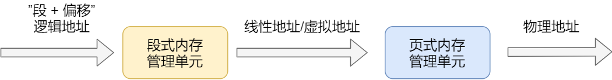

逻辑地址，程序所使用的地址CPU分配给程序看到的内存单元，

**相对块号**。需要MMU从虚拟地址映射到物理地址中。

### 虚拟地址

逻辑地址通过段式内存管理映射的地址称为虚拟地址（线性地址）

### 物理地址

虚拟地址经过页式内存管理转换为物理地址

CPU外部地址总线上的寻址物理内存的地址，是地址变换的最终结果地址，实际磁盘或物理内存的地址


Linux操作系统本身的代码和应用程序面对都是虚拟地址，屏蔽了CPU逻辑地址的概念，段只被用于访问控制和内存保护

### 虚拟内存

虚拟内存：计算机所呈现的比实际内存大得多的容量。比如北京到上海只需3公里的铁轨，只要你操作得足够快，把后面的铁轨铺到火车前面。

这就是虚拟内存管理要完成的任务，为每个程序分配了64MB的虚拟内存空间，因此逻辑地址范围为0x0000000到0x4000000

#### **为什么要有虚拟内存**

- 进程要4G空间，但实际不会用到那么多

- **地址空间隔离。**用户直接访问物理内存，不安全，可能恶意破坏别的内存数据。

- **内存利用率低。**由于内存有限，一个程序空间不够，就要先释放部分空间才能运行，这样数据装入装出效率低下。另外，虚拟内存是连续的，不代表物理内存是连续的，意味着可以使用内存碎片

- **程序运行地址不确定。**因为内存随机分配，所以程序运行地址不确定。

- **屏蔽内存细节**，降低使用门槛。不同厂商内存结构不一致，直接使用比较复杂。

#### 分页

**局部性原理**，每次使用的数据都是相邻的，所以有了**分页**的概念，每次以页（4k）单位读取数据。

当程序执行到x页时，当发现空页面时，就发送了页错误（Page Fault）,操作系统就分配一个物理页面，再将物理页面和虚拟内存的虚拟页映射起来，然后把控制权交给进程。

#### TLB（Translation Lookaside Buffer）:页表缓存

本质是一块高速缓存，缓存虚拟地址和物理地址，如果虚拟地址有对应的物理地址，就叫命中，所以提高命中率可大大提高性能

### SWAP分区

linux叫swap分区，当物理内存不够的时候，先把一部分内存放到swap分区中，待内存空闲再继续执行，也叫交换分区。一般得自己创建swap分区。

window叫做虚拟内存，内存没有用完也会去使用，一般放在c盘


```
swap是什么
内存不足的时候，采用硬盘来虚拟出内存

添加swap
#dd if=/dev/zero of=/tmp/swapfile bs=1M count=4096
 	dd 用来建立空文件
	if=fileName 输入文件（源文件），/dev/zero是会一值输出0的文件
	of 输出文件
	bs 块的大小为多少字节
	count 指定多少块
	创建swap文件，大小1G，文件越大，创建时间越长，文件路径可自定义（/tmp/swap）

查看创建的swap文件大小
#du -h /tmp/swapfile

创建swap
#mkswap /tmp/swapfile # 格式化为内存交换分区格式
#swapon /tmp/swapfile # 将swap设备启动
此时使用命令 free -m就能发现有交换分区了，但是系统重启之后，swap分区又回变为0,因此需要编辑下面的文件

(出现swapon: /tmp/swapfile: insecure permissions 0644, 0600 suggested.)
#vi /etc/fstab 
/tmp/swap swap swap default 0 0
在文件末尾（最后一行）加上

#vi /etc/sysctl.conf 
vm.swappiness=15 表示15的时候使用虚拟内存

查看swap
#swapon -s

删除swap
#swapoff /tmp/swap
停止swap分区

#rm -rf /tmp/swap
删除swap分区文件

#vi /etc/fstab
去掉上面的那行
```

## Linux命令

```
ipconfig	检测和设置本机的网络接口 ipconfig/all：显示当前TCP/IP网络中的所有配置信息
route	控制网络路由表。
traceroute	侦测主机到目的主机之前所经过的路由的命令
telnet	远程登陆服务的标准协议和主要方式，常用的远程控制Web服务器的方法。
ping	检查网络是否连通，可以很好地帮助我们分析和判定网络故障。
netstat	查看进程监听端口的情况
iptables	根据IP制定策略，也可以根据端口制定策略
```

### cron

```
五项
分钟(0-59) 小时(0-23) 月份第几天(1-31) 月份(1-12) 星期第几天(0-6)
```

### vim

```
ctrl+a 光标移到最前面
ctrl_e 光标移到最后面

ctrl+u 光标处快速往前删除
ctrl+k 光标处快速往后删除
```

### CP

```
cp
-r 目录递归复制
-i 交互的形式，重写会提示
-l 硬链接
-s 符号链接

如果dir2目录不存在，则可以直接使用
cp -r dir1 dir2

如果dir2目录已存在，则需要使用
cp -r dir1/. dir2
```

### ps命令

**ps -aux**

查看进程详细信息，包括用户，进程号，cpu，内存

```
[root@k8s-node1 shell_test]# ps -aux
USER       PID %CPU %MEM    VSZ   RSS TTY      STAT START   TIME COMMAND
root         1  0.1  0.0  45048  3780 ?        Ss   Apr06  24:57 /usr/lib/systemd/systemd --switched-root --system --deserialize 22
```


**ps -ef**

显示所有运行中的进程


字段含义如下：

```
ps   将某个进程显示出来
-A，-a 　显示所有程序。 
-f 　显示UID,PPIP,C与STIME栏位。 
grep命令是查找

中间的|是管道命令 将左侧的标准输入作为右侧的标准输入

UID PID PPID C STIME TTY TIME CMD
各相关信息的意义：
UID 程序被该 UID 所拥有
PID 就是这个程序的 ID 
PPID 则是其上级父程序的ID
C CPU 使用的资源百分比
STIME 系统启动时间
TTY 登入者的终端机位置
TIME 使用掉的 CPU 时间。
CMD 所下达的指令为何
```

### lsof

根据端口port查看进程

```
lsof -i:port
```

### tar命令

```
tar -cvf 打包
tar -zxvf 对.gz解包 
```

### rpm

用法

```
rpm -i 需要安装的包文件名

举例如下：

rpm -i example.rpm 安装 example.rpm 包；

rpm -iv example.rpm 安装 example.rpm 包并在安装过程中显示正在安装的文件信息；

rpm -ivh example.rpm 安装 example.rpm 包并在安装过程中显示正在安装的文件信息及安装进度；
```

查看安装路径

```
rpm -ql softName
```

查看已安装软件

```
[root@jacky zookeeper]# rpm -qa | grep jdk

java-1.6.0-openjdk-1.6.0.0-1.66.1.13.0.el6.i686
java-1.7.0-openjdk-1.7.0.45-2.4.3.3.el6.i686
```

卸载已安装软件

```
rpm -e --nodeps 要卸载的软件包

root@jacky zookeeper]# rpm -e --nodeps java-1.6.0-openjdk-1.6.0.0-1.66.1.13.0.el6.i686
```

### which locate find

which和locate基于内建数据库，效率高

find 磁盘查找

whereis 只能用于程序名的搜索，而且只搜索二进制文件（参数-b）、man说明文件（参数-m）和源代码文件（参数-s）

```
删除10天前的日志文件
find ./* -type f -mtime +10 -exec rm  {}  \;
```

### 软硬连接

```
硬链接：多了一个文件名对inode结点的链接
软连接：独立的inode结点，链接到同一个数据文件

软连接可对不存在的目录或文件建立连接，软连接链接计数i_link不会增加
```

软连接：有自己的inodes(索引结点),类似**快捷方式**，可跨文件系统，本质是用新inode链接名字，名字在链接到同一个文件

硬连接：指向同一个inodes，移动或删除原文件不会被破坏（相当于一个**备份**，同一文件以不同文件名的形式存在），不同文件名指向**同一个inode结点**，当然数据也是一样的。

可以看到软硬连接的inode都是393823，除了名字所有信息都是一样的。因为是同一个inodes本来就是同一个文件系统，所以**不能跨文件系统**，**不能链接目录**


```
ln -s 创建软连接
ln 硬连接
cp -s sourceFile s_link_sf 软连接
cp -l sourceFile h_link_sf 硬连接
```

### df命令

```
显示文件系统的磁盘使用情况,挂载信息（文件系统需要挂载到目录树才能被使用）
```


### vmstate

查看cpu内存负载


### top命令

查看操作系统信息，包括CPU和内存


### netstat命令

```
netstat -anp # 查看网络连接状态
-a或all 显示所有连接中的socket
-n或numeric 直接使用IP地址，而不通过域名服务器
-p或programs 显示程序名称
-t或tcp 显示TCP传输协议的连线情况

查看端口号被哪个进程占领
netstat -nap | grep 端口号 
```

### ifconfig命令

查看和配置网络接口

### free命令

查看内存

```
free -h(humanic)
```

### systemctl

```
systemctl status serviceName 查看服务的详细信息
```

### tail -f 

```
实时查看日志
```

### 系统链接的位置

```
/usr/lib/systemd/system/docker.service
```

### awk

```
给你举个例子，echo "aa bb cc" | awk -F '{print $1}' 结果就是aa，意思是把字符串按空格分割，取第一个，自己做个测试就明白了！
awk是用来提取列的主要工具；
{print $1}就是将某一行（一条记录）中以空格为分割符的第一个字段打印出来
awk '{print $2}' $fileName : 一行一行的读取指定的文件， 以空格作为分隔符，打印第二个字段
```

### 批量杀进程

```
kill -9 `ps -ef | grep redis | awk '{print $2}'`

-9（SIGKILL）
ctrl+C 终止进程 SIGINT
ctrl+Z 暂停线程 SIGSTP
```

### grep

全局正则表达式搜索

```
grep -w 单词精确匹配
```

### 标准输入输出

```
0 标准输入
1 标准输出
2 标准错误输出

&>a.txt 表示将标准输出和标准错误输出重定向到文件a.txt中

2>&1  意思就很明了了，就是讲执行linux命令时的错误信息也输出到屏幕上。

/dev/null 黑洞文件，表示删除
2>/dev/null 表示将标准错误输出不显示

>/proc/self/fd/0       //表示标准输入，即键盘输入

/dev/stdout    ----->/proc/self/fd/1　　　 　//表示标准输出，即显示屏，屏幕

/dev/stderr     ----> /proc/self/fd/2      //表示标准错误输出，有些脚本运行时会报错，就会输入到这。
```

### 管道与xargs

```
管道：标准输出转为标准输入
xrgs：标准输出转为命令行输入
```

```
cat /etc/passwd | grep root  等于  grep root /etc/passwd
管道命令（|）。管道命令的作用，是将左侧命令（cat /etc/passwd）的标准输出转换为标准输入，提供给右侧命令（grep root）作为参数。
```

但是，大多数命令都不接受标准输入作为参数，只能直接在命令行输入参数，这导致无法用管道命令传递参数。

```
$ echo "hello world" | echo
```

上面的代码不会有输出。因为管道右侧的`echo`不接受管道传来的标准输入作为参数。

#### `xargs`命令的作用，是将标准输入转为命令行参数。

```
$ echo "hello world" | xargs echo
hello world
```

### $?

```
$?：显示上一条命令的返回码，如果为0则代表执行成功，其他表示失败。
$#：脚本后面跟的参数个数
$0：脚本文件名文件名
$@：脚本后面的所有参数

结合if-else语句实现判断上一个命令是否执行成功。
-eq
等于
-ne	不等于
-gt
大于
-lt	小于
ge	大于等于
le	小于等于
```

## MySQL

### 索引下推

https://blog.csdn.net/qq_32979219/article/details/122791064

```
减少回表次数
idx(name,age)
比如select * from t where name='tt%' and age=10
不会用到age索引，开启索引下推后，在二级索引查询到满足tt%的时候，不会直接去聚簇索引查找，而是先判断age是否满足，满足了再回表。

总结：不会减少二级索引扫描的行，但能减少回表的次数，提前过滤不满足另一个索引的记录
```

### SQL执行顺序 

[博客](https://blog.csdn.net/u014044812/article/details/51004754/)

```
FROM WHERE GROUP BY HAVING SELECT ORDER BY
```

```
FROM子句->WHERE子句->GROUP BY子句->HAVING子句->SELECT子句->ORDER BY子句->LIMIT子句->最终结果 
```

### in&exist

```
in子查询里面一定得是小表，效率比exist高，因为使用in外表是大表可以用到索引，in()里面只执行一次，先执行子查询放到临时表中，再去查询外表和内表进行匹配。

假设A表是大表，B表是小表
select * from A where cc in (select cc from B) 效率高，用到了A表上cc列的索引；
select * from A where exists(select cc from B where cc=A.cc) 效率低，大表A是全表扫描，只用到了小表B表上cc列的索引。 

not in和not exists比较，not exists效率一定比not in高，因为not in都是全表扫描，not exists可能用到s
```

### 数据类型

```
int(11) 不影响实际存储的范围，实际还是用4个字节去存储
只有一个字段设置了无符号和填充0属性，长度不够才会填充0，长度超过11也是失效的
```


### 语法

```
# 表复制，MySQL仅支持:
create table t3 select * from t2;

不支持select * into new_table from old_table


select id into @id from t2 where id=1;
select @id;

# 建表语句
create table if not exists test.user
(
	id int auto_increment
		primary key,
	username varchar(56) not null,
	password varchar(20) charset latin1 null,
	birthday datetime null,
	score decimal null,
	index idx_name(username),
	unique key uni_key(username),
	foreign key(username) references sys_user(username)
)engine InnoDb,auto_increment=1,charset=utf8;

```

### 复制原理

```
1.主库数据发生改变时使用binlog dump线程写进bin_log
2.从库定期探测主库的bin_log发生变化后
启动IO线程读取主库的binlog,写到relay log中继日志中
再用SQL thread重放binlog同步数据。
```


### 读写分离

核心：重写AbstractRoutingDataSource的获取key的determineCurrentLookupKey方法

AbstractRoutingDataSource中调用determineTargetDataSource()获取数据源，它又是调用determineCurrentLookupKey()得到数据源的key。那么我们只需重写determineCurrentLookupKey()方法即可

```java
// AbstractRoutingDataSource#determineTargetDataSource()

protected DataSource determineTargetDataSource() {
   Assert.notNull(this.resolvedDataSources, "DataSource router not initialized");
   Object lookupKey = determineCurrentLookupKey();
   DataSource dataSource = this.resolvedDataSources.get(lookupKey);
   if (dataSource == null && (this.lenientFallback || lookupKey == null)) {
      dataSource = this.resolvedDefaultDataSource;
   }
   if (dataSource == null) {
      throw new IllegalStateException("Cannot determine target DataSource for lookup key [" + lookupKey + "]");
   }
   return dataSource;
}
```

于是继承AbstractRoutingDataSource重写获取key的方法determineCurrentLookupKey()

```java
    // 重写获取key方法determineCurrentLookupKey
    @Override
    protected Object determineCurrentLookupKey() {
        DataSourceTypeEnum databaseType = DataSourceContextHolder.getDatabaseType();
        int i;
        List<Map<String, String>> mastersources = dataSourceProperties.getMastersources();
        List<Map<String, String>> slavesources = dataSourceProperties.getSlavesources();
        if(databaseType.equals(DataSourceTypeEnum.DATA_SOURCE_MASTER))
            // 随机获取主数据源
            i= ThreadLocalRandom.current().nextInt(mastersources.size())%mastersources.size();
        else
            i= ThreadLocalRandom.current().nextInt(slavesources.size())%slavesources.size();
        return databaseType.getName()+i; //
    }
```

aop拦截dao层的方法,动态切换数据源

```java
@Aspect
@Slf4j
public class DataSourceAspect {
    private static final String[] queryStrs={"query","select","get"};

    @Pointcut("execution(* com.hu.health.member.dao.*.*(..))")
    public void executeSql(){}

    @Before("executeSql()")
    public void doBefore(JoinPoint joinPoint){
        MethodSignature methodSignature = (MethodSignature) joinPoint.getSignature();
        String mName = methodSignature.getMethod().getName();
        log.info("拦截的sql方法：{}",mName);
        DataSourceContextHolder.setDatabaseType(DataSourceTypeEnum.DATA_SOURCE_MASTER); // 默认master
        for (String queryStr : queryStrs) {
            if(mName.startsWith(queryStr)){
                log.info("查询语句，设置数据源为slave");
                DataSourceContextHolder.setDatabaseType(DataSourceTypeEnum.DATA_SOURCE_SLAVE);
                break;
            }
        }
        log.info("当前数据源是：{}",DataSourceContextHolder.getDatabaseType().getName());
    }
}
```


```
  # 配置读写分离主从数据源
  mastersources:
    -  driverClassName: com.mysql.cj.jdbc.Driver
       url: jdbc:mysql://114.132.44.209:3306/health_ums?useUnicode=true&characterEncoding=UTF-8&useSSL=false&serverTimezone=Asia/Shanghai
       username: root
       password: root
       type: com.alibaba.druid.pool.DruidDataSource

  slavesources:
    - driverClassName: com.mysql.cj.jdbc.Driver
      url: jdbc:mysql://114.132.44.209:3307/health_ums?useUnicode=true&characterEncoding=UTF-8&useSSL=false&serverTimezone=Asia/Shanghai
      username: root
      password: root
      type: com.alibaba.druid.pool.DruidDataSource
```


### 视图

视图不能检索，因为没有主键和索引，也没有关联的触发器、默认值等，本质只是一张查看和存放的表，另外只保存视图的定义规则

### sql优化步骤

```
show status like '%%'; # 查看各种统计信息，慢查询，连接数，增删改查次数
show processlist; # 查看当前执行sql的锁等待状态等

explain sql; # 查看执行计划

show profiles ; # 查看执行耗时
show profile cpu for query 29; # 查看cpu损耗

trace; # 分析优化器执行计划
```


###  索引种类

主键索引

唯一索引

普通索引

联合索引

前缀索引 指定长度 一些地名相同既可以

innodb 主键索引：指向数据行 二级索引指向主键值

isam 没区别

### 索引失效

**运算** 

**通配符** 

**跳过联合索引（最左匹配原则）** 

**范围查询** **、**

**字符串得加‘’（）因为会自动类型转换，索引失效**

**使用覆盖索引**

**Or** **也会失效**

**In****走索引** **not in****不走索引** 

 使用join代替子查询，因为子查询会建立临时表

**Order by****使用有序字段，不然会****filesort** **尽量使用主键返回数据**  

**Group by****默认会排序，可使用** **order by null**

**Join****替代子查询**

### 事务的实现原理

·    事务的原子性是通过 undo log 来实现的 回滚日志

·    事务的持久性性是通过 redo log 来实现的

·    事务的隔离性是通过 (读写锁+MVCC)来实现的

·    而事务的终极大 boss 一致性是通过原子性，持久性，隔离性来实现的！！！

### 常用命令

```
查看你mysql版本
select version();

查看表的统计信息
show table status like 'table_name' \G
```

### InnoDB和MyISAM区别

innodb支持事务，外键，表锁。

MyISAM插入查询比较快。为什么插入快，因为索引和数据是分开的，因此只需要维护B树索引，数据直接按顺序插入即可；为什么查询快，同样是因为索引和数据是分开的，因此索引存放的就是数据的地址，而InnoDB还得从聚簇索引找。

### B+树

https://mp.weixin.qq.com/s/A5gNVXMNE-iIlY3oofXtLw

首先就是B树非叶子结点存数据，那么相同数据量的情况下自然高度变高。高端变高，对应就是**磁盘IO**提高。因此，B+树能更加矮胖。

另外，B+树支持范围查询，数据全部存放在叶子节点

B树非叶子结点存放数据，平均查找速度快，但是返回数据有限，相同数据量情况下，磁盘IO性能更低。

1). n叉B+Tree最多含有n个key，而BTree最多含有n-1个key。

2). B+Tree的叶子节点保存所有的key信息，依key大小顺序排列。

 

3). 所有的非叶子节点都可以看作是key的索引部分。

所以查询效率稳定

 

```
聚簇索引：主键缺省使用它 主键所在的索引为ClusterIndex(聚簇索引)
一个表只能有一个主键，所以只能有一个聚簇索引，如果表没有定义主键，则选择第一个非NULL唯一索引作为聚簇索引，如果还没有则生成一个隐藏id列作为聚簇索引。
 
```

\1. 聚集索引。表数据按照索引的顺序来存储的，也就是说索引项的顺序与表中记录的物理顺序一致。对于聚集索引，叶子结点即存储了真实的数据行，不再有另外单独的数据页。 在一张表上最多只能创建一个聚集索引，因为真实数据的物理顺序只能有一种。

叶子结点存放数据的 并且表的物理结构跟索引一样

红黑树的特性：根节点为黑色，红色节点的叶子结点一定是黑色，每一条路径黑色结点数目一样，叶子结点（nil）一定是黑色

### 数据库死锁

超时机制，进行小事务回滚

我们定位到问题sql后考虑优化加锁顺序避免死锁


查看死锁

```
set global innodb_status_output_locks=on;
show engine innodb status;
```

```
------------------------
LATEST DETECTED DEADLOCK 检测到死锁
------------------------
2022-07-17 07:01:52 140343824779008
*** (1) TRANSACTION:
TRANSACTION 47400, ACTIVE 13 sec starting index read
mysql tables in use 1, locked 1
LOCK WAIT 3 lock struct(s), heap size 1128, 2 row lock(s)
MySQL thread id 140915, OS thread handle 140343238305536, query id 35590030 27.47.107.87 root statistics
/* ApplicationName=DataGrip 2020.1 */
select * from community_question where id=54 for update 找到执行的语句

当前事务拥有的锁 space id 864 page no 4 n bits 72
*** (1) HOLDS THE LOCK(S):
RECORD LOCKS space id 864 page no 4 n bits 72 index PRIMARY of table `health_community`.`community_question` trx id 47400 lock_mode X locks rec but not gap
Record lock, heap no 2 PHYSICAL RECORD: n_fields 18; compact format; info bits 0
 0: len 8; hex 8000000000000034; asc        4;;
 1: len 6; hex 00000000b366; asc      f;;
 2: len 7; hex 01000000a52828; asc      ((;;
 3: len 4; hex 32333132; asc 2312;;
 4: len 6; hex 736164617364; asc sadasd;;
 5: len 4; hex 62581c3f; asc bX ?;;
 6: len 4; hex 625c2bda; asc b\+ ;;
 7: len 8; hex 8000000000000000; asc         ;;
 8: len 4; hex 80000000; asc     ;;
 9: len 4; hex 80000000; asc     ;;
 10: len 4; hex 80000000; asc     ;;
 11: len 0; hex ; asc ;;
 12: len 4; hex 80000000; asc     ;;
 13: len 8; hex 8000000000000000; asc         ;;
 14: len 0; hex ; asc ;;
 15: len 0; hex ; asc ;;
 16: len 0; hex ; asc ;;
 17: SQL NULL;

等待获取的锁，space id 864 page no 4 n bits 72
*** (1) WAITING FOR THIS LOCK TO BE GRANTED:
RECORD LOCKS space id 864 page no 4 n bits 72 index PRIMARY of table `health_community`.`community_question` trx id 47400 lock_mode X locks rec but not gap waiting
Record lock, heap no 3 PHYSICAL RECORD: n_fields 18; compact format; info bits 0
 0: len 8; hex 8000000000000036; asc        6;;
 1: len 6; hex 00000000b3f0; asc       ;;
 2: len 7; hex 81000001350110; asc     5  ;;
 3: len 12; hex e68891e698afe6a087e9a298; asc             ;;
 4: len 18; hex e58685e5aeb9e58685e5aeb9e58685e5aeb9; asc                   ;;
 5: len 4; hex 625e849e; asc b^  ;;
 6: len 4; hex 625e849e; asc b^  ;;
 7: len 8; hex 8000000000000002; asc         ;;
 8: len 4; hex 80000000; asc     ;;
 9: len 4; hex 80000000; asc     ;;
 10: len 4; hex 80000000; asc     ;;
 11: len 9; hex 6a6176613b7068703b; asc java;php;;;
 12: len 4; hex 80000000; asc     ;;
 13: len 8; hex 8000000000000001; asc         ;;
 14: len 22; hex 687474703a612e6a70673b687474703a622e6a70673b; asc http:a.jpg;http:b.jpg;;;
 15: len 9; hex e7bc96e7a88be58cba; asc          ;;
 16: len 4; hex 6d6f6f6e; asc moon;;
 17: len 4; hex 80000000; asc     ;;


*** (2) TRANSACTION:
TRANSACTION 47399, ACTIVE 18 sec starting index read
mysql tables in use 1, locked 1
LOCK WAIT 3 lock struct(s), heap size 1128, 2 row lock(s)
MySQL thread id 140916, OS thread handle 140341719037696, query id 35590060 27.47.107.87 root statistics
/* ApplicationName=DataGrip 2020.1 */ select * from community_question where id=52 for update

拥有的锁 space id 864 page no 4 n bits 72
*** (2) HOLDS THE LOCK(S):
RECORD LOCKS space id 864 page no 4 n bits 72 index PRIMARY of table `health_community`.`community_question` trx id 47399 lock_mode X locks rec but not gap
Record lock, heap no 3 PHYSICAL RECORD: n_fields 18; compact format; info bits 0
 0: len 8; hex 8000000000000036; asc        6;;
 1: len 6; hex 00000000b3f0; asc       ;;
 2: len 7; hex 81000001350110; asc     5  ;;
 3: len 12; hex e68891e698afe6a087e9a298; asc             ;;
 4: len 18; hex e58685e5aeb9e58685e5aeb9e58685e5aeb9; asc                   ;;
 5: len 4; hex 625e849e; asc b^  ;;
 6: len 4; hex 625e849e; asc b^  ;;
 7: len 8; hex 8000000000000002; asc         ;;
 8: len 4; hex 80000000; asc     ;;
 9: len 4; hex 80000000; asc     ;;
 10: len 4; hex 80000000; asc     ;;
 11: len 9; hex 6a6176613b7068703b; asc java;php;;;
 12: len 4; hex 80000000; asc     ;;
 13: len 8; hex 8000000000000001; asc         ;;
 14: len 22; hex 687474703a612e6a70673b687474703a622e6a70673b; asc http:a.jpg;http:b.jpg;;;
 15: len 9; hex e7bc96e7a88be58cba; asc          ;;
 16: len 4; hex 6d6f6f6e; asc moon;;
 17: len 4; hex 80000000; asc     ;;

等待的锁 space id 864 page no 4 n bits 72
*** (2) WAITING FOR THIS LOCK TO BE GRANTED:
RECORD LOCKS space id 864 page no 4 n bits 72 index PRIMARY of table `health_community`.`community_question` trx id 47399 lock_mode X locks rec but not gap waiting
Record lock, heap no 2 PHYSICAL RECORD: n_fields 18; compact format; info bits 0
 0: len 8; hex 8000000000000034; asc        4;;
 1: len 6; hex 00000000b366; asc      f;;
 2: len 7; hex 01000000a52828; asc      ((;;
 3: len 4; hex 32333132; asc 2312;;
 4: len 6; hex 736164617364; asc sadasd;;
 5: len 4; hex 62581c3f; asc bX ?;;
 6: len 4; hex 625c2bda; asc b\+ ;;
 7: len 8; hex 8000000000000000; asc         ;;
 8: len 4; hex 80000000; asc     ;;
 9: len 4; hex 80000000; asc     ;;
 10: len 4; hex 80000000; asc     ;;
 11: len 0; hex ; asc ;;
 12: len 4; hex 80000000; asc     ;;
 13: len 8; hex 8000000000000000; asc         ;;
 14: len 0; hex ; asc ;;
 15: len 0; hex ; asc ;;
 16: len 0; hex ; asc ;;
 17: SQL NULL;

这里采用回滚事务2解决死锁
*** WE ROLL BACK TRANSACTION (2)
------------
TRANSACTIONS
------------
Trx id counter 47401
Purge done for trx's n:o < 47377 undo n:o < 0 state: running but idle
History list length 0
LIST OF TRANSACTIONS FOR EACH SESSION:
---TRANSACTION 421819211000184, not started
0 lock struct(s), heap size 1128, 0 row lock(s)
---TRANSACTION 421819210999376, not started
0 lock struct(s), heap size 1128, 0 row lock(s)
---TRANSACTION 421819210997760, not started
0 lock struct(s), heap size 1128, 0 row lock(s)
---TRANSACTION 421819211001800, not started
0 lock struct(s), heap size 1128, 0 row lock(s)
---TRANSACTION 421819210998568, not started
0 lock struct(s), heap size 1128, 0 row lock(s)
---TRANSACTION 421819211003416, not started
0 lock struct(s), heap size 1128, 0 row lock(s)
---TRANSACTION 421819211000992, not started
0 lock struct(s), heap size 1128, 0 row lock(s)
---TRANSACTION 421819210996144, not started
0 lock struct(s), heap size 1128, 0 row lock(s)
---TRANSACTION 421819210995336, not started
0 lock struct(s), heap size 1128, 0 row lock(s)
---TRANSACTION 47400, ACTIVE 130 sec
3 lock struct(s), heap size 1128, 2 row lock(s)
MySQL thread id 140915, OS thread handle 140343238305536, query id 35590068 27.47.107.87 root
TABLE LOCK table `health_community`.`community_question` trx id 47400 lock mode IX
RECORD LOCKS space id 864 page no 4 n bits 72 index PRIMARY of table `health_community`.`community_question` trx id 47400 lock_mode X locks rec but not gap
Record lock, heap no 2 PHYSICAL RECORD: n_fields 18; compact format; info bits 0
 0: len 8; hex 8000000000000034; asc        4;;
 1: len 6; hex 00000000b366; asc      f;;
 2: len 7; hex 01000000a52828; asc      ((;;
 3: len 4; hex 32333132; asc 2312;;
 4: len 6; hex 736164617364; asc sadasd;;
 5: len 4; hex 62581c3f; asc bX ?;;
 6: len 4; hex 625c2bda; asc b\+ ;;
 7: len 8; hex 8000000000000000; asc         ;;
 8: len 4; hex 80000000; asc     ;;
 9: len 4; hex 80000000; asc     ;;
 10: len 4; hex 80000000; asc     ;;
 11: len 0; hex ; asc ;;
 12: len 4; hex 80000000; asc     ;;
 13: len 8; hex 8000000000000000; asc         ;;
 14: len 0; hex ; asc ;;
 15: len 0; hex ; asc ;;
 16: len 0; hex ; asc ;;
 17: SQL NULL;

RECORD LOCKS space id 864 page no 4 n bits 72 index PRIMARY of table `health_community`.`community_question` trx id 47400 lock_mode X locks rec but not gap
Record lock, heap no 3 PHYSICAL RECORD: n_fields 18; compact format; info bits 0
 0: len 8; hex 8000000000000036; asc        6;;
 1: len 6; hex 00000000b3f0; asc       ;;
 2: len 7; hex 81000001350110; asc     5  ;;
 3: len 12; hex e68891e698afe6a087e9a298; asc             ;;
 4: len 18; hex e58685e5aeb9e58685e5aeb9e58685e5aeb9; asc                   ;;
 5: len 4; hex 625e849e; asc b^  ;;
 6: len 4; hex 625e849e; asc b^  ;;
 7: len 8; hex 8000000000000002; asc         ;;
 8: len 4; hex 80000000; asc     ;;
 9: len 4; hex 80000000; asc     ;;
 10: len 4; hex 80000000; asc     ;;
 11: len 9; hex 6a6176613b7068703b; asc java;php;;;
 12: len 4; hex 80000000; asc     ;;
 13: len 8; hex 8000000000000001; asc         ;;
 14: len 22; hex 687474703a612e6a70673b687474703a622e6a70673b; asc http:a.jpg;http:b.jpg;;;
 15: len 9; hex e7bc96e7a88be58cba; asc          ;;
 16: len 4; hex 6d6f6f6e; asc moon;;
 17: len 4; hex 80000000; asc     ;;

```

等待视图，主动去检测

### key和index

```
key可以约束数据完整性，也可以起索引的作用，MySQL建key会自动建索引。

primary key
unique key
forign key
mul key 普通key,等价普通索引


主键索引
唯一索引 一般使用unique key创建
普通索引
```

### 存储引擎

#### innodb

**事务、外键、行锁**

支持分布式事务和安全点（安全点是指事务的部分回滚）

聚簇索引

#### myisam

**非事务**主要存储引擎，查询和插入效率高，占用空间和内存少

#### memory

读写快，数据易丢失

### RESTRICT&CASCADE

```
RESTRICT表示表的删除是有条件限制的，要删除的基本表不能被其他表的约束所引用，不能有视图，不能有触发器，不能有存储过程或函数等。如果存在这些依赖该表的对象，则表不能被删除

CASCADE表示表的删除没有限制条件，在删除基本表的同时，相关的依赖对象（如视图）都将被删除。
```

### truncate&delete&drop

1、相同点;都是只删数据不删表结构
2、不同点

- truncate和drop一样是**DDL**,删除立即生效，元数据不会放到rollback segment中，不能回滚和触发trigger;
- truncate通过**释放数据页来删除数据**，并在事务日志页标记页的释放，使用事务资源少；delete每删除一行就写入事务日志
- truncate**存在外键删除失败**，无论这个外键是否存在；
- truncate只能删除全部数据；
- truncate自增值重置为0，删除返回值也是0

### 关系代数


#### 选取Selection

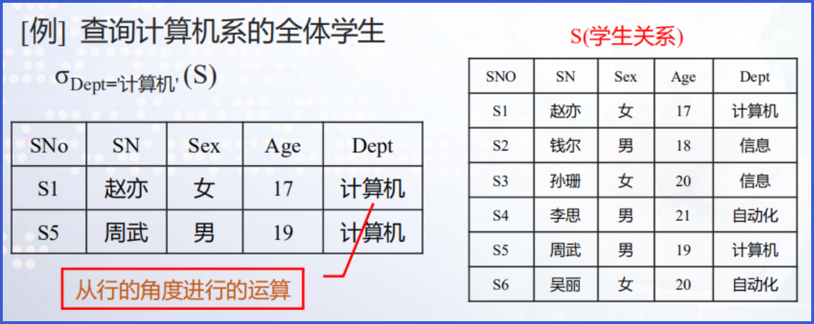


#### 投影Projection


#### θ连接θJoin

自然连接要求相同属性值的属性名相同，即是去除了重复列的等值连接


#### 除法Division


### 三大范式

1.列不可再分
2.唯一标识一行，消除部份依赖，满足**完全依赖**
3.消除传递依赖，非主属性**只能依赖主属性**，可设置外键解决

### 索引失效

对索引计算，索引会失效，因为索引计算就跟原来的排序规则不一样了

```
select 1='1'  1
select 0='a'  1  转为整形再比较，非数字字符自动转为0，数字字符转为对应的数字

t1{
	a int,
	e char
}
select * from t1 where a=1   走索引
select * from t1 where a='1' 走索引,因为‘1'自动转为1，且不是字段a去运算

select * from t1 where e=1   不走索引，字段e被计算（那么就跟原来排序规则不一样了），统一e转为数字再比较
select * from t1 where e=‘1’ 走索引，因为本来就是字符，不用计算
```

### 数据库字符集和排序规则

```
alter database health_community charset =utf8 collate=utf8_general_ci;
```

utfmb4默认排序规则utf8mb4_0900_ai_ci


查看字符集

```
SHOW VARIABLES LIKE 'character%';
SHOW VARIABLES LIKE 'collation_%';
```

### 主从复制、读写分离

#### Slave_SQL_Running stop

```
Slave SQL for channel '': Worker 1 failed executing transaction 'ANONYMOUS' at master log master-bin.000007, end_log_pos 510; Could not execute Delete_rows event on table health_community.community_area; Can't find record in 'community_area', Error_code: 1032; handler error HA_ERR_KEY_NOT_FOUND; the event's master log FIRST, end_log_pos 510, Error_code: MY-001032

当主从数据不一致的时候，比如主有一行数据a,但从没有数据a,当主删除a的时候，从就会报数据不一致，并停止从库协调器和工作进程运行
The slave coordinator and worker threads are stopped, possibly leaving data in inconsistent state. A restart should restore consistency automatically, although using non-transactional storage for data or info tables or DDL queries could lead to problems. In such cases you have to examine your data (see documentation for details). Error_code: MY-001756

```

### 主从复制

#### 主从不一致解决方案

[博客](https://baijiahao.baidu.com/s?id=1711660568537406582&wfr=spider&for=pc)

设置为只读状态，备份数据库，导入从库，然后再重新开启主从同步+

```
1.先进入主库，进行锁表，防止数据写入

mysql> flush tables with readlock;注意：该处是锁定为只读状态，语句不区分大小写

2.进行数据备份

#把数据备份到mysql.bak.sql文件

mysqldump -uroot -p -hlocalhost > mysql.bak.sql这里注意一点：数据库备份一定要定期进行，可以用shell脚本或者python脚本，都比较方便，确保数据万无一失。

3.查看master 状态

mysql> showmasterstatus;+-------------------+----------+--------------+-------------------------------+| File | Position | Binlog_Do_DB | Binlog_Ignore_DB |+-------------------+----------+--------------+-------------------------------+| mysqld-bin.000001 | 3260 | | mysql,test,information_schema |+-------------------+----------+--------------+-------------------------------+1 row in set (0.00 sec)4.把mysql备份文件传到从库机器，进行数据恢复

scp mysql.bak.sql root@192.168.128.101:/tmp/5.停止从库的状态

mysql> stopslave;

6.然后到从库执行mysql命令，导入数据备份

mysql> source /tmp/mysql.bak.sql

7.设置从库同步，注意该处的同步点，就是主库show master status信息里的| File| Position两项

changemasterto master_host = '192.168.128.100', master_user = 'rsync', master_port=3306, master_password='', master_log_file = 'mysqld-bin.000001', master_log_pos=3260;8.重新开启从同步

mysql> startslave;
9.查看同步状态

mysql> showslavestatus\G Slave_IO_Running: YesSlave_SQL_Running: Yes10.回到主库并执行如下命令解除表锁定。

UNLOCKTABLES
```

### 读写分离

1. 中间件：amoeba，MySQL-Proxy

2. 应用程序路由

[代码实现](https://www.cnblogs.com/wollow/p/10839890.html)


### redo_log(重做日志)

实际保存在`ib_logfile`中

[博客](https://www.cnblogs.com/qianyuliang/p/9916372.html)

#### 授权命令

```
select * from user;
update user set host = '%' where user = 'root' and host='localhost';
GRANT ALL ON *.* TO 'root'@'%' 
flush privileges;    
```

#### [Entrypoint]: Switching to dedicated user 'mysql

```
指定新的挂载目录运行正常, 搜遍全网都没有找到答案

解决办法:
删除以下文件(建议删除前备份):

data/ib_logfile0
data/ib_logfile1
...
1
2
3
重新启动就可以了

原因
主要是因为我修改了虚拟机的内存分配, 导致mysql 8写日志的大小计算出了问题.
删除文件让mysql重新生成OK, 或者可以把虚拟机设置为原来分配的内存大小
```


### dockercompose.yml

```
version: '2.2'
services:
    mysql-new:
        container_name: docker_tool_mysql
        cpus: "2"
        mem_limit: "3G"
        environment:
            MYSQL_ROOT_PASSWORD: "root"
        image: "docker.io/mysql:8.0.28"
        restart: always
        volumes:
            - "/mydata/mysql/data:/var/lib/mysql"
            - "/mydata/mysql/config/my.cnf:/etc/mysql/my.cnf"
            - "/mydata/mysql/init:/docker-entrypoint-initdb.d/"
            - "/mydata/mysql/mysql-files:/var/lib/mysql-files/
        ports:
            - "3306:3306"
```

#### 配置文件

```
[client] 
default-character-set=utf8 

[mysql] 
default-character-set=utf8 

[mysqld] 
init_connect='SET collation_connection = utf8_general_ci' 
init_connect='SET NAMES utf8' 
character-set-server=utf8 
collation-server=utf8_general_ci
skip-character-set-client-handshake 
skip-name-resolve
# 配置主从复制
server-id=11
log_bin=master-bin
log_bin_index=master-bin.index 
# 防止statement模式数据不一致问题（随机数，now()）
binlog_format=row
binlog-ignore-db=mysql
#备注：
#server-id 服务器唯一标识。
#log_bin 启动MySQL二进制日志，即数据同步语句，从数据库会一条一条的执行这些语句。
#binlog_do_db 指定记录二进制日志的数据库，即需要复制的数据库名，如果复制多个数据库，重复设置这个选项即可。
#binlog_ignore_db 指定不记录二进制日志的数据库，即不需要复制的数据库名，如果有多个数据库，重复设置这个选项即可。
#其中需要注意的是，binlog_do_db和binlog_ignore_db为互斥选项，一般只需要一个即可。

max_connections=400
max_user_connections=700
wait_timeout=400
```


#### 开机自启动

```
让MySQL数据库随系统的开机而启动：chkconfig mysqld on

关闭MySQL的开机自启动：chkconfig mysqld off
```


#### 安装

- [安装MySql5.7](https://www.jianshu.com/p/19291fb17b99)
- [彻底删除mysql](https://www.cnblogs.com/Can-daydayup/p/10873948.html)
- [有道云笔记](http://note.youdao.com/noteshare?id=7e33e28807934dc31985f3226e119ced&sub=8A1383DDFDDA4842BB01E516A7B5DAD8)
- [参考博客](https://www.cnblogs.com/Can-daydayup/p/10877500.html)

1. 查看mysql状态

   ```bash
   systemctl status mysqld
   ```

2. 配置允许远程连接

   ```bash
   1、改表法
   update user set host = '%' where user = 'root';
   select host, user from user;
   
   2、授权法
   grant 权限 on 数据库名.表名 to 用户@登录主机 identified by "用户密码";
   GRANT ALL PRIVILEGES ON *.* TO 'myuser'@'%' IDENTIFIED BY 'mypassword' WITH GRANT OPTION;
   FLUSH PRIVILEGES;
   ```


3. Xshell登录mysql

   ```
   mysql -uroot -h127.0.0.1 -p
   ```

4. 启动

   ```
   servcie mysqld restart
   ```

5. 查看版本信息

   ```
   status
   SELECT VERSION();//5.7.26
   ```


6. 建库

   ```
   CREATE DATABASE test2 DEFAULT CHARACTER SET utf8 COLLATE utf8_general_ci
   ```

   

#### 远程连接

- mysql和ssh配合连接
- 注：我的sql主机地址填127.0.0.1
- [原文链接](https://blog.csdn.net/benben1580/article/details/79334523)

#### Sqlyog创建存储过程

记：SQLyog中的Query编辑器下，分号分隔符是通知mysql客户端已经输入完成的符号，而存储过程中有很多分号，所以一运行就报错。

解决办法：找到数据库中Stored Proces然后右击选择创建存储过程

#### length与char_length

```
char_length(str)

	计算单位：字符

	不管汉字还是数字或者是字母都算是一个字符

length(str)

	计算单位：字节

	utf8编码：一个汉字三个字节，一个数字或字母一个字节。

	gbk编码：一个汉字两个字节，一个数字或字母一个字节。
```

#### varchar（）类型

```
MySQL5.0.3版本之后

varchar(char_length)：按字符算

数据类型大小：0--65535字节，但最多占65532字节(其中需要用两个字节存放长度，小于255字节用1个字节存放长度)

详解：varchar(20)表示字符数，不管什么编码，不管是英文还是中文都可以存放20个。
```

##### 查看一个表是某个表的外键

```
SELECT TABLE_NAME,COLUMN_NAME,CONSTRAINT_NAME, REFERENCED_TABLE_NAME,REFERENCED_COLUMN_NAME FROM INFORMATION_SCHEMA.KEY_COLUMN_USAGE
WHERE REFERENCED_TABLE_NAME = '表名';
```

#### Server returns invalid timezone. 

Go to 'Advanced' tab and set 'serverTimezone' property

```
# 原因：没设置时区
show variables like'%time_zone'; # 显示 SYSTEM 就是没有设置时区
set global time_zone = '+8:00';
```

#### [mysql-建表、添加字段、修改字段、添加索引SQL语句写法](https://www.cnblogs.com/f-rt/p/11141421.html)

#### mysql与TIMESTAMP（时间戳）

[博客](https://www.jb51.net/article/51794.htm)

1. 在创建新记录和修改现有记录的时候都对这个数据列刷新

```sql
TIMESTAMP DEFAULT CURRENT_TIMESTAMP ON UPDATE CURRENT_TIMESTAMP
```

2. 在创建新记录的时候把这个字段设置为当前时间，但以后修改时，不再刷新它

```sql
TIMESTAMP DEFAULT CURRENT_TIMESTAMP
```

3. 异同

```
相同点：
1.可自动更新和初始化，默认显示格式相同YYYY-MM-dd HH:mm:ss

不同点：
2. timestamp的时间范围是：‘1970-01-01 00:00:01' UTC to ‘2038-01-19 03:14:07' UTC ，自动时区转化，实际存储毫秒数，4字节存储
3. datetime的时间范围：‘1000-01-01 00:00:00' to ‘9999-12-31 23:59:59' ，不支持时区，8字节存储
```

#### err_log、bin_log、slow_log

error_log

`记录db启动，运行，停止时间严重错误`

bin_log

```
DDL 操作表结构，字段的语句。
DCL 权限等一些控制语句。
DML 操作表的语句（insert,update,delete），并且是已经提交的，未提交的不会记录
```

slow_log

`记录慢SQL语句的日志,定位低效SQL语句的工具日志，默认不开启`

#### docker命令


#### 自增id

```
innodb
5.7:最大值保存到内存中，不重启不会弥补空闲
重启会重新找到最大的加一
8.0：写入 redo log，保存到引擎专用的系统表中。
重启后找redo日志和当前表数值中的最小值
```

#### mySql中Truncate的用法

[博客](https://blog.csdn.net/sun_shang/article/details/78064190)

区别

```
truncate:删除表的数据不会在事务日志中记录，是释放数据页来删除数据，并只会在事务日志中记录数据页；所以ROLLBACK语句不会撤销
用TRUNCATE TABLE删除数据的表上增加数据时，要使用UPDATE STATISTICS来维护索引信息。

```

## Redis

### 高可用

#### 主从复制

```
Slave启动成功连接到master后会发送一个sync命令

Master接到命令启动后台的存盘进程，同时收集所有接收到的用于修改数据集命令， 在后台进程执行完毕之后，master将传送整个数据文件到slave,以完成一次完全同步

全量复制：而slave服务在接收到数据库文件数据后，将其存盘并加载到内存中。

增量复制：Master继续将新的所有收集到的修改命令依次传给slave,完成同步

但是只要是重新连接master,一次完全同步（全量复制)将被自动执行
```

命令: slaveof host port

#### 哨兵

https://blog.csdn.net/zhanghuiqi205/article/details/112169486

##### 配置

```
sentinel monitor mymaster 192.168.14.101 6379 2 # 投票master宕机的数量
```

##### **工作原理**

一、三个定时任务

```
1、每个sentinel对master和slave执行info命令，第一个是用来发现slave节点，第二个是确定主从关系
2、每个sentinel通过master的channel发布订阅交换节点信息和自身信息，判断主管下线还是客观下线
3、每个sentinel对其他sentinel和redis执行ping命令，用于心跳检测，作为存活的依据
```

二、主管下线和客观下线

```
主观下线：当前sentinel实例认为master服务不可用
客观下线：多个sentinel实例认为master服务不可用，此时master变为主观下线状态
```

三、故障转移

故障转移是由 sentinel 领导者节点来完成的(只需要一个sentinel节点),关于 sentinel 领导者节点的选取也是每个 sentinel 向其他 sentinel 节点发送我要成为领导者的命令,超过半数sentinel 节点同意,并且也大于quorum ,那么他将成为领导者,如果有多个sentinel都成为了领导者,则会过段时间在进行选举

故障转移步骤

```
1、从slave结点选出合适的结点作为master节点
	slave-priority越小优先级越高
	复制偏移量offset越大优先级越高（数据越完整）
	runId最小的slave结点（启动越早）
2、对上面选出来的执行slaveof of no one
3、像剩余结点发送命令，让他们成为新master的slave结点
4、更新原来的master节点配置为slave节点，重新恢复去复制新master的节点信息
```

##### 优缺点

```
优点：主从复制的加强版，自动主从切换
缺点：在线扩容比较麻烦；只有主节点提供服务，不太支持高并发
```

##### 总结

```
sentinel集群是独立的线程，能够监控redis集群，发现master宕机后自动切换。
```

#### 集群

https://blog.csdn.net/xueguchen/article/details/109847085

原理简介

```
将所有数据分为16384个槽位slots,每个节点负责一部分槽位。槽位的信息存储于每个节点中。

使用crc16算法进行hash并对16384取模得到具体槽位，客户端发送请求后可以缓存槽位信息。

当节点发现槽位信息不归自己管理时，会发送跳转指令携带目标操作的节点地址，客户端跳转到正确的节点进行操作，并更新本地的槽位映射表。

集群节点采用gossip协议进行通信
goosip协议包含多种消息，包括ping,pong,meet,fail等
优点在于元数据的更新比较分散，不是集中在一个地方，陆陆续续打到所有节点上，减少网络负担。（每次选择最久没通信的节点，携带少量的其他信息，因此有一定的交互延迟）
meet:发送meet给新加入的节点，让新节点加入集群
ping:互相ping交换自己的状态和维护的集群状态
pong:对ping和meet消息的返回，包含自己的状态和信息，也可用于广播和更新
fail:某节点发现其他节点宕机后，发送fail通知其他节点
```

JedisCluster客户端

初始化的时候，随机选择一个node,初始化hashslot映射表，同时为每个节点创建一个JedisPolol连接池。每次基于JedisCluster操作，现在本地计算key的hashSlot并找到对应的节点。

### 缓存异常

缓存雪崩：缓存数据同时过期。设置不同的过期时间或加锁排队

缓存穿透：查询不存在的数据：采用布隆过滤器（bitMap映射所有的数据，过滤掉不存在的请求），存储null值

缓存击穿：单点key失效导致大量请求同时进来：加锁

###  数据结构

（1）String :简单动态字符串 len(已使用) free（剩余）

（2）List: 快速链表（quickList）：链表+压缩列表 

压缩列表：（总字节数 偏移量 节点个数）  

每个结点：前一个结点长度（导致连锁更新） 数据类型 真正的值

Set :hash表+整数集合（元素全部为整数）

Zset 指向zset数据结构，使用跳表+字典

因此跳表支持范围查询，字典支持o(1)获取权值

Hash表就是：entry数组（哈希到数组上）

Entry结点key v(union结构体，因此int16 int 32所以节省内存)

Rehash 1

###  事务

Redis事务 multi discard exec 

组队过程中有error则会组队失败，若没有问题，最终执行的会有失败也有成功

#### 集群脚本

```
#!/bin/bash
array=( 6379 6380 6381 6389 6390 6391 )
for e in ${array[@]}
do
        #echo $e 
        rm "dump"$e".rdb"
        rm "nodes-"$e".conf"
        `redis-server $e".conf"`
done
redis-cli --cluster create --cluster-replicas 1 192.168.42.100:6379 192.168.42.100:6380 192.168.42.100:6381 192.168.42.100:6389 192.168.42.100:6390 192.168.42.100:6391
```


#### 双写不一致

分布式锁

读写锁

乐观锁

内存队列：同个key的操作放到一个对列中串行执行

#### 主从复制锁失效

从结点没同步，分布式锁失效怎么办？（因为redis是AP,主节点设置成功了马上返回）

```
redlock 半数成功才算成功
```


**分布锁性能问题怎么办？**

参考concurrentHashMap分段锁，减少锁的粒度


#### 默认配置文件

```
bind 127.0.0.1
protected-mode yes
port 6379
tcp-backlog 511
timeout 0
tcp-keepalive 300
daemonize yes
supervised no
pidfile /var/run/redis_6379.pid
loglevel notice
logfile ""
databases 16
always-show-logo yes
save 900 1
save 300 10
save 60 10000
stop-writes-on-bgsave-error yes
rdbcompression yes
rdbchecksum yes
dbfilename dump.rdb
rdb-del-sync-files no
dir ./
replica-serve-stale-data yes
replica-read-only yes
repl-diskless-sync no
repl-diskless-sync-delay 5
repl-diskless-load disabled
repl-disable-tcp-nodelay no
replica-priority 100
acllog-max-len 128
lazyfree-lazy-eviction no
lazyfree-lazy-expire no
lazyfree-lazy-server-del no
replica-lazy-flush no
lazyfree-lazy-user-del no
oom-score-adj no
oom-score-adj-values 0 200 800
appendonly no
appendfilename "appendonly.aof"
appendfsync everysec
no-appendfsync-on-rewrite no
auto-aof-rewrite-percentage 100
auto-aof-rewrite-min-size 64mb
aof-load-truncated yes
aof-use-rdb-preamble yes
lua-time-limit 5000
slowlog-log-slower-than 10000
slowlog-max-len 128
latency-monitor-threshold 0
notify-keyspace-events ""
hash-max-ziplist-entries 512
hash-max-ziplist-value 64
list-max-ziplist-size -2
list-compress-depth 0
set-max-intset-entries 512
zset-max-ziplist-entries 128
zset-max-ziplist-value 64
hll-sparse-max-bytes 3000
stream-node-max-bytes 4096
stream-node-max-entries 100
activerehashing yes
client-output-buffer-limit normal 0 0 0
client-output-buffer-limit replica 256mb 64mb 60
client-output-buffer-limit pubsub 32mb 8mb 60
hz 10
dynamic-hz yes
aof-rewrite-incremental-fsync yes
rdb-save-incremental-fsync yes
jemalloc-bg-thread yes
```


#### 热点key问题

热卖商品集中到一个分片上，超过但server极限，崩了，进而数据库也崩了。

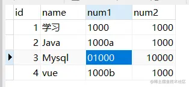

[面试题](https://blog.51cto.com/lxw1844912514/2942444)

#### redis提供6种数据淘汰策略

redis 内存数据集大小上升到一定大小的时候，就会施行数据淘汰策略。

1. volatile-lru：从已设置过期时间的数据集（server.db[i].expires）中挑选**最近最少使用**的数据淘汰

2. volatile-ttl：从已设置过期时间的数据集（server.db[i].expires）中挑选**将要过期**的数据淘汰
3. volatile-random：从已设置过期时间的数据集（server.db[i].expires）中**任意选择数据**淘汰
4. allkeys-lru：从数据集（server.db[i].dict）中挑选最近最少使用的数据淘汰
5. allkeys-random：从数据集（server.db[i].dict）中任意选择数据淘汰
6. no-enviction（驱逐）：禁止驱逐数据

#### dockercompose.yml

```
version: '3'
services:
  redis:
    image: redis:6.2.6-alpine
    container_name: redis-my
    privileged: true
    volumes:
      - ./data:/data
      - ./conf/redis.conf:/usr/local/etc/redis/redis.conf
    ports:
      - 6379:6379
    #command: redis-server /usr/local/etc/redis/redis.conf
```

#### broken pipe

错误原因：拿到了一个无效的连接

#### 远程连接redis

1. 开放防火墙和安全组6379

2. 修改 reids.conf 配置文件

   ```txt
   1.注释掉绑定ip bind 127.0.0.1   #不注释的话就是默认只允许本地访问
   2.将保护模式改成no    protected-mode no
   3.通过requirepass 设置密码
   ```

## 网络

### HTTP2

1、头部压缩

采用hpack算法，具体包括如下

静态编码表：用123替换原来常用header字段,比如method,path

动态编码表：自定义编码表双方进行维护

客户端和服务端动态动态维护字典，用长度较短的索引表示重复字符串，再用哈夫曼算法进行数据压缩

2、二进制帧

将HTTP的文本格式改为二进制数据，极大提高传递效率

帧的结构

首部有长度，标志位（数据结束标志，流的遇险记），流标识符，负载就是实际传输的数据，是经哈夫曼编码的HTTP头部和包体

帧类型


数据帧就是http头部，包体和流的优先级

控制帧就是心跳，流量控制，流终止等

3、并发传输

HTTP1.1基于请求响应模式，完成一个事务（一次请求响应）才能进行下一个事务，有**队头阻塞**问题，管道只能解决请求的对头阻塞，无法解决响应的队尾阻塞，浏览器默认没有开启

**流**是一个逻辑概念，流包含一个或多个**消息**（对应HTTP请求或响应），一个消息可由一个或多个**帧**组成

多个流复用一个TCP连接，不同流对应的帧可以乱序传输，同个流的帧一定要按序传输


4、服务器主动推送资源

### TCP和UDP绑同个端口

https://mp.weixin.qq.com/s/3fMZN_LidCi5fiD16nNWWA

TCP和UDP是**可以同时绑定一个端口**的，只要四元组不同就可以

四元组：源IP,源端口，目标IP,目标端口

可同个reuse参数复用time_wait状态的连接

### DDOS

```
解决：限制半连接的打开数

当大量syn请求包发送给服务端的时候，需要设置合理的最大并发半开连接数。一旦超过相应的最大限制，系统就会认为自己收到了syn flood攻击，进入防范模式中。SYN Timeout时间被减短，SYN-ACK的重试次数减少，系统也会自动对缓冲区中的报文进行延时，避免对TCP/IP堆栈造成过大的冲击，力图将攻击危害减到最低。
在三次握手过程中，服务器发送SYN-ACK之后，收到客户端的ACK之前的TCP连接称为半连接(half-open connect)。此时服务器处于SYN_RECV状态。当收到ACK后，服务器转入ESTABLISHED状态。

攻击客户端通过发包器，在短时间内伪造大量不存在的IP地址，向服务器不断地发送SYN包，服务器回复确认包SYN/ACK，并等待客户的确认，由于源地址是不存在的，服务器需要不断的重发SYN/ACK直至超时，这些伪造的SYN包将长时间占用未连接队列，正常的SYN请求被丢弃，目标系统运行缓慢，严重者引起网络堵塞甚至系统瘫痪。

SYN攻击是一个典型的DDOS攻击。检测SYN攻击非常的方便，当你在服务器上看到大量的半连接状态时，特别是源IP地址是随机的，基本上可以断定这是一次SYN攻击。
```


### RST

TCP的异常终止,一种能够释放TCP连接的机制

```
四种情况会发送RST包：
1、端口未打开
2、请求超时
3、提前关闭
4、在一个已关闭的socket上收到数据
```

### TCP保证可靠传输

#### 校验和

如果接收方比对校验和与发送方不一致，那么数据一定传输有误。但是如果接收方比对校验和与发送方一致，**数据不一定传输成功。**

#### 序列号和确认应答机制

每次收到数据都要进行确认应答，也就是发送ACK报文。这个ACK报文中有对应的确认号，告诉对方期望下次从哪开始发。

数据可通过序列号进行排序，也可去除掉重复序列号的数据。

#### 超时重传

没有收到ACK报文就对刚才的数据进行重新发送

#### 连接管理

三次握手和三次挥手

#### 流量控制

根据窗口大小（接收端的数据缓冲区的大小）改变自己的发送数据速度。

如果窗口为0，停止发送。并定期发送探测数据段（防止接受端告知窗口大小的数据包丢失导致死锁），让接受端告诉自己窗口大小。

#### 拥塞控制

由于不知道网络的情况，一开始就发送大量数据容易导致拥堵，所以引入**慢启动**机制，先发少量数据进行探路。这时候就有**拥塞窗口**的概念，每次收到ACK应答，就指数增长。超过一定阈值后，就线性增长。遇到网络阻塞，就减半。

### 输入URL发生的事

#### 整体组件图


#### DNS查询过程


**DNS记录类型**


**对称加密和非对称加密**


#### 四层负载均衡

vip的概念：也可以保护后端真正的服务器


**调度算法**


**四层负载均衡特点**


#### 七层负载均衡


### CRC

循环冗余校验

生成多项为;G(X)=X^4+X+1.则信息为1101011111的CRC码为（）

```
阶为4，左移4位，按位异或
```


### 各层概述


#### 应用层

为操作系统或网络应用程序提供访问网络服务的接口，数据传输基本单位报文。

应用网关：应用层的协议转换。例如一个主机ISO电子邮件标准，另一个主机执行的是Internet电子邮件标准，如果这两个主机需要交换电子邮件，那么必须经过一个电子邮件网关进行协议转换。

#### 传输层

将上层数据分段并提供端到端的、可靠或不可靠的传输及端到端的差错控制和流量控制，提供建立、维护和取消连接的功能

网关：协议转换器，充当转换翻译的重任，如果两个网络的通信协议、数据格式或语言不同时，网关会对信息重新打包，以适应目标系统的需求。默认在网络层以上实现网络互联（可用于局域网或广域网）

传输网关：在两个网络之间建立传输连接，不同网络的主机之间可跨越多个网络的、级联的、**点对点**的传输连接

#### 网络层

IP寻址和路由选择、分组传输、控制子网运行。

向上提供无连接的、**最大努力的交付**的数据包服务（IP数据报）

**IP地址**有什么用：IP地址通过ARP协议转为MAC地址，最终按照硬件地址找到主机的，那为什么不直接使用MAC地址，主要是**屏蔽**下层异构网络

**IP分组转发算法**

(1)在数据报首部提取目标IP地址D，得出网络地址N.

(2)如果是本网络直接交付（封装成MAC帧）,或根据路由表传给下一跳路由器，或交给默认路由器

**ARP地址解析协议**

保存**IP地址**到**硬件地址**的映射表，并且会动态更新，ARP高速缓存表初始化的时候采用广播的方式

**路由选择协议**

路由选择分为内部网关协议（自治系统AS）和外部网关协议，内部网关协议有RIP和OSPF协议，外部网关协议有BGP协议。

RIP协议（适合小网络）：路由信息协议，基于距离向量，最短跳数16视为不可达，比如（1，3，R）表示到达网络1的跳数为3，下一个路由是R.好消息传得快，坏消息传得慢。

OSPF协议（适合大网络）：开放最短路径优先协议，基于**Dijkstra的最短路径**算法，坏消息能够快速收敛。划分为小的区域进行洪泛，直接使用IP数据包传送。

BGP协议：边界网关协议，域间路由协议，互联网的规模很大，自治系统之间的路由选择非常困难。另外一些数据报为了安全不能通过国外的网络。基于路径向量选择协议，每个自治系统之间保证要有一个BGP代言人。

路由器：连接多个逻辑分开的网络，根据IP地址区分不同的网络，实现网路的互连和隔离，把IP报文传送到正确的网络。

#### 链路层

帧的开始和结束、透明传输、差错校验

网桥：连接两个局域网，根据MAC地址转发帧

交换机：更多端口的网桥，根据帧的目标MAC地址对照MAC地址表决定由哪个端口转发，不在表中则向所有端口转发，及洪泛

#### 物理层

接口标准、如何更快的传输数据

中继器：放大信号

集线器：多个端口的集线器

### DNS域名解析

浏览器首先看一下自己的缓存里有没有，如果没有就向操作系统的缓存要，还没有就检查本机域名解析文件 `hosts`，如果还是没有，就会 DNS 服务器进行查询，查询的过程如下：

1. 客户端首先会发出一个 DNS 请求，问 www.server.com 的 IP 是啥，并发给本地 DNS 服务器（也就是客户端的 TCP/IP 设置中填写的 DNS 服务器地址）。
2. 本地域名服务器收到客户端的请求后，如果缓存里的表格能找到 www.server.com，则它直接返回 IP 地址。如果没有，本地 DNS 会去问它的根域名服务器：“老大， 能告诉我 www.server.com 的 IP 地址吗？” 根域名服务器是最高层次的，它不直接用于域名解析，但能指明一条道路。
3. 根 DNS 收到来自本地 DNS 的请求后，发现后置是 .com，说：“www.server.com 这个域名归 .com 区域管理”，我给你 .com 顶级域名服务器地址给你，你去问问它吧。”
4. 本地 DNS 收到顶级域名服务器的地址后，发起请求问“老二， 你能告诉我 www.server.com 的 IP 地址吗？”
5. 顶级域名服务器说：“我给你负责 www.server.com 区域的权威 DNS 服务器的地址，你去问它应该能问到”。
6. 本地 DNS 于是转向问权威 DNS 服务器：“老三，www.server.com对应的IP是啥呀？” server.com 的权威 DNS 服务器，它是域名解析结果的原出处。为啥叫权威呢？就是我的域名我做主。
7. 权威 DNS 服务器查询后将对应的 IP 地址 X.X.X.X 告诉本地 DNS。
8. 本地 DNS 再将 IP 地址返回客户端，客户端和目标建立连接。


### Ping命令

应用可能用到**DNS**，域名解析服务
网络层**ICMP**协议和**ARP**地址解析协议

### NAT协议

```
将内部网络的私有IP地址翻译成全球唯一的公网IP地址，使内部网络可以连接到互联网上

SNAT:内部地址要访问公网上的服务时，内部地址会主动发起连接，将内部地址转换成公有ip。网关这个地址转换称为SNAT.
DNAT:当内部需要对外提供服务时，外部发起主动连接，路由器或着***的网关接收到这个连接，然后把连接转换到内部，此过程是由带公有ip的网关代替内部服务来接收外部的连接，然后在内部做地址转换，此转换称为DNAT
```

### DHCP协议

动态主机配置协议，局域网网络协议，可自动分配IP地址

### RARP协议

运行局域网的物理机器从网关服务器的ARP表或缓存上请求其IP地址

### 滑动窗口协议

停止等待、退后N帧，选择重传

因此TCP有队头阻塞问题

https://blog.csdn.net/qq_47529104/article/details/123362159


1.发送端和接收端分别设定发送窗口和接收窗口。
2.三次握手的时候，客户端把自己的缓冲区大小也就是窗口大小发送给服务器，服务器回应是也将窗口大小发送给客户端，服务器客户端都知道了彼此的窗口大小。
3.比如主机A的发送窗口大小为5，主机A可以向主机B发送5个单元，如果B缓冲区满了，A就要等待B确认才能继续发送数据。
4.如果缓冲区中有1个报文被进程读取，主机B就会回复ACK给主机A，接收窗口向前滑动，报文中窗口大小为1，就说明A还可以发送1个单元的数据，发送窗口向前滑动，之后等待主机B的确认报文。
只有接收窗口向前滑动并发送了确认时，发送窗口才能向前滑动。

[博客](https://blog.csdn.net/qq_34501940/article/details/51180268)

**停止等待协议**

- 一个好了才能发送下一个，降低信号的利用率

- 发送窗口=1，接受窗口=1


**退后N帧协议**

- 一个接受不到，改帧以后都重传，网络不好的时候会造成大量浪费带宽

- 发送>1,接收=1


**选择重传**协议

- 一个帧坏了，后面的还会缓存起来，只重传丢失的那一个，会浪费缓存

- 发送>1,接收>1


### TCP和HTTP的联系和区别

TCP是传输层的协议，HTTP是应用层协议，HTTP基于TCP协议。HTTP协议只关心约定协议内容，只关心让对方能懂。TCP有发送确认机制，只关心点对点传输，保证消息可靠传输。具体有三次握手，四次挥手机制

### TCP如何保证可靠传输

检验和

连接管理

序列号

确认应答机制

超时重传

流量控制

拥塞控制：慢开始，拥塞避免，快重传，快恢复

```
1、慢开始：少量数据进行试探
2、拥塞避免：指数增长，达到阈值后，加法增长
个别报文段在网络中丢失，但实际网络并未丢失。为避免发送方得不到确认产生超时，误以为发生拥塞于是进行慢开始，导致降低网络的传输效率。
3、快重传：当发送方收到重复的M2确认会快速重传M3
4、快恢复：不采用慢开始，而只将门限值设为拥塞窗口减半，并把拥塞窗口设为门限值
```

### unix五种IO模型

IO分为两个阶段：数据准备和数据拷贝

数据准备：设备到内核

数据拷贝：内核拷贝到用户空间

https://blog.csdn.net/qq_35361244/article/details/109251983

```
阻塞io：数据准备和数据拷贝阶段都阻塞

非阻塞io：数据准备阶段不阻塞，轮询数据是否准备好，耗cpu

多路复用io：适合多连接，只用一个线程在select轮询内核socket状态，

信号io:发送io请求就到socker注册一个信号，内核数据报准备好发送信号通知用户线程

异步io：数据主备和数据复制都交给内核完成，真正非阻塞
```

#### 1、阻塞式I/O

等待数据和拷贝数据都等待


#### 2、非阻塞式I/O

不断**系统调用**询问数据是否准备好，即在数据准备阶段不会阻塞


#### 3、I/O复用

[select,poll,epoll](https://blog.csdn.net/wteruiycbqqvwt/article/details/90299610)

```
select：O(n) 遍历
poll：O(n) 遍历，无连接数限制，因为采用链表
epoll：O(1) 事件IO
```

**select**阻塞调用线程，直到一个或多个数据包准备就绪，然后系统调用（**recvfrom**）拷贝数据


#### 4、信号驱动I/O

调用**sigio**函数，不阻塞执行其它任务，内核数据包准备就绪发送就绪信号，进程收到通知后调用**recvfrom**函数，拷贝数据到缓冲区


#### 5、异步I/O

不阻塞，并且所有任务都交给内核处理（数据准备和数据拷贝），全部准备好了再通知线程处理数据报，真正做到非阻塞。


下面这张图，总结了以上几种 I/O 模型：


在前面我们知道了，I/O 是分为两个过程的：

1. 数据准备的过程
2. 数据从内核空间拷贝到用户进程缓冲区的过程

阻塞 I/O 会阻塞在「过程 1 」和「过程 2」，而非阻塞 I/O 和基于非阻塞 I/O 的多路复用只会阻塞在「过程 2」，所以这三个都可以认为是同步 I/O。

异步 I/O 则不同，「过程 1 」和「过程 2 」都不会阻塞。

### STOMP协议

```java
package com.wzh.demo.websocket.config;

import com.wzh.demo.websocket.handler.MyPrincipalHandshakeHandler;
import com.wzh.demo.websocket.interceptor.WebSocketChannelInterceptor;
import com.wzh.demo.websocket.interceptor.WebSocketHandshakeInterceptor;
import org.springframework.context.annotation.Bean;
import org.springframework.context.annotation.Configuration;
import org.springframework.messaging.converter.MessageConverter;
import org.springframework.messaging.handler.invocation.HandlerMethodArgumentResolver;
import org.springframework.messaging.handler.invocation.HandlerMethodReturnValueHandler;
import org.springframework.messaging.simp.config.ChannelRegistration;
import org.springframework.messaging.simp.config.MessageBrokerRegistry;
import org.springframework.scheduling.concurrent.DefaultManagedTaskScheduler;
import org.springframework.scheduling.concurrent.ThreadPoolTaskScheduler;
import org.springframework.util.AntPathMatcher;
import org.springframework.web.socket.config.annotation.EnableWebSocketMessageBroker;
import org.springframework.web.socket.config.annotation.StompEndpointRegistry;
import org.springframework.web.socket.config.annotation.WebSocketMessageBrokerConfigurer;
import org.springframework.web.socket.config.annotation.WebSocketTransportRegistration;

import java.util.List;

/**
 * <配置基于STOMP的websocket>
 * <功能详细描述>
 * @author wzh
 * @version 2018-08-12 18:38
 * @see [相关类/方法] (可选)
 **/
@Configuration
@EnableWebSocketMessageBroker
public class WebSocketStompConfig implements WebSocketMessageBrokerConfigurer {

    /**
     * 添加这个Endpoint，这样在网页中就可以通过websocket连接上服务,
     * 也就是我们配置websocket的服务地址,并且可以指定是否使用socketjs
     * 
     * @param registry
     */
    @Override
    public void registerStompEndpoints(StompEndpointRegistry registry)
    {
        
        /*
         * 1. 将 /serviceName/stomp/websocketJs路径注册为STOMP的端点，
         *    用户连接了这个端点后就可以进行websocket通讯，支持socketJs
         * 2. setAllowedOrigins("*")表示可以跨域
         * 3. withSockJS()表示支持socktJS访问
         * 4. addInterceptors 添加自定义拦截器，这个拦截器是上一个demo自己定义的获取httpsession的拦截器
         * 5. addInterceptors 添加拦截处理，这里MyPrincipalHandshakeHandler 封装的认证用户信息
         */
        registry.addEndpoint("/stomp/websocketJS")
                //.setAllowedOrigins("*")
                .addInterceptors(new WebSocketHandshakeInterceptor())
                .setHandshakeHandler(new MyPrincipalHandshakeHandler())
                .withSockJS()

        ;

        /*
         * 看了下源码，它的实现类是WebMvcStompEndpointRegistry ，
         * addEndpoint是添加到WebMvcStompWebSocketEndpointRegistration的集合中，
         * 所以可以添加多个端点
         */
        registry.addEndpoint("/stomp/websocket");
    }

    /**
     * 配置消息代理
     * @param registry
     */
    @Override
    public void configureMessageBroker(MessageBrokerRegistry registry)
    {
        /*
         *  enableStompBrokerRelay 配置外部的STOMP服务，需要安装额外的支持 比如rabbitmq或activemq
         * 1. 配置代理域，可以配置多个，此段代码配置代理目的地的前缀为 /topicTest 或者 /userTest
         *    我们就可以在配置的域上向客户端推送消息
         * 3. 可以通过 setRelayHost 配置代理监听的host,默认为localhost
         * 4. 可以通过 setRelayPort 配置代理监听的端口，默认为61613
         * 5. 可以通过 setClientLogin 和 setClientPasscode 配置账号和密码
         * 6. setxxx这种设置方法是可选的，根据业务需要自行配置，也可以使用默认配置
         */
        //registry.enableStompBrokerRelay("/topicTest","/userTest")
                //.setRelayHost("rabbit.someotherserver")
                //.setRelayPort(62623);
                //.setClientLogin("userName")
                //.setClientPasscode("password")
                //;

        // 自定义调度器，用于控制心跳线程
        ThreadPoolTaskScheduler taskScheduler = new ThreadPoolTaskScheduler();
        // 线程池线程数，心跳连接开线程
        taskScheduler.setPoolSize(1);
        // 线程名前缀
        taskScheduler.setThreadNamePrefix("websocket-heartbeat-thread-");
        // 初始化
        taskScheduler.initialize();

        /*
         * spring 内置broker对象
         * 1. 配置代理域，可以配置多个，此段代码配置代理目的地的前缀为 /topicTest 或者 /userTest
         *    我们就可以在配置的域上向客户端推送消息
         * 2，进行心跳设置，第一值表示server最小能保证发的心跳间隔毫秒数, 第二个值代码server希望client发的心跳间隔毫秒数
         * 3. 可以配置心跳线程调度器 setHeartbeatValue这个不能单独设置，不然不起作用，要配合setTaskScheduler才可以生效
         *    调度器我们可以自己写一个，也可以自己使用默认的调度器 new DefaultManagedTaskScheduler()
         */
        registry.enableSimpleBroker("/topicTest","/userTest")
                .setHeartbeatValue(new long[]{10000,10000})
                .setTaskScheduler(taskScheduler);
        /*
         *  "/app" 为配置应用服务器的地址前缀，表示所有以/app 开头的客户端消息或请求
         *  都会路由到带有@MessageMapping 注解的方法中
         */
        registry.setApplicationDestinationPrefixes("/app");

        /*
         *  1. 配置一对一消息前缀， 客户端接收一对一消息需要配置的前缀 如“'/user/'+userid + '/message'”，
         *     是客户端订阅一对一消息的地址 stompClient.subscribe js方法调用的地址
         *  2. 使用@SendToUser发送私信的规则不是这个参数设定，在框架内部是用UserDestinationMessageHandler处理，
         *     而不是而不是 AnnotationMethodMessageHandler 或  SimpleBrokerMessageHandler
         *     or StompBrokerRelayMessageHandler，是在@SendToUser的URL前加“user+sessionId"组成
         */
        registry.setUserDestinationPrefix("/user");

        /*
         * 自定义路径分割符
         * 注释掉的这段代码添加的分割符为. 分割是类级别的@messageMapping和方法级别的@messageMapping的路径
         * 例如类注解路径为 “topic”,方法注解路径为“hello”，那么客户端JS stompClient.send 方法调用的路径为“/app/topic.hello”
         * 注释掉此段代码后，类注解路径“/topic”,方法注解路径“/hello”,JS调用的路径为“/app/topic/hello”
         */
        //registry.setPathMatcher(new AntPathMatcher("."));

    }

    /**
     * 配置发送与接收的消息参数，可以指定消息字节大小，缓存大小，发送超时时间
     * @param registration
     */
    @Override
    public void configureWebSocketTransport(WebSocketTransportRegistration registration) {
        /*
         * 1. setMessageSizeLimit 设置消息缓存的字节数大小 字节
         * 2. setSendBufferSizeLimit 设置websocket会话时，缓存的大小 字节
         * 3. setSendTimeLimit 设置消息发送会话超时时间，毫秒
         */
        registration.setMessageSizeLimit(10240)
                    .setSendBufferSizeLimit(10240)
                    .setSendTimeLimit(10000);
    }

    /**
     * 设置输入消息通道的线程数，默认线程为1，可以自己自定义线程数，最大线程数，线程存活时间
     * @param registration
     */
    @Override
    public void configureClientInboundChannel(ChannelRegistration registration) {

        /*
         * 配置消息线程池
         * 1. corePoolSize 配置核心线程池，当线程数小于此配置时，不管线程中有无空闲的线程，都会产生新线程处理任务
         * 2. maxPoolSize 配置线程池最大数，当线程池数等于此配置时，不会产生新线程
         * 3. keepAliveSeconds 线程池维护线程所允许的空闲时间，单位秒
         */
        registration.taskExecutor().corePoolSize(10)
                    .maxPoolSize(20)
                    .keepAliveSeconds(60);
        /*
         * 添加stomp自定义拦截器，可以根据业务做一些处理
         * springframework 4.3.12 之后版本此方法废弃，代替方法 interceptors(ChannelInterceptor... interceptors)
         * 消息拦截器，实现ChannelInterceptor接口
         */
        registration.setInterceptors(webSocketChannelInterceptor());
    }

    /**
     *设置输出消息通道的线程数，默认线程为1，可以自己自定义线程数，最大线程数，线程存活时间
     * @param registration
     */
    @Override
    public void configureClientOutboundChannel(ChannelRegistration registration) {
        registration.taskExecutor().corePoolSize(10)
                    .maxPoolSize(20)
                    .keepAliveSeconds(60);
        //registration.setInterceptors(new WebSocketChannelInterceptor());
    }

    /**
     * 添加自定义的消息转换器，spring 提供多种默认的消息转换器，
     * 返回false,不会添加消息转换器，返回true，会添加默认的消息转换器，当然也可以把自己写的消息转换器添加到转换链中
     * @param list
     * @return
     */
    @Override
    public boolean configureMessageConverters(List<MessageConverter> list) {
        return true;
    }

    /**
     * 自定义控制器方法的参数类型，有兴趣可以百度google HandlerMethodArgumentResolver这个的用法
     * @param list
     */
    @Override
    public void addArgumentResolvers(List<HandlerMethodArgumentResolver> list) {

    }

    /**
     * 自定义控制器方法返回值类型，有兴趣可以百度google HandlerMethodReturnValueHandler这个的用法
     * @param list
     */
    @Override
    public void addReturnValueHandlers(List<HandlerMethodReturnValueHandler> list) {

    }

    /**
     * 拦截器加入 spring ioc容器
     * @return
     */
    @Bean
    public WebSocketChannelInterceptor webSocketChannelInterceptor()
    {
        return new WebSocketChannelInterceptor();
    }

}


```


### HTTP常见状态码

#### **状态码分类表**

​          类别                    								原因短句

1xx	Informational（信息性状态码）	接受的请求正在处理
2xx	Success（成功状态码）	  			请求正常处理完毕
3xx	Redirection（重定向）					需要进行附加操作以完成请求
4xx	Client error（客户端错误）			客户端请求出错，服务器无法处理请求
5xx	Server Error（服务器错误）			服务器处理请求出错

#### **各类别常见状态码：**

```
301 永久重定向
302 临时重定向
304 not modify未修改


2xx （3种）

200 OK：表示从客户端发送给服务器的请求被正常处理并返回；

204 No Content：表示客户端发送给客户端的请求得到了成功处理，但在返回的响应报文中不含实体的主体部分（没有资源可以返回）；

206 Patial Content：表示客户端进行了范围请求，并且服务器成功执行了这部分的GET请求，响应报文中包含由Content-Range指定范围的实体内容。

3xx （5种）

301 Moved Permanently：永久性重定向，表示请求的资源被分配了新的URL，之后应使用更改的URL；

302 Found：临时性重定向，表示请求的资源被分配了新的URL，希望本次访问使用新的URL；

       301与302的区别：前者是永久移动，后者是临时移动（之后可能还会更改URL）

303 See Other：表示请求的资源被分配了新的URL，应使用GET方法定向获取请求的资源；

      302与303的区别：后者明确表示客户端应当采用GET方式获取资源

304 Not Modified：表示客户端发送附带条件（是指采用GET方法的请求报文中包含if-Match、If-Modified-Since、If-None-Match、If-Range、If-Unmodified-Since中任一首部）的请求时，服务器端允许访问资源，但是请求为满足条件的情况下返回改状态码；

307 Temporary Redirect：临时重定向，与303有着相同的含义，307会遵照浏览器标准不会从POST变成GET；（不同浏览器可能会出现不同的情况）；

4xx （4种）

400 Bad Request：表示请求报文中存在语法错误；

401 Unauthorized：未经许可，需要通过HTTP认证；

403 Forbidden：服务器拒绝该次访问（访问权限出现问题）

404 Not Found：表示服务器上无法找到请求的资源，除此之外，也可以在服务器拒绝请求但不想给拒绝原因时使用；
405 请求方式不对

5xx （2种）

500 Inter Server Error：表示服务器在执行请求时发生了错误，也有可能是web应用存在的bug或某些临时的错误时；

503 Server Unavailable：表示服务器暂时处于超负载或正在进行停机维护，无法处理请求；
```

### Https

用非对称加密的方式协商对称密匙

#### 一、四次握手过程

1、客户端发送TLS版本，client随机数和支持的密码套件列表（密匙交换算法--签名算法--对称加密算法--摘要算法）

2、服务端发送TLS版本，server随机数，选择的密码套件和数字证书

3、验证证书的安全性并得到服务器RSA公匙，生称新的新的随机数（pre-master）并用RSA公匙加密发给服务端。服务收到后用RSA解密得到pre-master。

至此双方都共享了三个随机数：客户端随机数，服务端随机数，pre-master，用于生成会话密匙，他就是对称密匙。

然后客户端就把之前发送的所有数据做个摘要，使用会话密匙加密让服务器验证一下消息是否又被篡改。

4、服务器也是同样的操作，双方都验证加密和解密没问题，握手正式完成


TLS四次握手过程

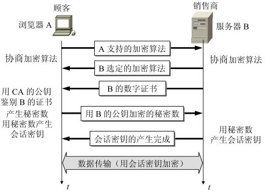

#### 二、数字证书签发和验证流程

CA 签发证书的过程，如上图左边部分：

- 首先 CA 会把持有者的公钥、用途、颁发者、有效时间等信息打成一个包，然后对这些信息进行 Hash 计算，得到一个 Hash 值；
- 然后 CA 会使用自己的私钥将该 Hash 值加密，生成 Certificate Signature，也就是 CA 对证书做了签名；
- 最后将 Certificate Signature 添加在文件证书上，形成数字证书；

客户端校验服务端的数字证书的过程，如上图右边部分：

- 首先客户端会使用同样的 Hash 算法获取该证书的 Hash 值 H1；
- 通常浏览器和操作系统中集成了 CA 的公钥信息，浏览器收到证书后可以使用 CA 的公钥解密 Certificate Signature 内容，得到一个 Hash 值 H2 ；
- 最后比较 H1 和 H2，如果值相同，则为可信赖的证书，否则则认为证书不可信。


#### 证书链

证书信任链

开始客户端只信任根证书 GlobalSign Root CA 证书的，然后 “GlobalSign Root CA” 证书信任 “GlobalSign Organization Validation CA - SHA256 - G2” 证书，而 “GlobalSign Organization Validation CA - SHA256 - G2” 证书又信任 baidu.com 证书，于是客户端也信任 baidu.com 证书。


### RSA的公钥、私钥

采用单钥[密码系统](https://baike.baidu.com/item/密码系统)的加密方法，同一个[密钥](https://baike.baidu.com/item/密钥)可以同时用作信息的加密和解密，这种加密方法称为对称加密，也称为单[密钥加密](https://baike.baidu.com/item/密钥加密)。

与对称加密[算法](https://baike.baidu.com/item/算法)不同，[非对称加密算法](https://baike.baidu.com/item/非对称加密算法)需要两个[密钥](https://baike.baidu.com/item/密钥)：[公开密钥](https://baike.baidu.com/item/公开密钥)（publickey）和私有密钥（privatekey）。[公开密钥](https://baike.baidu.com/item/公开密钥)与私有密钥是一对，如果用公开密钥对数据进行加密，只有用对应的私有密钥才能解密；如果用私有密钥对数据进行加密，那么只有用对应的公开密钥才能解密。因为加密和解密使用的是两个不同的[密钥](https://baike.baidu.com/item/密钥)，所以这种算法叫作[非对称加密算法](https://baike.baidu.com/item/非对称加密算法)。

一、举个例子

1、发消息

  用对方的公钥给对方发消息


2、发公告

 发公告的时候，用自己的私钥形成签名！


#### 二、加密和签名

RSA的公钥、私钥是互相对应的，RSA会生成两个密钥，你可以把任何一个用于公钥，然后另一个就是你必须保护好的私钥了。

RSA的公钥、私钥都可以加密，也都可以解密。

其中：

用公钥加密需要私钥解密，称为“加密”。由于私钥是不公开的，确保了内容的保密，没有私钥无法获得内容；

用私钥加密需要公钥解密，称为“签名”。由于公钥是公开的，任何人都可以解密内容，但只能用发布者的公钥解密，验证了内容是该发布者发出的。

所以：

如果用于加密解密，那就是用公钥加密私钥解密（仅你可读但别人不可读，任何人都可写）

如果用于证书验证，那就是用私钥加密公钥解密（仅你可写但别人不可写，任何人都可读）

#### 三、认证过程


#### jwt的签名算法有三种：

- HMAC【哈希消息验证码(对称)】：HS256/HS384/HS512
- RSASSA【RSA签名算法(非对称)】（RS256/RS384/RS512）
- ECDSA【椭圆曲线数据签名算法(非对称)】（ES256/ES384/ES512）

### TCP三次握手和四次挥手

TCP三次握手**TCP运输连接有三个阶段：连接建立、数据传送、连接释放**

TCP连接过程通常叫做**握手**，握手需要客户端和服务器端交换三个报文，如下图所示

之所以需要三次握手是因为TCP是可靠传输，三次能够刚好可靠又不多余

TCP三次握手与Socket的连接过程是相关联对应的，Socket就是对于TCP/IP的封装么

客户端有CLOSED、SYN-SEND、ESTABLISHED三种状态

客户端有CLOSED、LISTEN、SYN-RCVD、ESTABLISHED四种状态

服务器会首先创建连接，并且进入监听等待阶段，等待客户端的请求

当需要发送请求时，浏览器客户端主动打开连接，然后服务器被动打开连接

#### 连接过程

#### TCP三次握手

客户端在需要时，向服务器发起请求连接报文，发出后状态从CLOSED转换为SYN-SEND 同步-已发送状态

服务器一直处于LISTEN状态，接收到请求后，对客户端的请求进行回应，转换为SYN-RCVD，同步-已收到状态

客户端收到服务器的回应后，状态转换为ESTABLISHED，并且再次向服务器发送确认

服务器收到客户端的确认之后，服务器也转换为ESTABLISHED状态，完成了连接

**发出消息或者收到消息后状态才会进行切换**

客户端与服务器的握手是一个往复确认的过程

客户端：发出确认请求，SYN=1，seq=x，你听得到么，我想建立连接（SYN=1），我的序号是x（seq=x）

服务器：对请求进行确认，也就是回应，我听到了（ACK=1，ack=x+1），你听得到么（SYN=1），我的序号是y（seq=y）

客户端：对服务器的回应进行确认，我听到了（ACK=1，ack=y+1），我的序号是x+1

IP数据报经过运输层需要分段发送，所以在TCP的处理过程中，有**序号**的概念

比如客户端说我要从666号开始，发送100个数据，服务器说，我是从888号开始回应的

上面的seq=x 和 seq=y  seq=x+1（上一个seq=x，下一个自然就是seq=x+1了）都是各自的序号**握手的过程就是SYN seq  ACK ack的来回确认**

SYN ACK是头部的字段，可以理解为标志位，协议中有对他们的值有具体的规定

ack就是确认号，确认号是期望收到的对方的下一个报文段的第一个数据字节的序号，也就是收到的序号+1

否则随便一个，怎么对得上号

#### 为什么要三次握手？

如果不是三次握手，只有两次

如果客户端发出请求连接时，报文延时了，于是客户端重新发送了一次连接请求消息

后来收到了确认，建立了连接，然后完成了数据传输，关闭了连接

此时，服务器收到了那个迟到的请求消息，此时他应该是个废物了

但是如果只有两次握手，服务器收到请求就响应建立了连接了

但是如果是三次，客户端不会再次确认，服务器也就随后知道了这消息有问题，不会建立连接

#### TCP四次挥手

连接建立以后就可以进行数据通信传输了

通信结束后，需要断开连接，断开连接需要四次交互，常被称为**四次挥手**

**最初状态均为ESTABLISHED**，客户端与服务器相互进行数据传送

下图假设客户端无数据发送，请求断开连接

断开过程客户端无数据发送时，请求关闭连接，我好了，我想断开连接了（FIN=1）我的序号是u（u就是之前传送过的所有数据的最后一个字节的序号+1）

此时客户端转变为FIN-WAIT-1状态

服务器收到客户端的消息后，告诉客户端“好的，我知道了”（ACK=1，ack=u+1），这条消息的序号是v（seq=v ，这是服务器发送消息的序号)

此时服务器的状态就转换为了CLOSE-WAIT状态

此时，客户端通往服务器的路就断开了，客户端不能向服务器发送数据但是服务器仍旧可以向客户端发送数据，现在是“半关闭”的状态

当客户端收到来自服务器的确认之后，进入FIN-WAIT-2状态，等待服务器那边说断开连接，等待中。。。。。

当服务器所有的数据也都完全发送完成了之后，服务器才开始主动告知客户端断开连接（FIN=1，seq=w）

这中间服务器可能又继续发送了一些数据，可能是v+1 也可能发送了更多，所以设置为w

并且再次发送确认信息（ACK=1，ack=u+1，因为客户端已经不能发送数据了，服务器期望收到的序号永远都是最后一个序号+1，也就是u+1）

这时，服务器就进入了LAST-ACK状态，最后确认状态

客户端收到了服务器的断开连接请求后，也需要给出确认响应（ACK=1，ack=w+1，seq=u+1），然后进入TIME-WAIT状态

等待两个MSL后，进入关闭状态

MSL 是Maximum Segment Lifetime英文的缩写“报文最大生存时间”，他是任何报文在网络上存在的最长时间，超过这个时间报文将被丢弃。服务器最终收到来自客户端的确认信息后，关闭，进入CLOSED状态

**四次挥手也是一个互相确认的过程，你说不玩了，别人答应了，还要等别人都搞好了再告诉你可以走了，你才能走**

客户端：我不想玩了

服务器：好的我知道了

服务器：你可以走了

客户端：好的我走了

就如同在网吧上网，你点击下机之后，再去网管那边结账

结账清楚了之后才彻底结束，而不是你说走就走了，难道你办会员卡了么

这个过程很好理解，**客户端发出请求后，并不意味着服务器都已经完成响应****所以当客户端请求断开时，并不能立即断开，还需要等待服务器那边处理妥当，再来通知你的确是可以断开了

消息发出来谁知道别人收没收到，所以还需要一个确认

### TIME_WAIT等待2MSL

msl:（报文最大存活时间）

1. 确保服务器收到自己的ACK报文，让服务器释放资源

   自己传过去的ACK传输的最大时间，这段时间服务器还没收到触发超时重传，**重传所需要的时间**。

2. 让网路中遗留老连接都死亡，避免影响被动方新的连接。如果没有TIME_WAIT，如果被动方延迟的FIN包到了主动方，主动方会发送RST包，那么会**影响被动方新的连接**

### ip地址划分

主机数要减去全0和全1，**全0代表一个网段**，**全1表示广播地址**

**127是环路地址**

```
3、公有地址（Public address）

由Inter NIC（Internet Network Information Center 因特网信息中心）负责。这些IP地址分配给注册并向Inter NIC提出申请的组织机构。通过它直接访问因特网。

 

4、私有地址（Private address）

属于非注册地址，专门为组织机构内部使用。以下为留用的私有地址：
       A类 10.0.0.0--10.255.255.255         (10.0.0.0/8)
       B类 172.16.0.0--172.31.255.255      (172.16.0.0/12)
       C类 192.168.0.0--192.168.255.255  (192.168.0.0/16)

我们平时说的局域网地址一般都是在留用的私有地址的范围内，这些地址为非注册IP。局域网和外网交互是通过互联网运营商分配给我们的动态IP（该IP为公有IP地址）。一般一个局域网分配一个公有IP，局域网内的所有主机通过路由器（或其他设备）上的一种映射机制访问外网。
```

### 网卡（网络设配器）

```
电脑与局域网相连的设备
```

### 粘包

tcp为了提高效率，每次都要等足够长的数据才进行发送

```
A:固定长度；
B：分隔符
D:添加长度信息。
```

### IPv6

128位、**取消了分片/重新组装相关字段**

- IPv6 可自动配置，即使没有 DHCP 服务器也可以实现自动分配IP地址，真是**便捷到即插即用**啊。
- IPv6 包头包首部长度采用固定的值 `40` 字节，去掉了包头校验和，简化了首部结构，减轻了路由器负荷，大大**提高了传输的性能**。
- IPv6 有应对伪造 IP 地址的网络安全功能以及防止线路窃听的功能，大大**提升了安全性**。

### 网卡

网卡**属于OSI的物理层与链路层**，它工作在物理层和数据链路层的MAC子层。

网卡，即网络接口控制器，又称网络接口控制器，网络适配器，网卡，或局域网接收器，是一块被设计用来允许**计算机在计算机网络上进行通讯的计算机硬件**；**计算机与外界局域网的连接是通过网卡进行的**。由于其拥有MAC地址，因此属于OSI模型的第1层（物理层）；它使得用户可以通过电缆或无线相互连接。

**网卡主要功能：**

1、实现与主机总线的通讯连接，解释并执行主机的控制命令。

2、实现数据链路层的功能。

3、实现物理层的功能 网卡简称网络接口卡 ，是计算机局域网中重要的连接设备之一，**计算机通过网卡接入网络**。

## 算法和数据结构

### 二次散列


### 唯一确定一颗二叉树

一定要有**中序**才能唯一确定一颗二叉树

- 先序和后续只能确定根节点，再从中序分割出左右子树

- 根据根节点把中序遍历分为左右子树。

### 二叉树度和节点数

```
n2=n0-1 度为2的结点比叶子结点少一个
```

```
结论：二叉树中度数为2的节点数量比叶子节点少一个

证明：设0度节点（叶子节点）、一度节点、二度节点数量分别为n0,n1,n2

那么总的点数为n=n0+n1+n2。

而边的数量为m=n-1（树的性质）

同时又有m=2*n2+1*n1+0*n0

所以 n0+n1+n2-1=m=2n2+n1

所以 n2=n0-1
```


### 时间复杂度

```
log4n=log2^2n=0.5log2n
```


```java
下面两种道理都是一样的

//时间复杂度为 2^n
    
func(int n){
	if(n==1){
		return;
	}
	return n*func（n-1）（n-2）;
}


//时间复杂度：2^n
func(int n){
    if(n==1){
        return;
    }
    return f(n-1)+(n-2);
}

f(6)=        f(5)         +           f(4)
        f(4)        f(3)         f(3)       f(2)
   f(3)     (2)   f(2) f(1)   f(2)   f(1)
 f(2)(1)   f(1)
```

### 八大排序

```
稳定性：跳跃的一定是不稳定的
希尔排序就是插入排序的升级版，不稳定的，复杂度最差最坏都是O(nlog2n)
归并排序：O(nlog2n),稳定
```

**直接插入排序**（稳定）：从第二位开始遍历，如果小于前一位，就找到往前找插入到最合适的位置。O(n^2)。稳定

**希尔排序**（不稳定）：插入排序的升级版，对一个增量进行插入排序，增量不断减小至1。O(nlogn)。会跳跃，不稳定

**冒泡排序**（稳定）：O(n^2)  左右交换，稳定

**快速排序**（不稳定）：O(nlogn)会跳跃，不稳定

**直接选择排序**：每次找到最小的，和开头进行跨域交换，所以不稳定。O(n^2)。不稳定，比如7，7，2，7和2交换之后就不稳定了

**堆排序**（不稳定）：O(nlogn) 会跳跃，不稳定

**归并排序**（稳定）：二路归并排序，倒满二叉树，子序列有序，再进行合并。O(nlogn) 稳定

**基数排序**（稳定）：O(d(n+r))。个位，十位逐个比较，稳定


### 补码

符号位不变，各位取反，末位加一

```
负数的补码是将其原码除符号位之外的各位求反之后在末位再加1。
[-3]补=[10000011]补=11111101
```

### 强连通图

每一对顶点之间都存在路径

n个顶点的有向强连通图：至少有n条边（形成环），最多有n(n-1)条边

n个顶点的无向强连通图：至少有n-1条边（一条直线），最多有n(n-1)/2条边

### 排列组合

[文章](https://zhuanlan.zhihu.com/p/41855459)

#### 排列

从n个不同元素中取出m个元素的所有排列的个数，记作 A（n，m）


#### 组合

从n个不同中取出m个元素的所有组合个数，记作 C（n，m）


### 等差和等比数列

等差数列：sn=(n(1+n))/2

等比数列：sn=(a1(1-q^n))/(1-q)

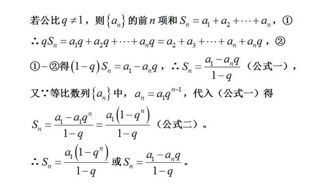

### 二叉搜索树

中序的前驱后继结点

### 最小生成树：

#### prim（普里姆）算法

每次维护一个联通集（已形成的生成树），不断**加入距生成树最近的顶点**。

顶点多比较适合。

#### Kruskal（克鲁斯卡尔）算法

**贪心算法**：每次把最短的边连起来

eloge边先排好序，每次把边连起来，同时**保证不形成环**就连起来。

边少比较适合。

### 单源最短路径

#### Dijkstra（迪杰斯特拉）

每次找到距离源点的最近结点，如果未加入的节点能通过新加入的节点更短的到达源节点，那么更新v0到该结点的最短路径，O(n2)

#### Floyd（弗洛伊德算法）

如果有一个点k让i，j的距离更短，更新i，j的距离

三重循环，每次修改得到更小的前驱结点，O(n3)。

### 哈夫曼树

带权最短路径WPL最小的二叉树，**权重越大的让他路径越短**


### 红黑树

https://blog.csdn.net/u014454538/article/details/120120216

```
1、头尾（nil）都是黑结点
2、从叶子结点到根节点黑色结点数目是一样的
3、红色结点两个子节点都是黑色
```


### B&B+树

```
B树不支持不支持顺序查找，
b树和B+树都支持随机查找，都可做文件的索引结构，平衡多叉树
```

#### 二叉排序树

#### `可能退化成链表`

#### 平衡二叉树(AVL)

#### `每个结点的左右子树高度差至多等于一`

### 最大公约数

```
m*n=最大公约数*最小公倍数

辗转相除法或辗转相减法
```

```java
    // 辗转相除法递归
    public int gcd1(int m,int n){
        while (n!=0){
            int remainder=m%n;
            m=n;
            n=remainder;
        }
        return m;
    }
    // 辗转相除法迭代
    public int gcd2(int m,int n){
        if(n==0)
            return m;
        return gcd2(n,m%n);
    }

    // 辗转相减法
    public int gcd3(int m,int n){
        while(m!=n){
            if(m>n){
                m=m-n;
            }
            else{
                n=n-m;
            }
        }
	    return m;
    }
```

### 快排:会退化成O(n2)

[博客园](https://www.cnblogs.com/MOBIN/p/4681369.html)

```java

    public static void quickSort(int arr[],int _left,int _right){
        int left = _left;
        int right = _right;
        int temp = 0;
        if(left <= right){   //待排序的元素至少有两个的情况
            temp = arr[left];  //待排序的第一个元素作为基准元素
            while(left != right){   //从左右两边交替扫描，直到left = right
                while(right > left && arr[right] >= temp)  
                     right --;        //从右往左扫描，找到第一个比基准元素小的元素
                  arr[left] = arr[right];  //找到这种元素arr[right]后与arr[left]交换
                while(left < right && arr[left] <= temp)
                     left ++;         //从左往右扫描，找到第一个比基准元素大的元素
                  arr[right] = arr[left];  //找到这种元素arr[left]后，与arr[right]交换
            }
            arr[right] = temp;    //基准元素归位
            quickSort(arr,_left,left-1);  //对基准元素左边的元素进行递归排序
            quickSort(arr, right+1,_right);  //对基准元素右边的进行递归排序
        }        
    }
```

### 堆排序`len/2+1为最后一个非叶子结点`

[博客园](https://www.cnblogs.com/chengxiao/p/6129630.html)

```java
package sortdemo;

import java.util.Arrays;

/**
 * Created by chengxiao on 2016/12/17.
 * 堆排序demo
 */
public class HeapSort {
    public static void main(String []args){
        int []arr = {9,8,7,6,5,4,3,2,1};
        sort(arr);
        System.out.println(Arrays.toString(arr));
    }
    public static void sort(int []arr){
        //1.构建大顶堆
        for(int i=arr.length/2-1;i>=0;i--){
            //从第一个非叶子结点从下至上，从右至左调整结构
            adjustHeap(arr,i,arr.length);
        }
        //2.调整堆结构+交换堆顶元素与末尾元素
        for(int j=arr.length-1;j>0;j--){
            swap(arr,0,j);//将堆顶元素与末尾元素进行交换
            adjustHeap(arr,0,j);//重新对堆进行调整
        }

    }

    /**
     * 调整大顶堆（仅是调整过程，建立在大顶堆已构建的基础上）
     * @param arr
     * @param i
     * @param length
     */
    public static void adjustHeap(int []arr,int i,int length){
        int temp = arr[i];//先取出当前元素i
        for(int k=i*2+1;k<length;k=k*2+1){//从i结点的左子结点开始，也就是2i+1处开始
            if(k+1<length && arr[k]<arr[k+1]){//如果左子结点小于右子结点，k指向右子结点
                k++;
            }
            if(arr[k] >temp){//如果子节点大于父节点，将子节点值赋给父节点（不用进行交换）
                arr[i] = arr[k];
                i = k;
            }else{
                break;
            }
        }
        arr[i] = temp;//将temp值放到最终的位置
    }

    /**
     * 交换元素
     * @param arr
     * @param a
     * @param b
     */
    public static void swap(int []arr,int a ,int b){
        int temp=arr[a];
        arr[a] = arr[b];
        arr[b] = temp;
    }
}
```

##### 设一课完全二叉树共有999个结点，则在该二叉树中的叶节点个数是？

```
最后一个结点999/2=499为它的父节点，说明它499之后都是叶子节点，所以999-499=500
```

##### 给定一个由若干 0 和 1 组成的数组 A，我们最多可以将 K 个值从 0 变成 1 ，返回仅包含 1 的最长（连续）子数组的长度

```
    public static int GetMaxConsecutiveOnes(int[] arr, int k) {
        // 判断数组长度是否小于等于将0变为1的长度  若是 则最长连续为数组的长度
        if (arr.length <= k) {
            return arr.length;
        }
        int i = 0;
        // 存储最长连续子数组的长度
        int max = 0;
        // 从索引为0的数组下标开始循环    直到索引大于数组长度减去k的长度
        while (i < arr.length - k) {
            // 定义将0变为1的次数
            int count = 0;
            // 从索引为i处开始循环对比
            int j = i;
            for (; j < arr.length; j++) {
                // 如果索引位置处的值不为1   则将count++  意思为将0变成1了
                if (arr[j] != 1) {
                    count++;
                }
                // 如果将0变为1的次数 大于最初定义的k次数 则将长度和最大值对比  保留最长的长度
                if (count > k) {
                    max = max > j - i ? max : j - i;
                    break;
                }
            }
            // 如果循环完毕最终长度和数组长度相同  则再将长度和最大值对比  保留最长的长度
            if (j==arr.length){
                max = max > j - i ? max : j - i;
            }
            i++;
        }
        return max;

    }
    
    
    
```

## 分布式算法

### paxos算法

分布式共识算法

### raft算法

分布式共识算法

复制日志来实现多副本状态机

动图：https://thesecretlivesofdata.com/raft/

https://blog.csdn.net/daaikuaichuan/article/details/98627822

#### 1、Raft分为哪几个部分？

  **主要是分为leader选举、日志复制、日志压缩、成员变更等**。

#### 2、Raft中任何节点都可以发起选举吗？

  Raft发起选举的情况有如下几种：

- 刚启动时，所有节点都是follower，这个时候发起选举，选出一个leader；
- 当leader挂掉后，**时钟最先跑完的follower发起重新选举操作**，选出一个新的leader。
- 成员变更的时候会发起选举操作。

#### 3、Raft中选举中给候选人投票的前提？

  **Raft确保新当选的Leader包含所有已提交（集群中大多数成员中已提交）的日志条目**。这个保证是在RequestVoteRPC阶段做的，candidate在发送RequestVoteRPC时，会带上自己的**last log entry的term_id和index**，follower在接收到RequestVoteRPC消息时，**如果发现自己的日志比RPC中的更新，就拒绝投票**。日志比较的原则是，如果本地的最后一条log entry的term id更大，则更新，如果term id一样大，则日志更多的更大(index更大)。

#### 4、Raft网络分区下的数据一致性怎么解决？

  发生了网络分区或者网络通信故障，**使得Leader不能访问大多数Follwer了，那么Leader只能正常更新它能访问的那些Follower，而大多数的Follower因为没有了Leader，他们重新选出一个Leader**，然后这个 Leader来接受客户端的请求，如果客户端要求其添加新的日志，这个新的Leader会通知大多数Follower。**如果这时网络故障修复 了，那么原先的Leader就变成Follower，在失联阶段这个老Leader的任何更新都不能算commit，都回滚，接受新的Leader的新的更新（递减查询匹配日志）**。


#### 5、Raft数据一致性如何实现？

  **主要是通过日志复制实现数据一致性，leader将请求指令作为一条新的日志条目添加到日志中，然后发起RPC 给所有的follower，进行日志复制，进而同步数据**。

#### 6、Raft的日志有什么特点？

  **日志由有序编号（log index）的日志条目组成，每个日志条目包含它被创建时的任期号（term）和用于状态机执行的命令**。

#### 7、Raft和Paxos的区别和优缺点？

- Raft的leader有限制，**拥有最新日志的节点才能成为leader**，multi-paxos中对成为Leader的限制比较低，**任何节点都可以成为leader**。
- **Raft中Leader在每一个任期都有Term**号。

#### 8、Raft prevote机制？


  **Prevote（预投票）是一个类似于两阶段提交的协议**，**第一阶段先征求其他节点是否同意选举，如果同意选举则发起真正的选举操作，否则降为Follower角色**。这样就**避免了网络分区节点重新加入集群，触发不必要的选举操作**。

#### 9、Raft里面怎么保证数据被commit，leader宕机了会怎样，之前的没提交的数据会怎样？

  **leader会通过RPC向follower发出日志复制，等待所有的follower复制完成，这个过程是阻塞的**。

  **老的leader里面没提交的数据会回滚，然后同步新leader的数据**。

#### 10、Raft日志压缩是怎么实现的？增加或删除节点呢？？

  在实际的系统中，**不能让日志无限增长**，否则**系统重启时需要花很长的时间进行回放**，从而影响可用性。**Raft采用对整个系统进行snapshot来解决，snapshot之前的日志都可以丢弃（以前的数据已经落盘了）**。

  **snapshot里面主要记录的是日志元数据，即最后一条已提交的 log entry的 log index和term**。

#### 11、Raft里面的lease机制是什么，有什么作用？

  **租约机制确保了一个时刻最多只有一个leader，避免只使用心跳机制产生双主的问题**。**中心思想是每次租约时长内只有一个节点获得租约、到期后必须重新颁发租约**。


#### 12、Raft协议的leader选举，正常情况下，网络抖动造成follower发起leader选举，且该follower的Term比现有leader高，集群中所有结点的日志信息当前一致，这种情况下会选举成功吗？

  **参考网络分区的情况**。

## SringCloud

### setinel

Sentinel实现**限流、隔离、降级、熔断**等功能，本质要做的就是两件事情：

- 统计数据：统计某个资源的访问数据（QPS、RT等信息）
- 规则判断：判断限流规则、隔离规则、降级规则、熔断规则是否满足

总体基于责任链模式，每个链路节点抽象成××slot，一些slot进行数据统计，一些进行规则判断等，然后基于各种限流算法实现对应的限流规则等。主要组件有ProcessorSLotChain处理器链，链路节点Node，资源Entry，上下文Context等


#### 一、限流算法

1、滑动时间窗口计数器算法

限流中的快速失败、warm up、QPS计数


2、令牌桶算法

参数限流


3、漏桶算法

排队等待效

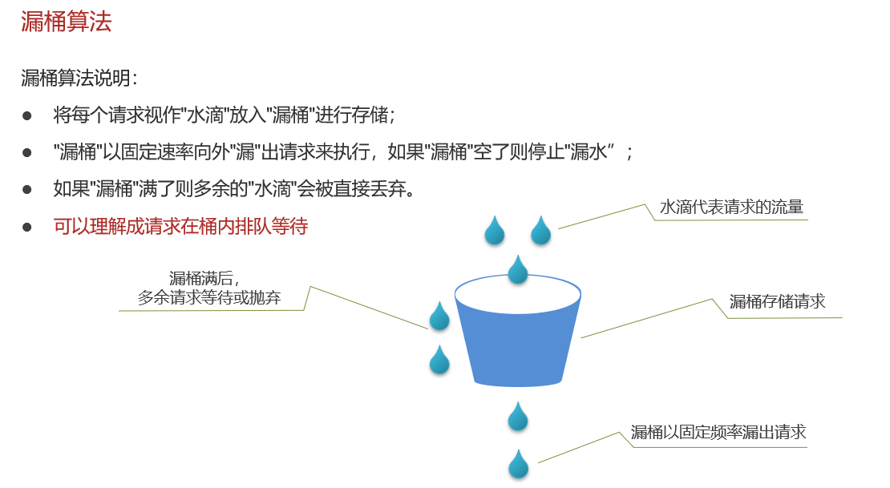


#### 二、概念组件

#### ProcessorSlotChain

setinel的核心骨架是`ProcessorSlotChain`**处理器槽链**，基于**责任链模式**，将不同的功能（限流、降级、系统保护）封装为一个个的Slot，请求进入后逐个执行即可


责任链中的Slot也分为两大类：

- 统计数据构建部分（statistic）
  - NodeSelectorSlot：负责构建簇点链路中的节点（DefaultNode），将这些节点形成链路树
  - ClusterBuilderSlot：负责构建某个资源的ClusterNode，ClusterNode可以保存资源的运行信息（响应时间、QPS、block 数目、线程数、异常数等）以及来源信息（origin名称）
  - StatisticSlot：负责统计实时调用数据，包括运行信息、来源信息等
- 规则判断部分（rule checking）
  - AuthoritySlot：负责授权规则（来源控制）
  - SystemSlot：负责系统保护规则
  - ParamFlowSlot：负责热点参数限流规则
  - FlowSlot：负责限流规则
  - DegradeSlot：负责降级规则

#### Node

链路节点

Sentinel中的簇点链路是由一个个的Node组成的，Node是一个接口，包括下面的实现：


所有的节点都可以记录对资源的访问统计数据，所以都是StatisticNode的子类。

按照作用分为两类Node：

- DefaultNode：代表链路树中的每一个资源，一个资源出现在不同链路中时，会创建不同的DefaultNode节点。而树的入口节点叫EntranceNode，是一种特殊的DefaultNode
- ClusterNode：代表资源，一个资源不管出现在多少链路中，只会有一个ClusterNode。记录的是当前资源被访问的所有统计数据之和。


DefaultNode记录的是资源在当前链路中的访问数据，用来实现基于链路模式的限流规则。ClusterNode记录的是资源在所有链路中的访问数据，实现默认模式、关联模式的限流规则。


例如：我们在一个SpringMVC项目中，有两个业务：

- 业务1：controller中的资源`/order/query`访问了service中的资源`/goods`
- 业务2：controller中的资源`/order/save`访问了service中的资源`/goods`

创建的链路图如下：


#### Entry

基于**AOP**思想，对资源标记的方法环绕增强，完成对**资源**Entry的创建


```java
@Aspect
public class SentinelResourceAspect extends AbstractSentinelAspectSupport {
	// 切点是添加了 @SentinelResource注解的类
    @Pointcut("@annotation(com.alibaba.csp.sentinel.annotation.SentinelResource)")
    public void sentinelResourceAnnotationPointcut() {
    }
	
    // 环绕增强
    @Around("sentinelResourceAnnotationPointcut()")
    public Object invokeResourceWithSentinel(ProceedingJoinPoint pjp) throws Throwable {
        // 获取受保护的方法
        Method originMethod = resolveMethod(pjp);
		// 获取 @SentinelResource注解
        SentinelResource annotation = originMethod.getAnnotation(SentinelResource.class);
        if (annotation == null) {
            // Should not go through here.
            throw new IllegalStateException("Wrong state for SentinelResource annotation");
        }
        // 获取注解上的资源名称
        String resourceName = getResourceName(annotation.value(), originMethod);
        EntryType entryType = annotation.entryType();
        int resourceType = annotation.resourceType();
        Entry entry = null;
        try {
            // 创建资源 Entry
            entry = SphU.entry(resourceName, resourceType, entryType, pjp.getArgs());
            // 执行受保护的方法
            Object result = pjp.proceed();
            return result;
        } catch (BlockException ex) {
            return handleBlockException(pjp, annotation, ex);
        } catch (Throwable ex) {
            Class<? extends Throwable>[] exceptionsToIgnore = annotation.exceptionsToIgnore();
            // The ignore list will be checked first.
            if (exceptionsToIgnore.length > 0 && exceptionBelongsTo(ex, exceptionsToIgnore)) {
                throw ex;
            }
            if (exceptionBelongsTo(ex, annotation.exceptionsToTrace())) {
                traceException(ex);
                return handleFallback(pjp, annotation, ex);
            }

            // No fallback function can handle the exception, so throw it out.
            throw ex;
        } finally {
            if (entry != null) {
                entry.exit(1, pjp.getArgs());
            }
        }
    }
}
```

#### Context

什么是Context呢？

- Context 代表调用链路上下文，贯穿一次调用链路中的所有资源（ `Entry`），基于ThreadLocal。
- Context 维持着入口节点（`entranceNode`）、本次调用链路的 curNode（当前资源节点）、调用来源（`origin`）等信息。
- 后续的Slot都可以通过Context拿到DefaultNode或者ClusterNode，从而获取统计数据，完成规则判断
- Context初始化的过程中，会创建EntranceNode，contextName就是EntranceNode的名称

对应的API如下：

```java
// 创建context，包含两个参数：context名称、 来源名称
ContextUtil.enter("contextName", "originName");
```


在`AbstractSentinelInterceptor`中初始化

`HandlerInterceptor`拦截器会拦截一切进入controller的方法，执行`preHandle`前置拦截方法，而Context的初始化就是在这里完成的。

```java
@Override
public boolean preHandle(HttpServletRequest request, HttpServletResponse response, Object handler)
    throws Exception {
    try {
        // 获取资源名称，一般是controller方法的@RequestMapping路径，例如/order/{orderId}
        String resourceName = getResourceName(request);
        if (StringUtil.isEmpty(resourceName)) {
            return true;
        }
        // 从request中获取请求来源，将来做 授权规则 判断时会用
        String origin = parseOrigin(request);
        
        // 获取 contextName，默认是sentinel_spring_web_context
        String contextName = getContextName(request);
        // 创建 Context
        ContextUtil.enter(contextName, origin);
        // 创建资源，名称就是当前请求的controller方法的映射路径
        Entry entry = SphU.entry(resourceName, ResourceTypeConstants.COMMON_WEB, EntryType.IN);
        request.setAttribute(baseWebMvcConfig.getRequestAttributeName(), entry);
        return true;
    } catch (BlockException e) {
        try {
            handleBlockException(request, response, e);
        } finally {
            ContextUtil.exit();
        }
        return false;
    }
}
```

#### ProcessorSlotChain执行流程

##### StatisticSlot

StatisticSlot负责统计实时调用数据，包括运行信息（访问次数、线程数）、来源信息等。

StatisticSlot是实现限流的关键，其中基于**滑动时间窗口算法**维护了计数器，统计进入某个资源的请求次数。

核心代码：

```java
@Override
public void entry(Context context, ResourceWrapper resourceWrapper, DefaultNode node, 
                  int count, boolean prioritized, Object... args) throws Throwable {
    try {
        // 放行到下一个 slot，做限流、降级等判断
        fireEntry(context, resourceWrapper, node, count, prioritized, args);

        // 请求通过了, 线程计数器 +1 ，用作线程隔离
        node.increaseThreadNum();
        // 请求计数器 +1 用作限流
        node.addPassRequest(count);

        if (context.getCurEntry().getOriginNode() != null) {
            // 如果有 origin，来源计数器也都要 +1
            context.getCurEntry().getOriginNode().increaseThreadNum();
            context.getCurEntry().getOriginNode().addPassRequest(count);
        }

        if (resourceWrapper.getEntryType() == EntryType.IN) {
            // 如果是入口资源，还要给全局计数器 +1.
            Constants.ENTRY_NODE.increaseThreadNum();
            Constants.ENTRY_NODE.addPassRequest(count);
        }

        // 请求通过后的回调.
        for (ProcessorSlotEntryCallback<DefaultNode> handler : StatisticSlotCallbackRegistry.getEntryCallbacks()) {
            handler.onPass(context, resourceWrapper, node, count, args);
        }
    } catch (Throwable e) {
        // 各种异常处理就省略了。。。
        context.getCurEntry().setError(e);

        throw e;
    }
}
```


另外，需要注意的是，所有的计数+1动作都包括两部分，以` node.addPassRequest(count);`为例：

```java
@Override
public void addPassRequest(int count) {
    // DefaultNode的计数器，代表当前链路的 计数器
    super.addPassRequest(count);
    // ClusterNode计数器，代表当前资源的 总计数器
    this.clusterNode.addPassRequest(count);
}
```

具体计数方式，我们后续再看。

接下来，进入规则校验的相关slot了，依次是：

- AuthoritySlot：负责授权规则（来源控制）
- SystemSlot：负责系统保护规则
- ParamFlowSlot：负责热点参数限流规则
- FlowSlot：负责限流规则
- DegradeSlot：负责降级规则

AuthoritySlot

## 设计模式

### 三种类型

#### 1、创建型5

单例模式，工厂模式，原型模式、建造者模式、抽象工厂模式

#### 2、结构型7

适配器模式、桥接模式、**装饰模式**、组合模式、外观模式、享元模式、**代理模式**。

#### 3、行为型11

模版方法模式、命令模式、访问者模式、迭代器模式、观察者模式、中介者模式、备忘录模式、解释器模式（Interpreter模式）、状态模式、策略模式、责任链模式


1.适配器模式 Adapter
  适配器模式是将一个类的接口转换成客户希望的另外一个接口。适配器模式使得原本由于接口不兼容而不能一起工作的那些类可以一起工作。
  两个成熟的类需要通信，但是接口不同，由于开闭原则，我们不能去修改这两个类的接口，所以就需要一个适配器来完成衔接过程。

2.桥接模式 Bridge
  桥接模式将**抽象部分与它的实现部分分离**，是它们都可以独立地变化。它很好的支持了开闭原则和组合锯和复用原则。实现系统可能有多角度分类，每一种分类都有可能变化，那么就把这些多角度分离出来让他们独立变化，减少他们之间的耦合。

3.组合模式 Composite
  组合模式将对象组合成**树形结构**以表示部分-整体的层次结构，组合模式使得用户对单个对象和组合对象的使用具有一致性。

4.装饰模式 Decorator
装饰模式**动态地给一个对象添加一些额外的职责**，就增加功能来说，它比生成子类更灵活。也可以这样说，装饰模式把复杂类中的核心职责和装饰功能区分开了，这样既简化了复杂类，有去除了相关类中重复的装饰逻辑。 装饰模式没有通过继承原有类来扩展功能，但却达到了一样的目的，而且比继承更加灵活，所以可以说装饰模式是继承关系的一种替代方案。

5.外观模式 Facade
 外观模式为子系统中的一组接口**提供了统一的界面**，外观模式定义了一个高层接口，这个接口使得这一子系统更加容易使用。

外观模式中，客户对各个具体的子系统是不了解的，所以对这些子系统进行了封装，对外只提供了用户所明白的单一而简单的接口，用户直接使用这个接口就可以完成操作，而不用去理睬具体的过程，而且子系统的变化不会影响到用户，这样就做到了信息隐蔽。


6.享元模式 Flyweight
 享元模式为运用共享技术有效的支持大量细粒度的对象。因为它可以通过共享大幅度地减少单个实例的数目，避免了大量非常相似类的开销。大量应用于**各种池化技术**。

  享元模式是一个类别的多个对象共享这个类别的一个对象，而不是各自再实例化各自的对象。这样就达到了节省内存的目的。


7.代理模式 proxy

为其他对象提供一种，并由***对象控制对原对象的引用，以间接控制对原对象的访问。

### 依赖关系：

表现为函数中的参数，使用到其他类的方法，即依赖到其他类的定义。

具体可为：局部变量、方法的形参、静态方法的调用

```
class Driver {  
    //使用形参方式发生依赖关系  
    public void drive1(Car car){  
        car.run();  
    }  
    //使用局部变量发生依赖关系  
    public void drive2(){  
        Car car = new Car();  
        car.run();  
    }  
    //使用静态变量发生依赖关系  
    public void drive3(){  
        Car.run();  
    }  
}
```

关联关系（特殊的依赖关系）：是类的成员变量（has a）

比如人拥有身份证，身份证对应一个人

```
class Driver {  
    //使用成员变量形式实现关联  
    Car mycar=new Car();
}
```

聚合关系（较强的关联关系）：是类的成员变量，创建的时候可以不传入对象，通过setter传入对象

车由车轮组成，车没了，车轮可以单独存在

```
class Driver {  
	// 生命周期不一致
    Car mycar;  
    // setter方法中传入对象，实现聚合
    public void setCar(Car car){  
    	mycar = car;  
	}
}
```

组合关系（更强的关联关系）：是类的成员变量，通过构造传入对象，一起创建（生命周期一致）

人由头和驱干组成，人没了，头和驱干不存在

```
class Driver {  
	// 生命周期一致
    Car mycar;  
    // 构造方法中传入对象，实现组合
    public Driver(Car car){  
    	mycar = car;  
	}
}
```

has

dependency 依赖（ operation(a : A)       ）

aggregation  聚合（ a : A      setA(a : A)   ）

composite    组合（ a : A =new A ()          ）

尽量不用继承 is


##### 依赖（虚实线箭头）


##### 关联（实线箭头）


##### 聚合（整体和部分可分割）


##### 组合（不可分割）


迭代器


解释器：解析表达式，对于+-*使用不同的解释器


就是根据不同的需要，返回不同的解释器


## git

### rebase和merge区别

merge

只需解决一次冲突，产生一次合并冲突


rebase

你的提交记录更加清晰可读,rebase 翻译为变基，他的作用和 merge 很相似，用于把一个分支的修改合并到当前分支上。让master集成变支变基到当前分支上。


```
特别注意，只能在自己使用的 feature 分支上进行 rebase 操作，不允许在集成分支上进行 rebase，因为这种操作会修改集成分支的历史记录。
```


### 添加两个远程仓库

```
同步方式
命令方式同步
先删除已关联的名为origin的远程库：

git remote rm origin
然后，再关联GitHub的远程库：

git remote add github git@github.com:chloneda/demo.git
接着，再关联码云的远程库：

git remote add gitee git@gitee.com:chloneda/demo.git

提交到github
git push github master
提交到码云
git push gitee master

箭头打不开
删除子文件夹里面的.git文件
执行git rm --cached [文件夹名]
```

### 标签管理和分支管理

```
1、打标签
$ git tag v1.0 (默认最新commit上)
3、创建带有说明的标签，其中-a指定标签名，-m指定说明的文字
$ git tag -a 标签名 -m '说明文字'

git tag 命令查看所有的标签

历史提交打标签
$ git tag v0.9 xxxxxxx # xxxxxxx表示刚才提交的commit id

2、查看标签信息
$ git show tagname # tagname表示标签的名字 例如：v0.9、v1.0


给历史提交打带有说明的标签
$ git tag -a 标签名 -m '说明文字' commitId # xxxxxxx表示需要打标签的
注意：标签总是和某个commit挂钩，如果这个commit既出现在master分支，又出现在dev分支，那么在这两个分支上都可以看到这个标签

4、删除tag

$ git tag -d v0.9
因为创建的标签都只存储在本地，不会自动推送到远程；所以，打错的标签可以在本地安全删除

5、推送标签至远程
$ git push origin v1.0 # 推送单个标签至远程
$ git push origin --tags # 一次性推送全部尚未推送到远程的本地标签

6、删除远程的标签
需要先从本次删除，删除本地的标签

$ git tag -d v1.0
然后从远程删除，删除命令也是push，格式如下

$ git push origin :refs/tags/v1.0

```

### 常用代码

```bash
#用于输出git提交日志 
alias git-log='git log --pretty=oneline --all --graph --abbrev-commit'

git config --global user.name “xxx”
git config --global user.email xxx@qq.com

查看配置信息
git config --global user.name
git config --global user.email

cd existing_git_repo
git remote rm origin
git remote add origin https://gitee.com/xxx/xxx.git

git add .
git commit -m “init my project”
git push --set-upstream origin master(重点)

#查看我的公匙
cd ~/.ssh
cat id_rsa.pub
```

**工作原理**


```bash
#用于输出git提交日志 
alias git-log='git log --pretty=oneline --all --graph --abbrev-commit'
```


## HU


### node版本


### 读写分离

```
1、AOP拦截dao层的方法，把读写类型存到threadLoacl中
2、继承AbstractRoutingDataSource，重写determineCurrentLookupKey动态切换数据源，通过threadLoacl获取需要的数据源
```

### es和mysql数据一致性

上面两种方案中都存在硬编码问题，也就是有任何对mysq进行增删改查的地方要么植入ES代码，要么替换为MQ代码，代码的侵入性太强。

如果对实时性要求不高的情况下，可以考虑用定时器来处理，具体步骤如下：

数据库的相关表中增加一个字段为timestamp的字段，任何crud操作都会导致该字段的时间发生变化；原来程序中的CURD操作不做任何变化；增加一个定时器程序（京东内部叫Worker），让该程序按一定的时间周期扫描指定的表，把该时间段内发生变化的数据提取出来；逐条写入到ES中。入下图所示

优点：

不改变原来代码，没有侵入性、没有硬编码；

没有业务强耦合；不改变原来程序的性能；

Worker代码编写简单不需要考虑增删改查。

缺点：

时效性较差，由于定时器工作周期不可能设在秒级，所以实时性没有上面2中好；

对数据库有一定的轮询压力，一种改进方法是将轮询放到压力不大的从库上。

### HU中Canal的用法

### 项目介绍

由于项目的功能模块众多，我们采用了微服务架构，有效的拆分了应用，实现敏捷开发和部署，各模块架构如下图。同时，采用Docker容器化部署个微服务应用，并使用Jenkins工具进行持续集成。

​                               

在项目的多个模块中，比如养聊站模块，由于帖子数量庞大，在分布式的场景下，采用普通的SQL检索遇到了很大的性能瓶颈。于是，我们引入了开源的分布式搜索引擎ElasticSearch，通过构建特定的索引，将MySQL中的数据批量导入ElasticSearch中，对外提供统一的全文检索服务，解决了系统海量数据的全文检索难点。

为缓解数据库的压力，在饮食运动养聊模块的数据读写都使用Redis作为缓存中间件，提高了系统的性能。同时，为解决高可用和海量数据读写问题，搭建了Redis的分片集群。

版本选择：

```
canal服务器·使用的是canal1.1.5

canal-adapter-1.1.6 es适配器
```

canal采用tcp模式，同时配备两个instance实例（example,rabbitmq），example实例负责同步es,rabbitmq实例同步redis缓存。

另外只同步health_community的中的community_question到es中

### 点赞评论模块

1、用户点赞

参数：用户id+帖子id

数据库实体：点赞记录表，帖子表点赞数增加

redis设计：hash存储questionLike，key(questionId::userId) value(1:tiemstamp)

2、用户评论：

参数：父评论id,帖子id,评论人id

数据库实体：评论表，帖子表评论数增加

redis设计：hash存储questionComment, key(questionId:userId:parentUserId:tiemStamp) value(comment)


用户评论->异步通知文章评论数加一-》持久化到数据库中

获取文章列表是用了缓存的，开启定时器，定期扫描去删除缓存

### canal订阅过滤规则

```
* a. 如果本次订阅中filter信息为空，则直接使用canal server服务端配置的filter信息
* b. 如果本次订阅中filter信息不为空，目前会直接替换canal server服务端配置的filter信息，以本次提交的为准
```

全库全表	

```
connector.subscribe(".*\\..*")
```

指定库全表	

```
connector.subscribe("test\\..*")
```

单表

```
connector.subscribe("test.user")
```

多规则组合使用

```
connector.subscribe("test\\..*,test2.user1,test3.user2")
```

### cannal server instance client概念

server-server 对应JVM,instance就是真正的数据队列，instance承载着EventParser(解析binlog),EventSink(过滤路由加工),EventStore（时间存储）

### canal高可用HA设计

通过多实例，创建成功就是对应的canal instance,失败就是standby备用状态。当实例消息，zookeeper会重新创建实例

1. canal server要启动某个canal instance时都先向zookeeper进行一次尝试启动判断 (实现：创建EPHEMERAL节点，谁创建成功就允许谁启动)
2. 创建zookeeper节点成功后，对应的canal server就启动对应的canal instance，没有创建成功的canal instance就会处于standby状态
3. 一旦zookeeper发现canal server A创建的节点消失后，立即通知其他的canal server再次进行步骤1的操作，重新选出一个canal server启动instance.
4. canal client每次进行connect时，会首先向zookeeper询问当前是谁启动了canal instance，然后和其建立链接，一旦链接不可用，会重新尝试connect.

Canal Client的方式和canal server方式类似，也是利用zookeeper的抢占EPHEMERAL节点的方式进行控制.

### canal实例只能被消费一次

一个canal实例（比如example）只能被消费一次

### canal执行流程


### 认证逻辑

使用JWT+HMAC签名（哈希消息验证码(对称)）

对用户id和nickname进行加密，放入负载中，并签名

```java
/**
 * jwt使用rsa非对称加解密工具类
 */
public class JwtRsaUtil {
    private static final String SECRET="sdfdsfs"; // 密匙
    public static String generateJwtTokenHMAC(PayLoad userInfoPayLoad) throws UnsupportedEncodingException {
        Assert.notNull(userInfoPayLoad,"userInfoPayLoad不能为空");
        return  JWT.create()
                    .withIssuer("HU")
                    .withClaim("userInfo", JSON.toJSONString(userInfoPayLoad))
                    .sign(Algorithm.HMAC256(SECRET));
    }

    public static PayLoad getInfoFromToken(String token) throws NoSuchAlgorithmException, UnsupportedEncodingException {
        JWTVerifier verifier = JWT.require(Algorithm.HMAC256(SECRET))
                .withIssuer("HU")
                .build();
        DecodedJWT jwt = verifier.verify(token);
        Claim claim = jwt.getClaim("userInfo");
        String payload = claim.asString();
        PayLoad payLoad = JSON.parseObject(payload, PayLoad.class);
        return payLoad;
    }
}
```

### 使用到的设计模式

### 哪里用到redis

##### 运动模块：运动运动小贴士

存储：hash  health:sport:type  id   typeEntity

并使用到了分布式锁

```java
public static final String SPORT_TYPE="health:sport:type";

    public static  final String TYPE_LOCK="lock:health:sport:type";

    /**
     * 获取运动小贴士，数据读多写少
     * 对象采用hash结构 health:sport:type  id   typeEntity
     * @param params
     * @return
     */
    @Override
    public PageUtils queryPage(Map<String, Object> params) {
        List<TypeEntity> entities= getRedis(params);
        if(entities==null){
            // 采用分布式锁，解决缓存击穿问题
            RLock lock = redissonClient.getLock(TYPE_LOCK);
            lock.lock(); // 休眠阻塞
            entities=getRedis(params); // 双检，别的线程可能已经获取到数据了
            if(entities==null){
                IPage<TypeEntity> page = this.page(
                        new Query<TypeEntity>().getPage(params),
                        new QueryWrapper<TypeEntity>()
                );
                entities=page.getRecords();
                saveToRedis(page); // 保存到缓存中
            }
            lock.unlock(); // 记得解锁
        }
        return new PageUtils(new Page<TypeEntity>(1,entities.size(),entities.size()).setRecords(entities));
    }

    private List<TypeEntity> getRedis(Map<String, Object> params) {
        BoundHashOperations<String, String, String> hashOps = redisTemplate.boundHashOps(SPORT_TYPE);
        List<String> values = hashOps.values();
        List<TypeEntity> entities=null;
        if(values!=null&&!values.isEmpty()){
            entities=values.stream().map(v-> JSON.parseObject(v,TypeEntity.class)).collect(Collectors.toList());
        }
        return entities;
    }


    private void saveToRedis(IPage<TypeEntity> page) {
        BoundHashOperations<String, String, String> hashOps = redisTemplate.boundHashOps(SPORT_TYPE);
        List<TypeEntity> entities = page.getRecords();
        for (TypeEntity entity : entities) {
            hashOps.put(entity.getId().toString(), JSON.toJSONString(entity));
        } // 这里不设置过期时间，因为每个人都要访问，且数据量不大
    }
```

## 大就业

### 项目介绍

#### 1、如何缓存热点职位

hash结构存储职位所有信息

zset结构保存职位的热度

定期将zset中低热度的内容从hash中清除掉

使用淘汰策略，lru清除冷门数据

#### 2、热点职位

ZSet：job:hot     key(jobId)   score(时间戳+点击量)

Hash：job:entity    key(jobId)   value(jobEntity)


用户行为：浏览职位，投递职位

kafka对应三个话题：job-browse   job-delivery

每种都会增加职位的热度：一小时毫秒数，2小时


**如果一个用户点赞，那么****5****分钟内就不能在点赞了**

**新发布的职位也会缓存，****zset—****当前时间戳**

**Hset: jobId : jobEntity**

**Zset: jobId: timestamp+click** **以时间戳****+****浏览次数（每次加三分钟对应的秒数）**

#### 3、SpringSecurity逻辑

（1）重写 UsernamePasswordAuthenticationFilter的认证成功方法，生成token并把权限列表保存在redis;另外这里也可以自定义登录路径。

（2）重写BasicAuthenticationFilter的doFilterInternal授权方法，改为从根据token从redis中获取；

（3）在WebSecurityConfigurerAdapter添加自定义的过滤器；另外使用自定义的userDetailsService和PasswordEncoder

 

登录逻辑，先到health-acl进行登录服务，获取token（里面包含用户名，10分钟）

以后访问各个微服务，都要header都要携带token，不然访问失败

原理：在BasicAuthenticationFilter的doFilterInternal中，会根据token到redsis中获取权限列表，获取成功，放入到security上下文中

SecurityContextHolder.*getContext*().setAuthentication(authRequest)

#### 用户登录流程

调用接口

请求参数

后端逻辑：

（1）远程调用acl服务保存当前当前用户到acl-user（账号密码都是openid）,同时授予默认权限

（2）使用openId进行登录，同时返回token

返回当前用户

权限控制逻辑

（1）不登录也可以访问

（2）没有标注@PreAuth

需要先登录，但可以没有权限

（3）标注@PreAuth

要登录，并且有相应的权限

#### 接口幂等性

基于token机制+redis解决了页面重复提交问题

首先申请token，并把token存到redis中，页面请求的时候把在header中携带token,如果token存在则成功。然后先删除token，再保存数据。

先删Token还是先保存数据：采用先删token

如果保存数据失败，重新保存的时候只需要请求token即可

如果采用先保存数据，如果数据保存成功，删token删失败，那么还是会导致数据重复提交。

#### 聊天逻辑

再app.js中连接socket

message页面，订阅私人频道和公共频道

dialog页面：订阅私人频道，如果私人频道有消息且是当前对面，则队列增加消息。

在消息中在异步持久化

#### 用户信息解密


### dubbo依赖

```
<?xml version="1.0" encoding="UTF-8"?>
<project xmlns="http://maven.apache.org/POM/4.0.0" xmlns:xsi="http://www.w3.org/2001/XMLSchema-instance"
         xsi:schemaLocation="http://maven.apache.org/POM/4.0.0 https://maven.apache.org/xsd/maven-4.0.0.xsd">
    <modelVersion>4.0.0</modelVersion>

<!--    <parent>-->
<!--        <groupId>org.apache.dubbo.samples</groupId>-->
<!--        <artifactId>dubbo-spring-boot-service-introspection-zookeeper-samples</artifactId>-->
<!--        <version>2.7.10-SNAPSHOT</version>-->
<!--        <relativePath>../pom.xml</relativePath>-->
<!--    </parent>-->
    <parent>
        <groupId>org.springframework.boot</groupId>
        <artifactId>spring-boot-starter</artifactId>
        <version>2.3.0.RELEASE</version>
    </parent>

    <properties>
        <mybatisplus.version>3.3.1</mybatisplus.version>
    </properties>

    <groupId>com.lhf.dajiuye</groupId>
    <artifactId>dajiuye-job-service</artifactId>
    <version>0.0.1-SNAPSHOT</version>
    <name>dajiuye-job-service</name>
    <description>Demo project for Spring Boot</description>
    <dependencies>
        <!-- Spring Boot dependencies -->
        <dependency>
            <groupId>org.springframework.boot</groupId>
            <artifactId>spring-boot-starter</artifactId>
        </dependency>

        <dependency>
            <groupId>org.apache.dubbo</groupId>
            <artifactId>dubbo-spring-boot-starter</artifactId>
            <version>2.7.8</version>
        </dependency>

        <!-- Apache Zookeeper -->
        <dependency>
            <groupId>org.apache.zookeeper</groupId>
            <artifactId>zookeeper</artifactId>
            <version>3.4.8</version>
            <exclusions>
                <exclusion>
                    <groupId>org.slf4j</groupId>
                    <artifactId>slf4j-log4j12</artifactId>
                </exclusion>
            </exclusions>
        </dependency>

        <dependency>
            <groupId>org.apache.curator</groupId>
            <artifactId>curator-x-discovery</artifactId>
            <version>4.3.0</version>
        </dependency>

        <dependency>
            <groupId>com.alibaba</groupId>
            <artifactId>fastjson</artifactId>
            <version>1.2.53</version>
        </dependency>

        <dependency>
            <groupId>ch.qos.logback</groupId>
            <artifactId>logback-classic</artifactId>
        </dependency>
    </dependencies>

    <build>
        <plugins>
            <plugin>
                <groupId>org.apache.maven.plugins</groupId>
                <artifactId>maven-compiler-plugin</artifactId>
                <version>3.8.1</version>
                <configuration>
                    <source>1.8</source>
                    <target>1.8</target>
                    <encoding>UTF-8</encoding>
                </configuration>
            </plugin>
            <plugin>
                <groupId>org.springframework.boot</groupId>
                <artifactId>spring-boot-maven-plugin</artifactId>
                <version>2.3.7.RELEASE</version>
                <configuration>
                    <mainClass>com.lhf.dajiuye.job.service.DajiuyeJobServiceApplication</mainClass>
                </configuration>
                <executions>
                    <execution>
                        <id>repackage</id>
                        <goals>
                            <goal>repackage</goal>
                        </goals>
                    </execution>
                </executions>
            </plugin>
        </plugins>
    </build>

</project>

```


### app.js生命周期

```
　onLaunch 生命周期函数–监听小程序初始化 
　　当小程序初始化完成时，会触发 onLaunch（全局只触发一次）。

　　onShow  生命周期函数–监听小程序显示
　　当小程序启动，或从后台进入前台显示，会触发 onShow

　　onHide 生命周期函数–监听小程序隐藏
　　当小程序从前台进入后台，会触发 onHide

　　onError 错误监听函数
　　当小程序发生脚本错误，或者 api 调用失败时，会触发 onError 并带上错误信息
```

### 原生websocket

```
import {
    request
} from "../../requests/index.js";
Page({

    /**
     * 页面的初始数据
     */
    data: {
        userInfo: {},
        allMessage: [],
        isDisConnection:false//是否是手动断开锻炼
    },

    /**
     * 生命周期函数--监听页面加载
     */
    onLoad: function (options) {
        // this.startSetInter()
    },

    /**
     * 生命周期函数--监听页面显示
     */
    onShow: function () {
        const socketUrl = 'ws://127.0.0.1:9977/message-server/webSocketOneToOne/0/2'
        var that=this
        wx.connectSocket({
            url: socketUrl,
            success: function () {
                console.log('websocket连接成功~')
                wx.onSocketMessage((res) => {
                    //接收到消息
                    console.log("接收到消息" + JSON.stringify(res));
                })
                wx.onSocketOpen(() => {
                    console.log('WebSocket连接打开')
                    that.sendmsg()
                })
                wx.onSocketError((res) => {
                    console.log('WebSocket连接打开失败')
                    that.reconnect()
                })
                wx.onSocketClose((res) => {
                    console.log('WebSocket 已关闭！');
                    socketOpen = false;
                    if (that.data.isDisConnection) {
                        that.reconnect()
                    }
                })
            },
            fail: function () {
                console.log('websocket连接失败~')
            }
        })


        const userInfo = wx.getStorageSync('userInfo')
        if (!userInfo) {
            wx.switchTab({
                url: '../user/index', //注意switchTab只能跳转到带有tab的页面，不能跳转到不带tab的页面
            })
            wx.showToast({
                title: '请先登录',
                icon: 'none',
                image: '',
                duration: 1000,
                mask: false,
            });
            return;
        }
        this.setData({
            userInfo
        })
        this.setAllMessage(userInfo.openId)
    },

     /**
   * 生命周期函数--监听页面隐藏
   */
  onHide: function () {
    this.setData({
      isDisConnection:true
    })
    wx.closeSocket()
  },

    sendmsg(){
        console.log("准备发送消息")
        var message = {
            "msgContent": "asda",
            "targetId":"asdada"
          }
        wx.sendSocketMessage({
            data: JSON.stringify(message),
            success(res) {
              console.log("发送消息成功")
            },
            fail: function (e) {
                console.log(e)
                console.log("发送失败")
              }
          })
    },

    startSetInter: function () {
        var that = this;
        //将计时器赋值给setInter
        that.data.setInter = setInterval(
            function () {
                that.setAllMessage(that.data.userInfo.openId)
            }, 30000);
    },
    endSetInter: function () {
        var that = this;
        //清除计时器  即清除setInter
        clearInterval(that.data.setInter)
    },
    async setAllMessage(openId) {
        var that = this
        const result = await request({
            url: "/own/user/getAllMessage",
            data: {
                openId
            }
        });
        that.setData({
            allMessage: result
        })
    },
    setList(e) {
        console.log("hahah")
        console.log(e)
        wx.setStorageSync('msgs', this.data.allMessage[e.currentTarget.dataset.msgs])
        wx.navigateTo({ //---wx.  传当前页面的数据到另外一个页面！！！
            url: "/pages/dialog/index"
        })
    }
})
```

### 业务设计

#### 1、首页就是工作匹配，填好简历一键为你匹配职业；

#### 2、中间就是工作区，并加多一些筛选。

#### 3、我的 就基本没有变

#### 4、校招区 连list,list里面放校招图片，有筛选功能（右边弹出，有地区、字母排序），有搜索功能

#### 5、刷题区

### 小程序知识点

#### for循环

-    ```html
     微信小程序的for循环的选项是item,下标是index。
     <view wx:for="{{arr}}">
        <text>{{index}}--- {{item}}</text>
     </view>
     也可以指定遍历选项和下标的别名，
     指定遍历选项的别名：wx:for-item="xxx"　
     指定遍历下标的别名 ：wx:for-index="yyy"
     <!-- 给遍历的item指定别名，给遍历的下标指定别名 -->
     <view wx:for="{{arr}}" wx:for-item="testItem" wx:for-index="i">
       <text>{{testItem}} === {{i}}</text>
     </view>
     
     ```

#### 元素隐藏

- ```html
  wx:if="{{schoolObj.schImg3!==''}}"
  hidden="{{}}"
  style="display:none"
  style="opacity:{{opacity}}"
  ```

#### 两个页面间传递参数

- ```js
  //这里假设要把一个名为ob的对象进行传输
  	var str= JSON.stringify(ob);
     wx.navigateTo({
       url: '../要传递的页面/要传递的页面?str=' + str
     })
  ```

- ```js
  onLoad: function (options) {
      //将第一个页面中传过来的数据解析成对象放到onedata中
      var onedata = JSON.parse(options.str)
      //console.log(onedata)
      //之后进行使用即可
    }
  ```


#### 小程序调用组件的方法

- 假如我们已经有了一个自定义组件toast
  
  
  
  组件里面有个方法控制toast的显示
  
  
  
  假如我要在登录界面引用toast，那如何调用自定义组件的方法控制toast显示？
  
  1.首先在登录的json页面引用组件
  
  
  
  2.在登录的wxml页面引用组件（一定要设置id），这一步的<toast>标签名就是上一步引入组件时的key名，两者要保持一致
  
  
  
  3.在登录页的js页面的生命周期中获取组件（图中的传入的参数就是第2步设置的组件id）
  
  
  
  4.用(this.toast.方法名)即可调用自定义组件的方法
  
  
  
  5.参照以上方法基本上是能够调用的，如果调用过程中selectComponent返回null，你可以看看我的这篇文章，对这个问题进行了一些分析

#### 字符串

```
比较大小
str1.localeCompare(str2)
```


### 接口api

#### 1、轮播图

**简要描述**

- 轮播图

**请求URL**：

- ```
  http://localhost:8080/home/swiperdata
  ```

**请求方式：**

- GET

**请求头参数**：

**请求体参数**：

**返回示例：**

```json
{
    "message": [{
            "open_type": "navigate",
            "navigator_url": "/pages/goods_detail/main?goods_id=129",
            "goods_id": 129,
            "image_src": "https://img.coolcr.cn/2021/08/30/5a7136e08e6b7.jpg"
        },
        {
            "open_type": "navigate",
            "navigator_url": "/pages/goods_detail/main?goods_id=395",
            "goods_id": 395,
            "image_src": "https://img.coolcr.cn/2021/08/30/a1791fbe530e2.jpg"
        },
        {
            "open_type": "",
            "navigator_url": "",
            "goods_id": 0,
            "image_src": "https://img.coolcr.cn/2021/08/30/f0b258bd5c4ab.jpg"
        }
    ],
    "meta": {
        "msg": "获取成功",
        "status": 200
    }
}
```

#### 2、分类导航图

**简要描述**

- 分类导航图

**请求URL**：

- ```
  http://localhost:8080/home/catitems
  ```

**请求方式：**

- GET

**请求头参数**：

**请求体参数**：

**返回示例：**

```json
{
    "message": [{
            "open_type": "switchTab",
            "navigator_url": "/pages/category/main",
            "name": "校招",
            "image_src": "https://img.coolcr.cn/2021/08/30/8b059d980545e.png"
        },
        {
            "open_type": "switchTab",
            "navigator_url": "/pages/category/main",
            "name": "实习",
            "image_src": "https://img.coolcr.cn/2021/08/30/8b059d980545e.png"
        },
        {
            "open_type": "switchTab",
            "navigator_url": "/pages/category/main",
            "name": "分类",
            "image_src": "https://img.coolcr.cn/2021/08/30/8b059d980545e.png"
        },
        {
            "open_type": "switchTab",
            "navigator_url": "/pages/category/main",
            "name": "定制",
            "image_src": "https://img.coolcr.cn/2021/08/30/8b059d980545e.png"
        }
    ],
    "meta": {
        "msg": "获取成功",
        "status": 200
    }
}
```

#### 3、职位信息列表

**简要描述**

- 职位信息列表

**请求URL**：

- ```
  http://localhost:8080/home/jobdata
  ```

**请求方式：**

- GET

**请求头参数**：

**请求体参数**：

**返回示例：**

```json
{
    "message": [
        {
            "jobCreateTime": "2019/7/2",
            "jobAuthor": "",
            "jobComId": "jakd1a_asd",
            "jobField2": "短视频",
            "jobField1": "直播",
            "jobUpdateTime": "2019/2/3",
            "jobEdu": "本科",
            "jobPriority": "1",
            "jobName": "java开发工程师",
            "jobRequire1": "掌握WEB后端开发技术: 协议、架构、存储、缓存、安全等；",
            "jobSalary": "20k/月",
            "jobRequire2": "掌握WEB后端开发技术: 协议、架构、存储、缓存、安全等；",
            "jobRequire3": "掌握WEB后端开发技术: 协议、架构、存储、缓存、安全等；",
            "jobRequire4": "掌握WEB后端开发技术: 协议、架构、存储、缓存、安全等；",
            "jobComFinancing": "",
            "jobAge": "应届生",
            "jobImg": "http://asdkak.cja.com",
            "jobPlace": "广州深圳",
            "jobId": "asdadad",
            "schStat": "",
            "internshipTime": "5天/周",
            "schViewCnt": "",
            "jobComName": "",
            "jobDesc1": "参与公司企业级产品后端的研发，确保系统的安全、高可用性和可靠性；",
            "jobDesc3": "参与公司企业级产品后端的研发，确保系统的安全、高可用性和可靠性；",
            "jobDesc2": "参与公司企业级产品后端的研发，确保系统的安全、高可用性和可靠性；",
            "jobDesc4": "参与公司企业级产品后端的研发，确保系统的安全、高可用性和可靠性；"
        },
        {
            "jobCreateTime": "2019/7/2",
            "jobAuthor": "",
            "jobComId": "jakd1a_asd",
            "jobField2": "短视频",
            "jobField1": "直播",
            "jobUpdateTime": "2019/2/3",
            "jobEdu": "本科",
            "jobPriority": "1",
            "jobName": "java开发工程师",
            "jobRequire1": "掌握WEB后端开发技术: 协议、架构、存储、缓存、安全等；",
            "jobSalary": "20k/月",
            "jobRequire2": "掌握WEB后端开发技术: 协议、架构、存储、缓存、安全等；",
            "jobRequire3": "",
            "jobRequire4": "掌握WEB后端开发技术: 协议、架构、存储、缓存、安全等；",
            "jobComFinancing": "",
            "jobAge": "应届生",
            "jobImg": "http://asdkak.cja.com",
            "jobPlace": "广州深圳",
            "jobId": "asdasdaasd",
            "schStat": "",
            "internshipTime": "5天/周",
            "schViewCnt": "",
            "jobComName": "",
            "jobDesc1": "参与公司企业级产品后端的研发，确保系统的安全、高可用性和可靠性；",
            "jobDesc3": "参与公司企业级产品后端的研发，确保系统的安全、高可用性和可靠性；",
            "jobDesc2": "参与公司企业级产品后端的研发，确保系统的安全、高可用性和可靠性；",
            "jobDesc4": "参与公司企业级产品后端的研发，确保系统的安全、高可用性和可靠性；"
        }
    ],
    "meta": {
        "msg": "获取成功",
        "status": 200
    }
}
```

## 面试笔试

### 自我介绍

面试官你好，我叫林涣锋，请问可以听得到嘛，我来自东莞理工学院软件工程卓越计划班，今天我应聘的是多益的游戏开发岗位

大学期间，我参与**开发了许多项目**，在其中主要担任技术负责人的角色，负责项目的核心开发和技术难点解决，负责系统架构设计和相关技术选型，对分布式和为微服务架构有一定的了解，积累一定的项目实战开发能力和团队分工协作经验。

另外，我多次担任负责人成功申报了学校的创新创业项目，也积极参加挑战杯，互联网+，蓝桥杯算法竞赛等专业竞赛，积累了竞赛方面的相关经验。

在课内方面，我的计算机专业成绩优异，多次获得奖学金

大学实践方面，我担任了校审计处学生助理，社会实践分队负责人，班级团支书等。

最后，作为一名游戏爱好者，我渴望能够进入游戏开发行业。

这就是我的自我介绍，感谢贵公司的面试机会。


自我介绍半分钟到一分钟

1.面试官懒得看简历，自己提炼特长

和职位匹配的经历

为什么你能胜任

求职动机

3个优势和亮点

例子：面试官你好，我叫林涣锋，来自东莞理工学院网络空间安全学院，华为一直是受人尊敬的公司，我这次应聘的职位是java后端开发的工作，从事后端开发的工作一直是我的梦想，为此，我大学期间很早就在结合岗位的要求做准备，包括对各种协议的熟悉，常见算法的实践等，在研究生两年的时间，我也重点选择了网络相关的课题进行研究，希望能加入公司，从事相关后端开发的工作，谢谢

我也一直在学习相关的

课代表来了（自己是在跟人打交道）
1、我是谁
2、亮点 有事实支撑的技能
3、亮点 你对工作的热情
4、亮点 为什么想要这份工作
5、自己适合这份工作的原因

扬长弊端

简历的中心思想和提纲

### 保融面试

1、如果用户下载的内容很大，超过内存怎么办

2、线程安全的对象

3、decimal原理

### 菜鸟面试

自我介绍，项目

为什么设计这个项目

怎么设计这个数据库，表怎么设计，主要表是什么

数据库存储引擎，innodb

索引B+的了解

Mysql的隔离级别

B+ 磁盘最小单位，对应表数据什么

Redis的使用场景

项目中哪些使用到redis了，怎么使用的

Redis宕机了怎么办

Rdb的了解

数据丢失怎么办

aof一定是100%数据不丢失吗

为什么一定要用redis

数据结构这方面的了解，根据时间复杂度对排序进行分类

问下图，如何生成最短路径

线程的整个生命周期，线程创建过程

Waiting time_waiting区别

反问：校招最考察什么

 

建议：打好基础，比如数据结构基础（图），redis，不一定要知识点有多广；数据库怎么设计之类的，有项目更好

其他：环境声音比较吵听不太清楚

**数据页中的记录按照「主键」顺序组成单向链表**

### 网易笔试题

\1.   进程调度算法

\2.   讲一讲你熟悉的一种设计模式

\3.   TCP三次握手种，Time_wait和close_wait的wait分别代表什么

Close_wait：服务端通知高层应用进程客户端要释放了，等待高层服务器关闭花费的时间，还没发完的数据在这段时间赶紧发

Time_wait：客户端等待，以确保服务器收到ACK真正关闭连接

\4.   删除倒数第n个结点

\5.   整数反转：123-》321

\6.   找出每个部门中工资最高的部门名称，员工名字，薪资

\7.   操作系统

\8.   时间片是1，一个进程有100个线程，那么该进程获取到的时间片为多少1

\9.   有静态代码块，有父类，然后调用子类方法，哪些代码块会执行

\10. 死锁的线程n,资源x,至少多少不会死锁

\11. 掩码为255.255.255.0有多少台主机

## 错题集

### 不可重复读和幻读

不可重复读

在一个事务内**多次读取同一个数据，如果出现前后两次读到的数据不一样**的情况，就意味着发生了「不可重复读」现象。

幻读

在一个事务内多次查询某个**符合查询条件**的「记录数量」，如果出现前后两次查询到的记录数量不一样的情况，就意味着发生了「幻读」现象。


### 出栈顺序


### 快排

没经过一躺排序，会有一个元素的位置被确定，当然大于左边小于右边


### 编码表

```
EF BF BD EF BF BD
对应的2进制编码是(这里我们分成了两段,取其中一段进行分析)
EF BF BD :11101111 10111111 10111101
                  ↑↑↑↑         ↑↑             ↑↑
根据图可知是第三种情况去掉前缀(上面箭头的指的地方就是前缀)后是：
1111 1111 1111 1101
 转成十六进制即是 FFFD
第二段相同的同理
```


### 缺页中断

注意是FIFO，不是LRU

缺页中断，看清题目，刚开始的三个页应该也需要算进去。如果是页面置换的次数就不用算前面三个页。


### 并发作业时间计算

计算的时候可以输入，输出的时候可以计算，所以最后应该是2+3+4+4+4=17


### Integer不可变类

```
Integer和String一样是final修饰的最终类，因此也是不可变性
```


### mount

-r: 将文件系统作为**只读文件**系统进行**安装**，而不考虑它先前在 /etc/file systems 文件中指定的内容或者先前的任何命令行选项。
ro : 将**已安装**的文件指定为**只读文件**，而不考虑它先前在 /etc/file systems 文件中指定的选项或者先前的任何命令行选项。缺省值是 rw。


### 值&引用类型

```
实例是针对于对象的概念，当类实例化为对象的时候，这个时候可以称为是类的一个实例。
封装的概念也是针对类而言的，值类型数据不存在封装概念。
值类型变量可以作为成员变量存储在堆里，例如一个Class A中包含一个int value，那么value是作为成员变量存储在堆中的。
```


### 增量模型

```
增量模型是把待开发的软件系统模块化，将每个模块作为一个增量组件，从而分批次地分析、设计、编码和测试这些增量组件。运用增量模型的软件开发过程是递增式的过程。

相对于瀑布模型而言，采用增量模型进行开发，开发人员不需要一次性地把整个软件产品提交给用户，而是可以分批次进行提交。
```


### 砝码称重

```
9个分为3个，那边轻就在哪边，不然就在第三组。
```


### Java基础

```
x++ +先计算+
```


```
byte b1=1,b2=2,b3,b6; 
final byte b4=4,b5=6; 
b6=b4+b5; 
b3=(b1+b2); 
System.out.println(b3+b6);

被final修饰的变量是常量，这里的b6=b4+b5可以看成是b6=10；在编译时就已经变为b6=10了

而b1和b2是byte类型，java中进行计算时候将他们提升为int类型，再进行计算，b1+b2计算后已经是int类型，赋值给b3，b3是byte类型，类型不匹配，编译不会通过，需要进行强制转换。

Java中的byte，short，char进行计算时都会提升为int类型。

```


### 数据库


题目是小于连接，答案×表示笛卡尔积，对应的属性位置为1，4


### pctfree&pctused


```
pctfree:当空闲空间占比低于pctfree，就会把当前块移除空闲链表freelist，可以被insert
pctused:当使用率小于pctused会重新加入空闲链表。

pctfree默认是10，pctused默认是40，且规定pctfree+pctused < 90
此道题A、D大于90排除，又因为字段中有大量空值，为保证后续空间有足够空间更新，需要增大空闲比率，所以选B
```

### 二分查找

最差O(n)

### 时间片轮转

```
先来先服务算法, 有利于CPU密集型作业, 不利于IO密集型作业
因为CPU密集型说明会长时间占用CPU，进程IO中断让出CPU,排到队尾，那么就得等很长时间才能被重新调度


时间片轮转算法, 有利于cpu密集型作业, 不利于io密集型作业
```

### 时间复杂度递推方程

设某算法的时间复杂度函数的递推方程是 T(n) = T(n - 1) + n（n 为正整数）及 T(0) = 1，则该算法的时间复杂度为n^2

```
T(n-1)+n=T(n-2)+n-1+n=T(n-3)+n-2+n-1+n=(1+n)n/2=n^2
```

### HTTP报文

HTTP响应报文由三部分组成，
响应行：由报文协议及版本、状态码及描述组成。
响应头：和请求头一样，由属性组成。
响应体：是服务器返回给客户端的文本信息。

### 两个栈模拟队列

用俩个栈模拟实现一个队列，如果栈的容量分别是O和P(O>P),那么模拟实现的队列最大容量是多少？

2p+1，O中还可一个存一个，即可满足先进先出的特点

选取较大O作为缓冲区，先入栈p个元素，再全部出栈到p中，再把O入栈p+1个元素。

此时就得p先出栈，再把O中p个元素放到p中，然后O先出栈，再p出栈


https://blog.csdn.net/SCS199411/article/details/91443928

### 笔试题

java的继承，构造方法谁先执行，初始化

bufferReader继承自谁

0xf00和0x111之类相加减

从高度a下落，每次回到前一次的一半，问第b次到地面走了多少米

无序数组，三数之和等于0

一定要有构造方法嘛，普通方法可以跟类重名吗

#### 网站运营商广告

DNS劫持或HTTP劫持
DNS劫持:访问马化腾的网站，返回了运营商的中间服务器IP。访问该ip一致性**返回302**临时重定向，跳转至预处理的网页，在这个网页上再打开原网页的内容
HTTP劫持：一种是类似DNS的302，一种是js插入广告

实例方法调超类


### 精度转换

int x=1;float y=2; 求x/y 自动转为精度高的

```
int x=1;
float y=2;
System.out.println(x/y); // 0.5
```

## Nginx

#### 简介


#### 反向代理


#### 简单调优


**内核网络参数**


**提升网络效率**


```
server
{
    listen 80;
    server_name 47.106.21.242;

    include enable-php-56.conf;
    
    include 		/www/server/panel/vhost/rewrite/47.106.21.242.conf;

    location / {
    	    index  index.html;
    		alias /www/wwwroot/http;
    }
    access_log  /www/wwwlogs/47.106.21.242.log;
    error_log  /www/wwwlogs/47.106.21.242.error.log;
}
```

#### dockercompose

```
version: '3.1'
services:
    nginx:
        image: nginx:1.21.6-alpine     # 镜像名称
        container_name: nginx     # 容器名字
        restart: always     # 开机自动重启
        ports:     # 端口号绑定（宿主机:容器内）
            - '80:80'
            - '443:443'
        volumes:      # 目录映射（宿主机:容器内）
            - ./conf/nginx.conf:/etc/nginx/nginx.conf
            - ./conf.d:/etc/nginx/conf.d
            - ./html:/usr/share/nginx/html
            - ./ssl:/etc/ssl
```

#### default.conf

```
server {                                                                                                                                                                                                         
    listen       80;                                                                                                                                                                                             
    listen  [::]:80;                                                                                                                                                                          
    #access_log  /var/log/nginx/host.access.log  main;                                                                                                                                                           
    location / {                                                                                 
        root   /usr/share/nginx/html;                                                                       
        index  index.html index.htm;                                                                                                                                                                             
    }                                                                                                   
    #error_page  404              /404.html;                                                                            
    # redirect server error pages to the static page /50x.html                                                                                             
    error_page   500 502 503 504  /50x.html;                                                                                                                                                                     
    location = /50x.html {                                                                              
        root   /usr/share/nginx/html; 
    }                                                                                               
    # proxy the PHP scripts to Apache listening on 127.0.0.1:80                                                                                                 
    #location ~ \.php$ {                                                                      
    #    proxy_pass   http://127.0.0.1;  
    #}                                                                                              
    # pass the PHP scripts to FastCGI server listening on 127.0.0.1:9000                                                                           
    #location ~ \.php$ {                                                                                    
    #    root           html;                                                                               
    #    fastcgi_pass   127.0.0.1:9000;               
    #    fastcgi_index  index.php;                                                                        
    #    fastcgi_param  SCRIPT_FILENAME  /scripts$fastcgi_script_name;     
    #    include        fastcgi_params;      
    #}                                                                                
    # deny access to .htaccess files, if Apache's document root    
    # concurs with nginx's one                                                                             
    #location ~ /\.ht {     
    #    deny  all;                                                                                     
    #}           
}
```

#### nginx.conf

```
user  nginx;
worker_processes  auto;

error_log  /var/log/nginx/error.log notice;
pid        /var/run/nginx.pid;


events {
    worker_connections  1024;
}


http {
    include       /etc/nginx/mime.types;
    default_type  application/octet-stream;

    log_format  main  '$remote_addr - $remote_user [$time_local] "$request" '
                      '$status $body_bytes_sent "$http_referer" '
                      '"$http_user_agent" "$http_x_forwarded_for"';

    access_log  /var/log/nginx/access.log  main;

    sendfile        on;
    #tcp_nopush     on;

    keepalive_timeout  65;

    #gzip  on;

    include /etc/nginx/conf.d/*.conf;
}

```


#### 浏览器的缓存


## RabbitMQ

### 如何保证消息可靠性

- 生产者确认机制confirmCallback（通过confirm回调的result判断结果）和returnCallBack（消息到达队列失败触发的回调）
- 生产者事务
- 消息持久化
- 消费者确认
- 失败重试

#### 1、生产者确认

confirmCallback和returnCallback

生产者将[信道](https://so.csdn.net/so/search?q=信道&spm=1001.2101.3001.7020)设置成`confirm`模式，一旦信道进入`confirm`模式，所有在该信道上面发布的消息都会被指派一个唯一的id(从1开始)，一旦消息被投递到匹配的队列之后，rabbitmq就会发送一个确认(`Basic.Ack`)和`deliverTag`(消息id)给生产者。

如果消息和队列是持久化的那么消息会在持久化之后被发出。rabbitmq除了回传`deliverTag`之外，还有`multiple`参数，表示到这个序号之前所有的消息都得到了处理。所有的消息只会被`Ack`或`Nack`一次，不会出现既被`Ack`又被`Nack`

消息没没有到达交换机，通过**confirmCallback**的result获取，Nack表现没有正常到达队列

```java
		// 1.准备消息
        String message = "hello, spring amqp!";
        // 2.准备CorrelationData
        // 2.1.消息ID
        CorrelationData correlationData = new CorrelationData(UUID.randomUUID().toString());
        // 2.2.准备ConfirmCallback
        correlationData.getFuture().addCallback(result -> {
            // 判断结果
            if (result.isAck()) {
                // ACK
                log.debug("消息成功投递到交换机！消息ID: {}", correlationData.getId());
            } else {
                // NACK
                log.error("消息投递到交换机失败！消息ID：{}", correlationData.getId());
                // 重发消息
            }
        }, ex -> {
            // 记录日志
            log.error("消息发送失败！", ex);
            // 重发消息
        });
        // 3.发送消息
        rabbitTemplate.convertAndSend("amq.topic", "a.simple.test", message, correlationData);
```

消息到达交换机但**没到达队列**，触发**returnCallback**

```java
        // 配置ReturnCallback,消息到达队列失败触发
        rabbitTemplate.setReturnCallback((message, replyCode, replyText, exchange, routingKey) -> {
            // 判断是否是延迟消息
            Integer receivedDelay = message.getMessageProperties().getReceivedDelay();
            if (receivedDelay != null && receivedDelay > 0) {
                // 是一个延迟消息，忽略这个错误提示
                return;
            }
            // 记录日志
            log.error("消息发送到队列失败，响应码：{}, 失败原因：{}, 交换机: {}, 路由key：{}, 消息: {}",
                     replyCode, replyText, exchange, routingKey, message.toString());
            // 如果有需要的话，重发消息
        });
```

#### 2、事务机制

rabbitmq与事务相关的方法:

- `channel.txSelect()`: 将当前信道设置成事务模式
- `channel.txCommit()`: 用于提交事务
- `channel.txRollback()`: 用于回滚事务

**通过事务实现机制，只有消息成功被rabbitmq服务器接收，事务才能提交成功，否则便可在捕获异常之后进行回滚，然后进行消息重发，但是事务非常影响rabbitmq的性能。还有就是事务机制是阻塞的过程，只有等待服务器回应之后才会处理下一条消息**

示例：

```java
public class TransactionSender {


    private static final String ex_name = "ex_tx";
    private static final String q_name = "q_tx";
    private static final String rt_name = "rt_tx";

    public static void main(String[] args) throws IOException, TimeoutException {

        ConnectionFactory factory = new ConnectionFactory();
        factory.setHost("localhost");
        Connection connection = factory.newConnection();
        Channel channel = connection.createChannel();

        channel.exchangeDeclare(ex_name, BuiltinExchangeType.DIRECT);
        channel.queueDeclare(q_name, false, false, false, null);
        channel.queueBind(q_name, ex_name, rt_name);

        channel.txSelect();
        try {
            channel.basicPublish(ex_name, rt_name, null, "hello".getBytes());
            //显示抛出RuntimeException
            int a = 1/0;
            channel.txCommit();
        } catch (IOException e) {
            e.printStackTrace();
            channel.txRollback();
        }
    }
}
```

#### 3、持久化

交换机持久化、队列持久化、消息持久化

#### 4、消费者确认机制

消费者设置手动提交或自动提交

RabbitMQ支持消费者确认机制，即：消费者处理消息后可以向MQ发送ack回执，**MQ收到ack回执后才会删除该消息**。而SpringAMQP则允许配置三种确认模式：

- manual：手动ack，需要在业务代码结束后，调用api发送ack。

- auto：自动ack，**由spring监测listener代码是否出现异常，没有异常则返回ack**；抛出异常则返回nack

- none：关闭ack，MQ假定消费者获取消息后会成功处理，因此消息投递后立即被删除

#### 5、失败重试机制

当消费者出现异常后，消息会不断requeue（重新入队）到队列，再重新发送给消费者，然后再次异常，再次requeue，无限循环，导致mq的消息处理飙升，带来不必要的压力

MessageRecoverer，重试耗尽后，将失败消息投递到指定的交换机，由人工进行处理

```
@Bean
public MessageRecoverer republishMessageRecoverer(RabbitTemplate rabbitTemplate){
	return new RepublishMessageRecoverer(rabbitTemplate, "error.direct", "error");
}
```

### 死信交换机

#### 1、什么样的消息会成为死信？

- 消息被消费者reject或者返回nack

- 消息超时未消费

- 队列满了

#### 2、如何给队列绑定死信交换机？

- 给队列设置dead-letter-exchange属性，指定一个交换机

- 给队列设置dead-letter-routing-key属性，设置死信交换机与死信队列的RoutingKey

#### 3、如何实现发送一个消息20秒后消费者才收到消息？

- 给消息的目标队列指定死信交换机

- 消费者监听与死信交换机绑定的队列

- 发送消息时给消息设置ttl为20秒

### 延迟队列

利用TTL结合死信交换机，我们实现了消息发出后，消费者延迟收到消息的效果。这种消息模式就称为延迟队列（Delay Queue）模式。

因为延迟队列的需求非常多，所以RabbitMQ的官方也推出了一个插件，原生支持延迟队列效果。


延迟队列插件的使用步骤包括哪些？

- 声明一个交换机，添加delayed属性为true

- 发送消息时，添加x-delay头，值为超时时间

### 惰性队列

#### 消息堆积问题

- 增加**更多消费者**，提高消费速度

- 在消费者内**开启线程池**加快消息处理速度

- **扩大队列容积**，提高堆积上限

#### 惰性队列

指定x-queue-mode属性为lazy即可

- 接收到消息后**直接存入磁盘**而非内存

- 消费者要**消费消息时才会从磁盘中读取**并加载到内存

- 支持数百万条的消息存储

优点：

- 基于磁盘存储，消息上限高

- 没有间歇性的page-out，性能比较稳定

缺点：

- 基于磁盘存储，消息时效性会降低

- 性能受限于磁盘的IO

### MQ集群

#### 两种模式

- 普通模式：普通模式集群**不进行数据同步**，只会进行元数据信息（交换器、队列、绑定关系、vhost元数据）的同步。例如我们有2个MQ：mq1，和mq2，如果你的消息在mq1，而你连接到了mq2，那么mq2会去mq1拉取消息，然后返回给你。如果mq1宕机，**消息就会丢失**。
- 镜像模式：与普通模式不同，**队列会在各个mq的镜像节点之间同步**，因此你连接到任何一个镜像节点，均可获取到消息。而且如果一个节点宕机，并**不会导致数据丢失**。不过，这种方式增加了数据同步的带宽消耗。

#### 获取cookie

RabbitMQ底层依赖于Erlang，而Erlang虚拟机就是一个面向分布式的语言，默认就支持集群模式。集群模式中的每个RabbitMQ 节点使**用 cookie 来确定它们是否被允许相互通信**。

要使两个节点能够通信，它们必须具有相同的共享秘密，称为**Erlang cookie**。cookie 只是一串最多 255 个字符的字母数字字符。

每个集群节点必须具有**相同的 cookie**。实例之间也需要它来相互通信。

#### 镜像模式

- 镜像队列结构是一主多从（从就是镜像）
- 所有操作都是主节点完成，然后同步给镜像节点
- 主宕机后，镜像节点会替代成新的主（如果在主从同步完成前，主就已经宕机，可能出现数据丢失）
- 不具备负载均衡功能，因为所有操作都会有主节点完成（但是不同队列，其主节点可以不同，可以利用这个提高吞吐量）

镜像队列是基于普通的集群模式的

2.1. 镜像队列的结构
镜像队列基本上就是一个特殊的BackingQueue，它内部包裹了一个普通的BackingQueue做本地消息持久化处理，在此基础上增加了将消息和ack复制到所有镜像的功能。所有对mirror_queue_master的操作，会通过**可靠组播GM的方式同步到各slave节点**。GM负责消息的广播，mirror_queue_slave负责回调处理，而master上的回调处理是由coordinator负责完成。mirror_queue_slave中包含了普通的BackingQueue进行消息的存储，master节点中BackingQueue包含在mirror_queue_master中由AMQQueue进行调用。

消息的发布（除了Basic.Publish之外）与消费都是通过master节点完成。master节点对消息进行处理的同时将消息的处理动作通过GM广播给所有的slave节点，slave节点的GM收到消息后，通过回调交由mirror_queue_slave进行实际的处理。

对于Basic.Publish，消息同时发送到master和所有slave上，如果此时master宕掉了，消息还发送slave上，这样当slave提升为master的时候消息也不会丢失。

2.2. GM（Guarenteed Multicast）
GM模块实现的一种**可靠的组播通讯协议**，该协议能够保证组播**消息的原子性**，即保证组中活着的节点要么都收到消息要么都收不到。

它的实现大致如下：

将所有的节点形成一个循环链表，每个节点都会监控位于自己左右两边的节点，当有节点新增时，相邻的节点保证当前广播的消息会复制到新的节点上；当有节点失效时，相邻的节点会接管保证本次广播的消息会复制到所有的节点。在master节点和slave节点上的这些gm形成一个group，group（gm_group）的信息会记录在mnesia中。不同的镜像队列形成不同的group。消息从master节点对于的gm发出后，顺着链表依次传送到所有的节点，由于所有节点组成一个循环链表，master节点对应的gm最终会收到自己发送的消息，这个时候master节点就知道消息已经复制到所有的slave节点了。

### docker-compose.yml

```
version: '3'
services:
  rabbitmq:
    image: rabbitmq:3.8.3-management
    container_name: rabbitmq
    restart: always
    hostname: myRabbitmq
    ports:
      - 15672:15672
      - 5672:5672
    volumes:
      - ./data:/var/lib/rabbitmq
    environment:
      - RABBITMQ_DEFAULT_USER=root
      - RABBITMQ_DEFAULT_PASS=root
```

RabbitListener和Rabbithandler的注意

传对象的时候，注意全类名要一致，不然数据转换异常

## Dubbo

#### 设计模式

```
装饰者模式

```


模板方法


#### spring报错

```
org.springframework.beans.factory.BeanCurrentlyInCreationException: Error creating bean with name 'referenceBean': Requested bean is currently in creation: Is there an unresolvable circular reference?
```


**报错分析：**

当ReferenceBean的setApplicationContext方法被调用时，其本身生命周期肯定还未结束，此时再调用applicationContext.getBean(beanDefinitionName)获取本身的时候就报错了，因为本身还处在bean生命周期，即还没创建成功

具体在下面的时候抛出异常，获取不到singleton实例


**解决方案：**

代码逻辑延后到了afterSingletonsInstantiated中执行

#### 心跳机制和超时重连

```
超时后服务端主动断开客户端(或者客户端链接不上服务端的时候)，会触发客户端的的

channelInactive 所以我们需要在这个地方实现的我们的重连
```

#### 序列化方式：

基于SPI机制，支持两种序列化方式，prostuff和hessian

SPI优势：面向接口编程，实现解耦，可配置切换序列化方式。不用硬编码导入实现类。

缺点：遍历的方式获取，个人优化：通过map和枚举，O(1)获取对应的实例

[官网框架设计概览](https://dubbo.apache.org/zh/docs/v2.7/dev/design/)

#### Hessian反序列化

Caused by: com.alibaba.com.caucho.hessian.io.HessianProtocolException: ClasA could not be instantiated
at com.alibaba.com.caucho.hessian.io.JavaDeserializer.instantiate(JavaDeserializer.java:317)

```
dubbo 使用Hessian反序列化的时候可能要使用到无参构造，不然报空指针异常，所以序列化对象最好有一个无参构造
```

#### 领域模型

Protocol 是服务域，它是 Invoker 暴露和引用的主功能入口，它负责 Invoker 的生命周期管理。

Invoker 是实体域，它是 Dubbo 的核心模型，其它模型都向它靠扰，或转换成它，它代表一个可执行体，可向它发起 invoke 调用，它有可能是一个本地的实现，也可能是一个远程的实现，也可能一个集群实现。

Invocation 是会话域，它持有调用过程中的变量，比如方法名，参数等。

#### 负载均衡策略

```
随机
轮询
最少活跃数
一致性哈希
最短响应时间
```


#### 整体设计图

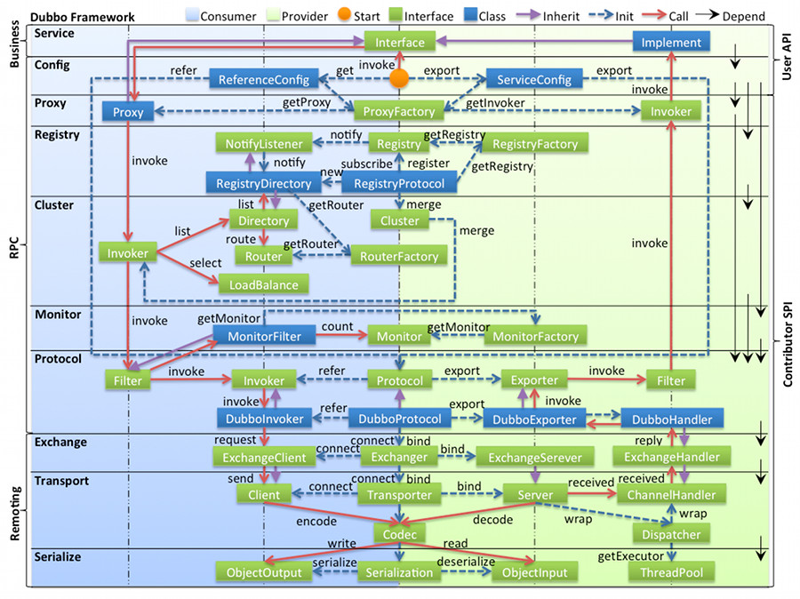

#### 各层说明

- **config 配置层**：对外配置接口，以 `ServiceConfig`, `ReferenceConfig` 为中心，可以直接初始化配置类，也可以通过 spring 解析配置生成配置类
- **proxy 服务代理层**：服务接口透明代理，生成服务的客户端 Stub 和服务器端 Skeleton, 以 `ServiceProxy` 为中心，扩展接口为 `ProxyFactory`
- **registry 注册中心层**：封装服务地址的注册与发现，以服务 URL 为中心，扩展接口为 `RegistryFactory`, `Registry`, `RegistryService`
- **cluster 路由层**：封装多个提供者的路由及负载均衡，并桥接注册中心，以 `Invoker` 为中心，扩展接口为 `Cluster`, `Directory`, `Router`, `LoadBalance`
- **monitor 监控层**：RPC 调用次数和调用时间监控，以 `Statistics` 为中心，扩展接口为 `MonitorFactory`, `Monitor`, `MonitorService`
- **protocol 远程调用层**：封装 RPC 调用，以 `Invocation`, `Result` 为中心，扩展接口为 `Protocol`, `Invoker`, `Exporter`
- **exchange 信息交换层**：封装请求响应模式，同步转异步，以 `Request`, `Response` 为中心，扩展接口为 `Exchanger`, `ExchangeChannel`, `ExchangeClient`, `ExchangeServer`
- **transport 网络传输层**：抽象 mina 和 netty 为统一接口，以 `Message` 为中心，扩展接口为 `Channel`, `Transporter`, `Client`, `Server`, `Codec`
- **serialize 数据序列化层**：可复用的一些工具，扩展接口为 `Serialization`, `ObjectInput`, `ObjectOutput`, `ThreadPool`

#### 关系说明

```
Remoting是Dubbo协议的实现，又分为Exchange信息交换层和Transport网络传输层。Transport层只负责单项消息传输，是对Netty的封装，Exchange层建立在Transport层之上，封装了请求和响应。
```

**RegistryProtocol#doLocalExport(Invoker<T> invoker,URL providerUrl)**

```java
    private <T> Exporter doLocalExport(Invoker<T> invoker,URL providerUrl) {
        DubboProtocol dubboProtocol = new DubboProtocol();
        return dubboProtocol.export(invoker);
    }
```

**DubboProtocol#export(Invoker<T> invoker)**

```java
    public <T> Exporter<T> export(Invoker<T> invoker) {
        URL url = invoker.getUrl();
        // 服务key
        String key = serviceKey(url);

        openServer(url); // 开启netty服务

        return super.export(invoker);
    }
    // 创建ExchangeServer
    private void openServer(URL url) {
        //TODO 先从缓存获取
        createServer(url);
    }

    /**
     * 得到交换层的ExchangeServer对象
     * @param url
     * @return
     */
    private ExchangeServer createServer(URL url) {
        ExchangeServer server= Exchangers.bind(url,requestHandler);
        return server;
    }
```

**Exchangers.bind(url,requestHandler)本质是HeaderExchanger.bind(url,handler)**

```java
    public ExchangeServer bind(URL url, ExchangeHandler handler) {
        return new HeaderExchangeServer(Transporters.bind(url,handler));
    }
```

Transporters.bind(url,handler))本质是

NettyTransporter.bind(url,handler)

```java
    public RemotingServer bind(URL url, ChannelHandler handler) {
        return new NettyServer(url,handler);
    }
```

靠invoker传来传去

```java
// 本地暴露接口，通过DubboProtocol暴露接口，最终会去调用RegistryProtocol#export    
@SuppressWarnings({"unchecked", "rawtypes"})
    private void doExportUrl(URL url, boolean withMetaData) {
        Invoker<?> invoker = proxyFactory.getInvoker(ref, (Class) interfaceClass, url);
        if (withMetaData) {
            invoker = new DelegateProviderMetaDataInvoker(invoker, this);
        }
        Exporter<?> exporter = protocolSPI.export(invoker);
        exporters.add(exporter);
    }

// DubboProtocol暴露服务
    @Override
    public <T> Exporter<T> export(Invoker<T> invoker) throws RpcException {
        checkDestroyed();
        URL url = invoker.getUrl();

        // export service.
        String key = serviceKey(url);
        DubboExporter<T> exporter = new DubboExporter<T>(invoker, key, exporterMap);

        //export a stub service for dispatching event
        Boolean isStubSupportEvent = url.getParameter(STUB_EVENT_KEY, DEFAULT_STUB_EVENT);
        Boolean isCallbackservice = url.getParameter(IS_CALLBACK_SERVICE, false);
        if (isStubSupportEvent && !isCallbackservice) {
            String stubServiceMethods = url.getParameter(STUB_EVENT_METHODS_KEY);
            if (stubServiceMethods == null || stubServiceMethods.length() == 0) {
                if (logger.isWarnEnabled()) {
                    logger.warn(new IllegalStateException("consumer [" + url.getParameter(INTERFACE_KEY) +
                            "], has set stubproxy support event ,but no stub methods founded."));
                }

            }
        }

        openServer(url);
        optimizeSerialization(url);

        return exporter;
    }
```

```
RegistryConfig转换成URL
```

ServiceConfig进行服务的暴露

```
    private void doExportUrl(URL url, boolean withMetaData) {
        Invoker<?> invoker = proxyFactory.getInvoker(ref, (Class) interfaceClass, url);
        if (withMetaData) {
            invoker = new DelegateProviderMetaDataInvoker(invoker, this);
        }
        Exporter<?> exporter = protocolSPI.export(invoker);
        exporters.add(exporter);
    }
```

```
    /**
     * always export injvm
     */
    private void exportLocal(URL url) {
        URL local = URLBuilder.from(url)
                .setProtocol(LOCAL_PROTOCOL)
                .setHost(LOCALHOST_VALUE)
                .setPort(0)
                .build();
        local = local.setScopeModel(getScopeModel())
            .setServiceModel(providerModel);
        doExportUrl(local, false);
        logger.info("Export dubbo service " + interfaceClass.getName() + " to local registry url : " + local);
    }
```

RegistryProtocol#export(Invoker)

```
    /**
     * RegistryProtocol进行服务暴露，传入一个invoker对象，Invoker就是一个中间人，
     * 最终也会委托给DubboRegistry进行服务注册
     * 将invoker进一步封装，然后交给不同协议的Registry去注册服务
     * @param originInvoker
     * @param <T>
     * @return
     * @throws RpcException
     */
    @Override
    public <T> Exporter<T> export(final Invoker<T> originInvoker) throws RpcException {
        // zookeeper注册中心的url
        // zookeeper://192.168.42.101:2181/org.apache.dubbo.registry.RegistryService?application=dajiuye-swipper-service&dubbo=2.0.2&export=dubbo%3A%2F%2F10.63.138.191%3A7072%2Fcom.lhf.dajiuye.api.service.swipper.SchoolService%3Fanyhost%3Dtrue%26application%3Ddajiuye-swipper-service%26bind.ip%3D10.63.138.191%26bind.port%3D7072%26deprecated%3Dfalse%26dubbo%
        URL registryUrl = getRegistryUrl(originInvoker);
        // url to export locally 服务本地暴露的url
        // dubbo://10.63.138.191:7072/com.lhf.dajiuye.api.service.swipper.SchoolService?anyhost=true&application=da
        URL providerUrl = getProviderUrl(originInvoker);

        // Subscribe the override data
        // FIXME When the provider subscribes, it will affect the scene : a certain JVM exposes the service and call
        //  the same service. Because the subscribed is cached key with the name of the service, it causes the
        //  subscription information to cover.
        final URL overrideSubscribeUrl = getSubscribedOverrideUrl(providerUrl);
        final OverrideListener overrideSubscribeListener = new OverrideListener(overrideSubscribeUrl, originInvoker);
        Map<URL, NotifyListener> overrideListeners = getProviderConfigurationListener(providerUrl).getOverrideListeners();
        overrideListeners.put(registryUrl, overrideSubscribeListener);
        // 根据配置信息对原来服务暴露的url进行重写
        providerUrl = overrideUrlWithConfig(providerUrl, overrideSubscribeListener);
        //export invoker 交给DubboProtocol协议进行服务暴露，比如创建NettyServer监听端口和保存服务实例
        final ExporterChangeableWrapper<T> exporter = doLocalExport(originInvoker, providerUrl);

        // url to registry 获取ZookeeperRegistry注册中心对象（与注册中心创建TCP连接）
        final Registry registry = getRegistry(registryUrl);
        // 服务注册的url
        // dubbo://10.63.138.191:7072/com.lhf.dajiuye.api.service.swipper.SchoolService?anyhost=true&application=dajiuye-swipper-service&deprecated=false&dubbo=2.0.2&dynamic=true&generic=false&interface=com.lhf.dajiuye.api.service.swipper.SchoolService
        final URL registeredProviderUrl = getUrlToRegistry(providerUrl, registryUrl);

        // decide if we need to delay publish (provider itself and registry should both need to register)
        boolean register = providerUrl.getParameter(REGISTER_KEY, true) && registryUrl.getParameter(REGISTER_KEY, true);
        if (register) {
            // 服务注册
            register(registry, registeredProviderUrl);
        }

        // register stated url on provider model
        registerStatedUrl(registryUrl, registeredProviderUrl, register);


        exporter.setRegisterUrl(registeredProviderUrl);
        exporter.setSubscribeUrl(overrideSubscribeUrl);

        if (!registry.isServiceDiscovery()) {
            // Deprecated! Subscribe to override rules in 2.6.x or before.
            registry.subscribe(overrideSubscribeUrl, overrideSubscribeListener);
        }

        notifyExport(exporter);
        //Ensure that a new exporter instance is returned every time export
        return new DestroyableExporter<>(exporter);
    }
```

最终调用DubboProtocol#export进行服务暴露

通过这个ExchangeHandler进行层与层的通信


#### Dubbo Channel和Netty Channel如何建立联系


## VUE

### elementUI

```
element-plus不适配vue3，官方已将vue3版本的更新为element-plus

npm install element-plus --save

引入
import ElementPlus from 'element-plus'
import 'element-plus/dist/index.css'
```


## Docker

### 蓝绿发布：蓝绿一个好一个坏，切换

金丝雀发布：一个一个替换

### Harbor位置

```
/opt/harbor
```

### 查看容器详细信息

```
docker inspect asdadadad
```

### 启动命令

```
docker 启动命令
sudo systemctl start docker
 
docker 重启命令
systemctl restart docker

docker 查看状态命令
systemctl status docker
```

### 开机自启动

```
docker update name --restart
	no -  容器退出时，不重启容器；

    on-failure - 只有在非0状态退出时才从新启动容器；

    always - 无论退出状态是如何，都重启容器；
```

### docker 镜像启动成功但是无法访问

解决办法：

`vi /etc/sysctl.conf或者vi /usr/lib/sysctl.d/00-system.conf`

添加如下代码：
`net.ipv4.ip_forward=1`

重启network服务

`systemctl restart network`

查看是否修改成功

`sysctl net.ipv4.ip_forward`
如果返回为“net.ipv4.ip_forward = 1”则表示成功了

### 检查容器

```
docker inspect container_id | grep 
```


### 进入容器命令

```
docker exec [OPTIONS] CONTAINER COMMAND [ARG...]
```

### 移除数据卷

```
docker volume rm <volume name>
```

### 批量删除容器或镜像

```
sudo docker ps -a | grep Exited | awk '{print $1}' | xargs sudo docker rm 删除异常停止的docker容器

sudo docker images | grep '<none>' | awk '{print $3}'| xargs sudo docker rmi -f 删除名称或标签为none的镜像
```

## k8s

master默认有污点不能部署:强制措施：

```
kubectl taint nodes --all node-role.kubernetes.io/master-
```

卸载看s集群

```
kubeadm reset -f
modprobe -r ipip
lsmod
rm -rf ~/.kube/
rm -rf /etc/kubernetes/
rm -rf /etc/systemd/system/kubelet.service.d
rm -rf /etc/systemd/system/kubelet.service
rm -rf /usr/bin/kube*
rm -rf /etc/cni
rm -rf /opt/cni
rm -rf /var/lib/etcd
rm -rf /var/etcd
yum clean all
yum remove kube*
```

## jenkins

war包启动命令（采用）

```
nohup java -jar jenkins.war &
```

rpm方式安装

```
wget https://pkg.jenkins.io/redhat-stable/jenkins-2.121.2-1.1.noarch.rpm

rpm -ivh jenkins-2.121.2-1.1.noarch.rpm
```

docker运行命令

```
docker run -d --name jenkins_v2 -p 8680:8080 -p 56000:50000 -v jenkins_data:/var/jenkins_home jenkins/jenkins
```

修改插件地址

```

cd /var/lib/jenkins/updates/

sed -i 's#http:\/\/updates.jekins-ci.org\/download#https:\/\/mirrors.tuna.tsinghua.edu.cn\/jenkins#g' default.json && sed -i '#/http:\/\/www.google.com#https:\/\/www.baidu.com#g' default.json
```

## es

### 单节点es备份

```
# 查询所有
GET _search
{
  "query": {
    "match_all": {}
  }
}

DELETE /hot

PUT /hot
{
  "mappings": {
    "properties": {
      "hotWord":{
        "type": "keyword"
      }
    }
  }
}

# 测试补全
PUT test
{
  "mappings":{
    "properties":{
      "title":{
        "type":"completion"
      }
    }
  }
}

GET /question

GET /question/_search
{
  "query": {"match_all": {}}
}

POST /test/_doc
{
  "title":["Sony","dsadasda"]
}


GET /question/_search
{
  "suggest": {
    "title_suggest": {
      "text": "java;php;",
      "completion": {
        "field": "suggestion",
        "skip_duplicates":true,
        "size":10
      }
    }
  }
}

GET /question/_search
{
  "query": {"match_all": {}}
}

DELETE /question

PUT /question
{
  "settings": {
    "analysis": {
      "analyzer": {
        "text_analyzer":{
          "tokenizer":"ik_max_word",
          "filter":"py"
        },
        "completion_anylyzer":{
          "tokenizer":"keyword",
          "filter":"py"
        }
      },
      "filter": {
        "py":{
          "type":"pinyin",
          "keep_full_pinyin": false,
          "keep_joined_full_pinyin": true,
          "keep_original": true,
          "limit_first_letter_length": 16,
          "remove_duplicated_term": true,
          "none_chinese_pinyin_tokenize": false
        }
      }
    }
  }, 
  "mappings": {
    "properties": {
      "id": {
        "type": "long"
      },
      "title": {
        "type": "text",
        "analyzer": "text_analyzer",
        "search_analyzer": "ik_smart", 
        "copy_to": "all"
      },
      "description": {
        "type": "text",
        "analyzer": "ik_smart",
        "copy_to": "all"
      },
      "createTime": {
        "type": "date"
      },
      "modifiedTime": {
        "type": "date"
      },
      "creatorId": {
        "type": "keyword"
      },
      "creatorName": {
        "type": "text",
        "analyzer": "ik_smart"
      },
      "commentCount": {
        "type": "long"
      },
      "viewCount": {
        "type": "long"
      },
      "likeCount": {
        "type": "long"
      },
      "tag": {
        "type": "text",
        "analyzer": "ik_smart",
        "copy_to": "all"
      },
      "sticky": {
        "type": "long"
      },
      "areaId": {
        "type": "long"
      },
      "areaName": {
        "type": "text",
        "analyzer": "ik_smart",
        "copy_to": "all"
      },
      "img": {
        "type": "keyword"
      },
      "all":{
        "type": "text",
        "analyzer": "text_analyzer",
        "search_analyzer": "ik_smart"
      },
      "suggestion":{
        "type": "completion",
        "analyzer": "completion_anylyzer"
      }
    }
  }
}


# 测试拼音分词器


# 老的question映射
PUT /question
{
  "question" : {
    "aliases" : { },
    "mappings" : {
      "properties" : {
        "all" : {
          "type" : "text",
          "fields" : {
            "keyword" : {
              "type" : "keyword",
              "ignore_above" : 256
            }
          }
        },
        "areaId" : {
          "type" : "long"
        },
        "areaName" : {
          "type" : "text",
          "copy_to" : [
            "all"
          ],
          "analyzer" : "ik_smart"
        },
        "commentCount" : {
          "type" : "long"
        },
        "createTime" : {
          "type" : "date"
        },
        "creatorId" : {
          "type" : "keyword"
        },
        "creatorName" : {
          "type" : "text",
          "analyzer" : "ik_smart"
        },
        "description" : {
          "type" : "text",
          "copy_to" : [
            "all"
          ],
          "analyzer" : "ik_smart"
        },
        "id" : {
          "type" : "long"
        },
        "img" : {
          "type" : "keyword"
        },
        "likeCount" : {
          "type" : "long"
        },
        "modifiedTime" : {
          "type" : "date"
        },
        "sticky" : {
          "type" : "long"
        },
        "suggestion" : {
          "type" : "text",
          "fields" : {
            "keyword" : {
              "type" : "keyword",
              "ignore_above" : 256
            }
          }
        },
        "tag" : {
          "type" : "text",
          "copy_to" : [
            "all"
          ],
          "analyzer" : "ik_smart"
        },
        "title" : {
          "type" : "text",
          "copy_to" : [
            "all"
          ],
          "analyzer" : "ik_smart"
        },
        "viewCount" : {
          "type" : "long"
        }
      }
    },
    "settings" : {
      "index" : {
        "routing" : {
          "allocation" : {
            "include" : {
              "_tier_preference" : "data_content"
            }
          }
        },
        "number_of_shards" : "1",
        "provided_name" : "question",
        "creation_date" : "1648203917549",
        "number_of_replicas" : "1",
        "uuid" : "tLMZaYGNRCGZqkIeHM8_tw",
        "version" : {
          "created" : "7120199"
        }
      }
    }
  }
}               
```

### HU帖子Mapping

```
PUT /hot
{
  "mappings": {
    "properties": {
      "hotWord":{
        "type": "keyword"
      }
    }
  }
}

PUT /question
{
  "settings": {
    "analysis": {
      "analyzer": {
        "text_analyzer":{
          "tokenizer":"ik_max_word",
          "filter":"py"
        },
        "completion_anylyzer":{
          "tokenizer":"keyword",
          "filter":"py"
        }
      },
      "filter": {
        "py":{
          "type":"pinyin",
          "keep_full_pinyin": false,
          "keep_joined_full_pinyin": true,
          "keep_original": true,
          "limit_first_letter_length": 16,
          "remove_duplicated_term": true,
          "none_chinese_pinyin_tokenize": false
        }
      }
    }
  }, 
  "mappings": {
    "properties": {
      "id": {
        "type": "long"
      },
      "title": {
        "type": "text",
        "analyzer": "text_analyzer",
        "search_analyzer": "ik_smart", 
        "copy_to": "all"
      },
      "description": {
        "type": "text",
        "analyzer": "ik_smart",
        "copy_to": "all"
      },
      "createTime": {
        "type": "date"
      },
      "modifiedTime": {
        "type": "date"
      },
      "creatorId": {
        "type": "keyword"
      },
      "creatorName": {
        "type": "text",
        "analyzer": "ik_smart"
      },
      "commentCount": {
        "type": "long"
      },
      "viewCount": {
        "type": "long"
      },
      "likeCount": {
        "type": "long"
      },
      "tag": {
        "type": "text",
        "analyzer": "ik_smart",
        "copy_to": "all"
      },
      "sticky": {
        "type": "long"
      },
      "areaId": {
        "type": "long"
      },
      "areaName": {
        "type": "text",
        "analyzer": "ik_smart",
        "copy_to": "all"
      },
      "img": {
        "type": "keyword"
      },
      "all":{
        "type": "text",
        "analyzer": "text_analyzer",
        "search_analyzer": "ik_smart"
      },
      "suggestion":{
        "type": "completion",
        "analyzer": "completion_anylyzer"
      }
    }
  }
}
```

### 常见DSL语句

```json
GET _search
{
  "query": {
    "match_all": {}
  }
}

GET /_analyze
{
  "analyzer": "ik_max_word",
  "text": "黑马程序员"
}

GET /_analyze
{
  "analyzer": "ik_max_word",
  "text": "传智播客Java就业超过90%,奥力给！"
}

GET /_analyze
{
  "analyzer": "ik_smart",
  "text": "传智播客Java就业超过90%,奥力给！"
}

GET /_analyze
{
  "analyzer": "ik_max_word",
  "text": "传智播客Java就业率超过95%,习大大都点赞,奥力给！"
}

PUT /heima
{
  "mappings": {
    "properties": {
      "age": {
        "type": "keyword"
      },
      "weight": {
        "type": "float"
      },
      "isMarried": {
        "type": "boolean"
      },
      "info": {
        "type": "text",
        "analyzer": "ik_smart"
      },
      "email": {
        "type": "keyword",
        "index": false
      },
      "score": {
        "type": "float"
      },
      "name": {
        "properties": {
          "firstName": {
            "type": "keyword"
          },
          "lastName": {
            "type": "keyword"
          }
        }
      }
    }
  }
}


GET /heima

# 新增数据
POST /heima/_doc/1
{
  "age":"21",
  "weight":52.1,
  "isMarried":false,
  "info":"黑马程序员Java讲师",
    "email":"zy@itcast.cn",
    "score":[99.1, 99.5, 98.9],
    "name":{
      "firstName":"云",
      "lastName":"赵"
      
    }
}


# 可新增字段，但那不可以修改
PUT /heima/_mapping
{
  "properties":{
    "age":{
      "type":"integer"
    }
  }
}

# 查询文档
GET /hotel/_doc/434082

# 删除文档
DELETE /hotel/_doc/61083

# 增量修改
POST /heima/_update/1
{
  "doc":{
    "info":"py数分"
  }
}

# 黑马旅游索引库
PUT /hotel
{
  "mappings": {
    "properties": {
      "id": {
        "type": "keyword"
      },
      "name":{
        "type": "text",
        "analyzer": "ik_max_word",
        "copy_to": "all"
      },
      "address":{
        "type": "keyword",
        "index": false
      },
      "price":{
        "type": "integer"
      },
      "score":{
        "type": "integer"
      },
      "brand":{
        "type": "keyword",
        "copy_to": "all"
      },
      "city":{
        "type": "keyword",
        "copy_to": "all"
      },
      "starName":{
        "type": "keyword"
      },
      "business":{
        "type": "keyword"
      },
      "location":{
        "type": "geo_point"
      },
      "pic":{
        "type": "keyword",
        "index": false
      },
      "all":{
        "type": "text",
        "analyzer": "ik_max_word"
      }
    }
  }
}

# day2

# 查询所有
GET /hotel/_search
{
  "query": {
    "match_all": {}
  }
}

# match查询
GET /hotel/_search
{
  "query": {
    "match": {
      "all": "外滩如家"
    }
  }
}

# multi_match查询
GET /hotel/_search
{
  "query": {
    "multi_match": {
      "query": "外滩如家",
      "fields": ["brand","name","business"]
    }
  }
}

# term查询，精确匹配
GET /hotel/_search
{
  "query": {
    "term": {
      "city": {
        "value": "杭州上海"
      }
    }
  }
}

# range查询
GET /hotel/_search
{
  "query": {
    "range": {
      "price": {
        "gte": 1000,
        "lte": 3000
      }
    }
  }
}

# distance查询
GET /hotel/_search
{
  "query": {
    "geo_distance":{
      "distance":"2km",
      "location":"31.21,121.5"
    }
  }
}

# function score 查询
GET /hotel/_search
{
  "query": {
    "function_score": {
      "query": {
        "match": {
          "all": "外滩"
        }
      }
    }
  }
}

# function score 查询
GET /hotel/_search
{
  "query": {
    "function_score": {
      "query": {
        "match": {
          "all": "外滩"
        }
      },
      "functions": [
        {
          "filter": {
            "term": {
              "brand": "如家"
            }
          },
          "weight": 10
        }
      ],
      "boost_mode": "multiply"
    }
  }
}

# bool查询
GET /hotel/_search
{
  "query": {
    "bool": {
      "must": [
        {
          "term": {
            "name": {
              "value": "如家"
            }
          }
        }
      ],
      "must_not": [
        {
          "range": {
            "FIELD": {
              "gt": 400
            }
          }
        }
      ],
      "filter": [
        {
          "geo_distance": {
            "distance": "100km",
            "location": {
              "lat": 32.21,
              "lon": 121.5
            }
          }
        }
      ]
    }
  }
}

# 普通字段排序
GET /hotel/_search
{
  "query": {
    "match_all": {}
  },
  "sort": [
    {
      "score": "desc"
    },
    {
      "price": "asc"
    }
  ]
}

# 地理坐标排序
GET /hotel/_search
{
  "query": {
    "match_all": {}
  },
  "sort": [
    {
      "_geo_distance": {
        "location": {
          "lat": 31.03,
          "lon": 121.61
        },
        "order": "asc",
        "unit": "km"
      }
    }
  ]
}

# 分页
GET /hotel/_search
{
  "query": {
    "match_all": {}
  },
  "from": 10,
  "size": 3,
  "sort": [
    {
      "price": {
        "order": "asc"
      }
    }
  ]
}

# 高亮查询
GET /hotel/_search
{
  "query": {
    "match": {
      "name": "如家"
    }
  },
  "from": 0,
  "size": 20,
  "sort": [
    {
      "price": "asc"
    },
    {
      "_geo_distance": {
        "location":"31.040699,121.618075",
        "order": "asc",
        "unit": "km"
      }
    }
  ],
  "highlight": {
    "fields": {
      "name": {
        "pre_tags": "<em>",
        "post_tags": "</em>"
      }
    }
  }
}

# 434082
# 添加广告标记
POST /hotel/_update/434082
{
  "doc": {
    "isAD":true
  }
}

# bucket聚合，即分组
GET /hotel/_search
{
  "query": {
    "range": {
      "price": {
        "gte": 100,
        "lte": 202
      }
    }
  }, 
  "size": 20,
  "aggs": {
    "brandAgg": {
      "terms": {
        "field": "brand",
        "order": {
          "_count": "asc"
        }, 
        "size": 20
      }
    }
  }
}

# 度量聚合
GET /hotel/_search
{
  "size": 0,
  "aggs": {
    "brandAgg": {
      "terms": {
        "field": "brand",
        "size": 10,
        "order": {
          "scoreAgg.avg": "desc"
        }
      },
      "aggs": {
        "scoreAgg": {
          "stats": {
            "field": "score"
          }
        }
      }
    }
  }
}

# 查询索引mapping
GET /hotel

# 自定义分词器
PUT /test
{
  "settings": {
    "analysis": {
      "analyzer": {
        "my_analyzer":{
          "tokenizer":"ik_max_word",
          "filter":"py"
        }
      },
      "filter": {
        "py":{
          "type":"pinyin",
          "keep_full_pinyin":false,
          "keep_joined_full_pinyin":true,
          "keep_original":true,
          "limit_first_letter_length":16,
          "remove_duplicated_term":true,
          "none_chinese_pinyin_tokenize":false
        }
      }
    }
  },
  "mappings": {
    "properties": {
      "title":{
        "type": "completion",
        "analyzer": "my_analyzer",
        "search_analyzer": "ik_smart"
      }
    }
  }
}

# 删除索引库
DELETE /hotel

# 测试自定义分词器
POST /test/_analyze
{
  "text": "如家酒店还不错",
  "analyzer": "my_analyzer"
}

# 创建索引库
PUT test
{
  "mappings": {
    "properties": {
      "title":{
        "type": "completion"
      }
    }
  }
}

# 插入文档
POST test/_doc
{
  "title":["sony","WH-1000XM3"]
}

POST test/_doc
{
  "title":["SK-II","PITERA"]
}

POST test/_doc
{
  "title":["Nintendo","switch"]
}

# 自动补全查询
GET /test/_search
{
  "suggest": {
    "title_suggest": {
      "text": "s",
      "completion":{
        "field":"title",
        "skip_duplicates":true,
        "size":10
      }
    }
  }
}

# 修改酒店映射结构，实现自动补全
PUT /hotel
{
  "settings": {
    "analysis": {
      "analyzer": {
        "text_analyzer":{
          "tokenizer":"ik_max_word",
          "filter":"py"
        },
        "completion_analyzer":{
          "tokenizer":"keyword",
          "filter":"py"
        }
      },
      "filter": {
        "py":{
          "type":"pinyin",
          "keep_full_pinyin":false,
          "keep_joined_full_pinyin": true,
          "keep_original":true,
          "limit_first_letter_length":16,
          "remove_duplicated_term":true,
          "none_chinese_pinyin_tokenize":false
        }
      }
    }
  },
  "mappings": {
    "properties": {
      "id":{
        "type": "keyword"
      },
      "name":{
        "type": "text",
        "analyzer": "text_analyzer",
        "search_analyzer": "ik_smart",
        "copy_to": "all"
      },
      "address":{
        "type": "keyword",
        "index": false
      },
      "price":{
        "type": "integer"
      },
      "score":{
        "type": "integer"
      },
      "brand":{
        "type": "keyword"
      },
      "city":{
        "type": "keyword"
      },
      "starName":{
        "type": "keyword"
      },
      "business":{
        "type": "keyword",
        "copy_to": "all"
      },
      "location":{
        "type": "geo_point"
      },
      "pic":{
        "type": "keyword",
        "index": false
      },
      "all":{
        "type": "text",
        "analyzer": "text_analyzer",
        "search_analyzer": "ik_smart"
      },
      "suggestion":{
        "type": "completion",
        "analyzer": "completion_analyzer"
      }
    }
  }
}

# 酒店自动补全测试
GET /hotel/_search
{
  "suggest": {
    "YOUR_SUGGESTION": {
      "text": "hs",
      "completion":{
        "field":"suggestion",
        "skip_duplicates":true,
        "size":10
      }
    }
  }
}


```
