## 其它

### IDEA JVM调优


### typora快捷键

- 无序列表：- + 空格
- 有序列表：输入数字+“.”之后输入空格
- 任务列表：-[空格]空格 文字
- 标题：ctrl+数字
- 表格：ctrl+t
- 生成目录：`[TOC]`按回车
- 选中一整行：ctrl+l
- 选中单词：ctrl+d
- 选中相同格式的文字：ctrl+e
- 跳转到文章开头：ctrl+home
- 跳转到文章结尾：ctrl+end
- 搜索：ctrl+f
- 替换：ctrl+h
- 引用：输入>之后输入空格
- 代码块：ctrl+alt+f
- 加粗：ctrl+b
- 倾斜：ctrl+i
- 下划线：ctrl+u
- 删除线：alt+shift+5
- 插入图片：直接拖动到指定位置即可或者ctrl+shift+i
- 插入链接：ctrl + k
- 打开类结构： ctrl+f12
- 

### idea

#### 微服务多个显示

view->tool windows->service

#### 一键启动多个微服务

+compound

#### 快捷键

- 全局查找: 双击shift: 


- 格式化代码：ctrl+alt+l 
- 整行上下移动：ctrl+shift+上下键
- 注释：ctrl+shirft+/
- 查看类的继承关系：ctrl+H
- 缩进:shift+tab / tab
- 查看文件popu : ctl+1e
- 弹窗类的方法：ctl+F12
- 生成try-catch：ctl+alt+t
- 抽取方法：ctrl+alt+m
- 查看方法直接跳转实现类：ctrl+alt+左键
- 查源码查看调用者：ctrl+alt+<-

### windows命令

```bash
services.msc 查看服务器（windows）

找到占用端口的进程
netstat -ano | findstr "4000"

找到继承名字
tasklist | findstr "20616"

杀死进程
taskkill /f /t /im "node.exe"

hexo clean // 删除public文件的内容
hexo g // 生成静态文件到public
hexo s // 本地运行
hexo d // 发布静态文件
博客标题
---
title
---
```

### windows注册表


应该选D


Windows注册表的基本知识及应用
 
一、注册表的重要性

　　在ＤＯS年代，对计算机的内存管理及系统配置主要通过ＡUTOEXEC．BAT和ＣONFIG．SYS来完成。从ＷINDOWS３．ｘ开 始，对系统的管理增加了大量的＊．ｉｎｉ文件来登录软件及硬件的各种初始化信息。这为系统管理带来了灵活性，也带来了不便之处。因为每个应用程序都有自己 的ｉｎｉ文件，并在Ｗｉｎ．ｉｎｉ中增加了自己的配置项，这使ｉｎｉ文件众多，且Wｉｎ．ｉｎｉ日益庞大。

　　从Ｗｉｎｄｏｗｓ９５开始，原来保存在初始化文件中的有关信息，都被移到了系统的注册表中，注册表（Ｒｅｇｉｓｔｒｙ）实质上是一个庞大的分层数据库，它存储着下面这些内容：

　　软、硬件的有关配置和状态信息，应用程序和资源管理器外壳的初始条件、首选项和卸载数据；电脑整个系统的设置和各种许可，文件扩展名与应用程序的关联，硬件的描述、状态和属性；电脑性能记录和底层的系统状态信息，以及各类其他数据。

  由上可见，注册表是WINDOWS的命根子，注册表文件的损坏、设置错误，将会导致应用程序无法运行、系统出错，直至系统崩溃或无法启动。
　

二、注册表的结构

  Windows98的注册表是由二进制数据组成，以一个树形结构分布。注册表主要由以下两个文件组成：

  System.dat（存储与用户无关的系统配置信息，包括硬件配置、软件的安装等）

  Ｕｓｅｒ．ｄａｔ（存储与用户有关的信息以及特定于某个用户的应用程序安装信息 ），

  这两个文件一般保存在Ｗｉｎｄｏｗｓ所在的文件夹中，另外还有这些文件的备份＊．ｄａ0( Windows系统在每次系统的配置改变时都会自动进行备份，生成Ｓｙｓｔｅｍ．da0和Ｕｓｅｒ．ｄａ0

文件)。

  Ｗｉｎｄｏｗｓ为我们提供了一个注册表编辑器（Ｒｅｇｅｄｉｔ．ｅｘｅ）的工具，它可以用来查看和维护注册表。单击“开始”菜单，选择“运行”项，在“打开”栏中输入“ｒｅｇｅｄｉｔ”，确定，即可打开注册表。

  注册表编辑器与资源管理器的界面相似。左边窗格中，从“我的电脑”开始，以下是六个分支，其含义简述如下：

  HKEY_CLASSES_ROOT：此处存储的信息可以确保当使用Windows资源管理器打开文件时，将使用正确的应用程序打开对应的文件类型。

  HKEY_CURRENT_USER：存放当前登录用户的有关信息。用户文件夹、屏幕颜色和“控制面板”设置存储在此处。该信息被称为用户配置文件。

  HKEY_LOCAL_MACHINE：包含针对该计算机（对于任何用户）的配置信息。

  HKEY_USERS：存放计算机上所有用户的配置文件。

  HKEY_CURRENT_CONFIG：包含本地计算机在系统启动时所用的硬件配置文件信息。

  HKEY_DYN_DATA：记录系统运行时刻的状态。

  注册表按层次结构来组织，六个分支名都以ＨＫＥＹ开头，称为主键（ＫＥＹ），这和资源管理器中的文件夹相似，表示主键的图标与文件夹的图标一样。每个主键 图标的左边有一个“＋”号图标，单击可将这一分支展开，展开后可以看到主键还包含次级主键（ＳｕｂＫＥＹ）。当单击某一主键或次主键时，右边窗格中显示的 是所选主键内包含的一个或多个键值（Ｖａｌｕｅ）。

　　键值由键值名称（ＶａｌｕｅＮａｍｅ）和数据（ＶａｌｕｅＤａｔａ）组成，这就是右窗口中的两个列表（名称、数据）所表示的。主键中可以包含多级的次级主键，注册表中的信息就是按照多级的层次结构组织的。每个分支中保存电脑软件或硬件之中某一方面的信息与数据。


三、注册表中的键值项数据

　　注册表通过键和子键来管理各种信息。但是注册表中的所有信息都是以各种形式的键值项数据保存的。在注册表编辑器右窗格中显示的都是键值项数据。这些键值项数据可以分为三种类型：

　　１．字符串值

　　在注册表中，字符串值一般用来表示文件的描述和硬件的标识。通常由字母和数字组成，也可以是汉字，最大长度不能超过２５５个字符。

　　２．二进制值

　　在注册表中二进制值是没有长度限制的，可以是任意字节长。在注册表编辑器中，二进制以十六进制的方式表示。

　　３．ＤＷＯＲＤ值

　　ＤＷＯＲＤ值是一个３２位（４个字节）的数值。在注册表编辑器中也是以十六进制的方式表示。
　　

四、注册表应用

 （一）注册表的备份和恢复
  由于注册表文件对计算机有着至关重要的作用，因此应当定期进行备份。备份注册表的方法为：打开注册表，在注册表菜单中选择“导出注册表文件”命令，在“导 出注册表文件”对话框中，选择保存位置并取一文件名，在导出范围中选择全部（即对整个注册表进行备份）或者再选择的分支中输入要备份的分支，最后点击“保 存”按钮即可。
  恢复注册表的方法很简单：打开注册表，注册表菜单中选择“引入注册表文件”命令，选择所要引人的以前备份的注册表文件，单击“打开” 按钮即可。
 （二）注册表的DOS恢复法
  有时由于注册表的损坏原因，Windows无法启动或工作出错，这时你可在DOS方式下恢复Windows系统自动备份的某一个注册表，就可恢复Windows系统正常，方法如下：
\1. 用系统软盘启动进入（如Windows还能启动，则并切换到）MS－DOS方式。
\2. 进入Windows\Command目录，输入SCANREG／RESTORE后回车。
\3. 进入界面后，可在5个注册表备份中选取所要恢复的，重新启动后即可。
 （三）清除多余的DLL文件
  在Windows系统的System子目录下存有大量的DLL文件，这些文件可能被系统或应用程序共享。但是由于经常安装和卸载软件，就会在System 目录下留下一些DLL垃圾文件。它们不但占用了硬盘空间，而且还降低系统的运行速度。你要识别、删除那些没有被系统或应用程序所共享的DLL文件，可运行 “ｒｅｇｅｄｉｔ”，打开注册表编辑器，找到HKEY_LOCAL_MACHINE\Software\Microsoft\Windows
\CurrentVersion \SharedDLLs分支，在SharedDLLs子键中，记录的就是有关程序共享的DLL信息，每个DLL文件的键值说明它已被几个应用程序共享。如 果是二进制键值为“00 00 00 00”，则表明不被任何程序共享，可以将其删除，退出注册表编辑器，并在System目录中删除对应的文件。（你要较全面自动清除注册表中垃圾文件，可用 “超级兔子”软件进行注册表优化，有关“超级兔子”软件情况，你可进入[www.superrsoft.com](http://www.superrsoft.com/) 网站）。
 （四）启动计算机时必须登录
  Windows98在启动时有一个登录对话框，要求用户选择用户名及输入密码，但这并没有多大的作用，任何用户都可以单击“取消”键而启动计算机。通过修 改注册表，就可以使Windows在启动时，用户必需输入密码才能登录，从而防止非法用户使用计算机，具体修改方法如下:
  在注册表中找到HKEY_LOCAL_MACHINE\Network\Logon 键，在右边窗口中单击鼠标右键，新建一DWORD值，并命名为MustBevalidated，将其值改为ll1lllll，这样，在启动计算机时必需输入密码，否

则就不能登录。
 （五）启动时自动运行某一程序
  通过将某一程序其添加到开始菜单里的“启动”菜单项上，计算机在启动时会自动运行这个程序，这种做法很容易被其它用户改变，因为只需将其移出即可达到删除这一启动命令的目的。
  通过将很有必要在启动时运行的程序放入注册表，就可以做到使别人难以进行修改。
  具体方法为，在注册表中找到 HKEY_LOCAL_MACHINE＼Software＼Microsoft＼Windows\CurrentVersion＼Run键，在右边妁窗口 中就可以看到Windows启动时所要执行的命令，我们可以将希望Windows在启动时执行的命令加入到其中即可。同样也可删除不希望Windows在 启动时运行的命令。
 （六）扩充鼠标右键的功能
  启动计算机后，当我们在资源管理器中用右键单击某一驱动器、文件夹或文件时一般都会弹出一份快捷菜单，其中包含几个常用的命令选项。我们可以通过修改注册 表，来增加或删除这些命令。例如，要为驱动器增加一杀毒命令，其具体操作方法为，在注册表中找到HKEY_LOCAL_MACHINE\Software \CLASSES\Drive键，用鼠标右键单击其下的shell子键，新建一主键，将其命名为“杀毒”，然后用鼠标右键单击刚刚建立的“杀毒”键，为其 新建一主键，命名为command，再在右边窗口中修改其键值，即输入要执行的命令，例如：“D∶＼RXSD＼RAV＼rav.exe＂％1＂”，这样， 当在资源管理器中用右键单击驱动器时，弹出的快捷菜单中就包含了“杀毒”这一选项。同样，对文件夹进行操作时，只需找到 HKEY_LOCAL_MACHINE\Software\CLASSES\Folder键，而对于文件，则要找到HKEY＿LOCAL＿

MACHINE＼Software\CLASSES＼file键，后面的操作方法同上。
  最后，我向大家提供一个小工具—— 一个VBScript脚本文件，当你有一天要修改注册表，运行“ｒｅｇｅｄｉｔ”命令，试图打开注册表时，突然跳出一个警告：“注册表被管理员禁止！”， 不让你打开注册表！（这下你可惨了，命根子竟然给人家封住了！这多数是你上网时有幸“中毒”了。），这时你只要运行一下这个VBScript脚本文件就可 解开注册表。你可在Windows的记事本中输入以下文本：
DIM WSH
SET  WSH=WSCRIPT.CREATEOBJECT("WSCRIPT.SHELL")
WSH.POPUP ("将为您解开注册表！")
WSH.REGWRITE "HKCU\SOfTWARE\MICROSOFT\WINDOWS\CURRENTVERSION\POLICIES\SYSTEM\DISABLEREGISTRYTOOLS",0,"REG_DWORD"
WSH.POPUP ("SUCCESSFULLY!")
输入完后，保存时取一文件名，文件扩展名为VBS即可。

https://www.cnblogs.com/bruce1992/p/14894099.html

### 无法打开文件，包含病毒

[博客](https://jingyan.baidu.com/article/36d6ed1fb7b35f1bce488379.html)

### github加速

##### **通过修改 HOSTS 文件进行加速**

手动把cdn和ip地址绑定。

第一步：获取 github 的 global.ssl.fastly 地址访问：http://github.global.ssl.fastly.net.ipaddress.com/#ipinfo 获取cdn和ip域名：


得到：199.232.69.194 [https://github.global.ssl.fastly.net](https://github.global.ssl.fastly.net/)

第二步：获取github.com地址

访问：https://github.com.ipaddress.com/#ipinfo 获取cdn和ip：


得到：140.82.114.4 [http://github.com](http://github.com/)

第三步：修改 host 文件映射上面查找到的 IP

windows系统：

1、修改C:WindowsSystem32driversetchosts文件的权限，指定可写入：右击->hosts->属性->安全->编辑->点击Users->在Users的权限“写入”后面打勾。如下：


然后点击确定。

2、右击->hosts->打开方式->选定记事本（或者你喜欢的编辑器）->在末尾处添加以下内容：

```
199.232.69.194 github.global.ssl.fastly.net
140.82.114.4 github.com
```

### vaware安装

[博客](https://www.runoob.com/w3cnote/vmware-install-centos7.html)

### vueDevtools安装

1. 克隆

```
git clone -b v5.1.1 https://github.com/vuejs/devtools.git
cd devtools
```

2. 修改persistant属性为true

修改manifest.json文件中的persistant属性为true

3. npm i 安装依赖包
4. npm run build

5. 添加扩展程序
   点击Chrome浏览器右上角的三个点>更多工具>扩展程序>加载已解压的扩展程序>选定chrome文件夹，得到如下结果：

## Spring

### 七大模块

Spring Core：核心类库，提供IOC服务；
Spring Context：提供框架式的**Bean访问方式**，以及企业级功能（JNDI、定时任务等）；
Spring AOP：AOP服务；
Spring DAO：对JDBC的抽象，简化了数据访问异常的处理；
Spring ORM：对现有的ORM框架的支持；
Spring Web：提供了基本的面向Web的综合特性，例如多方文件上传；
Spring MVC：提供面向Web应用的Model-View-Controller实现

### Bean的作用域

- **singleton** : IoC 容器中只有唯一的 bean 实例。Spring 中的 bean 默认都是单例的，是对单例设计模式的应用。
- **prototype** : 每次获取都会创建一个新的 bean 实例。也就是说，连续 `getBean()` 两次，得到的是不同的 Bean 实例。
- **request** （仅 Web 应用可用）: 每一次 HTTP 请求都会产生一个新的 bean（请求 bean），该 bean 仅在当前 HTTP request 内有效。
- **session** （仅 Web 应用可用） : 每一次来自新 session 的 HTTP 请求都会产生一个新的 bean（会话 bean），该 bean 仅在当前 HTTP session 内有效。
- **application/global-session** （仅 Web 应用可用）： 每个 Web 应用在启动时创建一个 Bean（应用 Bean），，该 bean 仅在当前应用启动时间内有效。
- **websocket** （仅 Web 应用可用）：每一次 WebSocket 会话产生一个新的 bean。

### Resource&Autowire

#### Resource

```
@Target({TYPE, FIELD, METHOD})
@Retention(RUNTIME)
public @interface Resource {
	String name() default "";
	Class<?> type() default java.lang.Object.class;
	...
}
```

jdk提供，默认按名称注入（找不到再按类型注入）。

可作用在类，字段，方法

#### Autowire

```
@Target({ElementType.CONSTRUCTOR, ElementType.METHOD, ElementType.PARAMETER, ElementType.FIELD, ElementType.ANNOTATION_TYPE})
@Retention(RetentionPolicy.RUNTIME)
@Documented
public @interface Autowired {
	boolean required() default true;
}
```

spring提供，默认按类型注入（找不到再按名称注入）。如果有多个，配合@Qualify(name="")指定名称使用（当然注入bean的时候可以使用@Primary）。

可作用在字段，方法，**构造方法**，注解

### VO&DTO&PO&DO%POJO

举个实际例子，你就了解各种OO

```
pubclic class Controller{
	public R save(VO){
		helloService.save(DTO);
	}
}
pubclic class HelloService(DTO){
	public String save(DTO){
		helloDao.save(PO);
	}
}
```

**VO**（View Object）：视图对象，用于展示层，它的作用是把某个指定页面（或组件）的所有数据封装起来。

**DTO**（Data Transfer Object）：泛指用于展示层与服务层之间的数据传输对象。

**PO**（Persistent Object）：持久化对象，它跟持久层（通常是关系型数据库）的数据结构形成一一对应的映射关系，如果持久层是关系型数据库，那么，数据表中的每个字段（或若干个）就对应PO的一个（或若干个）属性。等价于**Entity**。

**DO**（Domain Object）：领域对象，就是从现实世界中抽象出来的有形或无形的业务实体。

**POJO**（plain ordinary java object）纯的传统意义的 java 对象，最基本的 Java Bean ，只有属性字段及 setter 和 getter 方法，可认为是 DO/DTO/BO/VO 的统称。

Java Bean典型特征:

- 提供一个默认的无参构造函数。
- 需要被序列化并且实现了 Serializable 接口。
- 可能有一系列可读写属性，并且一般是 private 的。
- 可能有一系列的 getter 或 setter 方法。

### Spring IOC四种注入方式

setter方法

构造方法

### SpringBoot启动方式

main方法

java -jar包

mvn spring-boot:run   (spring-boot-maven-plugin)插件

### Servlet

单例，线程不一定安全。

加载和实例化。

init方法 读取配置文件封装传递给ServletConfig

service

destory

#### 1、生命周期

[servlet](https://so.csdn.net/so/search?q=servlet&spm=1001.2101.3001.7020) 声明周期可以分四个阶段：

- 类装载过程
- init() 初始化过程
- service() 服务过程，选择doGet \ doPost
- destroy() 销毁过程

servlet接口如下

```java
public interface Servlet {


    void init(ServletConfig var1) throws ServletException;

    ServletConfig getServletConfig();

    void service(ServletRequest var1, ServletResponse var2) throws ServletException, IOException;

    String getServletInfo();

    void destroy();

}
```

1、创建servlet实例

时期：默认是第一个请求该servlet的时候就初始化此servlet，该servlet实例便一直存在，直到长

 时间不调用、服务器关闭才销毁 或者 类文件更新后重新载入 。也可手动设置：在服务器

 启动时便加载此servlet 。

```java
<servlet>

	<servlet-name>Xxx</servlet-name>

     <servlet-class>com.lingz.Xxx</servlet-class>

     <load-on-startup>1</load-on-startup>

</servlet>
```

2、init()初始化

 servlet实例一创建出来，便调用init(ServletConfig var1) 进行初始化， 其中的ServletConfig参数对象携带了该servlet的配置信息，比如初始化参数，此ServletConfig参数由服务器创建。

（1）那么，如何配置 servlet的初始化参数？

```java
<servlet>

	<servlet-name>Xxx</servlet-name>

	<servlet-class>com.lingz.Xxx</servlet-class>

  	<!--两个自定义的初始化参数-->

  	<init-param>

  		<param-name>value1</param-name>

  		<param-value>key1</param-value>

  	</init-param>

    　　<init-param>

  		<param-name>value2</param-name>

  		<param-value>key2</param-value>

  	</init-param>

</servlet>
```

 通过这种配置方式，就不需要在Servlet中添加、修改，直接修改xml文件即可。

（2）如何读取上面的参数呢？

 通过 ServletConfig类提供的 getInitParameter(String name) 获取初始化参数

```java
public interface ServletConfig {

    String getServletName();

    ServletContext getServletContext();

    String getInitParameter(String var1);

    Enumeration<String> getInitParameterNames();

}
```

（3）init(ServletConfig var1) 在Servlet生命周期中，只执行一次。并且是单线程执行，不需要担心多线程安全。

3、service() 服务过程

（1）请求发到对应的Servlet，Servlet调用service（）,service() 根据请求调用doGet \ doPost

 service方法是处理业务的核心。

（2）service() 与多线程

 servlet 是单例的，当多个请求请求同一个servlet时，需要主要注意线程安全，不过也存在可以不必考虑线程安全的情况。

①线程安全情况

- 如果service()方法没有访问Servlet的成员变量也没有访问全局的资源比如静态变量、文件、数据库连接等，而是只使用了当前线程自己的资源，比如非指向全局资源的临时变量、request和response对象等。该方法本身就是线程安全的，不必进行任何的同步控制。
- 如果service()方法访问了Servlet的成员变量，但是对该变量的操作是只读操作，该方法本身就是线程安全的，不必进行任何的同步控制。

②线程不安全情况

- 如果service()方法访问了全局的静态变量，如果同一时刻系统中也可能有其它线程访问该静态变量，如果既有读也有写的操作，通常需要加上同步控制语句。
- 如果service()方法访问了全局的资源，比如文件、数据库连接等，通常需要加上同步控制语句。

4 、destroy()销毁

 当web服务器认为此servlet没有存在的必要、类重新加载、服务器关闭、长时间未被访问，则可以从内存中销毁。而回收该Servlet内存前必须调用destroy()，web服务器保证该方法被调用时已经结束了请求调用的service()或等待剩余的请求执行完，并且不会再接收请求。当全部请求处理完并响应后，即可destroy() 并进行内存回收

 

#### 2、执行流程

通过上面的描述，其实我们对执行流程已有了大体的认知：

```markdown
1. 根据时机，Web容器加载对应的Servlet类,加载后进行init()初始化。
 - 设置了容器启动时初始化
 - 请求第一次请求此Servlet时初始化
 - Servlet类文件被更新后，重新装载Servlet

2. 接收到请求，容器根据配置将请求交给对应的Servlet，同时创建HttpServletRequest 和 HttpServletResponse 对象，一并交给Servlet。

3. 在service()中根据HttpServletRequest得请求类型等信息，调用doGet\doPost 进行业务处理。

4. 处理后通过HttpServletResponse获得相应信息，返回给Web容器。

5. Web容器再将响应返回给客户端。
```

### SpringBoot自动装配

SpringBootApplication被由下面三个注解标注

#### 1、@SpringBootConfiguration

#### 2、@EnableAutoConfiguration

使用@EnableAutoConfiguration开启自动装配，它又被@AutoConfigurationPackage和@Import(AutoConfigurationImportSelector.class)标注

@AutoConfigurationPackage负责扫描

@Import(AutoConfigurationImportSelector.class)导入了**AutoConfigurationImportSelector**这个类，由它扫描META-INFO下面的spring.factories里面的类，类似Java SPI机制。

自动配置类本身也是条件加载，注入各种需要的类

```java
@Configuration(proxyBeanMethods = false)
@ConditionalOnClass(RedisOperations.class)
@EnableConfigurationProperties(RedisProperties.class)
@Import({ LettuceConnectionConfiguration.class, JedisConnectionConfiguration.class })
public class RedisAutoConfiguration {

	@Bean
	@ConditionalOnMissingBean(name = "redisTemplate")
	@ConditionalOnSingleCandidate(RedisConnectionFactory.class)
	public RedisTemplate<Object, Object> redisTemplate(RedisConnectionFactory redisConnectionFactory) {
		RedisTemplate<Object, Object> template = new RedisTemplate<>();
		template.setConnectionFactory(redisConnectionFactory);
		return template;
	}
```


```java
	/**
	 * Return the {@link AutoConfigurationEntry} based on the {@link AnnotationMetadata}
	 * of the importing {@link Configuration @Configuration} class.
	 * @param annotationMetadata the annotation metadata of the configuration class
	 * @return the auto-configurations that should be imported
	 */
	protected AutoConfigurationEntry getAutoConfigurationEntry(AnnotationMetadata annotationMetadata) {
		if (!isEnabled(annotationMetadata)) {
			return EMPTY_ENTRY;
		}
		AnnotationAttributes attributes = getAttributes(annotationMetadata);
		List<String> configurations = getCandidateConfigurations(annotationMetadata, attributes); // 获取spring.factories中的全类名
		configurations = removeDuplicates(configurations);
		Set<String> exclusions = getExclusions(annotationMetadata, attributes);
		checkExcludedClasses(configurations, exclusions);
		configurations.removeAll(exclusions);
		configurations = getConfigurationClassFilter().filter(configurations);
		fireAutoConfigurationImportEvents(configurations, exclusions);
		return new AutoConfigurationEntry(configurations, exclusions);
	}
```


AutoConfigurationImportSelector中getCandidateConfigurations方法类似Java SPI负责扫描META-INF/spring.factories下的包

```java
	protected List<String> getCandidateConfigurations(AnnotationMetadata metadata, AnnotationAttributes attributes) {
		List<String> configurations = SpringFactoriesLoader.loadFactoryNames(getSpringFactoriesLoaderFactoryClass(),
				getBeanClassLoader());
		Assert.notEmpty(configurations, "No auto configuration classes found in META-INF/spring.factories. If you "
				+ "are using a custom packaging, make sure that file is correct.");
		return configurations;
	}
```

#### 3、@ComponentScan

### Spring事务管理三大接口

Spring事务管理高层抽象主要包括3个接口

1. **PlatformTransactionManager** 事务管理器
2. **TransactionDefinition** 事务定义信息(隔离、传播、超时、只读)
3. **TransactionStatus** 事务具体运行状态

1. `**关系:****PlatformTransactionManager**通过**TransactionDefinition**设置事务相关信息管理事务，管理事务过程中，产生一些事务状态:状态由**TransactionStatus**记录.`

### Spring事务传播行为

事务传播行为是为了解决业务层方法之间互相调用的事务问题。

当事务方法被另一个事务方法调用时，必须指定事务应该如何传播。例如：方法可能继续在现有事务中运行，也可能开启一个新事务，并在自己的事务中运行。

正确的事务传播行为可能的值如下:TransactionDefinition.PROPAGATION_**

#### 1.REQUIRED

使用的最多的一个事务传播行为，我们平时经常使用的`@Transactional`注解**默认使用**就是这个事务传播行为。如果当前存在事务，则加入该事务；如果当前没有事务，则创建一个新的事务。

#### 2.REQUIRES_NEW

创建一个新的事务，如果当前存在事务，则把当前事务挂起。也就是说不管外部方法是否开启事务，`Propagation.REQUIRES_NEW`修饰的内部方法会**新开启自己的事务**，且开启的事务相互独立，互不干扰。

#### 3.NESTED

如果当前存在事务，则创建一个事务作为当前事务的嵌套事务来运行；如果当前没有事务，则该取值等价于`TransactionDefinition.PROPAGATION_REQUIRED`。

#### 4.MANDATORY

如果当前存在事务，则加入该事务；如果当前没有事务，则**抛出异常。（mandatory：强制性）**

这个使用的很少。

若是错误的配置以下 3 种事务传播行为，事务将不会发生回滚：

- **SUPPORTS**: 如果当前存在事务，则加入该事务；如果当前没有事务，则以非事务的方式继续运行。
- **NOT_SUPPORTED**: 以非事务方式运行，如果当前存在事务，则把当前**事务挂起**。
- **NEVER**: 以非事务方式运行，如果当前存在事务，则**抛出异常**

### Spring设计模式

#### 1、简单工厂

spring中的BeanFactory就是简单工厂模式的体现，**传入id来获取bean对象**

#### 2、工厂方法

通常由应用程序直接使用new创建新的对象，为了将对象的创建和使用相分离，采用工厂模式，即应用程序将对象的创建及初始化职责交给工厂对象。

实现了**FactoryBean**接口的bean是一类叫做factory的bean。其特点是，spring会在使用getBean()调 用获得该bean时，会自动调用该bean的getObject()方法，所以返回的不是factory这个bean，而是这个 bean.getOjbect()方法的返回值。

#### 3、单例模式

spring的bean模式都是单例的 **singleton**

#### 4、代理模式

切面在应用运行的时刻被织入。一般情况下，在织入切面时，**AOP**容器会为目标对象创建动态的创建一个代理 对象。SpringAOP就是以这种方式织入切面的。

织入：把切面应用到目标对象并创建新的代理对象的过程。

#### 5、模板方法

各种**template**，但是 Spring 并没有使用这种方式，而是使用Callback 模式与模板方法模式配合，既达到了代码复用的效果，同时增加了灵活性。

spring启动流程有个**onRefresh()**方法是空方法，留给子类来重写，在springboot中来内嵌tomcat。

模板方法：**不改变算法的骨架**而重定义该算法的某些具体实现

#### 6、适配器模式

在**Spring MVC中的HandlerAdapter**

当Spring容器启动后，会将所有定义好的适配器对象存放在一个List集合中，当一个请求来临时，DispatcherServlet会通过handler的类型找到对应适配器，并将该适配器对象返回给用户，然后就可以统一通过适配器的hanle()方法来调用Controller中的用于处理请求的方法。

#### 7、装饰器模式

**不改变原类的情况下动态功能增强**，通过组合的方式

Spring中用到的包装器模式在类名上有两种表现：一种是类名中含有**Wrapper**，另一种是类名中含有 **Decorator**。

#### 8、观察者模式

spring的**事件驱动模型**使用的是观察者模式，**listener**的实现

#### 9、策略模式

在不同的场景下切换不同的算法，可以替代代码中大量的 if-else。

### @lookup

https://blog.csdn.net/Wisimer/article/details/110880047

1、**单例bean**获取**原型bean**，为了每次**获取到最新的实例**，spring提供了方法级别的注入,实现了与spring代码的解耦
2、原理是当调用这个方法的时候，spring使用**cglib动态代理**，调用代理方法**获取proto最新的对象**
3、实现**解耦**：如果使用applicationContext获取到bean的话，就跟spring代码耦合了；@Autowire的话只能得到最初的bean

应用场景：lookup-method 方 法的返回值对象即可实现动态的对象返回。 

 在工厂方法难以定制的时候使用。 也是模板的一种应用。是工厂方法的扩展。 如：工厂方法返回对象类型为接口类型。且不同版本应用返回的对象未必相同时使用。 可以避免多次开发工厂类。

```java
@RestController
@RequestMapping("/lookup")
public class LookUpTest {

    @GetMapping("/proto")
    public String toy(){
        Toy toy = getToy();
        return "利用ciglib自动获取最新的proto对象:"+toy;
    }

    @Lookup // 自动获取最新的proto对象
    public Toy getToy(){
        return null;
    }
}

@Component
@Scope(scopeName = ConfigurableBeanFactory.SCOPE_PROTOTYPE) // 原型bean
public class Toy {
    public Toy(){
        System.out.println("create proto 对象");
    }
}

```

@replaced-method原理类似，动态替换掉 bean 中的一些方法

### IOC

有很多够钩子函数，主要分为BeanFactoryPostProcessor，BeanPostProcessor

#### refresh方法（spring启动流程）

首先，总体下refresh主要干了什么事

1、记录下容器的启动时间、标记“已启动”状态

2、创建容器DefaultListableBeanFactory，并加载beanDefinitions

3、对容器进行配置，比如注册类加载器ClassLoader和post-processors

4、调用 BeanFactoryPostProcessor 的 postProcessBeanFactory ，可对beanDefinition进行修改

5、注册 BeanPostProcessor 的实现类，可用于拦截bean的创建过程

6、国际化，事件广播器

7、初始化所有的 singleton beans（重点重点）

8、最后，广播事件，ApplicationContext 初始化完成


接下来，对代码逐行解析

```java
@Override
public void refresh() throws BeansException, IllegalStateException {
   // 来个锁，不然 refresh() 还没结束，你又来个启动或销毁容器的操作，那不就乱套了嘛
   synchronized (this.startupShutdownMonitor) {

      // 准备工作，记录下容器的启动时间、标记“已启动”状态、处理配置文件中的占位符
      prepareRefresh();
	
      // 创建新的容器。DefaultListableBeanFactory,有旧的容器进行关闭，
      // 自定义beanFactory。(beanFactory.setAllowBeanDefinitionOverriding,setAllowCircularReferences)
      // 加载beanDefinitions。将配置文件就会解析成一个个 BeanDefinition 定义，注册到BeanFactory的map中（beanName-> beanDefinition）
      // 当然，这里说的 Bean 还没有初始化，只是配置信息都提取出来了，
      ConfigurableListableBeanFactory beanFactory = obtainFreshBeanFactory(); // 调用refreshBeanFactory

      // 设置 BeanFactory 的类加载器，添加几个BeanPostProcessor（ApplicationContextAwareProcessor，ApplicationListenerDetector，LoadTimeWeaverAwareProcessor），手动注册几个特殊的 bean(environment,systemProperties)
      prepareBeanFactory(beanFactory);

      try {
         // Bean 如果实现了BeanFactoryPostProcessor接口，那么在容器初始化以后，Spring 会负责调用里面的 postProcessBeanFactory 方法。

         // 这里是提供给子类的扩展点，到这里的时候，所有的Bean都加载、注册完成了，但是都还没有初始化
         // 子类可添加BeanFactoryPostProcessor的实现类修改beanDefinition
         postProcessBeanFactory(beanFactory);
         // 调用 BeanFactoryPostProcessor 各个实现类的 postProcessBeanFactory(factory) 方法，可修改beanDefinition
         invokeBeanFactoryPostProcessors(beanFactory);

         // 注册 BeanPostProcessor 的实现类，可用于拦截bean的创建过程
         // 此接口两个方法: postProcessBeforeInitialization 和 postProcessAfterInitialization
         // 两个方法分别在 Bean 初始化之前和初始化之后得到执行。注意，到这里 Bean 还没初始化
         registerBeanPostProcessors(beanFactory);

         // 初始化当前 ApplicationContext 的 MessageSource，国际化这里就不展开说了，不然没完没了了
         initMessageSource();

         // 初始化当前 ApplicationContext 的事件广播器，这里也不展开了
         initApplicationEventMulticaster();

         // 从方法名就可以知道，典型的模板方法(钩子方法)，
         // 具体的子类可以在这里初始化一些特殊的 Bean（在初始化 singleton beans 之前）
         onRefresh();

         // 注册事件监听器，监听器需要实现 ApplicationListener 接口。这也不是我们的重点，过
         registerListeners();

         // 重点，重点，重点
         // 初始化所有的 singleton beans
         //（lazy-init 的除外）
         finishBeanFactoryInitialization(beanFactory);

         // 最后，广播事件，ApplicationContext 初始化完成
         finishRefresh();
      }

      catch (BeansException ex) {
         if (logger.isWarnEnabled()) {
            logger.warn("Exception encountered during context initialization - " +
                  "cancelling refresh attempt: " + ex);
         }

         // Destroy already created singletons to avoid dangling resources.
         // 销毁已经初始化的 singleton 的 Beans，以免有些 bean 会一直占用资源
         destroyBeans();

         // Reset 'active' flag.
         cancelRefresh(ex);

         // 把异常往外抛
         throw ex;
      }

      finally {
         // Reset common introspection caches in Spring's core, since we
         // might not ever need metadata for singleton beans anymore...
         resetCommonCaches();
      }
   }
}
```

refreshBeanFactory

```java
@Override
protected final void refreshBeanFactory() throws BeansException {
   // 如果 ApplicationContext 中已经加载过 BeanFactory 了，销毁所有 Bean，关闭 BeanFactory
   // 注意，应用中 BeanFactory 本来就是可以多个的，这里可不是说应用全局是否有 BeanFactory，而是当前
   // ApplicationContext 是否有 BeanFactory
   if (hasBeanFactory()) {
      destroyBeans();
      closeBeanFactory();
   }
   try {
      // 初始化一个 DefaultListableBeanFactory，为什么用这个，我们马上说。
      DefaultListableBeanFactory beanFactory = createBeanFactory();
      // 用于 BeanFactory 的序列化，我想不部分人应该都用不到
      beanFactory.setSerializationId(getId());

      // 下面这两个方法很重要，别跟丢了，具体细节之后说
      // 设置 BeanFactory 的两个配置属性：是否允许 Bean 覆盖、是否允许循环引用
      customizeBeanFactory(beanFactory);

      // 加载 Bean 到 BeanFactory 中
      loadBeanDefinitions(beanFactory);
      synchronized (this.beanFactoryMonitor) {
         this.beanFactory = beanFactory;
      }
   }
   catch (IOException ex) {
      throw new ApplicationContextException("I/O error parsing bean definition source for " + getDisplayName(), ex);
   }
}
```


doCreateBean 真正创建bean和初始化，依赖注入，循环依赖

```java
protected Object doCreateBean(final String beanName, final RootBeanDefinition mbd, final @Nullable Object[] args)
			throws BeanCreationException {

		// Instantiate the bean. 实例化bean
		BeanWrapper instanceWrapper = null;
		if (mbd.isSingleton()) {
			instanceWrapper = this.factoryBeanInstanceCache.remove(beanName);
		}
		if (instanceWrapper == null) {
			instanceWrapper = createBeanInstance(beanName, mbd, args); // 构造器推断，反射创建bean实例
		}
		final Object bean = instanceWrapper.getWrappedInstance();
		Class<?> beanType = instanceWrapper.getWrappedClass();
		if (beanType != NullBean.class) {
			mbd.resolvedTargetType = beanType;
		}

		// Allow post-processors to modify the merged bean definition.
		synchronized (mbd.postProcessingLock) {
			if (!mbd.postProcessed) {
				try {
					applyMergedBeanDefinitionPostProcessors(mbd, beanType, beanName);
				}
				catch (Throwable ex) {
					throw new BeanCreationException(mbd.getResourceDescription(), beanName,
							"Post-processing of merged bean definition failed", ex);
				}
				mbd.postProcessed = true;
			}
		}

		// Eagerly cache singletons to be able to resolve circular references
		// even when triggered by lifecycle interfaces like BeanFactoryAware.
		boolean earlySingletonExposure = (mbd.isSingleton() && this.allowCircularReferences &&
				isSingletonCurrentlyInCreation(beanName));
		if (earlySingletonExposure) {
			if (logger.isTraceEnabled()) {
				logger.trace("Eagerly caching bean '" + beanName +
						"' to allow for resolving potential circular references");
			}
			addSingletonFactory(beanName, () -> getEarlyBeanReference(beanName, mbd, bean));
		}

		// Initialize the bean instance.
		Object exposedObject = bean;
		try {
			populateBean(beanName, mbd, instanceWrapper); // 属性注入
			exposedObject = initializeBean(beanName, exposedObject, mbd); // 处理各种回调 BP initializeBean
		}
		...

		if (earlySingletonExposure) {
			Object earlySingletonReference = getSingleton(beanName, false);
			if (earlySingletonReference != null) {
				if (exposedObject == bean) {
					exposedObject = earlySingletonReference;
				}
				else if (!this.allowRawInjectionDespiteWrapping && hasDependentBean(beanName)) {
					String[] dependentBeans = getDependentBeans(beanName);
					Set<String> actualDependentBeans = new LinkedHashSet<>(dependentBeans.length);
					for (String dependentBean : dependentBeans) {
						if (!removeSingletonIfCreatedForTypeCheckOnly(dependentBean)) {
							actualDependentBeans.add(dependentBean);
						}
					}
					if (!actualDependentBeans.isEmpty()) {
						throw new BeanCurrentlyInCreationException(beanName,
								"Bean with name '" + beanName + "' has been injected into other beans [" +
								StringUtils.collectionToCommaDelimitedString(actualDependentBeans) +
								"] in its raw version as part of a circular reference, but has eventually been " +
								"wrapped. This means that said other beans do not use the final version of the " +
								"bean. This is often the result of over-eager type matching - consider using " +
								"'getBeanNamesOfType' with the 'allowEagerInit' flag turned off, for example.");
					}
				}
			}
		}

		// Register bean as disposable.
		try {
			registerDisposableBeanIfNecessary(beanName, bean, mbd);
		}
		catch (BeanDefinitionValidationException ex) {
			throw new BeanCreationException(
					mbd.getResourceDescription(), beanName, "Invalid destruction signature", ex);
		}

		return exposedObject;
	}
```

initializeBean aware接口、 BeanPostProcessor的BeforeInitialization回调、 InitializingBean的afterPropertiesSet、BeanPostProcessor的AfterInitialization回调

```java
	protected Object initializeBean(final String beanName, final Object bean, @Nullable RootBeanDefinition mbd) {
		if (System.getSecurityManager() != null) {
			AccessController.doPrivileged((PrivilegedAction<Object>) () -> {
				invokeAwareMethods(beanName, bean);
				return null;
			}, getAccessControlContext());
		}
		else {
			invokeAwareMethods(beanName, bean); // 如果bean实现了BeanNameAware，BeanClassLoaderAware，BeanFactoryAware接口
		}

		Object wrappedBean = bean;
		if (mbd == null || !mbd.isSynthetic()) { // BeanPostProcessor的BeforeInitialization回调
			wrappedBean = applyBeanPostProcessorsBeforeInitialization(wrappedBean, beanName);
		}

		try {
            // InitializingBean的afterPropertiesSet
            // init-method
			invokeInitMethods(beanName, wrappedBean, mbd); 
		}
		catch (Throwable ex) {
			throw new BeanCreationException(
					(mbd != null ? mbd.getResourceDescription() : null),
					beanName, "Invocation of init method failed", ex);
		}
		if (mbd == null || !mbd.isSynthetic()) { // BeanPostProcessor的AfterInitialization回调
			wrappedBean = applyBeanPostProcessorsAfterInitialization(wrappedBean, beanName);
		}

		return wrappedBean;
	}
```


```java
	protected void invokeInitMethods(String beanName, final Object bean, @Nullable RootBeanDefinition mbd)
			throws Throwable {
			...
				((InitializingBean) bean).afterPropertiesSet();
			...
		}
```

model和session

```
session数据保存在服务器，model数据放入视图中,存入request域中。
session可以在不同页面使用。model只能在Controller返回的页面使用
```

### Bean生命周期


https://www.cnblogs.com/zrtqsk/p/3735273.html

```
现在开始初始化容器

这是BeanFactoryPostProcessor实现类构造器！！
BeanFactoryPostProcessor调用postProcessBeanFactory方法

这是BeanPostProcessor实现类构造器！！
这是InstantiationAwareBeanPostProcessorAdapter实现类构造器！！

InstantiationAwareBeanPostProcessor调用postProcessBeforeInstantiation方法
【构造器】调用Person的构造器实例化
InstantiationAwareBeanPostProcessor调用postProcessPropertyValues方法

【注入属性】注入属性address
【注入属性】注入属性name
【注入属性】注入属性phone

【BeanNameAware接口】调用BeanNameAware.setBeanName()
【BeanFactoryAware接口】调用BeanFactoryAware.setBeanFactory()

BeanPostProcessor接口方法postProcessBeforeInitialization对属性进行更改！
【InitializingBean接口】调用InitializingBean.afterPropertiesSet()
【init-method】调用<bean>的init-method属性指定的初始化方法
BeanPostProcessor接口方法postProcessAfterInitialization对属性进行更改！

InstantiationAwareBeanPostProcessor调用postProcessAfterInitialization方法

容器初始化成功
Person [address=广州, name=张三, phone=110]
现在开始关闭容器！
【DiposibleBean接口】调用DiposibleBean.destory()
【destroy-method】调用<bean>的destroy-method属性指定的初始化方法
```


```java
单例bean实例化后调用的方法
// Callback interface triggered at the end of the singleton pre-instantiation phase
// during {@link BeanFactory} bootstrap.
public interface SmartInitializingSingleton {

	void afterSingletonsInstantiated();

}

通过CommandLineRunner接口，可以实现在Spring Boot完全启动后执行一些代码逻辑
```

postProcessBeanDefinitionRegistry负责扫描注解变成beanDefinition对象，放入Map中


### AOP

 AOP（Aspect Orient Programming），作为面向对象编程的一种补充，应用于具有**横切性质的系统级服务**，如**事务**管理、**安全检查**、缓存、对象池管理等、**日志**。AOP 代理则可分为静态代理和动态代理两大类：

#### 静态代理ApectJ AOP

在编译阶段就可生成 AOP 代理类，因此也称为编译时增强，**ApectJ主要采用的是编译期织入**，在这个期间使用AspectJ的acj编译器(类似javac)把aspect类编译成class字节码后，在java目标类编译时织入，即先编译aspect类再编译目标类。

#### 动态代理Spring AOP

动态代理根据实现方式的不同可以分为 JDK 动态代理和 CGlib 动态代理。

JDK 动态代理（实现接口）是利用**反射**机制**生成一个实现代理接口的类**，在调用具体方法前**调用InvokeHandler来处理**。

CGlib 动态代理（子类继承）是利用ASM（开源的Java字节码编辑库，操作字节码）开源包，将代理对象类的class文件加载进来，通过**修改其字节码生成子类来处理**。

区别是JDK代理只能**对实现接口的类**生成代理；

CGlib是针对类实现代理，**对指定的类生成一个子类**，并覆盖其中的方法，这种通过继承类的实现方式，**不能代理final修饰的类**。

##### jdk代理

反射匿名类实现接口并调用**InvocationHandler** 接口

**Proxy.newProxyInstance**()

- 利用反射生成**实现代理接口的匿名类**
- 在调用具体方法前调用**InvokeHandler**来处理。

##### CGLIB

**修改字节码生成子类**，所以不要final修饰

实现**MethodInterceptor** 接口

**Enhancer** 类

- 动态生成目标类的子类，所以不要final修饰
- 对代理**对象类的class文件** 加载进来，
- 通过**修改其字节码**生成子类来处理。

1、如果目标对象实现了接口，

- 默认情况下会采用JDK的动态代理实现AOP

2、如果目标对象实现了接口，可以强制使用CGLIB实现AOP

3、如果目标对象没有实现了接口，

- 必须采用CGLIB库，spring会自动在JDK动态代理和CGLIB之间转换

#### 代码实现

```
package com.alibaba.spring.aop;

import java.lang.reflect.InvocationHandler;
import java.lang.reflect.Method;

public class WorkInvocationHandler implements InvocationHandler {
    private Object object;

    public WorkInvocationHandler(Object object) {
        this.object = object;
    }

    @Override
    public Object invoke(Object proxy, Method method, Object[] args) throws Throwable {
        System.out.println("object: " + object.getClass().getSimpleName());
        System.out.println("proxy: " + proxy.getClass().getSimpleName());

        if ("meeting".equals(method.getName())) {
            System.out.println("代理先准备会议材料...");
            return method.invoke(object, args);
        } else if ("evaluate".equals(method.getName())) {
            if(args[0] instanceof String) {
                if ("James".equals(args[0])) {
                    System.out.println("James 犯过错误，所以考评分数较低...");
                    return 70;
                }
            }
            return method.invoke(object, args);
        }
        return null;
    }
}

Proxy.newProxyInstance(Leader.class.getClassLoader(),
                new Class[]{IWork.class}, new WorkInvocationHandler(leader));
```


##### 强制使用CGLIB

（1）添加CGLIB库，SPRING_HOME/cglib/*.jar
（2）在spring配置文件中加入<aop:aspectj-autoproxy **proxy-target-class=“true”**/>

JDK动态代理和CGLIB字节码生成的区别？
（1）JDK动态代理只能 对实现了接口的类 生成代理，而不能针对类
（2）CGLIB是针对类实现代理，

- 主要是**对指定的类生成一个子类**
- 覆盖其中的方法
- 因为是继承，所以该类或方法最好**不要声明成final**

##### 代码实现

用户管理接口

```java
//用户管理接口
public interface UserManager {
    //新增用户抽象方法
    void addUser(String userName,String password);
    //删除用户抽象方法
    void delUser(String userName);
    
}
12345678
```

用户管理接口实现类

```java
//用户管理实现类,实现用户管理接口
public class UserManagerImpl implements UserManager{
    //重写新增用户方法
    @Override
    public void addUser(String userName, String password) {
        System.out.println("调用了新增的方法！");
        System.out.println("传入参数为 userName: "+userName+" password: "+password);
    }
    //重写删除用户方法
    @Override
    public void delUser(String userName) {
        System.out.println("调用了删除的方法！");
        System.out.println("传入参数为 userName: "+userName);
    }
    
}
12345678910111213141516
```

###### JDK动态代理

```java
//JDK动态代理实现InvocationHandler接口
public class JdkProxy implements InvocationHandler {
    private Object target ;//需要代理的目标对象
    
    @Override
    public Object invoke(Object proxy, Method method, Object[] args) throws Throwable {
        System.out.println("JDK动态代理，监听开始！");
        Object result = method.invoke(target, args);
        System.out.println("JDK动态代理，监听结束！");
        return result;
    }
    //定义获取代理对象方法
    private Object getJDKProxy(Object targetObject){
        //为目标对象target赋值
        this.target = targetObject;
        //JDK动态代理只能针对实现了接口的类进行代理，newProxyInstance 函数所需参数就可看出
        return Proxy.newProxyInstance(targetObject.getClass().getClassLoader(), targetObject.getClass().getInterfaces(), this);
    }
    
    public static void main(String[] args) {
        JdkProxy jdkProxy = new JdkProxy();//实例化JDKProxy对象
        UserManager user = (UserManager) jdkProxy.getJDKProxy(new UserManagerImpl());//获取代理对象
        user.addUser("admin", "123123");//执行新增方法
    }
    
}
```

###### Cglib动态代理

Cglib动态代理（需要导入两个jar包，asm-5.2.jar,cglib-3.2.5.jar。版本自行选择）

```java
//Cglib动态代理，实现MethodInterceptor接口
public class CglibProxy implements MethodInterceptor {
    private Object target;//需要代理的目标对象
    
    //重写拦截方法
    @Override
    public Object intercept(Object obj, Method method, Object[] arr, MethodProxy proxy) throws Throwable {
        System.out.println("Cglib动态代理，监听开始！");
        Object invoke = method.invoke(target, arr);//方法执行，参数：target 目标对象 arr参数数组
        System.out.println("Cglib动态代理，监听结束！");
        return invoke;
    }
    //定义获取代理对象方法
    public Object getCglibProxy(Object objectTarget){
        //为目标对象target赋值
        this.target = objectTarget;
        Enhancer enhancer = new Enhancer();
        //设置父类,因为Cglib是针对指定的类生成一个子类，所以需要指定父类
        enhancer.setSuperclass(objectTarget.getClass());
        enhancer.setCallback(this);// 设置回调 
        Object result = enhancer.create();//创建并返回代理对象
        return result;
    }
    
    public static void main(String[] args) {
        CglibProxy cglib = new CglibProxy();//实例化CglibProxy对象
        UserManager user =  (UserManager) cglib.getCglibProxy(new UserManagerImpl());//获取代理对象
        user.delUser("admin");//执行删除方法
    }
    
}
12345678910111213141516171819202122232425262728293031
```

Cglib动态代理运行结果

```
Cglib动态代理，监听开始！
调用了新增的方法！
传入参数为 userName: admin password: 123123
Cglib动态代理，监听结束！
```


并且引入了AOP概念:Aspect、advice、joinpoint等等，同时引入了AspectJ中的一些注解@pointCut,@after,@before等等。


#### 通知类型


### spring事务


### 循环依赖

```
	/**
	 * 一级缓存，缓存beanName对应经过了完整生命周期的bean
	  */
	private final Map<String, Object> singletonObjects = new ConcurrentHashMap<>(256);

	/**
	 * 三级缓存，缓存bean的对象工厂ObjectFactory，可通过ObjectFactory得到普通对象或AOP对象（如果bean被代理的话）
	  */
	private final Map<String, ObjectFactory<?>> singletonFactories = new HashMap<>(16);

	/**
	 * 二级缓存，缓存提前拿原始对象进行AOP之后的代理对象，原始对象还没有进行属性注入和后续BeanPostProcessor生命周期
	  */
	private final Map<String, Object> earlySingletonObjects = new ConcurrentHashMap<>(16);
```


#### ObjectFactory

将半成品对象提前暴露，本质是一个Lambda表达式`**() ->getEarlyBeanReference(beanName, mbd, bean)**`，被AbstractAutoProxy实现，即该类用来实现APO的。


#### 可以用两级缓存吗

用一级缓存和三级缓存就可以解决循环依赖：将半成品对象提前暴露在ObjectFactory中

但如果有aop的话，每次调用ObjectFactory都会产生一个代理对象，这就不能保证单例了，所以需要二级缓存来存代理对象

### 日志级别

```
DEBUG>INFO
ALL、TRACE、DEBUG 、INFO、WARN、ERROR 、FATAL 、OFF
```

### MyBaties动态SQL标签

一、简述
1️⃣config 文件常用标签
properties 标签：引入外部 properties 文件资源。
settings 标签：设置 mybatis 全局行为。
typeAlias 标签：减少 mapper 文件配置，给模型类起别名。
transactionManager 标签：配置 mybatis 的事务行为(JDBC|MANAGED)
dataSource 标签：配置 mybatis 数据源(POOLED|UNPOOLED|JNDI)
mappers 标签：引入Mapper文件或接口(url|resources|class|package)
2️⃣Mapper 文件常用标签
a. **resultMap** 标签：对查询的结果进行封装处理
简单 pojo 类型处理，只需处理表中字段和对像中属性映射处理。
包装 pojo 类型处理，使用 Collection 处理包装集合类型的对像，association 处理包含单个 pojo 对像。

**Collection** 处理的两种方式：

一对多

1.连接查询 join
2.通过多条 select 查询的方式。

**association** 处理两种方式：

一对一

1.连接查询 join
2.通过多条 select 查询的方式。

discriminor 鉴别器：根据查询结果中某个字段作为标识符，根据其查询的值，进行分类封装处理。

b.主键映射策略：如果主键由数据库生成，而不是手动指定，怎么获取该主键的问题。
一般使用 selectKey 标签处理。
3️⃣自定义封装结果集(了解)：
按照自已定义方式把数据库返回结果封装成自己想要的类型。
一般自己建立结果的处理类，实现 ResultHandler 接口，重写里面的方法。
一般在select(“statementId”,params,ResultHandler实现类对像)
4️⃣解决什么样问题
用来解决 sql 语句 where 后条件的拼接问题，
使用流程控制标签来完成条件的拼接：if 标签，where 标签，foreach 标签。
5️⃣常用动态 sql 标签
1.if 标签
2.choose when otherwise 标签
3.trim 标签
4.foreache 标签
5.where 标签
6.set 标签

#### 二、if 标签：类似于 Java 中的 if 语句

```
<select id="selectByItem" parameterType="User" resultType="User">
    select * from USER
    where 1=1
    <!--mybatis如果是低版本时，如果是整形值，不要用‘’来判断;3.4.6版本没有问题-->
    <if test="id != null and id !=''">
        and id = #{id}
    </if>
    <if test="username !=null and username !=''">
        and username=#{username}
    </if>
</select>
```


#### 三、where标签

根据查询条件是否存在，来决定是否生成 where 字符串。可以去除 where 后面紧跟的 sql 关键字， 如 or 或 and。

```
<select id="selectByItem2" parameterType="User" resultType="User">
    select * from USER
    <where>
        <if test="id !='' and id != null">
            and id = #{id}
        </if>
        <if test="username !=null and username !=''">
            and username=#{username}
        </if>
    </where>
</select>
```

#### 四、 choose when otherwise

和 Java 中 switch case 作用类似。不管有多少条件满足，只拼接其中一个条件。

```
<select id="selectByItem3" parameterType="User" resultType="User">
    select * from USER
    <where>
        <choose>
            <when test="id !='' and id != null">
                and id = #{id}
            </when>
            <when test="username !=null and username !=''">
                and username=#{username}
            </when>
            <otherwise>
                and 1=1
            </otherwise>
        </choose>
    </where>
</select>
```

#### 五、Set 标签

set 用法和上面 where 用法一致。可以生成 update 语句中的 set 关键字，也可去除 sql 关键字，如逗号(set 标签中 sql 字符串最后的逗号)

```
<update id="update" parameterType="User">
    update USER
    <set>
        <if test="username !=null and username !=''">
            username = #{username},
        </if>
        <if test="password !=null and password !=''">
            password=#{password},
        </if>
    </set>
    where id = #{id}
</update>
```

#### 六、foreach 标签

类似于 Java 中的 foreach 迭代。把传入 sql 语句中的数组类型或集合类型数据进行遍历操作。批量操作

<!-- 接口中参数为数组时，collection值必须为array -->

```
<select id="selectByIds" resultType="User">
    select * from USER
    <foreach collection="array" item="id" open="where id in(" separator="," close=")">
        #{id}
    </foreach>
</select>
```


<!-- 接口中参数为pojo，collection值必须为该数组类型属性名 -->

```
<select id="selectByIds2" resultType="User" parameterType="User">
    select * from USER
    <foreach collection="ids" item="id" open="where id in(" separator="," close=")">
        #{id}
    </foreach>
</select>
```

#### 七、trim 标签：可以删除 sql 语句指定的字符串。

<!--
 prefix="前缀"：在后面sql字符串前面拼接指定的前缀。
 prefixOverrides="要去除的字符"：把紧跟着前缀后面的字符去掉。
 suffix="后缀"：在后面sql字符串后面拼接指定的后缀。
 suffixOverrides="要去除的字符"：把紧跟着后缀前面的字符去掉。
-->

```
<update id="update2" parameterType="User">
    update USER
    <trim prefix="set" prefixOverrides=",">
        <if test="username !=null and username !=''">
            ,username = #{username}
        </if>
        <if test="password !=null and password !=''">
            ,password=#{password}
        </if>
        <if test="address !=null and address !=''">
            ,address=#{address}
        </if>
    </trim>
    where id = #{id}
</update>
```

```
<update id="update3" parameterType="User">
    update USER
    <trim prefix="set" suffixOverrides=",">
        <if test="username !=null and username !=''">
            username = #{username},
        </if>
        <if test="password !=null and password !=''">
            password=#{password},
        </if>
        <if test="address !=null and address !=''">
            address=#{address},
        </if>
    </trim>
    where id = #{id}
</update>
```

### Mybties association&Collection

#### 1.单个关联查询association

1.1实体之间的关联表示

```
package com.worldly.config.entity;

import java.io.Serializable;
public class Employee implements Serializable {
private Integer id;
private String name;
private String email;
private String tel;
//关联的部门实体，查询某个人的时候可以把所在部门信息查询出来
private Department dep;
}
```

1.2 两种关联查询方式
//第一中方式:**直接进行关联查询**把关联实体的属性在xml中配置
//然后关联查出来

直接连接查询

    <resultMap id="emp2ResultMap" type="com.worldly.config.entity.Employee">
            <id column="emp_id" property="id"></id>
            <result column="emp_name" property="name"/>
            <result column="emp_email" property="email"/>
            <result column="emp_tel" property="tel"/>
            <association property="dep" column="emp_dep" javaType="com.worldly.config.entity.Department">
                <id column="dep_id" property="id"/>
                <result column="dep_name" property="name"/>
                <result column="dep_addr" property="addr"/>
            </association>
        </resultMap>
        
    <select id="selectEmployAll" resultMap="emp2ResultMap">
        SELECT
            *
        FROM
            t_emp e
        INNER JOIN t_dep d ON e.emp_dep = d.dep_id
    </select>

//第二中查询方式，嵌套查询,**采用 association中的select来查询**

分开两条语句，可以实现懒加载

    <resultMap id="empResultMap" type="com.worldly.config.entity.Employee">
            <id column="emp_id" property="id"></id>
            <result column="emp_name" property="name"/>
            <result column="emp_email" property="email"/>
            <result column="emp_tel" property="tel"/>
            <association column="emp_dep" property="dep" javaType="com.worldly.config.entity.Department" select="selectDepByCondition"></association>
        </resultMap>
    
    <select id="selectEmployeeList" resultMap="empResultMap" databaseId="mysql">
        select * from t_emp
    </select>
    
    <resultMap id="depResultMap" type="com.worldly.config.entity.Department">
        <id column="dep_id" property="id"></id>
        <result column="dep_name" property="name"/>
        <result column="dep_addr" property="addr"/>
    </resultMap>
    
    <select id="selectDepByCondition" resultMap="depResultMap">
        SELECT
        *
        FROM
        t_dep d
        WHERE
        d.dep_id = #{emp_dep}
    </select>


#### 2.多个关联查询 collection

2.1实体之间的关联表示

```
package com.worldly.config.entity;
import java.util.List;

public class Department {
private int id;
private String name;
private String addr;
List<Employee> employeeList;
}
```

2.2 两种关联查询方式

//第二中方式**关联查询**

```
<resultMap id="dep2ResultMap" type="com.worldly.config.entity.Department">
    <id column="dep_id" property="id"></id>
    <result column="dep_name" property="name"/>
    <result column="dep_addr" property="addr"/>
    <collection property="employeeList" ofType="com.worldly.config.entity.Employee">
        <id column="emp_id" property="id"></id>
        <result column="emp_name" property="name"/>
        <result column="emp_email" property="email"/>
        <result column="emp_tel" property="tel"/>
    </collection>
</resultMap>
<select id="selectDepWithEmp" resultMap="dep2ResultMap">
    SELECT
        *
    FROM
        t_dep d
    INNER JOIN t_emp e ON d.dep_id = e.emp_dep
    WHERE
        d.dep_id = #{param}
</select>
```

//第一种方式**嵌套查询**

```
<resultMap id="depResultMap2" type="com.worldly.config.entity.Department">
    <id column="dep_id" property="id"></id>
    <result column="dep_name" property="name"/>
    <result column="dep_addr" property="addr"/>
    <collection column="dep_id" property="employeeList" javaType="java.util.List" ofType="com.worldly.config.entity.Employee"
       select="selectEmpBydepId"/>
</resultMap>

<resultMap id="empResultMap" type="com.worldly.config.entity.Employee">
    <id column="emp_id" property="id"></id>
    <result column="emp_name" property="name"/>
    <result column="emp_email" property="email"/>
    <result column="emp_tel" property="tel"/>
</resultMap>

<select id="selectDepByCondition" resultMap="depResultMap2">
    SELECT
        *
    FROM
        t_dep d
    WHERE
        d.dep_id = #{param}
</select>

<select id="selectEmpBydepId" resultMap="empResultMap">
    SELECT
        *
    FROM
        t_emp e
    WHERE
        e.emp_dep = #{dep_id}
</select>

```

2.3 多条件查询

```
<resultMap id="depResultMap2" type="com.worldly.config.entity.Department">
    <id column="dep_id" property="id"></id>
    <result column="dep_name" property="name"/>
    <result column="dep_addr" property="addr"/>
    <result column="dep_status" property="status"/>
    <collection column="{depId=dep_id,status=dep_status}" property="employeeList" javaType="java.util.List" ofType="com.worldly.config.entity.Employee"
       select="selectEmpBydepId"/>
</resultMap>

<select id="selectDepByCondition" resultMap="depResultMap2">
    SELECT
        *
    FROM
        t_dep d
    WHERE
        d.dep_id = #{param}
</select>

<resultMap id="empResultMap" type="com.worldly.config.entity.Employee">
    <id column="emp_id" property="id"></id>
    <result column="emp_name" property="name"/>
    <result column="emp_email" property="email"/>
    <result column="emp_tel" property="tel"/>
</resultMap>
```


```
<select id="selectEmpBydepId" resultMap="empResultMap">
    SELECT
        *
    FROM
        t_emp e
    WHERE
        e.emp_dep = #{depId} AND e.emp_status=#{status}
</select>
```


多条件查询,用{}来包装方法

### BeanFactory&ApplicationContext

#### BeanFactory

事件、国际化、资源访问、继承关系、委托

  是Spring里面最低层的接口，提供了最简单的容器的功能，只提供了实例化对象和拿对象的功能； 

####   ApplicationContext 

  应用上下文，继承BeanFactory接口，它是Spring的一各更高级的容器，提供了更多的有用的功能； 

1) **事件处理**机制（ApplicationEventPublisher） 
2) **国际化**（MessageSource） 

3) 载入多个（有**继承关系**）上下文 ，使得每一个上下文都专注于一个特定的**层次**，比如**应用的web层**  
4) 对于**Bean的依赖注入（getBean）是委托给BeanFactory实现**的
5) **资源访问**，扩展了ResourceLoader，加载多个如URL和文件 
6) AOP（拦截器）
7) pplicationContext是即时加载，BeanFactory是懒加载


### beanFactory&factoryBean

factortbean:不需要遵循bean生命周期地创建对象，适合自定义创建一些复杂对象


### SpringMVC

1. 客户端（浏览器）发送请求， `DispatcherServlet`拦截请求。
2. `DispatcherServlet` 根据请求信息调用 `HandlerMapping` 。`HandlerMapping` 根据 uri 去匹配查找能处理的 `Handler`（也就是我们平常说的 `Controller` 控制器） ，并会将请求涉及到的拦截器和 `Handler` 一起封装。
3. `DispatcherServlet` 调用 `HandlerAdapter`适配执行 `Handler` 。
4. `Handler` 完成对用户请求的处理后，会返回一个 `ModelAndView` 对象给`DispatcherServlet`，`ModelAndView` 顾名思义，包含了数据模型以及相应的视图的信息。`Model` 是返回的数据对象，`View` 是个逻辑上的 `View`。
5. `ViewResolver` 会根据逻辑 `View` 查找实际的 `View`。
6. `DispaterServlet` 把返回的 `Model` 传给 `View`（视图渲染）。
7. 把 `View` 返回给请求者（浏览器）


### 配置文件加载顺序 

[博客](https://blog.51cto.com/u_3631118/3032964)

**数字小的优先级越高，越先加载。高优先级配置会覆盖低优先级配置内容。**

```
1.命令行参数
2.Java系统属性（System.getProperties()）
3.OS环境变量
4.jar包外部的application-{profile}.properties配置文件
5.jar包内部的application-{profile}.properties配置文件
6.jar包外部的application.properties配置文件（此级别在测试环境经常使用。比如就在jar包同级目录放置一个配置文件，就内覆盖jar包内部所有的配置文件了）
7.jar包内部的application.properties配置文件
8.@Configuration注解类上的@PropertySource（手动指定导入外部配置文件）
```


```
spring boot默认依赖的日志框架是logback，因此必须在zookeeper中把slf4j-log4j12排除掉，zookeeper默认依赖的过时的log4j，log4j和logback会出现包冲突。也不建议在使用log4j。当然这里具体每个依赖使用什么版本最好根据dubbo官方的版本来。
```


### RewritePath

去除前缀或者路径重写

spring cloud gateway利用RewritePath可以实现原来的zuul的stripPrefix的效果，而且功能更强大。

```
spring:
  cloud:
    gateway:
      default-filters:
      - AddResponseHeader=X-Response-Default-Foo, Default-Bar
      routes:
      - id: demo
        uri: http://demo.com.cn:80
        order: 8999 ## 越小越优先
        predicates: 
        - Path=/demo/**
        filters:
        - RewritePath=/demo/(?<segment>.*), /$\{segment}
```

```

 filters:
    - StripPrefix=1
```

### @RequestBody注解

**加@RequestBody**

Content-type**只能处理application/json**

@RequestBody作用： 
      1. 该注解用于读取Request请求的**body**部分数据，使用系统默认配置的**HttpMessageConverter**进行解析，然后把相应的数据绑定到要返回的对象上；

2. 再把HttpMessageConverter返回的对象数据绑定到 controller中方法的参数上。

**不加@RequestBody**

Content-type为x-www-form-urlencoded和form-data，不能处理json对象

### 拦截器

①preHandle：在业务处理器处理请求之前被调用。预处理，可以进行编码、安全控制、权限校验等处理；

②postHandle：在业务处理器处理请求执行完成后，生成视图之前执行。后处理（调用了Service并返回ModelAndView，但未进行页面渲染），有机会修改ModelAndView （这个博主就基本不怎么用了）；
③afterCompletion：在DispatcherServlet完全处理完请求后被调用，可用于清理资源等。返回处理（已经渲染了页面）；


### Pagehelper原理

```
Pagehelper是MyBatis的分页插件，加载PageInterceptor拦截器到拦截链中，PageHelper.startPage相当于向线程上下文中设置ThreadLocal中，拦截从中拿到分页信息，然后对Sql进行拼接，最后再把ThreadLocal清楚
```

```
List<Job> jobDataList = jobDataMapper.getJobDataList(jobId, params);
jobDataList这个已经变成Page分页对象对象了，里面也已经包含了总页数之类的信息了。并且在父类中设置总条数
    public PageSerializable(List<T> list) {
        this.list = list;
        if(list instanceof Page){
            this.total = ((Page)list).getTotal();
        } else {
            this.total = list.size();
        }
    }


public class Page<E> extends ArrayList<E> implements Closeable {}

```

### MyBatis返回自增主键

```java
/**
 * 插入一条数据，返回自增主键
 *
 * @param sysRolePo
 * @return
 */
@Insert({"insert into sys_role(role_name, enable, create_by, create_time)",
        "values(#{roleName}, #{enable}, #{createBy}, #{createTime})"})
@Options(useGeneratedKeys = true, keyProperty = "id")
int insert2(SysRolePo sysRolePo);

/**
 * 插入一条数据，返回非自增主键
 *
 * @param sysRolePo
 * @return
 */
@Insert({"insert into sys_role(role_name, enable, create_by, create_time)",
        "values(#{roleName}, #{enable}, #{createBy}, #{createTime})"})
@SelectKey(statement = "SELECT LAST_INSERT_ID()",
        keyProperty = "id",
        resultType = Long.class,
        before = false)
int insert3(SysRolePo sysRolePo);

```

注解动态sql <if test=''>不用加#去取


### MyBatis TypeHandler

MyBatis 中的 TypeHandler 类型处理器用于 JavaType 与 JdbcType 之间的转换，用于 PreparedStatement 设置参数值和从 ResultSet 或 CallableStatement 中取出一个值。

自定义 TypeHandler

```java
@MappedTypes(value = { Enum1.class, Enum2.class})
public class EnumTypeHandler extends BaseTypeHandler<BaseEnum> {}
```

自定义类型处理器是通过实现 org.apache.ibatis.type.TypeHandler 接口实现的。这个接口定义了类型处理器的基本功能，接口定义如下所示。


其中 setParameter 方法用于把 java 对象设置到 PreparedStatement 的参数中，getResult 方法用于从 ResultSet（根据列名或者索引位置获取） 或 CallableStatement（根据存储过程获取） 中取出数据转换为 java 对象。

### Executor执行器

** `SimpleExecutor` ：**每执行一次 update 或 select，就开启一个 Statement 对象，用完立刻关闭 Statement 对象。

** `ReuseExecutor` ：**执行 update 或 select，以 sql 作为 key 查找 Statement 对象，存在就使用，不存在就创建，用完后，不关闭 Statement 对象，而是放置于 Map<String, Statement>内，供下一次使用。简言之，就是重复使用 Statement 对象。

** `BatchExecutor` ：**执行 update（没有 select，JDBC 批处理不支持 select），将所有 sql 都添加到批处理中（addBatch()），等待统一执行（executeBatch()），它缓存了多个 Statement 对象，每个 Statement 对象都是 addBatch()完毕后，等待逐一执行 executeBatch()批处理。与 JDBC 批处理相同。

作用范围：Executor 的这些特点，都严格限制在 SqlSession 生命周期范围内。

### 延迟加载

https://blog.csdn.net/qq_41775769/article/details/120090159

它的原理是，使⽤ CGLIB 或 Javassist( 默认 ) 创建⽬标对象的代理对象。当**调⽤代理对象的延迟加载属性的 getting ⽅法**时，进⼊**拦截器⽅法**。⽐如调⽤ a.getB().getName() ⽅法，进⼊拦截器的invoke(...) ⽅法，发现 a.getB() 需要延迟加载时，那么就会**单独发送事先保存好的查询关联 B对象的 SQL ，把 B 查询上来**，然后调⽤a.setB(b) ⽅法，于是 a 对象 b 属性就有值了，接着完
成a.getB().getName() ⽅法的调⽤。

总结：延迟加载主要是通过**动态代理**的形式实现，通过**代理拦截到指定⽅法**，**执⾏数据加载**。 

有效减少 Java 程序与数据库交互次数，从而提升整个系统的运行效率，延迟加载**适用于多表关联查询的业务场景**，而单表查询本身只涉及到一张数据表的查询，所以也没有优化的余地了

## java基础

### 影响接口性能


1、硬件

- cpu
- ram
- io
- 带宽

2、软件

- 请求数据大小
- 请求方式
- 线程池大小
- 数据库线程连接数
- 接口逻辑
- 是否调用其他/第三方接口
- 是否使用了select *

### 大文件下载

第一种解决办法[内存](https://so.csdn.net/so/search?q=内存&spm=1001.2101.3001.7020)够用的情况 启动时设置**-Xmx**的值大一点 比如2G。

第二种办法代码中使用**缓冲流**的方式，如果是本地文件就更好，如果是还需要再去文件服务器中下载一次也行。

打开大文件，应避免直接将文件中的数据全部读取到内存中，可以采用分次读取的方式。

1. 使用**缓冲流**。缓冲流内部维护了一个缓冲区，通过与缓冲区的交互，减少与设备的交互次数。使用缓冲输入流时，它每次会读取一批数据将缓冲区填满，每次调用读取方法并不是直接从设备取值，而是从缓冲区取值，当缓冲区为空时，它会再一次读取数据，将缓冲区填满。使用缓冲输出流时，每次调用写入方法并不是直接写入到设备，而是写入缓冲区，当缓冲区填满时它会自动刷入设备。
2. 使用**NIO**。NIO采用内存映射文件的方式来处理输入/输出，NIO**将文件或文件的一段区域映射到内存**中，这样就可以像访问内存一样来访问文件了（这种方式模拟了操作系统上的虚拟内存的概念），通过这种方式来进行输入/输出比传统的输入/输出要快得多。

```java
private void download(String downloadUrl, String path){
        InputStream inputStream = null;
        OutputStream outputStream = null;
        try {
            URL url = new URL(downloadUrl);
            //这里没有使用 封装后的ResponseEntity 就是也是因为这里不适合一次性的拿到结果，放不下content,会造成内存溢出
 
            HttpURLConnection connection =(HttpURLConnection) url.openConnection();
            //使用bufferedInputStream 缓存流的方式来获取下载文件，不然大文件会出现内存溢出的情况
            inputStream = new BufferedInputStream(connection.getInputStream());
            File file = new File(path);
            File fileParent = file.getParentFile();
            if (!fileParent.exists()) {
                fileParent.mkdirs();
            }
            outputStream = new FileOutputStream(file);
            //这里也很关键每次读取的大小为5M 不一次性读取完
            byte[] buffer = new byte[1024 * 1024 * 5];// 5MB
            int len = 0;
            while ((len = inputStream.read(buffer)) != -1) {
                outputStream.write(buffer, 0, len);
            }
            connection.disconnect();
        }catch (Exception e){
 
        }finally {
            IOUtils.closeQuietly(outputStream);
            IOUtils.closeQuietly(inputStream);
        }
 
    }
```


### 如何提高系统的吞吐量（QPS/TPS）

#### 一．系统吞度量要素(QPS/并发数)

一个系统的吞度量（承压能力）与request对CPU的消耗、外部接口、IO等等紧密关联。单个reqeust 对CPU消耗越高，外部系统接口、IO影响速度越慢，系统吞吐能力越低，反之越高。

系统吞吐量几个重要参数：QPS（TPS）、并发数、响应时间

> QPS（TPS）：每秒钟request/事务 数量

并发数： 系统同时处理的request/事务数

响应时间： 一般取平均响应时间

（很多人经常会把并发数和TPS理解混淆）

理解了上面三个要素的意义之后，就能推算出它们之间的关系：

> QPS（TPS）= 并发数/平均响应时间 或者 并发数 = QPS*平均响应时间

举个例子：

> 银行窗口业务，早上8点上班，窗口数量为10个窗口，平均每个人办理业务的时候为5分钟。可以用下面的方法计算。

并发数=10个窗口

平均响应时间为 = 5*60 秒

QPS = 10/(5*60) 事务/秒

一个系统吞吐量通常由**QPS（TPS）**、**并发数**两个因素决定，每套系统这两个值都有一个相对极限值，在应用场景访问压力下，只要某一项达到系统最高值，系统的吞吐量就上不去了，如果压力继续增大，系统的吞吐量反而会下降，原因是系统超负荷工作，上下文切换、内存等等其它消耗导致系统性能下降。

决定系统响应时间要素

我们做项目要排计划，可以多人同时并发做多项任务，也可以一个人或者多个人串行工作，始终会有一条关键路径，这条路径就是项目的工期。

系统一次调用的响应时间跟项目计划一样，也有一条关键路径，这个关键路径是就是系统影响时间；

关键路径是有CPU运算、IO、外部系统响应等等组成。

#### 二．如何提高系统QPS？

由前面的公式：QPS（TPS）= 并发数/平均响应时间 可以看出，要提高qps,我们必须做2个方面努力

##### 增加并发数

1. 比如增加tomcat**并发的线程数**，开喝服务器性能匹配的线程数，可以更多满足服务请求。
2. **增加数据库的连接数**，预建立合适数量的TCP连接数
3. 后端服务尽量无状态话，可以更好支持**横向扩容**，满足更大流量要求
4. 调用链路上的**各个系统和服务尽量不要单点**，要从头到尾都是能力对等的，**不能让其中某一点成为瓶颈**。
5. **RPC调用的尽量使用线程池**，预先建立合适的连接数。

##### 减少平均响应时间

1. 请求**尽量越前结束，越好**，这样压力就不要穿透到后面的系统上，可以在各个层上加上缓存
2. **流量消峰**。放行适当的流量，处理不了的请求直接返回错误或者其他提示。和水坝道理很类似
3. **减少调用链**
4. 优化程序
5. 减少网络开销，适当使用长连接
6. **优化数据库，建立索引**

最后，要优化的地方还有很多，上面只是列举常见一些要注意的地方，优化的指导原则就是

> 增加并发数 和减少平均响应时间

### 反射

#### 作用

#### 代码

```
调用某个对象的 getClass()方法

Person p=new Person();
Class clazz=p.getClass();
调用某个类的 class 属性来获取该类对应的 Class 对象

Class clazz=Person.class;
使用 Class 类中的 forName()静态方法(最安全/性能最好)

Class clazz=Class.forName("类的全路径"); (最常用
当我们获得了想要操作的类的 Class 对象后，可以通过 Class 类中的方法获取并查看该类中的方法
和属性。

//获取 Person 类的 Class 对象
Class clazz=Class.forName("reflection.Person");
//获取 Person 类的所有方法信息
Method[] method=clazz.getDeclaredMethods();
for(Method m:method){
System.out.println(m.toString());
}
//获取 Person 类的所有成员属性信息
Field[] field=clazz.getDeclaredFields();
for(Field f:field){
System.out.println(f.toString());
}
//获取 Person 类的所有构造方法信息
Constructor[] constructor=clazz.getDeclaredConstructors();
for(Constructor c:constructor){
System.out.println(c.toString());
}
```


### return&finally

https://blog.csdn.net/qq_46804966/article/details/116138354

try中的return语句表达式先执行并保存返回结果，如果返回结果是**基本类型，那么finnally不会修改返回值**，否则会修改。

finally中有return语句，则try和catch都会return语句会执行，但是结果会**被finally覆盖**


### Object类方法

getClass、hashCode、equals、clone、toString、notify、wait、finalize

```
public final native Class<?> getClass();
public native int hashCode();
public boolean equals(Object obj) {return (this == obj);}
protected native Object clone() throws CloneNotSupportedException;
public String toString() {return getClass().getName() + "@" + Integer.toHexString(hashCode());}
public final native void notify();
public final native void notifyAll();
public final native void wait(long timeout) throws InterruptedException; // 多个重载方法，可以指定重载时间
public final void wait(long timeout, int nanos) throws InterruptedException {} // notify,interrupt,时间到了，就会被唤醒
public final void wait() throws InterruptedException {}
protected void finalize() throws Throwable { } 让线程有机会逃过垃圾回收，通过建立强引用
```

### Thread类方法

```
public static native Thread currentThread();
public static native void yield();
public static native void sleep(long millis) throws InterruptedException;
public static void sleep(long millis, int nanos) throws InterruptedException {}
public synchronized void start() {}
public void run() {}实现runnable接口
private void exit() {}
public final void stop() {} @Deprecated
public void interrupt() {}
public static boolean interrupted(){} 调用isInterrupted(true)
public boolean isInterrupted(){}
private native boolean isInterrupted(boolean ClearInterrupted);
public void destroy() {throw new NoSuchMethodError();} @Deprecated 冻结导致死锁
public final native boolean isAlive();
public final void suspend() {} @Deprecated
public final void resume() {} @Deprecated
public final void setPriority(int newPriority){}
public final int getPriority(){}
public final synchronized void setName(String name) {}
public final String getName(){}
public final ThreadGroup getThreadGroup(){}
public static int activeCount(){}
public static int enumerate(Thread tarray[]){}
public native int countStackFrames();
public final synchronized void join(long millis, int nanos) throws InterruptedException {}
public final void join() throws InterruptedException {}
public static void dumpStack() {}
public final void setDaemon(boolean on){} 守护线程产生的线程也是守护线程
public final boolean isDaemon(){}
public final void checkAccess() {}
public ClassLoader getContextClassLoader(){} @CallerSensitive
public void setContextClassLoader(ClassLoader cl){}
public StackTraceElement[] getStackTrace(){}
public long getId(){}
```

### String类方法

### Callable原理

类似AQS，有个状态值，子线程指向把返回结果或异常设置后，唤醒父进程，父进程再去判断是否一次还是正常返回

1.Callable概述

#### 1.1.Callable与Runable的区别

Callable是一个用于定义多线程执行的代码逻辑的接口，里面定义了一个call()方法，类似于Runnable中的run()方法。子类实现了Callable接口后就可以重写call()方法的执行逻辑，然后交给系统调度就好了。那么两者的区别是什么呢？

Callable除了执行多线程的代码逻辑之外，还支持**返回值**和**异常抛出**，同时还支持主线程阻塞等待子线程返回数据，这也是与Runnable的主要区别。

#### 1.2.Callable的使用

Callable这个接口并没有什么特殊的，只是定义了一个call()，它的特性是**依赖于FutureTask类来实现**的，**FutureTask的顶部接口实现了Runnable和Future接口**，类图如下。


下面使用一个简单的Demo来描述一下Callable的特性：阻塞和返回值

public class CallableDemo {

    public static String get1() {
        return "精忠";
    }
    
    public static String get2() {
        return "报国";
    }
    
    public static void main(String[] args) throws ExecutionException, InterruptedException {
        // 使用匿名内部类实现Callable接口，重写call()方法
        Callable<String> call1 = new Callable() {
            @Override
            public String call() {
                return get1();
            }
        };
        Callable<String> call2 = new Callable() {
            @Override
            public String call() {
                return get2();
            }
        };
    
        // 创建FutureTask对象，将Callable包装起来
        FutureTask<String> futureTask1 = new FutureTask<>(call1);
        FutureTask<String> futureTask2 = new FutureTask<>(call2);
        // 启动线程
        Thread t1 = new Thread(futureTask1);
        Thread t2 = new Thread(futureTask2);
        t1.start();
        t2.start();
    
        // 当前线程阻塞，等待t1执行完毕
        String str1 = futureTask1.get();
        // 当前线程阻塞，等待t2执行完毕
        String str2 = futureTask2.get();
    
        // 打印执行结果
        System.out.println(str1 + str2);
    }
}

通过get()方法就可以阻塞当前线程，等待子线程执行完毕后，获取返回值，最终打印出：

精忠报国

2.实现原理简述

#### 2.1.Callable是如何被线程调度的

首先，线程的启动一定是**通过Thread对象的start()方法**，在Thread类的构造方法中，可以**传入一个Runnable作为参数**，线程启动后，操作系统调度线程回调**Runnable中的run()方法**，达到异步调用的效果。
在**FutureTask**类的顶层接口中**实现了Runnable接口**，线程获取到CPU资源后，就会去**回调FutureTask中的run()**方法，所以只需要在r**un()方法中去调用call()**就实现了Callable的调度。
下面的源码省略了部分代码，只保留了最核心的部分。

public class FutureTask<V> implements RunnableFuture<V> {

	private volatile int state;
	private static final int NEW          = 0;
	private static final int COMPLETING   = 1;
	private static final int NORMAL       = 2;
	private static final int EXCEPTIONAL  = 3;
	private static final int CANCELLED    = 4;
	private static final int INTERRUPTING = 5;
	private static final int INTERRUPTED  = 6;
	
	public void run() {
	    Callable<V> c = callable;
	    if (c != null && state == NEW) {
	        V result;
	        boolean ran;
	        try {
	        	// 发起Callable的调度，并获取返回值
	            result = c.call();
	            ran = true;
	        } catch (Throwable ex) {
	            result = null;
	            ran = false;
	            // 如果报错，就抛出异常
	            setException(ex);
	        }
	        if (ran)
	        	// 设置返回值
	            set(result);
	    }
	}
}

核心代码还是比较好理解的，调用成功就设置返回值，调用失败就设置异常，两个方法都是赋值给一个成员变量outcome。

public class FutureTask<V> implements RunnableFuture<V> {

	private Object outcome;
	
	protected void set(V v) {
		// 将当前的FutureTask替换为完成状态
	    if (UNSAFE.compareAndSwapInt(this, stateOffset, NEW, COMPLETING)) {
	    	// 保存返回值
	        outcome = v;
	        // 保存完成后替换为正常状态
	        UNSAFE.putOrderedInt(this, stateOffset, NORMAL); // final state
	        finishCompletion();
	    }
	}
	
	protected void setException(Throwable t) {
	    if (UNSAFE.compareAndSwapInt(this, stateOffset, NEW, COMPLETING)) {
	        outcome = t;
	        // 保存成功后替换成异常状态
	        UNSAFE.putOrderedInt(this, stateOffset, EXCEPTIONAL); // final state
	        finishCompletion();
	    }
	}
}


#### 2.2.返回值的获取

从上面的代码中可以看到，无论是正常的返回值还是异常的返回值都使用了同一个Object对象来接收，那么外层的父线程是如何接收到返回值的呢？
FutureTask还实现了一个Future接口，里面有一个get()方法可以用来获取子线程保存的返回值，get()的实现方法如下：

```
public V get() throws InterruptedException, ExecutionException {
    int s = state;
    // 小于完成状态表示子线程还在执行中，当前线程需要等待（阻塞的实现）
    if (s <= COMPLETING)
        s = awaitDone(false, 0L);
    // 如果返回值正常就正常返回，如果是异常就抛出
    return report(s);
}
```


上面的report(s)方法就是用来做返回值处理的，在返回结果时，需要等待子线程执行完毕并将返回值赋值给FutureTask的成员变量outcome，下面先看看返回值是如何返回的，再看阻塞方法。

```
private V report(int s) throws ExecutionException {
    Object x = outcome;
    if (s == NORMAL)
        return (V)x;
    if (s >= CANCELLED)
        throw new CancellationException();
    throw new ExecutionException((Throwable)x);
}
```

上面就是返回结果的方法非常直观，就不多做描述了，接下来看一下阻塞的实现。

#### 2.3.阻塞的实现

父线程想要获取子线程的返回值，前提条件是子线程一定执行完毕了，如果在子线程执行完毕之前，父线程调用FutureTask的get()方法就会先进入阻塞，阻塞的实现和AQS类似，就是将父线程包装在一个Node节点中，然后将它挂起。

private int awaitDone(boolean timed, long nanos) throws InterruptedException {

	// 等待队列
	private volatile WaitNode waiters;
	
	final long deadline = timed ? System.nanoTime() + nanos : 0L;
	WaitNode q = null;
	boolean queued = false;
	// 自旋锁，这个锁里面有两个退出条件
	for (;;) {
		// 线程被中断，不再等待
	    if (Thread.interrupted()) {
	        removeWaiter(q);
	        throw new InterruptedException();
	    }
	
		// 判断一下子线程现在是否执行完毕，如果已经执行完了就不需要阻塞了
		// 退出条件1
	    int s = state;
	    if (s > COMPLETING) {
	        if (q != null)
	            q.thread = null;
	        return s;
	    }
	    // COMPLETING表示子线程已经执行完毕，正在给成员变量赋值，这个时候父线程让出CPU资源
	    else if (s == COMPLETING) // cannot time out yet
	        Thread.yield();
	    else if (q == null)
	        q = new WaitNode();   
	    else if (!queued)
	    	// 将新节点在等待队列中做头插入
	        queued = UNSAFE.compareAndSwapObject(this, waitersOffset, q.next = waiters, q);
	    // 如果设置了等待超时时间，将当前线程按超时时间挂起
	    else if (timed) {
	        nanos = deadline - System.nanoTime();
	        if (nanos <= 0L) {
	            removeWaiter(q);
	            // 自旋锁退出条件2
	            return state;
	        }
	        LockSupport.parkNanos(this, nanos);
	    }
	    // 没有配置超时时间就将当前现在直接挂起
	    else
	        LockSupport.park(this);
	}
}

上面代码中的等待队列的头插入，如果不熟悉的话会难理解一点，下面画个图来演示下头插入流程。
首先，对象初始化时，waiters指向null。


现在一个线程调用了get()方法，且子线程还未执行完毕，此时就会将当前的线程加入到等待队列中，做头插入q.next=waiter，此时waiters=null，所以就有下面的结果。


然后是CAS操作，将waiters的原始值作为期望值，将q作为更新值，最终队列就变成了下面的样子。


在FutureTask的常用方法中，父线程在这一步之后就会将自己挂起了，不会有新的线程再进入等待队列。但是如果有新的线程进入的话，再做一次头插入就可以了，假如有一个新的节点q1加入了等待队列，图示如下：


#### 2.4.阻塞线程的唤醒

有阻塞必然有唤醒，没有等待时间的被挂起的线程是在哪里被唤醒的呢？
我们想一下，父线程的阻塞原因是子线程还没有执行完毕，所以在子**线程执行完毕后**就应该去把**挂起的父线程唤醒**。那唤醒的方法一定在run()方法中，在上面的两个保存返回值的set()**方法中执行了finishCompletion()**，父线程的唤醒就在这里面。

    private void finishCompletion() {
    	// waiters如果等于null，就没有线程处于等待状态
        for (WaitNode q; (q = waiters) != null;) {
            if (UNSAFE.compareAndSwapObject(this, waitersOffset, q, null)) {
            	// 从等待队列头开始迭代，依次唤醒队列中的线程
                for (;;) {
                    Thread t = q.thread;
                    if (t != null) {
                        q.thread = null;
                        LockSupport.unpark(t);
                    }
                    // 队列迭代逻辑，并将已经唤醒的节点断开引用，从而
                    WaitNode next = q.next;
                    if (next == null)
                        break;
                    q.next = null;
                    q = next;
                }
                break;
            }
        }
        done();
        callable = null;      
    }


3.Callble执行流程图


### 内部类

非静态内部类实例化需要先创建外部类的对象，因为非静态内部类是实例成员。


/**
 * 创建**静态**内部类对象**不需要持有外部类**的引用
 * 创建非静态内部类对象需要先持有外部类的引用，（因为非静态内部类是实例成员）
 *
 * **静态**内部类**可以访问外部类静态成员**
 * 非静态内部类不可以有static方法（因为static是类成员，内部类是实例成员）
 */

```
public class Test {
    public static void main(String[] args) {
        // 创建静态内部类对象不需要持有外部类的引用
        OuterClass.StaticInnerClass staticInnerClass = new OuterClass.StaticInnerClass();
        // 创建非静态内部类对象需要先持有外部类的引用，（因为非静态内部类是实例成员）
        OuterClass.InnerClass innerClass = new OuterClass().new InnerClass();// 得先持有外部类的对象才能访问其实例成员
    }
}

public class OuterClass {
    private static int staticAge;
    private int age;

    public static class StaticInnerClass {
        public static void func() { // 静态内部类可以有static方法
            System.out.println(staticAge);// 静态内部类可以访问外部类静态成员
//            System.out.println(age); // 编译失败，静态内部类（静态成员）不能访问外部类非静态成员
        }
    }

    public class InnerClass {
//        static void staticFunc(){ // 非静态内部类不可以有static方法（因为static是类成员，内部类是实例成员）
//
//        }
    }
}
```

### IO流

#### 各种流作用


- 以File开头的文件流用于访问文件；
- 以ByteArray/CharArray开头的流用于访问**内存中的数组**；
- 以Piped开头的管道流用于访问管道，实现进程之间的通信；
- 以String开头的流用于访问内存中的字符串；
- 以Buffered开头的缓冲流，用于在读写数据时对数据进行缓存，以减少IO次数；
- InputStreamReader、InputStreamWriter是转换流，用于将字节流转换为字符流；
- 以Object开头的流是对象流，用于实现对象的序列化；
- 以Print开头的流是打印流，用于简化打印操作；
- 以Pushback开头的流是推回输入流，用于将已读入的数据推回到缓冲区，从而实现再次读取；
- 以Data开头的流是特殊流，用于**读写Java基本类型**的数据。


#### File类


### IO/NIO


#### **Java NIO和IO的主要区别**

```text
IO                NIO
面向流            面向缓冲
阻塞IO           非阻塞IO
无                选择器
```

#### **面向流与面向缓冲**

Java NIO和IO之间第一个最大的区别是，IO是面向流的，NIO是面向缓冲区的。

 Java IO面向流意味着**每次从流中读一个或多个字节**，直至读取所有字节，它们**没有被缓存在任何地方**。此外，它**不能前后移动流中的数据**。如果需要前后移动从流中读取的数据，需要先将它缓存到一个缓冲区。 

Java NIO的把数据读取到一个缓冲区，需要时**可在缓冲区中前后移动**。这就增加了处理过程中的灵活性。

**通道是双向的，可同时读写**，而流是单向的**(一个流必须是 InputStream 或者 OutputStream 的子类)。

#### 阻塞与非阻塞IO

Java IO的各种流是阻塞的。这意味着，当一个线程**调用read() 或 write()时，该线程被阻塞**，直到有一些数据被读取，或数据完全写入。该线程**在此期间不能再干任何事情了**。 

Java NIO的非阻塞模式，使一个线程从某**通道**发送请求读取数据，但是它仅能得到目前可用的数据，**如果目前没有数据可用时，就什么都不会获取**。而不是保持线程阻塞，所以直至数据变的可以读取之前，该线程可以继续做其他的事情。 非阻塞写也是如此。一个线程请求写入一些数据到某通道，但**不需要等待它完全写入，这个线程同时可以去做别的事情**。 线程通常将非阻塞IO的空闲时间用于在其它通道上执行IO操作，所以**一个单独的线程现在可以管理多个输入和输出通道（channel）**。

#### 选择器（Selectors）

Java NIO的选择器允许**一个单独的线程来监视多个输入通道**，你可以**注册多个通道使用一个选择器**，然后使用一个单独的线程来“选择”通道：这些通道里已经有可以处理的输入，或者选择已准备写入的通道。这种选择机制，使得一个单独的线程很容易来管理多个通道。

#### 数据处理

在IO设计中，我们从InputStream或 Reader逐字节读取数据。假设你正在处理一基于行的文本数据流，例如：

```text
Name: Anna
Age: 25
Email: anna@mailserver.com
Phone: 1234567890
```

该文本行的流可以这样处理：

```text
csharp InputStream input = … ; // get the InputStream from the
client socket
                                view sourceprint?
                                BufferedReader reader = new BufferedReader(new InputStreamReader(input));
                                String nameLine   = reader.readLine();
                                String ageLine    = reader.readLine();
                                String emailLine  = reader.readLine();                                
                                String phoneLine  = reader.readLine()
```

请注意处理状态由程序执行多久决定。换句话说，一旦reader.readLine()方法返回，你就知道肯定文本行就已读完， readline()阻塞直到整行读完，这就是原因。你也知道此行包含名称；同样，第二个readline()调用返回的时候，你知道这行包含年龄等。 正如你可以看到，该处理程序仅在有新数据读入时运行，并知道每步的数据是什么。一旦正在运行的线程已处理过读入的某些数据，该线程不会再回退数据（大多如此）。下图也说明了这条原则：


（Java IO: 从一个阻塞的流中读数据） 而一个NIO的实现会有所不同，下面是一个简单的例子：

```text
ByteBuffer buffer = ByteBuffer.allocate(48);
int bytesRead = inChannel.read(buffer);
```

注意第二行，从通道读取字节到ByteBuffer。当这个方法调用返回时，你不知道你所需的所有数据是否在缓冲区内。你所知道的是，该缓冲区包含一些字节，这使得处理有点困难。
假设第一次 read(buffer)调用后，读入缓冲区的数据只有半行，例如，“Name:An”，你能处理数据吗？显然不能，需要等待，直到整行数据读入缓存，在此之前，对数据的任何处理毫无意义。

所以，你怎么知道是否该缓冲区包含足够的数据可以处理呢？好了，你不知道。发现的方法只能查看缓冲区中的数据。其结果是，在你知道所有数据都在缓冲区里之前，你必须检查几次缓冲区的数据。这不仅效率低下，而且可以使程序设计方案杂乱不堪。例如：

```text
ByteBuffer buffer = ByteBuffer.allocate(48);

int bytesRead = inChannel.read(buffer);

while(! bufferFull(bytesRead) ) {

bytesRead = inChannel.read(buffer);
}
```

bufferFull()方法必须跟踪有多少数据读入缓冲区，并返回真或假，这取决于缓冲区是否已满。换句话说，如果缓冲区准备好被处理，那么表示缓冲区满了。

bufferFull()方法扫描缓冲区，但必须保持在bufferFull（）方法被调用之前状态相同。如果没有，下一个读入缓冲区的数据可能无法读到正确的位置。这是不可能的，但却是需要注意的又一问题。

如果缓冲区已满，它可以被处理。如果它不满，并且在你的实际案例中有意义，你或许能处理其中的部分数据。但是许多情况下并非如此。下图展示了“缓冲区数据循环就绪”：


**Java NIO:从一个通道里读数据，直到所有的数据都读到缓冲区里.**
NIO可让您只使用一个（或几个）单线程管理多个通道（网络连接或文件），但付出的代价是解析数据可能会比从一个阻塞流中读取数据更复杂。

如果需要管理同时打开的成千上万个连接，这些连接每次只是发送少量的数据，例如聊天服务器，实现NIO的服务器可能是一个优势。同样，如果你需要维持许多打开的连接到其他计算机上，如P2P网络中，使用一个单独的线程来管理你所有出站连接，可能是一个优势。一个线程多个连接的设计方案如下图所示：


**Java NIO: 单线程管理多个连接**
如果你有少量的连接使用非常高的带宽，一次发送大量的数据，也许典型的IO服务器实现可能非常契合。下图说明了一个典型的IO服务器设计：


Java IO: 一个典型的IO服务器设计- 一个连接通过一个线程处理.

### JDBC步骤

#### 1、加载驱动

Class.forName(driver);

#### 2、连接数据库

java.sql.Connection con = **DriverManager**.getConnection(url, user, password);

if (!con.isClosed()) {// 判断数据库是否链接成功

System.out.println("已成功链接数据库！");

#### 3、创建Statement对象

java.sql.Statement st = con.createStatement();

#### 4、执行sql语句

rs = st.executeQuery(sql);// 查询之后返回结果集

#### 5、打印出结果

while (rs.next()) {

System.out.println( rs.getString("Id") + "\t" + rs.getString("name") + "\t" + rs.getString("password"));

}

}

#### 6、rs.close();// 关闭资源

con.close();// 关闭数据库

### 类加载器


### sleep&wait&join&yield

1.sleep会使当前线程睡眠指定时间，**不释放锁**
2.yield会使当前线程重回到可执行状态，等待cpu的调度，**不释放锁**
3.wait会使当前线程回到线程池中等待，**释放锁**，当被其他线程使用notify，notifyAll唤醒时进入可执行状态
4.当前线程调用 某线程.join（）时会使当前线程等待某线程执行完毕再结束，**底层调用了wait，释放锁**

sleep，wait和join都会进入阻塞状态

sleep、wait的使用范围：
sleep: sleep是Thread类中的静态方法。因此无论是在a线程中调用b的sleep方法，还是在b线程中调用a的sleep方法，谁调用谁就sleep。也因此，**sleep可以在任何地方使用**。
wait、notify、notifyAll 就很惨了，只能在**同步控制方法**或**同步控制块**中使用。


### 线程

JAVA**线程不独立于进程**，因此**JVM退出**时，所有的**线程都会关闭**，程序宕机时也是如此。

主要内存开销由栈大小决定。


1、共享进程的资源(**地址空间和文件描述符**)，所以**不用进行页表切换**

2、轻型进程，CPU调度的基本单位。

3、有**自己独立的寄存器和栈**，切换开销小

4、线程之间**传递数据不需要经过内核态**

5、减少并发执行的时间和空间开销


#### 线程终止两种方式

1、正常终止

2、**Interrupt** 捕获异常

3、退出**标志位**

4、thread.stop


Interrupt 捕获异常

中断一个线程，其本意是给这个线程一个通知信号，会影响这个线程内部的一个中断标识位。这个线程本身并不会结束,也不会改变状态(如阻塞，终止等)。

使用 interrupt()方法来中断线程有两种情况：

线程处于阻塞状态，当调用线程的 interrupt()方法时，会抛出 InterruptException 异常。阻塞中的那个方法抛出这个异常，通过代码捕获该异常，然后 break 跳出循环状态，从而让我们有机会结束这个线程的执行。通常很多人认为只要调用 interrupt 方法线程就会结束，实
际上是错的， 一定要先捕获 InterruptedException 异常之后通过 break 来跳出循环，才能正常结束 run 方法。
线程未处于阻塞状态：使用 isInterrupted()判断线程的中断标志来退出循环。当使用interrupt()方法时，中断标志就会置 true，和使用自定义的标志来控制循环是一样的道理。


stop 方法是很危险的，就象突然**关闭计算机电源**，而不是按正常程序关机一样，可能会产生不可预料的结果，不安全主要是：thread.stop()调用之后，**创建子线程的线程就会抛出 ThreadDeatherror 的错误，并且会释放子线程所持有的所有锁**。一般任何进行加锁的代码块，都是为了保护数据的一致性，如果在调用thread.stop()后导致了该线程所持有的所有锁的突然释放(不可控制)，那么被保护数据就**有可能呈现不一致性**，其他线程在使用这些被破坏的数据时，有可能导致一些很奇怪的应用程序错误。因此，并不推荐使用 stop 方法来终止线程。

#### 生命周期


#### thread类方法

```
/**
 * start
 * run
 * join
 * interrupt
 * getPriority
 * setDaemon
 * wait
 * notify
 * exit
 * stop(禁止，会马上释放锁，造成数据同步混乱)
 */
```


#### 并发并行

一个进程中或不同进程的多个线程可以被多个处理器并行或并行执行


### 线程池

#### 七大参数


#### 工作流程


#### 四种拒绝策略

1. AbortPolicy

当任务添加到线程池中被拒绝时，直接丢弃任务，并抛出

RejectedExecutionException异常。

2. DiscardPolicy

当任务添加到线程池中被拒绝时，丢弃被拒绝的任务，不抛异常。

3. DiscardOldestPolicy

当任务添加到线程池中被拒绝时，丢弃任务队列中最旧的未处理任务，然后将被拒绝的任务添加到等待队列中。

 4. CallerRunsPolicy

被拒绝任务的处理程序，直接在execute方法的调用线程中运行被拒绝的任务。

总结：就是被拒绝的任务，直接在主线程中运行，不再进入线程池。

#### 自带四种线程池

Executors.new**，本质通过ThreadPoolExecutor创建

**SingleThreadExexcutor**：单线程数的线程池（核心线程数=最大线程数=1）
**FixedThreadPool**：固定线程数的线程池（核心线程数=最大线程数=自定义）
**CacheThreadPool**：可缓存的线程池（核心线程数=0，最大线程数=Integer.MAX_VALUE）
**ScheduledThreadPool**：支持定时或周期任务的线程池（核心线程数=自定义，最大线程数=Integer.MAX_VALUE）

#### 阻塞队列

```
/**
 * 1、ArrayBlockingQueue ：一个由数组结构组成的有界阻塞队列
 *
 * 2、LinkedBlockingQueue ：一个由链表结构组成的有界阻塞队列（常用）
 *
 * 3、PriorityBlockingQueue ：一个支持优先级排序的无界阻塞队列
 *
 * 4、DelayQueue： 一个使用优先级队列实现的无界阻塞队列
 *
 * 5、SynchronousQueue： 一个不存储元素的阻塞队列（常用）
 *
 * 6、LinkedTransferQueue： 一个由链表结构组成的无界阻塞队列
 *
 * 7、LinkedBlockingDeque： 一个由链表结构组成的双向阻塞队列
 */
```

### 避免多线程竞争

1) 不可变对象；

2) 互斥锁；

3) ThreadLocal 对象；

4) CAS；

### 守护线程

1）、当用户线程全部结束，那么守护线程会跟着虚拟机一同退出了。

2）、 **在Daemon线程中产生的新线程也是Daemon的**。 （这一点又是有着本质的区别了：守护进程fork()出来的子进程不再是守护进程，尽管它把父进程的进程相关信息复制过去了，但是子进程的进程的父进程不是init进程，所谓的守护进程本质上说就是“父进程挂掉，init收养，然后文件0,1,2都是/dev/null，当前目录到/”）

3）、**thread.setDaemon(true)必须在thread.start()之前设置**，否则会跑出一个IllegalThreadStateException异常。你不能把正在运行的常规线程设置为守护线程。 

### String类

#### 不可变性

- 由于字符串无论在任何 Java 系统中都广泛使用，会用来存储敏感信息，如账号，密码，网络路径，文件处理等场景里，保证字符串 String 类的安全性就尤为重要了，如果字符串是可变的，容易被篡改，那我们就无法保证使用字符串进行操作时，它是安全的，很有可能出现 **SQL 注入**，访问危险文件等操作。
- 在多线程中，只有不变的对象和值是**线程安全**的，可以在多个线程中共享数据。由于 String 天然的不可变，当一个线程”修改“了字符串的值，只会产生一个新的字符串对象，不会对其他线程的访问产生副作用，访问的都是同样的字符串数据，**不需要任何同步操作**。
- 字符串作为基础的数据结构，大量地应用在一些**集合容器**之中，尤其是一些散列集合，在散列集合中，存放元素都要根据对象的 **hashCode**() 方法来确定元素的位置。由于字符串 hashcode 属性不会变更，保证了唯一性，使得类似 HashMap，HashSet 等容器才能实现相应的缓存功能。由于 String 的不可变，避免重复计算 hashcode，只要使用缓存的 hashcode 即可，这样一来大大提高了在散列集合中使用 String 对象的性能。
- 当字符串不可变时，**字符串常量池**才有意义。字符串常量池的出现，可以减少创建相同字面量的字符串，让不同的引用指向池中同一个字符串，**为运行时节约很多的堆内存**。若字符串可变，字符串常量池失去意义，基于常量池的 String.intern() 方法也失效，每次创建新的字符串将在堆内开辟出新的空间，占据更多的内存。

#### String构造方法


### StringBuilder


### 反射

- 程序**运行时**，可以通过反射获得任意一个类的Class对象，并通过这个对象查看这个**类的信息**；
- 程序运行时，可以通过反射创建任意一个类的实例，并访问该实例的成员；
- 程序运行时，可以通过反射机制生成一个**类的动态代理类**或动态代理对象。

通过反射机制加载数据库的驱动程序

多数框架都支持注解/XML配置，从配置中解析出来的类是字符串，需要利用反射机制实例化

面向切面编程（AOP）的实现方案，是在程序运行时创建目标对象的代理类，这必须由反射机制来实现

### JWT

#### 1.Header

描述JWT元数据的JSON对象，签名使用的算法，令牌的类型。最后，使用Base64 URL算法将上述JSON对象转换为字符串保存

```json
{
  "alg": "HS256",
  "typ": "JWT"
}
```

#### 2.Payload

用户信息,过期时间

```
iss：发行人
exp：到期时间
sub：主题
aud：用户
nbf：在此之前不可用
iat：发布时间
jti：JWT ID用于标识该JWT
```

默认情况下JWT是未加密的，因为只是采用base64算法，拿到JWT字符串后可以转换回原本的JSON数据，任何人都可以解读其内容，因此不要构建隐私信息字段，比如用户的密码一定不能保存到JWT中，以防止信息泄露。JWT只是适合在网络中传输一些非敏感的信息

#### 3.Signature

**签名哈希**部分是对上面两部分数据签名，以确保数据不会被篡改

### CSRF


**跨站请求伪造**(Cross-site request forgery)

通过伪装来自受信任用户的请求来利用受信任的网站

XSS 是实现 CSRF 的诸多途径中的一条，但绝对不是唯一的一条。


攻击者构造网站后台某个功能接口的请求地址，诱导用户去点击或者用特殊方法让该请求地址自动加载。用户在**登录状态**下这个请求被服务端接收后会被误以为是用户合法的操作。对于 GET 形式的接口地址可轻易被攻击，对于 POST 形式的接口地址也不是百分百安全，攻击者可诱导用户进入带 Form 表单可用POST方式提交参数的页面。

#### 防范（_csrf_token）

1. **服务端生成一个随机数token**，在渲染请求页面时把随机数埋入页面（一般埋入 form 表单内，<input type="hidden" name="_csrf_token" value="xxxx">）
2. 服务端设置setCookie，把该随机数作为cookie或者session种入用户浏览器
3. 当用户发送 GET 或者 POST **请求时带上_csrf_token参数**（对于 Form 表单直接提交即可，因为会自动把当前表单内所有的 input 提交给后台，包括_csrf_token）
4. 后台在接受到请求后解析请求的cookie获取_csrf_token的值，然后和用户请求提交的_csrf_token做个**比较**，如果相等表示请求是合法的。


一、CSRF
CSRF（Cross-site request
forgery）跨站请求伪造：攻击者诱导受害者进入第三方网站，在第三方网站中，向被攻击网站发送**跨站**请求。利用受害者在**被攻击网站已经获取的注册凭证**，绕过后台的用户验证，达到冒充用户对被攻击的网站**执行某项操作**的目的。

流程：

受害者登录a.com，并保留了登录凭证（Cookie）。
攻击者引诱受害者访问了b.com。
b.com 向 a.com 发送了一个请求：a.com/act=xx。浏览器会默认携带a.com的Cookie。
a.com接收到请求后，对请求进行验证，并确认是受害者的凭证，误以为是受害者自己发送的请求。
a.com以受害者的名义执行了act=xx。
攻击完成，攻击者在受害者不知情的情况下，冒充受害者，让a.com执行了自己定义的操作。
二、常见的攻击类型

#### 1.GET类型的CSRF

GET类型的CSRF利用非常简单，只需要一个HTTP请求，一般会这样利用：

```
https://awps-assets.meituan.net/mit-x/blog-images-bundle-2018b/ff0cdbee.example/withdraw?amount=10000&for=hacker
```

在受害者访问含有这个img的页面后，浏览器会自动向http://bank.example/withdraw?account=xiaoming&amount=10000&for=hacker发出一次HTTP请求。bank.example就会收到包含受害者登录信息的一次跨域请求。

#### 2.POST类型的CSRF

这种类型的CSRF利用起来通常使用的是一个自动提交的表单，如：

```
<form action="http://bank.example/withdraw" method=POST>
    <input type="hidden" name="account" value="xiaoming" />
    <input type="hidden" name="amount" value="10000" />
    <input type="hidden" name="for" value="hacker" />
</form>
<script> document.forms[0].submit(); </script> 
```

访问该页面后，表单会自动提交，相当于模拟用户完成了一次POST操作。

POST类型的攻击通常比GET要求更加严格一点，但仍并不复杂。任何个人网站、博客，被黑客上传页面的网站都有可能是发起攻击的来源，后端接口不能将安全寄托在仅允许POST上面。

#### 3.链接类型的CSRF

链接类型的CSRF并不常见，比起其他两种用户打开页面就中招的情况，这种需要用户点击链接才会触发。这种类型通常是在论坛中发布的图片中嵌入恶意链接，或者以广告的形式诱导用户中招，攻击者通常会以比较夸张的词语诱骗用户点击，例如：

```
<a href="http://test.com/csrf/withdraw.php?amount=1000&for=hacker" taget="_blank">
  重磅消息！！
  <a/>
```

由于之前用户登录了信任的网站A，并且保存登录状态，只要用户主动访问上面的这个PHP页面，则表示攻击成功。

#### 三、CSRF的特点

攻击一般**发起在第三方网站**，而不是被攻击的网站。被攻击的网站无法防止攻击发生。
攻击利用受害者在**被攻击网站的登录凭证**，**冒充受害者提交操作**；而不是直接窃取数据。
整个过程攻击者并**不能获取到受害者的登录凭证，仅仅是“冒用”**。
跨站请求可以用各种方式：图片URL、超链接、CORS、Form提交等等。部分请求方式可以直接嵌入在第三方论坛、文章中，难以进行追踪。
CSRF通常是**跨域**的，因为外域通常更容易被攻击者掌控。但是如果本域下有容易被利用的功能，比如可以发图和链接的论坛和评论区，攻击可以直接在本域下进行，而且这种攻击更加危险。

#### 四、防护策略

CSRF通常从第三方网站发起，被攻击的网站无法防止攻击发生，只能通过增强自己网站针对CSRF的防护能力来提升安全性。

阻止不明外域的访问

**同源检测**

**Samesite Cookie**

提交时要求附加本域才能获取的信息

**CSRF Token**

**双重Cookie验证**

1.同源检测

CSRF大多来自第三方网站，那么我们就直接禁止外域（或者不受信任的域名）对我们发起请求。

#### Origin Header和Referer Header

在HTTP协议中，每一个异步请求都会携带两个Header，用于标记来源域名：

Origin Header
Referer Header
这两个Header在浏览器发起请求时，大多数情况会自动带上，并且不能由前端自定义内容。 服务器可以通过解析这两个Header中的域名，确定请求的来源域。
如果Origin和Referer都不存在，建议直接进行阻止，特别是没有使用随机CSRF Token作为第二次检查的清空下。

#### Samesite Cookie属性

防止CSRF攻击的办法已经有上面的预防措施。为了从源头上解决这个问题，Google起草了一份草案来改进HTTP协议，那就是为Set-Cookie响应头新增Samesite属性，它用来**标明这个 Cookie是个“同站 Cookie”，同站Cookie只能作为第一方Cookie**，不能作为第三方Cookie，Samesite 有两个属性值，分别是 Strict 和 Lax。

Samesite=Strict：
这种称为**严格模式**，表明这个 Cookie 在任何情况下都不可能作为第三方 Cookie，绝无例外。比如说 b.com 设置了如下 Cookie：

```
Set-Cookie: foo=1; Samesite=Strict
Set-Cookie: bar=2; Samesite=Lax
Set-Cookie: baz=3
```

我们在 a.com 下发起对 b.com 的任意请求，foo 这个 Cookie 都不会被包含在 Cookie 请求头中，但 bar 会。举个实际的例子就是，假如淘宝网站用来识别用户登录与否的 Cookie 被设置成了 Samesite=Strict，那么用户从百度搜索页面甚至天猫页面的链接点击进入淘宝后，淘宝都不会是登录状态，因为淘宝的服务器不会接受到那个 Cookie，其它网站发起的对淘宝的任意请求都不会带上那个 Cookie。

2.提交时要求附加本域

#### CSRF Token

CSRF，攻击者无法直接窃取到用户的信息（Cookie，Header，网站内容等），仅仅是冒用Cookie中的信息。

而CSRF攻击之所以能够成功，是因为服务器误把攻击者发送的请求当成了用户自己的请求。那么我们可以要求所有的用户请求都携带一个CSRF攻击者无法获取到的Token。服务器通过校验请求是否携带正确的Token，来把正常的请求和攻击的请求区分开，也可以防范CSRF的攻击。
原理:
1.将CSRF Token输出到页面中

2.页面提交的请求携带这个Token

3.服务器验证Token是否正确

因为cookie采取同源策略，只有相同域名的网页才能获取域名对应的cookie，别的网站获取不到cookie里面的token

#### 双重Cookie验证

利用CSRF攻击不能获取到用户Cookie的特点，我们可以要求Ajax和表单请求携带一个Cookie中的值。

流程：

在用户访问网站页面时，向请求域名注入一个Cookie，内容为随机字符串（例如csrfcookie=v8g9e4ksfhw）。
在前端向后端发起请求时，取出Cookie，并添加到URL的参数中（接上例POST https://www.a.com/comment?csrfcookie=v8g9e4ksfhw）。
后端接口验证Cookie中的字段与URL参数中的字段是否一致，不一致则拒绝。

### XSS

**过滤用户输入**可以防止xss

**跨站脚本攻击**(Cross Site Scripting)

alert

XSS 全称“跨站脚本”，是注入攻击的一种。其特点是**不对服务器端造成任何伤害**，而是通过一些正常的站内交互途径，例如发布评论，提交含有 JavaScript 的内容文本。这时服务器端如果没有过滤或转义掉这些脚本，作为内容发布到了页面上，其他用户访问这个页面的时候就会运行这些脚本。

### SQL注入

### Object类

Object类的八个方法

```
clone
equals
hashCode
toString
wait
notify
finalize
getClass
```


### classpath

classpath是值类路径，不是环境变量


###  switch

底层转为int类型

Java中Switch支持**byte、short、char、int**,**枚举和String**类型(利用hashCode函数)，但不支持long类型，（由于自动拆装箱，对应的包装类型也是支持的）
一、底层实现
java中switch是**将所有类型转换成int类型来进行判断**。关于long，因为long类型表示的范围大于int类型，所以无法进行转换，因此switch不支持long类型

二、基本类型以及其包装类转换成int类型
基本类型都为强转，char类型为取ascll码，包装类强转前有个自动拆装箱的操作。

三、枚举类转换成int类型
在switch中枚举类型的int值为枚举元素在枚举类中的序号。

四、String类型转换成int类型
对于String来说其int值即为String类的哈希值，即利用hashCode()函数，考虑到哈希值相等的情况，底层中加入了equals()函数。

jdk8只能是byte、char(两个字节)、int、String


### Ascii码表


### 标识符

标识符可以是字母，数字、下划线和美元符号$。
但不能以数字开头。

注意点不是标识符


静态方法属于类，实例方法属于实例


### @Inherited

子类会继承父类的注解，接口继承和类实现接口都不会生效。


### 卸载自带[jdk](https://www.cnblogs.com/linjiqin/archive/2013/03/23/2977377.html)

```
rpm -qa|grep jdk
rpm -qa|grep gcj
yum -y remove java java-1.6.0-openjdk-1.6.0.0-1.50.1.11.5.el6_3.x86_64
yum list java*
yum install -y java-1.8.0-openjdk-devel.x86_64
```

### 枚举

```
 // XxxEnum->枚举类; e.getXxx()->根据哪个属性获取枚举对象
 public static XxxEnum getEnumObjByKey(Integer key){
        Optional<XxxEnum> any = Arrays.stream(XxxEnum.class.getEnumConstants())
        		.filter(e -> e.getXxx().equals(key)).findAny();
        if (any.isPresent()){
            return any.get();
        }
        return null;
 }

```

### ThreadLocal

#### 设计原理

- 通过threadLocal对象的set方法存储的值实际是存在每个Thread对象的属性中：ThreadLocal.**ThreadLocalMap** threadLocals。
- ThreadLocalMap内部结构为Entry键值对，其**Key为ThreadLocal对象（弱引用）**，**Value为变量副本**。

一言以蔽之：**ThreadLocal是将线程需要访问的数据存储在线程对象自身中，从而避免多线程的竞争**。

ThreadLocalMap的Entry数组的下标就是threadLocal.threadLocalHashCode）

#### 内存泄漏问题

Entry的key是**弱引用**（不管内存是否足够，下一次垃圾回收的就会被清除），如果key被回收了变为null，value又是强引用一直存在，那么造成**内存泄漏**。

解决措施：set和remove配对使用


#### 为什么不可以设置为强引用

因为用户用完把threadLocal ref=null，但是由于thread对象对ThreadLocalMap是强引用，ThreadLocalMap中key对threadLocal 是强引用，那么就导致threadLocal 还是不能被回收。那么把threadLocal设置为弱引用才不会违背用户想要回收threadLocal 的意图。

#### 最佳实践

spring单例bean如何保证线程安全：使用ThreadLocal，每个线程都保留一个变量副本（注意是新建一个变量副本，如果threadlocal引用同一个对象，那么做不到线程安全）。

比如，数据库连接，每个线程持有的都是新建的connection副本

```
public class TopicDao {  
    //①使用ThreadLocal保存Connection变量  
    private static ThreadLocal <Connection> connThreadLocal = newThreadLocal<Connection>();  
    public static Connection getConnection() {  
       // ②如果connThreadLocal没有本线程对应的Connection创建一个新的Connection，  
       // 并将其保存到线程本地变量中。  
       if (connThreadLocal.get() == null) { 
           Connection conn = getConnection();  
           connThreadLocal.set(conn);  
           return conn;  
       }
       // ③直接返回线程本地变量
       return connThreadLocal.get();  
    }
 
    public void addTopic() {  
       // ④从ThreadLocal中获取线程对应的Connection  
       try {
           Statement stat = getConnection().createStatement();  
       } catch (SQLException e) {  
           e.printStackTrace();  
       }
    }
}
```

#### 源码

threadLocal.set()其实就是设置当前Thread线程对象的成员变量ThreadLocalMap

```java
	// threadLocal.set()    
	public void set(T value) {
        Thread t = Thread.currentThread();
        ThreadLocalMap map = getMap(t);
        if (map != null)
            map.set(this, value);
        else
            createMap(t, value);
    }
	// 本质调用的是ThreadLocalMap.set()
    private void set(ThreadLocal<?> key, Object value) {
        Entry[] tab = table;
        int len = tab.length;
        int i = key.threadLocalHashCode & (len-1);

        for (Entry e = tab[i];
             e != null;
             e = tab[i = nextIndex(i, len)]) {
            ThreadLocal<?> k = e.get();

            if (k == key) {
                e.value = value;
                return;
            }

            if (k == null) {
                replaceStaleEntry(key, value, i);
                return;
            }
        }

        tab[i] = new Entry(key, value);
        int sz = ++size;
        if (!cleanSomeSlots(i, sz) && sz >= threshold)
            rehash();
    }
```


threadLocal.remove()

```java
    // threadLocal.remove()
	public void remove() {
         ThreadLocalMap m = getMap(Thread.currentThread());
         if (m != null)
             m.remove(this);
     }
    // 本质调用的是ThreadLocalMap.remove()
    private void remove(ThreadLocal<?> key) {
        Entry[] tab = table;
        int len = tab.length;
        int i = key.threadLocalHashCode & (len-1);
        for (Entry e = tab[i];
             e != null;
             e = tab[i = nextIndex(i, len)]) {
            if (e.get() == key) {
                e.clear();
                expungeStaleEntry(i);
                return;
            }
        }
    }
```


threadLocal.get()

```java
    // threadLocal.get()
	public T get() {
        Thread t = Thread.currentThread();
        ThreadLocalMap map = getMap(t);
        if (map != null) {
            ThreadLocalMap.Entry e = map.getEntry(this);
            if (e != null) {
                @SuppressWarnings("unchecked")
                T result = (T)e.value;
                return result;
            }
        }
        return setInitialValue();
    }
	// 本质调用的是ThreadLocalMap.getEntry()
    private Entry getEntry(ThreadLocal<?> key) {
        int i = key.threadLocalHashCode & (table.length - 1);
        Entry e = table[i];
        if (e != null && e.get() == key)
            return e;
        else
            return getEntryAfterMiss(key, i, e);
    }
```

[ThreadLocal内存泄露原因，如何避免](https://blog.csdn.net/qq_38969734/article/details/124001401)

[头条二面：你确定ThreadLocal真的会造成内存泄露？](https://zhuanlan.zhihu.com/p/402856377)

### synchronized


#### 一、特性

1. 原子性：操作整体要么全部完成，要么全部未完成。就是为了保证数据一致，线程安全。

2. 有序性：程序的执行顺序按照代码的顺序执行。一般情况下，虚拟机为了提高执行效率，会对代码进行指令重排序，运行的顺序可能和代码的顺序不一致，结果不变。单线程不会出现问题，多线程有可能出现问题。

   深入理解Java虚拟机中有这么一句话：

   > Java程序中天然的有序性可以总结为一句话：如果在本线程内**观察**，所有的操作都是有序的；如果**在一个线程中观察另一个线程**，所有的操作都是无序的。前半句是指“线程内表现为串行的语义”（ Within-Thread As-If-Serial Semantics），后半句是指“指令重排序”现象和“工作内存与主内存同步延迟”现象

   理解：

   > 怎么在一个线程中？

   > 用户的指令都是在线程中执行的。指令执行在哪个线程里，就是“在”哪一个线程。

   > 什么叫观察？

   > 线程的运行通常没有办法直接观察到，一般只能观察到线程执行的后果，比如内存的改变。于是观察，多数情况下是指去读取被修改了内存的值。

   > 在一个线程中观察另一个

   > 在一个线程中执行的指令，去读取另一个线程修改的变量的值。
   > 所谓无序，就是说读取线程中读取到的变量值发生改变的顺序，和修改线程中修改变量的顺序，不一定一致。

3. 可见性：变量的修改对所有的线程都是可见的。

   理解：

   > synchronized对一个对象加锁，这时其他线程都无法操作。当前线程释放锁之后,其他线程才能获取到synchronized里的内容。

#### 二、synchronized和ReentrantLock的区别

1. synchronized是**Java关键字**，在JVM层面实现加锁和解锁，自动释放锁；Lock是一个接口，在代码层面实现加锁和解锁，需要在finally中显示释放锁。
2. synchronized可以用在代码块上、方法上；Lock只能写在代码里。
3. synchronized会导致线程拿不到锁一直等待；Lock可以设置获取锁失败的**超时**时间。
4. synchronized无法得知是否获取锁成功；Lock则可以通过**tryLock得知加锁是否成功**。
5.  synchronized锁可重入、不可中断、非公平；Lock锁可重入、**可中断、可公平/不公平，并可以细分读写锁以提高效率**。

1. 从**使用**来说，synchronized是Java的关键字，对象只有在同步块或者同步方法中才能调用**wait/notify**方法。ReentrantLock是JDK1.5之后提供的API层面的锁，需要主动创建，配合**condition**的await/signal使用
2. 从**性能**上说，ReentrantLock略高于synchronized.JDK6及之后，synchronized被**优化**为无锁、偏向锁、轻量级锁、重量级锁和GC标记等状态，在升级为重量级锁之前，性能还是很好地。**锁粗化，锁消除**
3. 从**锁的对象**来说，synchronized锁的是**对象**，ReentrantLock锁的是**线程**，根据进入的线程和int类型的state标识锁的获得/争抢。
4. 从**锁的实现**来说，synchronized是在软件层面依赖JVM实现，而j.u.c.Lock是在硬件层面依赖特殊的CPU指令实现。

#### 三、底层原理

本质都是要获取objectMonitor对象

1. synchronized不论是修饰静态方法、实例方法或者是代码块，最后锁住的要么是实例化后的对象(同一个)，要么是一个类。

   对于修饰一个（静态/实例）**方法**时，JVM会在字节码层面给该方法打上一个**ACC_SYNCHRONIZE**标识，当有线程访问这个方法时，都会尝试去获取对象的**objectMonitor对象锁**，得到锁的线程才能继续访问该方法。

   修饰**代码块**时，JVM会在字节码层面给方法块入口处加**monitorenter**，出口处添加**monitorexit**标识，一般出口有两个，正常出口和异常出口，所以一般1个monitorenter对应2个monitorexit。线程执行到monitorenter处就需要尝试**获取objectMonitor对象锁**，获取不到就会一直阻塞，获取到了才能继续运行。

   ```cpp
    ObjectMonitor() {
    	_header       = NULL;
        _count        = 0; // 记录个数
        _waiters      = 0,
        _recursions   = 0;
        _object       = NULL;
        _owner        = NULL;
        _WaitSet      = NULL; // 处于wait状态的线程，会被加入到_WaitSet
        _WaitSetLock  = 0 ;
        _Responsible  = NULL ;
        _succ         = NULL ;
        _cxq          = NULL ;
        FreeNext      = NULL ;
        _EntryList    = NULL ; // 处于等待锁block状态的线程，会被加入到该列表
        _SpinFreq     = 0 ;
        _SpinClock    = 0 ;
        OwnerIsThread = 0 ;
    }
   ```

2. 在JDK6之后，锁被优化为无锁、偏向锁、轻量级锁和重量级锁。在编译过程中有锁粗化，锁消除，在运行时有锁升级。

   1. 锁粗化：如果虚拟机探测到有一系列的连续操作都对同一个对象加锁，甚至加锁操作出现在循环中，那么将会把加锁同步范围扩展到整个操作的外部，这就是锁粗化。
   2. 锁消除：经过逃逸分析后，发现同步代码块不可能存在共享数据竞争的情况，那么就会将锁消除。逃逸分析，主要是分析对象的动态作用范围，比如在一个方法里一个对象创建后，在调用外部方法时，该对象作为参数传递到其他方法中，成为方法逃逸；当被其他线程访问，如赋值给其他线程中的实例变量，则成为线程逃逸。
   3. 锁升级：JD6之后分为无锁，偏向锁，轻量级锁，重量级锁。其中偏向锁->轻量级锁->重量级锁的升级过程不可逆。

   一句话概括偏向锁、轻量级锁、重量级锁

   > 偏向锁：当一个线程第一次获取到锁之后，再次申请就可以直接取到锁

   > 轻量级锁：没有多线程竞争，但有多个线程交替执行

   > 重量级锁：有多线程竞争，线程获取不到锁进入阻塞状态

   Java对象的内存结构在64位操作系统中，占16个字节：分为对象头、实例数据、对齐填充

   > 对象头占12个字节，实例数据+对齐填充占4个字节，实例数据如果不足4个字节，才会有对齐填充

   > 对象头分markword和classAddressMethod，其中markword占8个字节

   > 

   锁升级过程：

   #### **无锁升级为偏向锁**

   1. 线程访问同步代码块，判断锁标识位（01）
   2. 判断是否偏向锁
   3. 否，CAS操作替换线程ID
   4. 成功，获得偏向锁

   #### **偏向锁升级为轻量级锁**

   1. 线程访问同步代码块，判断锁标识位（01）
   2. 判断是否偏向锁
   3. 是，检查对象头的markword中记录的是否是当前线程ID
   4. 是，获得偏向锁
   5. 不是,CAS操作替换线程ID
   6. 成功，获取偏向锁
   7. 失败，线程进入阻塞状态，等待原持有线程到达安全点
   8. 原持有线程到达安全点，检查线程状态
   9. 已退出同步代码块，释放偏向锁
   10. 未退出代码块，升级为偏向锁，在原持有线程的栈中分配lock record（锁记录），拷贝对象头中的markword到lock record中，对象头中的markword修改为指向线程中锁记录的指针，升级成功
   11. 唤醒线程继续执行

   #### **轻量级锁升级为重量级锁**

   1. 线程访问同步代码块，判断锁标识位（00）
   2. 判断是否轻量级锁
   3. 是，当前线程的栈中分配lock record
   4. 拷贝对象头中的markword到lock record中
   5. CAS操作尝试获取将对象头中的锁记录指针指向当前线程的锁记录
   6. 成功，当前线程得到轻量级锁
   7. 执行代码块
   8. 开始轻量级锁解锁
   9. CAS操作，判断对象头的锁记录指针是否仍指向当前线程锁记录，拷贝在当前线程锁记录的mark word信息与当前线程的锁记录指针是否一致
   10. 两个条件都一致，释放锁
   11. 不一致，释放锁（锁已经升级为重量级锁了），唤醒其他线程
   12. 5失败，自旋尝试5、
   13. 自旋过程中成功了，执行6,7,8,9,10,11
   14. 自旋一定次数仍然失败，升级为重量级锁
       


- 修饰实例方法，对当前实例对象this加锁
- 修饰静态方法，对当前类的Class对象加锁
- 修饰代码块，指定一个加锁的对象，给对象加锁

根据上面三条可以去掉AC，D的话我觉得是可重入锁。


#### 锁升级

Java线程和操作系统线程是一一对应的，避免用户态和内核态的频繁切换

**无锁-》偏向锁-》轻量级锁-》重量级锁**

- 无锁：就是不加锁，对象头标志位 0 01

- 偏向锁：大部分场景下只有一个线程来获取资源，该线程访问同步代码块并获取锁时，对象头标志位 1 01（偏向模式），使用CAS把线程id记录在Mark Word中。以后这个线程进来就不用同步操作了

- 轻量级锁：多个线程竞争就会切换到轻量级锁，也就是**自旋锁**，避免了用户态到内核态的切换（monitor会阻塞和唤醒线程，线程的阻塞和唤醒需要CPU从用户态到内核态的切换）

  适应性自旋锁是一种优化，动态调准自旋时间（对某个锁很少自旋成功直接跳过；刚获得过这个锁，那么运行自旋时间长一点）

- 重量级锁：获取不到锁直接阻塞

注意锁的升级是不可逆的

**对象头**

补充：对象在内存中分为三块区域：对象头，实例数据和对齐填充。

对象头包括标记字段（Mark Word）和类型指针（Klass Pointer）

- 标记字段：对象hahCode，分代年龄，锁标志位
- 类型指针：指向类元数据的指针，表示哪个类的实例

### volatile

#### volatile关键字作用（变量可见性、禁止指令重排序）

前置知识：内存读取的速度跟不上CPU的速度（会降低CPU执行指令的速度），所以有了CPU高速缓存。
也就是说，CPU在从主存读取数据的时候，会从复制一份数据到缓存中，运算结束再把数据刷新到主存中。
MSI协议（缓存一致性）：主存有一个共享变量，多个CPU缓存复制一份副本，如果主存中共享变量修改，所以CPU缓存中副本都失效。

#### 1、变量可见性（变量修改->重新到主存读数据）

当一个变量被修饰为volatile的时候，一旦这个变量被写修改了，其他缓存中这个变量的副本就会全部失效，因此得重新到主存中读最新的变量。
这就保证了当一个线程修改了某个值，其他线程就可以立即获取。

#### 2、禁止指令重排序

加入**内存屏障**，告诉CPU和编译器，这个**屏障前后的指令不能进行重排序**。

创建对象实例需要三个过程

1. 在堆中开辟内存
2. 调用构造器进行初始化
3. 将对象引用复制给变量
   但是由于指令重排并不保证2一定在3前面执行，但1一定是最先执行的的（2，3对1有依赖关系）
   如果此时3先执行，然后访问成员，由于还没执行2的初始化，会导致异常。
   表示加入**内存屏障**，告诉CPU和编译器，这个屏障前后的指令不能进行重排序。

#### 不保证原子性

有个变量 int cnt=0;

1. 线程A和线程B同时读到缓存中都是cnt=0
2. 线程A先执行 cnt=cnt+1，得到cnt=1存放到寄存器A中，然后线程A就阻塞了。由于寄存器A中的值还未刷新到主存中，所以主存中的数据还是cnt=0，线程B中cnt=0缓存还不会失效。
3. 此时线程B马上执行cnt=cnt+1，并马上刷回到主存中，此时触发MSI(缓存一致性原则)，导致线程A中缓存值失效。
4. 线程A中值cnt失效，重新到主存中获取cnt=1，然后再把寄存器（MSI协议并不会映像到寄存器）中的cnt=1刷新到主存中，这就导致了线程安全问题。

两者的区别
1、volatile是**变量修饰符**，而synchronized则作用于一段代码或方法。
2、volatile只是在线程内存和“主”内存间**同步某个变量的值**；而synchronized通过**锁定和解锁某个监视器同步所有变量的值**, 显然synchronized要比volatile**消耗更多资源**。
3、volatile不会造成线程的阻塞；synchronized可能会**造成线程的阻塞**。
4、volatile保证数据的可见性，但**不能保证原子性**；而**synchronized可以保证原子性，也可以间接保证可见性，因为它会将私有内存中和公共内存中的数据做同步。**
5、**volatile标记的变量不会被编译器优化**；synchronized标记的变量可以被编译器优化。

线程安全包含原子性和可见性两个方面，Java的同步机制都是围绕这两个方面来确保线程安全的。

关键字volatile主要使用的场合是在多个线程中可以感知实例变量被修改，并且可以获得最新的值使用，也就是多线程读取共享变量时可以获得最新值使用。

关键字volatile提示线程每次从共享内存中读取变量，而不是私有内存中读取，这样就保证了同步数据的可见性。如上第二个栗子，可以得出volatile本身并不处理数据的原子性，而是强制对数据的读写及时的影响到主内存中。

### AQS

AQS（**AbstractQueuedSynchronizer**）是一个基于FIFO队列实现同步器，帮我们实现了**入队规则**和**线程队列的唤醒**工作，可基于它实现独占锁，共享锁和信号量。

AQS维护了两种队列，一个是本身的FIFO**阻塞队列**（结点叫做Node），另一个基于ConditionObject的**条件队列**。

**Node和ConditionObject是两个重要的内部类**


#### Node

Node是对线程的封装，它有个核心状态**waitStatus**，决定当前结点的后续操作（是否等待唤醒还唤醒后续结点），有如下四种状态

```java
    // 表示线程已取消调度
    static final int CANCELLED =  1;
    // 等待唤醒
    static final int SIGNAL    = -1;
    // 等待同步锁
    static final int CONDITION = -2;
    // 共享模式下无条件传播（递归唤醒下一个结点线程）
    static final int PROPAGATE = -3;
```

- CANCEL(1)：当timeout或中断可变更为此状态，进入该状态的结点将不再发送变化
- SIGNAL(-1)：表示后续结点依赖当前结点唤醒，后继结点入队时，会将前继结点置为SIGNAL
- CONDITION(-2)：表示在获取对应条件的同步锁，当有线程调用Condition.signal()后，处于条件队列的线程就会转移到阻塞队列竞争锁
- PROPAGATE(-3)：共享模式下，前继结点会不断递归唤醒下一个结点
- 0：新节点的默认状态

负值表示为有效状态

#### ConditionObject

比如ReentrantLock.newCondition()就是基于ConditionObject实现的，条件队列的结点也是Node

```java
    public class ConditionObject implements Condition, java.io.Serializable {
        private static final long serialVersionUID = 1173984872572414699L;
        /** First node of condition queue. */
        private transient Node firstWaiter;
        /** Last node of condition queue. */
        private transient Node lastWaiter;
```


#### AQS阻塞队列和条件队列

1. 当多个线程调用lock.lock()的时候只有一个获取到了锁，其他的就会转为node结点添加到阻塞队列中，并CAS自旋竞争锁。

2. 当获取锁的线程的条件变量的await()被调用时，就会释放当前锁，并加入到条件变量对应的条件队列中

3. 有一个线程调用了条件变量的signal()或signalAll()方法，就会把对应条件队列中的线程加入到阻塞队列中

   

#### 基于AQS实现并发锁

可重写以下四个方法操控资源变量**state**

- tryAcquire(int arg)：获取独占锁

- tryRelease(int arg)：释放独占锁

- tryAcquireShared(int arg)：获取共享锁

- tryReleaseShared(int arg)：释放共享锁

### 各种锁


#### 悲观锁

对任何数据类的操作持悲观的态度，认为任何数据操作都会发生线程不安全的现象。所以对每一个操作都会加上悲观锁。悲观锁的实现往往依靠数据库提供的锁机制。

#### 乐观锁

任何数据操作在一般情况下是不会产生线程不安全的问题的，持乐观的态度。其不会在数据操作前加锁，这样也就不会发生等待。乐观锁会在数据进行提交更新时再上锁，再开始对数据进行检测。通过一种类似**CAS**的感觉，比较数据前后版本号version（自加字段）或者业务的状态来判断操作是否有效。

**共享锁属于乐观锁。**

#### 公平锁和非公平锁

**根据锁的抢占机制，可以将锁给分为公平锁和非公平锁。**公平锁指的是先到先得，非公平锁指的是谁抢到归谁。
ReentrantLock提供了公平和非公平锁的实现。

公平锁：ReentrantLock lock = new ReentrantLock(true)
非公平锁（默认）：ReentrantLock lock = new ReentrantLock(false)
非公平锁性能比较

#### 独占锁和共享锁

根据锁能被单个线程占有还是多个线程占有来进行划分。

**独占锁**在任何时候保证只有一个线程获取到锁，**ReentrantLock就是以独占的方式实现。**多数写的操作用独占锁可以保证线程安全

**共享锁**则可以由多个线程同时持有，比如**ReadWriteLock**读写锁（**适合读多写少**），它允许一个资源被多个线程执行读操作。读操作一般允许用共享锁，读并不会影响数据的一致性。

**独占锁是一种悲观锁。**
**共享锁是一种乐观锁。**

#### 可重入锁

当一个线程想要获取其它线程的锁时，会被阻塞，但如果该线程想要重新获取自己已有的锁，如果不被阻塞，则称自己的这把锁为可重入锁。
synchronized内置锁其实就是一把可重入锁。

可重入锁的原理，其实就是在锁内维护一个线程标示，从来标示该锁目前被哪个线程占用，然后关联一个计数器，一开始计数器值为0，说明该锁没有被任何线程占用，当一个线程占用该锁后，计数器的值就会变为1，如果其他线程再来获取该锁，就会发现该锁已经有拥有者了，阻塞而挂起。
但当获取该锁的线程发现再去获取的锁的线程是自己，则再对计数器+1，然后释放锁-1，等到计数器为0时，锁的线程标示为null，则会唤醒之前处于挂起状态的线程重新来竞争锁。

#### 自旋锁

因为一个线程获取不到锁而被阻塞后，要被挂起。而这个挂起的过程，就是从用户状态切换到内核状态，而获取到锁后，又要重新从内核状态切换到用户状态，这样的切换是十分浪费时间的。而自旋锁，则是让该线程在被阻塞后，并不马上进入内核状态，而是通过一定次数的尝试获取锁，如果在这个次数内能获取到锁，则可以直接执行，如果获取不到锁，那么还是只能老老实实切换到内核状态。
这个尝试的次数可以使用 -XX:PreBlockSpinsh参数设置该值。
所以自旋锁是用CPU的时间来换取线程阻塞和调度的开销，但这些时间也可能被浪费掉。

### JUC工具类

CyclicBarrier 与 CountDownLatch 的主要区别在于 CyclicBarrier 是可以重用的，CyclicBarrier 可以被比 喻为『人满发车』

**Semaphore、CountDownLatch二者都是基于共享锁实现的**，用于在线程之间进行操作同步的工具类。JUC的同步工具类一共有3个：Semaphore、CountDownLatch和CyclicBarrier。

#### Semaphore

限制能同时访问共享资源的线程上限

#### countDownLatch

主线程调用await() 用来**等待计数归零**继续执行

```
@Slf4j
public class TestCountDownLatch {
    public static void main(String[] args) throws InterruptedException {
        CountDownLatch countDownLatch = new CountDownLatch(3);
        new Thread(()->{
            log.debug("begin...");
            try {
                Thread.sleep(1000);
            } catch (InterruptedException e) {
                e.printStackTrace();
            }
            // 计数减1
            countDownLatch.countDown();
            log.debug("end...");
        }).start();

        new Thread(()->{
            log.debug("begin...");
            try {
                Thread.sleep(2000);
            } catch (InterruptedException e) {
                e.printStackTrace();
            }
            // 计数减1
            countDownLatch.countDown();
            log.debug("end...");
        }).start();

        new Thread(()->{
            log.debug("begin...");
            try {
                Thread.sleep(1500);
            } catch (InterruptedException e) {
                e.printStackTrace();
            }
            // 计数减1
            countDownLatch.countDown();
            log.debug("end...");
        }).start();
        
        log.debug("waiting...");
        // await() 用来等待计数归零
        countDownLatch.await();
        // 当计数值变为0之后，被await方法阻塞的线程将会唤醒
        log.debug("waiting end....");
    }
}

```

#### CyclicBarrie

用来进行线程协作，等待线程满足某个计数，继续执行

```
@Slf4j
public class TestCountDownLatch {
    public static void main(String[] args) throws InterruptedException {
        CyclicBarrier cb = new CyclicBarrier(2); // 个数为2时才会继续执行
        new Thread(()->{
            System.out.println("线程1开始.."+new Date());
            try {
                cb.await(); // 当个数不足时，等待
            } catch (InterruptedException | BrokenBarrierException e) {
                e.printStackTrace();
            }
            System.out.println("线程1继续向下运行..."+new Date());
        }).start();
        new Thread(()->{
            System.out.println("线程2开始.."+new Date());
            try { Thread.sleep(2000); } catch (InterruptedException e) { }
            try {
                cb.await(); // 2 秒后，线程个数够2，继续运行
            } catch (InterruptedException | BrokenBarrierException e) {
                e.printStackTrace();
            }
            System.out.println("线程2继续向下运行..."+new Date());
        }).start();
    }
}

```


### maven更改源


### gradle

```
50		==>		jdk1.6
51		==>		jdk1.7
52		==>		jdk1.8
53		==>		jdk9
54		==>		jdk10
55		==>		jdk11
56		==>		jdk12
57		==>		jdk13
58		==>		jdk14
59		==>		jdk15
```

### DriverManager&DataSource


1、datasource是与**连接池获取连接**，而DriverManager是**获取与数据库的连接**！

DriverManager类的主要作用是**管理注册到DriverManager中的JDBC驱动程序**，并根据需要**使用JDBC驱动程序建立与数据服务器的网络连接**。但是建立与数据库的连接是一项较**耗资源**的工作，频繁的进行数据库连接建立操作会产生较大的系统开销，为了解决上述问题，可以采用数据库连接池技术。

2、**datasource内部封装了 DriverManager的使用**。
DataSource主要是为了方便配置使用。。。 作为OO概念上也需要有这个类和对象来表示数据的来源。。。


3、c3p0 是一个**连接池** 同样常用还有DBCP 。。。其相关概念是JDBC中的Connection。。。
还有就是POSA第三卷中的 POOL这个模式概念。。。。
简单的说就是为了复用Connection而出现的一个工具，作用是自动缓存连接资源。

**底层实现都是一样的，就是使用了池化概念，**如对象池，线程池。
就是先把材料都准备好再开工，所有连接在服务启动之初就初始化好了，用完之后不销毁，等待下一次使用
有点像缓存技术。

4、 jdk api解释

public interface **DataSource**extends [CommonDataSource](http://www.cnblogs.com/549294286/admin/), [Wrapper](http://www.cnblogs.com/549294286/admin/)

该工厂用于提供到此 `DataSource` 对象所表示的物理数据源的连接。作为 `DriverManager` 工具的替代项，`DataSource` 对象是获取连接的首选方法。实现 `DataSource` 接口的对象通常在基于 JavaTM Naming and Directory Interface (JNDI) API 的命名服务中注册。

`DataSource` 接口由驱动程序供应商实现。共有三种类型的实现：

1. 基本实现 - 生成标准的 `Connection` 对象
2. 连接池实现 - 生成自动参与连接池的 `Connection` 对象。此实现与中间层连接池管理器一起使用。
3. 分布式事务实现 - 生成一个 `Connection` 对象，该对象可用于分布式事务，大多数情况下总是参与连接池。此实现与中间层事务管理器一起使用，大多数情况下总是与连接池管理器一起使用。

`DataSource` 对象的属性在必要时可以修改。例如，如果将数据源移动到另一个服务器，则可更改与服务器相关的属性。其优点在于，由于可以更改数据源的属性，所以任何访问该数据源的代码都无需更改。

通过 `DataSource` 对象访问的驱动程序本身不会向 `DriverManager` 注册。通过查找操作获取 `DataSource` 对象，然后使用该对象创建 `Connection` 对象。使用基本的实现，通过 `DataSource` 对象获取的连接与通过 `DriverManager` 设施获取的连接相同。

### JNDI

作为一种接口，可以根据名称从JNDI容器中拿对象。


JNDI（Java Naming and Directory Interface），即JAVA 命名和目录接口，将Java**对象**以某个**名称的形式绑定**（binding）到一个**容器**环境（Context）中，以后**调用容器环境（Context）的查找**（lookup）方法又可以查找出某个名称所绑定的Java对象。

例如，Tomcat服务器在启动时可以创建一个连接到某种数据库系统的**数据源**（DataSource）对象，并将该数据源（DataSource）对象**绑定到JNDI环境**中，以后在这个Tomcat服务器中运行的**Servlet和JSP程序就可以从JNDI环境中查询出这个数据源**（DataSource）对象进行使用，而不用关心数据源（DataSource）对象是如何创建出来的，这种方式极大地增强了系统的可维护性，当数据库系统的连接参数发生变更时，这只是Tomcat系统管理员一个人要关心的事情，而与所有的应用程序开发人员无关。

容器环境（Context）本身也是一个Java对象，它也可以通过一个名称绑定到另一个容器环境（Context）中。将一个Context对象绑定到另外一个Context对象中，这就形成了一种父子级联关系，多个Context对象最终可以级联成一种树状结构，树中的每个Context对象中都可以绑定若干个Java对象


### SPI机制

SPI（Service Provider Interface） 作为一种服务发现机制，通过在 **ClassPath** 路径下的 **META-INF/services** 文件夹查找文件，自动加载文件里所定义的类。

SPI即**扩展点发现机制**，就是通过读取指定目录下的配置文件，从配置文件中读取扩展点接口的具体实现类并加载，然后依据注解上的配置以及URL参数中的属性值来决定到底要是用哪个实现类执行相应操作。

```
读取指定目录下的配置文件并加载，并根据注解配置以及URL属性值确定哪个实现类执行操作
```

### Java关键字

case是关键字，不能当做表示标识符


String和union不是Java的数据类型


关键字一律用小写字母标识，按其用途划分为如下几组。

(1)用于数据类型。

用于数据类型的关键字有 boolean、byte、char、 double、 float、int、long、new、short、void、instanceof。

(2)用于语句。

用于语句的关键字有break、**case**、 catch、 continue、 default 、do、 else、 for、 if、return、switch、try、 while、 finally、 throw、this、 super。

(3)用于修饰

用于修饰的关键字有 abstract、final、native、private、 protected、public、static、synchronized、transient、 volatile。

(4)用于方法、[类](https://baike.baidu.com/item/类/6824577?fromModule=lemma_inlink)、[接口](https://baike.baidu.com/item/接口/2886384?fromModule=lemma_inlink)、包和[异常](https://baike.baidu.com/item/异常/5952477?fromModule=lemma_inlink)。

用于方法、类、接口、包和异常的关键字有 class、 extends、 **implements**、interface、 package、**import**、throws。

还有些关键字,如 future、 generic、 operator、 outer、rest、var等都是Java保留的没有意义的关键字。 [4] 

另外，Java还有**3个保留字**:**goto**、**const**、**null**。它们**不是关键字**，而是文字。包含Java定义的值。和关键字一样,它们也不可以作为[标识符](https://baike.baidu.com/item/标识符/7105638?fromModule=lemma_inlink)使用。


### 八大基本数据类型

注意**char和short都是占用两个**字节

一个字节的只有byte和boolean

switch支持byte,char,int,String


```
 (byte，short，char)--int--long--float—double
 自动转为访问更大的类型，否则就要强转
 
 char类型向整形转的时候，转为对应的ascii码
 
 像short和char这种是平级的就得强制转换
```

三元运算符自动类型转换，提高成浮点数，所以变成9.0


**数组可以看作是对象，但不是原生类**

#### 自动转换

​    short s=1;

//        s=s+(short) 1; // 编译失败，自动转为int了

​	s+=1; // 正常，隐含强制转换 s+=1相当于 s = (s的数据类型)(s + 1)；+=会进行内部的处理，隐含了一个强制类型转换的过程。
​	s++; // 正常，隐式强制转换

//        s=s+1; // 编译失败，自动转为int了


### 浮点数比较

#### 1、绝对值比较差值范围 

指定一个误差范围，两个浮点数的差值在此范围之内，则认为是相等的

```
/**
 浮点数比较的第一种方式(失精度的方式)
 指定一个误差范围，两个浮点数的差值在此范围之内，则认为是相等的。
*/
float diff = 1e-6f;
if (Math.abs(value1 - value2) < diff) {
System.out.println("value1的值与value2的值相等");
}
```

#### 2、使用BigDecimal

### 接口和抽象类

**抽象类好处**

**自下而上**的思想

负责方法约定和逻辑调用（**复用**共同的代码和逻辑），让实现**延迟到子类实现**，也让子类更加简洁

注意只能定义变量和方法不能有其他语句。


**接口**

**自上而下**的行为约束

#### 抽象类和接口的关系

看到这里，相信有很多小伙伴会有疑问，能否使用抽象类替换接口，毕竟两者概念上很容易模糊。在个人看来，JAVA中，除了类只能被单继承，但是接口可以多实现(接口之间可以多继承)这个限制外，最重要的是两者设计的一个目的。

**抽象类设计出来的目的是为了抽取出某一个种类的一些共有特性或者默认行为，以达到代码复用的目的。而接口则是为了规定某一种标准而设计出来，它强调的是规范，在面向对象语言中体现就是多态性的使用。** 所以，如果出现该设计为抽象类还是接口纠结的场景，建议可以从设计的动机方面进行考虑，应该能得到一个比较好的结果。

1.抽象类**允许包含某些方法的实现**，而接口是不允许的；从设计级别看，为了实现由抽象类定义的类型，一个类必须定义为一个抽象类的子类，这限制了它在类图中的层次，但是接口没有这个层次的限制。

2.在抽象类中提供成员方法的实现细节，该方法只能在接口中为 public abstract修饰，也就是抽象方法。

3.抽象类中的成员变量可以实现多个权限 public private protected final等，**接口中只能用 public static final修饰**。

### 实例方法

Java变量分为成员变量和局部变量

成员变量又包括类变量和实例变量

成员变量是有默认初始化的，局部变量要显示初始化，不然会报错


下面答案选D,因为A还受到超类方法修饰符的影响。

因为超类方法是**私有**或者**protect且不同包**则不可以访问


```
在类方法中，不能引用实例成员（变量，方法）

不能使用super、this关键字

不考虑访问修饰符的话，

实例方法可以通过super.方法名，对象名.方法名调用父类的实例方法

实例方法可以通过类名.方法名，super.方法名调用父类的静态方法

实例方法通过this.方法名调用本类的其他方法

本类的静态方法还可以用类名.方法名调用。
```

二、java中super关键字

1.在子类构造器中显示调用父类构造器(super必须出现在子类构造器的第一行)

2..可以在子类中充当临时父类对象，super.方法名调用父类的方法

三、java中this关键字

1.代表当前对象，指向成员变量和成员方法

2.指向某个构造方法，通过this调用其他构造方法。

this();//代表无参构造方法

### 修饰符

```
protect比def不同包子类也可以访问
```

访问级别       访问控制修饰符        同类       同包       子类      不同的包

公开级别：       public                        y          y              y             y

受保护             protected                   y          y              y

默认             没有访问控制符             y          y

私有                 private                       y

### canal-starter


### addShutdownHook

```
Runtime.getRuntime().addShutdownHook(new Thread(() -> {  // JVM关闭前执行清理工作（钩子函数），这些线程是就绪但未运行
```

**JVM关闭前执行**一些清理工作，注意不能出现死锁或者干太多的话，因为底层操作系统等待你执行的时间也是有限的

##### 触发场景

1. 程序正常关闭：最后一个非守护线程退出或System.exit()
2. 用户中端（比如ctrl+c）

##### 异常情况

1. JVM意外关闭
2. 强制杀死进程钩子函数不执行

### 重写和重载

```
d不同子类对象表现出不同的行为

重写：运行时多态，但当调用父类静态方法表现为编译时多态（因为static是属于类的）

重载：编译时多态
```


### Maven多模块构建找不到指定类Jenkins

```
/root/.jenkins/workspace/pipeLine02/health-community/src/main/java/com/hu/health/community/controller/AreaController.java:[6,34] package com.hu.health.common.utils does not exist
```

因为如果common已经进行build成common.jar,依赖common的其他模块在进行构建的时候，会把common.jar再build一次，导致后面显示找不到指定的类

解决方案：common模块不需要添加build构建插件

另外，如果显示

```
diamond operator is not supported in -source 1.5
```

说明maven默认使用的是1.5进行编译，需要使用1.8进行编译。

解决方案：修改`/opt/maven/conf/settings.xml`路径下全局配置文件为

```
  <profiles>
    <profile>
      <id>jdk1.8</id>
      <activation>
        <activeByDefault>true</activeByDefault>
        <jdk>1.8</jdk>
      </activation>
      <properties>
        <maven.compiler.source>1.8</maven.compiler.source>
        <maven.compiler.target>1.8</maven.compiler.target>
        <maven.compiler.compilerVersion>1.8</maven.compiler.compilerVersion>
      </properties>
    </profile>
  </profiles>

  <activeProfiles>
    <activeProfile>jdk1.8</activeProfile>
  </activeProfiles>
```


### Maven scope

1. compile：默认的scope，运行期有效，需要打入包中
2. provided：编译期有效，运行期不需要提供，不会打入包中
3. runtime：编译不需要，在运行期有效，需要导入包中。（接口与实现分离）
4. test：测试需要，不会打入包中

### 线程池


```
AbortPolicy：丢弃并报异常
DiscardPolicy：丢弃不报异常
DiscardOldestPolicy：丢弃最老的请求
CallerRunsPolicy：让调用者的线程运行任务
```


### 技术路线图


### 集合

#### stream流

[Stream](https://so.csdn.net/so/search?q=Stream&spm=1001.2101.3001.7020)流属于管道流，**只能被消费（使用）一次**

不会改变原对象

效率比for或iterater更高

并行流：多线程分割，不同线程处理不同流，**适合大数据量**；不适合小数据，会有**线程切换开销**


第一个stream流调用完毕方法,数据就会流转到下一个Stream上

而这时第一个stream流已经使用完毕，就会关闭了

所以第一个Stream流就不能再调用方法

```
 
import java.util.function.Predicate;
import java.util.stream.Stream;
 
//supplier接口 获取一个指定类型的数据或数值
public class FuXi2 {
 
    //
// 总结：
// filter方法用来对Stream流中的数据进行过滤， 它的方法参数是一个predicate函数式接口可以使用lambda表达式
//    predicate中的accept方法
//    public boolean test(String s) {
//        return false;
//    }
    public static void main(String[] args) {
        Stream<String> stringStream = Stream.of("1", "2", "3", "4");//创建String类型的流对象集合
        Stream<String> stringStream1 = stringStream.filter((i) -> {
            return i.startsWith("1");
        });//调用filter方法对里面的的内容进行过滤，重写过滤方法 如果判断式true则保留反之删除
        stringStream.forEach(k-> System.out.println(k));//此流已经使用过 使用一次就关闭了 无法再执行其他方法 
    }
}
 
```

B空指针异常


#### 继承体系图

##### Collection


##### Map


collection继承Iterable表示可迭代


```java
public E getFirst() {// 会抛出异常
        final Node<E> f = first;
        if (f == null)
            throw new NoSuchElementException();
        return f.item;
}
public E peekFirst() {
        final Node<E> f = first;
        return (f == null) ? null : f.item;
}
```

```txt
当key值是Integer类型时，HashMap和TreeMap都是“有序”的；
当key值是String类型的数字时，HashMap和TreeMap都是“无序”的；
当key值是String类型的字母时，HashMap是“无序”的，TreeMap是有序的。
```

#### 双端队列Deque

使用详解 [链接](https://blog.csdn.net/devnn/article/details/82716447)

Deque是一个双端队列接口，继承自Queue接口，Deque的实现类是LinkedList、ArrayDeque、LinkedBlockingDeque，其中LinkedList是最常用的。

**Deque有三种用途：**

- 普通队列(一端进另一端出):

  ```
  Queue queue = new LinkedList()或Deque deque = new LinkedList()
  ```

- 双端队列(两端都可进出)

  ```
  Deque deque = new LinkedList()
  ```

- 堆栈

  ```
  Deque deque = new LinkedList()
  ```

**注意：Java堆栈Stack类已经过时，Java官方推荐使用Deque替代Stack使用。Deque堆栈操作方法：push()、pop()、peek()。**

Deque是一个线性collection，支持在两端插入和移除元素。名称 deque 是“double ended queue（双端队列）”的缩写，通常读为“deck”。大多数 Deque 实现对于它们能够包含的元素数没有固定限制，但此接口既支持有容量限制的双端队列，也支持没有固定大小限制的双端队列。

此接口定义在双端队列两端访问元素的方法。提供插入、移除和检查元素的方法。每种方法都存在两种形式：一种形式在操作失败时抛出异常，另一种形式返回一个特殊值（null 或 false，具体取决于操作）。插入操作的后一种形式是专为使用有容量限制的 Deque 实现设计的；在大多数实现中，插入操作不能失败。

下表总结了上述 12 种方法：

第一个元素 (头部)	最后一个元素 (尾部)
抛出异常	特殊值	抛出异常	特殊值
**插入**	addFirst(e)	offerFirst(e)	addLast(e)	offerLast(e)
**删除**	removeFirst()	pollFirst()	removeLast()	pollLast()
检查	getFirst()	peekFirst()	getLast()	peekLast()
Deque接口扩展(继承)了 Queue 接口。在将双端队列用作队列时，将得到 FIFO（先进先出）行为。将元素添加到双端队列的末尾，从双端队列的开头移除元素。从 Queue 接口继承的方法完全等效于 Deque 方法，如下表所示：

**Queue方法**	等效Deque方法
add(e)	addLast(e)
**offer(e)**	offerLast(e)
remove()	removeFirst()
**poll()**	pollFirst()
element()	getFirst()
peek()	peekFirst()
双端队列也可用作 LIFO（后进先出）**堆栈**。应优先使用此接口而不是遗留 Stack 类。在将双端队列用作堆栈时，元素被推入双端队列的开头并从双端队列开头弹出。堆栈方法完全等效于 Deque 方法，如下表所示：

堆栈方法	等效Deque方法
**push(e)**	addFirst(e)
**pop()**	removeFirst()
peek()	peekFirst()

#### 能否存null值

list（Vector,ArrayList,LinkedList）天生可以,因为是数组或链表

hashSet和LinkedHashSet可以存null，**treeSet不可以**（compareTo报空指针,底层也是基于TreeMap（红黑树）实现）

HashMap,LinkedHashMapk可以存null，**TreeMap key不能为null**（空指针）

**HashTable**,ConcurrentHashMap, 可以和value都不能为null

#### list和set的区别

1、List,Set都是继承自Collection接口
2、

List特点：元素有放入顺序，元素可重复 ；list支持for循环，也就是通过下标来遍历，也可以用迭代器

Set特点：元素无放入顺序，元素不可重复，重复元素会覆盖掉，（元素虽然无放入顺序，但是元素在set中的位置是有该元素的HashCode决定的，其位置其实是固定的，加入Set 的Object必须定义equals()方法 ；

set只能用迭代，因为他无序，无法用下标来取得想要的值。）


List 以特定次序来持有元素，可有重复元素。Set 无法拥有重复元素,内部排序

3.

List：和数组类似，List可以动态增长，查找元素效率高，插入删除元素效率低，因为会引起其他元素位置改变。

Set：检索元素效率低下，删除和插入效率高，插入和删除不会引起元素位置改变。


1.Vector
底层结构是数组
线程比较安全 也会出现不安全的情况
同步的
2.ArrayList
底层结构是数组
不是同步的
查询速度快 增删速度慢(底层数据结构决定的)
3.LinkedList
链表实现的
不是同步的
增删速度快 查询速度慢(底层数据结构决定的)
不建议使用多态方式创建对象


1.HashSet
无序集合 (存储元素和取出元素的顺序有可能不一致)
底层是一个哈希表结构(查询速度快)
集合元素值可以是null

2.LinkedHashSet
是HashSet的子类
有序集合 (存储元素和取出元素的顺序一致)
底层是一个哈希表结构+链表结构(所以有序)

2.TreeSet
是SortedSet接口的实现类，TreeSet可以确保集合元素处于排序状态
底层是一个红黑树结构，默认整形排序为从小到大。

### ArrayList的扩容机制

初始容量为10

最大容量为Integer.MAX_VALUE - 8

因为一些虚拟机会在头部保存数字，再分配导致OOM

```
    /**
     * The maximum size of array to allocate.
     * Some VMs reserve some header words in an array.
     * Attempts to allocate larger arrays may result in
     * OutOfMemoryError: Requested array size exceeds VM limit
     */
    private static final int MAX_ARRAY_SIZE = Integer.MAX_VALUE - 8;
```

变成**原来的1.5倍** int newCapacity = oldCapacity + (oldCapacity >> 1);

https://zhuanlan.zhihu.com/p/145554951

无参构造的时候，初始为空数组DEFAULTCAPACITY_EMPTY_ELEMENTDATA = {}
第一次add添加元素后，会扩容为10，

```
    private static int calculateCapacity(Object[] elementData, int minCapacity) {
        if (elementData == DEFAULTCAPACITY_EMPTY_ELEMENTDATA) {
            return Math.max(DEFAULT_CAPACITY, minCapacity);
        }
        return minCapacity;
    }
```

大于10之后，每次扩容增加**原来的一半**

```java
    private void grow(int minCapacity) {
    	...
        int newCapacity = oldCapacity + (oldCapacity >> 1);
       	... 
    }
```


### HashMap

初始容量为16

扩容为**原来的2倍**  newCap = oldCap << 1

**put()方法逻辑**


hashCode()用于获取哈希码（散列码），eauqls()用于比较两个对象是否相等，它们应遵守如下规定：

- 如果两个对象相等，则它们必须有相同的哈希码。
- 如果两个对象有相同的哈希码，则它们未必相等。

**重写equals一定要hashCode方法**

保证equals相等的两个对象hashCode（默认比较地址）一定要相等

#### **put方法**

- 调用key的hashCode方法计算出hash值，再和`数组长度-1`按位与得到哈希表的下标，判断桶是否为null，为null直接插入
- 桶存在，就产生了hash冲突，接下来和桶上的元素比较hash值是否相同，如果不一致，新建一个结点来存储，如果一致，那么再调用equals判断内容相等，相等则覆盖，不相等继续往下找，如果都不相等，再新建结点存储数据

```java
// 负载因子，默认0.75 防止hash冲突过于严重。比如当键值对数量达到达到capacity*loadFactor后就会进行扩容。loadFactor=键值对数目（size）/数组长度(capacity)
final float loadFactor;

// 当桶的元素个数大于等于8且数组长度大于64进行树化，否则进行扩容；从空间时间考虑，利用泊松分布，大于等于8的情况很少
static final int TREEIFY_THRESHOLD = 8;

// 当桶的元素小于等于6重新转换成链表
static final int UNTREEIFY_THRESHOLD = 6;

// 只有桶的个数达到64才会进行树化，还没达到则应该扩容而不是树形化
static final int MIN_TREEIFY_CAPACITY = 64;

// 存储元素的数组，总是2的幂次倍,当hash&(len-1)可减少hash冲突,且其值与取余相同，即hash值%len==hash&(len-1),且性能更高
transient Node<K,V>[] table;

// 阈值（threshold）=数组容量（capacity）*负载因子（loadFactor），键值对数量阈值，超过就会进行扩容，
int threshold;

// 键值对的数目
transient int size;

static final int hash(Object key) {
    int h;
    return (key == null) ? 0 : (h = key.hashCode()) ^ (h >>> 16); // 原理：最终通过hash&(len-1)计算桶的位置，假设len-1=111,这样按位与操作只用到了hash值得后四位，如果hash值高位变化很大，低位变化很小，那么hash冲突就会很严重。经过右移按位异或后，高位
}

// 先比较hashCode是否相同，再比较是否是同个对象或者equals()相同
final V putVal(int hash, K key, V value, boolean onlyIfAbsent,
                   boolean evict) {
        Node<K,V>[] tab; Node<K,V> p; int n, i;
        if ((tab = table) == null || (n = tab.length) == 0)
            n = (tab = resize()).length;
    	// 如果桶位存在
        if ((p = tab[i = (n - 1) & hash]) == null)   // 先判断hash之后的桶位是否存在，为null直接新建node
            tab[i] = newNode(hash, key, value, null);// 重写hashCode之后才会字面量相同的key才会映射到同一个桶上
        // 如果桶位不存在
    	else { 
            Node<K,V> e; K k;
            // 若hashCode相等并且地址或equals相等则表示同一个，所以进行覆盖
            if (p.hash == hash &&
                ((k = p.key) == key || (key != null && key.equals(k)))) 
                e = p;
            else if (p instanceof TreeNode) // 是否是红黑树结点类型，是直接插入
                e = ((TreeNode<K,V>)p).putTreeVal(this, tab, hash, key, value);
            else {
                for (int binCount = 0; ; ++binCount) {
                    if ((e = p.next) == null) {
                        p.next = newNode(hash, key, value, null);
                        // 若链表长度大于等于8
                        if (binCount >= TREEIFY_THRESHOLD - 1) // -1 for 1st
                            // 转化为红黑树
                            treeifyBin(tab, hash);
                        break;
                    }
                    if (e.hash == hash && // 找到了hashCode相等的并且equals相等，则退出，后面进行覆盖
                        ((k = e.key) == key || (key != null && key.equals(k))))
                        break;
                    p = e; // 记录下一个结点
                }
            }
            if (e != null) { // 找到了相同的key
                V oldValue = e.value;
                if (!onlyIfAbsent || oldValue == null)
                    e.value = value; // 进行覆盖
                afterNodeAccess(e);
                return oldValue;
            }
        }
        ++modCount;
        if (++size > threshold) // 如果键值对长度大于阈值，扩容
            resize();
        afterNodeInsertion(evict);
        return null;
    }
```


```
    // 得到大于给定的最小2的幂次方数
    static final int tableSizeFor(int cap) {
        int n = cap - 1;
        n |= n >>> 1;
        n |= n >>> 2;
        n |= n >>> 4;
        n |= n >>> 8;
        n |= n >>> 16; // 把首位1右边全部置为1，再加一
        return (n < 0) ? 1 : (n >= MAXIMUM_CAPACITY) ? MAXIMUM_CAPACITY : n + 1;
    }
```

#### **resize()扩容**

2被扩容

如果长度是2的倍数，那么取模等价于hash&(oldCap-1)

只需要**看看原来的hash值新增的那个bit是1还是0就好了**，是0的话索引没变，是1的话索引变成“原索引+oldCap”

由于2倍（<<1）扩容，所以原桶元素**不用rehash()**,要么在原位置要么在**移动原容量**。

原理：首先我们知道，**按公式hash&(oldCap-1)**来计算元素下标，而2倍扩容，即高位增加1。

如果增加的哪一位原hash值就是0,那么按位与之后该元素位置不变；

如果为1，那就等于增加原来的容量

```java
    /**
    * 初始化或者扩容2倍	
    */
	final Node<K,V>[] resize() {
        Node<K,V>[] oldTab = table;
        int oldCap = (oldTab == null) ? 0 : oldTab.length;
        int oldThr = threshold;
        int newCap, newThr = 0;
        if (oldCap > 0) {
            if (oldCap >= MAXIMUM_CAPACITY) {
                threshold = Integer.MAX_VALUE;
                return oldTab;
            }
            else if ((newCap = oldCap << 1) < MAXIMUM_CAPACITY &&
                     oldCap >= DEFAULT_INITIAL_CAPACITY)
                newThr = oldThr << 1; // double threshold
        }
        else if (oldThr > 0) // initial capacity was placed in threshold
            newCap = oldThr;
        else {               // zero initial threshold signifies using defaults
            newCap = DEFAULT_INITIAL_CAPACITY; // 第一次插入元素，设置处置容量16
            newThr = (int)(DEFAULT_LOAD_FACTOR * DEFAULT_INITIAL_CAPACITY);
        }
        if (newThr == 0) {
            float ft = (float)newCap * loadFactor;
            newThr = (newCap < MAXIMUM_CAPACITY && ft < (float)MAXIMUM_CAPACITY ?
                      (int)ft : Integer.MAX_VALUE);
        }
        threshold = newThr;
        @SuppressWarnings({"rawtypes","unchecked"})
        Node<K,V>[] newTab = (Node<K,V>[])new Node[newCap];
        table = newTab;
        if (oldTab != null) {
            for (int j = 0; j < oldCap; ++j) {
                Node<K,V> e;
                if ((e = oldTab[j]) != null) {
                    oldTab[j] = null;
                    if (e.next == null)
                        newTab[e.hash & (newCap - 1)] = e; // 只有一个元素直接rehash
                    else if (e instanceof TreeNode)
                        ((TreeNode<K,V>)e).split(this, newTab, j, oldCap); // 桉树的逻辑处理，可能会转为链表
                    else { // preserve order
                        Node<K,V> loHead = null, loTail = null; // 不需要rehash的元素
                        Node<K,V> hiHead = null, hiTail = null; // 需要rehash的元素
                        Node<K,V> next;
                        do {
                            next = e.next;
                            if ((e.hash & oldCap) == 0) { // 如果hash值对应新增的高位值等于0，那么不用移动位置
                                if (loTail == null)
                                    loHead = e;
                                else
                                    loTail.next = e;
                                loTail = e;
                            }
                            else {                      // 如果hash值对应新增的高位值等于1，那么移动oldCap位置
                                if (hiTail == null)
                                    hiHead = e;
                                else
                                    hiTail.next = e;
                                hiTail = e;
                            }
                        } while ((e = next) != null);
                        if (loTail != null) {
                            loTail.next = null;
                            newTab[j] = loHead;
                        }
                        if (hiTail != null) {
                            hiTail.next = null;
                            newTab[j + oldCap] = hiHead;
                        }
                    }
                }
            }
        }
        return newTab;
    }

	// 数的扩容机制类似，只不过树节点数小于等于6会重新转换成链表
	final void split(HashMap<K,V> map, Node<K,V>[] tab, int index, int bit) {
            TreeNode<K,V> b = this;
            // Relink into lo and hi lists, preserving order
            TreeNode<K,V> loHead = null, loTail = null;
            TreeNode<K,V> hiHead = null, hiTail = null;
            int lc = 0, hc = 0;
            for (TreeNode<K,V> e = b, next; e != null; e = next) {
                next = (TreeNode<K,V>)e.next;
                e.next = null;
                if ((e.hash & bit) == 0) {
                    if ((e.prev = loTail) == null)
                        loHead = e;
                    else
                        loTail.next = e;
                    loTail = e;
                    ++lc;
                }
                else {
                    if ((e.prev = hiTail) == null)
                        hiHead = e;
                    else
                        hiTail.next = e;
                    hiTail = e;
                    ++hc;
                }
            }

            if (loHead != null) {
                if (lc <= UNTREEIFY_THRESHOLD)
                    tab[index] = loHead.untreeify(map);
                else {
                    tab[index] = loHead;
                    if (hiHead != null) // (else is already treeified)
                        loHead.treeify(tab);
                }
            }
            if (hiHead != null) {
                if (hc <= UNTREEIFY_THRESHOLD)
                    tab[index + bit] = hiHead.untreeify(map);
                else {
                    tab[index + bit] = hiHead;
                    if (loHead != null)
                        hiHead.treeify(tab);
                }
            }
        }
```

#### **remove()删除**

判断两个key的hash值相同并且是同一个对象或equals方法相同，那么就删除

```java
f (e.hash == hash &&
                    ((k = e.key) == key ||
                     (key != null && key.equals(k)))) {
                            node = e;
                            break;
                        }
```

#### 初始容量设置

减少扩容

```
initCap/loadfactor+1，如果暂时无法知道初始值，请设置16（初始值）
```

推荐使用entrySet遍历,遍历一次就去出key和value

#### HashMap为什么线程不安全？

HashMap在并发执行**put操作时，可能会导致形成循环链表**，从而引起死循环。

#### 负载因子为什么是0.75

空间与时间的平衡，"冲突的机会"与"空间利用率"之间寻找一种平衡

为了减少冲突的概率，当hashMap的数组长度到了一个临界值就会触发扩容，把所有元素rehash再放到扩容后的容器中，这是一个非常耗时的操作。

而这个临界值由【加载因子】和当前容器的容量大小来确定：DEFAULT_INITIAL_CAPACITY*DEFAULT_LOAD_FACTOR ，即默认情况下是16x0.75=12时，就会触发扩容操作。

泊淞分布啊

简单翻译一下就是在理想情况下,使用随机哈希码,节点出现的频率在hash桶中遵循泊松分布，同时给出了桶中元素个数和概率的对照表。

从上面的表中可以看到当桶中元素到达8个的时候，概率已经变得非常小，也就是说用0.75作为加载因子，每个碰撞位置的链表长度超过８个是几乎不可能的。

当负载因子是1.0的时候，也就意味着，只有当数组的8个值（这个图表示了8个）全部填充了，才会发生扩容。这就带来了很大的问题，因为Hash冲突时避免不了的。当负载因子是1.0的时候，意味着会出现大量的Hash的冲突，底层的红黑树变得异常复杂。对于查询效率极其不利。这种情况就是牺牲了时间来保证空间的利用率。

负载因子是0.5的时候，这也就意味着，当数组中的元素达到了一半就开始扩容，既然填充的元素少了，Hash冲突也会减少，那么底层的链表长度或者是红黑树的高度就会降低。查询效率就会增加。

负载因子是0.75的时候，空间利用率比较高，而且避免了相当多的Hash冲突，使得底层的链表或者是红黑树的高度比较低，提升了空间效率。

#### HashMap.computeIfAbsent

不存在就计算并设值

如果需要向Map中push一个键值对，需要判断K key在当前map中是否已经存在，不存在则通过后面的 Function<? super K, ? extends V> mappingFunction 来进行value计算，且将结果当作value同key一起push到Map中。

#### Class.getEnclosingClass 和 Class.getDeclaringClass

1、getDeclaringClass
  return the declaring class for this class
  获取对应类的声明类Class对象
2、getEnclosingClass
  return the immediately enclosing class of the underlying class
  (获取对应类的直接外部类Class对象)

区别：
两者的区别在于匿名内部类的使用上、getEnclosingClass能够获取匿名内部类对应的外部类Class对象，而getDeclaringClass不能够获取匿名内部类对应的声明类Class对象。

### ArrayList&LinkedList

ArrayList是实现了基于动态数组的数据结构，LinkedList是基于链表结构。

ArrayList支持**随机访问**，适合查找，但插入和删除需要易懂元素，效率低。

LinkedList**插入和删除性能较高**，不需要移动元素，但不支持随机查找，只能从头开始遍历
ArrayList会空间浪费，结尾需要预留一定的容量空间，不够还需要扩容

### 线程安全集合

// JUC
new ConcurrentHashMap<String,String >();
new CopyOnWriteArraySet<String>();
new CopyOnWriteArrayList<String>();

// util工具类
new Hashtable<String,String>();
new Vector<String>(); // 近似synchronized修饰的ArrayList

Collections.synchronizedCollection(new ArrayList<>());
Collections.synchronizedList(new LinkedList<>());
Collections.synchronizedMap(new HashMap<>());
Collections.synchronizedSet(new HashSet<>());


**Vector和hashtable**使用synchronized关键字实现，效率低

**Collections.synchronized**


**JUC包下的Concurrent和CopyOnwrite**

**ConcurrentHashMap**  -->volatile 分段锁，效率高

**CopyOnWriteArrayList** 类型,通过动态数组与线程安全

线程安全且读操作无锁的ArrayList

```java
    /** The lock protecting all mutators */
    final transient ReentrantLock lock = new ReentrantLock();
通过可重入锁ReentrantLock和volatile关键字实现，效率较高

    /** The array, accessed only via getArray/setArray. */
    private transient volatile Object[] array;

public boolean add(E e) {
        final ReentrantLock lock = this.lock;
        lock.lock();
        try {
            Object[] elements = getArray();
            int len = elements.length;
            // 复制新的数组，所以修改效率较低
            Object[] newElements = Arrays.copyOf(elements, len + 1);
            newElements[len] = e;
            setArray(newElements);
            return true;
        } finally {
            lock.unlock();
        }
    }

// 读不加锁，所以适合读多写少的场景
	//根据index直接获取数组元素
    public E get(int index) {
        return elementAt(getArray(), index);
    }
```

#### CopyOnWriteArrayList

1.适用于**数据量不大**的场景，不适用于数据量大的场景。由于写操作的时候，需要**拷贝数组**，会消耗内存，如果原数组的内容比较多的情况下，可能导致young gc或者full gc
2.适用于**读多写少**的场景，不适用于实时读的场景。

CopyOnWriteArrayList能保证写操作的线程安全，也能**保证数据的最终一致性**，但是无法保证数据的实时一致性。

CopyOnWriteArrayList在写操作中，使用了ReentrantLock锁以保证线程安全，并替换原array属性；但是读的时候直接读取array，可能会发生在写操作替换array前后。这就会导致读到旧数据，引发不一致。

1、如果写操作**未完成，那么直接读取原数组的数据**；
2、如果写操作完成，但是引用还未指向新数组，那么也是读取原数组数据；
3、如果写操作完成，并且引用已经指向了新的数组，那么直接从新数组中读取数据。

add

```
  public boolean add(E e) {
        synchronized (lock) {
            Object[] es = getArray();
            int len = es.length;
            es = Arrays.copyOf(es, len + 1);
            es[len] = e;
            setArray(es);
            return true;
        }
    }
```


get

```
	//根据index直接获取数组元素
    public E get(int index) {
        return elementAt(getArray(), index);
    }

```

remove

```
    public E remove(int index) {
        synchronized (lock) {
            Object[] es = getArray();
            int len = es.length;
            E oldValue = elementAt(es, index);
            int numMoved = len - index - 1;
            Object[] newElements;
            if (numMoved == 0)
                newElements = Arrays.copyOf(es, len - 1);
            else {
                newElements = new Object[len - 1];
                System.arraycopy(es, 0, newElements, 0, index);
                System.arraycopy(es, index + 1, newElements, index,
                                 numMoved);
            }
            setArray(newElements);
            return oldValue;
        }
    }

```


### 异常体系


#### 继承结构

（1）Java中的所有异常都**来自于顶级父类Throwable**；

（2）Throwable是个爹，下有两个子类Exception和Error；

（3）Error是程序**无法处理的错误**，一旦出现了这个错误，程序将被迫**停止运行**；

（4）**Exception**不会导致程序停止，又分为两个部分**RunTimeException**运行异常和**CheckedException**检查异常；

（5）RunTimeException常常发生在程序运行过程中，会导致程序当前线程执行失败。CheckedException常常发生在程序编译过程中，会导致程序编译不通过。

#### Error和Exception的区别总结

（1）Error是**与虚拟机相关的问题**，绝大部分情况下会导致程序处于非正常的、不可恢复的状态。比如**系统崩溃**、虚拟机错误(VirtualMachineError)、内存溢出(**OOM**)等，遇到这类错误只能终止程序。

（2）Exception是程序正常运行中，可以与来哦的意外情况，可能并且应该被捕获，进行相应处理，比如NullPointerException(空指针异常)、IOException(IO异常)，遇到这种情况不应该随意终止。

（3）都有一个**共同的爹Throwable**。

#### 异常处理

当一段代码出现异常时，可以有两种解决方案：捕获与抛出。

当调用了一个抛出异常的方法时，调用位置可以不做处理继续向上抛出，也可以捕获异常。

##### a. 捕获

自己处理异常，别人调用就没有后患。
        使用 try 和 catch 关键字可以捕获异常。try/catch 代码块放在异常可能发生的地方。

​    try/catch代码块中的代码称为保护代码，使用 try/catch 的语法如下：

```
try{
   // 需要捕获的代码
}catch(异常类型 异常的变量名){
   //合理的解决方案
}
```

 一个 try 代码块后面跟随多个 catch 代码块的情况就叫多重捕获。

如果保护代码中发生异常，异常被抛给第一个 catch 块。

如果抛出异常的数据类型与 异常类型1 匹配，它在这里就会被捕获，**不会被之后的捕获**。

如果不匹配，它会被传递给第二个 catch 块。

如此，直到异常被捕获或者通过所有的 catch 块。

```
try{
   // 需要捕获的代码
}catch(异常类型1 异常的变量名1){
  // 合理的解决方案1
}catch(异常类型2 异常的变量名2){
  // 合理的解决方案2
}catch(异常类型3 异常的变量名3){
  // 合理的解决方案3
}
```

##### b. 抛出  Throws/Throw    

自己不处理，交给调用者处理
如果一个方法没有捕获到一个检查性异常，那么该方法必须使用 throws 关键字来声明。throws 关键字放在方法签名的尾部。

        也可以使用 throw 关键字抛出一个异常，无论它是新实例化的还是刚捕获到的。
    
        一个方法可以声明抛出多个异常，多个异常之间用逗号隔开。

public static void main(String[] args) throws RemoteException,InsufficientFundsException{
    // 方法主体
     throw new RemoteException();
     throw new InsufficientFundsException();
}

#####  c. 声明自定义异常 

所有异常都必须是 Throwable 的子类。

如果希望写一个**检查性异常类**，则需要继承 **Exception** 类。

如果你想写一个**运行时异常类**，那么需要继承 **RuntimeException** 类。

只继承Exception 类来创建的异常类是检查性异常类。

一个异常类和其它任何类一样，包含有变量和方法。


**Throwable**是异常的顶层父类，代表所有的非正常情况。它有两个直接子类，分别是Error、Exception。

**Error**是错误，一般是指与虚拟机相关的问题，如系统崩溃、虚拟机错误、动态链接失败等，这种错误无法恢复或不可能捕获，将导致应用程序中断。通常应用程序无法处理这些错误，因此应用程序不应该试图使用catch块来捕获Error对象。在定义方法时，也无须在其throws子句中声明该方法可能抛出Error及其任何子类。

**Exception**是异常，它被分为两大类，分别是RunTimeException和CheckedException。


所有的RuntimeException类及其子类的实例被称为Runtime异常

其它被称为CheckedException。


RuntimeException则更加灵活，Runtime异常无须显式声明抛出，如果程序需要捕获Runtime异常，也可以使用try...catch块来实现。

Java认为CheckedException都是可以被处理（修复）的异常，所以Java程序必须**显式捕获**Checked异常。如果程序没有处理Checked异常，该程序在编译时就会发生错误，无法通过编译。


RuntimeException不需要显示捕获

CheckedException 需要显示捕获，比如ClassNotFoundException、IllegalAccessException需要显示捕获


```
 一、runtimeException子类：不需要显示捕获
 ClassCastException
 NullPointerException
 IndexOutOfBoundsException
 ArithmeticException

 IllegalMonitorStateException
 IllegalStateException

 UnsupportedOperationException
 ConcurrentModificationException
 NoSuchElementException


 二、CheckedException子类：需要显示捕获
IOException
ClassNotFoundException
IllegalAccessException
InterruptedException
```


### final关键字


### 位运算


从上往下优先级逐渐降低


### 一、逻辑运算符

逻辑运算符有：&（且）、&&、|（或）、||、^（异或）、！（非）

&（且）运算符：运算符两边只要有 false 则结果为 false，
|（或）运算符：运算符两边只要有 true 则结果为 true，
^（异或）运算符：运算符两边同为 false 或 true 则结果为 false，如果不相同则结果为 true,
！（非）运算符：就是逻辑非，取反，如：运算符后是 false，则结果为 true。

**& 与 &&、| 与 || 的最终结果是一样的**，但是他们之间还是有区别的：

&& 运算符：具有**短路效果**，如果运算符左边为 false，右边将不再执行直接给出结果为 false。
而 & 运算符：即使运算符左边已经为 false，还是会执行运算符右边，最后再结合起来判断得出最后结果为 false。
| 运算符与 || 运算符类似。


### 二、位运算符

位运算符有：&、|、^、~、<<、>>、<<<、>>>

注意：如果 &、|、^ 这三个运算符两边是数值则为位运算符，如果两边是 boolean 类型值则作为逻辑运算符。

位运算符：进行的操作都是二进制的，也就是说在操作之前需要先把数据转换为二进制数。

1、&、|、^、~ 位运算符
以下面代码为例：

public class Test {

    public static void main(String[] args) {
    
        int a = 3;
        int b = 4;
    
        System.out.println("3 & 4 = " + (a & b));
        System.out.println("3 | 4 = " + (a | b));
        System.out.println("3 ^ 4 = " + (a ^ b));
        System.out.println("~3 = " + (~a));
    }
}
3 的二进制数（int类型的值占4个字节，32位二进制数）：

```
00000000  00000000  00000000  00000011
```

4 的二进制数：

```
00000000  00000000  00000000  00000100
```

& 运算符：按位与
以 3 & 4 为例

```
  00000000  00000000  00000000  00000011
& 00000000  00000000  00000000  00000100
------------------------------------------
  00000000  00000000  00000000  00000000   					--也就是十进制的 0
```

| 运算符：按位或
以 3 | 4 为例：

```
  00000000  00000000  00000000  00000011
^ 00000000  00000000  00000000  00000100
------------------------------------------
  00000000  00000000  00000000  00000111					--也就是十进制的7
```

^ 运算符：相同则0，不相同则1
以 3 ^ 4为例：

```
  00000000  00000000  00000000  00000011
^ 00000000  00000000  00000000  00000100
------------------------------------------
  00000000  00000000  00000000  00000111					--也就是十进制的7
```


~ 运算符：按位取反
以 ~ 3 为例：

```
~ 00000000  00000000  00000000  00000011
------------------------------------------
  11111111  11111111  11111111  11111100        --这里得到的是最后结果的补码

  11111111  11111111  11111111  11111011        --最后结果的反码
  10000000  00000000  00000000  00000100		--最后结果的原码，最后结果即十进制的 -4
```

#### ' >> ' 和 ‘ >>> ’

前者是有符号，即**符号位不动**

后者是无符号

正确的计算方式如下(移位计算是在补码上操作)： 先说>>： 2的二进制为0000~0010(32位)，>>1得到0000~0001，即为1； -2的二进制为1000~0010(32位，原码)=1111~1110(32位，补码)，>>1得到1111~1111(32位，补码)=1000~0001(32位，原码)，即为-1； 再说>>>： 2的二进制为0000~0010(32位)，>>>1得到0000~0001，即为1； -2的二进制为1000~0010(32位，原码)=1111~1110(32位，补码)，>>>1得到0111~1111(32位，补码)=0111~1111(32位，原码)，即为int最大值

```java
    @SuppressWarnings("unchecked")
	// 小根堆插入新节点，寻找合适的位置
    private void siftUpUsingComparator(int k, E x) {
        while (k > 0) {
            int parent = (k - 1) >>> 1;  // 父节点
            Object e = queue[parent];
            if (comparator.compare(x, (E) e) >= 0) 
                // 当前k的值大于父节点，则找到了插入的位置，退出循环
                break;
            queue[k] = e; 
            k = parent; // 否则父节点向上k寻找
        }
        queue[k] = x;
    }
```

### 泛型类

```
（2）Box类的泛型定义

public class MyBox<T>{
	private T t;
	
	public void add(T t) {
		this.t = t;
	}
	public T get() {
		return t;
	}
}

在MyBox类的泛型定义中，将类声明中的“public class MyBox”改为“public class MyBox<T>”，并且把MyBox类体中所有的Object都用T进行替换，从而将MyBox定义为能存放各种确定类型对象容器的抽象类型。
```

#### 1、类型安全

**编译期进行泛型擦除**和检测

泛型的主要目标是提高Java程序的类型安全。通过知道使用泛型定义的变量的类型限制，编译器可以在非常高的层次上验证类型假设。没有泛型，这些假设就只存在于系统开发人员的头脑中。

通过在变量声明中捕获这一附加的类型信息，泛型允许编译器实施这些附加的类型约束。**类型错误就可以在编译时被捕获了**，而不是在运行时当作ClassCastException展示出来。将类型检查从运行时挪到编译时有助于Java开发人员更早、更容易地找到错误，并可提高程序的可靠性。

#### 2、消除强制类型转换

泛型的一个附带好处是，**消除源代码中的许多强制类型转换**。这使得代码更加可读，并且减少了出错机会。尽管减少强制类型转换可以提高使用泛型类的代码的累赞程度，但是声明泛型变量时却会带来相应的累赞程度。在简单的程序中使用一次泛型变量不会降低代码累赞程度。但是对于多次使用泛型变量的大型程序来说，则可以累积起来降低累赞程度。所以泛型消除了强制类型转换之后，会使得代码加**清晰和筒洁**。

#### 3、更高的运行效率

在非泛型编程中，将筒单类型作为**Object**传递时会引起Boxing（**装箱**）和Unboxing（**拆箱**）操作，这两个过程都是具有**很大开销**的。引入泛型后，就不必进行Boxing和Unboxing操作了，所以运行效率相对较高，特别在对集合操作非常频繁的系统中，这个特点带来的性能提升更加明显。

4、潜在的性能收益

泛型为较大的优化带来可能。在泛型的初始实现中，编译器将强制类型转换（没有泛型的话，Java系统开发人员会指定这些强制类型转换）插入生成的字节码中。但是更多类型信息可用于编译器这一事实，为未来版本的JVM的优化带来可能。

#### 约束与局限性

1> **不能用基本类型**实例化类型参数
不能用类型参数代替基本类型。因此，没有Pair< double>,只有Pair< Double>。这是因为类型擦除，擦出后，Pair类含有Object类型的域，而Object不能存储double值

2> 运行时的类型查询只适用于原始类型
下面是一个典型的例子

List<String> l1 = new ArrayList<String>();
List<Integer> l2 = new ArrayList<Integer>();

System.out.println(l1.getClass() == l2.getClass());

结果是什么呢？答案是true

虚拟机中的对象总有一个特定的非泛型类型。因此，所有的类型查询只产生原始类型

所以在试图查询一个对象是否属于某个泛型类型时，倘若使用instanof会得到一个编译器错误，如果使用泛型类型进行强制类型转换会的得到一个警告
同样的道理，getClass方法总是返回原始类型
3> 不能创建泛型数组
需要说明的是，只是不允许创建这些数组，而声名类型为Pair< String >[] 的变量仍是合法的。不过不能用 new Pair< String >[10] 来初始化这个变量

4> 在可变参数列表中使用泛型
这里有个例子：

public static <T> void addAll(Collection<T>coll, T... ts){
    for(t:ts){
        coll.add(t);
    }

}
应该记得，可变参数ts实际上是一个数组，包含提供的所有实参
现在这样调用：

Collection<Pair<String>> table = ...;
Pair<String> pair1 = ...;
Pair<String> pair2 = ...;
addAll<table,pairs,pair2>;
为了调用这个方法，虚拟机必须建立一个Pair< String >数组，这就违反了前面的规则。不过对于这种情况，规则会有所放松，你会饿到一个警告而不是错误。
可以用注解 @SuppressWarnings(“unchecked”) 或者 @SafeVarargs直接标注addAll方法

5> 不能实例化类型变量
不能使用像new T(…),new T[…] 或T.class这样的表达式中的类型变量。

6> 泛型类的静态上下文中类型变量无效
不能在静态域或方法中引用类型变量

7> 不能抛出或捕获泛型类的实例

#### PECS

PECS原则全称"Producer Extends, Consumer Super"，即上界生产，下界消费。

如果有一个List

```
List<Men> list = new ArrayList<Men>();
```

如果在一个情景下限制只能从里面取数据（生产者），那么可以对外暴露如下引用：

```
List<? extends People> list1 = list;
```

**原理：**<? extends People>限制了该引用的**实际泛型**一定是**People的某个子类**，即list1引用实际指向的ArrayList中只能存储People的子类（可以向上转型成People），但由于是“某个子类”，所以不**能确定其类型**，那么在进行存储时也就无法确定需要向上转型的泛型。
但是在读取时，因为实际的list中存储的一定是People的子类以及该子类的子类，那么一定可以用People引用进行读取（向上转型);

**可能比较绕的点，主要是转型方向的问题：存的时候要将存的数据向上转型成list中的类型，取的时候要将list中的类型向上转型成取出的引用类型。**

相反，如果想限制只能向list里面写数据（消费者），那么可以对外暴露如下引用：

```
List<? super Men> list2 = list;
```

**原理**：List<? super Men>限制了该引用的**实际泛型**一定是**Men的某个父类**，即list2引用实际指向的ArrayList中只能存储Men的父类，那么在存储时，只需要使用Men类型的引用，那么一定可以向上转型成list的实际泛型。
但是在读取时，由于无法确定list的实际泛型，可能是Men的任意父类，只能用终极父类Object进行兜底读取。

### 序列化

implements Serializable

Java中对象的序列化指的是将对象**转换成以字节序列的形式**来表示，这些字节序列包含了对象的数据和信息，一个序列化后的对象可以被**写到数据库或文件**中，也可用于**网络传输**，一般当我们使用缓存cache（内存空间不够有可能会本地存储到硬盘）或远程调用rpc（网络传输）的时候，经常需要让我们的实体类实现Serializable接口，目的就是为了让其可序列化。

当然，序列化后的**最终目的是为了反序列化，恢复成原先的Java对象**，要不然序列化后干嘛呢，所以序列化后的字节序列都是可以恢复成Java对象的，这个过程就是反序列化。

#### 多种序列化框架对比

proto大小比hessian小


### transient关键字

概要：transient是短暂的意思，**不被序列化**，生命周期**仅存于调用者的内存**中，不会写到磁盘进行持久化

Java中transient关键字的作用，简单地说，就是让某些被修饰的成员属性变量不被序列化，这一看好像很好理解，就是不被序列化，那么什么情况下，一个对象的某些字段不需要被序列化呢？如果有如下情况，可以考虑使用关键字transient修饰：

1. **类中的字段值可以根据其它字段推导出来**，如一个长方形类有三个属性：长度、宽度、面积（示例而已，一般不会这样设计），那么在序列化的时候，面积这个属性就没必要被序列化了；
2. **银行密码**为了保密，不被序列化哪些字段不想被序列化；

注意：**静态变量不可以序列化**，因为transient修饰的是对象属性，而static是类成员

代码演示：

```java
package tmp;

import java.io.FileInputStream;
import java.io.FileOutputStream;
import java.io.ObjectInputStream;
import java.io.ObjectOutputStream;
import java.io.Serializable;

class Rectangle implements Serializable{

    /**
     *
     */
    private static final long serialVersionUID = 1710022455003682613L;
    private Integer width;
    private Integer height;
    private transient Integer area;


    public Rectangle (Integer width, Integer height){
        this.width = width;
        this.height = height;
        this.area = width * height;
    }

    public void setArea(){
        this.area = this.width * this.height;
    }

    @Override
    public String toString(){
        StringBuffer sb = new StringBuffer(40);
        sb.append("width : ");
        sb.append(this.width);
        sb.append("\nheight : ");
        sb.append(this.height);
        sb.append("\narea : ");
        sb.append(this.area);
        return sb.toString();
    }
}

public class TransientExample{
    public static void main(String args[]) throws Exception {
        Rectangle rectangle = new Rectangle(3,4);
        System.out.println("1.原始对象\n"+rectangle);
        ObjectOutputStream o = new ObjectOutputStream(new FileOutputStream("rectangle"));
        // 往流写入对象
        o.writeObject(rectangle);
        o.close();

        // 从流读取对象
        ObjectInputStream in = new ObjectInputStream(new FileInputStream("rectangle"));
        Rectangle rectangle1 = (Rectangle)in.readObject();
        System.out.println("2.反序列化后的对象\n"+rectangle1);
        rectangle1.setArea();
        System.out.println("3.恢复成原始对象\n"+rectangle1);
        in.close();
    }
}
```

运行结果：

```bash
1.原始对象
width : 3
height : 4
area : 12
2.反序列化后的对象
width : 3
height : 4
area : null
3.恢复成原始对象
width : 3
height : 4
area : 12
```

### String.intern

返回**字符串常量池中的地址**，如果没有，将**对象的地址复制一份放入字符串常量池中**再返回


```
public class Demo {
    public static void main(String[] args) {
        String s1 = "abc";
        String s2 = "abc";
        String s3 = new String("abc");
        String s4 = s3.intern();
        System.out.println(s1 == s2); //true
        System.out.println(s1 == s3); // false
        System.out.println(s1 == s4); // true
    }
}
```

节省内存demo


第一，使用双引号声明的字符串对象会保存在字符串常量池中。

第二，使用 new  关键字创建的字符串对象会先从字符串常量池中找，如果没找到就创建一个，然后再在堆中创建字符串对象;如果找到了，就直接在堆中创建字符串对象。

第三，针对没有使用双引号声明的字符串对象来说，就像下面代码中的 s1 那样：

```
String s1 = new String("二哥") + new String("三妹");
```

如果想把 s1 的内容也放入字符串常量池的话，可以调用 intern() 方法来完成。

不过，需要注意的是，Java 7 的时候，字符串常量池从永久代中移动到了堆中，虽然此时永久代还没有完全被移除。Java 8  的时候，永久代被彻底移除。

这个变化也直接影响了 String.intern() 方法在执行时的策略，Java 7 之前，执行 String.intern()  方法的时候，不管对象在堆中是否已经创建，字符串常量池中仍然会创建一个内容完全相同的新对象;Java 7 之后呢，由于字符串常量池放在了堆中，执行  String.intern()  方法的时候，如果对象在堆中已经创建了，字符串常量池中就不需要再创建新的对象了，而是直接保存堆中对象的引用，也就节省了一部分的内存空间。

“三妹，来猜猜这段代码输出的结果吧。”我说。

```
String s1 = new String("二哥三妹"); 
String s2 = s1.intern(); 
System.out.println(s1 == s2); // false
```

“哥，这我完全猜不出啊，还是你直接解释吧。”三妹说。

“好吧。”

第一行代码，**字符串常量池中会先创建一个“二哥三妹”的对象**，然后堆中会**再创建一个“二哥三妹”的对象**，s1 引用的是堆中的对象。

第二行代码，对 s1 执行 intern() 方法，该方法**会从字符串常量池中查找“二哥三妹”这个字符串是否存在**，此时是存在的，所以 s2  引用的是字符串常量池中的对象。

也就意味着 s1 和 s2 的引用地址是不同的**，一个来自堆****，一个来自字符串常量池**，所以输出的结果为 false。

“来看一下运行结果。”我说。

```
false
```

“我来画幅图，帮助你理解下。”看到三妹惊讶的表情，我耐心地说。


“好，我们再来看下面这段代码。”

```
String s1 = new String("二哥") + new String("三妹"); String s2 = s1.intern(); 
System.out.println(s1 == s2); // true
```

第一行代码，会在**字符串常量池中创建两个对象**，一个是“二哥”，一个是“三妹”，然后在**堆中会创建两个匿名对象“二哥”和“三妹”**(可以暂时忽略)**，最后还有一个“二哥三妹”的对象**，s1  引用的是堆中“二哥三妹”这个对象。

第二行代码，对 s1 执行 intern()  方法，该方法会**从字符串常量池中查找“二哥三妹”这个对象是否存在，此时不存在的**，但堆中已经存在了，所以**字符串常量池中保存的是堆中这个“二哥三妹”对象的引用**，也就是说，s2  和 s1 的引用地址是相同的，所以输出的结果为 true。

“来看一下运行结果。”我胸有成竹地说。

```
true
```

“我再来画幅图，帮助你理解下。”


“哇，我明白了!”三妹长舒一口气，大有感慨 intern 也没什么难理解的意味。

不过需要注意的是，尽管 intern 可以确保所有具有相同内容的字符串共享相同的内存空间，但也不要烂用  intern，因为任何的缓存池都是有大小限制的，不能无缘无故就占用了相对稀缺的缓存空间，导致其他字符串没有坑位可占。

另外，字符串常量池本质上是一个固定大小的  StringTable，如果放进去的字符串过多，就会造成严重的哈希冲突，从而导致链表变长，链表变长也就意味着字符串常量池的性能会大幅下降，因为要一个一个找是需要花费时间的。

### 深拷贝和浅拷贝

[博客地址](https://www.cnblogs.com/shakinghead/p/7651502.html)

#### 浅拷贝：引用类型的属性指向的是同一个地址

字段如果是引用类型，指向的是同一个地址，如果是基本数据类型则重新复制一份


实现方式一：**拷贝构造方法**指的是该类的构造方法参数为该类的对象。使用拷贝构造方法可以很好地完成浅拷贝，直接通过一个现有的对象创建出与该对象属性相同的新的对象

```java
/* 拷贝构造方法实现浅拷贝 */
public class CopyConstructor {
    public static void main(String[] args) {
        Age a=new Age(20);
        Person p1=new Person(a,"摇头耶稣");
        Person p2=new Person(p1);
        System.out.println("p1是"+p1);
        System.out.println("p2是"+p2);
        //修改p1的各属性值，观察p2的各属性值是否跟随变化
        p1.setName("小傻瓜");
        a.setAge(99);
        System.out.println("修改后的p1是"+p1);
        System.out.println("修改后的p2是"+p2);
    }
}

class Person{
    //两个属性值：分别代表值传递和引用传递
    private Age age;
    private String name;
    public Person(Age age,String name) {
        this.age=age;
        this.name=name;
    }
    //拷贝构造方法
    public Person(Person p) {
        this.name=p.name;
        this.age=p.age;
    }
    
    public void setName(String name) {
        this.name=name;
    }
    
    public String toString() {
        return this.name+" "+this.age;
    }
}

class Age{
    private int age;
    public Age(int age) {
        this.age=age;
    }
    
    public void setAge(int age) {
        this.age=age;
    }
    
    public int getAge() {
        return this.age;
    }
    
    public String toString() {
        return getAge()+"";
    }
}
```

实现方式二：**重写clone()方法:**

```java
/* clone方法实现浅拷贝 */
public class ShallowCopy {
    public static void main(String[] args) {
        Age a=new Age(20);
        Student stu1=new Student("摇头耶稣",a,175);
        
        //通过调用重写后的clone方法进行浅拷贝
        Student stu2=(Student)stu1.clone();
        System.out.println(stu1.toString());
        System.out.println(stu2.toString());
        
        //尝试修改stu1中的各属性，观察stu2的属性有没有变化
        stu1.setName("大傻子");
        //改变age这个引用类型的成员变量的值
        a.setAge(99);
        //stu1.setaAge(new Age(99));    使用这种方式修改age属性值的话，stu2是不会跟着改变的。因为创建了一个新的Age类对象而不是改变原对象的实例值
        stu1.setLength(216);
        System.out.println(stu1.toString());
        System.out.println(stu2.toString());
    }
}

/*
 * 创建年龄类
 */
class Age{
    //年龄类的成员变量（属性）
    private int age;
    //构造方法
    public Age(int age) {
        this.age=age;
    }
    
    public int getAge() {
        return age;
    }
    
    public void setAge(int age) {
        this.age = age;
    }
    
    public String toString() {
        return this.age+"";
    }
}
/*
 * 创建学生类
 */
class Student implements Cloneable{
    //学生类的成员变量（属性）,其中一个属性为类的对象
    private String name;
    private Age aage;
    private int length;
    //构造方法,其中一个参数为另一个类的对象
    public Student(String name,Age a,int length) {
        this.name=name;
        this.aage=a;
        this.length=length;
    }
    //eclipe中alt+shift+s自动添加所有的set和get方法
    public String getName() {
        return name;
    }

    public void setName(String name) {
        this.name = name;
    }
    
    public Age getaAge() {
        return this.aage;
    }
    
    public void setaAge(Age age) {
        this.aage=age;
    }
    
    public int getLength() {
        return this.length;
    }
    
    public void setLength(int length) {
        this.length=length;
    }
    //设置输出的字符串形式
    public String toString() {
        return "姓名是： "+this.getName()+"， 年龄为： "+this.getaAge().toString()+", 长度是： "+this.getLength();
    }
    //重写Object类的clone方法
    public Object clone() {
        Object obj=null;
        //调用Object类的clone方法，返回一个Object实例
        try {
            obj= super.clone();
        } catch (CloneNotSupportedException e) {
            e.printStackTrace();
        }
        return obj;
    }
}
```

#### 深拷贝：引用类型的属性也重新拷贝一份

实现方式一：**重写clone方法**

**对象图**的概念。设想一下，一个类有一个对象，其成员变量中又有一个对象，该对象指向另一个对象，另一个对象又指向另一个对象，直到一个确定的实例。这就形成了对象图。那么，对于深拷贝来说，不仅要复制对象的所有基本数据类型的成员变量值，还要为所有引用数据类型的成员变量申请存储空间，并复制每个引用数据类型成员变量所引用的对象，直到该对象可达的所有对象。也就是说，对象进行深拷贝要**对整个对象图进行拷贝**！

解决方法是**使用递归，引用类型的字段也进行递归clone**

为对象图的**每一层的每一个对象都实现Cloneable接口并重写clone方法**，最后在最顶层的类的重写的clone方法中调用所有的clone方法即可实现深拷贝。简单的说就是：每一层的每个对象都进行浅拷贝=深拷贝

```java
package linearList;
/* 层次调用clone方法实现深拷贝 */
public class DeepCopy {
    public static void main(String[] args) {
        Age a=new Age(20);
        Student stu1=new Student("摇头耶稣",a,175);
        
        //通过调用重写后的clone方法进行浅拷贝
        Student stu2=(Student)stu1.clone();
        System.out.println(stu1.toString());
        System.out.println(stu2.toString());
        System.out.println();
        
        //尝试修改stu1中的各属性，观察stu2的属性有没有变化
        stu1.setName("大傻子");
        //改变age这个引用类型的成员变量的值
        a.setAge(99);
        //stu1.setaAge(new Age(99));    使用这种方式修改age属性值的话，stu2是不会跟着改变的。因为创建了一个新的Age类对象而不是改变原对象的实例值
        stu1.setLength(216);
        System.out.println(stu1.toString());
        System.out.println(stu2.toString());
    }
}

/*
 * 创建年龄类
 */
class Age implements Cloneable{
    //年龄类的成员变量（属性）
    private int age;
    //构造方法
    public Age(int age) {
        this.age=age;
    }
    
    public int getAge() {
        return age;
    }
    
    public void setAge(int age) {
        this.age = age;
    }
    
    public String toString() {
        return this.age+"";
    }
    
    //重写Object的clone方法
    public Object clone() {
        Object obj=null;
        try {
            obj=super.clone();
        } catch (CloneNotSupportedException e) {
            e.printStackTrace();
        }
        return obj;
    }
}
/*
 * 创建学生类
 */
class Student implements Cloneable{
    //学生类的成员变量（属性）,其中一个属性为类的对象
    private String name;
    private Age aage;
    private int length;
    //构造方法,其中一个参数为另一个类的对象
    public Student(String name,Age a,int length) {
        this.name=name;
        this.aage=a;
        this.length=length;
    }
    public String getName() {
        return name;
    }

    public void setName(String name) {
        this.name = name;
    }
    
    public Age getaAge() {
        return this.aage;
    }
    
    public void setaAge(Age age) {
        this.aage=age;
    }
    
    public int getLength() {
        return this.length;
    }
    
    public void setLength(int length) {
        this.length=length;
    }
    public String toString() {
        return "姓名是： "+this.getName()+"， 年龄为： "+this.getaAge().toString()+", 长度是： "+this.getLength();
    }
    //重写Object类的clone方法
    public Object clone() {
        Object obj=null;
        //调用Object类的clone方法——浅拷贝
        try {
            obj= super.clone();
        } catch (CloneNotSupportedException e) {
            e.printStackTrace();
        }
        //调用Age类的clone方法进行深拷贝
        //先将obj转化为学生类实例
        Student stu=(Student)obj;
        //学生类实例的Age对象属性，调用其clone方法进行拷贝
        stu.aage=(Age)stu.getaAge().clone();
        return obj;
    }
}
```

实现方式二：通过**对象序列化和反序列化**

注意对象得实现serizable, 但transient修饰的属性不能序列化

```java
import java.io.ByteArrayInputStream;
import java.io.ByteArrayOutputStream;
import java.io.IOException;
import java.io.ObjectInputStream;
import java.io.ObjectOutputStream;
import java.io.Serializable;

/* 通过序列化实现深拷贝 */
public class DeepCopyBySerialization {
    public static void main(String[] args) throws IOException, ClassNotFoundException  {
        Age a=new Age(20);
        Student stu1=new Student("摇头耶稣",a,175);
        //通过序列化方法实现深拷贝
        ByteArrayOutputStream bos=new ByteArrayOutputStream();
        ObjectOutputStream oos=new ObjectOutputStream(bos);
        oos.writeObject(stu1);
        oos.flush();
        ObjectInputStream ois=new ObjectInputStream(new ByteArrayInputStream(bos.toByteArray()));
        Student stu2=(Student)ois.readObject();
        System.out.println(stu1.toString());
        System.out.println(stu2.toString());
        System.out.println();
        //尝试修改stu1中的各属性，观察stu2的属性有没有变化
        stu1.setName("大傻子");
        //改变age这个引用类型的成员变量的值
        a.setAge(99);
        stu1.setLength(216);
        System.out.println(stu1.toString());
        System.out.println(stu2.toString());
    }
}

/*
 * 创建年龄类
 */
class Age implements Serializable{
    //年龄类的成员变量（属性）
    private int age;
    //构造方法
    public Age(int age) {
        this.age=age;
    }
    
    public int getAge() {
        return age;
    }
    
    public void setAge(int age) {
        this.age = age;
    }
    
    public String toString() {
        return this.age+"";
    }
}
/*
 * 创建学生类
 */
class Student implements Serializable{
    //学生类的成员变量（属性）,其中一个属性为类的对象
    private String name;
    private Age aage;
    private int length;
    //构造方法,其中一个参数为另一个类的对象
    public Student(String name,Age a,int length) {
        this.name=name;
        this.aage=a;
        this.length=length;
    }
    //eclipe中alt+shift+s自动添加所有的set和get方法
    public String getName() {
        return name;
    }

    public void setName(String name) {
        this.name = name;
    }
    
    public Age getaAge() {
        return this.aage;
    }
    
    public void setaAge(Age age) {
        this.aage=age;
    }
    
    public int getLength() {
        return this.length;
    }
    
    public void setLength(int length) {
        this.length=length;
    }
    //设置输出的字符串形式
    public String toString() {
        return "姓名是： "+this.getName()+"， 年龄为： "+this.getaAge().toString()+", 长度是： "+this.getLength();
    }
}
```

### Java Web

##### maven

##### dependencyManagement

```
子项目中引用一个依赖而不用显示的列出版本号。Maven会沿着父子层次向上走，直到找到一个拥有dependencyManagement元素的项目，然后它就会使用在这个dependencyManagement元素中指定的版本号。

dependencyManagement里只是声明依赖，并不实现引入，因此子项目需要显示的声明需要用的依赖。如果不在子项目中声明依赖，是不会从父项目中继承下来的；只有在子项目中写了该依赖项，并且没有指定具体版本，才会从父项目中继承该项，并且version和scope都读取自父pom;另外如果子项目中指定了版本号，那么会使用子项目中指定的jar版本。
```

##### dependencies

```
相对于dependencyManagement，所有生命在dependencies里的依赖都会自动引入，并默认被所有的子项目继承。
```

##### command line is too long. shorten command line for xxx

```
.idea 
在 workspace.xml 文件中搜索：

<component name="PropertiesComponent">
1
在这块配置中加上一条：

<property name="dynamic.classpath" value="true" />
```

#### webapp中的jsp文件访问静态类

webapp中的jsp文件访问不到java下的静态成员frame.jsp访问不到		Constants.USER_SESSION

#### maven的jsp依赖

```xml
<dependency>
  <groupId>javax.servlet.jsp</groupId>
  <artifactId>javax.servlet.jsp-api</artifactId>
  <version>2.3.1</version>
  <scope>provided</scope>
</dependency>

<dependency>
  <groupId>javax.servlet</groupId>
  <artifactId>javax.servlet-api</artifactId>
  <version>3.1.0</version>
  <scope>provided</scope>
</dependency>
```

#### jsp异常报错

1. 报错信息

   ```java
   catalina.loader.WebappClassLoaderBase.checkThreadLocalsForLeaks
   ```

2. 在Java 9上运行时，需要在JVM命令行参数中添加“-add opens=Java.base/Java.

3. **原因**：

   - 一个tomcat启动了两个进程。
   - sh shutdown.sh不能完全杀死tomcat或者是不能立马杀死tomcat
   - tomcat的con/server.xml中的context属性reloadable默认为true导致。

#### ${name}无法解析

或者The content of element type "web-app" must match "(icon?,display-name?,description?,

1. **解决**：web.xml版本过低导致不能解析，web-app换成下面高级版本就行

```java
<?xml version="1.0" encoding="UTF-8"?>
<web-app version="3.0" xmlns="http://java.sun.com/xml/ns/javaee"
         xmlns:xsi="http://www.w3.org/2001/XMLSchema-instance"
         xsi:schemaLocation="http://java.sun.com/xml/ns/javaee
	http://java.sun.com/xml/ns/javaee/web-app_3_0.xsd">
```

#### $pagecontext无法解析

1. **解决**：在jsp页面头部加上

```
<%@ page language="java" contentType="text/html; charset=utf-8" pageEncoding="utf-8" isELIgnored="false"%>
```

#### 解决端口占用

```
#查询出8080端口被那些进程占用着
netstat -ano | findstr 8080
#关闭进程
tasklist | findstr <进程号>
#强制关闭
taskkill -PID <进程号> -F
```

#### HttpServletResponse

NoClassDefFoundError

```java
javax/servlet/http/HttpServletResponse NoClassDefFoundError
```

1. 打开file--ProjectStructure--Libraries
2. 添加tomcat安装目录下lib目录下的Servlet-api.jar包，问题就解决了

#### tomcat10一些莫名奇妙的错误

1. 可能就是tomcat10 需要jakarta,然而jakarta和javax可能许多内容不兼容，所以导致出错
2. 可以降低tomcat为9或8

#### Error java 错误 不支持发行版本5

1. 用maven模板maven-archetype-web-app创建即可解决

#### /**  和 / 等的区别

?    匹配任何单字符         

/  当前页面

/*    匹配0或者任意数量的字符         

/**    匹配0或者更多的目录 

post处理视图解析之前执行


#### jsp访问本地页面


requestMpaping(produces="utf8")解决中文乱码


内容协商：

messageconverter 

获取客户端的accept: xml;q=0.9 json;q=0.8之类

获取服务器能生产的producible 

 进行最佳匹配。能生产什么记得导相应坐标，比如xml得自己导

```xml
 <dependency>
     <groupId>com.fasterxml.jackson.dataformat</groupId>
     <artifactId>jackson-dataformat-xml</artifactId>
</dependency>
```


可以使用@Ordered(int)来设置优先级

## JVM

### JVM核心参数

**JVM 内存相关的几个核心参数**

| 序号   | 参数                                           | 解释                                                         |
| ------ | ---------------------------------------------- | ------------------------------------------------------------ |
| **1**  | **-Xms**                                       | Java 堆内存初始大小                                          |
| **2**  | **-Xmx**                                       | Java 堆内存最大大小                                          |
| **3**  | **-Xmn**                                       | Java 堆内存新生代大小，堆内存 - 新生代 = 老年代大小          |
| **4**  | **-Xss**                                       | 线程栈内存大小                                               |
| 5      | **-XX:PermSize** / **-XX:MetaspaceSize**       | 永久代 / 元空间初始大小 （jdk 1.7 / jdk 1.8 ）               |
| 6      | **-XX:MaxPermSize** / **-XX:MaxMetaspaceSize** | 永久代 / 元空间（默认无上限）最大大小 （jdk 1.7 / jdk 1.8 ） |
| **7**  | **-XX:MaxTenuringThreshold**                   | 指定次数GC后对象进入老年代                                   |
| 8      | **-XX:HandlePromotionFailure**                 | 是否设置空间分配担保，jdk 1.7 后废弃                         |
| **9**  | **-XX:SurvivorRatio**                          | 新生代 Eden 区域比例（默认8，表示1:1:8）                     |
| 10     | **-XX:TargetSurvivorRatio**                    | 动态年龄判断比例                                             |
| **11** | **-XX:PretenureSizeThreshold**                 | 进入老年代的大对象字节                                       |
| **12** | **-XX:+UseParNewGC**                           | ParNew 垃圾回收器，专用于新生代                              |
| 13     | **-XX:ParallelGCThreads**                      | ParNew 垃圾回收器线程数                                      |
| **14** | **-XX:+UseConcMarkSweepGC**                    | CMS 垃圾回收器，专用于老年代                                 |
| **15** | **-XX:CMSInitiatingOccupancyFraction**         | 触发 CMS 回收的内存比例，默认 92%                            |
| **16** | **-XX:+UseCMSInitiatingOccupancyOnly**         | 使用指定的 CMS 回收比例（no.15），如果不指定，在第一次使用后，JVM 会根据运行时数据动态调整，一般不指定此参数。 |
| **17** | **-XX:+ UseCMSCompactAtFullCollection**        | CMS 回收后进行内存整理，JDK 1.8 已弃用，后续版本可能会删除   |
| **18** | **-XX:+CMSFullGCsBeforeCompaction**            | 几次 CMS 回收后进行内存整理，默认 0，JDK 1.8 已弃用，后续版本可能会删除 |
| **19** | **-XX:+CMSParallelInitialMarkEnabled**         | CMS “初始标记阶段” 开启多线程并发执行                        |
| **20** | **-XX:+CMSScavengeBeforeRemark**               | CMS “重新标记阶段” 前执行 YGC，尽量减少扫描对象              |
| **21** | **-XX:+CMSParallelRemarkEnabled**              | 开启并行的Remark，与（no.20）一起用                          |
| **22** | **-XX:+DisableExplicitGC**                     | 禁止显式触发 GC，如：Runtime.getRuntime().gc();              |
| **23** | **-XX:+HeapDumpOnOutOfMemoryError**            | OOM时自动 dump 内存快照                                      |
| **24** | **-XX:HeapDumpPath**                           | 内存快照存放路径                                             |
| **25** | **-XX:+UseG1GC**                               | 指定 G1 垃圾回收器                                           |
| 26     | **-XX:G1HeapRegionSize**                       | 指定 Region 块的大小                                         |
| 27     | **-XX:G1NewSizePercent**                       | 新生代初始占比，默认 5%                                      |
| 28     | **-XX:G1MaxNewSizePercent**                    | 新生代最大占比，默认 60%                                     |
| 29     | **-XX:InitiatingHeapOccupancyPercent**         | 堆内存中老年代占比多少会触发混合回收，默认 45%               |
| 30     | **-XX:G1MixedGCCountTarget**                   | 混合回收阶段，控制回收次数，默认为 8 次                      |
| 31     | **-XX:G1HeapWastePercent**                     | 混合回收阶段，Region 空闲比例，达到时会暂停回收              |
| 32     | **-XX:G1MixedGCLiveThresholdPercent**          | 指定 Region 中存活对象低于指定值可以回收，默认为 85%         |
| 33     | **-XX:GCTimeRatio**                            | 希望在GC花费不超过应用程序执行时间的1/(1+n)，n为大于0小于100的整数。 |
| **34** | **-XX:MaxGCPauseMillis**                       | STW 的时间                                                   |
| **35** | **-XX:G1ReservePercent**                       | G1为**分配担保预留的空间**比例，即老年代**给新生代预留的空间比例**，超过此比例老年代就会 FGC，默认 10% |
| **36** | **-XX:+PrintGCDetails**                        | 打印 GC 日志详情                                             |
| 37     | **-XX:+PrintFlagsInitial**                     | 打印 JVM 初始化参数                                          |
| 38     | **-XX:+PrintGCTimeStamps**                     | 输出GC的时间戳（以基准时间的形式）                           |
| 39     | **-XX:+PrintGCDateStamps**                     | 输出GC的时间戳（以日期的形式，如 2013-05-04T21:53:59.234+0800） |
| 40     | **-XX:+PrintCommandLineFlags**                 | 打印HotSpotVM 采用的自动优化参数                             |
| 41     | **-XX:+PrintTenuringDistribution**             | JVM 在每次新生代GC时，打印出幸存区中对象的年龄分布。         |
| 42     | **-XX:+PrintGCApplicationStoppedTime**         | 打印 STW 停顿时间                                            |
| 43     | **-XX:+PrintGCApplicationConcurrentTime**      | 打印非 STW 运行时间                                          |
| **44** | **-Xloggc**                                    | 指定GC log的位置，以文件输出                                 |
| 45     | **-XX:CompressedClassSpaceSize**               | 指定 Metaspace 下类压缩空间大小，**指定这个参数时，对 Metaspace 大小的指定才有效** |
| 46     | **-XX:-UseCompressedClassPointers**            | 关闭类压缩功能                                               |
| 47     | **-XX:+UnlockExperimentalVMOptions**           | 解锁实验参数，允许使用实验性参数，JVM中有些参数不能通过-XX直接复制需要先解锁，比如要使用某些参数的时候，可能不会生效，需要设置这个参数来解锁；一般使用在一些低版本jdk想使用高级参数或者可能高版本有的参数情况； |

 **–XX:NewRatio** 默认2，表示new:old=1：2

**JVM模板**

**1. ParNew + CMS 版**

根据服务调整 -Xmx -Xms -Xmn 大小即可

-server 

-Xmx1g  

-Xms640m   

-Xmn512m  

-Xss1m 

-XX:SurvivorRatio=9  

-XX:MetaspaceSize=128m 

-XX:MaxMetaspaceSize=128m 

-XX:CompressedClassSpaceSize=128m

-XX:MaxTenuringThreshold=5 

-XX:+UseParNewGC 

-XX:+UseConcMarkSweepGC 

-XX:CMSInitiatingOccupancyFraction=92 

-XX:+CMSParallelInitialMarkEnabled 

-XX:+CMSScavengeBeforeRemark

-XX:+PrintGCDetails

**2. G1 版**

根据服务调整 -Xmx -Xms -Xmn 大小即可

-server 

-Xmx1g  

-Xms640m   

-Xss1m 

-XX:MetaspaceSize=128m 

-XX:MaxMetaspaceSize=128m 

-XX:CompressedClassSpaceSize=128m

-XX:MaxTenuringThreshold=5 

-XX:+UseG1GC

-XX:+UnlockExperimentalVMOptions

-XX:G1NewSizePercent=30

-XX:G1MaxNewSizePercent=80

-XX:MaxGCPauseMillis=50

-XX:+PrintGCDetails

​    

**基本数据类型占用字节大小**

| 类型     |               | 存储大小                      | 范围                        | 默认值 | 包装类    |
| -------- | ------------- | ----------------------------- | --------------------------- | ------ | --------- |
| 整数类型 | int           | 4字节（32位）                 | -2^31 ~ 2^31 -1             | 0      | Integer   |
| short    | 2字节（16位） | -2^15 ~ 2^15 -1               | 0                           | Short  |           |
| long     | 8字节（64位） | -2^63 ~ 2^63 -1               | 0                           | Long   |           |
| byte     | 1字节（8位）  | -2^7 ~ 2^7 -1                 | 0                           | Byte   |           |
| 浮点类型 | float         | 4字节（32位）                 | 3.402823e+38 ~ 1.401298e-45 | 0.0f   | Float     |
| double   | 8字节（64位） | 1.797693e+308~ 4.9000000e-324 | 0                           | Double |           |
| 字符类型 | char          | 2字节（16位）                 | \u0000~\uFFFF               | ‘0’    | Character |
| 布尔类型 | boolean       | 1/8字节（1位）                | true, false                 | false  | Boolean   |

\1. 分析系统压力点在哪里？ 

\2. 压力点的每秒请求数？ 

\3. 每个请求耗时？ 

\4. 每个请求消耗的内存？ 

\5. 整个系统的所有请求重复1-4。 

\6. 算出部署多少台机器？每个机器多少内存？ 

**大致估算的方法**

1、支付系统高分期需要处理的请求是是不是应该这么算：100万 / （24 * 3600） ≈ 12，根据28法则，大部分请求发生在中午12点到13点以及晚上的18点到19点，所以 80万请求 / （2 * 3600） ≈ 111，即算出如果单台每秒大概是100多个请求

 2、还有就是在完整的支付系统内存占用需要进行预估中，你提到“可以把之前的计算结果扩大10倍~20倍。也就是说每秒除了内存里创建的支付订单对象还创建数十种对象” 这里如果要计算的话 之前的计算结果是 30 * 500字节 * 20倍 = 300000字节=300KB

​    

**JVM 参数设置思路**

​    

### happens-before规则

1、单线程规则：**同一个线程中的每个操作**都happens-before于出现在**其后**的任何一个操作。

2、对一个**监视器的解锁**操作happens-before于每一个**后续对同一个监视器的加锁操作**。

3、对**volatile**字段的**写入**操作happens-before于每一个后续的对同一个volatile字段的**读**操作。

4、**Thread.start**()的调用操作会happens-before于启动线程里面的操作。

5、一个线程中的所有操作都happens-before于其他线程成功返回在该线程上的**join**()调用后的所有操作。

6、一个对象**构造函数的结束**操作happens-before与该对象的**finalize**的开始操作。

7、**传递性**规则：如果A操作happens-before于B操作，而B操作happens-before与C操作，那么A动作happens-before于C操作。

8、实际上这组happens-before规则定义了操作之间的**内存可见性**，如果A操作happens-before B操作，那么A操作的执行结果(比如对变量的写入)必定在执行B操作时可见。

1. 单线程**程序顺序**规则
2. **监视器**解锁规则
3. **volatile**变量写入先于读取
4. **start**()规则
5. **join**()规则
6. **构造函数**先于finalize
7. **传递性**规则

简介
happens-before是JMM的核心概念。理解happens-before是了解JMM的关键。


1、设计意图
JMM的设计需要考虑两个方面，分别是程序员角度和编译器、处理器角度：

程序员角度，希望内存模型易于理解、易于编程。希望是一个强内存模型。
编译器和处理器角度，希望减少对它们的束缚，以至于编译器和处理器可以做更多的性能优化。希望是一个弱内存模型。

因此JSR-133专家组设计JMM的核心目标就两个：

为程序员提供足够强的内存模型
对编译器和处理器的限制尽可能少

下面通过一段代码来看JSR-133如何实现这两个目标：

double pi = 3.14;			//A
double r  = 1.0;			//B
double area = pi * r * r 	//C
1
2
3
上述代码存在如下happens-before关系：

A happens-before B
B happens-before C
A happens-before C
这3个happens-before关系中，第二个和第三个是必须的，而第一个是非必须的（A、B操作之间重排序，程序执行结果不会发生改变）。
JMM把happens-before要求禁止的重排序分为下面的两类：

会改变程序执行结果的重排序
不会改变程序执行结果的重排序
JMM对这两种不同性质的重排序，采取了不同的策略：

对于会改变程序执行结果的重排序，JMM要求编译器和处理器必须禁止
对于不会改变程序执行结果的重排序，JMM不做要求（JMM运行）


JMM设计示意图：


JMM设计示意图
总结：

JMM给程序员提供的happens-before规则能满足程序员的需求。简单易懂，具有足够强的内存可见性保证。
JMM对编译器和处理器的束缚尽可能少。遵循的原则是：不改变程序的执行结果（正确同步或单线程执行），编译器和处理器可以任意优化。
2、happens-before的定义
起源：
happens-before规则来源于Leslie Lamport《Time, Clocks and the Ordering of Events in a Distributed System》。该论文中使用happens-before来定义分布式系统中事件之间的偏序关系（partial ordering），该文中给出了一个分布式算法，能用来将偏序关系扩展为某种全序关系。


Java中的应用：
JSR-133使用happens-before来指定两个操作之间的执行顺序。JMM可以通过happens-before关系向程序员提供跨线程的内存可见性保证。


《JSR-133：Java Memory Model and Thread Specification》对happens-before关系的定义如下：

如果操作A happens-before 操作B，那么A操作的执行结果将会对操作B可见，且操作A的执行顺序排在操作B之前——JMM对程序员的承诺
两个操作存在happens-before关系，并不意味着Java平台的具体实现必须按照happens-before的顺序来执行。如果重排序不改变程序执行结果（与happens-before）规则一致，那么这种重排序是不非法的（JMM允许这种重排序）。——JMM对编译器和处理器的束缚原则

happens-before和as-if-serial语义：
从上述来看，happens-before和as-if-serial语义本质上是一回事

as-if-serial语义保证单线程内程序的执行结果不被改变，happens-before关系保证正确同步的多线程程序的执行结果不改变
as-if-serial语义给编程者一种单线程是按程序顺序执行的幻境；happens-before关系给编程者一种正确同步的多线程是按照happens-before指定的顺序执行的幻境。
两者的目的都是为了在不改变程序执行结果的前提下，尽可能的提高程序的执行效率。


3、happens-before规则
《JSR-133：Java Memory Model and Thread Specification》定义了如下happens-before规则

程序顺序规则
监视器锁规则
volatile变量规则
传递性
start()规则
join()规则

3.1 volatile写-读
volatile写-读建立的happens-before关系


happens-before关系示意图

分析上图：
1 happens-before 2和3 happens-before 4由程序顺序规则产生。由于编译器和处理器遵循as-if-serial语义，也就是说，as-if-serial语义保证了程序顺序规则。因此可以把程序顺序规则看成是对as-if-serial语义的“封装”。
2 happens-before 3 是有volatile规则产生。一个volatile变量的读，总是能看到（任意线程）对这个volatile变量的最后写入。
1 happens-before 4 是由传递性规则产生的。这里的传递性是由volatile的内存屏障插入策略和volatile的编译器重排序规则来共同保证的。


3.2 start()规则
假设线程A在执行的过程中，通过执行ThreadB.start()来启动线程B；同时，假设线程A在执行ThreadB.start()之前修改了一个共享变量，线程B在执行后会读取这些共享变量。
start()程序对应的happens-before关系图：


分析上图：

1 happens-before 2 由程序顺序规则产生
2 happens-before 4 由start规则产生
1 happens-before 4 由传递性规则产生
因此线程A执行ThreadB.start()之前对共享变量所做的修改，在线程B执行后都将确保对线程B可见。

3.3 join()规则
假设线程A执行的过程中，通过执行ThreadB.join()来等待线程B终止；则线程B在终止之前修改了一些共享变量，线程A从ThreadB.join()返回后会读这些共享变量。
join()程序的happens-before关系图：


分析上图：

2 happens-before 4 由join()规则产生
4 happens-before 5 由程序顺序规则产生
2 happens-before 5 由传递性规则产生
因此线程A执行操作ThreadB.join()并成功返回，线程B中任意操作都将对线程A可见。

### JVM四种内存屏障

LoadLoad Barriers	Load1;LoadLoad;Load2	该屏障确保Load1数据的装载先于Load2及其后所有装载指令的的操作

StoreStore Barriers	Store1;StoreStore;Store2	该屏障确保Store1立刻刷新数据到内存(使其对其他处理器可见)的操作先于Store2及其后所有存储指令的操作

LoadStore Barriers	Load1;LoadStore;Store2	确保Load1的数据装载先于Store2及其后所有的存储指令刷新数据到内存的操作

StoreLoad Barriers	Store1;StoreLoad;Load2	该屏障确Store1立刻刷新数据到内存的操作先于Load2及其后所有装载装载指令的操作。它会使该屏障之前的所有内存访问指令(存储指令和访问指令)完成之后,才执行该屏障之后的内存访问指令

### 对象晋升老年代

https://blog.csdn.net/qq_31387317/article/details/124929752

#### 1、动态对象年龄判断机制

假如说当前放对象的survivor区域里，一批对象的总大小大于了这块survivor区域的内存大小的50%，那么此时大于等于这批对象年龄最大的年龄的对象，就可以直接进入老年代了(一岁开始累加：1+2+。。+n>50%内存区域 ,超过n年龄的对象进入老年代)。

#### 2、新生代存活对象太多直接进入老年代

这里优化思路是：主要是在Survivor的大小这块下功夫。我们要避免动态年龄审核和Survivor放不下的情况。要想保证这点，我们就要知道，我们系统的高峰时期，JVM中每秒有多少对象新增，每次YoungGC存活了多少对象。如meimiao这就需要用 jstat 了

#### 3、大对象直接进入老年代

-XX:PretenureSizeThreshold 定义多大才是大对象，默认0意思说所有对象都在eden中分配 （字节数）；G1中呢？
需要注意避免频繁的大对象进入老年代，造成频繁的full gc

#### 4、对象躲过了15次垃圾回收（默认），进入老年代

-XX:MaxTenuringThreshold （可用通过调低该参数，让某些长久存活的对象赶紧进入老年代，释放s区空间）
该参数只有第一次设置的时候有效，后续有动态年龄判断控制，比如当触发动态年龄判断的时候年龄是n，该参数在会动态调整为N+1
调低该参数，降低动态年龄判断机制触发的概率。如果系统1分钟或者30秒一次YoungGC，那没必要非得让对象存活十几分钟才进入老年代，一般存活个两三分钟，这个对象大概率就是要存活很久的了。所以，我们当时是调低了这个参数的，设置了5。不然这个对象一直存活，然后在两个Survivor里来回复制，如果这个对象小一点还好，如果这个对象挺大的，那容易触发Survivor的动态年龄审核机制，让一大批对象进入老年代。

#### 5、空间担保机制

1. 当要MinorGC之前，首先会计算老年代剩余空间是否大于新生代所有对象大小之和(防止极端情况下eden区所有对象都幸存)。

- 如果老年代剩余内存可以放得下年轻代所有对象，那么你尽管去MinorGC，肯定不会OOM。
2. 如果剩余空间不够，但是配置了-XX:-HandlePromotionFailure参数（1.6以后废弃），那么就会计算每次MinorGC后存活对象的平均大小，如果老年代剩余内存大小大于这个平均大小，则大胆认为这次MinorGC回收后，老年代还是可以放得下。
- 试想不配该参数，eden区对象本身就朝生夕死，就会造成jvm过于悲观的判断内存不够，而频繁的full gc
3. 如果该次MinorGC之后老年代的确是放不下就进行Fulll GC，如果Full GC完了还是放不下则oom
4. 所以在MinorGC的时候，可能会发生FullGC

### 触发Full GC

Full GC相对于Minor GC来说，停止用户线程的STW（stop the world）时间过长，至少慢10倍以上，所以要尽量避免，首先说一下Full GC可能产生的原因，接着给出排查方法以及解决策略。

#### 1、System.gc()方法的调用

在代码中调用System.gc()方法会建议JVM进行Full GC，但是注意这只是建议，JVM执行不执行是另外一回事儿，不过在大多数情况下会增加Full GC的次数，导致系统性能下降，一般建议不要手动进行此方法的调用，可以通过-XX:+ DisableExplicitGC来禁止RMI调用System.gc。

#### 3、老年代（Tenured Gen）空间不足

在Survivor区域的对象满足晋升到老年代的条件时，晋升进入老年代的对象大小大于老年代的可用内存，这个时候会触发Full GC。

老年代可用空间小于年轻代总大小并且小于历任晋升的平均大小，则会触发直接触发Full GC

#### 3、永久代（perm）或元空间（Metaspace）写满

从JDK8开始，永久代(PermGen)的概念被废弃掉了，取而代之的是一个称为Metaspace的存储空间。Metaspace使用的是本地内存，而不是堆内存，也就是说在默认情况下Metaspace的大小只与本地内存大小有关。-XX:MetaspaceSize=21810376B（约为20.8MB）超过这个值就会引发Full GC，这个值不是固定的，是会随着JVM的运行进行动态调整的，与此相关的参数还有多个，详细情况请参考这篇文章[jdk8 Metaspace 调优](https://blog.csdn.net/bolg_hero/article/details/78189621)

#### 4、MaxDirectMemorySize写满

#### 检测JVM堆的情况

1. jvisualvm，jconsole
2. 采用jps找到进行id，然后使用jstat -gc pid来实时进行检测。
3. 运行程序前设置-XX:+PrintGCDetails，-XX:+PrintGCDateStamps参数打印GC的详细信息进行分析。


#### 解决策略

如果是发现由于老年代内存过小频繁引起的Full GC，那么可以适当增加老年代的内存大小，如果是发现是由于老年代没有连续空间来让初生代的对象晋升，如果是采用CMS，那么可以设置进行 n 次 CMS 后进行一次压缩式 Full GC，参数如下：

-XX:+UseCMSCompactAtFullCollection：允许在 Full GC 时，启用压缩式 GC

-XX:CMSFullGCBeforeCompaction=n   在进行 n 次，CMS 后，进行一次压缩的 Full GC，用以减少 CMS 产生的碎片。

除此之外，尽量少创建大对象，不要在代码里调用System.gc()，什么时候进行Full GC这种事情还是交给JVM来做。在读取文件后记得释放资源，不要让JVM无法回收垃圾，造成内存泄漏。

本文如果有哪些地方不对，或者有可以补充的地方希望您可以指出来，谢谢了。

#### 一、cms

1、年轻代满了 元空间满了
2、老年代可用空间**小于新生代全部对象的大小**，如果没开空间担保，直接Full GC 。
3、老年代可用内存小于历次新生代GC后进入老年代的**平均大小**，此时会提前Full GC
4、新生代minor GC后存活对象大于Survivor，那么就会进行老年代，此时老年代内存不足
5、老年代内存使用率超过92%（可调）
6、浮动垃圾大于cms可用空间。

#### 二、G1

G1的垃圾回收不一定是年轻代满了，或者老年代满了才去回收。如果是那样，就和ParNew+CMS没区别了，大内存机器也要STW好久。

1、回收年轻代
G1是基于每个Region的**性价比去回收**的，比如，Region1里有20M对象，回收2ms，Region2里有50兆对象回收要4ms。如果我们设置系统停顿时间为5ms，那G1会在要求的时间内，尽可能回收更多的对象，它会选择Region2，因为性价比更高。所以，我们系统运行，一直往Eden放对象，如果G1觉得，此时回收一下垃圾，差不多要5ms，那可能G1就回去回收，不会等到年轻代占用60%才去回收。
2、混合回收
G1的Old G也不是我们能控制的，如果**老年代占比45%**，就会触发混合回收，回收整个堆内存，但是混合回收也是会**控制在我们设置的停顿时间的范围内的，如果时间不够，就会分多次回收**。
混合回收不仅会回收老年代，还会回收新生代和大对象。如果一次性全回收掉，那时间就太久了，可能达不到我们设置的预期停顿时间，所以G1这里是分几批来回收的，回收一次，系统运行一会，然后再回收一次。JVM参数可以设置这个值，分几次去回收，默认值是8次，分8次回收。混合回收还有一个参数我们可以设置，就是空闲的Region达到百分之多少，停止回收，默认是5%。
3、Full GC
G1何时会触发Full GC，其实G1的混合回收就相当于ParNew + CMS的Full GC了，因为回收了所有的区域，只不过回收时间可以控制在我们指定的范围内。但是**G1的Full GC就没法控制了**，可能要卡顿特别久才能回收完。什么情况下会出现呢，因为G1的整体是**基于复制**算法的，如果回收的过程中，发现存活对象找不到可以复制的Region，放不下了。那就Full GC，开始单线程标记、清理、整理空闲出一批Region，这个过程很慢。

### 命令行工具

#### jps

查看正在运行的Java进程（启动JVM参数）

#### jstat

JVM统计信息，包括内存使用情况，**垃圾统计次数**等

#### jstack

线程**堆栈信息**，可查看是否会死锁

#### jinfo

实时查看和修改**JVM配置参数**

#### jmap

**堆内存快照**，类加载和实例数量

#### jhat

堆分析工具，跟jmap配合使用

#### jcmd

#### jstatd

### 垃圾回收

吞吐量：用户线程/（运行用户代码时间+运行垃圾收集时间）。


标记清除算法（低延迟）

- 从跟集合扫描，标记存活的对象。标记完毕后，再扫描整个空间未标记的对象进行回收。

- 只对未存活对象进行处理，因此适合老年代存活对象比较多的。由于直接清除未存活对象，会造成内存碎片。
- CMS（低延迟）

复制算法

- 在开始时把堆分成一个对象面和空闲面，当对象满了，扫描GC Root标记存活对象，复制到空闲面。
- 直接复制存活对象，因此适合新生代朝生夕死比较多的对象。但会浪费一半的空间。
- Serial，ParNew，Parallel Scavenge（可控制的吞吐量）

标记整理算法（吞吐量高，因为内存分配频率比垃圾回收高）

- 采用和标记清除算法一样的方式标记存活对象，但在清除的时候不同，在回收不存活对象后，会将所有存活对象往左端移动，并更新对应的指针
- 成本较高，但不会产生内存碎片问题
- SerialOld，Parallel Old


JVM系统线程：GC 编译 信号 中断任务调度 虚拟机线程（stop word 栈回收）


如何确定是垃圾

**引用计数，可达性分析**（GCRoot对象)

每次死一堆：用复制算法

存活率高的，如老年代：标记清除或压缩算法，因为只标记活的，然后清除少量死对象

ParNew就是serial的多线程版本，parScange是采用多线程复制，重点在吞吐量（用户线程占cpu的时间）

Serial-old cms parold

Cms:初始标记（stop），并发标记，重新标记（stop），并发清除,

最前沿就是g1 他比较复杂，比较智能，可根据规定的时间，最大努力清楚最多的空间

### 强软弱虚引用

强引用：始终不被回收

软引用：不够再回收

弱引用：下一次垃圾回收就收。需转为强引用才能被回收

虚引用：随时会被回收


### HotSpot

热点代码探测技术

- 通过计数器找到最具编译价值代码，触发即时编译或栈上替换
- 通过编译器与解释器协同工作，在最优化的程序响应时间与最佳执行性能中取得平衡
- 备注：现代编译器雏形：解释器（一行一行解释，有很好的响应时间，但性能慢）+即时编译器（把经常要用到的代码先编译成机器语言，以提高性能）之间取得平衡


### 类加载子系统

**加载->链接（验证，准备，解析）->初始化**


#### 一、加载load：

将字节码文件加载成方法区的运行时数据结构

#### 二、链接linking

1. 验证（Verify）：文件格式验证等

2. 准备(Prepare)：

   2.1 static类变量**分配内存**和**默认初始值**（零值）

   2.2 static+final修饰的基本数据类型或String类型**显示初始化**（final在编译的时候就会分配）

3. 解析(Resolve）

   常量池的符 b  号引用替换为直接引用

解析阶段是虚拟机将常量值中的符号引用替换为直接引用的过程，解析动作**主要针对类和接口，字段，类方法，接口方法，方法类型，方法句柄，方法的限定符**。

符号引用就是一组符号来描述目标，可以是任何字面量。直接引用就是直接**指向目标的指针**、**相对偏移量**或一个间接定位到目标的句柄。

在程序实际运行时，只有符号引用是不够的，举个例子：在程序执行方法时，系统需要明确知道这个方法所在的位置。Java 虚拟机为每个类都准备了一张方法表来存放类中所有的方法。当需要**调用一个类的方法**的时候，只要知道这个**方法在方法表中的偏移量**就可以直接调用该方法了。通过解析操作符号引用就可以直接转变为目标方法在类中方法表的位置，从而使得方法可以被调用。

局部变量得显示初始化

#### 三、初始化initialize

静态变量和静态代码块显示初始化，即执行 clinit() 方法


### 触发类的加载

- 访问**类变量**或**类方法**会触发类加载，即static修饰
- 启动类的**main**方法，
- **new**对象，
- **创建子类对象**，
- **反射**class.forName，newInstance() 
- JDK8 新加入的默认方法（被 default 关键字修饰的接口方法），实现类初始化

访问编译器常量不会触发类的加载（编译器常量：static final = 字面量，注意static final = new String（字面量）不是编译器常量，会触发类加载）


注意事项

```
注意访问编译期常量不会触发类加载(final修饰的基本类型和字符串（用字面量赋值）)
```


```
下面是final修饰，但不是编译器常量（因为通过new）
```


```
下面没有用final修饰，连常量都不是
```


```
ClassLoader.loadClass只会加载把类加载JVM,但不会触发初始化
Class.forName则触发类加载和初始化
```


类的成员变量有默认初始化

### 父子类加载顺序

父类静态子类静态，父类非静态变量代码块构造，子类非静态变量代码块构造

父类 > 子类

静态 > 非静态

变量 > 代码块 > 构造方法

父类静态成员变量--》父类静态代码块--》子类静态成员变量--》子类静态代码块--》父类非静态成员变量--》父类非静态代码块--》父类构造方法--》子类非静态成员变量--》子类非非静态代码块--》子类构造方法

```
father 静态成员变量
father 静态代码块
Son 静态成员变量
Son 静态代码块
father 非静态成员变量
father 非静态代码块
father 无参构造方法
Son 非静态成员变量
Son 非静态代码块
son 有参构造方法
```


```
类加载只会初始化静态变量和静态代码块，非静态代码块是在创建对象的时候初始化的
```


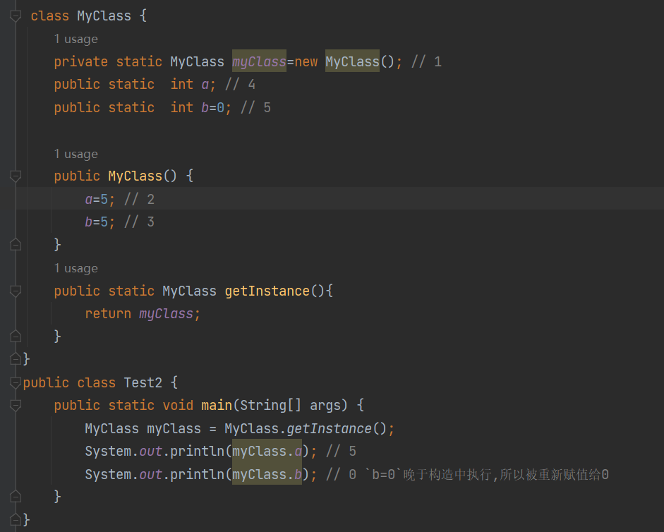

### 双亲委派机制


#### 一、原理


```
    protected Class<?> loadClass(String name, boolean resolve)
        throws ClassNotFoundException
    {
        synchronized (getClassLoadingLock(name)) {
            // First, check if the class has already been loaded
            Class<?> c = findLoadedClass(name);
            if (c == null) {
                long t0 = System.nanoTime();
                try {
                    if (parent != null) {
                        c = parent.loadClass(name, false);
                    } else {
                        c = findBootstrapClassOrNull(name);
                    }
                } catch (ClassNotFoundException e) {
                    // ClassNotFoundException thrown if class not found
                    // from the non-null parent class loader
                }

                if (c == null) {
                    // If still not found, then invoke findClass in order
                    // to find the class.
                    long t1 = System.nanoTime();
                    c = findClass(name);

                    // this is the defining class loader; record the stats
                    sun.misc.PerfCounter.getParentDelegationTime().addTime(t1 - t0);
                    sun.misc.PerfCounter.getFindClassTime().addElapsedTimeFrom(t1);
                    sun.misc.PerfCounter.getFindClasses().increment();
                }
            }
            if (resolve) {
                resolveClass(c);
            }
            return c;
        }
    }
```


#### 二、对应加载路径

<JAVA_HOME>\lib  rt.jar、tools.jar

<JAVA_HOME>\lib\ext

负责加载用户类路径（ClassPath）上所有的类库

#### 三、好处

双亲委派模型的工作过程是：如果一个类加载器收到了类加载的请求，它首先不会自己去尝试加载这个类，而是把**这个请求委派给父类加载器去完成**，每一个层次的类加载器都是如此，因此所有的加载请求最终都应该传送到最顶层的启动类加载器中，只有当**父加载器反馈自己无法完成这个加载请求**（它的搜索范围中没有找到所需的类）时，**子加载器才会尝试自己去完成加载**。

安全性：保护核心类(Obejct等)正常加载，Object类在程序的各种类加载器环境中都能够保证是同一个类，保证程序正常执行。越基础的类由越上层的加载器进行加载

保证唯一：只有同个类加载器加载的才会是同个类

#### 四、破坏双亲委派机制

ServiceLoader，有基础类型又要调用回用户的代码，而引导类加载器又不认识和不会加载这些代码，ClassPath下的JNDI服务提供者接口（Service Provider Interface，SPI）的代码。JNDI服务使用这个**线程上下文类加载器**去加载所需的SPI服务代码，这是一种**父类加载器**去**请求子类加载器**完成类加载的行为，打破了双亲委派机制

程序动态性：代码热替换（HotSwap）、模块热部署（Hot Deployment）


##### 1 第一次破坏双亲委派机制

双亲委派模型的第一次“被破坏”其实发生在双亲委派模型出现之前——即 JDK1.2 面世以前的“远古”时代。

由于双亲委派模型在 JDK 1.2 之后才被引入，但是类加载器的概念和抽象类 java.lang.ClassLoader 则在 Java 的第一个版本中就已经存在，面对**已经存在的用户自定义类加载器的代码**，Java 设计者们引入双亲委派模型时不得不做出一些妥协，为了兼容这些已有代码，无法再以技术手段避免 loadClass() 被子类覆盖的可能性，只能在 JDK1.2 之后的 java.lang.ClassLoader 中添加一个新的 protected 方法 findClass()，并引导用户编写的类加载逻辑时尽可能去重写这个方法，而不是在 loadClass() 中编写代码。loadClass() 方法，双亲委派的具体逻辑就实现在这里面，**按照 loadClass() 方法的逻辑**，如果**父类加载失败**，会**自动调用自己的 findClass() 方法来完成加载**，这样既不影响用户按照自己的意愿去加载类，又可以保证新写出来的类加载器是符合双亲委派规则的。

##### 2 第二次破坏双亲委派机制：线程上下文类加载器

双亲委派模型的第二次“被破坏”是由这个模型自身的缺陷导致的，双亲委派很好地解决了各个类加载器协作时基础类型的一致性问题（越基础的类由越上层的加载器进行加载），基础类型之所以被称为“基础”，是因为它们总是作为被用户代码继承、调用的 API 存在，但程序设计往往没有绝对不变的完美规则，如果有**基础类型又要调用回用户的代码**，那该怎么办呢？

这并非是不可能出现的事情，一个典型的例子便是 JNDI 服务，**JNDI** 现在已经是 Java 的标准服务，它的代码**由启动类加载器来完成加载**（在 JDK 1.3 时加入到 rt.jar 的），肯定属于Java中很基础的类型了。但 JNDI 存在的目的就是对资源进行查找和集中管理，它**需要调用由其他厂商实现并部署在应用程序的 ClassPath 下的 JNDI 服务提供者接口（Service Provider Interface，SPI）的代码**，现在问题来了，启动类加载器是**绝不可能认识、加载这些代码**的，那该怎么办？

```
SPI：在 Java 平台中，通常把核心类 rt.jar 中提供外部服务、可由应用层自行实现的接口称为 SPI 。
```

为了解决这个困境，Java 的设计团队只好引入了一个不太优雅的设计：**线程上下文类加载器**。这个类加载器可以通过 java.lang.Thread 类的 **setContextClassLoader() 方法进行设置**，如果创建线程时还未设置，它将会从父线程中继承一个，如果在应用程序的全局范围内都没有设置过的话，那这个类加载器默认就是应用程序类加载器。

有了线程上下文类加载器，程序就可以做一些“舞弊”的事情了。JNDI 服务**使用这个线程上下文类加载器去加载所需的 SPI 服务代码**。这是一种**父类加载器**去**请求子类加载器**完成**类加载**的行为，这种行为实际上是打通了双亲委派模型的层次结构来逆向使用类加载器，已经**违背了双亲委派模型的一般性原则**，但也是无可奈何的事情。 例如 JNDI、JDBC、JCE、JAXB 和 JBI 等。不过，当 SPI 的服务提供者多于一个的时候，代码就只能根据具体提供者的类型来硬编码判断，为了消除这种极不优雅的实现方式，在 JDK6 时，JDK 提供了 java.util.ServiceLoader 类，以 META-INF/services 中的配置信息，辅以责任链模式，这才算是给 SPI 的加载提供了一种相对合理的解决方案。


默认上下文加载器就是应用类加载器，这样以上下文加载器为中介，使得启动类加载器中的代码也可以访问应用类加载器中的类。

##### 3 第三次破坏双亲委派机制

双亲委派模型的第三次“被破坏”是由于用户对程序动态性的追求而导致的。如：**代码热替换(Hot Swap)、模块热部署**(Hot Deployment)等。

IBM 公司主导的 JSR-291(即 OSGiR4.2 ) 实现**模块化热部署**的关键是它自定义的类加载器机制的实现，每一个程序模块(OSGi 中称为 Bundle )都有一个自己的类加载器，当需要更换一个 Bundle 时，就把 Bundle 连同类加载器一起换掉以实现代码的热替换。在OSGi 环境下，类加载器不再是双亲委派模型推荐的树状结构，而是进一步发展为更加**复杂的网状结构**。

当收到类加载请求时，OSGi 将按照下面的顺序进行类搜索：

1）**将以 java.* 开头的类，委派给父类加载器加载。**

**2）否则，将委派列表名单内的类，委派给父类加载器加载。**

3）否则，将 Import 列表中的类，**委派给 Export 这个类的 Bundle 的类加载器加载**。

4）否则，查找当前 **Bundle 的 ClassPath**，使用自己的类加载器加载。

5）否则，查找类是否在自己的 **Fragment Bundle** 中，如果在，则委派给 Fragment Bundle 的类加载器加载。

6）否则，查找 Dynamic Import 列表的 Bundle，委派给对应 Bundle 的类加载器加载。

7）否则，类查找失败。

说明：只有开头两点仍然符合双亲委派模型的原则，其余的类查找都是在**平级的类加载器中进行的**。

小结：这里，我们使用了“被破坏”这个词来形容上述不符合双亲委派模型原则的行为，但这里“被破坏”并不一定是带有贬义的。只要有明确的目的和充分的理由，突破旧有原则无疑是一种创新。

正如：OSGi 中的类加载器的设计不符合传统的双亲委派的类加载器架构，且业界对其为了实现热部署而带来的额外的高复杂度还存在不少争议，但对这方面有了解的技术人员基本还是能达成一个共识，认为 OSGi 中对类加载器的运用是值得学习的，完全弄懂了 OSGi 的实现，就算是掌握了类加载器的精粹。

##### 4、tomcat自定义类加载器部署多个war包

######  为什么要打破双亲委派机制？

上面有讲到通过双亲委派机制，可以避免类被重复加载，相同包路径下的同名类不会被重复加载。但在某些场景下我们需要有这样的重复加载，比如我们使用tomcat容器部署java的war包时，若一个tomcat下部署**多个war包**，**两个war包使用的第三方库版本不同**，若使用**默认的双亲委派机制，则同路径下的类只会被加载一次**，那么就只会加载一个版本的类，因为版本差异，完全有可能**导致某个war包出现异常**。通过**打破双亲委派机制，分别加载不同版本的类给不同的war包使用，以避免因版本差异产生的异常。**

###### 自定义类加载器

除了以上三个类加载器，我们还可以自定义类加载器。只需要继承ClassLoader类即可。通过源码可以看到ClassLoader的主要调用loadClass方法与findClass()方法。因此我们自定义类加载器只需要重写这两个方法即可。而findClass我们跟踪代码发现是空实现，其底层是通过类加载器加载文件的字节码然后调用defineClass()方法。下面就来看看一个简单的自定义类加载器实现。


​       


```java
package com.zj.study.jvm;

import java.io.FileInputStream;
import java.lang.reflect.Method;

/**

- Description:
- Created by zoujian ON 2021/11/15.
*/
public class MyClassLoader2 extends ClassLoader{
  private String classPath;
  public MyClassLoader2(String classPath){
    this.classPath = classPath;
	}

public static void main(String[] args) throws Exception{
    MyClassLoader2 myClassLoader2 = new MyClassLoader2("d:/tmp");
    Class clazz = myClassLoader2.findClass("com.zj.study.User");
    Object obj = clazz.newInstance();
    Method method = clazz.getMethod("call", null);
    method.invoke(obj,null);
 
}
 
public byte[] getClassByte(String name) throws Exception{
    name = name.replaceAll("\\.", "/");
    FileInputStream fis = new FileInputStream(classPath + "/" + name + ".class");
    int lenth = fis.available();
    byte[] classByte = new byte[lenth];
    fis.read(classByte, 0, lenth);
 
    return classByte;
}
 
protected Class<?> findClass(String name) throws ClassNotFoundException{
    try{
        byte[] classByte = getClassByte(name);
        return defineClass(name, classByte, 0, classByte.length );
    }catch (Exception ee){
        ee.printStackTrace();
    }
    return null;
}
}
```


​        上面的代码块中主要实现了两个方法，getClassByte方法主要是通过类路径把类加载成字节流。findClass方法通过加载的类字节流通过defineClass方法加载类。main方法中通过加载好的类利用反射调用了提前编译好放在d盘下的user类的call方法。至此一个简单地自定义类加载器就实现好了。

        下面看看打破双亲委派机制的自定义加载器，再看实现之前，先看看ClassLoader的loadClass方法。


               protected Class<?> loadClass(String name, boolean resolve)
            throws ClassNotFoundException
        {
            synchronized (getClassLoadingLock(name)) {
                // First, check if the class has already been loaded
                Class<?> c = findLoadedClass(name);
                if (c == null) {
                    long t0 = System.nanoTime();
                    try {
                        if (parent != null) {
                            c = parent.loadClass(name, false);
                        } else {
                            c = findBootstrapClassOrNull(name);
                        }
                    } catch (ClassNotFoundException e) {
                        // ClassNotFoundException thrown if class not found
                        // from the non-null parent class loader
                    }
               if (c == null) {
                    // If still not found, then invoke findClass in order
                    // to find the class.
                    long t1 = System.nanoTime();
                    c = findClass(name);
     
                    // this is the defining class loader; record the stats
                    sun.misc.PerfCounter.getParentDelegationTime().addTime(t1 - t0);
                    sun.misc.PerfCounter.getFindClassTime().addElapsedTimeFrom(t1);
                    sun.misc.PerfCounter.getFindClasses().increment();
                }
            }
            if (resolve) {
                resolveClass(c);
            }
            return c;
        }
    }
        以上代码 截取自jdk1.8，我们可以看到里面对parent进行了判断，如果不为空则调用父类的loadclass()方法。否则就调用引导类加载器进行加载。这里的判断就是我们打破双亲委派机制的突破口。对于我们不需要进行双亲委派的类，我们可以不委托父类加载，而自行加载。废话不说，直接上demo：


​        


    package com.zj.study.jvm;
    
    import java.io.FileInputStream;
    import java.lang.reflect.Method;
    
    /**
    
    - Description:
    - Created by zoujian ON 2021/11/12.
    */
    public class MyClassLoader1 extends ClassLoader{
    
    private String classPath;
     
    public MyClassLoader1(String classPath){
        this.classPath = classPath;
    }
     
    private byte[] loadByte(String name) throws Exception{
        name = name.replaceAll("\\.", "/");
        FileInputStream fis = new FileInputStream(classPath + "/" + name + ".class");
        int length = fis.available();
        byte[] classData = new byte[length];
        fis.read(classData);
        fis.close();
        return classData;
    }
     
    protected Class<?> findClass(String name) throws ClassNotFoundException{
        try{
            byte[] classData = loadByte(name);
            return defineClass(name, classData, 0, classData.length);
        }catch (Exception ee){
            ee.printStackTrace();
        }
        return null;
    }
     
    protected Class<?> loadClass(String name, boolean resolve)
            throws ClassNotFoundException
    {
        synchronized (getClassLoadingLock(name)) {
            // First, check if the class has already been loaded
            Class<?> c = findLoadedClass(name);
            if(c == null){
                long t1 = System.nanoTime();
                if(!name.startsWith("com.zj.study")){
                   c = this.getParent().loadClass(name) ;
                }else{
                    c = this.findClass(name);
                }
                // this is the defining class loader; record the stats
                sun.misc.PerfCounter.getFindClassTime().addElapsedTimeFrom(t1);
                sun.misc.PerfCounter.getFindClasses().increment();
            }
     
            if (resolve) {
                resolveClass(c);
            }
     
            return c;
        }
    }
    public static void main(String[] args) throws Exception{
        MyClassLoader1 classLoader = new MyClassLoader1("d:/tmp");
        Class clazz = classLoader.loadClass("com.zj.study.User");
        Object obj = clazz.newInstance();
        Method method = clazz.getDeclaredMethod("call", null);
        method.invoke(obj, null);
        System.out.println(clazz.getClassLoader().getClass().getName());
    }
    }


​        该代码片段中，main、loadByte以及findClass都与自定义加载器一样。区别就是重新了父类的loadClass方法。在进行父加载器判断的时候，我们做了一些逻辑变更，如果是com.zj.study这个包下的类，那么不走双亲委派机制，而其它的类依然走双亲委派机制。注意：由于每个java类都有一个基础父类Object，而这些类只能通过双亲委派机制加载。

##### 热替换的实现

热替换是指在程序的运行过程中，不停止服务，只通过替换程序文件来修改程序的行为。热替换的关键需求在于服务不能中断，修改必须立即表现正在运行的系统之中。基本上大部分脚本语言都是天生支持热替换的，比如：PHP，只要替换了 PHP 源文件，这种改动就会立即生效，而无需重启 Web 服务器。

但对 Java 来说，热替换并非天生就支持，如果一个类已经加载到系统中，通过修改类文件，并无法让系统再来加载并重定义这个类。因此，在 Java 中实现这一功能的一个可行的方法就是灵活运用 ClassLoader 。

注意：由不同 ClassLoader 加载的同名类属于不同的类型，不能相互转换和兼容。即两个不同的 ClassLoader 加载同一个类，在虚拟机内部，会认为这2个类是完全不同的。

根据这个特点，可以用来模拟热替换的实现，基本思路如下图所示。


### 运行时数据区

#### 程序计数器

用来存储指令指向下一条的地址，也即将要执行的指令代码。由执行引擎读取下一条指令。


它程序控制流的指示器，控制分支、异常处理等，存储当前指令的位置，大小很小可忽略不计。没有GC（垃圾回收）和OOM（内存溢出）


**面试题一：使用PC寄存器存储字节码指令地址有什么用**

1. 因为CPU需要不停地切换各个线程，这时候切换回来以后，就得知道从哪开始继续执行。


2. JVM的字节码解释器就需要通过改变PC寄存器存储的值来明确下一条应该执行什么样的字节码指令

**面试题二：PC寄存器为什么会被设定为线程私有**

1. 多线程在特定的时间段内只会执行线程的某一个方法，CPU会不停的做任务切换，这样必然导致经常中断或恢复，如何保证分毫无差？为了能够准确的记录各个线程正在执行的当前字节码地址，最好的方法自然是为每一个线程都分配一个PC寄存器，这样一来各个线程之间便可以进行独立计算，从而不会出现相互干扰的情况。
2. 由于CPU的时间片轮限制，众多线程在并发执行过程中，任何一个确定的时刻，一个处理器或者多核处理器的内核，只会执行某个线程中的一条指令
3. 这样必然导致经常中断或恢复，如何保证分毫无差？每个线程在创建后，都会产生自己的程序计数器和栈帧，程序计数器在各个线程之间互不影响。


#### 虚拟机栈

一个线程对应一个虚拟机栈，栈帧对应一个方法


**面试题：栈可能出现的问题**


##### 局部变量表


##### 操作数栈


栈顶缓存技术


##### 动态链接

指向运行时常量池的方法引用

为什么要常量池？使用方便，符号引用就行

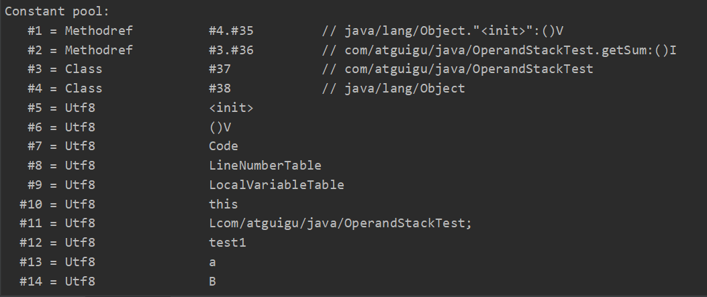


##### 方法返回地址


虚拟机栈五道面试题


#### 堆


##### 堆的核心概述：内存细分


##### 堆空间大小的设置


##### 年轻代与老年代及参数占比


##### 对象分配过程


##### TLAB（Thread Local Allocation Buffer线程私有）

所以堆空间的内容不一定都是共享的


##### 堆空间的参数设置


##### 栈上分配


##### 代码优化之标量替换


#### 方法区

##### 存放内容

**类元信息，常量，静态变量，即时编译代码缓存**。运行时常量池（类元信息，常量池表，存放编译器产生的字面量和符号引用）

字符串常量池是存在堆中的


##### 栈、堆、方法区的交互关系


##### 方法区概述


##### 设置方法区内存的大小


##### 方法区内部结构


##### 常量池


##### 运行时常量池

存放编译器产生的各种**字面量**和符号引用（转为**真实地址**）

相对于Class文件常量池，运行时常量池具有动态性


 


##### 指令执行过程


##### 方法区的演进细节


##### 永久代为什么要被元空间替换

比较难以管理，大小难以设置（可能动态加载大量的类），容易OOM


##### 字符串常量池为什么要调整


##### 方法区的垃圾回收


##### 常见面试题


### 对象的实例化


##### 直接内存


### 执行引擎

JVM将字节码装在到其内部成字节码指令（仅被JVM识别），再由**执行引擎将字节码指令翻译成本地机器语言**


#### 解释器


### **GC** **Roots**


### **对象的finalize机制**


### CMS


### G1

全能垃圾回收期，大内存，多CPU


局部就是赋值算法，整体就是整理算法

记忆集和卡表，避免跨代引用的全表扫描


1、年轻代并行回收（STW，回收eden园区和survivor区）

2、老年代并发标记（堆达到45%）,会触发yGC

3、混合回收（回收整个年轻代和部分老年代）

4、兜底的Full GC


年轻代GC

GCroot

rset

处理rser

复制存活对象

处理引用，空region记录到空闲链表中


MIX GC


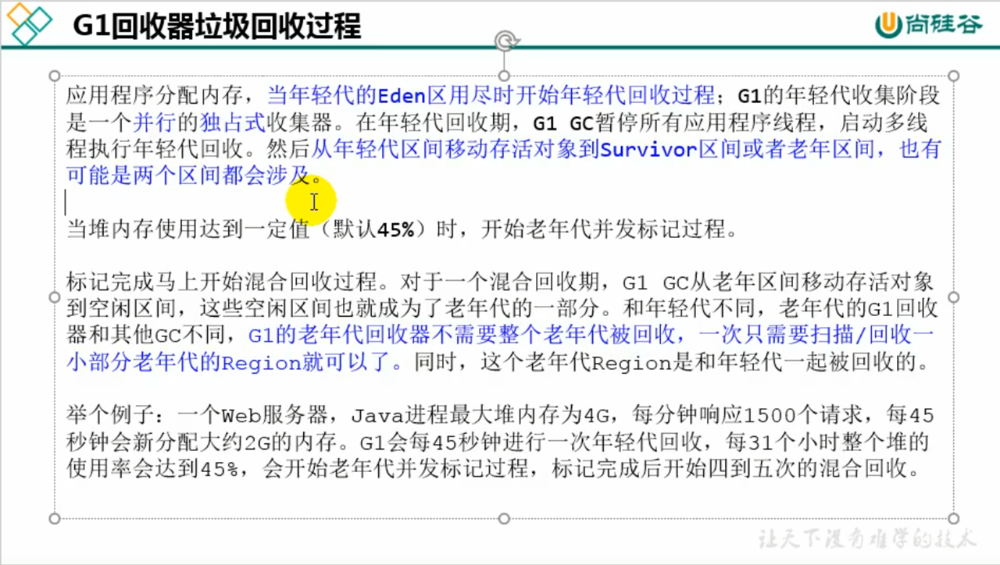


### OOM

1、首先通过内存映像分析工具对Dump出来的堆转储快照进行分析，确认内存中导致OOM的对象是否是必要的，还需要分清楚是出现了内存泄露还是内存溢出。
2、如果是内存泄露，可进一步通过工具查看泄露对象到GC roots的引用链，找到泄露对象是通过怎样的引用路径、与哪些GC roots相关联，才导致垃圾收集器无法回收他们，根据泄露对象的类型信息以及它到GC roots引用链的信息，一般可以比较准确的定位到这些对象创建的位置，进而找出产生泄露的代码的具体位置。
3、如果不是内存泄露，则说明内存中的兑现是必须存活的，那就应该检查Java虚拟机的堆参数(-Xmx与-Xms)设置，与机器的内存对比，看看是否还有向上调整的空间，然后在从代码上检查是否存在某些对象生命周期过长、持有状态时间过长、存储结构设计不合理等情况，尽量尽量减少程序运行期的内存消耗。
堆的常用参数：

-Xmx:堆的最大值参数

-Xms:堆的最小值参数

-XX:+HeapDumpOnoutOf-MemoryError:可以让虚拟机在出现内存溢出异常时Dump出当前的内存堆转储快照便于后面进行分析。	

https://blog.csdn.net/weixin_41010294/article/details/104009722

```
// 1，写循环的时候，尽量考虑考虑次数是否明确，终止条件是否确定，小心死循环，小心死循环，小心死循环
// 2，定位OOM时，不用慌，工具其实替我们做了大量的工作，但你要会使用，我只是刚用了下皮毛
// 3，review的时候，多注意可能导致死循环的地方
// 4，OOM的定位，还有别的很强大的工具，需要去多接触
```


## 操作系统

### C读取流

1、fread：从给定输入流stream读取最多count个对象到数组buffer中（相当于以对每个对象调用size次fgetc），把buffer当作unsigned char数组并顺序保存结果。流的文件位置指示器前进读取的字节数。
 2、gets：从stdin流中读取字符串，直至接受到换行符或EOF时停止，并将读取的结果存放在buffer指针所指向的字符数组中。换行符不作为读取串的内容，读取的换行符被转换为‘\0’空字符，并由此来结束字符串。
 3、getchar：读入函数的一种。它从标准输入里读取下一个字符，相当于getc(stdin)。返回类型为int型，为用户输入的ASCII码或EOF。
 4、pread：**带偏移量地原子的从文件中读取数据**
 5、getline：从输入流中读取一行字符，读到终止符时会将'\0'存入结果缓冲区中，作为输入的终止。终止符可以是默认的终止符，也可以是定义的终止符。
 6、scanf：从标准输入流stdin(标准输入设备，一般指向键盘)中读内容的通用子程序，可以说明的格式读入多个字符，并保存在对应地址的变量中。   


### 进程P0和P1互斥进入且不饥饿

这是**皮特森算法的实际实现**，保证进入临界区的进程合理安全。该算法为了防止两个进程为进入临界区而无限期等待，设置变量turn，表示不允许进入临界区的编号，每个进程在先设置自己标志后再设置turn标志，不允许另一个进程进入，这时，再同时检测另一个进程状态标志和不允许进入表示，这样可以保证当两个进程同时要求进入临界区时只允许一个进程进入临界区。保存的是较晚的一次赋值，则较晚的进程等待，较早的进程进入。先到先入，后到等待，从而完成临界区访问的要求。 

  其实这里可以想象为两个人进门，每个人进门前都会和对方客套一句“你走先”。如果进门时没别人，就当和空气说句废话，然后大步登门入室；如果两人同时进门，就互相请先，但各自只客套一次，所以先客套的人请完对方，就等着对方请自己，然后光明正大地进门。


### fork子进程

 fork() 是一个分叉函数，返回值： 若成功调用一次则返回两个值，子进程返回 0， 父进程返回子进程 ID；否则，出错返回 -1。


总共有三行有fork函数，这里用第一行、第二、第三行表述。

（1）第一行的fork函数将为main函数创建一个子进程，此时总共有2个进程。

（2）第二行的第一个fork函数将为上述的2个进程创建子进程，此时总共4个进程。

（3）由于子进程的返回值是0，所以第二行的第二个fork函数只有2个父进程创建了2个子进程，此时总共有6个进程；第二行第三个fork函数同理，也只有2个父进程创建的子进程，此时总共有8个进程。

（4）第三行的第一个fork函数将为上述8个进程都创建子进程，此时总共有16个进程。

（5）第三行的第二个fork函数中8个父进程将不能创建子进程（||短路特性），而（4）中的8个子进程因为返回值都是0而再创建8个进程，有多了8个进程，此时总共有24个进程。

https://blog.csdn.net/Zhouzi_heng/article/details/124984161


### linux热启动


### 设备管理 -- I/O系统

---- 计算机系统的一个重要组成部分是I/O系统。在该系统中包括有用于实现***\*信息输入、输出\****和***\*存储功能\****的***\*设备\****和相应的***\*设备控制器，\****

在有的大、中型机中，还有***\*I/O通道\****或***\*I/O处理机\****。设备管理的对象主要是**I/O设备**，还可能要涉及到**设备控制器**和**I/O通道**。

---- 设备管理的***\*基本任务\****是完成用户**提出的I/O请求**，**提高I/O速率**以及**提高I/O设备的利用率**。

---- 设备管理的***\*主要功能\****有：**缓冲区管理**、**设备分配**、**设备处理**、**虚拟设备**及**实现设备独立性**等。

由于I/O设备不仅种类繁多，而且它们的特性和操作方式往往相差甚大，是OS中**最繁杂**且**与硬件最紧密相关**的部分。

***\*1、I/O设备的类型\****

#### 1）按设备的使用特性分类

---- 第一类是***\*存储设备。\****也称**外存**或后备存储器、**辅助存储器**。存取速度较内存慢，但容量大，价格便宜。

---- 第二类是***\*输入/输出设备\****。又具体可分为**输入设备**、**输出设备**和**交互式设备**。***\*输入设备\****用来***\*接收外部信息\****，如键盘、鼠标、扫描仪等。

***\*输出设备\****是用于将计算机***\*加工处理后的信息\****送向外部的设备，如打印机、显示器等。***\*交互式设备\****则是集成上述两类设备，利用输入设备

接收用户命令信息，并通过输出设备（主要是显示器）同步显示用户命令以及命令执行的结果。

#### 2）按**传输速率**分类

---- ***\*低速设备\****。传输速率为**每秒钟几个字节**至数百个字节的一类设备。有键盘、鼠标等。

---- ***\*中速设备\****。传输速率在**每秒钟数千个字节**至数十万个字节的一类设备。有行式打印机、激光打印机等。

---- ***\*高速设备\****。十几兆到千兆字节。磁带机、磁盘机、光盘机等。

#### 3）按信息交换的单位分类

---- 第一类是***\*块设备\****（Block Device），这类设备用于存储信息。信息的存取是以***\*数据块\****为单位，属于***\*有结构设备\****。典型的块设备是***\*磁盘\****，

每个盘块的大小是512B～4KB。磁盘设备的***\*基本特征\****是其**传输速率较高**，通常每秒钟为几兆位；另一特征是***\*可寻址\****，即对它可**随机地读/写**

任一块；此外，磁盘设备的I/O常采用***\*DMA方式\****。

---- 第二类是***\*字符设备\****（Character Device），用于数据的输入和输出。其存取的基本单位是**字符**，故称为字符设备，属于无结构类型。

字符设备的基本特征是其**传输速率较低**，通常为几个字节至数千字节；另一特征是**不可寻址**，即输入/输出时不能指定数据的输入源地址及

输出的目标地址，字符设备在输入/输出时，常采用***\*中断驱动\****方式。

#### 4）按设备的共享属性分类

---- **独占设备**。指在一段时间内只**允许一个用户（进程）访问的设备**，即**临界资源**。因而，对多个并发进程而言，应互斥地访问这类设备。

系统一旦把这类设备分配给了某进程后，便由该进程独占，直至用完释放。***\*大多数低速设备都属于独占设备\****。

---- ***\*共享设备\****。这是指在一段时间内***\*允许多个进程同时访问的设备\****。当然，对于每一时刻而言，该类设备仍然只允许一个进程访问。

共享设备必须是**可寻址的和可随机访问的设备**。***\*典型的共享设备是磁盘。\****共享设备不仅可获得良好的设备利用率，而且它也是实现***\*文件系统\****

和***\*数据库系统\****的物质基础。

---- ***\*虚拟设备\****。这是指通过虚拟技术将一台独占设备变换为若干台逻辑设备，供若干个用户（进程）同时使用。

#### 2、设备与控制器之间的接口

-- 通常，设备并不是直接与CPU进行通信，而是与设备控制器通信，因此，在I/O设备中应含有与设备控制器之间的接口。

接口中有三种类型的信号：（见下图），各对应一条信号线。

  

1）数据信号线。这类信号线用于在设备和设备控制器之间***\*传送数据信号\****。对输入设备而言，由外界输入的信号经转换器转换后所形成的数据，

通常先送入缓冲器中，当数据量达到一定的比特（字符）数后，再从缓冲器中通过一组数据信号线传送给设备控制器。对输出设备而言，则是

将从设备控制器经过信号线传送来的一批数据先暂存于缓冲器中，经转换器做适当转换后，再逐个字符地输出。

2）控制信号线。这是作为由设备控制器向I/O设备***\*发送控制信号\****时的通路。该信号规定了***\*设备将要执行的操作\****，如读操作（指由设备向控制器

传送数据）或写操作（设备从控制器接收数据），或执行磁头移动等操作。

3）状态信号线。用于传送指示***\*设备当前状态\****的信号。设备的当前状态有正在读（或写），设备已读/写完成，并准备好新的数据传送。

### MBR

MBR，全称为Master Boot Record，即硬盘的**主引导记录**，它**位于整个硬盘的0磁道0柱面1扇区**（所以**不需要开始标记**），其主要对硬盘进行了组织，是在驱动器最前端的一段引导扇区。

MBR是不属于任何一个操作系统，也不能用操作系统提供的磁盘操作命令来读取它，但可以通过命令来修改和重写。

#### 一、四大组成部分

1、**主引导程序**（偏移地址0000H--0088H），它负责从活动分区中装载，并运行系统引导程序。

2、**出错信息数据区**，偏移地址0089H--00E1H为出错信息，00E2H--01BDH全为0字节。

3、**分区表**（DPT,Disk Partition Table）含4个分区项，偏移地址01BEH--01FDH,每个分区表项长16个字节，共64字节为分区项1、分区项2、分区项3、分区项4。

4、**结束标志字**，偏移地址01FE--01FF的2个字节值为结束标志55AA,称为“魔数”（magic number）。如果该标志错误系统就不能启动。

#### 二、MBR的修复

BR在某些情况下，如病毒或者分区操作不当会引起MBR代码段的损坏，表现的现象就是电脑启动时，屏幕出现黑底一个或几个无意义的字母闪光标或无任何提示闪光标。这种情况在确认硬盘无物理故障后，可以使用一些简单方法进行恢复。

**Dos命令**

使用任意启动盘启动到MSDOS提示符，键入命令：

fdisk /mbr

**Diskgenius**

用启动盘，无论dos版或者pe版均可，启动diskgenius，然后选择菜单“硬盘”-“重建主引导记录”，为避免病毒残留，还可执行一次”硬盘“-”清除保留扇区“

**Windows xp命令**

xp之下，需要安装tool kit附加工具，为系统增加一个fixmbr命令行工具。执行命令之前，先将故障硬盘挂载到一台好的电脑，或者使用xp安装盘启动电脑，然后执行命令：

fixmbr \Device\HardDisk0 此处的0或其他数字需先通过diskpart工具的list driver进行查找。

**Windows 7命令**

修复方式同xp，只是命令换成bootrec /fixmbr

### 子进程

进程得到的是除了代码段是与父进程共享以外，**其他所有的都是得到父进程的一个副本**，子进程的所有资源都继承父进程，得到父进程资源的副本，子进程**可获得父进程的所有堆和栈的数据**，**但二者并不共享地址空间**。两个是单独的进程，继承了以后二者就没有什么关联了，子进程单独运行。

父进程没了，子进程会托管到1号进程中

### 指令周期

指令周期是取出一条指令并执行这条指令的时间

### 线程调度


下列关于线程调度的叙述中，错误的是：( D )

A. 调用线程的sleep()方法,可以使比当前线程优先级低的线程获得运行机会

B. 调用线程的yield()方法,只会使与当前线程相同优先级的线程获得运行机会

C. 当有比当前线程优先级高的线程出现时,高优先级的线程将抢占CPU并运行

D. 具有相同优先级的多个线程的调度一定是分时的.

E.一个线程由于某些原因进入阻塞状态，会放弃CPU

F.分时调度模型是让所有线程轮流获得CPU使用权

解析：

**yield()暂时交出cpu控制权，从running状态转为runnalbe状态**，但是仍有可能被调度，sleep()线程指定休眠一段时间

wait()在其他线程调用此对象的notify()、notifyAll()方法时才能继续执行

### wait()&sleep()&yeild()&join()

1.sleep()方法会给其他线程运行的机会,而**不管其他线程的优先级,**因此会给较低优先级的线程运行的机会;

yeild()方法**只会给优先级相同的或者比自己高的线程运行**的机会

2.sleep()方法声明抛出**InterruptionException**异常,而yeild()方法没有声明抛出任何异常

3.sleep()方法比yeild()方法具有更高的可移植性

4.sleep()方法使线程进入**阻塞**状态yeild()方法使线程进入**就绪**状态当前运行的线程可以调用另一个线程的join()方法,当前运行的线程将转到阻塞状态直到另一个线程运行结束,它才会恢复运行

join()有两种形式:public void join()和public void join(long timeout)可以设置阻塞的时间

sleep()方法进入阻塞状态，当有两个线程（线程1和线程2），线程1的优先级比线程2的优先级高，线程1sleep()则线程2可以获得运行机会

当有比当前线程优先级高的线程出现时，高优先级会抢占CPU并运行，yield()方法，暂停一段时间，且这段时间不确定，它会使与当前线程相同优先级的线程获得运行机会

具有相同优先级的多个线程调度不一定是分时的，**多核CPU可能同时调**

### CPU寻址空间

 前言：
  我们都熟知**32为的操作系统的寻址空间的大小为4G**(2^32)，因此我们安装一个32位系统在配置4g的内存条，这似乎非常完美。但是当我们打开任务管理器发现我们的物理内存只有3g左右。

#### 寻址空间：

  寻址空间一般指的是CPU对于内存寻址的能力。通俗地讲，就是**最多能用到多少内存**的一个问题。数据在存储器（RAM）中存放是有规律的，CPU在运算的时间需要把数据取出来，就必须 需要知道数据储存在哪里，这时我们需要挨家挨户地找（也就是在其能够寻址的空间进行查找），这就叫做寻址。

但是**如果地址超出了CPU的寻址范围，CPU就无法找到数据了**。CPU最大查找多大范围的地址叫做寻址能力，CPU的寻址能力以字节为单位。

  那么我们便可以推出，内存的容量并非需要无限的增大，虽然内存容量越大，处理数据的能力也就越强，但是它要受到系统结构，硬件设计，制造成本等多方面因素的影响。最直接的因素就是：系统地址总线的地址寄存器的宽度（位数）。

  计算机的**寻找范围由总线宽度（处理器的地址总线的位数）决定**的，也可以理解为cpu寄存器位数，这二者一般是匹配的。

386及386往上的地址总线和地址寄存器的**宽度为32位**的，**CPU的寻址能力2^32 = 4096M字节= 4G字节**。

所以呢，早期的CPU即使有很大的内存也不能得到利用，而对于现在的PⅡ级的CPU，其寻址能力已经远远超过目前的内存容量。

  所以：地址总线为N位（N通常为8的整数倍；也说N根数据总线 ）的CPU寻址范围是2的N次方字节，即2^N(B)。

16，32，64位通常指的是什么？
从CPU的发展史来看，从前的8位到现在的64位。

8位就是CPU在一个时钟周期内可以并行处理8位二进制字符0或1，那么16和64以此类推。

从计算的角度理论上来讲64位比32位快一半。但是因为电脑是软硬件相配合才能发挥最佳性能的，所以操作系统也必须从32位的到64位的，而且硬件驱动也必须是64位的。我们在64位CPU的计算机中安装64位的操作系统的32位硬件驱动是不能用的。如果64CPU装32的操作系统的话，那性能不会有明显提升。

为什么是2的N次方，而不是其他数的N次方
  因为**计算机采用二进制计算的，一根地址总线，我们可想而知他最多能对2个存储单元进行寻址**。因为在任何的二进制计算机中，所有物理元件只有0，1两种状态，所以对应这个例子，我们假设已经把这根唯一的地址总线与两个储存单元a和b连上了，那么究竟怎么确定何时读a何时读b？当地址线上的电压是高电压时我们读a，相反是低电压时，我们读b。如此一来，一根地址总线只能对2个存储单元进行寻址，以此类推那么2根就是对应4个储存单元，所以N根就是对应2^N个储存单元。

  一根地址总线是怎么连接到两个存储单元的？？

什么是存储单元
  存储单元一般具有储存数据和读写数据的动能，一般以8位二进制作为一个储存单元，也就是一个字节。每个单元有一个地址，是一个整数编码，可以表示为二进制数。

什么是物理内存
  我们都知道32位的操作系统可以寻找4G大小的内存空间。因此我们安装一个32位系统在配置4G的内存条，看起来是一个完美的方案。可是，当我们安装好系统配好内存，打开任务管理器后，发现我们的物理内存只有3G左右，这是怎么回事呢？

  物理内存：在计算机体系中，物理内存不仅仅包括装在主板上的内存条（RAM），还包括**主板BIOS芯片的ROM**，**显卡上的显存（RAM）和BIOS(ROM)**,以及各种设备上的储存空间。所以说我们的实际的物理内存空间达不到4G，也就是我们那1G空间是给一些**输入输出缓存器等的不可访问的区域**。

### DMA

传统的磁盘IO，整个数据的传输过程，都要需要 CPU 亲自参与搬运数据的过程，而且这个过程，CPU 是不能做其他事情的。

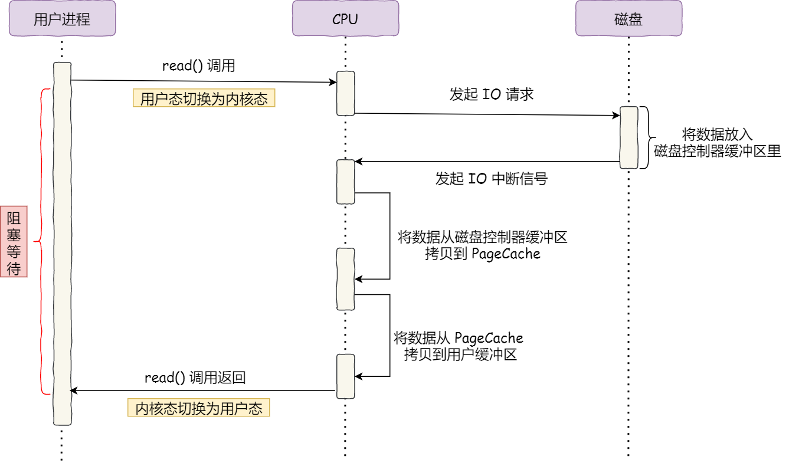


DMA（直接内存访问）

在进行 **I/O 设备和内存的数据传输的时候，数据搬运的工作全部交给 DMA 控制器**，而 CPU 不再参与任何与数据搬运相关的事情，这样 **CPU 就可以去处理别的事务**。

DMA就是**代替CPU完成IO设备到内核缓存区的拷贝**


- 用户进程调用 read 方法，向操作系统发出 I/O 请求，请求读取数据到自己的内存缓冲区中，进程进入阻塞状态；
- 操作系统收到请求后，进一步将 I/O 请求发送 DMA，然后让 CPU 执行其他任务；
- DMA 进一步将 I/O 请求发送给磁盘；
- 磁盘收到 DMA 的 I/O 请求，把数据从磁盘读取到磁盘控制器的缓冲区中，当磁盘控制器的缓冲区被读满后，向 DMA 发起中断信号，告知自己缓冲区已满；
- **DMA 收到磁盘的信号，将磁盘控制器缓冲区中的数据拷贝到内核缓冲区中，此时不占用 CPU，CPU 可以执行其他任务**；
- 当 DMA 读取了足够多的数据，就会发送中断信号给 CPU；
- CPU 收到 DMA 的信号，知道数据已经准备好，于是将数据从内核拷贝到用户空间，系统调用返回；

### 零拷贝

#### 1、mmap+write

`mmap()` 系统调用函数会直接把内核缓冲区里的数据「**映射**」到用户空间，这样，**操作系统内核与用户空间就不需要再进行任何的数据拷贝操作**。

```c
buf = mmap(file, len);
write(sockfd, buf, len);
```


- 应用进程调用了 `mmap()` 后，DMA 会把磁盘的数据拷贝到内核的缓冲区里。接着，应用进程跟操作系统内核「共享」这个缓冲区；
- 应用进程再调用 `write()`，操作系统直接将内核缓冲区的数据拷贝到 socket 缓冲区中，这一切都发生在内核态，由 CPU 来搬运数据；
- 最后，把内核的 socket 缓冲区里的数据，拷贝到网卡的缓冲区里，这个过程是由 DMA 搬运的。

我们可以得知，通过使用 `mmap()` 来代替 `read()`， 可以减少一次数据拷贝的过程。

但这还不是最理想的零拷贝，因为仍然需要通过 CPU 把内核缓冲区的数据拷贝到 socket 缓冲区里，而且**仍然需要 4 次上下文切换**，因为**系统调用还是 2 次**

#### 2、sendfile

在 Linux 内核版本 2.1 中，提供了一个专门发送文件的系统调用函数 `sendfile()`，函数形式如下：

```c
#include <sys/socket.h>
ssize_t sendfile(int out_fd, int in_fd, off_t *offset, size_t count);
```

它的前两个参数分别是目的端和源端的文件描述符，后面两个参数是源端的偏移量和复制数据的长度，返回值是实际复制数据的长度。

首先，它可以**替代前面的 `read()` 和 `write()` 这两个系统调用**，这样就可以减少一次系统调用，也就减少了 2 次上下文切换的开销。

其次，该系统调用，可以直接把内核缓冲区里的数据拷贝到 socket 缓冲区里，不再拷贝到用户态，这样就**只有 2 次上下文切换**，和 **3 次数据拷贝**。如下图：


如果网卡支持 SG-DMA（*The Scatter-Gather Direct Memory Access*）技术（和普通的 DMA 有所不同），我们可以进一步减少通过 CPU 把内核缓冲区里的数据拷贝到 socket 缓冲区的过程。

 `sendfile()` 系统调用的过程发生了点变化，具体过程如下：

- 第一步，通过 DMA 将磁盘上的数据拷贝到内核缓冲区里；
- 第二步，**缓冲区描述符和数据长度传到 socket 缓冲区**，这样网卡的 SG-DMA 控制器就可以**直接将内核缓存中的数据拷贝到网卡的缓冲区**里，此过程不需要将数据从操作系统内核缓冲区拷贝到 socket 缓冲区中，这样就减少了一次数据拷贝；

所以，这个过程之中，只进行了 2 次数据拷贝，如下图：


这就是所谓的零拷贝（Zero-copy）技术，因为我们没有在内存层面去拷贝数据，也就是说全程没有通过 CPU 来搬运数据，所有的数据都是**通过 DMA 来进行传输**的。

零拷贝技术的文件传输方式相比传统文件传输的方式，减少了 2 次上下文切换和数据拷贝次数，**只需要 2 次上下文切换和数据拷贝次数，就可以完成文件的传输，而且 2 次的数据拷贝过程，都不需要通过 CPU，2 次都是由 DMA 来搬运。**

所以，总体来看，**零拷贝技术可以把文件传输的性能提高至少一倍以上**。


Kafka 作为一个消息队列，涉及到磁盘 I/O 主要有两个操作：

- Provider 向 Kakfa 发送消息，Kakfa 负责将消息以日志的方式持久化落盘；
- Consumer 向 Kakfa 进行拉取消息，Kafka 负责从磁盘中读取一批日志消息，然后再通过网卡发送；

Kakfa 服务端**接收 Provider 的消息**并持久化的场景下使用 **mmap** 机制，能够基于**顺序磁盘 I/O** 提供高效的持久化能力，使用的 Java 类为 java.nio.MappedByteBuffer。

Kakfa 服务端**向 Consumer 发送消息**的场景下使用 **sendfile** 机制[7]，这种机制主要两个好处：

- sendfile 避免了内核空间到用户空间的 CPU 全程负责的数据移动；
- **sendfile 基于 Page Cache 实现，因此如果有多个 Consumer 在同时消费一个主题的消息，那么由于消息一直在 page cache 中进行了缓存，因此只需一次磁盘 I/O，就可以服务于多个 Consumer**；

> 使用 **mmap 来对接收到的数据进行持久化**
>
> 使用 **sendfile 从持久化介质中读取数据然后对外发送**是一对常用的组合。
>
> 但是注意，你无法利用 sendfile 来持久化数据，利用 mmap 来实现 CPU 全程不参与数据搬运的数据拷贝。

### CPU高速缓存cache

一、CPU高速缓存（cache）

SRAM（静态RAM）

位于CPU寄存器和内存之前，以匹配CPU的速度，同时根据局部性原理，减少访问主存的次数

cache，中译名高速缓冲存储器，**位于内存和CPU之间**，其作用是为了更好的利用**局部性原理**，**减少CPU访问主存的次数**。简单地说，CPU正在访问的指令和数据，其可能会被以后多次访问到，或者是该指令和数据附近的内存区域，也可能会被多次访问。因此，第一次访问这一块区域时，将其复制到cache中，以后访问该区域的指令或者数据时，就不用再从主存中取出。

注意：这里的cache一般是SRAM，主存一般是DRAM，CPU指CPU寄存器，所以整个过程是**CPU寄存器——SRAM——DRAM**

cache**对于程序员是不可见**的，它**完全是由硬件控制**的

在以前，CPU的主频比较慢，CPU和内存DRAM之间速度差别不是很大，存储数据或者指令还OK。但是CPU的飞速发展，CPU大哥速度已经飞快，而内存速度却跟不上大哥的步伐，所以大哥每次要读取或者写入内存的时候都要等一等小弟，这个时候怎么办。cache就出来了，它类似与一个第三方。位于内存和CPU之间，速度非常快，所以CPU就把数据直接写入cache，然后CPU就可以干其他的了，剩下的事情就交给cache这个跑腿的，cache在合适的时机可以慢慢的把数据写入内存，也就是相当于解了CPU的燃眉之急。

说白了，CPU要读数据首先是在cache中读，如果cache命中，也叫cache hit，CPU就可以极快的得到该地址处的值。如果cache miss 也就是没有命中，它就会通过总线在内存中去读，并把连续的一块单元加载到cache中，下次好使用。

cache大多是SRAM（静态RAM），而内存大多是DRAM（动态随即存储）或者DDR(双倍动态随机存储)。

cache容量一般非常小，因为价格贵，所以cache小是有道理的。一级cache一般就几KB，cache 的单位又分成cache line ，它是从内存单元加载到cache中的最小单元，一般为几个字大小，32字节或者64字节偏多。（因为时间局部性和空间局部性所以加载一次是以一个cache单元为最小单位）


cache有两种模式（写回模式） 和 （写通模式）
写回？写通？ 回哪儿？通哪儿？
当然是内存啊！！！

简单介绍，写通也就是当CPU写入cache的时候，将数据再从cache 中写到内存中，这两个过程要都结束后，CPU的写入操作才算完成，也就是时刻保持内存和缓存的同步，这显然是很耗时的。

什么是多级cache？
一级cache 有指令cache和数据cache之分，这使整个系统更加高效，因为1Lcache 容量小，所以有了多级cache ，比如二级cache ，他容量大，但是速度就要比1Lcache 慢些，但比内存快多了。三级cache就更一些了。

写回也就是当CPU写入cache中的时候，数据不会马上从cache中写到内存里面，而是等待时机成熟后写入（比如 发生cache miss，其他内存要占用该cache line的时候将该单元写回到内存中，或者一定周期后写入到内存中 ，或者其它地核需要读取该内存的时候）。

内存写入cache的时候，如果cache 满了，则用一定的算法淘汰，比如随机淘汰还有或者LRU淘汰(用的少的被淘汰 常用)来替换掉原来的cache line 单元。


 缓存(cache)大小是CPU的重要指标之一，其结构与大小对CPU速度的影响非常大。简单地讲，缓存就是用来存储一些常用或即将用到的数据或指令，当需要这些数据或指令的时候直接从缓存中读取，这样比到内存甚至硬盘中读取要快得多，**能够大幅度提升cpu的处理速**度。


CPU与cache之间的数据交换是以”字”为单位，而cache与主存之间的数据交换是以”块”为单位，一个块由若干字组成，是定长的，以体现”保存下级存储器刚才被存取过的数据及其邻近小范围的数据”这一概念。


CPU进行存储器读操作时，根据主存地址可分成命中和未命中两种情况。对于前者，从Cache中可直接读到所需的数据；对于后者，需访问主存，并将访问单元所在的**整个块从内存中全部调入Cache**，接着要修改Cache标记。若**Cache已满**，需按一定的**替换**算法，替换掉一个旧块。


 一级缓存中还分数据缓存（data cache，d-cache）和指令缓存（instruction cache，i-cache）。二者分别用来存放数据和执行这些数据的指令，而且两者可以同时被cpu访问，减少了争用cache所造成的冲突，提高了处理器效能。


采用**分立Cache技术**，也就是**将指令和数据分开**，分别存放在指令Cache 和数据Cache中。这种分立Cache技术有利于CPU采用流水线方式执行指令。在流水线中，往往会发生在同一个操作周期同时需要预取一条指令和执行另一条指令的取数据操作的情况。若采用指令和数据统一的Cache，则这种情况会造成取指令和取数据的访存冲突，冲突的结果就是使得流水线产生断流的情况发生，从而严重影响流水线的效率。采用分立Cache技术，因为取指令和取数据分别在不同的Cache中同时进行，因而不会产生冲突，有利于流水线的实现


二级缓存（L2 CACHE）出现是为了协调一级缓存与内存之间的速度。最初缓存只有一级，后来处理器速度又提升了，一级缓存不够用了，于是就添加了二级缓存。二级缓存是比一级缓存速度更慢，容量更大的内存，主要就是做一级缓存和内存之间数据临时交换的地方用。“L1级Cache-L2级Cache-主存”这种层次从工作原理上讲与前述的Cache工作原理是完全相同的，即CPU首先访L1级Cache，若不命中，再访问L2级Cache和主存。


**Cache/主存系统的读操作原理：**

当CPU试图读取主存一个字时，发出此字内存地址同时到达cache和主存，此时cache控制逻辑依据地址的标记部分进行判断此字当前是否在cache中。若是（命中），此字立即递交给CPU，若否（未命中），则要用主存读取周期把这个字从主存读出送到CPU，与此同时把含有这个字的整个数据块从主存读出送到cache中。由于程序的存储器访问具有局部性，当为满足一次访问需求而取来一个数据块时，下面的多次访问很可能是读取此块中的其它字。


图1 Cache/主存系统的读操作原理

 

### 磁盘高速缓存

类似页缓存，物理上是**内存中的盘块**，存储磁盘的盘块信息，提高磁盘IO效率.

内存大多是DRAM（动态随即存储）或者DDR(双倍动态随机存储)


操作系统中使用磁盘高速缓存技术来**提高磁盘的IO速度**，对高速缓存复制的访问要比原始数据访问更高效。例如正在运行的进程的指令即存储在磁盘上，也存储在物理内存上，也被复制到CPU的二级和一级高速缓存中。
不过磁盘高速缓存技术不同于通常意义下的介于CPU与内存之间的小容量高速存储器，而是**利用内存的存储空间来暂存从磁盘读出的一些了盘块中的信息**。因此，磁盘高速缓存在逻辑上属于磁盘，在物理上则是**驻留在内存中的盘块**。
高速缓存在内存中分为两种形式：一种是在内存中开辟一个单独的存储空间作为磁盘高速缓存，大小固定；另一种是把未利用的内存空间作为缓冲池，共请求分页系统和磁盘IO时共享。

### PageCache

应该就是磁盘高速缓存

#### 缓存和预读

**1、PageCache 来缓存最近被访问的数据**，当空间不足时淘汰最久未被访问的缓存。

**2、PageCache 使用了「预读功能」**

假设 read 方法每次只会读 `32 KB` 的字节，虽然 read 刚开始只会读 0 ～ 32 KB 的字节，但内核会把其后面的 32～64 KB 也读取到 PageCache，这样后面读取 32～64 KB 的成本就很低


由于零拷贝使用了 PageCache 技术，但不适合大文件传输

- PageCache 由于**长时间被大文件占据**，其他「热点」的小文件可能就无法充分使用到 PageCache，于是这样磁盘读写的性能就会下降了；
- PageCache 中的大文件数据，**由于没有享受到缓存带来的好处，但却耗费 DMA 多拷贝到 PageCache 一次**；


### 直接 I/O

异步 I/O 并没有涉及到 PageCache

**大文件传输用什么方式实现**

在**高并发**的场景下，针对大文件的传输的方式，应该使用「**异步 I/O + 直接 I/O**」来替代零拷贝技术。


- 传输大文件的时候，使用「异步 I/O + 直接 I/O」；
- 传输小文件的时候，则使用「零拷贝技术」；

### 父子进程

子进程是父进程的一个副本，得到父进程的**资源**副本和**所有堆和栈数据**。

但两者**不共享虚拟地址**空间，因为是两个独立的进程。


### 上下文切换

1. **内存管理**上下文。 包括加载页表、刷出地址转换后备缓冲器，向内存管理单元提供新的信息。
2. **页表切换**，这就是重新装载全局页表，用于**给进程安装一个新的虚拟地址空间**。
3. 由于进程的栈都在内核态，所以**切换内核态堆栈上下文数据**。
4. 硬件上下文，主要部分就是**进程和CPU的任务状态寄存器**，就是TSS中的字段。在这里CPU为了减轻很多切换的工作，很多地方都是如果有必要，就切换，就是所谓的惰性原则。

进程上下文切换：

保存CPU寄存器和程序计数器

进程状态到PCB中

虚拟内存，内核堆栈


引起上下文切换：

时间片用完

系统资源不足，进程挂起等待资源满足

调用sleep主动挂起

高优先级的进程抢占

硬件中断，CPOU进程挂起，转而执行硬件中断服务程序


进程调度信息，不属于上下文的内容，那是操作系统进程调度的范畴


```
CPU调度的是线程，而不是作业
```


### 文件磁盘分配

文件分配对应于文件的物理结构，是指如何为文件分配磁盘块。常用的磁盘空间分配方 法有三种：连续分配、链接分配和索引分配。

- 顺序分配：顺序 分配方法要求每个文件在磁盘上占有一组连续的块。
- 隐式链接分配： 每个文件对应一个磁盘块的链表；磁盘块分布在磁盘的任何地方，除最后一个盘块外，每一个盘块都有指向下一个盘块的指针，这些指针对用户是透明的。
- 显式链接分配：是指把用于链接文件各物理块的指针，**显式地存放在内存的一张链接表**中。 该表在**整个磁盘仅设置一张**，**每个表项中存放链接指针，即下一个盘块号**。 在该表中，凡是 属于某一文件的第一个盘块号，或者说是每一条链的链首指针所对应的盘块号，均作为文件地址被填入相应文件的FCB的“物理地址”字段中。由于查找记录的过程是在内存中进行 的，因而不仅显著地提高了检索速度，而且大大减少了访问磁盘的次数。由于**分配给文件的所有盘块号都放在该表中**，故称该表为**文件分配表**（File Allocation Table, **FAT)。MS-DOS 采用的就是这种方式**。


### 磁盘调度

**为什么需要磁盘调度算法？**

磁盘调度算法是为了提高磁盘的访问性能，一般是通过优化磁盘的访问请求顺序来做的。其中**寻道是磁盘较为耗时的部分**，因此如果请求顺序得当，可以节省一些不必要的寻道时间。

**寻道算法有几种？**

1、先来先服务 FCFS
根据进程请求的先后顺序进行调度。
优点：**公平**、算法简单，每个进程的请求都可以得到满足，不会出现某进程的长期请求得不到处理的情况。
缺点：没有对寻道算法进行优化，平**均寻道时间可能比较长**。
2、最短寻道时间有限 SSTF
选择要求访问的磁盘与当前磁头所在的磁道距离最近，这样**每次的寻道时间最短**，但不能保证平均寻道时间最短。

可以会来回循环
3、扫描算法 SCAN 电梯算法
优先考虑磁头当前的移动方向，然后是访问的磁道和当前磁道的距离。
4、循环扫描算法 CSCAN

算法 规定磁头只能做**单向移动**，返回时 I confirm that I will attend the online paper test

5、LOOK与C-LOOK算法

LOOK算法和C-LOOK算法分别是对扫描算法和循环扫描算法的优化，优化的思路就是：**磁头在移动到最远的请求位置，然后立刻向反方向移动。**

#### **先来先服务算法**

如果请求的顺序如下：

98，183，37，122，14，124，65，67

那么磁盘的写入顺序如下图：


大量应用进程竞争使用磁道，访问的磁道一般比较分散，这种算法性能低下，寻道时间过长。

#### **最短寻道算法**

该算法优先选择从当前磁头位置所需寻道时间最短的请求，

如果请求的顺序如下：

98，183，37，122，14，124，65，67

那么磁盘的写入顺序为：65，67，37，14，98，122，如下图：


该算法相对于先来先服务寻道时间会减少很多，但是会造成饥饿现象，因为我们的磁盘的请求随时都可能产生，假设后续的请求都是小于183磁道，那么183磁道的请求永远不会被响应，于是就产生了饥饿现象。

#### **扫描算法**（电梯算法）

磁头在一个方向上移动，访问所有未完成的请求，直到磁头到达该方向上的最后的磁道才调换方向。

如果请求的顺序如下：

98，183，37，122，14，124，65，67

假设前进的方向是磁道号减少的方向，那么处理请求的顺序是37，14，0，65，67，98，122，124，183，如下图：


扫描算法虽然不会产生饥饿，但是对于中间部分的磁道来说响应较快，边缘部分响应较慢。

#### **循环扫描算法**

循环扫描算法规定：磁头只能朝某个方向移动，**返回时直接复位磁头**（这个很快），并且返回过程中不处理任何请求。

如果请求的顺序如下：

98，183，37，122，14，124，65，67

假设磁头先朝磁道增加的方向移动，处理请求顺序则是：65，67，98，122，124，183，199，0，14，37，如下图：


循环扫描算法相比于扫描算法，每个磁道的响应频率比较平均。

#### **LOOK与C-LOOK算法**

LOOK算法和C-LOOK算法分别是对扫描算法和循环扫描算法的优化，优化的思路就是：**磁头在移动到最远的请求位置，然后立刻向反方向移动。**

- LOOK算法反向移动途中会响应请求
- C-LOOK反向移动途中不响应请求

### Reactor模式

```
NIO+IO多路复用
```

#### IO复用

对于accept、connect、read、write等系统调用，实际上都属于慢系统调用，他可能会永远阻塞直到套接字上发生 可读\可写 事件。事实上，通常不希望一直阻塞直到IO就绪，而应该等待IO就绪之后再通知我们过来处理。

IO复用可以通过 select、poll、epoll来实现。这里只简单说下epoll。

epoll就是实现这个功能的，使用epoll只需要三步：

1. 调用epoll_create创建套接字epfd。
2. 调用epoll_ctl 增加需要关心的套接字的事件，如 listenfd的可读事件。
3. 调用epoll_wait沉睡，直到有关心的事件发生后epoll_wait会主动返回,此时我们去处理发生了IO事件的相应套接字即可。


具体的epoll用法这里不再细说。在这里把epoll看成一个黑匣子即可，暂时不关心原理。我们只需要将关心得套接字事件注册到epoll上，epoll就会在这些事件发生时通知我们。

#### Reactor模型

Reactor 模式主要由 Reactor 和处理资源池这两个核心部分组成，它俩负责的事情如下：

- **Reactor 负责监听和分发**事件，事件类型包含连接事件、读写事件；

- **处理资源池负责处理事件**，如 read -> 业务逻辑 -> send；

  

Netty、Redis等软件都使用到了Reactor模式。

Reacor模式是一种**事件驱动机制**，他逆转了事件处理的流程，不再是主动地等事件就绪，而是它提前注册好的回调函数，当有对应事件发生时就调用回调函数。 Reactor即为非阻塞IO + IO复用，单个Reactor的逻辑大致如下

```text
while(!stop) {
    // 1.取得下次定时任务的时间，与设定time_out去较大值，即若下次定时任务时间超过1s就取下次定时任务时间为超时时间，否则取1s
    int time_out = Max(1000, getNextTimerCallback());
    // 2.调用Epoll等待事件发生，超时时间为上述的time_out
    int rt = epoll_wait(epfd, fds, ...., time_out); 
    if(rt < 0) {
        // epoll调用失败。。
    } else {
        if (rt > 0 ) {
            // 3. 以此处理发生IO时间的fd，调用其回调函数
        }
    }
}
```

它的核心思想就是利用IO复用技术来监听套接字上的读写事件，一旦某个fd上发生相应事件，就反过来处理该套接字上的回调函数。


#### 1、 单Reactor单线程

单Reactor服务器模型就是只有一个主线程运行Reactor。整个线程有一个epoll句柄，用于管理所有的套接字。服务器将listenfd的读事件注册到epoll上，当epoll_wait返回时说明listenfd可读，即有新的连接建立。此时再调用accept函数获取新连接clientfd，然后将clientfd的读写事件也注册到这个epoll上，等待clientfd发生读写事件从epoll_wait返回后，再处理clientfd的事件。

- Reactor 对象通过 select （IO 多路复用接口） 监听事件，收到事件后通过 dispatch 进行分发，具体分发给 Acceptor 对象还是 Handler 对象，还要看收到的事件类型；
- 如果是连接建立的事件，则交由 Acceptor 对象进行处理，Acceptor 对象会通过 accept 方法 获取连接，并创建一个 Handler 对象来处理后续的响应事件；
- 如果不是连接建立事件， 则交由当前连接对应的 Handler 对象来进行响应；
- Handler 对象通过 read -> 业务处理 -> send 的流程来完成完整的业务流程。


 **Redis** 6.0 版本之前采用的正是「单 Reactor 单进程」的方案，因为 Redis 业务处理主要是在内存中完成，操作的速度是很快的，性能瓶颈不在 CPU 上，所以 Redis 对于命令的处理是单进程的方案

```cpp
// 单Reactor模型
while(!stop) {
    // 1.取得下次定时任务的时间，与设定time_out去较大值，即若下次定时任务时间超过1s就取下次定时任务时间为超时时间，否则取1s
    int time_out = Max(1000, getNextTimerCallback());
    // 2.调用Epoll等待事件发生，超时时间为上述的time_out
    int rt = epoll_wait(epfd, fds, ...., time_out); 
    if(rt < 0) {
        // epoll调用失败。。
    } else {
        if (rt > 0 ) {
          foreach (fd in fds) {
            if (是listenfd的可读事件) {
            // 如果是连接事件
              1. 获取连接 clientfd = accept();
              2. 将clientfd的IO注册到epoll上
            } else {
            // 不是连接事件，那就是clientfd的读写事件，此时需要处理业务逻辑
              dothing(fds[i]）;
            }
          }
          
        }
    }
}
```

#### 2、单Reactor多线程

对于clienfd发生读写事件后，需要进行业务逻辑处理。业务逻辑处理通常是耗时的，这会影响主线程的执行，也就是说主线程会等到 dothing(fds[i])做完之后才进入下一次循环过程。

加入线程池可以一定程度上优化：

```text
// 单Reactor + 线程池模型
while(!stop) {
    // 1.取得下次定时任务的时间，与设定time_out去较大值，即若下次定时任务时间超过1s就取下次定时任务时间为超时时间，否则取1s
    int time_out = Max(1000, getNextTimerCallback());
    // 2.调用Epoll等待事件发生，超时时间为上述的time_out
    int rt = epoll(epfd, fds, ...., time_out); 
    if(rt < 0) {
        // epoll调用失败。。
    } else {
        if (rt > 0 ) {
          foreach (fd in fds) {
            if (是listenfd的可读事件) {
            // 如果是连接事件
              1. 获取连接 clientfd = accept();
              2. 将clientfd的IO注册到epoll上
            } else {
            // 不是连接事件，那就是clientfd的读写事件，此时需要处理业务逻辑
              // 1.线程池里面取一个线程
              // 2.用该线程处理这个套接字上的业务逻辑
              thread = threadpoll.get();
              thread.dothing(fd[i]);
            }
          }
          
        }
    }
}
```

将业务逻辑处理也可以交给线程池来做，主线程继续进行Reactor循环。从而很大程度上减小了主线程的负担，提高并发量。这就是单Reactor+线程池的模型。


#### 3、 多Reactor多线程

要解决「单 Reactor」的问题，就是将「单 Reactor」实现成「多 Reactor」，这样就产生了第 **多 Reactor 多进程 / 线程**的方案。

老规矩，闻其名不如看其图。多 Reactor 多进程 / 线程方案的示意图如下（以线程为例）：


方案详细说明如下：

- 主线程中的 MainReactor 对象通过 select 监控连接建立事件，收到事件后通过 Acceptor 对象中的 accept 获取连接，将新的连接分配给某个子线程；
- 子线程中的 SubReactor 对象将 MainReactor 对象分配的连接加入 select 继续进行监听，并创建一个 Handler 用于处理连接的响应事件。
- 如果有新的事件发生时，SubReactor 对象会调用当前连接对应的 Handler 对象来进行响应。
- Handler 对象通过 read -> 业务处理 -> send 的流程来完成完整的业务流程。

多 Reactor 多线程的方案虽然看起来复杂的，但是实际实现时比单 Reactor 多线程的方案要简单的多，原因如下：

- 主线程和子线程分工明确，主线程只负责接收新连接，子线程负责完成后续的业务处理。
- 主线程和子线程的交互很简单，主线程只需要把新连接传给子线程，子线程无须返回数据，直接就可以在子线程将处理结果发送给客户端。

大名鼎鼎的两个开源软件 Netty 和 Memcache 都采用了「多 Reactor 多线程」的方案。

采用了「多 Reactor 多进程」方案的开源软件是 Nginx，不过方案与标准的多 Reactor 多进程有些差异。

具体差异表现在主进程中仅仅用来初始化 socket，并没有创建 mainReactor 来 accept 连接，而是由子进程的 Reactor 来 accept 连接，通过锁来控制一次只有一个子进程进行 accept（防止出现惊群现象），子进程 accept 新连接后就放到自己的 Reactor 进行处理，不会再分配给其他子进程。

### 一致性哈希

使用传统的hash%n，如果节点增加或减少会导致数据大部分迁移。

哈希环，将节点映射到环上的每个位置

key映射环后下一个就是要找的节点，如果某个节点没了或添加，只需要**部分数据进行迁移**。

为了防止雪崩，使用**虚拟节点**。

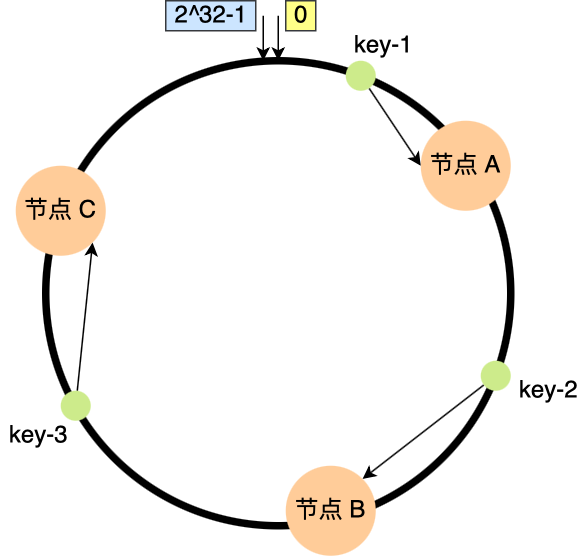

部分数据迁移


### Ext3

**1、高可用性**
系统使用了ext3文件系统后，即使在非正常关机后，系统也不需要检查文件系统。宕机发生后，恢复ext3文件系统的时间只要数十秒钟。
**2、数据的完整性**
ext3文件系统能够极大地提高文件系统的完整性，避免了意外宕机对文件系统的破坏。在保证数据完整性方面，ext3文件系统有2种模式可供选择。其中之一就是“同时保持文件系统及数据的一致性”模式。采用这种方式，你永远不再会看到由于非正常关机而存储在磁盘上的垃圾文件。
**3、文件系统的速度**
尽管使用ext3文件系统时，有时在存储数据时可能要多次写数据，但是，从总体上看来，ext3比ext2的性能还要好一些。这是因为ext3的日志功能对磁盘的驱动器读写头进行了优化。所以，文件系统的读写性能较之Ext2文件系统并来说，性能并没有降低。
**4、数据转换**
由ext2文件系统转换成ext3文件系统非常容易，只要简单地键入两条命令即可完成整个转换过程，用户不用花时间备份、恢复、格式化分区等。用一个ext3文件系统提供的小工具tune2fs，它可以将ext2文件系统轻松转换为ext3日志文件系统。另外，ext3文件系统可以不经任何更改，而直接加载成为ext2文件系统。
**5、多种日志模式**
Ext3有多种日志模式，一种工作模式是对所有的文件数据及metadata（定义文件系统中数据的数据,即数据的数据）进行日志记录（data=journal模式）；另一种工作模式则是只对metadata记录日志，而不对数据进行日志记录，也即所谓data=ordered或者data=writeback模式。系统管理人员可以根据系统的实际工作要求，在系统的工作速度与文件数据的一致性之间作出选择。

### 死锁


**银行家算法用于避免死锁**

**资源有序分配**破坏环路等待条件

死锁：在多道程序设计环境下，多个进程可能竞争一定数量的资源，。一个进程申请资源，如果资源不可用，那么进程进入等待状态。如果所申请的资源被其他等待进程占有，那么该等待的进程有可能无法改变状态，这种情况下称之为死锁。

#### **四个条件**

- **互斥**：至少有一个资源必须处在非共享模式，即一次只能有一个进程使用，如果另一进程申请该资源，那么申请进程必须延迟直到该资源释放为止。

- **占有并等待**：一个进程必须**占有**至少一个资源，并**等待**另一个资源，而该资源为其他进程所占有。

- **不可剥夺**（抢占）：资源不能被抢占
- **环路等待**：有一组进程{P0,P1,...Pn},P0等待的资源被P1占有，P1等待的资源被P2占有，Pn-1等待的资源被Pn占有，Pn等待的资源被P0占有。

#### 死锁避免

1、**银行家算法**可以避免死锁产生，防止系统进入不安全状态

2、资源**有序分配**（避免环路等待）。

3、**一次性申请所需所有资源**，若满足则全部分配，否则一个也不分配（破坏占用并等待）

4、**请求未果释放已有资源**

#### 死锁检测

**jstack**线程堆栈分析工具

#### 死锁解除

剥夺进程的资源

1. 死锁检测并恢复

- 对于互斥而言：有的资源本身就是互斥的，所以通常无法破坏这一必要条件。

- 对于占有并等待：每一个进程执行前一次性申请完所有资源。或者 每个进程申请当前所需要的资源，当需要使用其他资源时，需要把之前申请的资源释放掉。前者可以理解为破坏**等待**，后者可以理解为破坏**占有**。

  这样做使得资源得利用率很低（最后阶段可能需要用一下打印机，而将其在整个运行期占有）；对于优先级低得进程来说，多次释放资源很容易造成它们饥饿。

- 对于非抢占：破坏它，即对于已经分配的资源可以进行抢占。当一个优先级比较低，那么它的资源往往会被优先级高得剥夺，导致它饥饿。

- 对于循环等待：对所有资源类型进排序，要求每个进程按照资源编号递增顺序申请资源。可以用反证法证明。简要描述一下，在进程按照资源编号递增顺序申请资源的条件下，假设一个循环等待存在，即有一组进程{P0,P1,...Pn},P0等待的资源被P1占有，P1等待的资源被P2占有，Pn-1等待的资源被Pn占有，Pn等待的资源被P0占有。那么Pi+1占有了Ri资源，同时又申请Ri+1，所以资源Ri的编号必然小于Ri+1，那么R0的编号小于R1的....Rn资源的编号小于R0资源的编号（Pn进程）。根据传递性，R0的编号小于R0的编号，显然矛盾，因此，在上述条件下，不会产生循环等待。

#### 不会发生死锁的条件

假设有8个进程，每个需要k个资源，总共有n个资源，那么满足

n-(k-1)*8>=1就不会发生死锁


先给每个进程分配它所需的资源总数-1个，然后系统里还有一个资源，就不会产生死锁。
如果每个进程需要n个资源，总共有k个进程，则不发生死锁的最少的资源总数为：k*(n-1)+1 个，即k*(n-1)+1<=t

n*3+1>100就会发生死锁


### 进程线程协程


#### 一、进程

系统资源分配和独立运行的基本单位。

一个进程至少有一个线程，我们将它称为主线程（main线程）

##### 1、进程如何创建

（1）申请一个空白PCB
（2）分配运行所需要的资源，如内存、文件、IO设备、CPU
（3）初始化PCB,比如设置进程为就绪状态或静止就绪状态，优先级，程序计数器指向程序入口地址，栈指针指向栈顶

##### 2、PCB（进程控制块）

保存进程的控制和管理信息

（1）外部标识符（用户提供），内部标识符（OS设置的序号）
（2）进程调度信息：比如当前进程状态（以等待CPU多长时间，已执行多长时间）优先级等
（3）进程控制信息：进程同步和通信机制存放在PCB，比如消息对列指针和信号量，下一个PCB的指针

##### 3、进程的同步

**信号量和管程**（Monitors）
管程：定义公共的数据结构如消息队列，主要进行同步操作
操作系统内核
简介：常用设备的驱动程序，一些频率高的模块如时钟管理和进程调度，他们常驻内存。
作用：比较保护他们防止被破坏，同时提高OS的运行效率。
终止进程：正常结束，异常退出（越界，算术异常等）

#### 二、线程


是进程中的一条执行序列（执行流）

共享进程的资源(地址空间和文件描述符)，所以不用进行页表切换

轻型进程，CPU调度的基本单位。

有自己独立的**寄存器和栈**，切换开销小；进程需要页表拷贝等

线程之间**传递数据不需要经过内核态**

减少并发执行的时间和空间开销

##### 1、线程的实现

(1)用户级线程
存在用户空间，被用户进程进行创建和调度，无需切换内核，切换速度快，只有当系统调用时，才会映射到内核控制线程LWP(Light Weight Process)

进程内没有特权进行线程切换，所以只能等线程自己执行完

(2)内核级线程
内核线程是由操作系统管理的，线程对应的 TCB 自然是放在操作系统里的，这样线程的创建、终止和管理都是由操作系统负责。

##### 2、线程三种基本状态：

（1）就绪（Ready）: 得到Cpu以外的所有资源，会存入就绪队列
（2）运行（running）: 获得CPU正在执行
（3）阻塞（Block）: 运行中的线程IO请求或申请资源失败，会进入阻塞队列

如何引入挂起操作
（1）用户自己要停止进程查看问题
（2）父进程要修改子进程
（3）系统自己操作，进行负荷调节，系统繁忙，挂起一些不重要的进程

线程的实现可以分两类：用户级线程，内核级线程和混合式线程。

##### 用户级线程

用户线程在用户空间中实现，内核并没有直接对用户线程进程调度，内核的调度对象和传统进程一样，还是进程（用户进程）本身，内核并不能看到用户线程，内核并不知道用户线程的存在。
不需要内核支持而在**用户程序中实现的线程**，其不依赖于操作系统核心，应用进程利用线程库提供创建、同步、调度和管理线程的函数来控制用户线程。
内核资源的分配仍然是按照进程（用户进程）进行分配的；**各个用户线程只能在进程内进行资源竞争**。
用户级线程内核的切换由用户态程序自己控制内核切换（通过系统调用来获得内核提供的服务）,不需要内核干涉，少了进出内核态的消耗，但不能很好的利用多核CPU。
每个用户线程并不具有自身的线程上下文。因此，就线程的同时执行而言，任意给定时刻**每个进程只能够有一个线程在运行**，而且只有一个处理器内核会被分配给该进程。
优点：

线程的切换无需陷入内核，故切换开销小，速度非常快；

缺点：

系统调用的阻塞问题：对应用程序来讲，同一进程中只能同时有一个线程在运行，一个线程的阻塞将导致整个进程中所有线程的阻塞；
由于这里的处理器时间片分配是以进程为基本单位，所以每个线程执行的时间相对减少。

##### 内核级线程

内核线程又称为守护进程，**内核线程的调度由内核负责**，一个内核线程处于阻塞状态时不影响其他的内核线程，因为其是调度的基本单位。这与用户线程是不一样的；
这些线程可以在全系统内进行资源的竞争；
内核空间内为每一个内核支持线程设置了一个线程控制块（TCB），内核根据该控制块，感知线程的存在，并进行控制。在一定程度上类似于进程，只是创建、调度的开销要比进程小。
内核线程切换由内核控制，当线程进行切换的时候，由用户态转化为内核态。切换完毕要从内核态返回用户态，即存在用户态和内核态之间的转换，比如多核cpu，还有win线程的实现。
优点

在多处理器系统中，内核能够同时调度同一进程中多个线程并行执行到多个处理器中；
如果进程中的一个线程被阻塞，内核可以调度同一个进程中的另一个线程；
内核支持线程具有很小的数据结构和堆栈，线程的切换比较快，切换开销小；
内核本身也可以使用多线程的方式来实现。
缺点

即使CPU在同一个进程的多个线程之间切换，也需要陷入内核，因此其速度和效率不如用户级线程。

#### 三、协程

1、协程只是一个特殊的函数，是用户态，只是能在某个地方挂起，并且可以在挂起处外继续运行，所以不会太消耗资源
2、进程是内核态，进程包括CPU，数据和PCB进程控制块

A正确  协程不是被操作系统内核所管理的，而是完全由程序所控制，也就是在用户态执行，所以A正确。这样带来的好处是性能大幅度的提升，因为不会像线程切换那样消耗资源。
B正确 操作系统进行资源管理的最小单位是进程，操作系统的最小调度单位是线程，进程给线程提供执行环境。
C错误 协程不是进程也不是线程，而是一个特殊的函数，这个函数可以在某个地方挂起，并且可以重新在挂起处外继续运行。所以说，协程与进程、线程相比并不是一个维度的概念。
D正确  一个进程中可以有多个线程，而线程独有的资源有栈和寄存器和线程局部存储，简称TLS，其实就是个线程私有的全局变量。


### 多线程多进程

A.**不同进程有不同的页表**，对应着不同的物理地址空间，因此进程间通信需要使用IPC或者socket。而**线程可以共享了进程的地址空间**，所以A对。 

  B.与A的原因类似，进程创建是操作系统要为它分配内存，销毁时收回。而线程不需要，所以线程的创建与销毁更快。B对。 

  C.当存在大量计算需求的时候，比如**需要并发计算时，会频繁的切换进程/线程**。而**线程切换的成本小于进程**，因此选择多线程模型。C对。 

  D.同一进程中的**不同线程共享地址空间**，所以一个线程挂掉可能会导致整个进程挂掉。D对。


### 单工&半双工&全双工

单工：指数据传输只支持数据在一个方向上传输

全双工（full-duplex）的系统允许二台设备间同时进行双向数据传输。

半双工（half-duplex）的系统允许二台设备之间的双向数据传输，但不能同时进行。

### 进程通信方式

进程用户地址空间是相互隔离的，所以要通信要经过内核

IPC（Inter-Process Communication，进程间通信）

#### 1、管道


```
#include<iostream>
#include <stdio.h>
#include <stdlib.h>
#include <string.h>
#include <sys/types.h>
#include <unistd.h>
#include <sys/wait.h>
using namespace std;
 
int main()
{
	//创建管道
	//int pipe(int pipefd[2]);
	int fd[2];
	int ret = pipe(fd);
	if(ret<0)
	{
		perror("pipe error");
		return -1;
	}
 
	//创建子进程
	pid_t pid = fork();
	if(pid<0) 
	{
		perror("fork error");
		return -1;
	}
	else if(pid>0)  // 单向通信，自定义从父到子或子到父	
	{
		//关闭读端
		close(fd[0]);
		sleep(5);
		write(fd[1], "hello world", strlen("hello world"));	
 
		wait(NULL);//保证父进程阻塞，子进程先退出
	}
	else 
	{
		//关闭写端
		close(fd[1]);
		
		char buf[64];
		memset(buf, 0x00, sizeof(buf));
		int n = read(fd[0], buf, sizeof(buf));
		cout << "read over, n=" << n << " buf=" << buf << endl;
	
	}
 
	return 0;
}
```

内核缓冲区

管道是一种最基本的IPC机制，也称匿名管道，应用于有血缘关系的进程之间，完成数据传递。调用pipe函数即可创建一个管道。

​    

 

管道有以下特性：

管道的本质是一块内核缓冲区
由两个文件描述符引用，一个表示读端，一个表示写端。
规定数据从管道的写端流入管道，从读端流出。
当两个进程都终结的时候，管道也自动消失。
管道的读端和写端默认都是阻塞的。


 不完整管道：
                当读一个写端已经被关闭的管道时，在所有数据被读取后，read返回0，以表示到达了文件的尾部。
            如果写一个独断已经被关闭的管道，则产生信号SIGPIPE，如果忽略该信号或捕捉该信号并从处理程序返回，则write返回-1，同时errno设置为EPIPE。


管道创建步骤：

父进程调用pipe函数创建管道，得到两个文件描述符fd[0]和fd[1]，分别指向管道的读端和写端。


父进程调用fork创建子进程，那么子进程也有两个文件描述符指向同一管。


父进程关闭管道读端，子进程关闭管道写端。父进程可以向管道中写入数据，子进程将管道中的数据读出，这样就实现了父子进程间通信。


https://blog.csdn.net/m0_60663280/article/details/121309197

##### 一、匿名管道

没有名称，本质是**内核的一段缓存**，采用**半双工通信**,**只能单向通信**，数据是**无格式的字节流**且大小受限，符合先进先出，生命周期跟进程一样.

当管道满时，进程在 写管道会被阻塞，而当管道空时，进程读管道会被**阻塞**

管道可以**同时进行读进程和写进程**

通过调用pipe得到读写描述符进行，由于存在同一个进程中，所以匿名管道**只用于父子进程通信**，子进程会复制父进程的文件描述符。

##### 二、命名管道

**可进行不同进程的通信**，提前建立了类型为管道的设备文件，访问这个设备文件就可以通信

#### 2、消息队列

保存在内核的**消息链表**，使用用户**自定义数据类型**的消息体为单位传递数据，**发送消息后就可以返回**，读完就删除消息

消息队列**通信不及时**，**消息大小有限制**，内核态到用户态的**消息拷贝开销**

需要主动释放消息队列，如果没有释放消息队列进程终止也还会继续存在

#### 3、共享内存

信号量初始值由用户确定

**解决了数据拷贝的开销**，通过虚拟地址，映射到一块公共的物理内存空间，即共享内存

一个进程读写，另外进程就能够快速看到，**通信速度快**

#### 4、信号量

由于共享内存操作同块内存，所以会有互相覆盖的危险，所以需要信号量来进行同步。

一个**整形计数器**表示资源的数量，实现互斥操作，通过PV原子操作控制信号量

- **P操作**需要**减少**信号量，如果<0表明资源已被占用，需要阻塞等待。相减后>=0，表明还有资源，进程可继续运行

- V操作**增加**信号量，相加后<=0表明有进程处于阻塞，需要唤醒操作。相加后>0表明当前没有阻塞的进程

  

#### 5、信号

信号是进程间通信的唯一异步通信机制，可以在任何时候发送信号给某一进程，用户进程收到信号有如下几种处理方式：

忽略信号。SIGKILL和SIGSTOP无法捕捉和忽略，用于任何时候中断或结束某一进程。

执行默认操作。每种信号都规定了默认操作

捕捉信号。我们可以为信号定义一个信号处理函数。当信号发生时，我们就执行相应的信号处理函数。

kill -9就是SIGKILL信号

Ctrl+C产生SIGTINT信号，终止进程

Ctrl+Z产生SIGISTP信号，停止进程

#### 6、Socket

要想跨网络与不同主机通信，就需要Socket通信。

前面提到的管道、消息队列、共享内存、信号量和信号都是在同一台主机上进行进程间通信，那要想**跨网络与不同主机上的进程之间通信，就需要 Socket 通信了。**

实际上，Socket 通信不仅可以跨网络与不同主机的进程间通信，还可以在同主机上进程间通信。

我们来看看创建 socket 的系统调用：

```c
int socket(int domain, int type, int protocal)
```

三个参数分别代表：

- domain 参数用来指定协议族，比如 AF_INET 用于 IPV4、AF_INET6 用于 IPV6、AF_LOCAL/AF_UNIX 用于本机；
- type 参数用来指定通信特性，比如 SOCK_STREAM 表示的是字节流，对应 TCP、SOCK_DGRAM 表示的是数据报，对应 UDP、SOCK_RAW 表示的是原始套接字；
- protocal 参数原本是用来指定通信协议的，但现在基本废弃。因为协议已经通过前面两个参数指定完成，protocol 目前一般写成 0 即可；

根据创建 socket 类型的不同，通信的方式也就不同：

- 实现 TCP 字节流通信： socket 类型是 AF_INET 和 SOCK_STREAM；
- 实现 UDP 数据报通信：socket 类型是 AF_INET 和 SOCK_DGRAM；
- 实现本地进程间通信： 「本地字节流 socket 」类型是 AF_LOCAL 和 SOCK_STREAM，「本地数据报 socket 」类型是 AF_LOCAL 和 SOCK_DGRAM。另外，AF_UNIX 和 AF_LOCAL 是等价的，所以 AF_UNIX 也属于本地 socket；

接下来，简单说一下这三种通信的编程模式。

> 针对 TCP 协议通信的 socket 编程模型


- 服务端和客户端初始化 `socket`，得到文件描述符；
- 服务端调用 `bind`，将绑定在 IP 地址和端口;
- 服务端调用 `listen`，进行监听；
- 服务端调用 `accept`，等待客户端连接；
- 客户端调用 `connect`，向服务器端的地址和端口发起连接请求；
- 服务端 `accept` 返回用于传输的 `socket` 的文件描述符；
- 客户端调用 `write` 写入数据；服务端调用 `read` 读取数据；
- 客户端断开连接时，会调用 `close`，那么服务端 `read` 读取数据的时候，就会读取到了 `EOF`，待处理完数据后，服务端调用 `close`，表示连接关闭。

这里需要注意的是，服务端调用 `accept` 时，连接成功了会返回一个已完成连接的 socket，后续用来传输数据。

所以，监听的 socket 和真正用来传送数据的 socket，是「**两个**」 socket，一个叫作**监听 socket**，一个叫作**已完成连接 socket**。

成功连接建立之后，双方开始通过 read 和 write 函数来读写数据，就像往一个文件流里面写东西一样。

> 针对 UDP 协议通信的 socket 编程模型


UDP 是没有连接的，所以不需要三次握手，也就不需要像 TCP 调用 listen 和 connect，但是 UDP 的交互仍然需要 IP 地址和端口号，因此也需要 bind。

对于 UDP 来说，不需要要维护连接，那么也就没有所谓的发送方和接收方，甚至都不存在客户端和服务端的概念，只要有一个 socket 多台机器就可以任意通信，因此每一个 UDP 的 socket 都需要 bind。

另外，每次通信时，调用 sendto 和 recvfrom，都要传入目标主机的 IP 地址和端口。

> 针对本地进程间通信的 socket 编程模型

本地 socket 被用于在**同一台主机上进程间通信**的场景：

- 本地 socket 的编程接口和 IPv4 、IPv6 套接字编程接口是一致的，可以支持「字节流」和「数据报」两种协议；
- 本地 socket 的实现效率大大高于 IPv4 和 IPv6 的字节流、数据报 socket 实现；

对于本地字节流 socket，其 socket 类型是 AF_LOCAL 和 SOCK_STREAM。

对于本地数据报 socket，其 socket 类型是 AF_LOCAL 和 SOCK_DGRAM。

本地字节流 socket 和 本地数据报 socket 在 bind 的时候，不像 TCP 和 UDP 要绑定 IP 地址和端口，而是**绑定一个本地文件**，这也就是它们之间的最大区别。

### 同步和互斥

#### PV

信号量允许多个线程同时使用共享资源。信号量包含一个非负整数计数器，计数器的值表示同时访问共享资源的最大线程数（或者说可用资源的数目）。通过PV操作来获取、释放信号量。
    当一个线程进入临界区时，信号量计数减1（P操作），当该线程离开临界区时计数加1（V操作），P和V操作必须都是原子操作。**当计数器的值为0时，其变为无信号状态**，如果新来的线程要进入临界区（执行P操作），其必须**阻塞等待**计数器值增加，即有其它线程释放共享资源。

是是解决进程间同步和互斥的**一对低级通信原语**

#### 同步

线程在某个点互相等待和唤醒操作，比如线程AB互相协助，A等待B处理完唤醒他

##### 1、哲学家就餐问题

哲学家围着就餐，中间只有一把叉子，但每个则学家需要两把叉子才能就餐

方案一：使用信号量解决，奇数先拿左边再拿右边的叉子，偶数先拿右边再拿左边


方案二：只有左右两边都没有进餐，我才可以进餐


比如生**产消费模型**，可使用信号量PV实现同步操作


##### 2、读写问题

「读-读」允许：同一时刻，允许多个读者同时读

「读-写」互斥：没有写者时读者才能读，没有读者时写者才能写

「写-写」互斥：没有其他写者时，写者才能写

读优先锁：读读互斥，读写互斥，当读线程获取锁的时候，另外读线程可以继续获取读锁，可能导致写饥饿

写优先锁：当读获取到锁的时候，写获取锁的时候阻塞，但另外读进程再获取读锁的时候会阻塞

读写公平锁：把所有获取锁的都用队列存起来，按先进先出加锁

方案二：使用一个信号量falg解决,防止读者无线读叠加，避免了读写饥饿问题


而这里 `flag` 的作用就是阻止读者的这种特殊权限（特殊权限是只要读者到达，就可以进入读者队列）。

比如：开始来了一些读者读数据，它们全部进入读者队列，此时来了一个写者，执行 `P(falg)` 操作，使得后续到来的读者都阻塞在 `flag` 上，不能进入读者队列，这会使得读者队列逐渐为空，即 `rCount` 减为 0。

这个写者也不能立马开始写（因为此时读者队列不为空），会阻塞在信号量 `wDataMutex` 上，读者队列中的读者全部读取结束后，最后一个读者进程执行 `V(wDataMutex)`，唤醒刚才的写者，写者则继续开始进行写操作

##### 3、过桥问题

问题
独木桥问题1：东西向汽车过独木桥，为了保证安全，只要桥上无车，车过桥，待一方的汽车全部过完后，另一方的汽车才允许过桥。请用信号量和PV操作来写出汽车过独木桥问题的同步算法。

思路
首先对于东西两侧的车辆而言，桥是一个互斥资源，而对东西两侧各自而言，每辆车上桥是同步关系，东西两侧的车辆在抢到这互斥资源后只有最后一辆车通过了独木桥才释放。

```
	semaphore wait,mutex1,mutex2;
	mutex1=1;//东侧车辆的互斥信号量
	mutex2=1;//西侧车辆的互斥信号量
	wait=1;//互斥信号量，表示独木桥的数量
	int count1,count2;
	count1=0;//东侧车辆数
	count2=0;//西侧车辆数
cobegin
	process P 东(){
		P(mutex1);//封锁，防止多个进程同时改变count的值，导致修改被覆盖
		count1++;
		if(count1==1)//第一辆车上桥
			P(wait);
		V(mutex1);
		/*过独木桥*/
		P(mutex1);//与上面count++同理
		count1--;
		if(count1==0)//东侧车辆全部下桥
			V(wait);
		V(mutex1);
	}
	process P 西(){
		P(mutex2);
		count2++;
		if(count2==1)//第一辆车上桥
			P(wait);
		V(mutex2);
		/*过独木桥*/
		P(mutex2);
		count2--;
		if(count2==0)//西侧车辆全部下桥
			V(wait);
		V(mutex2);
	}
coend
```

下面应该是选C


#### 互斥

临界区同一时刻只允许一个线程进行访问

使用加锁或信号量实现

### 中断

1、利用中断功能，处理器**可以在I/O操作的执行过程中执行其它指令**
2、中断处理中，**需要保护被中断进程的所有状态信息**
3、处理多个中断有两种方法：一种方法是正在处理一个中断时，**禁止再发生中断**；另一种方法是**允许高优先级的中断打断低优先级**的中断处理程序的执行
4、如果是因为进程调度引起的中断，那么被中断的进程会被**放入就绪队列里面排队**，所以在中断处理程序执行完成之后被中断的进程**不一定立即获得CPU的控制权**、恢复执行

中断是**多道程序得以实现的基础**

中断的本质：发生中断就意味着需要**操作系统介入**，开展管理工作，CPU要从**用户态转换为核心态**

https://www.jianshu.com/p/4fc0db2b749a

```
异步的时间处理机制，提高CPU并发效率，系统调用的实现方式，比如IO中断

作用：
提高处理器效率，利用中断功能，处理器在IO操作执行过程中执行其它程序，实现并发

分类：
一、IO中断，让CPU执行其它线程，不用干等，提高了CPU的使用效率

二、程序中断（系统调用）：系统调用是通过中断实现，CPU响应中
断，切换内核态进行中断处理程序运行

三、时钟中断

四、硬件失效中断（运算溢出、访问越界、被0除）
```

MMU进程隔离，保护内核

内核：线程调度，文件管理，驱动程序，网络支持

不让用户执行一些特权指令

```
DMA直接内存读取，发一个命令（包含IP设备地址、是否一次读写、字节数）给它就行，处理器继续其它工作。传送完成，DMA发送中断信号给处理器就行了
```

高速缓存：根据局部性原理，把一小部分的指令集合加载到告诉缓存中，匹配CPU的处理速度


### 页面置换算法

LRU(Least Recently Used) 最近最少使用算法

### 进程调度算法

FCFS 对长作业有利，**适用于 CPU 繁忙型**作业的系统，而不适用于 I/O 繁忙型作业的系统。

### 补码和原码

```
正数补码是本身
负数补码是各位取反（不包括符号位），末位加一
```

**计算机只有加法**

```
1-1=1原+（-1）原=1（补）+（-1）补=（）补=（）原
```

**为什么byte是-128至127**

```
+0 0000 0000  补码：0000 0000
-0 1000 0000  补码：0000 0000（溢出）
根据补码原则0000 0000表示0，1000 0000却不能表示0（没有-0这种东西），
既然1000 0000谁要表示不了，那就表示-128吧
```

0补码：0000 0000

-128补码：1000 000 源码溢出了，谁也表示不了，那就表示-128

127补码：0111 1111

-127补码：1000 0001

-1补码：1111 1111

#### >>和>>>

```
>>   右移，高位符号位不变
>>>  有符号右移，高位符号位补0
比如负数无符号右移后，符号补0，变成了正数
```

#### ~

二进制**按位（包括符号位）取反**

0补码：0000 0000

~按位取反：1111 1111 原码：1000 0001（-1）


### 定点数和浮点数


在计算机中，小数点不用专门的器件表示，而是按约定的方式标出，共有两种方法表示小数点的存在，即定点表示和浮点表示。定点表示的数称为**定点数**（**如 java 语言中的 int**），浮点表示的数称为**浮点数**（**如 java 语言中的 float、double**）。

#### 定点数

小数点固定在某一位置的数为定点数，有如下两种格式。


当小数点位于数符和第一数值位之间时，机器内的数为**纯小数**；当小数点位于数值位以后时，机器内的数为**纯整数**。

采用定点数的机器称为定点机。数值部分的位数n决定了定点机中数的表示范围。若机器数采用原码，小数定点机中数的表示范围是 -(1 - 2^-n) ~ (1 - 2^-n)，整数定点机中数的表示范围是 -(2^n-1) ~ (2^n-1)。

#### 浮点数

实际上计算机中处理的数不必定是纯小数或纯整数（如圆周率3.1416），并且有些数据的数值范围相差很大（如电子的质量9×10-6g，太阳的质量2×103g），它们都不能直接用定点小数或定点整数表示，但都可用浮点数表示。浮点数即**小数点的位置能够浮动的数**，如

352.47 = 3.5247 * 10^2 = 3524.7 * 10^-1

显然，这里小数点的位置是变化的，但由于**分别乘上了不一样的 10 的方幂，故值不变**。

一般，浮点数被表示成 N = S * r^j ， 式中，S为尾数（可正可负），j为阶码（可正可负），r是基数（或基值）。在计算机中，基数可取2，四、8或16等。

**浮点数的规格化**形式为 N = 0.110101 * 2^10。

浮点数在机器中的形式以下所示。


浮点数由阶码j和尾数S两部分组成。阶符表示阶码数值部分的正负，数符表示尾数数值部分的正负。阶码j反映了浮点数的表示范围及小数点的实际位置。尾数是小数，其位数n反映了浮点数的精度。

#### 定点数与浮点数的比较

定点数和浮点数可从以下几个方面进行比较。

①当浮点机和定点机中数的**位数相同**时，**浮点数的表示范围比定点数的大得多**。

②当**浮点数为规格化数时，其相对精度远比定点数高**。

③浮点数运算要分阶码部分和尾数部分，并且运算结果都要求规格化，故**浮点运算步骤比定点运算步骤多**，运算速度比定点运算的低，运算线路比定点运算的复杂。

④在溢出的判断方法上，**浮点数是对规格化数的阶码进行判断**，而**定点数是对数值自己进行判断**。例如小数定点机中的数其绝对值必须小于1，不然“溢出”，此时要求机器中止运算，进行处理。为了防止溢出，上机前必须选择比例因子，这个工做比较麻烦给编程带来不便。而浮点数的表示范围远比定点数大，仅当“上溢”时机器才中止运算，故通常没必要考虑比例因子的选择。


总之，浮点数在数的**表示范围**、**数的精度**、**溢出处理**和**程序编程**方面（不取比例因子）均**优于定点数**。但在运算规则、运算速度及硬件成本方面又不如定点数。所以，究竟选用定点数仍是浮点数，应根据具体应用综合考虑。通常来讲，通用的大型计算机大多采用浮点数，或同时采用定、浮点数；小型、微型及某些专用机、控制机则大多采用定点数。当须要做浮点运算时，可经过软件实现，也可外加浮点扩展硬件（如协处理器）来实现。

#### IEEE 754标准

现代计算机中，浮点数通常采用 IEEE 制定的国际标准，这种标准形式以下：


按 IEEE 标准，经常使用的浮点数有三种：

|          | 符号位S | 阶码 | 尾数 | 总位数 |
| :------- | :------ | :--- | :--- | :----- |
| 短实数   | 1       | 8    | 23   | 32     |
| 长实数   | 1       | 11   | 52   | 64     |
| 临时实数 | 1       | 15   | 64   | 80     |

其中，S为数符，表示浮点数的正负，但与其有效位（尾数）是分开的。

阶码的真值都被加上一个常数（偏移量），如短实数、长实数和临时实数的偏移量用十进制数表示分别为 12七、1023 和 16383。

尾数部分一般都是规格化表示，即写成 1.xxxxxx 的形式，其中 xxxxxx 表示小数部分。**IEEE 754规定，在计算机内部保存尾数时，默认这个数的第一位老是1，所以能够被舍去，只保存后面的xxxxxx部分。**

下面列出了十进制数 178.125 的实数表示。

| 实数表示       |      | 数值                           |                              |
| :------------- | :--- | :----------------------------- | :--------------------------- |
| 原始十进制数   |      | 178.125                        |                              |
| 二进制数       |      | 10110010.001                   |                              |
| 二进制浮点表示 |      | 1.0110010001*2^111             |                              |
|                | 符号 | 偏移的阶码                     | 有效值                       |
| 短实数表示     | 0    | 0000 0111+0111 1111 =1000 0110 | 0110 0100 0100 0000 0000 000 |

> 注：二进制浮点数的基数是2；基数2的指数111是未偏移的阶码；有效值只保留了尾数的小数部分0110010001。

你也能够编写 java 程序来验证在机器上浮点数是不是以 IEEE754 标准存储的，示例代码以下：

```
@Test
public void test(){
    int i = Float.floatToIntBits(178.125f);
    System.out.println(Integer.toBinaryString(i));
    //0 10000110 01100100010000000000000（符号+偏移的阶码+有效值）
}
```

#### 浮点数表示法


符号位S 阶码E 小数位M


#### 定义

浮点数是一串 0 和 1 构成的位序列(bit sequence)，从逻辑上用三元组{SS,EE,MM}表示任意的实数 X𝑋 可如下表示：


X=(−1)S∗M∗RE𝑋=(−1)𝑆∗𝑀∗𝑅𝐸


注意：IEEE 中浮点数的尾数 M𝑀 中仅记录了小数位（默认省略了整数位1），所以上述公式中的 M𝑀 实际值为 M+1𝑀+1，另外由于该实数使用二进制表示，所以基数 R𝑅 为 2
综上所述，在 IEEE 754 标准的前提下，任意一个实数 X𝑋，可表示为如下的形式


X=(−1)S∗(1+M)∗2E𝑋=(−1)𝑆∗(1+𝑀)∗2𝐸


#### 类型

|                | 数符(S) | 阶码(E) | 尾数(M) | 总位数 | 偏移值 |
| -------------- | ------- | ------- | ------- | ------ | ------ |
| 短实数(Float)  | 1位     | 8位     | 23位    | 32位   | 127    |
| 长实数(Double) | 1位     | 11 位   | 52位    | 64位   | 1023   |
| 临时实数       | 1位     | 15位    | 64位    | 80位   | 16383  |

#### 关键字 （什么叫做 数符，阶码，尾数）

- 数符：符号位，0正1负
- 阶码：科学计数法中的指数部分（补码表示）
- 尾数：科学计数法中的尾数部分（即小数点后面的部分。因为小数点前面的整数部分仅可能是1，可以将这个1忽略掉以减少不必要的存储空间）

#### 关于 float 类型阶码偏移值为什么是 127 而不是 128 的解释

- 预备知识
  阶码在浮点数中占 8 位，对于 8 位的有符号整数，其补码可表示的范围为：[-128, 127]，但为了方便比较直接比较阶码的大小，会将实际值偏移固定数值，使得存储值均为非负整数，于是目的为存储 8 位的有符号整数便改为了存储 8 位无符号整数，其补码可表示的范围为：[0, 255]，IEEE 754 的规定：若阶码全为 0 或全 1 要进行特殊处理，所以 [0, 255] 中的数值 0 和 255 被排除，剩下的无符号数字范围为：[1, 254]，为了可表示的正数和负数范围均衡，IEEE 754 设置移码为 127，则实际可表示的指数范围为：[-126, 127]
- 疑问解答
  若设置偏移值为 128，指数的实际范围为 [-127, 126]，也能达到正负数均衡的要求，但：
  移码为 127 与 128 相比多表示的指数是 +127，而少表示的指数是 -127，实际生活中 1.x∗21271.x∗2127 (xx 表示任意数量的任意数字) 远比 1.x∗2−1271.x∗2−127 要有意义的多，毕竟我们接触的更多的是宏观世界。

#### 阶码全0和全1

- 阶码全为 0 (非规格化数)
  - 尾数为0，则表示该数为 +0或-0，符号由符号位决定
  - 尾数非0，此时隐藏的整数位不再是1，而是零，此时可用于表示比规格化数更小的数
- 阶码全为 1
  - 尾数为0，则表示该数为 +∞+∞或−∞−∞，符号由符号位决定
  - 尾数非0，这样的数称之为 NaN (Not a Number), 1/0的结果就是一个典型的 NaN
- 非规格化数
  - 在上文中我们说到，浮点数默认隐藏的整数位为1，在这种情况下怎样表示 0 呢，很明显无法表示，所以这里引出非规格化数来处理。非规格化的数的两个作用为：
    - 处理 0 的问题
    - 处理比规格化数更小的数值

#### 单精度浮点数的有效数字问题

1. 将十进制数 8.125 转化为单精度的浮点数表示
   8.125 的二进制表示为 1000.001
   科学计数法表示为 1.000001∗231.000001∗23，对于该数，阶码实际值为 3，偏移之后的值为 3+127=1303+127=130，130转为二进制数为 10000010，尾数部分为 000001，首位符号位为0，得到其二进制表示为：
   0 10000010 00000100000000000000000
   注：尾数位不足23位则在后面补零，阶码不足8位则在前面补零，小数后面补零不影响小数的值，整数前面补零不会影响整数的值。
2. 计算单精度浮点数所能表示的最大正整数
   当符号位为0，小数位全为 1，实际指数为 127 时，得到最大正值，可知最大正值为a=(1+(1−2−23))∗2127=3.4028234663852886∗1038

### 进制转换

#### 1.十进制转换为其他进制：短除法

520=0X208 (2×16×16+8=520)


#### 2.其他进制转换为十进制：位权计算


 如：

​	二进制  1001 0011      其十进制为：1×2^7+1×2^4+1×2^1+1×2^0=147

​    八进制  1010               其十进制为：1×8^3+1×8^1=520

#### 3.二进制、八进制、十六进制的相互转换：拆位


#### 5、十进制小数转二进制

**乘2取整，从上往下**

同样按权展开，得B=a(2^-1)+b(2^-2)。因为小数部分的**位权是负次幂，所以我们只能乘2**，得2B=a+b（2^-1)。注意a变成了整数部分，我们取整数正好是取到了a，剩下的小数部分也如此。

```
 0.1875 = (0.0011)B

0.1875* 2 = 0.375 _______  取出整数部分 0；
	
0.375 * 2 = 0.75 ————— 取出整数部分 0；

0.75 * 2 = 1.5 —————— 取出整数部分 1；

0.5 * 2 = 1.0   —————— 取出整数部分 1；

顺序取出，所以最后结果为 0.0011...
```


### 大小端

对于大端和小端来说，一字节内部的8位的顺序是一样的

12345678

大端：**高位存在低地址**，低位存在高地址（**符合人类习惯**）


小端：高位存在高地址，低位存在低地址


x86是小端模式

### 分布式锁的实现

- 使用数据库的分布式锁
- 使用Redis的setnx和expire
- 基于Zookeeper实现分布式锁

### 电梯调度SCAN

从小到大直到顶再返回

```
根据电梯扫描算法，磁头会一直朝着增加方向走，直到到达磁盘的一端。在到达磁盘的一端后，磁头掉头，再朝着磁盘另一端去扫描。这个过程就跟电梯一样所以叫电梯扫描算法。

```

### 端口访问失败

```
解决：开启安全组，开启防火墙
```

- 查看防火墙所有已开放的端口

  ```bash
  firewall-cmd --list-all
  ```


- 基本使用

  ```bash
  启动与关闭
  systemctl start（stop） firewalld
  查看状态
  systemctl status firewalld
  ```

- 关闭防火墙命令是 

  ```bash
  iptables -P INPUT ACCEPT 
  iptables -P FORWARD ACCEPT 
  iptables -P OUTPUT ACCEPT 
  iptables -F 
  ```


- 给防火墙开启一个端口

  ```bash
  开启端口
  firewall-cmd --zone=public --add-port=3306/tcp --permanent
  重启生效
  firewall-cmd --reload
  ```

- 保存配置

  ```
  service iptables save #保存iptables规则  centOS
  iptables-save > /etc/iptables.up.rules  #保存iptables规则 ubuntu
  ```

- 查看端口号

  ```查看
   iptables -L -n 
  ```

- 查看端口占用情况

  ```
  netstat -ntulp | grep 3306   //查看所有3306端口使用情况
  ```

- centos安装宝塔命令 

  ```bash
  yum install -y wget && wget -O install.sh http://download.bt.cn/install/install.sh && sh install.sh
  ```

- Ubuntu/Deepin安装脚本

  ```bash
  wget -O install.sh http://download.bt.cn/install/install-ubuntu.sh && sudo bash install.sh
  ```

- 切换root用户

  ```bash
  su
  ```


- 查看服务对应的进程

  ```bash
  ps -ef|grep redis
  ```

  

- **lsof命令，用法：lsof -i:端口号，比如redis默认端口号6379，就使用**

  ```bash
  lsof -i:6379
  ```

**windows刷新dns **

```bash
ipconfig /displaydns 
ipconfig /flushdns
```

**hosts目录：C:\Windows\System32\drivers\etc\\hosts**

### 查看IP地址

```
linux：ifconfig
windows：ipconfig # 注意这个是电脑的私有IP，网页看到的才是网关的全球ip
```

### nohup后台运行命令

```bash
# & 表示后台运行
nohup java -jar demo01-0.0.1-SNAPSHOT.jar &
```

### 杀死进程脚本

```
ps -ef|grep XXX|grep -v grep|awk '{printf $2}'|xargs kill -9
或
kill -9 `ps -ef|grep XXX|grep -v grep|awk '{printf $2}'`
```

### 桥连、Nat、仅主机

桥接：选择桥接模式的话虚拟机和宿主机在网络上就是**平级**的关系，相当于连接在同一交换机上。

NAT：NAT模式就是虚拟机要联网得先**通过宿主机才能和外面进行通信**。

仅主机：虚拟机与宿主机直接连起来


1.bridged(桥接模式)

在这种模式下，VMWare虚拟出来的操作系统就像是局域网中的一台独立的主机，它可以访问网内任何一台机器。在桥接模式下，你需要手工为虚拟系统配置IP地址、子网掩码，而且还要和宿主机器处于同一网段，这样虚拟系统才能和宿主机器进行通信。同时，由于这个虚拟系统是局域网中的一个独立的主机系统，那么就可以手工配置它的TCP/IP配置信息，以实现通过局域网的网关或路由器访问互联网。

使用桥接模式的虚拟系统和宿主机器的关系，就像连接在同一个Hub上的两台电脑。想让它们相互通讯，你就需要为虚拟系统配置IP地址和子网掩码，否则就无法通信。

如果你想利用VMWare在局域网内新建一个虚拟服务器，为局域网用户提供网络服务，就应该选择桥接模式。

2.host-only(主机模式)

在某些特殊的网络调试环境中，要求将真实环境和虚拟环境隔离开，这时你就可采用host-only模式。在host-only模式中，所有的虚拟系统是可以相互通信的，但虚拟系统和真实的网络是被隔离开的。

提示:在host-only模式下，虚拟系统和宿主机器系统是可以相互通信的，相当于这两台机器通过双绞线互连。

在host-only模式下，虚拟系统的TCP/IP配置信息(如IP地址、网关地址、DNS服务器等)，都是由VMnet1(host-only)虚拟网络的DHCP服务器来动态分配的。

如果你想利用VMWare创建一个与网内其他机器相隔离的虚拟系统，进行某些特殊的网络调试工作，可以选择host-only模式。

3.NAT(网络地址转换模式)

使用NAT模式，就是让虚拟系统借助NAT(网络地址转换)功能，通过宿主机器所在的网络来访问公网。也就是说，使用NAT模式可以实现在虚拟系统里访问互联网。NAT模式下的虚拟系统的TCP/IP配置信息是由VMnet8(NAT)虚拟网络的DHCP服务器提供的，无法进行手工修改，因此虚拟系统也就无法和本局域网中的其他真实主机进行通讯。采用NAT模式最大的优势是虚拟系统接入互联网非常简单，你不需要进行任何其他的配置，只需要宿主机器能访问互联网即可。

如果你想利用VMWare安装一个新的虚拟系统，在虚拟系统中不用进行任何手工配置就能直接访问互联网，建议你采用NAT模式。

提示:以上所提到的NAT模式下的VMnet8虚拟网络，host-only模式下的VMnet1虚拟网络，以及bridged模式下的VMnet0虚拟网络，都是由VMWare虚拟机自动配置而生成的，不需要用户自行设置。VMnet8和VMnet1提供DHCP服务，VMnet0虚拟网络则不提供。

这里我们选择host-only(主机模式)

### 修改主机名

```
vi /etc/hostname
```


### 虚拟机静态ip设置

[博客](https://blog.csdn.net/qq_36254571/article/details/97146842)

很多人可能在刚开始使用CentOS7的时候，总会发现虚拟机的ip地址随时都会改变。

一、VM平台的配置

1.设置虚拟机的网络连接方式为NAT


2.配置虚拟机的NAT模式具体地址参数

编辑(E)–>虚拟网络编辑器(N)–>更改设置–>选中VMnet8

设置子网IP

由于要设置的地址为192.168.119.121，故在设置子网的时候取前三段，为192.168.119.0

在这里插入图片描述


设置网关

点击NAT设置(S)

在这里插入图片描述


二、 CentOS配置文件配置

首先用 vim /etc/sysconfig/network-scripts/ifcfg-ens33 打开配置文件ifcfg-ens33

修改配置文件中的以下2个属性


再向改配置文件中加入如下代码


IPADDR=192.168.119.121

GATEWAY=192.168.119.2

NETMASK=255.255.255.0

DNS1=8.8.8.8

DNS2=8.8.4.4

IPADDR ：要固定的虚拟机的IP地址，前三位与应主机的ip地址一致

GATEWAY ：之前再VM中设置的网关地址

NETMASK ：广播地址


再向vim etc/resolv.conf中加入

nameserver 8.8.8.8

nameserver 8.8.4.4

nameserver ：定义DNS服务器的IP地址，在此可指定多个DNS服务器，则用户端将会依序提出查询要求。

最后重启网卡

service network restart

检查配置情况

静态IP设置完毕

### 文件系统

为一个文件分配inode节点和目录项

#### 1、inode

磁盘块号（指向数据块）、文件属性（大小，创建时间）

**磁盘**

#### 2、目录项

文件名、目录级联关系

索引节点唯一标识一个文件，所以是目录项和inode是多对一的关系，即多个文件名对于同一个inode文件，这就是硬链接，起到备份的作用

目录也是文件，也是用索引节点唯一标识，和普通文件不同的是，普通文件在磁盘里面保存的是文件数据，而目录文件在磁盘里面保存子目录或文件。

**缓存在内存**

### 文件权限

chmod命令改变文件权限

```
rxw rwx rwx  当前用户 用户组 其它用户
421
文件默认没有x权限；目录默认有x权限
```


```
如果没有x权限，则无法进入对应的目录
```


### 段式存储管理

答:分页式是将线性地址空间直接分成大小相同的页进行存储,段式则是根据用户有逻辑意义的程序模块划分地址空间。页的共享是使相关进程的逻辑空间中的页指向相同的内存块,若页中既有共享的部分又有不共享的部分则不好实现。

页面保护必须设置存储保护键指明对其内容的存取权限。实现页(段)的共享是指某些作业的逻辑页号(段号)对应同一物理页号(内存中该段的起始地址)。页(段)的保护往往需要**对共享的页面(段)加上某种访问权限的限制**,如不能修改等;或**设置地址越界检查**,对于页内地址(段内地址)大于页长(段长)的存取,产生保护中断。因为页的划分没有逻辑意义,故共享和保护不便实现。

段的共享一般是硬件实现,要比页的共享容易的多。段的保护可由**存储保护键和界限寄存器**实现。


https://www.cnblogs.com/wkfvawl/p/11733057.html

页式是一维，段式是二维的

页式和段式分配**都是动态**的，**页式分配不是连续的**，段式分配段内连续，段之间不连续

段式存储管理更方便共享和安全


#### 1、分段

**进程的地址空间**：按照程序**自身的逻辑**关系**划分为若干个段**，每个段都有一个段名（在低级语言中，程序员使用段名来编程），每段从0开始编址。

**内存分配规则：**以段为单位进行分配，**每个段在内存中占连续空间**，但**各段之间可以不相邻**。

#### 2、段表

每一个程序设置一个段表，放在内存,属于进程的现场信息


#### 3、地址变换

逻辑地址是**二维**的，包括**段号+段内地址**

根据段号从**段表**中找到**段基址**

于是**段基址+段内地址**就能定位目标单元


#### 4、段的保护

**越界中断处理**
   进程在执行过程中，有时需要扩大分段，如数据段。由于**要访问的地址超出原有的段长**，所以发越界中断。操作系统处理中断时 ，首先判断该段的“扩充位”，如可扩充，则增加段的长度；否则按出错处理

**缺段中断处理**

检查内存中是否**有足够的空闲**空间
  ①若有，则**装入该段**，修改有关数据结构，中断返回
  ②若没有，检查内存中空闲区的总和是否满足要求，是则应采用**紧缩技术**，转 ① ；否则，淘汰一（些）段，转①

#### 5、段的动态连接

为何要进行段的**动态链接**？
**大型程序由若干程序段，若干数据段组成**
进程的某些程序段在进程运行期间可能根本不用
互斥执行的程序段**没有必要同时驻留内存**
有些程序段执行一次后不再用到
**静态链接花费时间，浪费空间**

在一个程序运行开始时，**只将主程序段装配好并调入主存**。其它各段的**装配**是在主程序段运行过程中**逐步进行**的。每当需要调用一个新段时，再将这个新段装配好，并与主程序段连接。
**页式存储管理：难以完成动态链接，其逻辑地址是一维的**

#### 6、信息的保护与共享

这里主要与页式存储管理进行一下对比。

**分段比分页更容易实现信息的共享和保护。**

共享：直接指向要共享的段即可；

保护：比如一个页面一部分可访问，一部分不可访问，页表很难进行保护。**段表直接划分为可访问的和不可访问的段区域。**


 纯代码举例：比如，有一个代码段只是简单的输出“Hello World!”。


#### 7、页式系统与段式系统的对比

分页是信息的**物理单位**，实现了离散分配，不易产生内存碎片，是系统行为。

分段是信息的**逻辑单元**，面向用户可见，一段代表一个逻辑模块。


页大小是**固定**的，分页是**一维**的，只需一个记忆符即可表示一个地址

段大小**不固定**，分段是**二维**的，需要段号和段内地址


**分段更容易实现信息的共享和保护**，比如一些纯代码可以共享，直接指向该段即可。同理，可分为可访问和不可访问段


分页**访存要两次**，第一次查页表，第二次访问目标单元。

分段**访存要两次**，第一次查段表，第二次访问目标单元。

两者都可以引入**快表**（直接保存实际的），那么都只需一次访存。

快表：是页表的缓存，缓存了虚拟地址到物理地址的映射

页表：页到物理地址的映射


补充：

分段存储：段内地址W字段溢出将产生越界中断。

分页存储：段内地址W字段溢出会自动加入到页号中。

#### 8、总结


### 段页式存储管理

第一次查段表，第二次查对应的页表，第三次查目标单元

#### 1、分页、分段的有缺点分析


#### 2、基本思想

用户程序划分：按段式划分（对用户来讲，按段的逻辑关系进行划分；对系统讲，按页划分每一段）

逻辑地址：


 **内存划分：按页式存储管理方案**
 **内存分配：以页为单位进行分配**


#### 3、逻辑地址结构


#### 4、段表页表


#### 5、地址转换


#### 6、评价

**优点：**
保留了分段和请求分页存储管理的全部优点
提供了虚存空间，能更有效利用主存

**缺点：**
增加了硬件成本
系统复杂度较大

#### 7、总结


### 逻辑地址


逻辑地址，程序所使用的地址CPU分配给**程序看到的内存单元**，**相对块号**。需要MMU从虚拟地址映射到物理地址中。

### 虚拟地址（线性地址）																													

逻辑地址通过**段式内存管理映射的地址称为虚拟地址**（线性地址）

线性地址是逻辑地址到物理地址变换之间的中间层。在段页式存储管理中，程序代码会产生逻辑地址，或者说是段中的偏移地址，加上相应段的基地址就生成了一个线性地址。

如果**启用了分页**机制，那么线性地址可以**再经变换以产生一个物理地址**。

若没有启用分页机制，那么线性地址直接就是物理地址。

### 物理地址

虚拟地址经过页式内存管理转换为物理地址

CPU外部地址总线上的寻址物理内存的地址，是地址变换的最终结果地址，实际磁盘或物理内存的地址


Linux操作系统本身的代码和应用程序面对都是虚拟地址，屏蔽了CPU逻辑地址的概念，段只被用于访问控制和内存保护

### 堆和栈


#### 内存中的栈区和堆区

堆区：就是通过new、malloc、realloc分配的内存块，编译器不会负责它们的释放工作，需要用程序区释放。分配方式类似于数据结构中的链表。“内存泄漏”通常说的就是堆区。

栈区：存放函数内的局部变量，形参和函数返回值。栈区之中的数据的作用范围过了之后，系统就会回收自动管理栈区的内存(分配内存 , 回收内存),不需要开发人员来手动管理。栈区就像是一家客栈，里面有很多房间，客人来了之后自动分配房间，房间里的客人可以变动，是一种动态的数据变动。 

#### 堆和栈有什么区别？

堆（Heap）和栈（Stack）是有区别的，很多程序员混淆堆栈的概念，或者认为它们就是一个概念。简单来说，它们之间的主要区别可以表现在如下五个方面。

##### 1.分配和管理方式不同

堆是动态分配的，其空间的分配和释放都由程序员控制。也就是说，堆的大小并不固定，可动态扩张或缩减，其分配由malloc()等这类实时内存分配函数来实现。当进程调用malloc等函数分配内存时，新分配的内存就被动态添加到堆上（堆被扩张）；当利用free等函数释放内存时，被释放的内存从堆中被剔除（堆被缩减）。

而**栈由编译器自动管理**，其分配方式有两种：静态分配和动态分配。**静态分配由编译器完成，比如局部变量的分配**。**动态分配由alloca（）函数进行分配**，但是栈的动态分配和堆是不同的，它的动态分配是由编译器进行释放，无需手工控制。

##### 2.申请的大小限制不同

栈是**向低地址扩展**的数据结构，是一块**连续的内存区域**，栈顶的地址和栈的最大容量是系统预先规定好的，能从栈获得的空间较小。

堆是**向高地址扩展**的数据结构，是**不连续的内存区域**，这是由于系统是由链表在存储空闲内存地址，自然堆就是不连续的内存区域，且链表的遍历也是从低地址向高地址遍历的，堆的大小受限于计算机系统的有效虚拟内存空间，

由此空间，堆获得的空间比较灵活，也比较大。在 32 位平台下，VC6 下默认为 1M，堆最大可以到 4G；

##### 3.申请效率不同

栈由系统**自动分配**，速度快，但是程序员无法控制。

堆是有**程序员自己分配**，速度较慢，**容易产生碎片**，不过用起来方便。

##### 4.产生碎片不同

**对堆来说，频繁执行malloc或free势必会造成内存空间的不连续**，形成大量的碎片，使程序效率降低；而对栈而言，则不存在碎片问题。

##### 5.内存地址增长的方向不同

堆是向着内存地址增加的方向增长的，从内存的**低地址向高地址**方向增长；

栈的增长方向与之相反，是向着内存地址减小的方向增长，由内存的**高地址向低地址**方向增长。

假设一个程序的函数调用顺序为：主函数main调用函数func1，函数func1调用函数func2。当这个程序被操作系统调入内存运行时，其对应的进程在内存中的映射结果如下图所示


例子中的内存映射

进程的栈是由多个栈帧构成的，其中每个栈帧都对应一个函数调用。当调用函数时，新的栈帧被压入栈；当函数返回时，相应的栈帧从栈中弹出。由于需要将函数返回地址这样的重要数据保存在程序员可见的堆栈中，因此也给系统安全带来了极大的隐患。

当程序写入超过缓冲区的边界时，就会产生所谓的“缓冲区溢出”。发生缓冲区溢出时，就会覆盖下一个相邻的内存块，导致程序发生一些不可预料的结果：也许程序可以继续，也许程序的执行出现奇怪现象，也许程序完全失败或者崩溃等。


#### 总结

（1）heap是堆，stack是栈；

（2）stack的空间由操作系统自动分配/释放，heap上的空间手动分配/释放；

（3）stack空间有限，heap是很大的自由内存区；

（4）C中的malloc函数分配的内存空间即在堆上，C++中对应的是new操作符。

程序在编译对变量和函数分配内存都在栈上进行，且内存运行过程中函数调用时参数的传递在栈上进行。

https://www.bilibili.com/read/cv8556534

### 虚拟内存

虚拟内存：计算机所呈现的比实际内存大得多的容量。比如北京到上海只需3公里的铁轨，只要你操作得足够快，把后面的铁轨铺到火车前面。

这就是虚拟内存管理要完成的任务，为每个程序分配了64MB的虚拟内存空间，因此逻辑地址范围为0x0000000到0x4000000

#### **为什么要有虚拟内存**

- 进程要4G空间，但实际不会用到那么多

- **地址空间隔离。**用户直接访问物理内存，不安全，可能恶意破坏别的内存数据。

- **内存利用率低。**由于内存有限，一个程序空间不够，就要先释放部分空间才能运行，这样数据装入装出效率低下。另外，虚拟内存是连续的，不代表物理内存是连续的，意味着可以使用内存碎片

- **程序运行地址不确定。**因为内存随机分配，所以程序运行地址不确定。

- **屏蔽内存细节**，降低使用门槛。不同厂商内存结构不一致，直接使用比较复杂。

#### 分页

**局部性原理**，每次使用的数据都是相邻的，所以有了**分页**的概念，每次以页（4k）单位读取数据。

当程序执行到x页时，当发现空页面时，就发送了页错误（Page Fault）,操作系统就分配一个物理页面，再将物理页面和虚拟内存的虚拟页映射起来，然后把控制权交给进程。

#### TLB（Translation Lookaside Buffer）:页表缓存

本质是一块高速缓存，缓存虚拟地址和物理地址，如果虚拟地址有对应的物理地址，就叫命中，所以提高命中率可大大提高性能

### SWAP分区

linux叫swap分区，当物理内存不够的时候，先把一部分内存放到swap分区中，待内存空闲再继续执行，也叫交换分区。一般得自己创建swap分区。

window叫做虚拟内存，内存没有用完也会去使用，一般放在c盘


```
swap是什么
内存不足的时候，采用硬盘来虚拟出内存

添加swap
#dd if=/dev/zero of=/tmp/swapfile bs=1M count=4096
 	dd 用来建立空文件
	if=fileName 输入文件（源文件），/dev/zero是会一值输出0的文件
	of 输出文件
	bs 块的大小为多少字节
	count 指定多少块
	创建swap文件，大小1G，文件越大，创建时间越长，文件路径可自定义（/tmp/swap）

查看创建的swap文件大小
#du -h /tmp/swapfile

创建swap
#mkswap /tmp/swapfile # 格式化为内存交换分区格式
#swapon /tmp/swapfile # 将swap设备启动
此时使用命令 free -m就能发现有交换分区了，但是系统重启之后，swap分区又回变为0,因此需要编辑下面的文件

(出现swapon: /tmp/swapfile: insecure permissions 0644, 0600 suggested.)
#vi /etc/fstab 
/tmp/swap swap swap default 0 0
在文件末尾（最后一行）加上

#vi /etc/sysctl.conf 
vm.swappiness=15 表示15的时候使用虚拟内存

查看所有交换分区
#swapon -s

删除swap
#swapoff /tmp/swap
停止swap分区

#rm -rf /tmp/swap
删除swap分区文件

#vi /etc/fstab
去掉上面的那行
```

## Linux命令

### ssh-copy-id

**把本地主机的公钥复制到远程主机**的authorized_keys文件上，ssh-copy-id命令也会给远程主机的用户主目录（home）和`~/.ssh`, 和`~/.ssh/authorized_keys`设置合适的权限。

### ssh-agent

其实ssh-agent就是一个**密钥管理器**，运行ssh-agent以后，使用[ssh-add](http://lnmp.ailinux.net/ssh-add)将私钥交给ssh-agent保管，其他程序需要身份验证的时候可以将验证申请交给ssh-agent来完成整个认证过程。

ssh-agent命令是一种控制用来保存公钥身份验证所使用的私钥的程序。ssh-agent在X会话或登录会话之初启动，所有其他窗口或程序则以客户端程序的身份启动并加入到ssh-agent程序中。通过使用环境变量，可定位代理并在登录到其他使用ssh机器上时使用代理自动进行身份验证。

### ssh-add

ssh-add命令是**把专用密钥添加到ssh-agent的高速缓存中**。该命令位置在`/usr/bin/ssh-add`。

语法

```
ssh-add [-cDdLlXx] [-t life] [file ...]
ssh-add -s pkcs11
ssh-add -e pkcs11
```

选项 

```
-D：删除ssh-agent中的所有密钥.
-d：从ssh-agent中的删除密钥
-e pkcs11：删除PKCS#11共享库pkcs1提供的钥匙。
-s pkcs11：添加PKCS#11共享库pkcs1提供的钥匙。
-L：显示ssh-agent中的公钥
-l：显示ssh-agent中的密钥
-t life：对加载的密钥设置超时时间，超时ssh-agent将自动卸载密钥
-X：对ssh-agent进行解锁
-x：对ssh-agent进行加锁
```

实例 

1、把专用密钥添加到 ssh-agent 的高速缓存中：

```
ssh-add ~/.ssh/id_dsa
```

2、从ssh-agent中删除密钥：

```
ssh-add -d ~/.ssh/id_xxx.pub
```

3、查看ssh-agent中的密钥：

```
ssh-add -l
```

### ssh-keyscan

收集大量主机公钥的使用工具

### ssh-keygen

用于为“ssh”**生成、管理和转换认证密钥**，它支持RSA和DSA两种认证密钥。

### dmesg

display message：用于显示开机信息。（开机信息亦保存在 /var/log 目录中，名称为 dmesg 的文件里。）

###swapon -s

查看所有交换分区

### hdparm

显示与设定**硬盘的参数**，可检测，显示与设定IDE或SCSI硬盘的参数。

查看硬盘型号和硬盘序列号

```
hdparm -i /dev/sda
```

显示硬盘的相关设置：

```
# hdparm /dev/sda
 /dev/sda:
 IO_support = 0 (default 16-bit)
 readonly = 0 (off)
 readahead = 256 (on)
 geometry = 19929［柱面数］/255［磁头数］/63［扇区数］, sectors = 320173056［总扇区数］, start = 0［起始扇区数］
```

显示硬盘的柱面、磁头、扇区数

```
# hdparm -g /dev/sda
 /dev/sda:
 geometry = 19929［柱面数］/255［磁头数］/63［扇区数］, sectors = 320173056［总扇区数］, start = 0［起始扇区数］
```

评估硬盘的读取效率

```
 hdparm -t /dev/sda
 /dev/sda:
 Timing buffered disk reads: 166 MB in 3.03 seconds = 54.85 MB/sec
 [root@linuxso.com ~]# hdparm -t /dev/sda
 /dev/sda:
 Timing buffered disk reads: 160 MB in 3.01 seconds = 53.11 MB/sec
 [root@linuxso.com ~]# hdparm -t /dev/sda
 /dev/sda:
 Timing buffered disk reads: 166 MB in 3.00 seconds = 55.31 MB/sec
```

### fdisk

fdisk -l 查看所有分区

### ls

ls -al

-a 显示所有文件及目录

-l 除文件名称外，亦将文件型态、权限、拥有者、文件大小等资讯详细列出


从上面可以看到，每一行都有7列，分别是：

1. **第一列**共10位，第1位表示文档类型，`d`表示目录，`-`表示文件，`l`表示链接文件，`d`表示可随机存取的设备，如U盘等，`c`表示一次性读取设备，如鼠标、键盘等。后9位，依次对应三种身份所拥有的权限，身份顺序为：owner、group、others，权限顺序为：readable、writable、excutable。如：`-r-xr-x---`的含义为**当前文档是一个文件，拥有者可读、可执行，同一个群组下的用户，可读、可执行，其他人没有任何权限**。
2. **第二列**表示链接数，表示有多少个文件链接到inode号码。(硬链接才会增加，软链接是新增inode结点，只是数据文件执行同一个)
3. **第三列**表示拥有者
4. **第四列**表示所属群组
5. **第五列**表示文档容量大小，单位字节
6. **第六列**表示文档最后修改时间，注意不是文档的创建时间哦
7. **第七列**表示文档名称。以点(.)开头的是隐藏文档

### shell头


### 信号

**ctrl-c**：发送 SIGINT 信号**强行中断**当前程序
**ctrl-z**：发送SIGTSTP**转到后台挂起**

ctrl-\：发送 SIGQUIT 信号**退出**


**ctrl-d**：不是发送信号，而是表示一个特殊的二进制值，表示 EOF，**注销当前用户**，等价于**exit**和**logout**；


ctrl-s：**中断控制台输出**；
**ctrl-q**：恢复控制台输出；
**ctrl-l**：清屏


### 虚拟机克隆

```
接下来修改一下ip，以防网络冲突；
cd /etc/sysconfig/network-scripts/
vi ifcfg-ens33
service network restart 
```

### 用户

```
useradd ssh02
passwd ssh02
chown -R ssh02 /home/tomcat-9.0/logs

1.想创建的用户目录
mkdir /home
2.新建用户到指定的目录
useradd ssh02 -d /home/test
3.设置新用户密码
passwd ssh02
4. 将访问目录权限全部赋予用户
chown ssh02 /home
5.将上层目录设置为root所有
chown root /home/
6.赋予权限给上层目录
chmod 771 /home

su - user #切换用户
su -  # 切换管理员

useradd -d /home/hf hf
passwd hf #修改密码
userdel hf

# 查看所有用户（组）
cat /etc/passwd
cat /etc/group

sudo 采用管理员身份执行
-u username # 不加此参数代表以管理员身份运行，否则以username身份运行 

# 新增组
groupadd group-hf

# 查看用户所属组
groups username

# 添加用户到某个组
usermod -G group-hf hf
```

### unmask

$umask 0000 #临时修改

$vi /etc/profile #永久生效

$ umask 查看自己当前unmask情况文件权限

- 文件默认权限默认最大为`666`
- 目录默认权限默认最大为`777`
- 建立目录之后的权限为`777`减去`umask`的值。`777 - 022 = 755`

```
ipconfig	检测和设置本机的网络接口 ipconfig/all：显示当前TCP/IP网络中的所有配置信息
route	控制网络路由表。
traceroute	侦测主机到目的主机之前所经过的路由的命令
telnet	远程登陆服务的标准协议和主要方式，常用的远程控制Web服务器的方法。
ping	检查网络是否连通，可以很好地帮助我们分析和判定网络故障。
netstat	查看进程监听端口的情况
iptables	根据IP制定策略，也可以根据端口制定策略
```

### cron

```
五项
分钟(0-59) 小时(0-23) 月份第几天(1-31) 月份(1-12) 星期第几天(0-6)
```

### tail

tail 命令和 head 命令正好相反，它用来**查看文件末尾的数据**

```
tail [选项] 文件名
```

-c：输出最后k字节

-f ：循环读取

-n：输出最后k行

### less

外置命令，less 命令的作用和 more 十分类似，使用 more 命令浏览文件内容时，只能不断向后翻看，而使用 less 命令浏览，既可以向后翻看，也可以向前翻看。

> less 命令还提供了以下几个功能：
>
> - 使用光标键可以在文本文件中前后（左后）滚屏。
> - 用行号或百分比作为书签浏览文件。
> - 提供更加友好的检索、高亮显示等操作。
> - 兼容常用的字处理程序（如 Vim、Emacs）的键盘操作。
> - 阅读到文件结束时，less 命令不会退出。
> - 屏幕底部的信息提示更容易控制使用，而且提供了更多的信息。

```linux
[root@localhost ~]# less [选项] 文件名
```

- less 命令的选项

|      选项       |                         功能                         |
| :-------------: | :--------------------------------------------------: |
|       -N        |                    显示每行的行号                    |
|       -S        |                行过长时将超出部分舍弃                |
|       -e        |              当文件显示结束后，自动离开              |
|       -g        |               只标志最后搜索到的关键同               |
|       -Q        |                     不使用警告音                     |
|       -i        |                  忽略搜索时的大小写                  |
|       -m        |              显示类似 more 命令的百分比              |
|       -f        | 强迫打开特殊文件，比如外围设备代号、目录和二进制文件 |
|       -s        |                  显示连续空行为一行                  |
| -b <缓冲区大小> |                   设置缓冲区的大小                   |
|   -o <文件名>   |          将 less 输出的内容保存到指定文件中          |
|    -x <数字>    |           将【Tab】键显示为规定的数字空格            |

在使用 less 命令查看文件内容的过程中，和 more 命令一样，也会进入交互界面，less 交互指令及功能：

|  交互指令  |                 功能                 |
| :--------: | :----------------------------------: |
|  /字符串   |        向下搜索“字符串”的功能        |
|  ?字符串   |        向上搜索“字符串”的功能        |
|     n      |  重复*前一个搜索（与 / 成 ? 有关）   |
|     N      | 反向重复前一个搜索（与 / 或 ? 有关） |
|     b      |             向上移动一页             |
|     d      |             向下移动半页             |
|   h 或 H   |             显示帮助界面             |
|   q 或 Q   |            退出 less 命令            |
|     y      |             向上移动一行             |
|   空格键   |             向下移动一页             |
|   回车键   |             向下移动一行             |
| 【PgDn】键 |             向下移动一页             |
| 【PgUp】键 |             向上移动一页             |
|   Ctrl+f   |             向下移动一页             |
|   Ctrl+b   |             向上移动一页             |
|   Ctrl+d   |             向下移动一页             |
|   Ctrl+u   |             向上移动半页             |
|     j      |             向下移动一行             |
|     k      |             向上移动一行             |
|     G      |            移动至最后一行            |
|     g      |             移动到第一行             |
|     ZZ     |            退出 less 命令            |
|     v      |     使用配置的编辑器编辑当前文件     |
|     [      |       移动到本文档的上一个节点       |
|     ]      |       移动到本文档的下一个节点       |
|     p      |        移动到同级的上一个节点        |
|     u      |             向上移动半页             |

- 示例


```linux
[root@localhost ~]# less /boot/grub/grub.cfg
```

可以看到，less 在屏幕底部显示一个冒号（：），等待用户输入命令，比如说，用户想向下翻一页，可以按空格键；如果想向上翻一页，可以按 b 键。

### vim

https://blog.csdn.net/sunjinshengli/article/details/108558752

```
ctrl+a 光标移到最前面
ctrl_e 光标移到最后面

ctrl+u 光标处快速往前删除
ctrl+k 光标处快速往后删除

yy 	复制游标所在行整行
p    粘贴至游标后（下） 
dd    剪切游标所在行整行 
```

### alias

alias copy='cp'

alias [别名]=[指令名称]   设置别名

```
临时设置：
alias [别名]=[指令名称]   设置别名
# alias grep='grep --color=auto'			//只针对当前终端和当前用户生效

永久设置：
1）全局（针对所有用户生效）
vim /etc/bashrc
alias grep='grep --color=auto'
source /etc/bashrc

2）局部（针对具体的某个用户）
vim ~/.bashrc
alias grep='grep --color=auto'
source ~/.bashrc
```

### cp

```
cp
-r 目录递归复制
-i 交互的形式，重写会提示
-l 硬链接
-s 符号链接

如果dir2目录不存在，则可以直接使用
cp -r dir1 dir2

如果dir2目录已存在，则需要使用
cp -r dir1/. dir2
```

### ps命令

**ps -aux**

查看进程详细信息，包括用户，进程号，cpu，内存

```
[root@k8s-node1 shell_test]# ps -aux
USER       PID %CPU %MEM    VSZ   RSS TTY      STAT START   TIME COMMAND
root         1  0.1  0.0  45048  3780 ?        Ss   Apr06  24:57 /usr/lib/systemd/systemd --switched-root --system --deserialize 22
```


**ps -ef**

显示所有运行中的进程


字段含义如下：

```
ps   将某个进程显示出来
-A，-a 　显示所有程序。 
-f 　显示UID,PPIP,C与STIME栏位。 
grep命令是查找

中间的|是管道命令 将左侧的标准输入作为右侧的标准输入

UID PID PPID C STIME TTY TIME CMD
各相关信息的意义：
UID 程序被该 UID 所拥有
PID 就是这个程序的 ID 
PPID 则是其上级父程序的ID
C CPU 使用的资源百分比
STIME 系统启动时间
TTY 登入者的终端机位置
TIME 使用掉的 CPU 时间。
CMD 所下达的指令为何
```

### tar命令

```
tar -cf 打包
tar -zxf 对.gz解包 

-f 使用文件
-c create打包
-x extract解压缩
-z gzip
-v 显示处理的文件
-C dir 改变解压后存储的路径
```

### rpm

用法

```
rpm -i 需要安装的包文件名

举例如下：

rpm -i example.rpm 安装 example.rpm 包；

rpm -iv example.rpm 安装 example.rpm 包并在安装过程中显示正在安装的文件信息；

rpm -ivh example.rpm 安装 example.rpm 包并在安装过程中显示正在安装的文件信息及安装进度；
```

查看安装路径

```
rpm -ql softName
```

查看已安装软件

```
[root@jacky zookeeper]# rpm -qa | grep jdk

java-1.6.0-openjdk-1.6.0.0-1.66.1.13.0.el6.i686
java-1.7.0-openjdk-1.7.0.45-2.4.3.3.el6.i686
```

卸载已安装软件

```
rpm -e --nodeps 要卸载的软件包

root@jacky zookeeper]# rpm -e --nodeps java-1.6.0-openjdk-1.6.0.0-1.66.1.13.0.el6.i686
```

### which&locate&find

#### 区别

which和locate基于**内建数据库**，效率高

find **磁盘**查找,指定目录查找文件

whereis 只能用于**程序名**的搜索，而且只搜索**二进制**文件（参数-b）、man说明文件（参数-m）和源代码文件（参数-s）

#### 删除10天前的日志文件

find ./* -type f -mtime +10 -exec rm  {} ;

#### 文件查找


### rm

rm -rfd file

file支持通配符


### 软硬连接

```
硬链接：多了一个文件名对inode结点的链接
软连接：是新的文件，拥有独立的inode结点。指向同一个数据块。保存了文件的绝对路径。

软连接可对不存在的目录或文件建立连接，软连接链接计数i_link不会增加
```

软连接：有自己的inodes(索引结点),类似**快捷方式**，可跨文件系统，本质是用新inode链接名字，名字在链接到同一个文件

硬连接：指向同一个inodes，移动或删除原文件不会被破坏（相当于一个**备份**，同一文件以不同文件名的形式存在），不同文件名指向**同一个inode结点**，当然数据也是一样的。（**会增加链接数**）

可以看到软硬连接的inode都是393823，除了名字所有信息都是一样的。因为是同一个inodes本来就是同一个文件系统，所以**不能跨文件系统**，**不能链接目录**


```
ln -s 创建软连接
ln 硬连接
cp -s sourceFile s_link_sf 软连接
cp -l sourceFile h_link_sf 硬连接
```

### LVM

```
磁盘sda分为两个分区sda1和sda2
分区sda2是lvm
```


http://blog.chinaunix.net/uid-23511971-id-320264.html

一、LVM（Logical [Volume](https://so.csdn.net/so/search?q=Volume&spm=1001.2101.3001.7020) Manager逻辑卷管理）的概念：
  LVM是Linux系统对磁盘分区进行管理的一种方式，使用它可以让你更为灵活的管理你的磁盘。在了解LVM的概念之前我们应该先了解PV（physical volume,物理卷）、VG（volume group,卷组）和LV（logical volume,逻辑卷）。因为LVM就是由这三种元素组成的。下面我们来了解一下它们各自的概念：
\1. PV（physical volume,物理卷）：
  PV是VG的组成部分，它是由分区构成的，通常我们在有多块硬盘的环境中把一块硬盘格式化成一个主分区后，然后把这块硬盘做成PV，在只有一块硬盘的情况下我们就是把这块硬盘上的某一个分区做成PV。比如，公司里的服务器可能有多块硬盘，这个时候你可以把一块硬盘划一个主分区，然后再把它做成PV，但是就像这次我重做系统时候机子上就一块硬盘，我还得考虑引导分区和“/”根分区，所以我就把硬盘划了四个主分区，一个“/boot”分区、一个“/”分区，还有一个“swap”分区，最后当然就把剩下的分了一个主分区，把系统装好后我把最后一个主分区做成了一个PV，然后加入到VG里，又从VG里划分的LV，也就组成了LVM。
\2. VG（volume group,卷组）：
  VG就是卷组，它是由若干个PV组成的。也就是我们把上面那些硬盘分区，然后做成的PV。它就是由那些PV组成的。它的作用就是把PV集中到一块再进行划分。
\3. LV（logical volume,逻辑卷）：
  LV就是从VG里划分出来的卷，它可以在你所用的卷不够用的情况下增加其容量。它其实就像是Windows里的逻辑磁盘，不过Windows里的逻辑磁盘不能随心所欲的增加或减少磁盘的容量，而LV就可以。

### 目录结构

**/proc** 是虚拟文件系统，是系统内存的映射

### 磁盘分区

#### df -Th

查看磁盘**使用情况和挂载情况**。

```
-T 文件系统类型
```


#### fdisk -l 

**查看所有磁盘分区**（包括未格式化和未分区的）


#### lsblk 

查看**磁盘分区结构**


#### du  -sh /mydata/* 

查看具体**某个目录的占用空间**

```
-s 表示总的
```


#### LVM扩容

扩容成功链接：

镜像的所以不能直接在原来的扩容，得在新加磁盘然后加入vg中

https://www.cnblogs.com/hydd/p/12672797.html

```
fdisk /dev/sdb # 新建主分区
pvcreate /dev/sdb # 把新增磁盘分区设为物理卷pv
vgs # 查看已有的虚拟组vg
vgextend centos /dev/sdb # 将上面物理卷pv加到vg中
lventend -L +7G /dev/mapper/centos-root # 扩容逻辑卷lv
xfs_grows /dev/mapper/centos-root # xfs类型让系统读取，ext4用resize2fs命令
```

https://zhuanlan.zhihu.com/p/416624687

https://www.cnblogs.com/kevingrace/p/5825963.html

https://blog.csdn.net/lkforce/article/details/80917306

#### 格式与挂载

磁盘格式化（变成指定的文件系统）后才能进行挂载，挂载到某个目录，这个目录称为挂载点，挂载点是访问文件系统的入口。

一个目录最多只能挂载一个磁盘

```
mkfs.ext4 /dev/xvdc1
或# mkfs -t xfs /dev/xvdc1

mount /dev/xvdb1 /xfs #单独挂载到某个目录

umount /dev/xvdc1 #卸载某个分区
```

添加分区开机自动挂载
说明：/xfstest表示挂载位置，使用mount挂载后重启系统后会失效，需要添加开机自动挂载。

```
#echo '/dev/xvdb1 /xfstest xfs defaults 0 0' >> /etc/fstab
或者编辑/etc/fstab，在下面增加/dev/xvdb1 /xfstest xfs defaults 0 0

# mount -a		#挂载所有新分区

# cat /etc/fstab#查看写入分区信息
```

### vmstate

查看cpu内存负载


### top命令

查看操作系统信息，包括CPU和内存

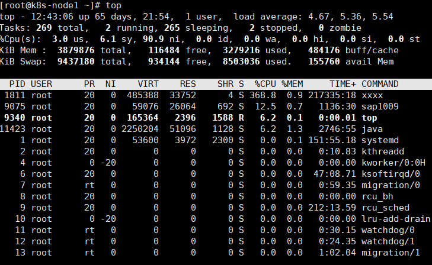

### lsof

根据端口port查看进程

```
lsof -i:port
```

### netstat命令

netstat -anp # 查看网络连接状态

-a或all 显示所有连接中的socket
-n或numeric 直接使用IP地址，而不通过域名服务器
-p或programs 显示程序名称
-t或tcp 显示TCP传输协议的连线情况

#### 查看端口号被哪个进程占领

netstat -nap | grep 8080

### ifconfig命令

查看和配置网络接口

### free命令

查看内存

```
free -h(humanic)
```

### systemctl

```
systemctl status serviceName 查看服务的详细信息
```

### 系统服务

```
/usr/lib/systemd/system/docker.service
```

### awk

awk用来**提取列的主要工具**；

echo "aa bb cc" | awk -F '{print $1}' 

 输出aa，一行一行的读取指定的文件， 以空格作为分隔符，打印第一个字段


awk '{print $2}' $fileName :

一行一行的读取指定的文件， 以空格作为分隔符，打印第二个字段

### 统计IP次数最多的

netstat -ntu | tail -n +3|**awk** '{ print $5}' | **cut** -d : -f 1 | sort | uniq -c| **sort** -n -r | head -n 5
8 127.0.0.1
2 192.168.47.27


tail -n +3 :去掉上面用红色标明的两行。

awk '{ print $5}'：取数据的低5域（第5列），上面蓝色标明。

cut -d : -f 1 ：取蓝色部分前面的IP部分。

sort：对IP部分进行排序。

uniq -c：打印每一重复行出现的次数。（并去掉重复行）

sort -n -r：按照重复行出现的次序倒序排列。

head -n 5：取排在前5位的IP 

```
$ netstat -ntu
Active Internet connections (w/o servers)
Proto Recv-Q Send-Q Local Address Foreign Address State
tcp 0 0 127.0.0.1:8152 127.0.0.1:4193 TIME_WAIT
tcp 0 0 127.0.0.1:8152 127.0.0.1:4192 TIME_WAIT
tcp 0 0 127.0.0.1:8152 127.0.0.1:4196 TIME_WAIT
tcp 0 0 127.0.0.1:8152 127.0.0.1:4199 TIME_WAIT
tcp 0 0 127.0.0.1:8152 127.0.0.1:4201 TIME_WAIT
tcp 0 0 127.0.0.1:8152 127.0.0.1:4204 TIME_WAIT
tcp 0 0 127.0.0.1:8152 127.0.0.1:4207 TIME_WAIT
```

### 关机命令

重启：shutdown -r 、reboot、init 6 

关机：shutdown -h 、 halt、init 0

#### 一、Linux 的五个关机重启命令

　　1、shutdown

　　2、poweroff

　　3、init

　　4、reboot

　　5、halt

#### 二、具体说明

　　在linux下一些常用的关机/重启命令有shutdown、halt、reboot、及init，它们都可以达到重启系统的目的，但每个命令的内部工作过程是不同的。

##### 　　1. shutdown

　　shutdown命令安全地将系统关机。 有些用户会使用直接断掉电源的方式来关闭linux，这是十分危险的。因为linux与windows不同，其后台运行着许多进程，所以强制关机可能会导致进程的数据丢失﹐使系统处于不稳定的状态﹐甚至在有的系统中会损坏硬件设备。而在系统关机前使用shutdown命令﹐系统管理员会通知所有登录的用户系统将要关闭。并且login指令会被冻结﹐即新的用户不能再登录。直接关机或者延迟一定的时间才关机都是可能的﹐还可能重启。这是由所有进程〔process〕都会收到系统所送达的信号〔signal〕决定的。这让像vi之类的程序有时间储存目前正在编辑的文档﹐而像处理邮件〔mail〕和新闻〔news〕的程序则可以正常地离开等等。

　　shutdown执行它的工作是送信号〔signal〕给init程序﹐要求它改变runlevel。

　　Runlevel 0被用来停机〔halt〕﹐runlevel 6是用来重新激活〔reboot〕系统﹐而runlevel 1则是被用来让系统进入管理工作可以进行的状态﹔这是预设的﹐假定没有-h也没有-r参数给shutdown。要想了解在停机〔halt〕或者重新开机〔reboot〕过程中做了哪些动作﹐你可以在这个文件/etc/inittab里看到这些runlevels相关的资料。

```
shutdown 参数说明:

　　[-t] 在改变到其它runlevel之前﹐告诉init多久以后关机。

　　[-r] 重启计算器。

　　[-k] 并不真正关机﹐只是送警告信号给每位登录者〔login〕。

　　[-h] 关机后关闭电源〔halt〕。

　　[-c] cancel current process取消目前正在执行的关机程序。所以这个选项当然没有时间参数﹐但是可以输入一个用来解释的讯息﹐而这信息将会送到每位使用者。

　　[-f] 在重启计算器〔reboot〕时忽略fsck。

　　[-F] 在重启计算器〔reboot〕时强迫fsck。

　　[-time] 设定关机〔shutdown〕前的时间。

```

##### 　　2.halt----最简单的关机命令

　　其实halt就是调用shutdown -h。halt执行时﹐杀死应用进程﹐执行sync系统调用﹐文件系统写操作完成后就会停止内核。

　　参数说明:

　　[-n] 防止sync系统调用﹐它用在用fsck修补根分区之后﹐以阻止内核用老版本的超级块〔superblock〕覆盖修补过的超级块。

　　[-w] 并不是真正的重启或关机﹐只是写wtmp〔/var/log/wtmp〕纪录。

　　[-d] 不写wtmp纪录〔已包含在选项[-n]中〕。

　　[-f] 没有调用shutdown而强制关机或重启。

　　[-i] 关机〔或重启〕前﹐关掉所有的网络接口。

　　[-p] 该选项为缺省选项。就是关机时调用poweroff。

##### 　　3.reboot

　　reboot的工作过程差不多跟halt一样﹐不过它是引发主机重启﹐而halt是关机。它 的参数与halt相差不多。

##### 　　4.init

```
语法：init(选项)(参数)

-b：不执行相关脚本而直接进入单用户模式；
-s：切换到单用户模式。

0 停机（千万不能把initdefault 设置为0）
1 单用户模式
2 多用户，没有 NFS(和级别3相似，会停止部分服务)
3 完全多用户模式
4 没有用到
5 x11(Xwindow)
6 重新启动（千万不要把initdefault 设置为6）

```

### 后台运行命令

```
   1. command & ： 后台运行，你关掉终端会停止运行
   2. nohup command & ： 后台运行，你关掉终端也会继续运行
```

### 批量杀进程

```
kill -9 `ps -ef | grep redis | awk '{print $2}'`

-9（SIGKILL）
ctrl+C 终止进程 SIGINT
ctrl+Z 暂停线程 SIGSTP
```

### grep

全局正则表达式搜索

```
grep -w 单词精确匹配
```

### 标准输入输出

```
0 标准输入
1 标准输出
2 标准错误输出

&>a.txt 表示将标准输出和标准错误输出重定向到文件a.txt中

2>&1  意思就很明了了，就是讲执行linux命令时的错误信息也输出到屏幕上。

/dev/null 黑洞文件，表示删除
2>/dev/null 表示将标准错误输出不显示

>/proc/self/fd/0       //表示标准输入，即键盘输入

/dev/stdout    ----->/proc/self/fd/1　　　 　//表示标准输出，即显示屏，屏幕

/dev/stderr     ----> /proc/self/fd/2      //表示标准错误输出，有些脚本运行时会报错，就会输入到这。
```

### 管道与xargs

```
管道：标准输出转为标准输入
xrgs：标准输出转为命令行输入
```

```
cat /etc/passwd | grep root  等于  grep root /etc/passwd
管道命令（|）。管道命令的作用，是将左侧命令（cat /etc/passwd）的标准输出转换为标准输入，提供给右侧命令（grep root）作为参数。
```

但是，大多数命令都不接受标准输入作为参数，只能直接在命令行输入参数，这导致无法用管道命令传递参数。

```
$ echo "hello world" | echo
```

上面的代码不会有输出。因为管道右侧的`echo`不接受管道传来的标准输入作为参数。

#### `xargs`命令的作用，是将标准输入转为命令行参数。

```
$ echo "hello world" | xargs echo
hello world
```

### shell默认变量($0、$1..)

$@


```

$#：脚本参数个数
$0：脚本文件名

$@：$1 $2 $3(推荐)
$*："$1" "$2" "$3"
	
$?：显示上一条命令的返回码，如果为0则代表执行成功。	

$$：脚本当前进程ID号
$!：后台运行的最后一个进程号

结合if-else语句实现判断上一个命令是否执行成功。
-eq
等于
-ne	不等于
-gt
大于
-lt	小于
ge	大于等于
le	小于等于
```

## MySQL

### union&union all

union会**排序和去重**（相当于distinct）


**Incorrect usage of UNION and ORDER BY。**

```
SELECT * FROM t1 WHERE username LIKE 'l%' ORDER BY score ASC
UNION
SELECT * FROM t1 WHERE username LIKE '%m%' ORDER BY score ASC
```

因为union在没有括号的情况下只能使用一个order by，即对两个union结果进行排序，即

```
SELECT * FROM t1 WHERE username LIKE 'l%'
UNION
SELECT * FROM t1 WHERE username LIKE '%m%' 
ORDER BY score ASC
```


### 合法标识符

以字母，下划线，**@和#**开头，

第二个还可以是**数字**，$

### 数据源

原生态：JDBC
封装：dbcp,c3p0,druid

#### 一、hirake连接池

spring默认使用，比druid快

#### 二、druid连接池

对SQL语句进行监控、拦截，可视化界面

```
DataSource ds = DruidDataSourceFactory.createDataSource(pro);
```

#### 三、C3P0连接池

1. 导入 `c3p0-0.9.5.5.jar`和`mchange-commons-java-0.2.19.jar`两个包
2. 定义配置文件，将`c3p0-config.xml`文件放在src目录下
3. 创建数据库连接池对象`ComboPooledDataSource`

mybaties默认使用pooled数据库连接池，可选的有unpool和jndi

### 为什么推荐使用自增主键

  InnoDB中，表中的数据是直接存储在**主键聚簇索引**的叶子节点上的，每插入一条记录，其实都是**增加一个叶子结点**，如果主键是顺序的，只需要把新增的一条记录存储在上一条记录的后面。当页达到最大填充因子的时候，下一条记录就会写入新的页中，这种情况下，主键页就会近似于被顺序的记录填满。
  若表的主键不是顺序的id，而是无规律数据，比如字符串，InnoDB无法简单的把一行记录插入到索引的最后，而是**需要找一个合适的位置（已有数据的中间位置），甚至产生大量的页分裂并且移动大量数据**；在寻找合适位置进行插入时，目标页可能不在内存中，这就导致了**大量的随机IO操作**，影响插入效率；除此之外，大量的页分裂会导致大量的**内存碎片**。

### 数据库约束

非空约束（not null）

唯一约束（unique）

主键约束（primary key）

外键约束（foreign key）、

检查约束（check）<Oracle 数据库有 check 约束>

### count(*)和count(1)

#### 不同存储引擎的性能不一样

我们不知道，Mysql常见的存储引擎有两种，MyISAM和Innodb，

在这两种存储引擎下，MySQL对于使用count(*)返回结果的流程是不一样的。

- 在MyISAM引擎中，每张表的**总行数是存储在磁盘上**，所以当执行count(*)时，是直接从磁盘**O(1)**拿到这个值返回，能够快速返回。但要是在后面加了where查询条件时，统计总数也不是像想象中那么快了。
- 在Innodb引擎中，执行count(*)，需要**将数据一行一行地读，再统计总数。**


看到这里，不知道你有没有这样的疑问：

> 为什么Innodb引擎不像MyISAM引擎一样把表总记录存储起来呢？


这个问题问得好，回答这个问题前，我们先了解下MVCC，

#### **什么是MVCC**

全称：Multi-Version Concurrency Control 即多版本并发控制，MVCC 是一种并发控制的方法，一般在数据库管理系统中，实现对数据库的并发访问；在编程语言中实现事务内存。


MVCC 在 MySQL InnoDB 中的实现主要是为了提高数据库并发性能，用更好的方式去处理读-写冲突，做到即使有读写冲突时，也能做到不加锁，非阻塞并发读。

就是因为要实现多版本并发控制，所以才导致Innodb不能直接存储表总记录数。

因为每个事务获取到的一致性视图都是不一样的，所以返回的数据总记录也是不一致的。

举个例子说明下：

假如有一张用户表tb_user, 有三处正在查询用户的总数。

```
select count(*) from tb_user
```


这时候每次查到的用户数总数可能不太一样。

这是因为每个用户**会根据read view存储的数据来判断哪些数据是自己可见的，哪些是不可见**的。

#### read view

当执行SQL语句查询时会产生一致性视图，即read-view，它是由查询的那一刻所有未提交事务ID组成的数组，和已经创建的最大事务ID组成的。


在这个数组中最小的事务ID被称之为min_id，

最大事务ID被称之为max_id，

而查询的数据结果就是根据read-view做对比从而得到快照。


于是就产生了以下的对比规则，这个规则就是使用当前的记录的trx_id跟read-view进行对比，规则如下：


- 如果落在trx_id<min_id，表示该版本是已经提交的事务生成的，由于事务已经提交所以数据是可见的
- 如果落在trx_id>max_id，表示该版本是由将来启动的事务生成的，是不可见的
- 如果落在trx_id 在min_id 和max_id 中间（min_id<=trx_id<=max_id）时

要是row的trx_id在数组中，表示该版本是由还没提交的事务生成的，不可见，但是当前自己的事务是可见的；

要是row的trx_id不在数组中，表明是提交的事务生成了该版本，是可见的。


读到这，相信你已经知道Innodb引擎为什么不像MyISAM引擎一样把表总记录存储起来了吧。因为 InnoDB 支持事务，MyISAM不支持事务。


在执行count(*)操作的时候还是做了优化的。

#### mysql对count(*)做了优化

自动找到最小的那一颗树进行比较。

InnoDB是索引组织表，主键索引树的叶子节点是数据，而普通索引树的叶子节点是主键值。所以，**普通索引树比主键索引树小很多**。对于count(*)这样的操作，遍历哪个索引树得到的结果逻辑上都是一样的。因此，MySQL优化器**会找到最小的那棵树来遍历**。


如果你使用过show table status 命令的话，就会发现这个命令的输出结果里面也有一个rows值用于显示这个表当前有多少行。


那么是不是这个rows值就能代替count(*)了吗？

其实不能，rows这个是从从采样估算得来的，因此它也是不是准确。不准确到什么程度，官方文档说是在40%到50%。所以show table status命令显示的行数rows是不能直接使用。


基于MySQL的Innodb存储引擎，统计表的总记录数下面这4种做法，哪种效率最高？

实践案例，准备了一张有 500W多条数据的表，表结构如下：


```
CREATE TABLE `tb_user` (`id` int(11) unsigned NOT NULL AUTO_INCREMENT,`user_id` int(11) DEFAULT NULL ,`user_name` varchar(100) DEFAULT NULL ,PRIMARY KEY (`id`) USING BTREE,UNIQUE KEY `userId` (`user_id`) USING BTREE) ENGINE=InnoDB AUTO_INCREMENT=1 DEFAULT CHARSET=utf8mb4
```

可以看到，这张表有一个主键索引，用不同方式来查询该表用户记录总数

- count(主键id)

用select count(*) from tb_user 耗时0.739s

InnoDB引擎会遍历整张表，**把每一行的id值都取出来**，返回给server层。server层拿到id后，判断是不可能为空的，就按行累加。

- count(1)

用select count(1) from tb_user 耗时0.753s

同样遍历整张表，但**不取值**，server层对返回的每一行，放一个数字1进去，判断是不可能为空的，按行累加。

- count(字段)

用select count(user_name) from tb_user 耗时1.436s

分为两种情况，字段定义为not null和null

1. 为not null时：逐行从记录里面读出这个字段，判断不能为null，累加
2. 为 null时：执行时，判断到有可能是null，**还要把值取出来再判断一下，不是null才累加**


- count(*)


用select count(*) from tb_user 耗时0.739s

需要注意的是，并不是带了*就把所有值取出来，而是mysql做了专门的优化，count(*)肯定不是null，按行累加。

从上面的执行结果，得知count(字段)<count(主键id)<count(1)≈count(*)

#### 总结

基于MySQL的Innodb存储引擎，统计表的总记录数按照效率排序的话count(字段)<count(主键id)<count(1)≈count(*)

效率最高是count(*),并不是count(1)

所以建议**尽量使用count(*)**.

### 存储过程&存储函数

mysql内部代码有四种：存储过程，存储函数，事件，触发器。 


#### 区别

1、存储过程必须**显示声明**参数为in、out、或inout；

存储函数不用声明，**所有参数隐式为in**

2、存储过程可以**返回零个或多个**返回值

存储函数**有且只能返回一个**

#### 调用

使用exec call begin进行调用

存储过程可以在三种环境下被调用：

1. command命令下，基本语法为：**exec** sp_name [参数名]；
2. SQL环境下，基本语法为：**call** sp_name [参数名]；
3. PL/SQL环境下，基本语法为：**begin** sp_name [参数名] end；

存储过程可封装并隐藏复杂的商业逻辑，可以包括程序流、逻辑以及对数据库的查询，
存储过程主要是在服务器上执行，减少对客户机的压力

##### 1、优点：

内部执行，离数据最近，另外在服务器上执行还可以**节省宽带和网络延迟**

**代码重用**，可以方便地统一业务规则，保证某些行为总是一致，也可以为应用提供一定的安全性。

简化代码的维护和版本更新。

帮助提升安全，提供更细颗粒度的权限控制。

缓存执行计划，如果反复调用可以降低消耗。

维护简单，没外部依赖更好在开发和数据库维护人员间分工。 

##### 2、缺点：

**有安全隐患**

mysql没有提供好的开发和调试工具，编写调试困难。

效率差，存储过程使用的函数有限，难以编写复杂的字符串维护功能，也难以实现太复杂的逻辑。

部署带来额外的复杂性。

带来额外的内部存储代码。

给服务器带来额外压力

mysql没有资源消耗控制进程，如果存储过程发生错误，可能直接把服务器拖死。

调试困难。  

### 触发器

#### 触发器概述

触发器是捆绑在基表上的**预编译**后存储在数据库中的一系列**SQL语句集**,通过这些SQL语句集系统自动执行相应的数据库操作,可以有效地保证数据库的完整性.
触发器不能被用户直接调用执行,它只能**由事件触发而自动执行**.

触发器由3个部分组成:

1. 事件: 对数据库的一些操作, 比如对表的修改、删除、添加等操作
2. 条件: 触发器执行前先对条件进行检查，满足条件则触发相应的操作
3. 动作: 如果触发器检查满足预定的条件, 则由DBMS执行这些动作

#### 触发器的优点

触发器是**自动执行**的, 它可以通过数据库中的相关表实现级联更新, 实现多个表之间数据的**一致性和完整性**
触发器可以实现比CHECK约束更为复杂的数据完整性约束
触发器也可以评估数据修改前后的表状态, 并根据其差异采取对策
触发器的创建
触发器是被绑定在数据表上的, 因此**只能为某张表创建**触发器:

```
create trigger 触发器名 触发时间 触发事件 on 表名 for each row
begin
触发程序
end;
```

参数说明:

触发器名: 符合标识符命名规范, 建议加前缀或者后缀"_trigger"
触发时间: 触发器的触发时间有两种: BEFORE与AFTER
触发事件: MySQL的触发事件有三种:
insert: 将新纪录插入表时激活触发程序
update: 更改某一行记录时激活触发程序
delete: 从表中删除某一行记录时激活触发程序
表名: 当前数据库中的数据表
for each row: 表示行级触发器(MySQL目前仅支持行级触发器),for each row表示更新操作影响的每一行记录都会执行一次触发程序

#### 触发器的工作过程

触发器被创建时, 可以**使用两个对象OLD对象和NEW对象**.
OLD对象是只读的, 可以引用它, 但不能更改它。
在BEFORE触发程序中，可使用"set new.column_name = value"更改NEW记录的值。

insert触发器的工作过程
在向已建有insert触发器的数据表插入数据时, insert触发器被触发执行, 当向表插入新记录时, 系统会将刚才的新纪录写入NEW对象中, NEW对象可以看作是一张逻辑表, 由系统在触发器激发时自动创建.一旦触发器执行结束, 该NEW对象就自动地被删除. 当需要访问新记录的某个字段时, 使用"NEW.字段名"的方式访问.

delete触发器的工作过程
删除具有delete触发器的表中的数据时, delete触发器被触发执行, 在删除数据行的同时, 系统会自动地把刚删除的数据行写入OLD对象中. 与NEW对象一样, OLD对象也可以看作一张逻辑表, 由系统在触发器激活时自动创建. 一旦触发器执行结束, 该OLD对象就自动地被删除. 当需要访问旧记录的某个字段值时, 使用"OLD.字段名"的方式访问.

update触发器的工作过程
修改表中的数据可以看作是由两个步骤完成的操作: 删除一条旧记录, 然后再插入新记录, 即先执行一条delete语句, 再执行一条insert语句. 所以, 对建有update触发器的表中的数据进行修改时, 系统会自动地将旧记录写入OLD对象中, 将新记录写入NEW对象中. 然后, 通过OLD和NEW对象中的数据完成触发程序
MySQL可以使用复合数据类型SET或者ENUM对字段的取值范围进行检查约束，使用复合数据类型可以实现离散的字符串数据的检查约束，对于数值型的数据不建议使用SET或者ENUM实现检查约束，可以使用触发器实现。

#### 触发器的使用

使用触发器删除关联数据

```
use choose;
alter table choose drop foreign key choose_student_fk;
alter table choose add constraint student_course_fk
foreign key(学号) references student(学号) on delete cascade;
-- 级联删除即删除包含主键值的行的操作,
-- 该值由其它表的现有行中的外键列引用.
-- 在级联删除中,还删除其外键值引用删除的主键值的所有行.
-- 如果InnoDB引擎存储的数据表之间仅存在外键约束, 不存在级联选项, 这时触发器也能实现关联数据的删除操作.

-- 当student表中有学生被删除时,触发删除包含该学号的行的操作
delimiter $$
create trigger s_trigger before delete on student
for each row
begin
delete from choose where 学号=old.学号;
end;$$
delimiter ;
```

使用触发器更新数据

```
-- 触发器更新数据
use choose;
alter table course add 可选人数 int default 3;

-- 当有学生选修了某门课程时,该课程的可选人数值要减1
delimiter $$
create trigger ch_trigger before insert on choose
for each row
begin
update course set 可选人数=可选人数-1 where 课程号=new.课程号;
end;$$
delimiter ;
```

```
-- 当学生退课时,该课程的可选人数值要加1
delimiter $$
create trigger cho_trigger before delete on choose
for each row
begin
update course set 可选人数=可选人数+1 where 课程号=old.课程号;
end;$$
delimiter ;
```


使用触发器实现check约束

```
delimiter $$
create trigger s1_trigger before insert on student
for each row
begin
if(year(now()) - year(new.出生日期) <= 30) then
set new.出生日期 = new.出生日期;
else insert into mytable values(0);
-- mytable用于提示错误
end if;
end;$$
delimiter ;

use book_management;
create table aa(a int, b int);

delimiter $$
create trigger a1 before insert on aa
for each row
begin
if new.a < 10 then set new.a = new.a;
else insert mytable values(0);
end if;
end;$$
delimiter ;
```


#### 查看触发器的定义

使用show triggers\G命令查看触发器的定义
查询information schema数据库中的triggers表,查看触发器的定义.
select * from information_schema.triggers\G
使用show create trigger 触发器名称\G命令来查看触发器定义.
创建触发器后,MySQL自动在数据库目录下创建TRN以及TRG触发器文件,以记事本方式打开这些文件,可以查看触发器的定义.

#### 删除触发器

使用drop trigger语句将该触发器删除,语法格式如下:
drop trigger 触发器名称;

#### 使用触发器的注意事项

MySQL的触发器**只支持行级触发**，不支持语句级触发

使用对象OLD对象和NEW对象引用触发器中的内容

如果是面向用户的高并发应用，都不要使用。

触发程序中如果包含select语句, 该select语句**不能返回结果集**.
同一个表不能创建两个具有相同触发时间、触发事件的触发程序(一个表最多设置6种类型的触发器).
触发程序**不能使用以显式或隐式方式打开、开始或结束事务的语句**.
批量更新记录时,引入触发器会**导致更新操作性能降低**.
MyISAM引擎中, 触发器不能保证原子性(指事务的不可分割性,一个事务的所有操作要么不间断地全部被执行，要么一个也没有执行。). **InnoDB存储引擎支持事务,触发程序和更新操作是在同一个事务里完成.**
InnoDB存储引擎实现外键约束关系时,建议使用级联选项(on delete/update cascade)来维护外键数据;MyISAM引擎虽然不支持外键约束关系, 但可以使用触发器实现级联修改和级联删除, 进而维护外键数据, 模拟实现外键约束关系.
使用触发器维护InnoDB外键约束的级联选项时,应该先维护子表的数据再维护父表的数据.
**MySQL的触发程序不能对本表使用更新语句(例如update语句)**.触发程序中的更新操作可以直接使用set代替, 否则可能出现错误信息, 甚至出现死循环.
before触发程序中,auto_increment字段的new值为0,不是实际插入新纪录时自动生成的自增型字段值.
添加触发器后,建议对其进行详细的测试.
触发程序不能对本表使用更新语句(例如update语句).触发程序中的更新操作可以直接使用set代替, 否则可能出现错误信息, 甚至出现死循环.

1.存储过程需要显式调用，意思是阅读源码的时候你能知道存储过程的存在，而触发器必须在数据库端才能看到，容易被忽略。
2.Mysql的触发器本身不是很好，比如after delete无法链式反应的问题。

MySQL直接删除表会将表上的触发器一并删除掉

InnoDB引擎表的Trigger中的操作如果失败,则触发的操作本身也会失败

https://blog.csdn.net/weixin_45726908/article/details/124845693


```
关于MySQL触发器,下面描述正确的是(A,B)
A.MySQL直接删除表会将表上的触发器一并删除掉
B.InnoDB引擎表的Trigger中的操作如果失败,则触发的操作本身也会失败
C.Trigger可以实现较为较为特殊的逻辑,几乎和编程语言一样，所以在程序开发里面应该尽可能多的使用Trigger 错误
D.InnoDB引擎表，Trigger中的事务可以先提交,即使外部事务回滚也不会回滚 错误
```


##### 1、优点：

减少客户端和服务端之间的通信

简化应用逻辑

提高性能

可用于自动更新反范式化数据或者汇总汇总表数据。 

##### 2、缺点：

功能有限。

对于**每一个表的每一个时间，最多只能定义一个触发器**。

Mysql**只支持“基于行的触发”**——所以说，**触发器是针对一条记录的**。而不是针对整个sql语句的，如果更变的数据集非常大的话，效率会很低。而且触发器会掩盖服务器背后的工种，影响潜在效率，对性能排查造成阻碍。

触发器问题难以排查，尤其是性能问题

触发器可能导致死锁和锁等待，如果触发器失败，sql执行也会失败。

触发器并不能保证更新原子性。

### 事件

在Mysql内部实现通常把复杂代码封装成存储过程再通过call来调用事件在一个独立事件调度进程中被初始化，这个线程和处理链接的线程没有任何关系。不接受常数也没有返回值。

用于定期维护任务。

### SQL子类

1. DDL（数据定义语言）
    DDL 主要是指如下的四种SQL 语句，以 CREATE、DROP、ALRET开头和 TRUNCATE TABLE 语句。这里主要说一下 TRUNCATE TABLE ，截断表的数据，也就是删除表中的数据，删除这些数据的时候，系统不做日志，因此无法恢复，删除的速度比较快；而DELETE 语句也是删除表中的记录，但它要写日志，删除的数据可以恢复，数据量大的时候删除比较慢。

2. DML（数据操纵语言）
    它们是SELECT、UPDATE、INSERT、DELETE，就象它的名字一样，这4条命令是用来对数据库里的数据进行操作的语言。

3. DQL（数据查询语言）
    例如：SELECT语句

4. TCL（事务处理语言）
    事物处理语言是指提交、回滚和保留点3句SQL，既是commit、rollback和savepoint。事务是指一系列的连续的不可分割的数据库操作，这些操作要么同时成功，要么同时失败。oracle 的默认事务模型是显式事务模型，即执行完DML后必须手动提交或回滚。

5. DCL（数据控制语言）
    是指授予权限和回收权限语句，既是grant、revoke、deny 等语句。

### MyCat

#### server.xml

```xml
<?xml version="1.0" encoding="UTF-8"?>
<!DOCTYPE mycat:server SYSTEM "server.dtd">
<mycat:server xmlns:mycat="http://io.mycat/">
	<system>
	<property name="nonePasswordLogin">0</property> <!-- 0为需要密码登陆、1为不需要密码登陆 ,默认为0，设置为1则需要指定默认账户-->
	<property name="useHandshakeV10">1</property>
	<property name="useSqlStat">0</property>  <!-- 1为开启实时统计、0为关闭 -->
	<property name="useGlobleTableCheck">0</property>  <!-- 1为开启全加班一致性检测、0为关闭 -->

		<property name="sequnceHandlerType">2</property>
	<property name="subqueryRelationshipCheck">false</property> <!-- 子查询中存在关联查询的情况下,检查关联字段中是否有分片字段 .默认 false -->
      <!--  <property name="useCompression">1</property>--> <!--1为开启mysql压缩协议-->
        <!--  <property name="fakeMySQLVersion">5.6.20</property>--> <!--设置模拟的MySQL版本号-->
	<!-- <property name="processorBufferChunk">40960</property> -->
	<!-- 
	<property name="processors">1</property> 
	<property name="processorExecutor">32</property> 
	 -->
        <!--默认为type 0: DirectByteBufferPool | type 1 ByteBufferArena | type 2 NettyBufferPool -->
		<property name="processorBufferPoolType">0</property>
		<!--默认是65535 64K 用于sql解析时最大文本长度 -->
		<!--<property name="maxStringLiteralLength">65535</property>-->
		<!--<property name="sequnceHandlerType">0</property>-->
		<!--<property name="backSocketNoDelay">1</property>-->
		<!--<property name="frontSocketNoDelay">1</property>-->
		<!--<property name="processorExecutor">16</property>-->
		<!--
			<property name="serverPort">8066</property> <property name="managerPort">9066</property> 
			<property name="idleTimeout">300000</property> <property name="bindIp">0.0.0.0</property> 
			<property name="frontWriteQueueSize">4096</property> <property name="processors">32</property> -->
		<!--分布式事务开关，0为不过滤分布式事务，1为过滤分布式事务（如果分布式事务内只涉及全局表，则不过滤），2为不过滤分布式事务,但是记录分布式事务日志-->
		<property name="handleDistributedTransactions">0</property>
		
			<!--
			off heap for merge/order/group/limit      1开启   0关闭
		-->
		<property name="useOffHeapForMerge">1</property>

		<!--
			单位为m
		-->
        <property name="memoryPageSize">64k</property>

		<!--
			单位为k
		-->
		<property name="spillsFileBufferSize">1k</property>

		<property name="useStreamOutput">0</property>

		<!--
			单位为m
		-->
		<property name="systemReserveMemorySize">384m</property>


		<!--是否采用zookeeper协调切换  -->
		<property name="useZKSwitch">false</property>

		<!-- XA Recovery Log日志路径 -->
		<!--<property name="XARecoveryLogBaseDir">./</property>-->

		<!-- XA Recovery Log日志名称 -->
		<!--<property name="XARecoveryLogBaseName">tmlog</property>-->
		<!--如果为 true的话 严格遵守隔离级别,不会在仅仅只有select语句的时候在事务中切换连接-->
		<property name="strictTxIsolation">false</property>
		
		<property name="useZKSwitch">true</property>
		
	</system>
	
	<!-- 全局SQL防火墙设置 -->
	<!--白名单可以使用通配符%或着*-->
	<!--例如<host host="127.0.0.*" user="root"/>-->
	<!--例如<host host="127.0.*" user="root"/>-->
	<!--例如<host host="127.*" user="root"/>-->
	<!--例如<host host="1*7.*" user="root"/>-->
	<!--这些配置情况下对于127.0.0.1都能以root账户登录-->
	<!--
	<firewall>
	   <whitehost>
	      <host host="1*7.0.0.*" user="root"/>
	   </whitehost>
       <blacklist check="false">
       </blacklist>
	</firewall>
	-->

	<user name="root" defaultAccount="true">
		<property name="password">123456</property>
		<property name="schemas">TESTDB</property>
		
		<!-- 表级 DML 权限设置 -->
		<!-- 		
		<privileges check="false">
			<schema name="TESTDB" dml="0110" >
				<table name="tb01" dml="0000"></table>
				<table name="tb02" dml="1111"></table>
			</schema>
		</privileges>		
		 -->
	</user>

	<user name="user">
		<property name="password">user</property>
		<property name="schemas">TESTDB</property>
		<property name="readOnly">true</property>
	</user>

</mycat:server>

```

#### schema.xml

```xml
<?xml version="1.0"?>
<!DOCTYPE mycat:schema SYSTEM "schema.dtd">
<mycat:schema xmlns:mycat="http://io.mycat/">

	<schema name="TESTDB" checkSQLschema="false" sqlMaxLimit="100">
		<!-- auto sharding by id (long) -->
		<table name="travelrecord" dataNode="dn1,dn2,dn3" rule="auto-sharding-long" />

		<!-- global table is auto cloned to all defined data nodes ,so can join
			with any table whose sharding node is in the same data node -->
		<table name="company" primaryKey="ID" type="global" dataNode="dn1,dn2,dn3" />
		<table name="goods" primaryKey="ID" type="global" dataNode="dn1,dn2" />
		<!-- random sharding using mod sharind rule -->
		<table name="hotnews" primaryKey="ID" autoIncrement="true" dataNode="dn1,dn2,dn3"
			   rule="mod-long" />
		<!-- <table name="dual" primaryKey="ID" dataNode="dnx,dnoracle2" type="global"
			needAddLimit="false"/> <table name="worker" primaryKey="ID" dataNode="jdbc_dn1,jdbc_dn2,jdbc_dn3"
			rule="mod-long" /> -->
		<table name="employee" primaryKey="ID" dataNode="dn1,dn2"
			   rule="sharding-by-intfile" />
		<table name="customer" primaryKey="ID" dataNode="dn1,dn2"
			   rule="sharding-by-intfile">
			<childTable name="orders" primaryKey="ID" joinKey="customer_id"
						parentKey="id">
				<childTable name="order_items" joinKey="order_id"
							parentKey="id" />
			</childTable>
			<childTable name="customer_addr" primaryKey="ID" joinKey="customer_id"
						parentKey="id" />
		</table>
		<!-- <table name="oc_call" primaryKey="ID" dataNode="dn1$0-743" rule="latest-month-calldate"
			/> -->
	</schema>
	<!-- <dataNode name="dn1$0-743" dataHost="localhost1" database="db$0-743"
		/> -->
	<dataNode name="dn1" dataHost="localhost1" database="db1" />
	<dataNode name="dn2" dataHost="localhost1" database="db2" />
	<dataNode name="dn3" dataHost="localhost1" database="db3" />
	<!--<dataNode name="dn4" dataHost="sequoiadb1" database="SAMPLE" />
	 <dataNode name="jdbc_dn1" dataHost="jdbchost" database="db1" />
	<dataNode	name="jdbc_dn2" dataHost="jdbchost" database="db2" />
	<dataNode name="jdbc_dn3" 	dataHost="jdbchost" database="db3" /> -->
	<dataHost name="localhost1" maxCon="1000" minCon="10" balance="0"
			  writeType="0" dbType="mysql" dbDriver="native" switchType="1"  slaveThreshold="100">
		<heartbeat>select user()</heartbeat>
		<!-- can have multi write hosts -->
		<writeHost host="hostM1" url="localhost:3306" user="root"
				   password="123456">
			<!-- can have multi read hosts -->
			<readHost host="hostS2" url="192.168.1.200:3306" user="root" password="xxx" />
		</writeHost>
		<writeHost host="hostS1" url="localhost:3316" user="root"
				   password="123456" />
		<!-- <writeHost host="hostM2" url="localhost:3316" user="root" password="123456"/> -->
	</dataHost>
	<!--
		<dataHost name="sequoiadb1" maxCon="1000" minCon="1" balance="0" dbType="sequoiadb" dbDriver="jdbc">
		<heartbeat> 		</heartbeat>
		 <writeHost host="hostM1" url="sequoiadb://1426587161.dbaas.sequoialab.net:11920/SAMPLE" user="jifeng" 	password="jifeng"></writeHost>
		 </dataHost>

	  <dataHost name="oracle1" maxCon="1000" minCon="1" balance="0" writeType="0" 	dbType="oracle" dbDriver="jdbc"> <heartbeat>select 1 from dual</heartbeat>
		<connectionInitSql>alter session set nls_date_format='yyyy-mm-dd hh24:mi:ss'</connectionInitSql>
		<writeHost host="hostM1" url="jdbc:oracle:thin:@127.0.0.1:1521:nange" user="base" 	password="123456" > </writeHost> </dataHost>

		<dataHost name="jdbchost" maxCon="1000" 	minCon="1" balance="0" writeType="0" dbType="mongodb" dbDriver="jdbc">
		<heartbeat>select 	user()</heartbeat>
		<writeHost host="hostM" url="mongodb://192.168.0.99/test" user="admin" password="123456" ></writeHost> </dataHost>

		<dataHost name="sparksql" maxCon="1000" minCon="1" balance="0" dbType="spark" dbDriver="jdbc">
		<heartbeat> </heartbeat>
		 <writeHost host="hostM1" url="jdbc:hive2://feng01:10000" user="jifeng" 	password="jifeng"></writeHost> </dataHost> -->

	<!-- <dataHost name="jdbchost" maxCon="1000" minCon="10" balance="0" dbType="mysql"
		dbDriver="jdbc"> <heartbeat>select user()</heartbeat> <writeHost host="hostM1"
		url="jdbc:mysql://localhost:3306" user="root" password="123456"> </writeHost>
		</dataHost> -->
</mycat:schema>
```

#### rule.xml

```xml
<?xml version="1.0" encoding="UTF-8"?>
<!DOCTYPE mycat:rule SYSTEM "rule.dtd">
<mycat:rule xmlns:mycat="http://io.mycat/">
	<tableRule name="rule1">
		<rule>
			<columns>id</columns>
			<algorithm>func1</algorithm>
		</rule>
	</tableRule>

	<tableRule name="rule2">
		<rule>
			<columns>user_id</columns>
			<algorithm>func1</algorithm>
		</rule>
	</tableRule>

	<tableRule name="sharding-by-intfile">
		<rule>
			<columns>sharding_id</columns>
			<algorithm>hash-int</algorithm>
		</rule>
	</tableRule>
	<tableRule name="auto-sharding-long">
		<rule>
			<columns>id</columns>
			<algorithm>rang-long</algorithm>
		</rule>
	</tableRule>
	<tableRule name="mod-long">
		<rule>
			<columns>id</columns>
			<algorithm>mod-long</algorithm>
		</rule>
	</tableRule>
	<tableRule name="sharding-by-murmur">
		<rule>
			<columns>id</columns>
			<algorithm>murmur</algorithm>
		</rule>
	</tableRule>
	<tableRule name="crc32slot">
		<rule>
			<columns>id</columns>
			<algorithm>crc32slot</algorithm>
		</rule>
	</tableRule>
	<tableRule name="sharding-by-month">
		<rule>
			<columns>create_time</columns>
			<algorithm>partbymonth</algorithm>
		</rule>
	</tableRule>
	<tableRule name="latest-month-calldate">
		<rule>
			<columns>calldate</columns>
			<algorithm>latestMonth</algorithm>
		</rule>
	</tableRule>
	
	<tableRule name="auto-sharding-rang-mod">
		<rule>
			<columns>id</columns>
			<algorithm>rang-mod</algorithm>
		</rule>
	</tableRule>
	
	<tableRule name="jch">
		<rule>
			<columns>id</columns>
			<algorithm>jump-consistent-hash</algorithm>
		</rule>
	</tableRule>

	<function name="murmur"
		class="io.mycat.route.function.PartitionByMurmurHash">
		<property name="seed">0</property><!-- 默认是0 -->
		<property name="count">2</property><!-- 要分片的数据库节点数量，必须指定，否则没法分片 -->
		<property name="virtualBucketTimes">160</property><!-- 一个实际的数据库节点被映射为这么多虚拟节点，默认是160倍，也就是虚拟节点数是物理节点数的160倍 -->
		<!-- <property name="weightMapFile">weightMapFile</property> 节点的权重，没有指定权重的节点默认是1。以properties文件的格式填写，以从0开始到count-1的整数值也就是节点索引为key，以节点权重值为值。所有权重值必须是正整数，否则以1代替 -->
		<!-- <property name="bucketMapPath">/etc/mycat/bucketMapPath</property> 
			用于测试时观察各物理节点与虚拟节点的分布情况，如果指定了这个属性，会把虚拟节点的murmur hash值与物理节点的映射按行输出到这个文件，没有默认值，如果不指定，就不会输出任何东西 -->
	</function>

	<function name="crc32slot"
			  class="io.mycat.route.function.PartitionByCRC32PreSlot">
	</function>
	<function name="hash-int"
		class="io.mycat.route.function.PartitionByFileMap">
		<property name="mapFile">partition-hash-int.txt</property>
	</function>
	<function name="rang-long"
		class="io.mycat.route.function.AutoPartitionByLong">
		<property name="mapFile">autopartition-long.txt</property>
	</function>
	<function name="mod-long" class="io.mycat.route.function.PartitionByMod">
		<!-- how many data nodes -->
		<property name="count">3</property>
	</function>

	<function name="func1" class="io.mycat.route.function.PartitionByLong">
		<property name="partitionCount">8</property>
		<property name="partitionLength">128</property>
	</function>
	<function name="latestMonth"
		class="io.mycat.route.function.LatestMonthPartion">
		<property name="splitOneDay">24</property>
	</function>
	<function name="partbymonth"
		class="io.mycat.route.function.PartitionByMonth">
		<property name="dateFormat">yyyy-MM-dd</property>
		<property name="sBeginDate">2015-01-01</property>
	</function>
	
	<function name="rang-mod" class="io.mycat.route.function.PartitionByRangeMod">
        	<property name="mapFile">partition-range-mod.txt</property>
	</function>
	
	<function name="jump-consistent-hash" class="io.mycat.route.function.PartitionByJumpConsistentHash">
		<property name="totalBuckets">3</property>
	</function>
</mycat:rule>

```


### 排序函数

SQL中有三种排序函数
1、row_number() over(order by 列名)
2、rank() over(order by 列名)
3、dense_rank() over(order by 列名)

row_number():**不考虑数据的重复性**，按照顺序一次打上标号
如：1 2 3 4

rank():是**跳跃排序**
如：1 2 2 4,会跳过3

dense_rank():是**连续排序**，考虑数据的重复性
如：1 2 2 3 序号连续


```
#  1 2 3 4 不在乎相等的情况一直排
select  row_number() over (order by decimal_test) ,t1.* from t1;

# 1 2 2 4 跳跃
select  rank() over (order by decimal_test),t1.* from t1;

# 1 2 2 3 不跳跃
select  dense_rank() over (order by decimal_test),t1.* from t1;

# 现要查询排名在20之后的学生信息并加入排名s_rank（不包括第20名，分数相同则并列排名，排名不间断）
select * from (select *,dense_rank()  over (order by decimal_test) r from t1) d_rank where d_rank.r>2;
```

### 日期加减

**1. addtime()**　　

为日期加上指定秒数

```
select addtime(now(),1); -- 加1秒
```

**2. adddate()**　　

有两种用法，第二个参数直接填数字的话是为日期加上指定天数，填interval的话是为日期加上指定的interval时间

```
select adddate(now(),1); -- 加1天``select adddate(now(), interval 1 day); -- 加1天``select adddate(now(), interval 1 hour); --加1小时``select adddate(now(), interval 1 minute); -- 加1分钟``select adddate(now(), interval 1 second); -- 加1秒``select adddate(now(), interval 1 microsecond); -- 加1毫秒``select adddate(now(), interval 1 week); -- 加1周``select adddate(now(), interval 1 month); -- 加1月``select adddate(now(), interval 1 quarter); -- 加1季``select adddate(now(), interval 1 year); -- 加1年
```

**4. subtime()**　　

为日期减去指定秒数

```
select subtime(now(), 1); -- 减1秒
```

**5. subdate()**　　

与adddate()函数用法一致，有两种用法，第二个参数直接填数字的话是为日期减去指定天数，填interval的话是为日期减去指定的interval时间

```
select subdate(now(),1); -- 减1天``select subdate(now(), interval 1 day); -- 减1天``select subdate(now(), interval 1 hour); --减1小时``select subdate(now(), interval 1 minute); -- 减1分钟``select subdate(now(), interval 1 second); -- 减1秒``select subdate(now(), interval 1 microsecond); -- 减1毫秒``select subdate(now(), interval 1 week); -- 减1周``select subdate(now(), interval 1 month); -- 减1月``select subdate(now(), interval 1 quarter); -- 减1季``select subdate(now(), interval 1 year); -- 减1年
```

### intersect&minus

https://www.yiibai.com/sql/sql-minus.html

mysql应该没有这样的语法

intersect：交集

minus：差集


### docker

1、首先需要拉取对应镜像

```
docker pull mysql:8.0.26
```

2、然后需要在宿主机上创建对应的文件夹用于容易挂载，易于管理MySQL配置文件等，（当前操作目录是在/home下），创建mysql目录并进入创建conf，data两个目录

```
mkdir -p mysql && cd $_ && mkdir {conf,data}
```

3、创建我们的my.cnf文件，放在我们刚刚创建的conf下面

```
# http://dev.mysql.com/doc/mysql/en/server-system-variables.html

[mysqld]

pid-file = /var/run/mysqld/mysqld.pid

socket = /var/run/mysqld/mysqld.sock

datadir = /var/lib/mysql

secure-file-priv= NULL

# Disabling symbolic-links is recommended to prevent assorted security risks

symbolic-links=0

# Custom config should go here

!includedir /etc/mysql/conf.d/

max_connections=1000
wait_timeout=120
interactive_timeout=300

lower_case_table_names=1
```

4、开始创建MySQL容器

```
docker run  -d --name mysql8 -p 3406:3306 -v /opt/module/mysql8/conf/my.cnf:/etc/mysql/my.cnf -v /opt/module/mysql8/data:/var/lib/mysql -e MYSQL_ROOT_PASSWORD=root mysql:8.0.26

#--restart=unless-stopped
```

5、目前mysql容器启动成功以后，我们远程连接还是会报错的，由于加密规则问题，我们需要进入到mysql中进行修改加密规则以及更新用户密码再刷新一下权限即可

```
docker exec -it mysql /bin/bash
mysql -uroot -p
```

输入mysql容器创建时指定的密码（-e MYSQL_ROOT_PASSWORD=root）：root

```
use mysql
ALTER USER 'root'@'localhost' IDENTIFIED BY '新密码' PASSWORD EXPIRE NEVER;
ALTER USER 'root'@'localhost' IDENTIFIED WITH mysql_native_password BY '新密码';
FLUSH PRIVILEGES;
```

注意：此处修改的是root的localhost方式，可以查看是否可以远程连接，如果不能，可继续设置如下  

```
ALTER USER 'root'@'%' IDENTIFIED BY '新密码' PASSWORD EXPIRE NEVER;
ALTER USER 'root'@'%' IDENTIFIED WITH mysql_native_password BY '新密码';
```

### SQL执行顺序 


```sql
from <left table>
on <on_condition>
<join_type> join <join_table>
where <where_condition>
group by <group_by_list>
<sum()avg()等聚合函数>
having <having_condition>
select <select_list>
distinct
order by <order_by_condition>
limit <limit_number>
```


第一步：加载from子句的前两个表计算笛卡尔积，生成虚拟表vt1；

第二步：筛选关联表符合on表达式的数据，保留主表，生成虚拟表vt2；

第三步：如果使用的是外连接，执行on的时候，会将主表中不符合on条件的数据也加载进来，做为外部行

第四步：如果from子句中的表数量大于2，则重复第一步到第三步，直至所有的表都加载完毕，更新vt3；

第五步：执行where表达式，筛选掉不符合条件的数据生成vt4；

第六步：执行group by子句。group by 子句执行过后，会对子句组合成唯一值并且对每个唯一值只包含一行，生成vt5,。一旦执行group by，后面的所有步骤只能得到vt5中的列（group by的子句包含的列）和聚合函数。

第七步：执行聚合函数，生成vt6；

第八步：执行having表达式，筛选vt6中的数据。having是唯一一个在分组后的条件筛选，生成vt7;

第九步：从vt7中筛选列，生成vt8；

第十步：执行distinct，对vt8去重，生成vt9。其实执行过group by后就没必要再去执行distinct，因为分组后，每组只会有一条数据，并且每条数据都不相同。

第十一步：对vt9进行排序，此处返回的不是一个虚拟表，而是一个游标，记录了数据的排序顺序，此处可以使用别名；

第十二步：执行limit语句，将结果返回给客户端

 

```sql
select <select_list>
from <table_name>
<join_type> join <join_table> on <join_condition>
where <where_condition>
group by <group_by_list>
having <having_condition>
order by <order_by_condition>
limit <limt_number>
```


#### 1、on和where的区别

简单地说，当有外关联表时，on主要是针对外关联表进行筛选，主表保留，当没有关联表时，二者作用相同。

例如在左外连时，首先执行on，筛选掉外连表中不符合on表达式的数据，而where的筛选是对主表的筛选。

### in&exist

or可以使用union代替。

in 一般可以用**exists**去优化或者使用**连接**去优化

in子查询一般是使用memory引擎（hash索引）建立了一个临时表，但结果集不要太多，否则会变成基于磁盘的存储引擎（B+）。

```
in子查询里面一定得是小表，效率比exist高，因为使用in外表是大表可以用到索引，in()里面只执行一次，先执行子查询放到临时表中，再去查询外表和内表进行匹配。

假设子查询B表是小表，效率高
select * from A where cc in (select cc from B) 用到了A表上cc列的索引；

select * from A where exists(select cc from B where cc=A.cc) 效率低，大表A是全表扫描，只用到了小表B表上cc列的索引。 

not in和not exists比较，not exists效率一定比not in高，因为not in都是全表扫描，not exists可能用到索引
```

### 关联子查询

```
select prod_name,
(select sum(quantity) from OrderItems a where a.prod_id=b.prod_id)quant_sold
from Products b
```

关联子查询与下面的内连接效果一样，不用使用join和group

```
select prod_name, sum(quantity) from OrderItems,Products where OrderItems.prod_id = Products.prod_id group by prod_name
```

#### `关联子查询`和`普通子查询`的区别在于：

1，`关联子查询`引用了外部查询的列。

2，执行顺序不同。对于普通子查询，先执行普通子查询，再执行外层查询；而对于**关联子查询，先执行外层查询**（因为要用到外部的数据），然后对所有通过过滤条件的记录执行内层查询。

语法：

```sql
SELECT column1, column2
FROM table1 AS outer
WHERE column1 operator
      (SELECT column1, column2
       FROM table2
       WHERE expr1 = outer.expr2);
123456
```

**在关联子查询中，对于外部查询返回的每一行数据，内部查询都要执行一次。另外，在关联子查询中是信息流是双向的，外部查询的每行数据传递一个值给子查询，然后子查询为每一行数据执行一次并返回它的记录。然后，外部查询根据返回的记录做出决策。**

关联子查询的用途：

#### 1，在细分的组内进行比较

例子：查询各个商品种类中高于该商品种类平均销售价格的商品信息

```sql
SELECT * 
FROM t_commodity AS t1
WHERE sell_unit_price > (
       SELECT AVG(sell_unit_price) 
       FROM t_commodity
       WHERE category = t1.category
)
1234567
```

#### 2，和`EXISTS`或`NOT EXISTS`配合使用，查询存在或不存在的记录

例子：查询没有下过订单的所有顾客的信息

```sql
SELECT customer_id
FROM customers AS c
WHERE NOT EXISTS (
      SELECT customer_id
      FROM orders
      WHERE customer_id = c.customer_id
)
1234567
```

### 数据类型

> mysql数据类型有：BOOL、TINY INT、INT、BIG INT、FLOAT、DOUBLE、DECIMAL、CHAR、VARCHAR、TINY TEXT、TEXT、Date、DateTime、TimeStamp、Year等等。


#### 一、MySQL的数据类型

主要包括以下五大类：

整数类型：BIT、BOOL、TINY INT、SMALL INT、MEDIUM INT、 INT、 BIG INT

浮点数类型：FLOAT、DOUBLE、DECIMAL

字符串类型：CHAR、VARCHAR、TINY TEXT、TEXT、MEDIUM TEXT、LONGTEXT、TINY BLOB、BLOB、MEDIUM BLOB、LONG BLOB

日期类型：Date、DateTime、TimeStamp、Time、Year

其他数据类型：BINARY、VARBINARY、ENUM、SET、Geometry、Point、MultiPoint、LineString、MultiLineString、Polygon、GeometryCollection等

**1、整型**

| MySQL数据类型 | 含义（有符号）                       |
| ------------- | ------------------------------------ |
| tinyint(m)    | 1个字节 范围(-128~127)               |
| smallint(m)   | 2个字节 范围(-32768~32767)           |
| mediumint(m)  | 3个字节 范围(-8388608~8388607)       |
| int(m)        | 4个字节 范围(-2147483648~2147483647) |
| bigint(m)     | 8个字节 范围(+-9.22*10的18次方)      |

取值范围如果加了unsigned，则最大值翻倍，如tinyint unsigned的取值范围为(0~256)。

int(m)里的m是表示SELECT查询结果集中的显示宽度，并不影响实际的取值范围，没有影响到显示的宽度，不知道这个m有什么用。

**2、浮点型(float和double)**

| MySQL数据类型 | 含义                                          |
| ------------- | --------------------------------------------- |
| float(m,d)    | 单精度浮点型 8位精度(4字节) m总个数，d小数位  |
| double(m,d)   | 双精度浮点型 16位精度(8字节) m总个数，d小数位 |

设一个字段定义为float(6,3)，如果插入一个数123.45678,实际数据库里存的是123.457，但总个数还以实际为准，即6位。整数部分最大是3位，如果插入数12.123456，存储的是12.1234，如果插入12.12，存储的是12.1200.

**3、定点数**

浮点型在数据库中存放的是近似值，而定点类型在数据库中存放的是精确值。

decimal(m,d) 参数m<65 是总个数，d<30且 d<m 是小数位。

**4、字符串(char,varchar,_text)**

| MySQL数据类型 | 含义                            |
| ------------- | ------------------------------- |
| char(n)       | 固定长度，最多255个字符         |
| varchar(n)    | 固定长度，最多65535个字符       |
| tinytext      | 可变长度，最多255个字符         |
| text          | 可变长度，最多65535个字符       |
| mediumtext    | 可变长度，最多2的24次方-1个字符 |
| longtext      | 可变长度，最多2的32次方-1个字符 |

char和varchar：

1.char(n) 若存入字符数小于n，则以**空格补于其后**，查询之时再将空格去掉。所以**char类型存储的字符串末尾不能有空格**，varchar不限于此。

2.char(n) 固定长度，char(4)不管是存入几个字符，都将占用4个字节，varchar是存入的实际字符数+1个字节（n<=255）或2个字节(n>255)，

所以char(4),存入3个字符将占用4个字节。

3.char类型的**字符串检索速度要比varchar类型的快**。


varchar和text：

1.varchar可指定n，text不能指定，内部存储varchar是存入的实际字符数+1个字节（n<=255）或2个字节(n>255)，text是实际字符数+2个字

节。

2.text类型不能有默认值。

3.varchar可直接创建索引，text创建索引要指定前多少个字符。varchar查询速度快于text,在都创建索引的情况下，text的索引似乎不起作用。

**5.二进制数据(_Blob)**

1._BLOB和_text存储方式不同，_TEXT以文本方式存储，英文存储区分大小写，而_Blob是以二进制方式存储，不分大小写。

2._BLOB存储的数据只能整体读出。

3._TEXT可以指定字符集，_BLO不用指定字符集。

**6.日期时间类型**

| MySQL数据类型 | 含义                          |
| ------------- | ----------------------------- |
| date          | 日期 '2008-12-2'              |
| time          | 时间 '12:25:36'               |
| datetime      | 日期时间 '2008-12-2 22:06:44' |
| timestamp     | 自动存储记录修改时间          |

若定义一个字段为timestamp，这个字段里的时间数据会随其他字段修改的时候自动刷新，所以这个数据类型的字段可以存放这条记录最后被修改的时间。

数据类型的属性

| MySQL关键字        | 含义                     |
| ------------------ | ------------------------ |
| NULL               | 数据列可包含NULL值       |
| NOT NULL           | 数据列不允许包含NULL值   |
| DEFAULT            | 默认值                   |
| PRIMARY KEY        | 主键                     |
| AUTO_INCREMENT     | 自动递增，适用于整数类型 |
| UNSIGNED           | 无符号                   |
| CHARACTER SET name | 指定一个字符集           |

#### 二、MYSQL数据类型的长度和范围

各数据类型及字节长度一览表：

| 数据类型           | 字节长度 | 范围或用法                                                   |
| ------------------ | -------- | ------------------------------------------------------------ |
| Bit                | 1        | 无符号[0,255]，有符号[-128,127]，天缘博客备注：BIT和BOOL布尔型都占用1字节 |
| TinyInt            | 1        | 整数[0,255]                                                  |
| SmallInt           | 2        | 无符号[0,65535]，有符号[-32768,32767]                        |
| MediumInt          | 3        | 无符号[0,2^24-1]，有符号[-2^23,2^23-1]]                      |
| Int                | 4        | 无符号[0,2^32-1]，有符号[-2^31,2^31-1]                       |
| BigInt             | 8        | 无符号[0,2^64-1]，有符号[-2^63 ,2^63 -1]                     |
| Float(M,D)         | 4        | 单精度浮点数。天缘博客提醒这里的D是精度，如果D<=24则为默认的FLOAT，如果D>24则会自动被转换为DOUBLE型。 |
| Double(M,D)        | 8        | 双精度浮点。                                                 |
| Decimal(M,D)       | M+1或M+2 | 未打包的浮点数，用法类似于FLOAT和DOUBLE，天缘博客提醒您如果在ASP中使用到Decimal数据类型，直接从数据库读出来的Decimal可能需要先转换成Float或Double类型后再进行运算。 |
| Date               | 3        | 以YYYY-MM-DD的格式显示，比如：2009-07-19                     |
| Date Time          | 8        | 以YYYY-MM-DD HH:MM:SS的格式显示，比如：2009-07-19 11：22：30 |
| TimeStamp          | 4        | 以YYYY-MM-DD的格式显示，比如：2009-07-19                     |
| Time               | 3        | 以HH:MM:SS的格式显示。比如：11：22：30                       |
| Year               | 1        | 以YYYY的格式显示。比如：2009                                 |
| Char(M)            | M        | 定长字符串。                                                 |
| VarChar(M)         | M        | 变长字符串，要求M<=255                                       |
| Binary(M)          | M        | 类似Char的二进制存储，特点是插入定长不足补0                  |
| VarBinary(M)       | M        | 类似VarChar的变长二进制存储，特点是定长不补0                 |
| Tiny Text          | Max:255  | 大小写不敏感                                                 |
| Text               | Max:64K  | 大小写不敏感                                                 |
| Medium Text        | Max:16M  | 大小写不敏感                                                 |
| Long Text          | Max:4G   | 大小写不敏感                                                 |
| TinyBlob           | Max:255  | 大小写敏感                                                   |
| Blob               | Max:64K  | 大小写敏感                                                   |
| MediumBlob         | Max:16M  | 大小写敏感                                                   |
| LongBlob           | Max:4G   | 大小写敏感                                                   |
| Enum               | 1或2     | 最大可达65535个不同的枚举值                                  |
| Set                | 可达8    | 最大可达64个不同的值                                         |
| Geometry           |          |                                                              |
| Point              |          |                                                              |
| LineString         |          |                                                              |
| Polygon            |          |                                                              |
| MultiPoint         |          |                                                              |
| MultiLineString    |          |                                                              |
| MultiPolygon       |          |                                                              |
| GeometryCollection |          |                                                              |

#### 三、使用建议

1、在指定数据类型的时候一般是**采用从小原则**，比如能用TINY INT的最好就不用INT，能用FLOAT类型的就不用DOUBLE类型，这样会对MYSQL在运行效率上提高很大，尤其是大数据量测试条件下。

2、不需要把数据表设计的太过复杂，功能模块上区分或许对于后期的维护更为方便，慎重出现大杂烩数据表

3、数据表和字段的起名字也是一门学问

4、设计数据表结构之前请先想象一下是你的房间，或许结果会更加合理、高效

5、数据库的最后设计结果一定是效率和可扩展性的折中，偏向任何一方都是欠妥的

#### 选择数据类型的基本原则

前提：使用适合存储引擎。

选择原则：根据选定的存储引擎，确定如何选择合适的数据类型。

下面的选择方法按存储引擎分类：

- MyISAM 数据存储引擎和数据列：MyISAM数据表，最好使用固定长度(CHAR)的数据列代替可变长度(VARCHAR)的数据列。
- MEMORY存储引擎和数据列：MEMORY数据表目前都使用固定长度的数据行存储，因此无论使用CHAR或VARCHAR列都没有关系。两者都是作为CHAR类型处理的。
- InnoDB 存储引擎和数据列：建议使用 VARCHAR类型。

对于**InnoDB数据表，内部的行存储格式没有区分固定长度和可变长度列**（所有数据行都使用指向数据列值的头指针），因此在本质上，使用固定长度的CHAR列不一定比使用可变长度VARCHAR列简单。因而，**主要的性能因素是数据行使用的存储总量**。由于CHAR平均占用的空间多于VARCHAR，因 此**使用VARCHAR来最小化需要处理的数据行的存储总量和磁盘I/O是比较好的**。

下面说一下固定长度数据列与可变长度的数据列。

#### text和blob

在使用text和blob字段类型时要注意以下几点，以便更好的发挥数据库的性能。

①BLOB和TEXT值也会引起自己的一些问题，特别是执行了大量的删除或更新操作的时候。删除这种值会在数据表中留下很大的"空洞"，以后填入这些"空洞"的记录可能长度不同,为了提高性能,建议定期使用 OPTIMIZE TABLE 功能对这类表进行碎片整理.

②使用合成的（synthetic）索引。合成的索引列在某些时候是有用的。一种办法是根据其它的列的内容建立一个散列值，并把这个值存储在单独的数据列中。接下来你就可以通过检索散列值找到数据行了。但是，我们要注意这种技术只能用于精确匹配的查询（散列值对于类似<或>=等范围搜索操作符 是没有用处的）。我们可以使用MD5()函数生成散列值，也可以使用SHA1()或CRC32()，或者使用自己的应用程序逻辑来计算散列值。请记住数值型散列值可以很高效率地存储。同样，如果散列算法生成的字符串带有尾部空格，就不要把它们存储在CHAR或VARCHAR列中，它们会受到尾部空格去除的影响。

合成的散列索引对于那些BLOB或TEXT数据列特别有用。用散列标识符值查找的速度比搜索BLOB列本身的速度快很多。

③在不必要的时候避免检索大型的BLOB或TEXT值。例如，SELECT *查询就不是很好的想法，除非你能够确定作为约束条件的WHERE子句只会找到所需要的数据行。否则，你可能毫无目的地在网络上传输大量的值。这也是 BLOB或TEXT标识符信息存储在合成的索引列中对我们有所帮助的例子。你可以搜索索引列，决定那些需要的数据行，然后从合格的数据行中检索BLOB或 TEXT值。

④把BLOB或TEXT列分离到单独的表中。在某些环境中，如果把这些数据列移动到第二张数据表中，可以让你把原数据表中 的数据列转换为固定长度的数据行格式，那么它就是有意义的。这会减少主表中的碎片，使你得到固定长度数据行的性能优势。它还使你在主数据表上运行 SELECT *查询的时候不会通过网络传输大量的BLOB或TEXT值。

#### 浮点数与定点数

为了能够引起大家的重视，在介绍浮点数与定点数以前先让大家看一个例子：

mysql> CREATE TABLE test (c1 float(10,2),c2 decimal(10,2));

``Query OK, 0 rows affected (0.29 sec)``

mysql> insert into test values(**131072.32,131072.32**);

``Query OK, 1 row affected (0.07 sec)``

mysql> select * from test;

``+-----------+-----------+``| c1    | c2    |``+-----------+-----------+``| **131072.31 | 131072.32** |``+-----------+-----------+``1 row in set (0.00 sec)

从上面的例子中我们看到c1列的值由131072.32变成了131072.31，这就是**浮点数的不精确性造成**的。

在mysql中float、double（或real）是浮点数，**decimal（或numberic）是定点数**。

浮点数相对于定点数的优点是在长度一定的情况下，浮点数能够表示更大的数据范围；它的缺点是会引起精度问题。在今后关于浮点数和定点数的应用中，大家要记住以下几点：

1. 浮点数存在误差问题；
2. 对货币等对精度敏感的数据，应该用定点数表示或存储；
3. 编程中，如果用到浮点数，要特别注意误差问题，并尽量避免做浮点数比较；
4. 要注意浮点数中一些特殊值的处理。


- 

```
int(11) 不影响实际存储的范围，实际还是用4个字节去存储
只有一个字段设置了无符号和填充0属性，长度不够才会填充0，长度超过11也是失效的

decimal(10,3)表示共有7位整数3位小数，此例的精确度为10位
```


### char与varchar

#### 区别

varchar是变长字段，需要使用**一个或两个字节存储长度**（当允许存储的最大字节数MW（字符长度*每个字符需要的字节）大于255字节且真实字节数超过127字节时使用2字节，否则使用1字节），所以varchar也要按需分配

varchar会有**内存碎片**问题（比如把200长度**更新**为50），如果一个行占用的空间增长，并且在页内没有更多的空间可以存储，在这种情况下InnoDB需要分裂页来使行可以放进页内，这样会增加碎片。内存碎片容易造成**空间浪费**和**磁盘IO读写性能下降**，因为数据更加随机分散。

char的检索效率会更高

char尾部空格不会存储，不足长度会空格填充，检索的时候会调用trim删除尾部的空格

varchar尾部会存储空格，不足不会补空格


下面的表显示了将各种字符串值保存到CHAR(4)和VARCHAR(4)列后的结果，说明了CHAR和VARCHAR之间的差别：

| 值         | CHAR(4) | 存储需求 | VARCHAR(4) | 存储需求 |
| ---------- | ------- | -------- | ---------- | -------- |
| ''         | ' '     | 4个字节  | ''         | 1个字节  |
| 'ab'       | 'ab '   | 4个字节  | 'ab '      | 3个字节  |
| 'abcd'     | 'abcd'  | 4个字节  | 'abcd'     | 5个字节  |
| 'abcdefgh' | 'abcd'  | 4个字节  | 'abcd'     | 5个字节  |

请注意上表中最后一行的值只适用*不使用严格模式*时；如果MySQL运行在严格模式，超过列长度不的值不保存，并且会出现错误。

从CHAR(4)和VARCHAR(4)列检索的值并不总是相同，因为**检索时从CHAR列删除了尾部的空格**。通过下面的例子说明该差别：

mysql> CREATE TABLE vc (v VARCHAR(4), c CHAR(4));

mysql> INSERT INTO vc VALUES (``'ab '``, ``'ab '``);

mysql> SELECT CONCAT(v, ``'+'``), CONCAT(c, ``'+'``) FROM vc;


#### 适用场景

**CHAR适合存储很短的字符串，或者所有值都接近同一个长度**。例如，CHAR非常适合存储密码的MD5值，因为这是一个定长的值。对于**经常变更的数据**，CHAR也比VARCHAR更好，因为**定长的CHAR类型不容易产生碎片**。对于非常短的列，CHAR比VARCHAR在存储空间上也更有效率。例如用CHAR(1)来存储只有Y和N的值，如果采用单字节字符集只需要一个字节，但是VARCHAR(1)却需要两个字节，因为还有一个记录长度的额外字节。


VARCHAR适合**字符串很长或者所要存储的字符串长短不一，差别很大**；字符串列的**最大长度比平均长度大得多**；**列的更新很少，所以碎片不是问题。**


### Innodb行格式

**默认使用Dynamic**，类似于Compact，只不过**溢出列**有点不同：Compact会只前768字节和指向其他页的地址，

而Dynamic把所有的数据都存到移除页中；

Compact会把变长字段如varchar类型会加入到**变长字段列表**，并且有**null值列表**（使用位标识null值）

Compact、Redundant、Dynamic和Compressed

### 常见sql

```
# 表复制，MySQL仅支持:
create table t3 select * from t2;

不支持select * into new_table from old_table


select id into @id from t2 where id=1;
select @id;

# 建表语句
create table if not exists test.user
(
	id int auto_increment
		primary key,
	username varchar(56) not null,
	password varchar(20) charset latin1 null,
	birthday datetime null,
	score decimal null,
	index idx_name(username),
	unique key uni_key(username),
	foreign key(username) references sys_user(username)
)engine InnoDb,auto_increment=1,charset=utf8;


# 查询选修了所有课程的学生学号和所属部门
# 等价于查询不存在一门课这个学生没选
select s.stu_name,s.stu_department from tb_student s
where not exists (
    select 1 from tb_course c # true表示有一门课该学生没有选
    where not exists(
        select 1 from tb_score where course_id=c.course_id and stu_id=s.stu_id
        )
    )
    
    
# 查询“001”课程比“002”课程成绩高的所有学生的学号;
select * from tb_student s
where exists(
    select 1 from tb_score sc1 where s.stu_id=sc1.stu_id and sc1.course_id=1 and exists(
        select 1 from tb_score sc2 where s.stu_id=sc2.stu_id and sc2.course_id=2 and sc1.score<sc2.score
        )
          );

select a.stu_id from (select * from tb_score s1 where s1.course_id=1) a ,(select * from tb_score s2 where s2.course_id=2) b
where a.stu_id=b.stu_id and a.score<b.score;

# 查询没学过“叶平”老师课的同学的学号、姓名
select * from tb_student s where exists(
    select 1 from tb_course c where c.course_id=1 and not exists( # 选择课程2并且该学生没有选
        select 1 from tb_score sc where sc.course_id=c.course_id and sc.stu_id=s.stu_id
        )
    );
select * from tb_student s where s.stu_id not in (
    select distinct sc.stu_id from tb_course c,tb_score sc where c.course_id=1 and c.course_id=sc.course_id
    );
    
# 查询学过“叶平”老师所教的所有课的同学的学号、姓名;=》不存在一门叶老师的课该学生没有学过
select * from tb_student s where not exists(
    select 1 from tb_course c where c.tea_id=1 and not exists( # 找出叶老师的课并且不存在改选手没选过
        select 1 from tb_score sc where c.course_id=sc.course_id and sc.stu_id=s.stu_id
        ));

select * from tb_student s where s.stu_id in (
    select sc.stu_id from tb_score sc ,tb_course c where sc.course_id=c.course_id and c.tea_id=1 group by sc.stu_id
    having count(*) =(select count(*) from tb_course where tea_id=1)
    );
```

### 复制原理

```
1.主库数据发生改变时使用binlog dump线程写进bin_log
2.从库定期探测主库的bin_log发生变化后
启动IO线程读取主库的binlog,写到relay log中继日志中
再用SQL thread重放binlog同步数据。
```


### 读写分离

核心：重写AbstractRoutingDataSource的获取key的determineCurrentLookupKey方法

AbstractRoutingDataSource中调用determineTargetDataSource()获取数据源，它又是调用determineCurrentLookupKey()得到数据源的key。那么我们只需重写determineCurrentLookupKey()方法即可

```java
// AbstractRoutingDataSource#determineTargetDataSource()

protected DataSource determineTargetDataSource() {
   Assert.notNull(this.resolvedDataSources, "DataSource router not initialized");
   Object lookupKey = determineCurrentLookupKey();
   DataSource dataSource = this.resolvedDataSources.get(lookupKey);
   if (dataSource == null && (this.lenientFallback || lookupKey == null)) {
      dataSource = this.resolvedDefaultDataSource;
   }
   if (dataSource == null) {
      throw new IllegalStateException("Cannot determine target DataSource for lookup key [" + lookupKey + "]");
   }
   return dataSource;
}
```

于是继承AbstractRoutingDataSource重写获取key的方法determineCurrentLookupKey()

```java
    // 重写获取key方法determineCurrentLookupKey
    @Override
    protected Object determineCurrentLookupKey() {
        DataSourceTypeEnum databaseType = DataSourceContextHolder.getDatabaseType();
        int i;
        List<Map<String, String>> mastersources = dataSourceProperties.getMastersources();
        List<Map<String, String>> slavesources = dataSourceProperties.getSlavesources();
        if(databaseType.equals(DataSourceTypeEnum.DATA_SOURCE_MASTER))
            // 随机获取主数据源
            i= ThreadLocalRandom.current().nextInt(mastersources.size())%mastersources.size();
        else
            i= ThreadLocalRandom.current().nextInt(slavesources.size())%slavesources.size();
        return databaseType.getName()+i; //
    }
```

aop拦截dao层的方法,动态切换数据源

```java
@Aspect
@Slf4j
public class DataSourceAspect {
    private static final String[] queryStrs={"query","select","get"};

    @Pointcut("execution(* com.hu.health.member.dao.*.*(..))")
    public void executeSql(){}

    @Before("executeSql()")
    public void doBefore(JoinPoint joinPoint){
        MethodSignature methodSignature = (MethodSignature) joinPoint.getSignature();
        String mName = methodSignature.getMethod().getName();
        log.info("拦截的sql方法：{}",mName);
        DataSourceContextHolder.setDatabaseType(DataSourceTypeEnum.DATA_SOURCE_MASTER); // 默认master
        for (String queryStr : queryStrs) {
            if(mName.startsWith(queryStr)){
                log.info("查询语句，设置数据源为slave");
                DataSourceContextHolder.setDatabaseType(DataSourceTypeEnum.DATA_SOURCE_SLAVE);
                break;
            }
        }
        log.info("当前数据源是：{}",DataSourceContextHolder.getDatabaseType().getName());
    }
}
```


```
  # 配置读写分离主从数据源
  mastersources:
    -  driverClassName: com.mysql.cj.jdbc.Driver
       url: jdbc:mysql://114.132.44.209:3306/health_ums?useUnicode=true&characterEncoding=UTF-8&useSSL=false&serverTimezone=Asia/Shanghai
       username: root
       password: root
       type: com.alibaba.druid.pool.DruidDataSource

  slavesources:
    - driverClassName: com.mysql.cj.jdbc.Driver
      url: jdbc:mysql://114.132.44.209:3307/health_ums?useUnicode=true&characterEncoding=UTF-8&useSSL=false&serverTimezone=Asia/Shanghai
      username: root
      password: root
      type: com.alibaba.druid.pool.DruidDataSource
```


### 视图

视图不能检索，因为没有主键和索引，也没有关联的触发器、默认值等，本质只是一张查看和存放的表，另外只保存视图的定义规则

### 索引下推

https://blog.csdn.net/qq_32979219/article/details/122791064

```
减少回表次数
idx(name,age)
比如select * from t where name='tt%' and age=10
不会用到age索引，开启索引下推后，在二级索引查询到满足tt%的时候，不会直接去聚簇索引查找，而是先判断age是否满足，满足了再回表。

总结：不会减少二级索引扫描的行，但能减少回表的次数，提前过滤不满足另一个索引的记录
```

### 适合建立索引？

答：1.为经常出现order by 、group by、distinct后的字段添加索引

2、在union等集合操作的结果集字段上建立索引

3、经常做查询的字段建立索引

4、经常用在表连接上的字段建立索引

### sql优化步骤

show **status** like '%%'; # 查看各种统计信息，慢查询，连接数，增删改查次数
show **processlist**; # 查看当前执行sql的锁等待状态等

**explain** sql; # 查看执行计划

show **profiles** ; # 查看执行耗时
show profile cpu for query 29; # 查看cpu损耗

**trace**; # 分析优化器执行计划

**慢查询日志**

https://www.yisu.com/zixun/265232.html


### 打开慢查询日志

慢查询日志，顾名思义就是记录执行比较慢查询的日志。

查看是否开启慢查询日志：

```
show variables like '%slow%';
```


打开慢查询日志。修改MySQL的配置文件my.cn一般是在/etc目录下面，加上下面三行配置后重启MySQL。

```
slow_query_log = ON
slow_launch_time = 2 slow_query_log_file = /usr/local/mysql/data/slow_query.log
```

slow_launch_time只能精确到秒，如果需要更精确可以使用一些第三方的工具比如后面介绍的pt-query-digest。


**注意：**我这里用的MySQL版本是5.6，不同版本的MySQL开启慢查询的配置是不同的，比如5.6之前的某些版本是ong_query_time, long_query_time和log-slow-queries。可以先在终端执行**show variables like '%slow%';**查看下当前版本具体配置是什么。

也可以在终端通过设置全局变量来打开慢查询日志：

```
set  @@global.slow_query_log = ON;
```

### 慢查询日志分析

1、可以使用MySQL自带的mysqldumpslow工具。使用很简单，可以跟-help来查看具体的用法。

```
# -s：排序方式。c , t , l , r 表示记录次数、时间、查询时间的多少、返回的记录数排序；
#                             ac , at , al , ar 表示相应的倒叙；
# -t：返回前面多少条的数据；
# -g：包含什么，大小写不敏感的；
mysqldumpslow -s r -t 10 /slowquery.log     #slow记录最多的10个语句
mysqldumpslow -s t -t 10 -g "left join" /slowquery.log     #按照时间排序前10中含有"left join"的
```

2、可以导到mysql.slow_query表中，然后通过sql语句进行分析。

3、使用第三方工具，Percona Toolkit

###  索引种类

#### 一、键索引

#### 二、唯一索引

#### 三、普通索引

#### 四、联合索引

#### 五、前缀索引

**对文本的前几个字符建立索引**

一方面可以**节约索引空间**，另一方面则可以**提高索引效率**

索引覆盖失效：由于前缀索引在命中以后，必须再**回主键索引树确定一次**，所以**索引覆盖对前缀索引来说是无效**的。
回表次数多：使用前缀索引后，可能会导致查询语句**回表次数**变多。

```
alter table t2 add index prefix_idx(common_field(2)); #创建
select count(distinct left(common_field,2))/count(common_field) from t2; # 计算前缀索引的相似度
```

索引覆盖失效：由于前缀索引在命中以后，必须再回主键索引树确定一次，所以索引覆盖对前缀索引来说是无效的。
回表次数多：使用前缀索引后，可能会导致查询语句读数据的次数变多。

innodb 主键索引：指向数据行 二级索引指向主键值

isam 没区别


### 索引失效

**运算** 

**通配符** 

**跳过联合索引（最左匹配原则）** 

**范围查询** **、**

**字符串得加‘’（）因为会自动类型转换，索引失效**

**使用覆盖索引**

**Or** **也会失效**

**In****走索引** **not in****不走索引** 

 使用join代替子查询，因为子查询会建立临时表

**Order by****使用有序字段，不然会****filesort** **尽量使用主键返回数据**  

**Group by****默认会排序，可使用** **order by null**

**Join****替代子查询**

#### 隐式转换

**官方文档描述**
两个参数至少有一个是NULL时，比较的结果也是NULL，特殊的情况是使用<=>对两个NULL做比较时会返回1，这两种情况都不需要做类型转换
两个参数都是字符串，会按照字符串来比较，不做类型转换
两个参数都是整数，按照整数来比较，不做类型转换
十六进制的值和非数字做比较时，会被当做二进制串
有一个参数是TIMESTAMP或DATETIME，并且另外一个参数是常量，常量会被转换为timestamp
有一个参数是decimal类型，如果另外一个参数是decimal或者整数，会将整数转换为decimal后进行比较，如果另外一个参数是浮点数，则会把decimal转换为浮点数进行比较
所有其他情况下，两个参数都会被转换为浮点数再进行比较

**准备数据**
准备以下字段的表，并且为num1建立索引。

```
CREATE TABLE `type` (
  `id` bigint(20) NOT NULL,
  `name` varchar(255) DEFAULT NULL,
  `num1` varchar(255) DEFAULT NULL,
  `num2` int(11) DEFAULT NULL,
  PRIMARY KEY (`id`),
  KEY `index_num1` (`num1`) USING BTREE
) ENGINE=InnoDB DEFAULT CHARSET=utf8;
```


**查询数据**
方式一

```
SELECT * FROM type WHERE num1 = 1000
```

复制代码
注意：这是num1是varchar类型，而查询的时候给的where条件是1000的整形。

这时查询得到的数据时包含其他脏数据的。


explain分析查询语句，结果走了全表扫描。


方式二

在对num1字段的where语句拼接上单引号后查询的结果和我们预期一样。

```
SELECT * FROM type WHERE num1 = '1000'
```

复制代码


explain分析查询语句，结果走了索引，索引生效了。


那么这个字符串隐式转换的规则是什么呢？为什么num1='1000a'、'01000'和'1000'这三种情形都能匹配上呢？查阅相关资料发现规则如下：

不以数字开头的字符串都将转换为0。如'abc'、'a123bc'、'abc123'都会转化为0；
以数字开头的字符串转换时会进行截取，从第一个字符截取到第一个非数字内容为止。比如'123abc'会转换为123，'012abc'会转换为012也就是12，'5.3a66b78c'会转换为5.3，其他同理。
验证结果

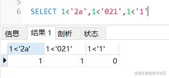

**结论**
当操作符左右两边的数据类型不一致时，会发生隐式转换。
当 where 查询操作符左边为数值类型时发生了隐式转换，那么对效率影响不大，但还是不推荐这么做。
当 where 查询操作符左边为字符类型时发生了隐式转换，那么会导致索引失效，造成全表扫描效率极低。
字符串转换为数值类型时，**非数字开头的字符串会转化为0**，**以数字开头的字符串会截取从第一个字符到第一个非数字内容为止的值为转化结果**。
所以，我们在写 SQL 时一定要养成良好的习惯，查询的字段是什么类型，等号右边的条件就写成对应的类型。特别当查询的字段是字符串时，等号右边的条件一定要**用引号引起来标明这是一个字符串**，否则会造成索引失效触发全表扫描。

### 事务实现原理

#### 一、ACID如何实现

·    事务的原子性是通过 undo log 来实现的 回滚日志

·    事务的持久性性是通过 redo log 来实现的

·    事务的隔离性是通过 (读写锁+MVCC)来实现的

·    而事务的终极大 boss 一致性是通过原子性，持久性，隔离性来实现的！！！

#### 二、隔离级别

##### 1、读未提交

可以读取到未提交的数据，会出现脏读问题

##### 2、读已提交

只能读取到已提交的数据，但是由于是当前读（每次**生成新的ReadView**）,所以产生不可重复读

##### 3、可重复读

**只生成一次ReadView**，所有可重复读。但是会有幻读问题，可通过next-key锁解决

##### 4、串行化

#### 三、MVCC（实现隔离级别）

##### 1、readView一致性视图

当前活跃事务列表（m_ids），最小事务id（max_tx_id），最大事务id（min_tx_id）

##### 2、版本链roll_pointer

聚簇索引两个隐藏列：最新的事务id（tx_id）和回滚日志版本指针（roll_pointer）

##### 3、MVCC如何工作（如何判断是否可读？）

如果tx_id小于min_tx_id，那么说明已提交了，那么可读

如果tx_id大于等于max_tx_id，说明事务是创建当前ReadView之后才生成的，那么对当前事务不可见

如果tx_id在min_tx_id和max_tx_id之间，需要判断是否在ReadView中活跃事务列表m_ids中，如果是，说明依然活跃，那么对当前不可见，否则，对当前事务可见。


如果当前版本不可读，那么会沿着回滚指针往前找旧的版本，知道对当前可读。


对于读已提交来说，由于每次都是生成新的一致性视图，所以事务提交后从活跃事务列表m_ids中移除了事务，对当前可读，导致出现了不可重读问题。

对于可重复读来说，只生成一次一致性视图，所以活跃事务列表m_ids不会改变，所以可以重复读

update是当前读

#### undo_log(回滚日志)

原子性，回滚到原来的样子

增删改记录对应的undo_log，undo log 会写入 Buffer Pool 中的 Undo 页面

#### redo_log(重做日志)

崩溃恢复，保证事务做的修改和undo_log做的修改不丢失

循环写（到检查点的时候就要阻塞刷盘了）

在内存修改该 Undo 页面后，需要记录对应的 redo log。

buffer pool修改的时候也要记录redo_log

刷盘策略，为减少IO操作，不会立即刷盘，有后台线程在合适的时间写入磁盘


> 事务没提交的时候，redo log 会被持久化到磁盘吗？

**会的。**

事务执行中间过程的 redo log 也是直接写在 redo log buffer 中的，这些缓存在 redo log buffer 里的 redo log 也会被「后台线程」每隔一秒一起持久化到磁盘。

也就是说，事务没提交的时候，redo log 也是可能被持久化到磁盘的。

有的同学可能会问，如果 mysql 崩溃了，还没提交事务的 redo log 已经被持久化磁盘了，mysql 重启后，数据不就不一致了？

放心，这种情况 mysql 重启会进行回滚操作，因为事务没提交的时候，binlog 是还没持久化到磁盘的。

所以， redo log 可以在事务没提交之前持久化到磁盘，但是 binlog 必须在事务提交之后，才可以持久化到磁盘。

保存在`ib_logfile`中

[博客](https://www.cnblogs.com/qianyuliang/p/9916372.html)

#### bin_log

前面介绍的 undo log 和 redo log 这两个日志都是 **Innodb 存储引擎**生成的。

MySQL 在完成一条更新操作后，Server 层还会生成一条 binlog，等之后事务提交的时候，会将该事物执行过程中产生的所有 binlog 统一写 入 binlog 文件。

binlog 文件是记录了**所有数据库表结构变更和表数据修改的日志**，不会记录查询类的操作，比如 SELECT 和 SHOW 操作。

> 为什么有了 binlog， 还要有 redo log？

这个问题跟 MySQL 的时间线有关系。

最开始 MySQL 里并没有 InnoDB 引擎，MySQL 自带的引擎是 MyISAM，但是 MyISAM 没有 crash-safe 的能力，binlog 日志只能用于归档。

而 InnoDB 是另一个公司以插件形式引入 MySQL 的，既然只依靠 binlog 是没有 crash-safe 能力的，所以 InnoDB 使用 redo log 来实现 crash-safe 能力。


追加写

记录更新完后，记录bin_log

statement

row

mix

用于备份恢复和主从复制，属于server层，所有存储引擎都可以使用

### 常用命令

```
查看你mysql版本
select version();

查看表的统计信息
show table status like 'table_name' \G
```

### InnoDB和MyISAM区别

innodb支持事务，外键，行锁。

**MyISAM插入查询比较快**。

为什么插入快，因为索引和数据是分开的，因此只需要维护B树索引，数据直接按顺序插入即可；

为什么查询快，同样是因为索引和数据是分开的，因此索引存放的就是数据的地址，而InnoDB还得从聚簇索引找。

### B+树

https://mp.weixin.qq.com/s/A5gNVXMNE-iIlY3oofXtLw

首先就是B树非叶子结点存数据，那么相同数据量的情况下自然高度变高。高端变高，对应就是**磁盘IO**提高。因此，B+树能更加矮胖。

另外，B+树支持范围查询，数据全部存放在叶子节点

B树非叶子结点存放数据，平均查找速度快，但是返回数据有限，相同数据量情况下，磁盘IO性能更低。

1). n叉B+Tree最多含有n个key，而BTree最多含有n-1个key。

2). B+Tree的叶子节点保存所有的key信息，依key大小顺序排列。

 

3). 所有的非叶子节点都可以看作是key的索引部分。

所以查询效率稳定

 

```
聚簇索引：主键缺省使用它 主键所在的索引为ClusterIndex(聚簇索引)
一个表只能有一个主键，所以只能有一个聚簇索引，如果表没有定义主键，则选择第一个非NULL唯一索引作为聚簇索引，如果还没有则生成一个隐藏id列作为聚簇索引。
 
```

\1. 聚集索引。表数据按照索引的顺序来存储的，也就是说索引项的顺序与表中记录的物理顺序一致。对于聚集索引，叶子结点即存储了真实的数据行，不再有另外单独的数据页。 在一张表上最多只能创建一个聚集索引，因为真实数据的物理顺序只能有一种。

叶子结点存放数据的 并且表的物理结构跟索引一样

红黑树的特性：根节点为黑色，红色节点的叶子结点一定是黑色，每一条路径黑色结点数目一样，叶子结点（nil）一定是黑色

### 三种锁级别

**表级锁**：开销小，加锁快；**不会出现死锁**；锁定粒度大，发生锁冲突的概率最高,并发度最低。

行级锁：开销大，加锁慢；会出现死锁；锁定粒度最小，发生锁冲突的概率最低,并发度也最高。

页面锁：开销和加锁时间界于表锁和行锁之间；会出现死锁；锁定粒度界于表锁和行锁之间，并发度一般。

### 一、行级锁

**InnoDB的行级锁定的两种类型**：共享锁和排他锁，而在锁定机制的实现过程当中为了让行级锁定和表级锁定共存，InnoDB也一样使用了意向锁（表级锁定）的概念，也就有了意向共享锁和意向排他锁这两种。

#### **1、行级锁的加锁：**

**隐式加锁：**

- InnoDB自动加意向锁。
- 对于UPDATE、DELETE和INSERT语句，InnoDB会自动给涉及数据集加排他锁（X)；
- 对于普通SELECT语句，InnoDB不会加任何锁；

**显示加锁：**

- 共享锁（S）：SELECT * FROM table_name WHERE ... **LOCK IN SHARE MODE**
- 排他锁（X) ：SELECT * FROM table_name WHERE ... **FOR UPDATE**

#### 2、三种行级锁

- Next-Key Lock：Record Lock + Gap Lock 的组合，锁定一个范围，并且锁定记录本身。
- Gap Lock，间隙锁，锁定一个范围，但是不包含记录本身；

- Record Lock，记录锁，也就是仅仅把一条记录锁上；

间隙锁之间是相容的，记录锁如果是排他x锁那么是不相容的

#### 3、加锁规则

一、对于等值查询，

如果**记录存在**，唯一索引退化成**记录锁**，非唯一索引会加**next-key锁**

如果**记录不存在**，唯一索引和非唯一索引**都是间隙锁**。


二、对于**范围查询，可以认为不会退化**


唯一索引等值查询：

- 当查询的记录是存在的，next-key lock 会退化成「**记录锁**」。
- 当查询的记录是不存在的，next-key lock 会退化成「**间隙锁**」。

非唯一索引等值查询：

- 当查询的记录存在时，会加 **next-key lock** 。
- 当查询的记录不存在时，next-key lock会退化为**间隙锁**

非唯一索引和主键索引的范围查询的加锁规则不同之处在于：

- 唯一索引在满足一些条件的时候，next-key lock 退化为**间隙锁和记录锁**。
- 非唯一索引范围查询，next-key lock **不会退化为**间隙锁和记录锁。

#### 4、兼容性及注意事项


InnoDB行锁是经过给索引上的索引项加锁来实现的。因此，只有经过索引条件检索数据，InnoDB才使用行级锁，不然，InnoDB将使用表锁。其余注意事项：

- 在**不经过索引**条件查询的时候，InnoDB使用的是**表锁**，而不是行锁。 
- 因为MySQL的行锁是针对索引加的锁，不是针对记录加的锁，因此即便是访问不一样行的记录，若是使用了相同的索引键，也是会出现锁冲突的。
- 当表有多个索引的时候，不一样的事务可使用不一样的索引锁定不一样的行，另外，不管是使用主键索引、惟一索引或普通索引，InnoDB都会使用行锁来对数据加锁。
- 即使在条件中使用了索引字段，但具体是否使用索引来检索数据是由MySQL经过判断不一样执行计划的代价来决定的，若是MySQL认为全表扫描效率更高，好比对一些很小的表，它就不会使用索引，这种状况下InnoDB将使用表锁，而不是行锁。所以，在分析锁冲突时，别忘了检查SQL的执行计划，以确认是否真正使用了索引。

#### **间隙锁（Next-Key锁）**

**间隙锁定义：**

nnodb的锁定规则是经过在指向数据记录的第一个索引键以前和最后一个索引键以后的空域空间上标记锁定信息而实现的。 Innodb的这种锁定实现方式被称为“ NEXT-KEY locking” （间隙锁），由于Query执行过程当中经过范围查找的话，它会锁定整个范围内全部的索引键值，即便这个键值并不存在。

例：假如emp表中只有101条记录，其empid的值分别是 1,2,…,100,101，下面的SQL：

```
mysql> select * from emp where empid > 100 for update;
```


是一个范围条件的检索，InnoDB不只会对符合条件的empid值为101的记录加锁，也会对empid大于101（这些记录并不存在）的“间隙”加锁。

**间隙锁的缺点：**

- 间隙锁有一个比较致命的弱点，就是当锁定一个范围键值以后，即便某些不存在的键值也会被无辜的锁定，而形成在**锁定的时候没法插入锁定键值范围内的任何数据**。在某些场景下这可能会对性能形成很大的危害
- 当Query**没法利用索引**的时候， Innodb会放弃使用行级别锁定而**改用表级别的锁定**，形成并发性能的下降；
- 当Quuery使用的索引并不包含全部过滤条件的时候，数据检索使用到的索引键所指向的数据可能有部分并不属于该Query的结果集的行列，可是也会被锁定，由于间隙锁锁定的是一个范围，而不是具体的索引键；
- 当Query在使用索引定位数据的时候，若是使用的索引键同样但访问的数据行不一样的时候（索引只是过滤条件的一部分），同样会被锁定

**间隙锁的做用：**

- **防止幻读**，以知足相关隔离级别的要求。
- 为了数据恢复和复制的需要。

**注意**

- 在实际应用开发中，尤为是并发插入比较多的应用，咱们要尽可能优化业务逻辑，**尽可能使用相等条件来访问更新数据，避免使用范围条件**。
- InnoDB除了经过范围条件加锁时使用间隙锁外，若是**使用相等条件请求给一个不存在的记录加锁，InnoDB也会使用间隙锁**。

https://blog.csdn.net/zy103118/article/details/124823532

https://xiaolincoding.com/mysql/lock/how_to_lock.html#%E5%94%AF%E4%B8%80%E7%B4%A2%E5%BC%95%E8%8C%83%E5%9B%B4%E6%9F%A5%E8%AF%A2


### 二、表级锁

#### **1、InnoDB如何加表锁：**

在用 **LOCK TABLES**对InnoDB表加锁时要注意，要将AUTOCOMMIT设为0，不然MySQL不会给表加锁；事务结束前，不要用UNLOCK TABLES释放表锁，由于UNLOCK TABLES会隐含地提交事务；COMMIT或ROLLBACK并不能释放用LOCK TABLES加的表级锁，必须用UNLOCK TABLES释放表锁。

```
SET AUTOCOMMIT=0;
LOCK TABLES t1 WRITE, t2 READ, ...;
[do something with tables t1 and t2 here];
COMMIT;
UNLOCK TABLES;
```

#### 2、四种表级锁

##### 一、表锁；

共享和独占表锁，和意向锁冲突（因为意向锁就是为了在加表锁的时候，快速判断是否有行锁，关校门判断是否每个教室门都关了）

```sql
//表级别的共享锁，也就是读锁；
lock tables t_student read;

//表级别的独占锁，也就是写锁；
lock tables t_stuent write;
```

##### 二、意向锁

##### 三、元数据锁（MDL）

```
事务一：
begin ;
select * from t2; // 不提交，CRUD自动加元数据锁MDL

事务二：
alter table t2 modify column key2 varchar(7); // 修改表结构获取不到元数据锁一直阻塞
```


##### 四、AUTO-INC 锁；


### 三、页面锁

### 数据库死锁

超时、事务回滚、死锁检测

#### 1、死锁解决

1、设置**锁超时**时间（innodb_lock_wait_timeout）

2、**回滚小事务**（通过show processlist或show engine innodb status;进行查看）

3、默认有有**死锁检测**（innodb_deadlock_detect)

#### 2、死锁避免

1、按**相同顺序加锁**

2、一次**申请所有资源**

3、使用**表级锁**避免死锁

4、采用读已提交


查看死锁

```
set global innodb_status_output_locks=on;
show engine innodb status;
```

```
------------------------
LATEST DETECTED DEADLOCK 检测到死锁
------------------------
2022-07-17 07:01:52 140343824779008
*** (1) TRANSACTION:
TRANSACTION 47400, ACTIVE 13 sec starting index read
mysql tables in use 1, locked 1
LOCK WAIT 3 lock struct(s), heap size 1128, 2 row lock(s)
MySQL thread id 140915, OS thread handle 140343238305536, query id 35590030 27.47.107.87 root statistics
/* ApplicationName=DataGrip 2020.1 */
select * from community_question where id=54 for update 找到执行的语句

当前事务拥有的锁 space id 864 page no 4 n bits 72
*** (1) HOLDS THE LOCK(S):
RECORD LOCKS space id 864 page no 4 n bits 72 index PRIMARY of table `health_community`.`community_question` trx id 47400 lock_mode X locks rec but not gap
Record lock, heap no 2 PHYSICAL RECORD: n_fields 18; compact format; info bits 0
 0: len 8; hex 8000000000000034; asc        4;;
 1: len 6; hex 00000000b366; asc      f;;
 2: len 7; hex 01000000a52828; asc      ((;;
 3: len 4; hex 32333132; asc 2312;;
 4: len 6; hex 736164617364; asc sadasd;;
 5: len 4; hex 62581c3f; asc bX ?;;
 6: len 4; hex 625c2bda; asc b\+ ;;
 7: len 8; hex 8000000000000000; asc         ;;
 8: len 4; hex 80000000; asc     ;;
 9: len 4; hex 80000000; asc     ;;
 10: len 4; hex 80000000; asc     ;;
 11: len 0; hex ; asc ;;
 12: len 4; hex 80000000; asc     ;;
 13: len 8; hex 8000000000000000; asc         ;;
 14: len 0; hex ; asc ;;
 15: len 0; hex ; asc ;;
 16: len 0; hex ; asc ;;
 17: SQL NULL;

等待获取的锁，space id 864 page no 4 n bits 72
*** (1) WAITING FOR THIS LOCK TO BE GRANTED:
RECORD LOCKS space id 864 page no 4 n bits 72 index PRIMARY of table `health_community`.`community_question` trx id 47400 lock_mode X locks rec but not gap waiting
Record lock, heap no 3 PHYSICAL RECORD: n_fields 18; compact format; info bits 0
 0: len 8; hex 8000000000000036; asc        6;;
 1: len 6; hex 00000000b3f0; asc       ;;
 2: len 7; hex 81000001350110; asc     5  ;;
 3: len 12; hex e68891e698afe6a087e9a298; asc             ;;
 4: len 18; hex e58685e5aeb9e58685e5aeb9e58685e5aeb9; asc                   ;;
 5: len 4; hex 625e849e; asc b^  ;;
 6: len 4; hex 625e849e; asc b^  ;;
 7: len 8; hex 8000000000000002; asc         ;;
 8: len 4; hex 80000000; asc     ;;
 9: len 4; hex 80000000; asc     ;;
 10: len 4; hex 80000000; asc     ;;
 11: len 9; hex 6a6176613b7068703b; asc java;php;;;
 12: len 4; hex 80000000; asc     ;;
 13: len 8; hex 8000000000000001; asc         ;;
 14: len 22; hex 687474703a612e6a70673b687474703a622e6a70673b; asc http:a.jpg;http:b.jpg;;;
 15: len 9; hex e7bc96e7a88be58cba; asc          ;;
 16: len 4; hex 6d6f6f6e; asc moon;;
 17: len 4; hex 80000000; asc     ;;


*** (2) TRANSACTION:
TRANSACTION 47399, ACTIVE 18 sec starting index read
mysql tables in use 1, locked 1
LOCK WAIT 3 lock struct(s), heap size 1128, 2 row lock(s)
MySQL thread id 140916, OS thread handle 140341719037696, query id 35590060 27.47.107.87 root statistics
/* ApplicationName=DataGrip 2020.1 */ select * from community_question where id=52 for update

拥有的锁 space id 864 page no 4 n bits 72
*** (2) HOLDS THE LOCK(S):
RECORD LOCKS space id 864 page no 4 n bits 72 index PRIMARY of table `health_community`.`community_question` trx id 47399 lock_mode X locks rec but not gap
Record lock, heap no 3 PHYSICAL RECORD: n_fields 18; compact format; info bits 0
 0: len 8; hex 8000000000000036; asc        6;;
 1: len 6; hex 00000000b3f0; asc       ;;
 2: len 7; hex 81000001350110; asc     5  ;;
 3: len 12; hex e68891e698afe6a087e9a298; asc             ;;
 4: len 18; hex e58685e5aeb9e58685e5aeb9e58685e5aeb9; asc                   ;;
 5: len 4; hex 625e849e; asc b^  ;;
 6: len 4; hex 625e849e; asc b^  ;;
 7: len 8; hex 8000000000000002; asc         ;;
 8: len 4; hex 80000000; asc     ;;
 9: len 4; hex 80000000; asc     ;;
 10: len 4; hex 80000000; asc     ;;
 11: len 9; hex 6a6176613b7068703b; asc java;php;;;
 12: len 4; hex 80000000; asc     ;;
 13: len 8; hex 8000000000000001; asc         ;;
 14: len 22; hex 687474703a612e6a70673b687474703a622e6a70673b; asc http:a.jpg;http:b.jpg;;;
 15: len 9; hex e7bc96e7a88be58cba; asc          ;;
 16: len 4; hex 6d6f6f6e; asc moon;;
 17: len 4; hex 80000000; asc     ;;

等待的锁 space id 864 page no 4 n bits 72
*** (2) WAITING FOR THIS LOCK TO BE GRANTED:
RECORD LOCKS space id 864 page no 4 n bits 72 index PRIMARY of table `health_community`.`community_question` trx id 47399 lock_mode X locks rec but not gap waiting
Record lock, heap no 2 PHYSICAL RECORD: n_fields 18; compact format; info bits 0
 0: len 8; hex 8000000000000034; asc        4;;
 1: len 6; hex 00000000b366; asc      f;;
 2: len 7; hex 01000000a52828; asc      ((;;
 3: len 4; hex 32333132; asc 2312;;
 4: len 6; hex 736164617364; asc sadasd;;
 5: len 4; hex 62581c3f; asc bX ?;;
 6: len 4; hex 625c2bda; asc b\+ ;;
 7: len 8; hex 8000000000000000; asc         ;;
 8: len 4; hex 80000000; asc     ;;
 9: len 4; hex 80000000; asc     ;;
 10: len 4; hex 80000000; asc     ;;
 11: len 0; hex ; asc ;;
 12: len 4; hex 80000000; asc     ;;
 13: len 8; hex 8000000000000000; asc         ;;
 14: len 0; hex ; asc ;;
 15: len 0; hex ; asc ;;
 16: len 0; hex ; asc ;;
 17: SQL NULL;

这里采用回滚事务2解决死锁
*** WE ROLL BACK TRANSACTION (2)
------------
TRANSACTIONS
------------
Trx id counter 47401
Purge done for trx's n:o < 47377 undo n:o < 0 state: running but idle
History list length 0
LIST OF TRANSACTIONS FOR EACH SESSION:
---TRANSACTION 421819211000184, not started
0 lock struct(s), heap size 1128, 0 row lock(s)
---TRANSACTION 421819210999376, not started
0 lock struct(s), heap size 1128, 0 row lock(s)
---TRANSACTION 421819210997760, not started
0 lock struct(s), heap size 1128, 0 row lock(s)
---TRANSACTION 421819211001800, not started
0 lock struct(s), heap size 1128, 0 row lock(s)
---TRANSACTION 421819210998568, not started
0 lock struct(s), heap size 1128, 0 row lock(s)
---TRANSACTION 421819211003416, not started
0 lock struct(s), heap size 1128, 0 row lock(s)
---TRANSACTION 421819211000992, not started
0 lock struct(s), heap size 1128, 0 row lock(s)
---TRANSACTION 421819210996144, not started
0 lock struct(s), heap size 1128, 0 row lock(s)
---TRANSACTION 421819210995336, not started
0 lock struct(s), heap size 1128, 0 row lock(s)
---TRANSACTION 47400, ACTIVE 130 sec
3 lock struct(s), heap size 1128, 2 row lock(s)
MySQL thread id 140915, OS thread handle 140343238305536, query id 35590068 27.47.107.87 root
TABLE LOCK table `health_community`.`community_question` trx id 47400 lock mode IX
RECORD LOCKS space id 864 page no 4 n bits 72 index PRIMARY of table `health_community`.`community_question` trx id 47400 lock_mode X locks rec but not gap
Record lock, heap no 2 PHYSICAL RECORD: n_fields 18; compact format; info bits 0
 0: len 8; hex 8000000000000034; asc        4;;
 1: len 6; hex 00000000b366; asc      f;;
 2: len 7; hex 01000000a52828; asc      ((;;
 3: len 4; hex 32333132; asc 2312;;
 4: len 6; hex 736164617364; asc sadasd;;
 5: len 4; hex 62581c3f; asc bX ?;;
 6: len 4; hex 625c2bda; asc b\+ ;;
 7: len 8; hex 8000000000000000; asc         ;;
 8: len 4; hex 80000000; asc     ;;
 9: len 4; hex 80000000; asc     ;;
 10: len 4; hex 80000000; asc     ;;
 11: len 0; hex ; asc ;;
 12: len 4; hex 80000000; asc     ;;
 13: len 8; hex 8000000000000000; asc         ;;
 14: len 0; hex ; asc ;;
 15: len 0; hex ; asc ;;
 16: len 0; hex ; asc ;;
 17: SQL NULL;

RECORD LOCKS space id 864 page no 4 n bits 72 index PRIMARY of table `health_community`.`community_question` trx id 47400 lock_mode X locks rec but not gap
Record lock, heap no 3 PHYSICAL RECORD: n_fields 18; compact format; info bits 0
 0: len 8; hex 8000000000000036; asc        6;;
 1: len 6; hex 00000000b3f0; asc       ;;
 2: len 7; hex 81000001350110; asc     5  ;;
 3: len 12; hex e68891e698afe6a087e9a298; asc             ;;
 4: len 18; hex e58685e5aeb9e58685e5aeb9e58685e5aeb9; asc                   ;;
 5: len 4; hex 625e849e; asc b^  ;;
 6: len 4; hex 625e849e; asc b^  ;;
 7: len 8; hex 8000000000000002; asc         ;;
 8: len 4; hex 80000000; asc     ;;
 9: len 4; hex 80000000; asc     ;;
 10: len 4; hex 80000000; asc     ;;
 11: len 9; hex 6a6176613b7068703b; asc java;php;;;
 12: len 4; hex 80000000; asc     ;;
 13: len 8; hex 8000000000000001; asc         ;;
 14: len 22; hex 687474703a612e6a70673b687474703a622e6a70673b; asc http:a.jpg;http:b.jpg;;;
 15: len 9; hex e7bc96e7a88be58cba; asc          ;;
 16: len 4; hex 6d6f6f6e; asc moon;;
 17: len 4; hex 80000000; asc     ;;

```

### 怎样加锁

```
create schema test collate utf8_general_ci;

create table t2
(
	id int auto_increment
		primary key,
	student_name char(20) null,
	course char(20) null
);

create table t_test
(
	id bigint unsigned not null
		primary key,
	a int null,
	b int null
);

create index idx_a
	on t_test (a);
```


唯一索引

等值查询，记录存在记录锁record_lock

```
begin ;
select * from t_test where id=16 for update ;

update t_test set a=100 where id=16;# 阻塞

insert into t_test value (9,9,9);
insert into t_test value (12,12,12);
```

等值查询，记录不存在退化成间隙锁gap_lock

```
begin ;
select * from t_test where id=10 for update ;

insert into t_test value (11,11,11);// 阻塞

insert into t_test value (13,13,13);
```

范围查询会加next-key锁


update没加索引锁全表

```
begin ;
update t_test set b=101;
```


### key和index

```
key可以约束数据完整性，也可以起索引的作用，MySQL建key会自动建索引。

primary key
unique key
forign key
mul key 普通key,等价普通索引


主键索引
唯一索引 一般使用unique key创建
普通索引
```

### 存储引擎

#### innodb

**事务、外键、行锁**

支持分布式事务和安全点（安全点是指事务的部分回滚）

聚簇索引

#### myisam

**非事务**主要存储引擎，查询和插入效率高，占用空间和内存少

#### memory

读写快，数据易丢失

### RESTRICT&CASCADE

```
RESTRICT表示表的删除是有条件限制的，要删除的基本表不能被其他表的约束所引用，不能有视图，不能有触发器，不能有存储过程或函数等。如果存在这些依赖该表的对象，则表不能被删除

CASCADE表示表的删除没有限制条件，在删除基本表的同时，相关的依赖对象（如视图）都将被删除。
```

### truncate&delete&drop

1、相同点;都是只删数据不删表结构
2、不同点

- **truncate和drop**一样是**DDL**,删除立即生效，元数据不会放到rollback segment中，不能回滚和触发trigger;
- truncate通过**释放数据页来删除数据**，并在事务日志页标记页的释放，使用事务资源少；delete每删除一行就写入事务日志
- truncate**存在外键删除失败**，无论这个外键是否存在；
- truncate只能删除全部数据；
- truncate自增值重置为0，删除返回值也是0

[博客](https://blog.csdn.net/sun_shang/article/details/78064190)

区别

```
truncate:删除表的数据不会在事务日志中记录，是释放数据页来删除数据，并只会在事务日志中记录数据页；所以ROLLBACK语句不会撤销
用TRUNCATE TABLE删除数据的表上增加数据时，要使用UPDATE STATISTICS来维护索引信息。
```

### 关系代数


#### 选取Selection


#### 投影Projection


#### θ连接θJoin

自然连接要求相同属性值的属性名相同，即是去除了重复列的等值连接


#### 除法Division


### 三大范式

1.列不可再分
2.唯一标识一行，消除部份依赖，满足**完全依赖**
3.消除传递依赖，非主属性**只能依赖主属性**，可设置外键解决

### 索引失效

对索引计算，索引会失效，因为索引计算就跟原来的排序规则不一样了

```
select 1='1'  1
select 0='a'  1  转为整形再比较，非数字字符自动转为0，数字字符转为对应的数字

t1{
	a int,
	e char
}
select * from t1 where a=1   走索引
select * from t1 where a='1' 走索引,因为‘1'自动转为1，且不是字段a去运算

select * from t1 where e=1   不走索引，字段e被计算（那么就跟原来排序规则不一样了），统一e转为数字再比较
select * from t1 where e=‘1’ 走索引，因为本来就是字符，不用计算
```

### 数据库字符集和排序规则

```
alter database health_community charset =utf8 collate=utf8_general_ci;
```

utfmb4默认排序规则utf8mb4_0900_ai_ci


查看字符集

```
SHOW VARIABLES LIKE 'character%';
SHOW VARIABLES LIKE 'collation_%';
```

### 主从复制、读写分离

#### Slave_SQL_Running stop

```
Slave SQL for channel '': Worker 1 failed executing transaction 'ANONYMOUS' at master log master-bin.000007, end_log_pos 510; Could not execute Delete_rows event on table health_community.community_area; Can't find record in 'community_area', Error_code: 1032; handler error HA_ERR_KEY_NOT_FOUND; the event's master log FIRST, end_log_pos 510, Error_code: MY-001032

当主从数据不一致的时候，比如主有一行数据a,但从没有数据a,当主删除a的时候，从就会报数据不一致，并停止从库协调器和工作进程运行
The slave coordinator and worker threads are stopped, possibly leaving data in inconsistent state. A restart should restore consistency automatically, although using non-transactional storage for data or info tables or DDL queries could lead to problems. In such cases you have to examine your data (see documentation for details). Error_code: MY-001756

```

#### 主从不一致解决方案

[博客](https://baijiahao.baidu.com/s?id=1711660568537406582&wfr=spider&for=pc)

设置为只读状态，备份数据库，导入从库，然后再重新开启主从同步+

```
1.先进入主库，进行锁表，防止数据写入

mysql> flush tables with readlock;注意：该处是锁定为只读状态，语句不区分大小写

2.进行数据备份

#把数据备份到mysql.bak.sql文件

mysqldump -uroot -p -hlocalhost > mysql.bak.sql这里注意一点：数据库备份一定要定期进行，可以用shell脚本或者python脚本，都比较方便，确保数据万无一失。

3.查看master 状态

mysql> showmasterstatus;+-------------------+----------+--------------+-------------------------------+| File | Position | Binlog_Do_DB | Binlog_Ignore_DB |+-------------------+----------+--------------+-------------------------------+| mysqld-bin.000001 | 3260 | | mysql,test,information_schema |+-------------------+----------+--------------+-------------------------------+1 row in set (0.00 sec)4.把mysql备份文件传到从库机器，进行数据恢复

scp mysql.bak.sql root@192.168.128.101:/tmp/5.停止从库的状态

mysql> stopslave;

6.然后到从库执行mysql命令，导入数据备份

mysql> source /tmp/mysql.bak.sql

7.设置从库同步，注意该处的同步点，就是主库show master status信息里的| File| Position两项

changemasterto master_host = '192.168.128.100', master_user = 'rsync', master_port=3306, master_password='', master_log_file = 'mysqld-bin.000001', master_log_pos=3260;8.重新开启从同步

mysql> startslave;
9.查看同步状态

mysql> showslavestatus\G Slave_IO_Running: YesSlave_SQL_Running: Yes10.回到主库并执行如下命令解除表锁定。

UNLOCKTABLES
```

#### 读写分离

1. 中间件：amoeba，MySQL-Proxy

2. 应用程序路由

[代码实现](https://www.cnblogs.com/wollow/p/10839890.html)


#### 授权命令

```
select * from user;

update user set host = '%' where user = 'root' and host='localhost';

GRANT ALL ON *.* TO 'root'@'%' 
flush privileges;    
```

#### [Entrypoint]: Switching to dedicated user 'mysql

```
指定新的挂载目录运行正常, 搜遍全网都没有找到答案

解决办法:
删除以下文件(建议删除前备份):

data/ib_logfile0
data/ib_logfile1
...
1
2
3
重新启动就可以了

原因
主要是因为我修改了虚拟机的内存分配, 导致mysql 8写日志的大小计算出了问题.
删除文件让mysql重新生成OK, 或者可以把虚拟机设置为原来分配的内存大小
```


### 语法命令

#### docker

```
docker run -itd --name  mysql5.7-master -p 3307:3306 \
 -v /opt/module/mysql/master/conf:/etc/mysql/conf.d \
 -v /opt/module/mysql/master/data:/var/lib/mysql \
 -v /opt/module/mysql/master/logs:/var/log/mysql \
 -e MYSQL_ROOT_PASSWORD=root \
 mysql:5.7
 
 docker run -itd --name  mysql5.7-slave -p 3308:3306 \
 -v /opt/module/mysql/slave/conf:/etc/mysql/conf.d \
 -v /opt/module/mysql/slave/data:/var/lib/mysql \
 -v /opt/module/mysql/slave/logs:/var/log/mysql \
 -e MYSQL_ROOT_PASSWORD=root \
 mysql:5.7
 
  docker run -itd --name  mysql5.7-3309 -p 3309:3306 \
 -v /opt/module/mysql/slave2/conf:/etc/mysql/conf.d \
 -v /opt/module/mysql/slave2/data:/var/lib/mysql \
 -v /opt/module/mysql/slave2/logs:/var/log/mysql \
 -e MYSQL_ROOT_PASSWORD=root \
 mysql:5.7
```


```
version: '2.2'
services:
    mysql-new:
        container_name: docker_tool_mysql
        cpus: "2"
        mem_limit: "3G"
        environment:
            MYSQL_ROOT_PASSWORD: "root"
        image: "docker.io/mysql:8.0.28"
        restart: always
        volumes:
            - "/mydata/mysql/data:/var/lib/mysql"
            - "/mydata/mysql/config/my.cnf:/etc/mysql/my.cnf"
            - "/mydata/mysql/init:/docker-entrypoint-initdb.d/"
            - "/mydata/mysql/mysql-files:/var/lib/mysql-files/
        ports:
            - "3306:3306"
```


#### 配置文件

```
[client] 
default-character-set=utf8 

[mysql] 
default-character-set=utf8 

[mysqld] 
init_connect='SET collation_connection = utf8_general_ci' 
init_connect='SET NAMES utf8' 
character-set-server=utf8 
collation-server=utf8_general_ci
skip-character-set-client-handshake 
skip-name-resolve
# 配置主从复制
server-id=11
log_bin=master-bin
log_bin_index=master-bin.index 
# 防止statement模式数据不一致问题（随机数，now()）
binlog_format=row
binlog-ignore-db=mysql
#备注：
#server-id 服务器唯一标识。
#log_bin 启动MySQL二进制日志，即数据同步语句，从数据库会一条一条的执行这些语句。
#binlog_do_db 指定记录二进制日志的数据库，即需要复制的数据库名，如果复制多个数据库，重复设置这个选项即可。
#binlog_ignore_db 指定不记录二进制日志的数据库，即不需要复制的数据库名，如果有多个数据库，重复设置这个选项即可。
#其中需要注意的是，binlog_do_db和binlog_ignore_db为互斥选项，一般只需要一个即可。

max_connections=400
max_user_connections=700
wait_timeout=400
```

#### 开机自启动

```
让MySQL数据库随系统的开机而启动：chkconfig mysqld on

关闭MySQL的开机自启动：chkconfig mysqld off
```

#### 安装

- [安装MySql5.7](https://www.jianshu.com/p/19291fb17b99)
- [彻底删除mysql](https://www.cnblogs.com/Can-daydayup/p/10873948.html)
- [有道云笔记](http://note.youdao.com/noteshare?id=7e33e28807934dc31985f3226e119ced&sub=8A1383DDFDDA4842BB01E516A7B5DAD8)
- [参考博客](https://www.cnblogs.com/Can-daydayup/p/10877500.html)

1. 查看mysql状态

   ```bash
   systemctl status mysqld
   ```

2. 配置允许远程连接

   ```bash
   1、改表法
   update user set host = '%' where user = 'root';
   select host, user from user;
   
   2、授权法
   grant 权限 on 数据库名.表名 to 用户@登录主机 identified by "用户密码";
   GRANT ALL PRIVILEGES ON *.* TO 'myuser'@'%' IDENTIFIED BY 'mypassword' WITH GRANT OPTION;
   FLUSH PRIVILEGES;
   ```


3. Xshell登录mysql

   ```
   mysql -uroot -h127.0.0.1 -p
   ```

4. 启动

   ```
   servcie mysqld restart
   ```

5. 查看版本信息

   ```
   status
   SELECT VERSION();//5.7.26
   ```


6. 建库

   ```
   CREATE DATABASE test2 DEFAULT CHARACTER SET utf8 COLLATE utf8_general_ci
   ```


#### 远程连接

- mysql和ssh配合连接
- 注：我的sql主机地址填127.0.0.1
- [原文链接](https://blog.csdn.net/benben1580/article/details/79334523)

#### Sqlyog创建存储过程

记：SQLyog中的Query编辑器下，分号分隔符是通知mysql客户端已经输入完成的符号，而存储过程中有很多分号，所以一运行就报错。

解决办法：找到数据库中Stored Proces然后右击选择创建存储过程

#### length与char_length

```
char_length(str)

	计算单位：字符

	不管汉字还是数字或者是字母都算是一个字符

length(str)

	计算单位：字节

	utf8编码：一个汉字三个字节，一个数字或字母一个字节。

	gbk编码：一个汉字两个字节，一个数字或字母一个字节。
```

### varchar类型

```
MySQL5.0.3版本之后

varchar(char_length)：按字符算

数据类型大小：0--65535字节，但最多占65532字节(其中需要用两个字节存放长度，小于255字节用1个字节存放长度)

详解：varchar(20)表示字符数，不管什么编码，不管是英文还是中文都可以存放20个。
```

#### 查看一个表是某个表的外键

```
SELECT TABLE_NAME,COLUMN_NAME,CONSTRAINT_NAME, REFERENCED_TABLE_NAME,REFERENCED_COLUMN_NAME FROM INFORMATION_SCHEMA.KEY_COLUMN_USAGE
WHERE REFERENCED_TABLE_NAME = '表名';
```

#### Server returns invalid timezone. 

Go to 'Advanced' tab and set 'serverTimezone' property

```
# 原因：没设置时区
show variables like'%time_zone'; # 显示 SYSTEM 就是没有设置时区
set global time_zone = '+8:00';
```

### [mysql-建表、添加字段、修改字段、添加索引SQL语句写法](https://www.cnblogs.com/f-rt/p/11141421.html)

### 拷贝

```
insert into t3(key1, key2) SELECT key1, key2 from t1;
```


### datetime与TIMESTAMP（时间戳）

[博客](https://www.jb51.net/article/51794.htm)

1. 在创建新记录和修改现有记录的时候都对这个数据列刷新

```sql
TIMESTAMP DEFAULT CURRENT_TIMESTAMP ON UPDATE CURRENT_TIMESTAMP
```

2. 在创建新记录的时候把这个字段设置为当前时间，但以后修改时，不再刷新它

```sql
TIMESTAMP DEFAULT CURRENT_TIMESTAMP
```

3. 异同

```
相同点：
1.可自动更新和初始化，默认显示格式相同YYYY-MM-dd HH:mm:ss

不同点：
2. timestamp的时间范围是：‘1970-01-01 00:00:01' UTC to ‘2038-01-19 03:14:07' UTC ，自动时区转化，实际存储毫秒数，4字节存储
3. datetime的时间范围：‘1000-01-01 00:00:00' to ‘9999-12-31 23:59:59' ，不支持时区，8字节存储
```

### err_log、bin_log、slow_log

error_log

`记录db启动，运行，停止时间严重错误`

bin_log

```
DDL 操作表结构，字段的语句。
DCL 权限等一些控制语句。
DML 操作表的语句（insert,update,delete），并且是已经提交的，未提交的不会记录
```

slow_log

`记录慢SQL语句的日志,定位低效SQL语句的工具日志，默认不开启`

#### 自增id

```
innodb
5.7:最大值保存到内存中，不重启不会弥补空闲
重启会重新找到最大的加一
8.0：写入 redo log，保存到引擎专用的系统表中。
重启后找redo日志和当前表数值中的最小值
```

## Redis

### 适合缓存场景

因为数据库中每条数据被访问的概率近似相等，且缓存空间一般较小不可能存入较多的数据。无法预测所需要查询的数据，如果将被最近访问数据放入缓存用处不大，故而增加缓存起不到很大的作用


### 内部编码

Redis内部编码
我们常说的String,list.,hash ，set，sorted set只是对外的编码，实际上每种数据结构都有自己底层的内部编码实现，而且是多种实现，这样redis可以在合适的场景选择更合适的内部编码。

如图所示：（intset编码，不是inset编码），可以看到每种数据结构都有2种以上的内部编码实现，例如String数据结构就博阿寒了raw 、int、emstr三种内部编码。同时，有些内部编码可以作为多种外部数据结构的内部实现，例如ziplist就是hash、list、zset共有的内部编码，而set的内部编码可能是hashtable或者是intset；


redis这样的设计有两个好处：
1.可以偷偷的改进内部编码，而对外的数据机构和命令没有影响，这样一旦开发出更优秀的内部编码，无需改动对外数据结构和命令。
2.多种内部编码的实现可以在不同的场景下发挥各自的又是。例如ziplist比较节省内存，但是列表元素比较多的情况下，性能会有所下降。这个是狗redis会根据配置选项将列表类型的内部事项转换为linkedlist；

#### String的三种内部编码


string 的三种内部编码分别是：**int 、embstr、raw**。int类型很好理解，当一个key的value是整型时，redis就将其编码为int类型（另外还有一个条件；把这个value当成字符串来看，他的长度不能超过20）； 这种编码类型时位列节省内存。redis会缓存10000个整型值，这就意味着，如果有10个不同的key，其value都是10000以内的值，试试上全部都是共享同一个对象；

127.0.0.1:6379> set number “7890”
OK
127.0.0.1:6379> object encoding number
“int”

接下来就是ebmstr和raw两种内部编码的长度界限，请看下面的源码

```
define OBJ_ENCODING_EMBSTR_SIZE_LIMIT 44

robj *createStringObject(const char *ptr, size_t len) {
    if (len <= OBJ_ENCODING_EMBSTR_SIZE_LIMIT)
        return createEmbeddedStringObject(ptr,len);
    else
        return createRawStringObject(ptr,len);
}
```

也就是说，ebmstr和raw编码的长度界限时44，我们可以做如下验证。长度超过44以后，就是raw编码类型，不会有任何优化，是多长，就要消耗多少内存：

```
127.0.0.1:6379> set name "a1234567890123456789012345678901234567890123"
OK
127.0.0.1:6379> object encoding name
"embstr"
127.0.0.1:6379> set name "a12345678901234567890123456789012345678901234"
OK
127.0.0.1:6379> object encoding name
"raw"
```

为什么要有embstr编码呢？他比raw的优势在哪里？

**embstr编码**将创建字符串对象所需的空间分配的次数从raw编码的两次降低为一次。因为emstr编码字符串的素有**对象保持在一块连续的内存里面**，所以这猴子那个编码的字符串对象比起raw编码的字符串对象能**更好的利用缓存**带来的优势。并且**释放embstr编码的字符串对象只需要调用一次内存释放函数**，而释放raw编码对象的字符串对象需要调用两次内存释放函数，如图所示，左边emstr编码，右边是raw编码：

#### ziplist

由前面的图可知，LIst，Hash，Sorted set 三种对外结构，在特殊的情况下的内部编码都是ziplist，那么隔着ziplist有什么神奇之处呢？

以hash为例，首先看一下什么条件下他的内部编码是ziplist：

当hash类型元素个数小于hash-max-ziplist-entries配置（默认512个）
所有的值都小于hash-max-ziplist-value配置（默认64个字节）
如果是sorted set 的话，同样需要满足两个条件：

1.元素个数小于zset-max-ziplist-entries配置，默认128；
2.所有值都小于zset-max-ziplist-value配置，默认64

实际上，ziplist充分体现了redis对于存储效率的追求，一个普通的双向链表，链表中每一项都占用独立的一块内存，各项之间用地址指针链接起来。这种方式会带来大量的内存碎片，而且地址指针也会占用额外的内存。而ziplist确实将表中每一项存放在前后连续的地址空间内，一个ziplist整体占用一大块内存。他是一个表list，但是其实不是一个链表。

zlbytes：表示这个ziplist占用了多少个空间，或者说占了多少个自己二，这其中包括了zlbytes本身占用的四个字节。
zltail：表示到ziplist最后一个元素的偏移量，有了这个值，pop操作的时间复杂度就是O（1）了，即不需要遍历整个ziplist；
zllen：表示ziplist种有多少个entry，及保存了多少个元素。由于这个字段占用16个字节，所以最大值是2的16次幂-1，也就意味着，如果entry的数量超过这个数量时，需要遍历整个ziplist才知道entry的数量；
entryL:真正保存的数据，有他自己的编码
zlend：专门用来表示ziplist尾部的特殊字符，占用8个字节，固定值为255，及8个字节每一位都是1.
如下就是一个真正的ziplist编码，包含了2和5两个元素；
 [0f 00 00 00] [0c 00 00 00] [02 00] [00 f3] [02 f6] [ff]
       |             |          |       |       |     |
    zlbytes        zltail    entries   "2"     "5"   end
1
2
3

#### linkedlist：

这是list的一种编码数据机构非常简单，就是我们非常熟悉的双向链表，对应Java的linkedlist。

#### skiplist

经典的跳表数据结构。
hashtable
对应Java的hashmap

#### inset

set内部特殊编码，当满足下面的条件时set内部编码就是intset而不是hashtable；

set集合中必须是64位有符号的十进制整型；
元素个数不能超过set-max-inset-entries配置，默认512

```
127.0.0.1:6379> sadd scores 135
(integer) 0
127.0.0.1:6379> sadd scores 128
(integer) 1
127.0.0.1:6379> object encoding scores
"intset"
```

那么intset编码到底是个什么东西呢？看它的源码定义如下，很明显，就是整型数组，并且是一个有序的整型数组。它在内存分配上与ziplist有些类似，是连续的一整块内存空间，而且对于大整数和小整数采取了不同的编码，尽量对内存的使用进行了优化。这样的数据结构，如果执行SISMEMBER命令，即查看某个元素是否在集合中时，事实上使用的是二分查找法：

#### bitmap

这个就是Redis实现的BloomFilter，BloomFilter非常简单，如下图所示，假设已经有3个元素a、b和c，分别通过3个hash算法h1()、h2()和h2()计算然后对一个bit进行赋值，接下来假设需要判断d是否已经存在，那么也需要使用3个hash算法h1()、h2()和h2()对d进行计算，然后得到3个bit的值，恰好这3个bit的值为1，这就能够说明：d可能存在集合中。再判断e，由于h1(e)算出来的bit之前的值是0，那么说明：e一定不存在集合中：


需要说明的是，bitmap并不是一种真实的数据结构，它本质上是String数据结构，只不过操作的粒度变成了位，即bit。因为String类型最大长度为512MB，所以bitmap最多可以存储2^32个bit。

### [SCAN](http://www.redis.cn/commands/scan.html) 

[SCAN](http://www.redis.cn/commands/scan.html) 命令及其相关的 [SSCAN](http://www.redis.cn/commands/sscan.html), [HSCAN](http://www.redis.cn/commands/hscan.html) 和 [ZSCAN](http://www.redis.cn/commands/zscan.html) 命令都用于增量迭代一个集合元素。

- [SCAN](http://www.redis.cn/commands/scan.html) 命令用于迭代当前数据库中的key集合。
- [SSCAN](http://www.redis.cn/commands/sscan.html) 命令用于迭代SET集合中的元素。
- [HSCAN](http://www.redis.cn/commands/hscan.html) 命令用于迭代Hash类型中的键值对。
- [ZSCAN](http://www.redis.cn/commands/zscan.html) 命令用于迭代SortSet集合中的元素和元素对应的分值

### 高可用

#### 主从复制

```
Slave启动成功连接到master后会发送一个sync命令

Master接到命令启动后台的存盘进程，同时收集所有接收到的用于修改数据集命令， 在后台进程执行完毕之后，master将传送整个数据文件到slave,以完成一次完全同步

全量复制：而slave服务在接收到数据库文件数据后，将其存盘并加载到内存中。

增量复制：Master继续将新的所有收集到的修改命令依次传给slave,完成同步

但是只要是重新连接master,一次完全同步（全量复制)将被自动执行
```

命令: slaveof host port

#### 哨兵

https://blog.csdn.net/zhanghuiqi205/article/details/112169486

##### 配置

```
sentinel monitor mymaster 192.168.14.101 6379 2 # 投票master宕机的数量
```

##### **工作原理**

一、三个定时任务

```
1、每个sentinel对master和slave执行info命令，第一个是用来发现slave节点，第二个是确定主从关系
2、每个sentinel通过master的channel发布订阅交换节点信息和自身信息，判断主管下线还是客观下线
3、每个sentinel对其他sentinel和redis执行ping命令，用于心跳检测，作为存活的依据
```

二、主管下线和客观下线

```
主观下线：当前sentinel实例认为master服务不可用
客观下线：多个sentinel实例认为master服务不可用，此时master变为主观下线状态
```

三、故障转移

故障转移是由 sentinel 领导者节点来完成的(只需要一个sentinel节点),关于 sentinel 领导者节点的选取也是每个 sentinel 向其他 sentinel 节点发送我要成为领导者的命令,超过半数sentinel 节点同意,并且也大于quorum ,那么他将成为领导者,如果有多个sentinel都成为了领导者,则会过段时间在进行选举

故障转移步骤

```
1、从slave结点选出合适的结点作为master节点
	slave-priority越小优先级越高
	复制偏移量offset越大优先级越高（数据越完整）
	runId最小的slave结点（启动越早）
2、对上面选出来的执行slaveof of no one
3、像剩余结点发送命令，让他们成为新master的slave结点
4、更新原来的master节点配置为slave节点，重新恢复去复制新master的节点信息
```

##### 优缺点

```
优点：主从复制的加强版，自动主从切换
缺点：在线扩容比较麻烦；只有主节点提供服务，不太支持高并发
```

##### 总结

```
sentinel集群是独立的线程，能够监控redis集群，发现master宕机后自动切换。
```

#### 集群

https://blog.csdn.net/xueguchen/article/details/109847085

原理简介

```
将所有数据分为16384个槽位slots,每个节点负责一部分槽位。槽位的信息存储于每个节点中。

使用crc16算法进行hash并对16384取模得到具体槽位，客户端发送请求后可以缓存槽位信息。

当节点发现槽位信息不归自己管理时，会发送跳转指令携带目标操作的节点地址，客户端跳转到正确的节点进行操作，并更新本地的槽位映射表。

集群节点采用gossip协议进行通信
goosip协议包含多种消息，包括ping,pong,meet,fail等
优点在于元数据的更新比较分散，不是集中在一个地方，陆陆续续打到所有节点上，减少网络负担。（每次选择最久没通信的节点，携带少量的其他信息，因此有一定的交互延迟）
meet:发送meet给新加入的节点，让新节点加入集群
ping:互相ping交换自己的状态和维护的集群状态
pong:对ping和meet消息的返回，包含自己的状态和信息，也可用于广播和更新
fail:某节点发现其他节点宕机后，发送fail通知其他节点
```

JedisCluster客户端

初始化的时候，随机选择一个node,初始化hashslot映射表，同时为每个节点创建一个JedisPolol连接池。每次基于JedisCluster操作，现在本地计算key的hashSlot并找到对应的节点。

### 缓存异常

#### 缓存雪崩

缓存数据同时过期。设置不同的过期时间或加锁排队；预热；发送消息队列给后台进行续命

#### 缓存击穿

单点key失效导致大量请求同时进来：加锁；定时任务续命

#### 缓存穿透

查询不存在的数据：采用布隆过滤器（bitMap映射所有的数据，过滤掉不存在的请求）；存储null值

#### 热点key

热key问题就是某个瞬间有大量的请求去访问Redis上某个固定的key，导致缓存击穿，请求都打到了DB上，压垮了缓存服务和DB服务，从而影响到应用服务可用的可用性；

在服务端读数据进行访问时，往往会对数据进行分片切分（Redis的哈希槽），此过程中会在**某一Redis节点主机Server上对相应的Key进行访问**，当访问超过该节点Server的极限时，就会导致热点Key问题的产生；


#### 如何监控发现热点Key

凭借业务经验，进行**预估**哪些是热key
其实这个方法还是挺有可行性的，比如某一个整点秒杀活动，活动信息的key、存放头部楼层的秒杀商品的信息的key一般就是热点key；但是并不是每个热key都能被准确的预测，如对于电商平台来说，商家什么时候会上架相对火爆的秒杀活动就很难预测了，但是可以借助对不同商家的历史活动的数据分析来做一定的参考；

业务侧**自行监控和收集**
这个方式就是在操作redis之前，加入一行代码进行数据统计，异步上报行为；如类似日志采集，将单次redis命令的操作/结果/耗时等统计，异步消息发送给采集消息队列，缺点就是对代码造成入侵，一般可以交给中间件加在自己包的redis二方包中；如果有做的好一点的Daas平台，可以在proxy层做监控，业务无需感知，统一在Daas平台查看redis监控；

用redis自带命令
（1）**monitor**命令：该命令可以实时抓取出redis服务器接收到的命令，然后写代码统计出热key是啥；当然，也有现成的分析工具可以给你使用，比如redis-faina；但是该命令在高并发的条件下，有内存增暴增的隐患，还会降低redis的性能。

（2）**hotkeys**参数：redis 4.0.3提供了redis-cli的热点key发现功能，执行redis-cli时加上–hotkeys选项即可；但是该参数在执行的时候，如果key比较多，执行起来比较慢；参考：Redis 4.0热点Key查询方法；

这个方法是理论上可行的，但是一般公司是不允许直接连接redis节点自己输入命令的，而是直接通过Daas平台查看热点key的分析和监控；

#### 热点Key的解决方案

从上面的Redis的热点key的产生的原因以及危害，实战中可以有以下几个解决思路；

（1）**使用二级缓存**

使用本地缓存，如利用ehcache、GuavaCache等，甚至是一个HashMap都可以；在发现热key以后，把热key加载到系统的JVM中，针对这种热key请求，会直接从本地缓存中取，而不会直接请求redis；

**本地缓存天然的将同一个key的大量请求，根据网络层的负载均衡，均匀分散到了不同的机器节点上**，避免了对于固定key全部打到单个redis节点的情况，并且减少了1次网络交互；

当然，使用本地缓存不可避免的遇到的问题就是，对于要求缓存强一致性的业务来说，需要花费更多的精力在保证分布式缓存一致性上，会增加系统的复杂度；

（2）**将热key分散到不同的服务器中**

这个方案也很简单，不要让固定key老是走到同一台redis节点上；我们把这个key，在多个redis节点上都备份一份即可，在有热key请求进来的时候，我们就在有备份的redis上随机选取一台，进行访问取值，返回数据，就能缓解redis单点热key的查询压力；

因为redis是根据key分配哈希槽，因此在初始化时，可以将key拼接上随机尾缀，如下图的0-2N，生成的多个备份key散落在各个redis节点上，查询的时候也是随机拼接成这多个备份key中的一个，进行查询，从而让读写都不再集中于单个redis节点；


以上方法只是一种思路，**把热key的值通过key尾缀**，备份在不同的Redis节点上；如果真的想在每个Redis节点都备份热key，建议由Proxy层来完成，对客户端来说是无感知的，前提是公司的DBA团队比较给力，不然就需要自己去计算和维护；

当然，备份key方式也不可避免的要面对分布式缓存一致性问题，而redis本身的发布订阅功能刚好也能支持这一点，原key发生变更时，各个备份节点监听并完成同步，当然也可以遍历所有的备份key执行同步更新；

（3）**热key拆分**

热key问题的关键之一就是请求太多了，多的原因是热key存放的热点信息，对于每个用户请求过来时都需要查询，如零点秒杀活动信息，而单位时间的用户请求量是巨大的，从而对热key的查询请求量是巨大的；——因此解决热key的思路之一就是能否想办法把这个key给细化拆分，让不同用户请求的key是不一样的；

如秒杀活动场景，不同用户根据人群规则命中的活动策略ID可能是不同的，因此我们可以将整个活动元信息拆分成以策略为维度，把活动信息的key细化；这样请求过来时，根据用户人群策略，只会去找该策略绑定的活动信息的key，全量用户的对活动信息的查询请求会分散到不同的活动策略key上，从而避免固定key单点大量查询的问题；上面的随机尾缀也是类似的思路，即把固定key拆分或备份；

（4）将核心/非核心**业务做Redis的隔离**

Redis单点查询性能有限，当热点key的查询超过Redis节点的性能阈值时，会导致缓存分片服务被打垮现象的产生，此时当前节点上的所有业务的redis的读写都是不可用的；为了防止热点key引发问题时，核心业务不受影响，应当提前做好核心/非核心业务的Redis的隔离，至少热点key存在的redis集群应当与核心业务隔离开来；

5. 业界已有的成熟解决方案 
介绍完上面的解决热点key的思路，来看看业内有没有成熟的自动化的方案，其实方案的核心只有两步：1. 系统持续监控热点key；2. 发现热点key时发出通知做相应处理；有赞出过一篇《有赞透明多级缓存解决方案（TMC）》，里头也有提到热点key问题，我们刚好借此说明；

介绍一个方案之前先来看看为什么要设计这个方案——即他是来解决哪些痛点的？

使用有赞服务的电商商家数量和类型很多，商家会不定期做一些“商品秒杀”、“商品推广”活动，导致“营销活动”、“商品详情”、“交易下单”等链路应用出现缓存热点访问的情况：

活动时间、活动类型、活动商品之类的信息不可预期，导致缓存热点访问情况不可提前预知；
缓存热点访问出现期间，应用层少数热点访问key产生大量缓存访问请求：冲击分布式缓存系统，大量占据内网带宽，最终影响应用层系统稳定性；
为了应对以上问题，需要一个能够自动发现热点并将热点缓存访问请求前置在应用层本地缓存的解决方案，这就是TMC产生的原因；以下是系统架构；


Jedis-Client：Java应用与缓存服务端交互的直接入口，接口定义与原生Jedis-Client无异；

Hermes-SDK：自研“热点发现+本地缓存”功能的SDK封装，Jedis-Client通过与它交互来集成相应能力；

Hermes 服务端集群：接收Hermes-SDK上报的缓存访问数据，进行热点探测，将热点key推送给Hermes-SDK做本地缓存；

缓存集群：由代理层和存储层组成，为应用客户端提供统一的分布式缓存服务入口；

基础组件：etcd集群、Apollo配置中心，为TMC提供“集群推送”和“统一配置”能力；

(1) 监控热key

在监控热key方面，有赞用的是——在客户端进行收集。在《有赞透明多级缓存解决方案（TMC）设计思路》中有一句话提到

“TMC 对原生jedis包的JedisPool和Jedis类做了改造，在JedisPool初始化过程中集成TMC“热点发现”+“本地缓存”功能Hermes-SDK包的初始化逻辑。”

也就说他改写了jedis原生的jar包，加入了Hermes-SDK包，目的就是做热点发现和本地缓存；

从监控的角度看，该包对于Jedis-Client的每次key值访问请求，Hermes-SDK 都会通过其通信模块将key访问事件异步上报给Hermes服务端集群，以便其根据上报数据进行“热点探测”。热点发现的流程如下：


(2) 通知系统做处理

在处理热key方案上，有赞用的是二级缓存；

有赞在监控到热key后，Hermes服务端集群会通过各种手段通知各业务系统里的Hermes-SDK，告诉他们："老弟，这个key是热key，记得做本地缓存。" 于是Hermes-SDK就会将该key缓存在本地，对于后面的请求；Hermes-SDK发现这个是一个热key，直接从本地中拿，而不会去访问集群；通知方式各种各样，这篇文章文只是提供一个思路；

何保证缓存一致性

这里再补充下有赞使用二级缓存时如何保证缓存一致性的；

Hermes-SDK的热点模块仅缓存热点key数据，绝大多数非热点key数据由缓存集群存储；

热点key变更导致value失效时，Hermes-SDK同步失效本地缓存，保证本地强一致；

热点key变更导致value失效时，Hermes-SDK通过etcd集群广播事件，异步失效业务应用集群中其他节点的本地缓存，保证集群最终一致；


###  数据结构


#### 一、String

**简单动态字符串** len(已使用) free（剩余）

- **SDS 不仅可以保存文本数据，还可以保存二进制数据**。因为 SDS 使用 len 属性的值而不是空字符来判断字符串是否结束，并且 SDS 的所有 API 都会以处理二进制的方式来处理 SDS 存放在 buf[] 数组里的数据。所以 SDS 不光能存放文本数据，而且能保存图片、音频、视频、压缩文件这样的二进制数据。
- **SDS 获取字符串长度的时间复杂度是 O(1)**。因为 C 语言的字符串并不记录自身长度，所以获取长度的复杂度为 O(n)；而 SDS 结构里用 len 属性记录了字符串长度，所以复杂度为 O(1)。
- **Redis 的 SDS API 是安全的，拼接字符串不会造成缓冲区溢出**。因为 SDS 在拼接字符串之前会检查 SDS 空间是否满足要求，如果空间不够会自动扩容，所以不会导致缓冲区溢出的问题。

#### 二、List

快速列表（qucikList）

List 类型的底层数据结构是由**双向链表或压缩列表**实现的：

- 如果列表的元素个数小于 `512` 个（默认值，可由 `list-max-ziplist-entries` 配置），列表每个元素的值都小于 `64` 字节（默认值，可由 `list-max-ziplist-value` 配置），Redis 会使用**压缩列表**作为 List 类型的底层数据结构；
- 如果列表的元素不满足上面的条件，Redis 会使用**双向链表**作为 List 类型的底层数据结构；

每个结点：前一个结点长度（导致连锁更新） 数据类型 真正的值

#### 三、Set

**hash表+整数集合**（元素全部为整数）

#### 四、Zset 

**跳表+压缩列表**

因此跳表支持范围查询，字典支持o(1)获取权值

#### 五、Hash

**哈希表+压缩列表**

entry数组（哈希到数组上）

Entry结点key v(union结构体，因此int16 int 32所以节省内存)

Rehash 1

###  事务

Redis事务 multi discard exec 

组队过程中有error则会组队失败，若没有问题，最终执行的会有失败也有成功

### 集群脚本

```
#!/bin/bash
array=( 6379 6380 6381 6389 6390 6391 )
for e in ${array[@]}
do
        #echo $e 
        rm "dump"$e".rdb"
        rm "nodes-"$e".conf"
        `redis-server $e".conf"`
done
redis-cli --cluster create --cluster-replicas 1 192.168.42.100:6379 192.168.42.100:6380 192.168.42.100:6381 192.168.42.100:6389 192.168.42.100:6390 192.168.42.100:6391
```


### 双写不一致

分布式锁

读写锁

乐观锁

内存队列：同个key的操作放到一个对列中串行执行

### 主从复制锁失效

从结点没同步，分布式锁失效怎么办？（因为redis是AP,主节点设置成功了马上返回）

```
redlock 半数成功才算成功
```


**分布锁性能问题怎么办？**

参考concurrentHashMap分段锁，减少锁的粒度


### 默认配置文件

```
bind 127.0.0.1
protected-mode yes
port 6379
tcp-backlog 511
timeout 0
tcp-keepalive 300
daemonize yes
supervised no
pidfile /var/run/redis_6379.pid
loglevel notice
logfile ""
databases 16
always-show-logo yes
save 900 1
save 300 10
save 60 10000
stop-writes-on-bgsave-error yes
rdbcompression yes
rdbchecksum yes
dbfilename dump.rdb
rdb-del-sync-files no
dir ./
replica-serve-stale-data yes
replica-read-only yes
repl-diskless-sync no
repl-diskless-sync-delay 5
repl-diskless-load disabled
repl-disable-tcp-nodelay no
replica-priority 100
acllog-max-len 128
lazyfree-lazy-eviction no
lazyfree-lazy-expire no
lazyfree-lazy-server-del no
replica-lazy-flush no
lazyfree-lazy-user-del no
oom-score-adj no
oom-score-adj-values 0 200 800
appendonly no
appendfilename "appendonly.aof"
appendfsync everysec
no-appendfsync-on-rewrite no
auto-aof-rewrite-percentage 100
auto-aof-rewrite-min-size 64mb
aof-load-truncated yes
aof-use-rdb-preamble yes
lua-time-limit 5000
slowlog-log-slower-than 10000
slowlog-max-len 128
latency-monitor-threshold 0
notify-keyspace-events ""
hash-max-ziplist-entries 512
hash-max-ziplist-value 64
list-max-ziplist-size -2
list-compress-depth 0
set-max-intset-entries 512
zset-max-ziplist-entries 128
zset-max-ziplist-value 64
hll-sparse-max-bytes 3000
stream-node-max-bytes 4096
stream-node-max-entries 100
activerehashing yes
client-output-buffer-limit normal 0 0 0
client-output-buffer-limit replica 256mb 64mb 60
client-output-buffer-limit pubsub 32mb 8mb 60
hz 10
dynamic-hz yes
aof-rewrite-incremental-fsync yes
rdb-save-incremental-fsync yes
jemalloc-bg-thread yes
```

[面试题](https://blog.51cto.com/lxw1844912514/2942444)

### 6种数据淘汰策略

redis 内存数据集大小上升到一定大小的时候，就会施行数据淘汰策略。

1. volatile-lru：从已设置过期时间的数据集（server.db[i].expires）中挑选**最近最少使用**的数据淘汰

2. volatile-ttl：从已设置过期时间的数据集（server.db[i].expires）中挑选**将要过期**的数据淘汰
3. volatile-random：从已设置过期时间的数据集（server.db[i].expires）中**任意选择数据**淘汰
4. allkeys-lru：从数据集（server.db[i].dict）中挑选最近最少使用的数据淘汰
5. allkeys-random：从数据集（server.db[i].dict）中任意选择数据淘汰
6. no-enviction（驱逐）：禁止驱逐数据

### dockercompose.yml

```
version: '3'
services:
  redis:
    image: redis:6.2.6-alpine
    container_name: redis-my
    privileged: true
    volumes:
      - ./data:/data
      - ./conf/redis.conf:/usr/local/etc/redis/redis.conf
    ports:
      - 6379:6379
    #command: redis-server /usr/local/etc/redis/redis.conf
```

### broken pipe

错误原因：拿到了一个无效的连接

### 远程连接redis

1. 开放防火墙和安全组6379

2. 修改 reids.conf 配置文件

   ```txt
   1.注释掉绑定ip bind 127.0.0.1   #不注释的话就是默认只允许本地访问
   2.将保护模式改成no    protected-mode no
   3.通过requirepass 设置密码
   ```

### 大key问题

当 AOF 写回策略配置了 Always 策略，如果写入是一个大 Key，主线程在执行 fsync() 函数的时候，阻塞的时间会比较久，因为当写入的数据量很大的时候，数据同步到硬盘这个过程是很耗时的。

AOF 重写机制和 RDB 快照（bgsave 命令）的过程，都会分别通过 `fork()` 函数创建一个子进程来处理任务。会有两个阶段会导致阻塞父进程（主线程）：

- 创建子进程的途中，由于要复制父进程的页表等数据结构，阻塞的时间跟页表的大小有关，页表越大，阻塞的时间也越长；
- 创建完子进程后，如果父进程修改了共享数据中的大 Key，就会发生写时复制，这期间会拷贝物理内存，由于大 Key 占用的物理内存会很大，那么在复制物理内存这一过程，就会比较耗时，所以有可能会阻塞父进程。

大 key 除了会影响持久化之外，还会有以下的影响。

- 客户端超时阻塞。由于 Redis 执行命令是单线程处理，然后在操作大 key 时会比较耗时，那么就会阻塞 Redis，从客户端这一视角看，就是很久很久都没有响应。
- 引发网络阻塞。每次获取大 key 产生的网络流量较大，如果一个 key 的大小是 1 MB，每秒访问量为 1000，那么每秒会产生 1000MB 的流量，这对于普通千兆网卡的服务器来说是灾难性的。
- 阻塞工作线程。如果使用 del 删除大 key 时，会阻塞工作线程，这样就没办法处理后续的命令。
- 内存分布不均。集群模型在 slot 分片均匀情况下，会出现数据和查询倾斜情况，部分有大 key 的 Redis 节点占用内存多，QPS 也会比较大。

如何避免大 Key 呢？

最好在设计阶段，就把大 key 拆分成一个一个小 key。或者，定时检查 Redis 是否存在大 key ，如果该大 key 是可以删除的，不要使用 DEL 命令删除，因为该命令删除过程会阻塞主线程，而是用 unlink 命令（Redis 4.0+）删除大 key，因为该命令的删除过程是异步的，不会阻塞主线程。 

### 保持热点数据

使用过期时间，有访问增加过期时间

开线程主动检测，zset小的删除

使用内存淘汰策略

### redis使用场景

会话缓存

全页缓存

队列

排行榜

发布订阅


全页缓存

除基本的会话 token 之外，Redis 还提供很简便的 FPC 平台。回到一致性问题，

即使重启了 Redis 实例，因为有磁盘的持久化，用户也不会看到页面加载速度的

下降，这是一个极大改进，类似 PHP 本地 FPC。 再次以 Magento 为例，Magento

提供一个插件来使用 Redis 作为全页缓存后端。 此外，对 WordPress 的用户来

说，Pantheon 有一个非常好的插件 wp-redis，这个插件能帮助你以最快速度加

载你曾浏览过的页面。

## 网络

### TCP Socket

**只有bind和listen不会阻塞**

accept()会一直阻塞知道有连接才返回


1.调用socket函数创建套接字：int socket(int domain, int type, int  protocol)//成功返回文件描述符，失败返回-1 

  domain：套接字中使用的协议簇信息(Protocol)//PF_INET  ipv4PF_INET6 ipv6  ... 

  type:套接字数据传输类型信息//TCP面向连接的套接字SOCK_STREAMUDP面向消息的套接字SOCK_DGRAM 

  protocol：计算机间通信使用的协议信息//IPPROTO_TCPIPPROTO_UDP 

  2.调用bind函数绑定IP地址和端口号：int bind(int sockfd, struct sockaddr  *myaddr, socklen_t addrlen)//成功返回0，失败返回-1 

  多播IP地址:A127 B191 C223 D类 

  端口号:区别应用程序0-65535 16位 

  3.调用listen函数转为可接收请求状态：int listen(int sockfd, int  backlog)//成功返回0，失败返回-1 

  4.调用accept函数受理连接请求：int accept(int sockfd, struct sockaddr  *myaddr,socklen_t *addrlen)//成功返回文件描述符，失败返回-1 

  5.read()/write():数据交换 

  6.close函数关闭连接

### WebSocket

onopen,onmessage,onclose,onerror


#### 1、WebSocket 是 HTML5 中提出的新的网络协议标准，其包含几个特点

- 建立于 **TCP** 协议之上的应用层；
- 一旦建立连接（直到断开或者出错），服务端与客户端握手后则**一直保持连接**状态，是**持久化连接**；
- **服务端可通过实时通道主动下发消息**；
- 数据接收的「实时性（相对）」与「时序性」；

2、监听事件：

WebSocket编程遵循**异步编程模型**；打开socket后，**只需等待事件发生，而不需要主动向服务器轮询**，所以需要在WebSocket对象中添加**回调函数来监听事件**。 

WebSocket对象有三个事件 **onopen,onmessage,onclose**，当然还可以是**onerror**来监听错误。

例如：url = "ws://localhost:8080/echo"; 

w = new WebSocket(url);

w = new WebSocket(url, ["proto1", "proto2"]);

onopen = function(e) {  
  //确定服务器选择的协议  
  log(e.target.protocol);  
}

//以下是监听事件：

w.**onopen** = function() {  

log("open");  


w.send("send message");  
}  

w.**onmessage** = function(e) {  

log(e.data);  
}  

w.**onclose** = function(e) {

log("closed");  
}  

w.**onerror** = function(e) {

log("error");  
}

### 六种基本的网络拓扑结构

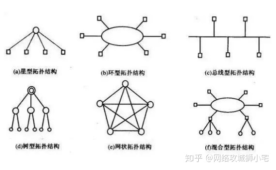

由n个节点构成的星型拓扑结构的网络中，共有 n 个直接连接。
由n个节点构成的环状拓扑结构的网络中，共有 1 个直接的连接，
由n个节点构成的完全型网状结构的网络中，共有 n*(n-1) 个直接的连接。

#### 1、星型拓扑 n-1

n-1 个直接连接


星型拓扑结构是一个中心，多个分节点。多节点与中央节点通过点到点的方式连接。中央节点执行集中式控制策略，因此中央节点相当复杂，负担比其他各节点重的多。

优点：结构简单，连接方便，管理和维护都相对容易，而且扩展性强。网络延迟时间较小，传输误差低。中心无故障，一般网络没问题。

缺点：中心故障，网络就出问题，同时共享能力差，通信线路利用率不高。

#### 2、环形拓扑 n

n 个直接连接


环形拓扑结构是节点形成一个闭合环。环形网中各节点通过环路接口连在一条首尾相连的闭合环形通信线路中，环上任何节点均可请求发送信息。传输媒体从一个端用户到另一个端用户，直到将所有的端用户连成环型。数据在环路中沿着一个方向在各个节点间传输，信息从一个节点传到另一个节点。

这种结构显而易见消除了端用户通信时对中心系统的依赖性。每个端用户都与两个相临的端用户相连，因而存在着点到点链路，但总是以单向[方式](https://link.zhihu.com/?target=https%3A//baike.baidu.com/item/%E6%96%B9%E5%BC%8F)操作，于是便有上游端用户和下游端用户之称。

优点：信息流在网中是沿着固定方向流动的，两个节点仅有一条道路，简化了路径选择的控制；环路上各节点都是自举控制，控制软件简单。

缺点：信息源在环路中是串行地穿过各个节点，当环中节点过多时，势必影响信息传输速率，使网络的响应时间延长；环路是封闭的，不便于扩充；可靠性低，一个节点故障，将会造成全网瘫痪；维护难，对分支节点故障定位较难。

#### 3、总线型拓扑


总线拓扑结构所有设备连接到一条连接介质上。由一条高速公用总线连接若干个节点所形成的网络即为总线形网络，每个节点上的网络接口板硬件均具有收、发功能，接收器负责接收总线上的串行信息并转换成并行信息送到PC工作站；发送器是将并行信息转换成串行信息后广播发送到总线上，总线上发送信息的目的地址与某节点的接口地址相符合时，该节点的接收器便接收信息。由于各个节点之间通过电缆直接连接，所以总线型拓扑结构中所需要的电缆长度是最小的，但总线只有一定的负载能力，因此总线长度又有一定限制，一条总线只能连接一定数量的节点。

优点：总线结构所需要的电缆数量少，线缆长度短，易于布线和维护。多个节点共用一条传输信道，信道利用率高。

缺点：总线形网常因**一个节点出现故障**（如结头接触不良等）而导致整个网络不通，因此**可靠性不高**。

#### 4、树形拓扑


树形拓扑从总线拓扑演变而来,形状像一棵倒置的树,顶端是树根,树根以下带分支,每个分支还可再带子分支，树根接收各站点发送的数据,然后再广播发送到全网。我国**电话网络即采用树形结构**。

优点：结构比较简单，成本低。在网络中，任意两个节点之间不产生回路，每个链路都支持双向传输。网络中节点扩充方便灵活，寻找链路路经比较方便。

缺点：在这种网络系统中，除叶节点及其相连的链路外，任何一个节点或链路产生的故障都会影响整个网络。

#### 5、网状拓扑 n(n-1)


主要指各节点通过传输线互联连接起来，并且每一个节点至少与其他两个节点相连。网状拓扑结构具有较高的可靠性，但其结构复杂，实现起来费用较高，不易管理和维护，不常用于局域网。

优点：网络可靠性高，一般通信子网任意两个节点交换机之间，存在着两条或两条以上的通信路径。可扩充性好，网络可建成各种形状，采用多种通信信道，多种传输速率。

缺点：网络结构复杂，成本高，不易维护。

#### 6、混合型拓扑


将两种或几种网络拓扑结构混合起来构成的一种网络拓扑结构称为混合型拓扑结构（也有的称之为杂合型结构）。

### 协商缓存和强制缓存

#### 强制缓存

**Cache-controller**(优先级更高)，相对时间

**Expires**，绝对时间

强缓存指的是**只要浏览器判断缓存没有过期**，则直接使用浏览器的本地缓存，决定是否使用缓存的主动性在于浏览器这边。

如下图中，返回的是 200 状态码，但在 size 项中标识的是 from disk cache，就是使用了强制缓存。


#### 协商缓存

**Last-Modify** 最新修改时间

**Etag** 资源唯一标识

某些请求的响应码是 `304`，这个是告诉浏览器可以使用本地缓存的资源

第一种：请求头部中的 `If-Modified-Since` 字段与响应头部中的 `Last-Modified` 字段实现

第二种：请求头部中的 `If-None-Match` 字段与响应头部中的 `ETag` 字段

### cookie&Session

都是会话跟踪技术

Cookie通过在**客户端**记录信息确定用户身份（header中），Session通过在**服务器端**记录信息确定用户身份。

cookie不能存储ASCII空格，session存什么格式都可以。

cookie可以设置路径，session不可以

cookie的缺陷

- 由于在HTTP请求中的cookie是**明文传递**的，所以安全性成问题。（除非用HTTPS)
- Cookie的**大小限制**在4KB左右。**每个域不超过最多存放20个cookie**
- cookie会被附加在每个HTTP请求中，所以无形中增加了流量。

https://blog.csdn.net/swadian2008/article/details/104267034


### Session

- 服务器会给每一个用户（浏览器）创建一个Session对象；
- 一个Session独占一个浏览器，只要**浏览器没有关闭，这个Session就存在；**
- 保持用户的登录状态

##### **一.通过cookie实现**

 **sessionId**是通过浏览器的cookie工作的，服务器端把cookie存放在浏览器端，当在发送请求到服务器端时，将浏览器端存储的**cookie值作为http请求头**cookie属性的值传送给服务器端，来维持身份。

##### **二.通过URL重写实现**

HttpServletResponse 接口提供了重写 URL 的方法：public java.lang.String **encodeURL**(java.lang.String url)
该方法的实现机制为：
如果不支持 Cookie，就**在参数 url 中加入 Session ID 信息，然后返回修改后的 url**.


### HTTP2

#### 1、头部压缩

采用hpack算法，具体包括如下

静态编码表：用123替换原来常用header字段,比如method,path

动态编码表：自定义编码表双方进行维护

客户端和服务端动态动态维护字典，用长度较短的索引表示重复字符串，再用哈夫曼算法进行数据压缩

#### 2、二进制帧

将HTTP的文本格式改为二进制数据，极大提高传递效率

帧的结构

首部有长度，标志位（数据结束标志，流的遇险记），流标识符，负载就是实际传输的数据，是经哈夫曼编码的HTTP头部和包体

帧类型


数据帧就是http头部，包体和**流的优先级**

控制帧就是心跳，流量控制，流终止等

#### 3、并发传输（stream）

HTTP1.1基于请求响应模式，完成一个事务（一次请求响应）才能进行下一个事务，有**队头阻塞**问题，管道只能解决请求的对头阻塞，无法解决响应的队尾阻塞，浏览器默认没有开启

**流**是一个逻辑概念，流包含一个或多个**消息**（对应HTTP请求或响应），一个消息可由一个或多个**帧**组成

多个流复用一个TCP连接，不同流对应的帧可以乱序传输，同个流的帧一定要按序传输


#### 4、服务器主动推送资源

### TCP和UDP绑同个端口

https://mp.weixin.qq.com/s/3fMZN_LidCi5fiD16nNWWA

TCP和UDP是**可以同时绑定一个端口**的，只要四元组不同就可以

四元组：源IP,源端口，目标IP,目标端口

可同个reuse参数复用time_wait状态的连接

### DDOS

- **限制半连接队列大小**。多的会丢弃

- SYN-ACK的**重试次数减少**。减少服务端的超时重传


当大量syn请求包发送给服务端的时候，需要设置合理的最大并发半开连接数。一旦超过相应的最大限制，系统就会认为自己收到了syn flood攻击，进入防范模式中。SYN Timeout时间被减短，SYN-ACK的重试次数减少，系统也会自动对缓冲区中的报文进行延时，避免对TCP/IP堆栈造成过大的冲击，力图将攻击危害减到最低。


攻击客户端通过发包器，在短时间内伪造大量不存在的IP地址，向服务器不断地发送SYN包，服务器回复确认包SYN/ACK，并等待客户的确认，由于源地址是不存在的，服务器需要不断的重发SYN/ACK直至超时，这些伪造的SYN包将长时间占用未连接队列，正常的SYN请求被丢弃，目标系统运行缓慢，严重者引起网络堵塞甚至系统瘫痪。

SYN攻击是一个典型的DDOS攻击。检测SYN攻击非常的方便，当你在服务器上看到大量的半连接状态时，特别是源IP地址是随机的，基本上可以断定这是一次SYN攻击。


### RST

TCP的异常终止,一种能够释放TCP连接的机制

```
四种情况会发送RST包：
1、端口未打开
2、请求超时
3、提前关闭
4、在一个已关闭的socket上收到数据
```

### 输入URL发生的事

#### 整体组件图


#### DNS查询过程


**DNS记录类型**


**对称加密和非对称加密**


#### 四层负载均衡

vip的概念：也可以保护后端真正的服务器


**调度算法**


**四层负载均衡特点**


#### 七层负载均衡


### CRC

循环冗余校验

生成多项为;G(X)=X^4+X+1.则信息为1101011111的CRC码为（）

```
阶为4，左移4位，按位异或
```


### 各层概述

#### OSI七层模型

链路层，网络层，传输层都提供流量控制


#### 应用层

为操作系统或网络应用程序提供访问网络服务的接口，数据传输基本单位报文。

应用网关：应用层的协议转换。例如一个主机ISO电子邮件标准，另一个主机执行的是Internet电子邮件标准，如果这两个主机需要交换电子邮件，那么必须经过一个电子邮件网关进行协议转换。

#### 传输层

将上层数据分段并提供端到端的、可靠或不可靠的传输及端到端的差错控制和流量控制，提供建立、维护和取消连接的功能

网关：协议转换器，充当转换翻译的重任，如果两个网络的通信协议、数据格式或语言不同时，网关会对信息重新打包，以适应目标系统的需求。默认在网络层以上实现网络互联（可用于局域网或广域网）

传输网关：在**两个网络之间建立传输连接**，不同网络的主机之间可跨越多个网络的、级联的、**点对点**的传输连接

#### 网络层

IP寻址和路由选择、分组传输、控制子网运行。

向上提供无连接的、**最大努力的交付**的数据包服务（IP数据报）

**IP地址**有什么用：IP地址通过ARP协议转为MAC地址，最终按照硬件地址找到主机的，那为什么不直接使用MAC地址，主要是**屏蔽**下层异构网络

**IP分组转发算法**

(1)在数据报首部提取目标IP地址D，得出网络地址N.

(2)如果是本网络直接交付（封装成MAC帧）,或根据路由表传给下一跳路由器，或交给默认路由器

**ARP地址解析协议**

保存**IP地址**到**硬件地址**的映射表，并且会动态更新，ARP高速缓存表初始化的时候采用广播的方式

**路由选择协议**

路由选择分为内部网关协议（自治系统AS）和外部网关协议，内部网关协议有RIP和OSPF协议，外部网关协议有BGP协议。

RIP协议（适合小网络）：路由信息协议，基于距离向量，最短跳数16视为不可达，比如（1，3，R）表示到达网络1的跳数为3，下一个路由是R.好消息传得快，坏消息传得慢。

OSPF协议（适合大网络）：开放最短路径优先协议，基于**Dijkstra的最短路径**算法，坏消息能够快速收敛。划分为小的区域进行洪泛，直接使用IP数据包传送。

BGP协议：边界网关协议，域间路由协议，互联网的规模很大，自治系统之间的路由选择非常困难。另外一些数据报为了安全不能通过国外的网络。基于路径向量选择协议，每个自治系统之间保证要有一个BGP代言人。

路由器：连接多个逻辑分开的网络，根据IP地址区分不同的网络，实现网路的互连和隔离，把IP报文传送到正确的网络。

#### 链路层

封装成帧、透明传输、差错控制（包含流量控制）

网桥：连接两个局域网，根据MAC地址转发帧

交换机：更多端口的网桥，根据帧的目标MAC地址对照MAC地址表决定由哪个端口转发，不在表中则向所有端口转发，及洪泛

#### 物理层

接口标准、如何更快的传输数据

中继器：放大信号

集线器：多个端口的集线器

### DNS域名解析


- 端口：TCP 53(用于区域传输)，**UDP 53(用于DNS查询)**
- 模型：C/S 客户端/服务器模型

1. **辅域名服务器会定时（一般时3小时）向主域名服务器进行TCP查询以便了解数据是否有变动**。如有变动，则会执行一次区域传送，进行数据同步。**区域传送将使用TCP**而不是UDP，因为数据同步传送的数据量比一个请求和应答的数据量要多得多。 
2. TCP是一种可靠的连接，保证了数据的准确性。 

浏览器首先看一下自己的缓存里有没有，如果没有就向操作系统的缓存要，还没有就检查本机域名解析文件 `hosts`，如果还是没有，就会 DNS 服务器进行查询，查询的过程如下：

1. 客户端首先会发出一个 DNS 请求，问 www.server.com 的 IP 是啥，并发给本地 DNS 服务器（也就是客户端的 TCP/IP 设置中填写的 DNS 服务器地址）。
2. 本地域名服务器收到客户端的请求后，如果缓存里的表格能找到 www.server.com，则它直接返回 IP 地址。如果没有，本地 DNS 会去问它的根域名服务器：“老大， 能告诉我 www.server.com 的 IP 地址吗？” 根域名服务器是最高层次的，它不直接用于域名解析，但能指明一条道路。
3. 根 DNS 收到来自本地 DNS 的请求后，发现后置是 .com，说：“www.server.com 这个域名归 .com 区域管理”，我给你 .com 顶级域名服务器地址给你，你去问问它吧。”
4. 本地 DNS 收到顶级域名服务器的地址后，发起请求问“老二， 你能告诉我 www.server.com 的 IP 地址吗？”
5. 顶级域名服务器说：“我给你负责 www.server.com 区域的权威 DNS 服务器的地址，你去问它应该能问到”。
6. 本地 DNS 于是转向问权威 DNS 服务器：“老三，www.server.com对应的IP是啥呀？” server.com 的权威 DNS 服务器，它是域名解析结果的原出处。为啥叫权威呢？就是我的域名我做主。
7. 权威 DNS 服务器查询后将对应的 IP 地址 X.X.X.X 告诉本地 DNS。
8. 本地 DNS 再将 IP 地址返回客户端，客户端和目标建立连接。


#### DNS 记录类型

DNS 记录提供与域名相关的所有详细信息，这些 DNS 记录的详细信息可以在 DNS 区域文件中找到。

> DNS 区域是 DNS 中命名空间的特定部分，DNS 区域包括一个区域文件，该文件包含区域中域的所有 DNS 记录，域名服务器可以包含多个 DNS 区域，一个 DNS 区域可以包含多个子域。

- **A 记录**： 将域名映射到 **IPv4** 地址。
- **AAAA 记录**：将域名映射到 **IPv6** 地址。
- **MX 记录**： 英文全称：Mail Exchange，指向邮件服务器。
- **TXT 记录**：将文本存储在 DNS 记录中，主要用于验证域名所有权和防止垃圾邮件。
- **NS（名称服务器）**： NS 记录直接发送到域或子域的权威名称服务器。
- **CNAME**：规范名称（或别名）记录是将域名映射到其他域或子域的别名。

### Ping命令

应用可能用到**DNS**，域名解析服务
网络层**ICMP**协议和**ARP**地址解析协议

### NAT协议

```
将内部网络的私有IP地址翻译成全球唯一的公网IP地址，使内部网络可以连接到互联网上

SNAT:内部地址要访问公网上的服务时，内部地址会主动发起连接，将内部地址转换成公有ip。网关这个地址转换称为SNAT.
DNAT:当内部需要对外提供服务时，外部发起主动连接，路由器或着***的网关接收到这个连接，然后把连接转换到内部，此过程是由带公有ip的网关代替内部服务来接收外部的连接，然后在内部做地址转换，此转换称为DNAT
```

### DHCP协议

动态主机配置协议，局域网网络协议，可自动分配IP地址

### RARP协议

运行局域网的物理机器从网关服务器的ARP表或缓存上请求其IP地址

### unix五种IO模型

IO分为两个阶段：数据准备和数据拷贝

数据准备：设备到内核

数据拷贝：内核拷贝到用户空间

https://blog.csdn.net/qq_35361244/article/details/109251983

```
阻塞io：数据准备和数据拷贝阶段都阻塞

非阻塞io：数据准备阶段不阻塞，轮询数据是否准备好，耗cpu

多路复用io：适合多连接，只用一个线程在select轮询内核socket状态，

信号io:发送io请求就到socker注册一个信号，内核数据报准备好发送信号通知用户线程

异步io：数据主备和数据复制都交给内核完成，真正非阻塞
```

#### 1、阻塞式I/O

等待数据和拷贝数据都等待


#### 2、非阻塞式I/O

不断**系统调用**询问数据是否准备好，即在数据准备阶段不会阻塞


#### 3、I/O复用

[select,poll,epoll](https://blog.csdn.net/wteruiycbqqvwt/article/details/90299610)

##### select/poll

需要进行 **2 次「遍历」文件描述符集合**，一次是在内核态里，一个次是在用户态里 ，而且还会发生 **2 次「拷贝」文件描述符集合**，先从用户空间传入内核空间，由内核修改后，再传出到用户空间中

O(n) 遍历,BitsMap存储,
poll采用链表，因此无连接数限制

##### epoll

维护了红黑树，时间驱动机制，通过回调加入到就绪列表中，返回就绪的socket列表

*第一点*，epoll 在内核里使用**红黑树来跟踪进程所有待检测的文件描述字**，把需要监控的 socket 通过 `epoll_ctl()` 函数加入内核中的红黑树里，红黑树是个高效的数据结构，增删改一般时间复杂度是 `O(logn)`。而 select/poll 内核里没有类似 epoll 红黑树这种保存所有待检测的 socket 的数据结构，所以 select/poll 每次操作时都传入整个 socket 集合给内核，而 epoll 因为在内核维护了红黑树，可以保存所有待检测的 socket ，所以只需要传入一个待检测的 socket，减少了内核和用户空间大量的数据拷贝和内存分配。

*第二点*， epoll 使用**事件驱动**的机制，内核里**维护了一个链表来记录就绪事件**，当某个 socket 有事件发生时，通过**回调函数**内核会将其加入到这个就绪事件列表中，当用户调用 `epoll_wait()` 函数时，只会返回有事件发生的文件描述符的个数，不需要像 select/poll 那样轮询扫描整个 socket 集合，大大提高了检测的效率。

O(1) 事件驱动IO


epoll 的方式即使监听的 Socket 数量越多的时候，效率不会大幅度降低，能够同时监听的 Socket 的数目也非常的多了，上限就为系统定义的进程打开的最大文件描述符个数。


**边缘触发和水平触发**

边缘触发（效率更高）：只触发一次，一般配合nio使用

水平触发：不断从epoll_wait 中苏醒，直到内核缓冲区数据读完

- 使用边缘触发模式时，当被监控的 Socket 描述符上有可读事件发生时，**服务器端只会从 epoll_wait 中苏醒一次**，即使进程没有调用 read 函数从内核读取数据，也依然只苏醒一次，因此我们程序要保证一次性将内核缓冲区的数据读取完；
- 使用水平触发模式时，当被监控的 Socket 上有可读事件发生时，**服务器端不断地从 epoll_wait 中苏醒，直到内核缓冲区数据被 read 函数读完才结束**，目的是告诉我们有数据需要读取；

**select**阻塞调用线程，直到一个或多个数据包准备就绪，然后系统调用（**recvfrom**）拷贝数据


#### 4、信号驱动I/O

调用**sigio**函数，不阻塞执行其它任务，内核数据包准备就绪发送就绪信号，进程收到通知后调用**recvfrom**函数，拷贝数据到缓冲区


#### 5、异步I/O

不阻塞，并且所有任务都交给内核处理（数据准备和数据拷贝），全部准备好了再通知线程处理数据报，真正做到非阻塞。


下面这张图，总结了以上几种 I/O 模型：

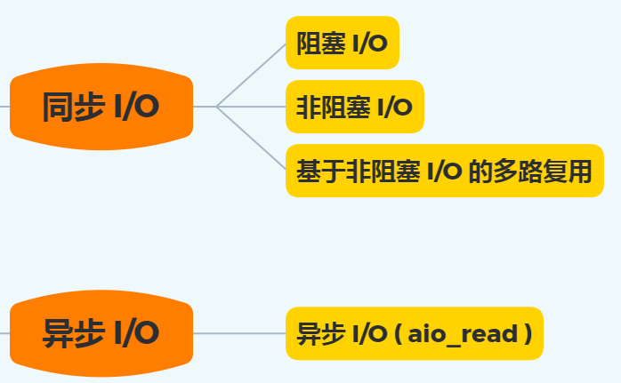

在前面我们知道了，I/O 是分为两个过程的：

1. 数据准备的过程
2. 数据从内核空间拷贝到用户进程缓冲区的过程

阻塞 I/O 会阻塞在「过程 1 」和「过程 2」，而非阻塞 I/O 和基于非阻塞 I/O 的多路复用只会阻塞在「过程 2」，所以这三个都可以认为是同步 I/O。

异步 I/O 则不同，「过程 1 」和「过程 2 」都不会阻塞。

### STOMP协议

```java
package com.wzh.demo.websocket.config;

import com.wzh.demo.websocket.handler.MyPrincipalHandshakeHandler;
import com.wzh.demo.websocket.interceptor.WebSocketChannelInterceptor;
import com.wzh.demo.websocket.interceptor.WebSocketHandshakeInterceptor;
import org.springframework.context.annotation.Bean;
import org.springframework.context.annotation.Configuration;
import org.springframework.messaging.converter.MessageConverter;
import org.springframework.messaging.handler.invocation.HandlerMethodArgumentResolver;
import org.springframework.messaging.handler.invocation.HandlerMethodReturnValueHandler;
import org.springframework.messaging.simp.config.ChannelRegistration;
import org.springframework.messaging.simp.config.MessageBrokerRegistry;
import org.springframework.scheduling.concurrent.DefaultManagedTaskScheduler;
import org.springframework.scheduling.concurrent.ThreadPoolTaskScheduler;
import org.springframework.util.AntPathMatcher;
import org.springframework.web.socket.config.annotation.EnableWebSocketMessageBroker;
import org.springframework.web.socket.config.annotation.StompEndpointRegistry;
import org.springframework.web.socket.config.annotation.WebSocketMessageBrokerConfigurer;
import org.springframework.web.socket.config.annotation.WebSocketTransportRegistration;

import java.util.List;

/**
 * <配置基于STOMP的websocket>
 * <功能详细描述>
 * @author wzh
 * @version 2018-08-12 18:38
 * @see [相关类/方法] (可选)
 **/
@Configuration
@EnableWebSocketMessageBroker
public class WebSocketStompConfig implements WebSocketMessageBrokerConfigurer {

    /**
     * 添加这个Endpoint，这样在网页中就可以通过websocket连接上服务,
     * 也就是我们配置websocket的服务地址,并且可以指定是否使用socketjs
     * 
     * @param registry
     */
    @Override
    public void registerStompEndpoints(StompEndpointRegistry registry)
    {
        
        /*
         * 1. 将 /serviceName/stomp/websocketJs路径注册为STOMP的端点，
         *    用户连接了这个端点后就可以进行websocket通讯，支持socketJs
         * 2. setAllowedOrigins("*")表示可以跨域
         * 3. withSockJS()表示支持socktJS访问
         * 4. addInterceptors 添加自定义拦截器，这个拦截器是上一个demo自己定义的获取httpsession的拦截器
         * 5. addInterceptors 添加拦截处理，这里MyPrincipalHandshakeHandler 封装的认证用户信息
         */
        registry.addEndpoint("/stomp/websocketJS")
                //.setAllowedOrigins("*")
                .addInterceptors(new WebSocketHandshakeInterceptor())
                .setHandshakeHandler(new MyPrincipalHandshakeHandler())
                .withSockJS()

        ;

        /*
         * 看了下源码，它的实现类是WebMvcStompEndpointRegistry ，
         * addEndpoint是添加到WebMvcStompWebSocketEndpointRegistration的集合中，
         * 所以可以添加多个端点
         */
        registry.addEndpoint("/stomp/websocket");
    }

    /**
     * 配置消息代理
     * @param registry
     */
    @Override
    public void configureMessageBroker(MessageBrokerRegistry registry)
    {
        /*
         *  enableStompBrokerRelay 配置外部的STOMP服务，需要安装额外的支持 比如rabbitmq或activemq
         * 1. 配置代理域，可以配置多个，此段代码配置代理目的地的前缀为 /topicTest 或者 /userTest
         *    我们就可以在配置的域上向客户端推送消息
         * 3. 可以通过 setRelayHost 配置代理监听的host,默认为localhost
         * 4. 可以通过 setRelayPort 配置代理监听的端口，默认为61613
         * 5. 可以通过 setClientLogin 和 setClientPasscode 配置账号和密码
         * 6. setxxx这种设置方法是可选的，根据业务需要自行配置，也可以使用默认配置
         */
        //registry.enableStompBrokerRelay("/topicTest","/userTest")
                //.setRelayHost("rabbit.someotherserver")
                //.setRelayPort(62623);
                //.setClientLogin("userName")
                //.setClientPasscode("password")
                //;

        // 自定义调度器，用于控制心跳线程
        ThreadPoolTaskScheduler taskScheduler = new ThreadPoolTaskScheduler();
        // 线程池线程数，心跳连接开线程
        taskScheduler.setPoolSize(1);
        // 线程名前缀
        taskScheduler.setThreadNamePrefix("websocket-heartbeat-thread-");
        // 初始化
        taskScheduler.initialize();

        /*
         * spring 内置broker对象
         * 1. 配置代理域，可以配置多个，此段代码配置代理目的地的前缀为 /topicTest 或者 /userTest
         *    我们就可以在配置的域上向客户端推送消息
         * 2，进行心跳设置，第一值表示server最小能保证发的心跳间隔毫秒数, 第二个值代码server希望client发的心跳间隔毫秒数
         * 3. 可以配置心跳线程调度器 setHeartbeatValue这个不能单独设置，不然不起作用，要配合setTaskScheduler才可以生效
         *    调度器我们可以自己写一个，也可以自己使用默认的调度器 new DefaultManagedTaskScheduler()
         */
        registry.enableSimpleBroker("/topicTest","/userTest")
                .setHeartbeatValue(new long[]{10000,10000})
                .setTaskScheduler(taskScheduler);
        /*
         *  "/app" 为配置应用服务器的地址前缀，表示所有以/app 开头的客户端消息或请求
         *  都会路由到带有@MessageMapping 注解的方法中
         */
        registry.setApplicationDestinationPrefixes("/app");

        /*
         *  1. 配置一对一消息前缀， 客户端接收一对一消息需要配置的前缀 如“'/user/'+userid + '/message'”，
         *     是客户端订阅一对一消息的地址 stompClient.subscribe js方法调用的地址
         *  2. 使用@SendToUser发送私信的规则不是这个参数设定，在框架内部是用UserDestinationMessageHandler处理，
         *     而不是而不是 AnnotationMethodMessageHandler 或  SimpleBrokerMessageHandler
         *     or StompBrokerRelayMessageHandler，是在@SendToUser的URL前加“user+sessionId"组成
         */
        registry.setUserDestinationPrefix("/user");

        /*
         * 自定义路径分割符
         * 注释掉的这段代码添加的分割符为. 分割是类级别的@messageMapping和方法级别的@messageMapping的路径
         * 例如类注解路径为 “topic”,方法注解路径为“hello”，那么客户端JS stompClient.send 方法调用的路径为“/app/topic.hello”
         * 注释掉此段代码后，类注解路径“/topic”,方法注解路径“/hello”,JS调用的路径为“/app/topic/hello”
         */
        //registry.setPathMatcher(new AntPathMatcher("."));

    }

    /**
     * 配置发送与接收的消息参数，可以指定消息字节大小，缓存大小，发送超时时间
     * @param registration
     */
    @Override
    public void configureWebSocketTransport(WebSocketTransportRegistration registration) {
        /*
         * 1. setMessageSizeLimit 设置消息缓存的字节数大小 字节
         * 2. setSendBufferSizeLimit 设置websocket会话时，缓存的大小 字节
         * 3. setSendTimeLimit 设置消息发送会话超时时间，毫秒
         */
        registration.setMessageSizeLimit(10240)
                    .setSendBufferSizeLimit(10240)
                    .setSendTimeLimit(10000);
    }

    /**
     * 设置输入消息通道的线程数，默认线程为1，可以自己自定义线程数，最大线程数，线程存活时间
     * @param registration
     */
    @Override
    public void configureClientInboundChannel(ChannelRegistration registration) {

        /*
         * 配置消息线程池
         * 1. corePoolSize 配置核心线程池，当线程数小于此配置时，不管线程中有无空闲的线程，都会产生新线程处理任务
         * 2. maxPoolSize 配置线程池最大数，当线程池数等于此配置时，不会产生新线程
         * 3. keepAliveSeconds 线程池维护线程所允许的空闲时间，单位秒
         */
        registration.taskExecutor().corePoolSize(10)
                    .maxPoolSize(20)
                    .keepAliveSeconds(60);
        /*
         * 添加stomp自定义拦截器，可以根据业务做一些处理
         * springframework 4.3.12 之后版本此方法废弃，代替方法 interceptors(ChannelInterceptor... interceptors)
         * 消息拦截器，实现ChannelInterceptor接口
         */
        registration.setInterceptors(webSocketChannelInterceptor());
    }

    /**
     *设置输出消息通道的线程数，默认线程为1，可以自己自定义线程数，最大线程数，线程存活时间
     * @param registration
     */
    @Override
    public void configureClientOutboundChannel(ChannelRegistration registration) {
        registration.taskExecutor().corePoolSize(10)
                    .maxPoolSize(20)
                    .keepAliveSeconds(60);
        //registration.setInterceptors(new WebSocketChannelInterceptor());
    }

    /**
     * 添加自定义的消息转换器，spring 提供多种默认的消息转换器，
     * 返回false,不会添加消息转换器，返回true，会添加默认的消息转换器，当然也可以把自己写的消息转换器添加到转换链中
     * @param list
     * @return
     */
    @Override
    public boolean configureMessageConverters(List<MessageConverter> list) {
        return true;
    }

    /**
     * 自定义控制器方法的参数类型，有兴趣可以百度google HandlerMethodArgumentResolver这个的用法
     * @param list
     */
    @Override
    public void addArgumentResolvers(List<HandlerMethodArgumentResolver> list) {

    }

    /**
     * 自定义控制器方法返回值类型，有兴趣可以百度google HandlerMethodReturnValueHandler这个的用法
     * @param list
     */
    @Override
    public void addReturnValueHandlers(List<HandlerMethodReturnValueHandler> list) {

    }

    /**
     * 拦截器加入 spring ioc容器
     * @return
     */
    @Bean
    public WebSocketChannelInterceptor webSocketChannelInterceptor()
    {
        return new WebSocketChannelInterceptor();
    }

}


```


### HTTP常见方法和状态码

#### 5个常用Method

get 从服务器端获取资源

put 提交资源

post 更新资源

delete 删除资源

connect 建立tunnel隧道

#### **状态码分类表**

​          类别                    								原因短句

1xx	Informational（信息性状态码）	接受的请求正在处理
2xx	Success（成功状态码）	  			请求正常处理完毕
3xx	Redirection（重定向）					需要进行附加操作以完成请求
4xx	Client error（客户端错误）			客户端请求出错，服务器无法处理请求
5xx	Server Error（服务器错误）			服务器处理请求出错

#### **各类别常见状态码：**

```
301 永久重定向
302 临时重定向
304 not modify未修改


2xx （3种）

200 OK：表示从客户端发送给服务器的请求被正常处理并返回；

204 No Content：表示客户端发送给客户端的请求得到了成功处理，但在返回的响应报文中不含实体的主体部分（没有资源可以返回）；

206 Patial Content：表示客户端进行了范围请求，并且服务器成功执行了这部分的GET请求，响应报文中包含由Content-Range指定范围的实体内容。

3xx （5种）

301 Moved Permanently：永久性重定向，表示请求的资源被分配了新的URL，之后应使用更改的URL；

302 Found：临时性重定向，表示请求的资源被分配了新的URL，希望本次访问使用新的URL；

       301与302的区别：前者是永久移动，后者是临时移动（之后可能还会更改URL）

303 See Other：表示请求的资源被分配了新的URL，应使用GET方法定向获取请求的资源；

      302与303的区别：后者明确表示客户端应当采用GET方式获取资源

304 Not Modified：表示客户端发送附带条件（是指采用GET方法的请求报文中包含if-Match、If-Modified-Since、If-None-Match、If-Range、If-Unmodified-Since中任一首部）的请求时，服务器端允许访问资源，但是请求为满足条件的情况下返回改状态码；

307 Temporary Redirect：临时重定向，与303有着相同的含义，307会遵照浏览器标准不会从POST变成GET；（不同浏览器可能会出现不同的情况）；

4xx （4种）

400 Bad Request：表示请求报文中存在语法错误；

401 Unauthorized：未经许可，需要通过HTTP认证；

403 Forbidden：服务器拒绝该次访问（访问权限出现问题）

404 Not Found：表示服务器上无法找到请求的资源，除此之外，也可以在服务器拒绝请求但不想给拒绝原因时使用；
405 请求方式不对

5xx （2种）

500 Inter Server Error：表示服务器在执行请求时发生了错误，也有可能是web应用存在的bug或某些临时的错误时；
302 网关错误

503 Server Unavailable：表示服务器暂时处于超负载或正在进行停机维护，无法处理请求；
```

#### 请求头header

##### 1Host

Host用来标识服务器的地址（域名/ip + port）

##### 2>Content-Length

标识body的长度，然后根据它来解析。

##### 3>Content-Type

虽然前面也稍微提了一下，但是不妨碍我们在来一次不是，当然这次会更加详细。

```
1>multipart/form-data:简称form-data格式，一般用于请求，不用于响应。它
可以发送多个信息（字段），其中每个字段可以是简单的数据类型（数值型，字
符串，boolean等），也可以是复杂的数据类型（如图片，视频等等）。这就意味
着form-data可以上传任意多的数据，也可以是多个文件

2>applcation/x-www-form-urlencoded:表单格式，每个字段  键 = 值  ，多个
字段之间&间隔，和queryString格式一样，这里的字段值，只能是简单的数据类型
。

3>image/jpeg:指定具体的一个文件类型。如果用于客户端发送请求，也就只能上
传一个文件。如果用于服务端响应，也就只能返回一个图片。

4>applcation/json:json格式，请求和响应都常用。
```

##### 4>User Agent（简称UA）

表示**浏览器/操作系统的属性**
1

##### 5>**Referer**

标识当前这次http请求，是**从哪个页面点击或跳转进来的**。
1

##### 6>Cookie

是一种客户端保存数据的技术。

1.保存的方式：是在由服务端响应的http数据包中，设置Set-Cookie头（一个或
多个）Cookie是和网站关联，不同的网站有不同的Cookie（保存的信息如账号等
不同网站保存为本地不同的Cookie）。
2.使用的方式：浏览器每次请求的时候，自动携带在请求Cookie头中
3.保存的数据格式：多组键值对(键 = 值，多个键值对之间分号分隔)。

##### 7>Session

Session是一种服务端保存数据的技术，由于HTTP协议是一种无状态的协议（就是说每次服务端接收到客户端的请求时，都是一个全新的请求，服务端不知道客户端的历史请求记录），Session和Cookie的就是目的就是弥补HTTP的无状态特性。

在客户端请求服务端时候，服务端会为这次请求开辟一块内存空间，这个对象就
是Session对象，存储结构为ConcurrentHashMap,也就是Map<String,Session>这
样子的，这里的String就是CookieID的值。而一个Session对象就是一个用户会话
，里边可以存放一个用户需要的很多信息。
Map<String,Session>这里的Session是一个Map(String,Object),当然里边存放
什么键值对的数据，是由后端程序员实现的。

### Https

用非对称加密的方式协商对称密匙


#### http&https区别

https是http加上ssl的应用层协议。在http的基础上增加了安全性和可靠性。

端口的不同：http默认是80端口， https默认是443端口

安全性：http是明文传输，https是密文传输。

认证：http没有认证，https是先进行TCP连接，再进行SSL层的握手，在这个过程中需要认证。

成本上：https的证书需要成本，同时加密和解密时对CPU和内存开销增加。

#### 一、四次握手过程

https通信时，首先建立ssl层的连接，客户端将ssl版本号和加密组件发到客户端，客户端收到后对ssl版本号和加密组件进行匹配，同时将CA证书及密钥发送到客户端。客户端对证书进行验证，验证通过后使用非对称加密对数据通信时的密钥进行协商。协商后得到一致的获得一致的对称加密密钥。然后使用对称加密算法进行

1、客户端发送TLS版本，client随机数和支持的密码套件列表（密匙交换算法--签名算法--对称加密算法--摘要算法）

2、服务端发送TLS版本，server随机数，选择的密码套件和数字证书

3、验证证书的安全性并得到服务器RSA公匙，生称新的新的随机数（pre-master）并用RSA公匙加密发给服务端。服务收到后用RSA解密得到pre-master。

至此双方都共享了三个随机数：客户端随机数，服务端随机数，pre-master，用于生成会话密匙，他就是对称密匙。

然后客户端就把之前发送的所有数据做个摘要，使用会话密匙加密让服务器验证一下消息是否又被篡改。

4、服务器也是同样的操作，双方都验证加密和解密没问题，握手正式完成


TLS四次握手过程


#### 二、数字证书签发和验证流程

CA 签发证书的过程，如上图左边部分：

- 首先 CA 会把持有者的公钥、用途、颁发者、有效时间等信息打成一个包，然后对这些信息进行 Hash 计算，得到一个 Hash 值；
- 然后 CA 会使用自己的私钥将该 Hash 值加密，生成 Certificate Signature，也就是 CA 对证书做了签名；
- 最后将 Certificate Signature 添加在文件证书上，形成数字证书；

客户端校验服务端的数字证书的过程，如上图右边部分：

- 首先客户端会使用同样的 Hash 算法获取该证书的 Hash 值 H1；
- 通常浏览器和操作系统中集成了 CA 的公钥信息，浏览器收到证书后可以使用 CA 的公钥解密 Certificate Signature 内容，得到一个 Hash 值 H2 ；
- 最后比较 H1 和 H2，如果值相同，则为可信赖的证书，否则则认为证书不可信。


#### 证书链

证书信任链

开始客户端只信任根证书 GlobalSign Root CA 证书的，然后 “GlobalSign Root CA” 证书信任 “GlobalSign Organization Validation CA - SHA256 - G2” 证书，而 “GlobalSign Organization Validation CA - SHA256 - G2” 证书又信任 baidu.com 证书，于是客户端也信任 baidu.com 证书。


### 加密算法

一、对称加密算法 ：常用的算法包括DES、3DES、**AES**、DESX、Blowfish、RC4、RC5、RC6。推荐用AES。

二、非对称加密算法：常见的非对称加密算法：**RSA**、**DSA**（数字签名用）、**ECC**（椭圆曲线密码编码学，移动设备用）、**Diffie-Hellman**、El Gamal。推荐用ECC（椭圆曲线密码编码学）。

三、散列算法（Hash算法---单向加密算法）：常见的Hash算法：MD2、MD4、MD5、HAVAL、SHA、SHA-1、HMAC、HMAC-MD5、HMAC-SHA1。推荐MD5、SHA-1。

### RSA的公钥、私钥

采用单钥[密码系统](https://baike.baidu.com/item/密码系统)的加密方法，同一个[密钥](https://baike.baidu.com/item/密钥)可以同时用作信息的加密和解密，这种加密方法称为对称加密，也称为单[密钥加密](https://baike.baidu.com/item/密钥加密)。

与对称加密[算法](https://baike.baidu.com/item/算法)不同，[非对称加密算法](https://baike.baidu.com/item/非对称加密算法)需要两个[密钥](https://baike.baidu.com/item/密钥)：[公开密钥](https://baike.baidu.com/item/公开密钥)（publickey）和私有密钥（privatekey）。[公开密钥](https://baike.baidu.com/item/公开密钥)与私有密钥是一对，如果用公开密钥对数据进行加密，只有用对应的私有密钥才能解密；如果用私有密钥对数据进行加密，那么只有用对应的公开密钥才能解密。因为加密和解密使用的是两个不同的[密钥](https://baike.baidu.com/item/密钥)，所以这种算法叫作[非对称加密算法](https://baike.baidu.com/item/非对称加密算法)。

一、举个例子

1、发消息

  用对方的公钥给对方发消息


2、发公告

 发公告的时候，用自己的私钥形成签名！


#### 二、加密和签名

RSA的公钥、私钥是互相对应的，RSA会生成两个密钥，你可以把任何一个用于公钥，然后另一个就是你必须保护好的私钥了。

RSA的公钥、私钥都可以加密，也都可以解密。

其中：

用公钥加密需要私钥解密，称为“加密”。由于私钥是不公开的，确保了内容的保密，没有私钥无法获得内容；

用私钥加密需要公钥解密，称为“签名”。由于公钥是公开的，任何人都可以解密内容，但只能用发布者的公钥解密，验证了内容是该发布者发出的。

所以：

如果用于加密解密，那就是用公钥加密私钥解密（仅你可读但别人不可读，任何人都可写）

如果用于证书验证，那就是用私钥加密公钥解密（仅你可写但别人不可写，任何人都可读）

#### 三、认证过程


#### jwt的签名算法有三种：

- HMAC【哈希消息验证码(对称)】：HS256/HS384/HS512
- RSASSA【RSA签名算法(非对称)】（RS256/RS384/RS512）
- ECDSA【椭圆曲线数据签名算法(非对称)】（ES256/ES384/ES512）

### TCP报文格式

首部**固定首部20字节**


#### 源端口和目的端口字段

- TCP源端口（Source Port）：源计算机上的应用程序的端口号，占 16 位。
- TCP目的端口（Destination Port）：目标计算机的应用程序端口号，占 16 位。

#### 序列号字段

CP序列号（Sequence Number）：占 32 位。它表示本报文段所发送数据的第一个字节的编号。在 TCP 连接中，所传送的字节流的每一个字节都会按顺序编号。当SYN标记不为1时，这是当前数据分段第一个字母的序列号；如果SYN的值是1时，这个字段的值就是初始序列值（ISN），用于对序列号进行同步。这时，第一个字节的序列号比这个字段的值大1，也就是ISN加1。

#### 确认号字段

TCP 确认号（Acknowledgment Number，ACK Number）：占 32 位。它表示接收方期望收到发送方下一个报文段的第一个字节数据的编号。其值是接收计算机即将接收到的下一个序列号，也就是下一个接收到的字节的序列号加1。

#### 数据偏移字段

TCP 首部长度（Header Length）：数据偏移是指数据段中的“数据”部分起始处距离 TCP 数据段起始处的字节偏移量，占 4 位。其实这里的“数据偏移”也是在确定 TCP 数据段头部分的长度，告诉接收端的应用程序，数据从何处开始。

#### 保留字段

保留（Reserved）：占 4 位。为 TCP 将来的发展预留空间，目前必须全部为 0。

#### 标志位字段

- CWR（Congestion Window Reduce）：拥塞窗口减少标志，用来表明它接收到了设置 ECE 标志的 TCP 包。并且，发送方收到消息之后，通过减小发送窗口的大小来降低发送速率。
- ECE（ECN Echo）：用来在 TCP 三次握手时表明一个 TCP 端是具备 ECN 功能的。在数据传输过程中，它也用来表明接收到的 TCP 包的 IP 头部的 ECN 被设置为 11，即网络线路拥堵。
- URG（Urgent）：表示本报文段中发送的数据是否包含紧急数据。URG=1 时表示有紧急数据。当 URG=1 时，后面的紧急指针字段才有效。
- ACK：表示前面的确认号字段是否有效。ACK=1 时表示有效。只有当 ACK=1 时，前面的确认号字段才有效。TCP 规定，连接建立后，ACK 必须为 1。
- PSH（Push）：告诉对方收到该报文段后是否立即把数据推送给上层。如果值为 1，表示应当立即把数据提交给上层，而不是缓存起来。
- RST：表示是否重置连接。如果 RST=1，说明 TCP 连接出现了严重错误（如主机崩溃），必须释放连接，然后再重新建立连接。
- SYN：在建立连接时使用，用来同步序号。当 SYN=1，ACK=0 时，表示这是一个请求建立连接的报文段；当 SYN=1，ACK=1 时，表示对方同意建立连接。SYN=1 时，说明这是一个请求建立连接或同意建立连接的报文。只有在前两次握手中 SYN 才为 1。
- FIN：标记数据是否发送完毕。如果 FIN=1，表示数据已经发送完成，可以释放连接。

#### 窗口大小字段

窗口大小（Window Size）：占 16 位。它表示从 Ack Number 开始还可以接收多少字节的数据量，也表示当前接收端的接收窗口还有多少剩余空间。该字段可以用于 TCP 的流量控制。

#### TCP 校验和字段

校验位（TCP Checksum）：占 16 位。它用于确认传输的数据是否有损坏。发送端基于数据内容校验生成一个数值，接收端根据接收的数据校验生成一个值。两个值必须相同，才能证明数据是有效的。如果两个值不同，则丢掉这个数据包。Checksum 是根据伪头 + TCP 头 + TCP 数据三部分进行计算的。

#### 紧急指针字段

紧急指针（Urgent Pointer）：仅当前面的 URG 控制位为 1 时才有意义。它指出本数据段中为紧急数据的字节数，占 16 位。当所有紧急数据处理完后，TCP 就会告诉应用程序恢复到正常操作。即使当前窗口大小为 0，也是可以发送紧急数据的，因为紧急数据无须缓存。

#### 可选项字段

选项（Option）：长度不定，但长度必须是 32bits 的整数倍。

### TCP保证可靠传输

#### 校验和

如果接收方比对校验和与发送方不一致，那么数据一定传输有误。但是如果接收方比对校验和与发送方一致，**数据不一定传输成功。**

#### 序列号和确认应答机制

每次收到数据都要进行确认应答，也就是发送ACK报文。这个ACK报文中有对应的确认号，告诉对方期望下次从哪开始发。

数据可通过序列号进行排序，也可去除掉重复序列号的数据。

#### 超时重传

没有收到ACK报文就对刚才的数据进行重新发送

#### 连接管理

三次握手和三次挥手

#### 流量控制

根据窗口大小（接收端的数据缓冲区的大小）改变自己的发送数据速度。

如果窗口为0，停止发送。并定期发送探测数据段（防止接受端告知窗口大小的数据包丢失导致死锁），让接受端告诉自己窗口大小。

#### 拥塞控制

由于不知道网络的情况，一开始就发送大量数据容易导致拥堵，所以引入**慢启动**机制，先发少量数据进行探路。这时候就有**拥塞窗口**的概念，每次收到ACK应答，就指数增长。超过一定阈值后，就线性增长。遇到网络阻塞，就减半。

### TCP滑动窗口协议


停止等待、退后N帧，选择重传

因此TCP有队头阻塞问题

https://blog.csdn.net/qq_47529104/article/details/123362159


1.发送端和接收端分别设定发送窗口和接收窗口。
2.三次握手的时候，客户端把自己的缓冲区大小也就是窗口大小发送给服务器，服务器回应是也将窗口大小发送给客户端，服务器客户端都知道了彼此的窗口大小。
3.比如主机A的发送窗口大小为5，主机A可以向主机B发送5个单元，如果B缓冲区满了，A就要等待B确认才能继续发送数据。
4.如果缓冲区中有1个报文被进程读取，主机B就会回复ACK给主机A，接收窗口向前滑动，报文中窗口大小为1，就说明A还可以发送1个单元的数据，发送窗口向前滑动，之后等待主机B的确认报文。
只有接收窗口向前滑动并发送了确认时，发送窗口才能向前滑动。

[博客](https://blog.csdn.net/qq_34501940/article/details/51180268)

**停止等待协议**

- 一个好了才能发送下一个，降低信号的利用率

- 发送窗口=1，接受窗口=1

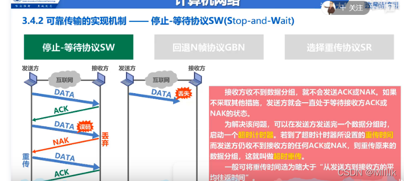

**退后N帧协议**

- 一个接受不到，改帧以后都重传，网络不好的时候会造成大量浪费带宽

- 发送>1,接收=1


**选择重传**协议

- 一个帧坏了，后面的还会缓存起来，只重传丢失的那一个，会浪费缓存

- 发送>1,接收>1


### TCP和HTTP的联系和区别

TCP是传输层的协议，HTTP是应用层协议，HTTP基于TCP协议。HTTP协议只关心约定协议内容，只关心让对方能懂。TCP有发送确认机制，只关心点对点传输，保证消息可靠传输。具体有三次握手，四次挥手机制

### TCP如何保证可靠传输

检验和

连接管理

序列号

确认应答机制

超时重传

流量控制

拥塞控制：慢开始，拥塞避免，快重传，快恢复

```
1、慢开始：少量数据进行试探
2、拥塞避免：指数增长，达到阈值后，加法增长
个别报文段在网络中丢失，但实际网络并未丢失。为避免发送方得不到确认产生超时，误以为发生拥塞于是进行慢开始，导致降低网络的传输效率。
3、快重传：当发送方收到重复的M2确认会快速重传M3
4、快恢复：不采用慢开始，而只将门限值设为拥塞窗口减半，并把拥塞窗口设为门限值
```

### TCP数据传输过程

seq为数据包起始字节


### MSS&MTU

#### 1、概念

MSS（Maximum Segment Size，**最大报文长度**），是TCP协议定义的一个选项，MSS选项用于在TCP连接建立时，收发双方协商通信时每一个报文段所能承载的最大数据长度

在以太网环境下，MSS=MTU-20字节TCP报头-20字节IP报头，**MSS值一般就是1500-20-20=1460字节**。

#### 2、MSS的确定

建立连接的时候在**头部选项字段进行取最小值**

MSS值只会出现在SYN报文中，即SYN=1时，才会有MSS字段值。


如图所示，服务器访问某网站时进行TCP的三次握手。

1）首先客户端会发送一个SYN请求报文，这个SYN报文的“选项”字段中会有MSS值（MSS = MUT - IP首部长度 - TCP首部长度）。该MSS值是为了告知对方最大的发送数据大小。

2）当服务器端收到SYN报文后，会向请求端返回SYN+ACK（同步确认报文）报文，其中的“选项”字段也会有MSS值。

3）通信双方选择SYN和SYN+ACK报文中最小的MSS最为此次TCP连接的MSS，从而达到通信双发协商MSS的效果。

结论: 在第二次握手后就可以确定TCP中最大传输报文（MSS）大小。

#### 3、确定MSS作用

在tcp交互之前避免分片的产生。

#### 4、MTU

MTU 最大传输单元（Maximum Transmission Unit，MTU）用来通知对方所能接受数据服务单元的最大尺寸，说明发送方能够接受的有效载荷大小。

利用ifconfig命令可以查看当前mtu的大小。


#### 5、MTU和MSS的区分

最大报文段长度（MSS）与最大传输单元（Maximum Transmission Unit, MTU）均是协议用来定义最大长度的。

MTU应用于OSI模型的第二层数据链接层，并无具体针对的协议。MTU限制了数据链接层上可以传输的数据包的大小，也因此限制了上层（网络层）的数据包大小。例如，如果已知某局域网的MTU为1500字节，则在网络层的因特网协议（Internet Protocol, IP）里，最大的数据包大小为1500字节（包含IP协议头）。

MSS针对的是OSI模型里第四层传输层的TCP协议。因为MSS应用的协议在数据链接层的上层，MSS会受到MTU的限制。


#### 6、PMTUD(路径MTU)

作用: 通过由中间设备修改经过其转发的TCP SYN报文中的MSS值，让中间设备参与进TCP 三次握手时SYN报文的MSS协商来避免分片。


https://blog.csdn.net/www_dong/article/details/113767742

### TCP三次握手和四次挥手

TCP三次握手**TCP运输连接有三个阶段：连接建立、数据传送、连接释放**

TCP连接过程通常叫做**握手**，握手需要客户端和服务器端交换三个报文，如下图所示

之所以需要三次握手是因为TCP是可靠传输，三次能够刚好可靠又不多余

TCP三次握手与Socket的连接过程是相关联对应的，Socket就是对于TCP/IP的封装么

客户端有CLOSED、SYN-SEND、ESTABLISHED三种状态

客户端有CLOSED、LISTEN、SYN-RCVD、ESTABLISHED四种状态

服务器会首先创建连接，并且进入监听等待阶段，等待客户端的请求

当需要发送请求时，浏览器客户端主动打开连接，然后服务器被动打开连接


#### 连接过程

#### TCP三次握手

客户端在需要时，向服务器发起请求连接报文，发出后状态从CLOSED转换为SYN-SEND 同步-已发送状态

服务器一直处于LISTEN状态，接收到请求后，对客户端的请求进行回应，转换为SYN-RCVD，同步-已收到状态

客户端收到服务器的回应后，状态转换为ESTABLISHED，并且再次向服务器发送确认

服务器收到客户端的确认之后，服务器也转换为ESTABLISHED状态，完成了连接

**发出消息或者收到消息后状态才会进行切换**

客户端与服务器的握手是一个往复确认的过程

客户端：发出确认请求，SYN=1，seq=x，你听得到么，我想建立连接（SYN=1），我的序号是x（seq=x）

服务器：对请求进行确认，也就是回应，我听到了（ACK=1，ack=x+1），你听得到么（SYN=1），我的序号是y（seq=y）

客户端：对服务器的回应进行确认，我听到了（ACK=1，ack=y+1），我的序号是x+1

IP数据报经过运输层需要分段发送，所以在TCP的处理过程中，有**序号**的概念

比如客户端说我要从666号开始，发送100个数据，服务器说，我是从888号开始回应的

上面的seq=x 和 seq=y  seq=x+1（上一个seq=x，下一个自然就是seq=x+1了）都是各自的序号**握手的过程就是SYN seq  ACK ack的来回确认**

SYN ACK是头部的字段，可以理解为标志位，协议中有对他们的值有具体的规定

ack就是确认号，确认号是期望收到的对方的下一个报文段的第一个数据字节的序号，也就是收到的序号+1

否则随便一个，怎么对得上号

#### 为什么要三次握手？

如果不是三次握手，只有两次

如果客户端发出请求连接时，报文延时了，于是客户端重新发送了一次连接请求消息

后来收到了确认，建立了连接，然后完成了数据传输，关闭了连接

此时，服务器收到了那个迟到的请求消息，此时他应该是个废物了

但是如果只有两次握手，服务器收到请求就响应建立了连接了

但是如果是三次，客户端不会再次确认，服务器也就随后知道了这消息有问题，不会建立连接

#### TCP四次挥手

连接建立以后就可以进行数据通信传输了

通信结束后，需要断开连接，断开连接需要四次交互，常被称为**四次挥手**

**最初状态均为ESTABLISHED**，客户端与服务器相互进行数据传送

下图假设客户端无数据发送，请求断开连接

断开过程客户端无数据发送时，请求关闭连接，我好了，我想断开连接了（FIN=1）我的序号是u（u就是之前传送过的所有数据的最后一个字节的序号+1）

此时客户端转变为FIN-WAIT-1状态

服务器收到客户端的消息后，告诉客户端“好的，我知道了”（ACK=1，ack=u+1），这条消息的序号是v（seq=v ，这是服务器发送消息的序号)

此时服务器的状态就转换为了CLOSE-WAIT状态

此时，客户端通往服务器的路就断开了，客户端不能向服务器发送数据但是服务器仍旧可以向客户端发送数据，现在是“半关闭”的状态

当客户端收到来自服务器的确认之后，进入FIN-WAIT-2状态，等待服务器那边说断开连接，等待中。。。。。

当服务器所有的数据也都完全发送完成了之后，服务器才开始主动告知客户端断开连接（FIN=1，seq=w）

这中间服务器可能又继续发送了一些数据，可能是v+1 也可能发送了更多，所以设置为w

并且再次发送确认信息（ACK=1，ack=u+1，因为客户端已经不能发送数据了，服务器期望收到的序号永远都是最后一个序号+1，也就是u+1）

这时，服务器就进入了LAST-ACK状态，最后确认状态

客户端收到了服务器的断开连接请求后，也需要给出确认响应（ACK=1，ack=w+1，seq=u+1），然后进入TIME-WAIT状态

等待两个MSL后，进入关闭状态

MSL 是Maximum Segment Lifetime英文的缩写“报文最大生存时间”，他是任何报文在网络上存在的最长时间，超过这个时间报文将被丢弃。服务器最终收到来自客户端的确认信息后，关闭，进入CLOSED状态

**四次挥手也是一个互相确认的过程，你说不玩了，别人答应了，还要等别人都搞好了再告诉你可以走了，你才能走**

客户端：我不想玩了

服务器：好的我知道了

服务器：你可以走了

客户端：好的我走了

就如同在网吧上网，你点击下机之后，再去网管那边结账

结账清楚了之后才彻底结束，而不是你说走就走了，难道你办会员卡了么

这个过程很好理解，**客户端发出请求后，并不意味着服务器都已经完成响应****所以当客户端请求断开时，并不能立即断开，还需要等待服务器那边处理妥当，再来通知你的确是可以断开了

消息发出来谁知道别人收没收到，所以还需要一个确认

### TIME_WAIT

#### 为什么等待2MSL

msl:（报文最大存活时间）

1. 服务器等待ACK时间+超时重传时间就是2MSL，确保服务器接收ACK报文并正常关闭，**释放资源**。

2. 避免历史连接中的数据**被客户端**相同的四元组接收。服务端以相同的四元组重新打开了新连接，前面被延迟的 `SEQ = 301` 这时抵达了客户端，而且该数据报文的序列号刚好在客户端接收窗口内，因此客户端会正常接收这个数据报文，但是这个数据报文是上一个连接残留下来的，这样就产生数据错乱等严重的问题

#### TIME_WAIT 危害

- 第一是占用**系统资源，比如文件描述符**、内存资源、CPU 资源、线程资源等；
- 第二是**占用端口资源**，端口资源也是有限的，一般可以开启的端口为 `32768～61000`，也可以通过 `net.ipv4.ip_local_port_range`参数指定范围。

#### 优化

- 打开 net.ipv4.tcp_tw_reuse 和 net.ipv4.tcp_timestamps 选项；**重用tw状态的socket**
- net.ipv4.tcp_max_tw_buckets.过这个值时，系统就会将后面的 TIME_WAIT 连接状态**重置**
- 程序中使用 SO_LINGER ，应用强制使用 RST 关闭。**直接关闭**

### ip地址划分

主机数要减去全0和全1，**全0代表一个网段**，**全1表示广播地址**

**127是环路地址**

```
3、公有地址（Public address）

由Inter NIC（Internet Network Information Center 因特网信息中心）负责。这些IP地址分配给注册并向Inter NIC提出申请的组织机构。通过它直接访问因特网。

 

4、私有地址（Private address）

属于非注册地址，专门为组织机构内部使用。以下为留用的私有地址：
       A类 10.0.0.0--10.255.255.255         (10.0.0.0/8)
       B类 172.16.0.0--172.31.255.255      (172.16.0.0/12)
       C类 192.168.0.0--192.168.255.255  (192.168.0.0/16)

我们平时说的局域网地址一般都是在留用的私有地址的范围内，这些地址为非注册IP。局域网和外网交互是通过互联网运营商分配给我们的动态IP（该IP为公有IP地址）。一般一个局域网分配一个公有IP，局域网内的所有主机通过路由器（或其他设备）上的一种映射机制访问外网。
```

#### 子网划分

子网号**不能是另一个子网的前缀**，不然路由器转发的时候就不能区分去哪个子网了。

可以采用**哈夫曼编码**，划分5个子网号的哈夫曼树如下：

```
0
10
110
1110
1111
```

所以至少需要4位存储保留子网号，所以主机数为2^8-2=254，即IP地址数为254


### UDP

**固定8个字节，目的源端口，长度，校验和**


#### 一、UDP的概述（User Datagram Protocol，用户数据报协议）

UDP是传输层的协议，功能即为在IP的数据报服务之上增加了最基本的服务：**复用和分用以及差错检测**。使用**校验和进行差错检测**

UDP提供**不可靠**服务，具有TCP所没有的优势：

UDP**无连接**，时间上不存在建立连接需要的时延。空间上，TCP需要在端系统中维护连接状态，需要一定的开销。此连接装入包括接收和发送缓存，拥塞控制参数和序号与确认号的参数。UCP不维护连接状态，也不跟踪这些参数，开销小。空间和时间上都具有优势。
举个例子：

DNS如果运行在TCP之上而不是UDP，那么DNS的速度将会慢很多。
HTTP使用TCP而不是UDP，是因为对于基于文本数据的Web网页来说，可靠性很重要。
同一种专用应用服务器在支持UDP时，一定能支持更多的活动客户机。

分组**首部开销小****，**TCP首部20字节，UDP首部8字节**。

对于UDP协议来说，整个包的最大长度为**65535**，其中包头长度是65535-20=65515；

UD**P没有拥塞控制**，应用层能够更好的控制要发送的数据和发送时间，网络中的拥塞控制也不会影响主机的发送速率。某些实时应用要求以稳定的速度发送，能容 忍一些数据的丢失，但是不能允许有较大的时延（比如实时视频，直播等）

UDP提供**尽最大努力的交付，不保证可靠交付**。所有维护传输可靠性的工作需要用户在应用层来完成。没有TCP的确认机制、重传机制。如果因为网络原因没有传送到对端，UDP也不会给应用层返回错误信息

UDP是面向报文的，对应用层交下来的报文，添加首部后直接乡下交付为IP层，既不合并，也不拆分，保留这些报文的边界。对IP层交上来UDP用户数据报，在去除首部后就原封不动地交付给上层应用进程，报文不可分割，是UDP数据报处理的最小单位。
正是因为这样，UDP显得不够灵活，不能控制读写数据的次数和数量。比如我们要发送100个字节的报文，我们调用一次sendto函数就会发送100字节，对端也需要用recvfrom函数一次性接收100字节，不能使用循环每次获取10个字节，获取十次这样的做法。

UDP常用**一次性传输比较少量数据的网络应用，如DNS,SNMP等**，因为对于这些应用，若是采用TCP，为连接的创建，维护和拆除带来不小的开销。UDP也常用于多媒体应用（如IP电话，实时视频会议，流媒体等）数据的可靠传输对他们而言并不重要，TCP的拥塞控制会使他们有较大的延迟，也是不可容忍的

#### 二、UDP的首部格式

UDP数据报分为首部和用户数据部分，整个UDP数据报作为IP数据报的数据部分封装在IP数据报中，UDP数据报文结构如图所示：


**UDP首部有8个字节**，由4个字段构成，每个字段都是两个字节，
1.**源端口**： 源端口号，需要对方回信时选用，不需要时全部置0.
2.**目的端口**：目的端口号，在终点交付报文的时候需要用到。
3.**长度**：UDP的数据报的长度（包括首部和数据）其最小值为8（只有首部）
4.**校验和**：检测UDP数据报在传输中是否有错，有错则丢弃。
该字段是可选的，当源主机不想计算校验和，则直接令该字段全为0.
当传输层从IP层收到UDP数据报时，就根据首部中的目的端口，把UDP数据报通过相应的端口，上交给应用进程。
如果接收方UDP发现收到的报文中的目的端口号不正确（不存在对应端口号的应用进程0,），就丢弃该报文，并由ICMP发送“端口不可达”差错报文给对方。

### UDP包最大长度

对于UDP协议来说，整个包的最大长度为**65535**，其中包头长度是65535-20=65515；

对于TCP协议来说，整个包的最大长度是由最大传输大小（**MSS**，Maxitum Segment Size）决定，MSS就是TCP数据包每次能够传输的最大数据分段。

为了达到最佳的传输效能TCP协议在建立连接的时候通常要**协商**双方的MSS值，这个值TCP协议在实现的时候往往用MTU值代替（需要减去IP数据包包头的大小20Bytes和TCP数据段的包头20Bytes）所以**往往MSS为1460**。

[](https://iknow-pic.cdn.bcebos.com/6609c93d70cf3bc7842d6f3cdf00baa1cd112a34)

**扩展资料**

对于一个以太网来说，TCP的最大报文段长度即MSS一般是1460字节（1500(MTU) - 20(IP head) - 20(TCP head) = 1460 Byte），减去12字节的TCP timestamp option，留给TCP正文数据是 1448字节 。

另外，TCP流量控制采用了滑动窗口机制，发送窗口的大小要小于min（接收端通告的接收窗口大小，发送端拥塞窗口大小）。

#### UDP校验

在计算校验和的时候，需要在UDP数据报之前增加12字节的伪首部，伪首部并不是UDP真正的首部。只是在计算校验和，临时添加在UDP数据报的前面，得到一个临时的UDP数据报。校验和就是按照这个临时的UDP数据报计算的。伪首部既不向下传送也不向上递交，而仅仅是为了计算校验和。这样的校验和，既检查了UDP数据报，又对IP数据报的源IP地址和目的IP地址进行了检验。


UDP校验和的计算方法和IP数据报首部校验和的计算方法相似，都使用二进制反码运算求和再取反，但不同的是：IP数据报的校验和之检验IP数据报和首部，但**UDP的校验和是把首部和数据部分一起校验**。

发送方，首先是把全零放入校验和字段并且添加伪首部，然后把UDP数据报看成是由许多16位的子串连接起来，若UDP数据报的数据部分不是偶数个字节，则要在数据部分末尾增加一个全零字节（此字节不发送），接下来就按照二进制反码计算出这些16位字的和。将此和的二进制反码写入校验和字段。在接收方，把收到得UDP数据报加上伪首部（如果不为偶数个字节，还需要补上全零字节）后，按二进制反码计算出这些16位字的和。当无差错时其结果全为1,。否则就表明有差错出现，接收方应该丢弃这个UDP数据报。


注意：
1.校验时，若UDP数据报部分的长度不是偶数个字节，则需要填入一个全0字节，但是次字节和伪首部一样，是不发送的。
2.如果UDP校验和校验出UDP数据报是错误的，可以丢弃，也可以交付上层，但是要附上错误报告，告诉上层这是错误的数据报。
3.通过伪首部，不仅可以检查源端口号，目的端口号和UDP用户数据报的数据部分，还可以检查IP数据报的源IP地址和目的地址。
这种差错检验的检错能力不强，但是简单，速度快
https://blog.csdn.net/aa1928992772/article/details/85240358

### TCP&UDP共同之处

TCP和UDP都提供**校验和**、**目的源端口号**


### 网卡（网络设配器）

```
链路层电脑接入局域网的设备
```

网卡**属于OSI的物理层与链路层**，它工作在物理层和数据链路层的MAC子层。

网卡，即网络接口控制器，又称网络接口控制器，**网络适配器**，网卡，或局域网接收器，是一块被设计用来允许**计算机在计算机网络上进行通讯的计算机硬件**；**计算机与外界局域网的连接是通过网卡进行的**。由于其拥有MAC地址，因此属于OSI模型的第1层（物理层）；它使得用户可以通过电缆或无线相互连接。

**网卡主要功能：**

1、实现与主机总线的通讯连接，解释并执行主机的控制命令。

2、实现数据链路层的功能。

3、实现物理层的功能 网卡简称网络接口卡 ，是计算机局域网中重要的连接设备之一，**计算机通过网卡接入网络**。

### 粘包

tcp为了提高效率，每次都要等足够长的数据才进行发送

```
A:固定长度；
B：分隔符
D:添加长度信息。
```

### IPv6

128位、**取消了分片/重新组装相关字段**

- IPv6 可自动配置，即使没有 DHCP 服务器也可以实现自动分配IP地址，真是**便捷到即插即用**啊。
- IPv6 包头包首部长度采用固定的值 `40` 字节，去掉了包头校验和，简化了首部结构，减轻了路由器负荷，大大**提高了传输的性能**。
- IPv6 有应对伪造 IP 地址的网络安全功能以及防止线路窃听的功能，大大**提升了安全性**。

## 算法和数据结构

### 海量数据去重

排序

hash

bitmap

布隆过滤器

### 堆


### 对称二叉树


### 数组与链表


### 广度搜索和深度搜索


### 存储数据

存储数据要存储数据值和数据之间的关系

存储数据时不仅要存**储数据元素的值**，还要存储“**数据元素之间的关系**”。即数据与结构

**数据结构**的实质就是相互存在各种**特定关系**的**数据元素的集合**。

数据元素是数据的基本单位。根据数据元素之间的关系的不同特征，可以分成集合、线性结构、树状结构、图状或者网状结构4类基本结构。

存储数据时，通常不仅要存储数据元素的值，还要存储元素之间的关系。


### 逻辑智力题

https://blog.csdn.net/lipviolet/article/details/87933093

#### 三门问题

蒙提霍尔问题：参赛者会看见三扇关闭了的门，其中一扇门的后面有一辆汽车，选中后面有车的那扇门就可以赢得该汽车，而另外两扇门后面则各藏有一只山羊，当参赛者选定了一扇门，但未去开启它的时候，知道门后情形的节目主持人会开启剩下两扇门中的其中一扇，露出其中的一只山羊，主持人随后会问参赛者要不要换另一扇仍然关闭的门.若你是参赛者你会怎么选择？是换还是不换？

换.

如果参赛者**先选中山羊，换之后百分之百赢**；如果参赛者**先选中汽车，换之后百分之百输**.而选中山羊的概率是2/3，选中汽车的概率是1/3，

所以不管怎样都换，相对**最初的赢得汽车仅为1/3**的机率来说，更换选择可以增加赢的机会.

#### 7两11两得到2两

先舀7两倒到11两勺里。

再舀7两倒到11两勺里，7两的勺里剩3两。

把11两勺里的酒倒掉，把7两的勺里剩的3两倒入。

再舀7两倒到11两勺里，11两的勺里还可以装11-（3+7）=1两。

再舀7两倒到11两勺里，7两勺剩7-1=6两。

把11两勺里的酒倒掉，把6两倒入，11两的勺里还可以装11-6=5两。

再舀7两倒到11两勺里，7两勺剩7-5=2两。


### 单循环链表


### 顺序表插入删除移动次数

假设总共n个元素

```
0 1 2 3 4 n-1
```


#### 插入移动次数

n / 2

```
	增加最大size
    private void rangeCheckForAdd(int index) {
        if (index > size || index < 0)
            throw new IndexOutOfBoundsException(outOfBoundsMsg(index));
    }
    
    删除最大是size-1
    private void rangeCheck(int index) {
        if (index >= size)
            throw new IndexOutOfBoundsException(outOfBoundsMsg(index));
    }
```

合法位置【0，n】，插入最大位置是n


#### 删除移动次数

(n-1) / 2

合法位置【0，n-1】，删除最大位置是n-1


### 广义表

#### 广义表的长度

指广义表中所包含的数据元素的个数

例如，在广义表 {a,{b,c,d}} 中，它包含一个原子和一个子表，因此该广义表的长度为 2，深度为2。
再比如，广义表 {{a,b,c}} 中只有一个子表 {a,b,c}，因此它的长度为 1，深度为2。

#### 广义表的深度

可以通过观察该表中所包含括号的层数间接得到。这里需要注意，数左括号（或右括号）时同一层次的多个括号只计算一次

比如：广义表 {{1,2},{3,{4,5}}} 中，子表 {1,2} 和 {3,{4,5}} 位于同层，此广义表中包含 3 层括号，因此长度为，2深度为 3。

E((a,(a,b),((a,b),c)))长度为1，深度为4


### 串


#### 串的定义


**串**是由零个或多个**字符**组成的**有限序列**。（组成串的元素只能是字符）

串中字符的数目n称为串的**长度**。零个字符的串称为**空串**。

串中任意个**连续的字符组成的子序列**称为该串的**子串**。

包含子串的串相应地称为**主串**。通常称字符在序列中的序号为该字符在串中的**位置**。

串值必须用一对单引号括起来。单引号本身不属于串，它的作用只是为了避免与变量名或数的常量混淆而已。

```
例如 x=’123’； x是一个串变量名，字符序列123是其值。
```

由一个或多个空格组成的串’’称为空格串（注意不是空串）。

串的逻辑结构和线性表极为相似，区别仅在于串的数据对象约束为**字符集**。

串的基本操作和线性表有很大差别。

串的基本操作中，通常以“串的整体”作为操作对象。

#### 串的表示和实现

在多数非数值处理的程序中，串也以变量的形式出现。**串有3种机内表示方法**。

存储结构不同，操作也就不同；

#### 一、定长顺序存储表示

类似于线性表的顺序存储结构，用**一组地址连续的存储单元**存储串值的字符序列。

在串的定长顺序存储结构中，按照预定义的大小，为每个定义的串变量分配一个固定长度的存储区。

```
#define MAXSIZE 100
typedef struct {
	char ch[MAXSIZE+1];
	int length;
}SString;
```

串的**实际长度**可在这**预定义长度**的范围内随意，超过预定义长度的串值则被舍去，称之为“**截断**”。（预定义串最大长度有个弊病，就是在进行串联接时可能产生截断的情况。克服该问题的方法就是动态分配串值的存储空间。）

以下标为0的数组分量存放串的实际长度。

在串后面加上一个不计入串长的结束标记字符：C语言中以“”表示串值的终结。串长为隐含值。

在这种存储结构中如何实现串的操作：1）串联接，2）求子串

 

顺序存储结构中，串操作的原操作为“字符序列的复制”。

操作的**时间复杂度取决于字符序列的长度**。

另一个操作特点：如果在操作中出现串值序列的长度超过上界，约定用截尾法处理。这种弊病在求联接串时可能发生，在串的其他操作中，如插入，置换等也可能发生。克服这种弊病的方法就是不限定串长的最大长度。

#### 二、堆分配存储表示

在C语言中，存在一个称之为“**堆**”的自由存储区。并由C语言动态分配函数malloc()和free()来管理。利用函数malloc()为每个新产生的串分配一块实际串长所需的存储空间。

**堆**是内存中的一块特定存储区域，用于在程序运行过程中动态分配存储空间。

若分配成功，则返回一个指向起始地址的指针，做为串的基址。

同时为了以后处理方便，约定串长也作为存储结构的一部分。

串的堆分配存储表示

```
typedef struct{
    char *ch;
    int  length;
}HString;
```

这种存储结构表示时的串操作仍是基于“字符序列的复制”进行的。

**串复制操作StrCopy(&T,S)**：若串T已存在，则先释放串T所占空间，当S不空时，首先为串T分配大小和串S长度相等的存储空间。然后将串S的值复制到串T中。

**串插入操作StrInsert(&S, pos, T)**：将串S**重新分配大小**等于串S和串T长度之和的存储空间，然后进行串值复制。

堆分配存储结构的串既有**顺序存储结构**的特点，处理方便。操作中**对串长又没有任何限制**，更显灵活。

#### 三、串的块链存储表示

当以链表存储串值时，除头指针外还可以附设一个尾指针指示链表中的最后一个结点，并给出当前串的长度。设尾指针的目的是为了便于进行联结操作，但应注意联结时需处理第一个串尾的无效字符。如此定义的串存储结构称为**块链结构**。块的大小根据需要选择。块太大的化，处理不灵活。块太小则存储密度小。总体来说这种存储结构不如前两种灵活方便。占用存储空间大而且操作复杂。只有在联结操作时有一定方便之处。 

```
#define CHUNKSIZE 80
typedef struct Chunk{
	char ch[CHUNKSIZE];
	struct Chunk *next;
}Chunk;

typedef struct{
	Chunk *head,*tail;
	int length;
}LString;
```

### 分布式唯一ID

#### 一、分布式唯一ID的需求产生的背景

在分布式集群环境环境中，大量的业务场景需要使用到唯一ID的情况，如用户需要唯一身份标识、商品需要唯一标识、消息需要唯一标识、事件需要唯一标识等，都需要全局唯一ID，尤其是复杂的分布式业务场景中全局唯一ID更为重要那么，分布式唯一ID有哪些特性或要求呢？

① 唯一性：生成的ID全局唯一，在特定范围内冲突概率极小。
② 有序性：生成的ID按某种规则有序，便于数据库插入及排序。
③ 可用性：可保证高并发下的可用性, 确保任何时候都能正确的生成ID。
④ 自主性：分布式环境下不依赖中心认证即可自行生成ID。
⑤ 安全性：不暴露系统和业务的信息, 如：订单数,用户数等。

#### 二、常见的分布式唯一ID解决方案

总的来说，大概有三大类方法，分别是：
数据库自增ID、
UUID生成、
redis生成、
snowflake雪花算法。

#### 1、【数据库自增长ID】

【优缺点】
优点： 非常简单，有序递增，方便分页和排序；
缺点： 分库分表后，同一数据表的自增ID容易重复，无法直接使用(可以设置步长，但局限性很明显)；性能吞吐量整个较低；ID号码不够随机，能够泄露发号数量的信息，不太安全。

【使用场景】
单数据库实例的表ID(包含主从同步场景)，部分按天计数的流水号等；分库分表场景、全系统唯一性ID场景不适用

#### 2、UUID生成

【生成原理】
UUID生成id需要用到**以太网卡地址**、**纳秒级时间**、芯片ID码和许多可能的数字。其生成的id由当前日期和时间(UUID的第一个部分与时间有关，如果你在生成一个UUID之后，过几秒又生成一个UUID，则第一个部分不同，其余相同)，时钟序列，全局唯一的IEEE机器识别号。

【优缺点】
优点： 不依赖任何数据源，自行计算，没有网络ID，速度超快，并且全球唯一；
缺点： 没有顺序性，并且比较长(128bit)，作为数据库主键、索引会导致索引效率下降，空间占用较多。

【使用场景】
只要对存储空间没有苛刻要求的都能够适用，比如各种链路追踪、日志存储等。

#### 3、redis生成id

【生成原理】
依赖redis的数据源，通过**redis的incr/incrby自增原子操作**命令，能保证生成id肯定是唯一有序的，本质生成方式与数据库一致。

【优缺点】
优点： 整体吞吐量比数据库要高；
缺点：Redis是基于内存的数据库，其实例或集群宕机后，找回最新的ID值有点困难。由于使用自增，对外容易暴露业务数据总量

【应用场景】
比较适合计数场景，如用户访问量，订单流水号(日期+流水号)等。

#### 4、雪花算法snowflake

【实现原理】
属于半依赖数据源方式，原理是使用**Long类型**(64位)，按照一定的规则进行填充：**时间(毫秒级)+集群ID+机器ID+序列号**，每部分占用的位数可以根据实际需要分配，其中集群ID和机器ID这两部分，在实际应用场景中要依赖外部参数配置或数据库记录。

【优缺点】
优点： 高性能、低延迟、去中心化、按时间有序；
缺点： 要求机器时钟同步(到秒级即可)，即时间回拨 会导致id重复。

【使用场景】
分布式应用环境的数据主键，大多数使用雪花算法来实现分布式id。

【如何解决时间回拨问题】
时间回拨是指，当机器出现问题,时间可能回到之前,此时雪花算法生成的id可能与之前的id值相同，从而导致id重复
【解决方式】
1、系统抛出异常，运维来手动调整时间；
2、延迟等待，对于偶然性的时间回拨，也许是机器出现了一次小故障，频繁出现的概率并不大，所以对于这种情况没必要中断业务，可以采用阻塞线程5ms，再获取时间，对比看时间是否比上一次请求的时间大，如果大了,说明恢复正常了,则不用管；如果还小,说明真出问题了,则抛出异常,呼唤程序员处理
3、备用机方式来解决，当前机器出现问题，迅速换一台机器，通过高可用解决

### 加密算法


1.RSA：是一个支持变长密钥的公共密钥算法，需要加密的文件块的长度也是可变的，**非对称**算法； 

  2.RC2和RC4：**对称**算法，用变长密钥对大量数据进行加密，比 DES 快； 

  3.DES（Data Encryption Standard）：**对称**算法，数据加密标准，速度较快，适用于加密大量数据的场合； 

  

MD5 由于是**单向不可逆的**，所以**不可以解密**，不能用来对文本进行加密，可以用来签名，校验数据的完整性

### 算法的基本要素

一是**对数据对象的运算和操作**

二是算法的**控制结构**


### 活结点

活结点：能够扩展子节点的节点


### 哈希表

#### 哈希表的查找效率

**哈希函数**、**处理冲突的方法**和**装填因子**

散列表查找效率取决于三个因素：散列函数，处理冲突方法，填装因子。
**填装因子**：α=表中记录数n/散列表长度m
散列表平均查找长度依赖于α而不依赖于n,m。直观地看，α越大，表越满，越容易冲突。


#### 解决冲突两种方式

- 换个位置: `开放地址法` (容易造成堆积问题)
- 同一位置的冲突对象组织在一起:`链地址法`

#### 两者的区别

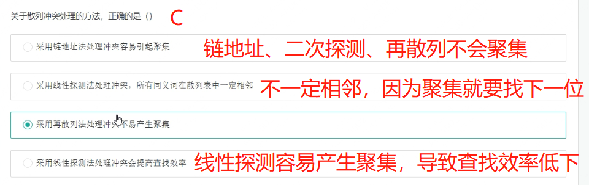

1.开放地址法：容易产生**堆积**问题；插入时可能会出现多次冲突的现象，不能直接删除元素，只能做懒惰删除；当装填因子过大时，性能急剧下降。

线性探测容易聚集，可采用二次探测或再哈希解决

2.链地址法：处理冲突简单，且无聚集现象，**平均查找长度短**；链表中的结点是动态申请的，适合构造表不能确定长度的情况。插入结点应该在链首，删除结点比较方便，只需调整指针而不需要对其他冲突元素作调整。


线性探测:简单,但可能导致记录的**聚集而使探测效率降低**;此外记录的个数必须在哈希表允许的范围内。

随机探测:可以克服记录聚集的现象,但需要选取合适的随机函数且记录的个数也有限制。

链地址法:只要空间允许就可插入任意多个记录,并且链表的插入和删除都很方便。可提高查找效率


一旦产生了冲突（该地址已有其它元素），就按某种规则去寻找另一空地址

若发生了第 i 次冲突，试探的下一个地址将增加di，基本公式是：
hi(key) = (h(key)+di) mod TableSize ( 1≤ i < TableSize )
di 决定了不同的解决冲突方案：线性探测、平方探测、双散列。
线性探测：di = i
平方探测：di = ± i2( +12, -12, +22, -22……)
双散列：di = i * h2(key)

### 算法设计的四个要求

1、可读性

2、正确性

3、健壮性

4、时间和空间效率

### 循环队列

#### 1、初始化


#### 2、判空

Q.front == Q.rear

#### 3、获取元素个数

(Q.rear - Q.front + MaxSize) % MaxSize

#### 4、入队

Q.base[Q.rear]=e; 将元素e放入Q.rear指向的空间

Q.rear=(Q.rear+1)%Maxsize rear指针向后移动一个单位

#### 5、出队

e=Q.base[Q.front];

Q.front=[Q.front+1]%Maxsize

#### 6、获取队头元素

Q.**base**[Q.front]

#### 7、获取队尾元素

Q.**base**[Q.rear - 1] 注意rear指向空，前一位才是队尾元素

### 二次散列


### 唯一确定一颗二叉树

一定要有**中序**才能唯一确定一颗二叉树

- 先序和后续只能确定根节点，再从中序分割出左右子树

- 根据根节点把中序遍历分为左右子树。

### 二叉树度和节点数

```
n2=n0-1 度为2的结点比叶子结点少一个
```

```
结论：二叉树中度数为2的节点数量比叶子节点少一个

证明：设0度节点（叶子节点）、一度节点、二度节点数量分别为n0,n1,n2

那么总的点数为n=n0+n1+n2。

而边的数量为m=n-1（树的性质）

同时又有m=2*n2+1*n1+0*n0

所以 n0+n1+n2-1=m=2n2+n1

所以 n2=n0-1
```


### 时间复杂度

```
log4n=log2^2n=0.5log2n
```


```java
下面两种道理都是一样的

//时间复杂度为 2^n
    
func(int n){
	if(n==1){
		return;
	}
	return n*func（n-1）（n-2）;
}


//时间复杂度：2^n
func(int n){
    if(n==1){
        return;
    }
    return f(n-1)+(n-2);
}

f(6)=        f(5)         +           f(4)
        f(4)        f(3)         f(3)       f(2)
   f(3)     (2)   f(2) f(1)   f(2)   f(1)
 f(2)(1)   f(1)
```

### 八大排序

平均比较次数：快排的**常数因子**要小于堆排序


**直接插入排序和冒泡排序的最好情况都是O(n)**

稳定性：跳跃的一定是不稳定的
希尔排序就是插入排序的升级版，不稳定的，复杂度最差最坏都是O(nlog2n)
归并排序：O(nlog2n),稳定

归并需要的O(n)的空间，快排需要O(nlogn)的空间

快排空间复杂度：O(log2n) 递归栈的空间


**直接插入排序**（稳定）：从第二位开始遍历，如果小于前一位，就找到往前找插入到最合适的位置。O(n^2)。稳定

**希尔排序**（不稳定）：插入排序的升级版，对一个增量进行插入排序，增量不断减小至1。O(nlogn)。会跳跃，不稳定

**冒泡排序**（稳定）：O(n^2)  左右交换，稳定

**快速排序**（不稳定）：O(nlogn)会跳跃，不稳定

**直接选择排序**：每次找到最小的，和开头进行跨域交换，所以不稳定。O(n^2)。不稳定，比如7，7，2，7和2交换之后就不稳定了

**堆排序**（不稳定）：O(nlogn) 会跳跃，不稳定

**归并排序**（稳定）：二路归并排序，倒满二叉树，子序列有序，再进行合并。O(nlogn) 稳定

**基数排序**（稳定）：O(d(n+r))。d表示最多的位数。个位，十位逐个比较，稳定

基数排序(Radix Sort)是桶排序的扩展。

将整数按位数切割成不同的数字，然后按每个位数分别比较。
具体做法是：将所有待比较数值统一为同样的数位长度，数位较短的数前面补零。然后，从最低位开始，依次进行一次排序。这样从最低位排序一直到最高位排序完成以后, 数列就变成一个有序序列。


### 计数排序


计数排序（Counting sort）是一种非基于比较的排序算法，其核心在于将输入的数据值转化为键存储在额外开辟的[数组](https://so.csdn.net/so/search?q=数组&spm=1001.2101.3001.7020)空间中以达到排序的效果


### 补码

符号位不变，各位取反，末位加一

```
负数的补码是将其原码除符号位之外的各位求反之后在末位再加1。
[-3]补=[10000011]补=11111101
```

### 强连通图

每一对顶点之间都存在路径

n个顶点的有向强连通图：至少有n条边（形成环），最多有n(n-1)条边

n个顶点的无向强连通图：至少有n-1条边（一条直线），最多有n(n-1)/2条边


#### 非连通图


### 点积


大于0，说明是锐角

小于0，说明是钝角

等于0，说明是直角

### 向量

AB+BC=AC

AB-AC=CB

### 排列组合

【1】、10个相同的糖果，分给3个孩子A、B、C，每个孩子至少一个，有多少种不同的分法？插板法C（9，2）=36

【2】、10个相同的糖果，分给3个孩子A、B、C，有多少种不同的分法？C（12，2）=66

【3】、10个相同的糖果，分给3个孩子A、B、C，每个孩子至少2个，有多少种不同的分法？C（6，2）=15

【4】、10个相同的糖果，分给3个孩子A、B、C，A至少一个，B至少2个，C可以没有，有多少种不同的分法？C（9，2）=36

【答案】

【1】第一题是最为典型的插板法的题目。10个糖果排成一排，共形成9个空，我从这9个空里选两个，插入隔板，便把这10个糖果分成了三份，每份起码有一个，这样的话，方法数就是**C（9，2）=36**。

【2】、与第一题不同，这里没有限制孩子获得的数量，意味着有些孩子可以分到0个。那么这时候就不能直接用插板法了，必须转化成每个孩子至少得到1个。怎么转化呢？

很简单，分这10个糖果之前就**给每个小朋友1个糖果**，这样就保证分的时候每个小朋友至少分一个了，就可以用插板法了，只不过这时的题就变成了“10+3=13个相同的糖果，分给3个孩子A、B、C，每个孩子至少一个，有多少种不同的分法？”.

13个糖果12个空，分成三组插两块板，方法数就是**C（12，2）=66**。

【3】.不能直接插板，需要先将至少2个转化成至少1个，咋转化？**先给每人1个**，剩下的至少每人一个就搞定啦！题目变为“10-1×3=7个相同的糖果，分给3个孩子A、B、C，每个孩子至少一个，有多少种不同的分法？”

7个糖果6个空，分成三组插两块板，方法数就是C（6，2）=15。

【4】此题综合了这几类题型，还是转化：A满足不用管；**B至少2个，需要先分掉1个**；**C可以不分，那就借一个给他**。 10-1+1=10，题目变成第一小题了，答案还是36.


1-（C5,6*2^5/C5,12）


[文章](https://zhuanlan.zhihu.com/p/41855459)

#### 排列

从n个不同元素中取出m个元素的所有排列的个数，记作 A（n，m）


#### 组合

从n个不同中取出m个元素的所有组合个数，记作 C（n，m）


### 等差和等比数列

等差数列：sn=(n(1+n))/2

等比数列：sn=(a1(1-q^n))/(1-q)


#### 从高度a下落，每次回到前一次的一半，问第b次到地面走了多少米

|      | 解 设球从第k次落地到第k＋1次落地所经过的路程为，则所求值为a＋是公比为，首项为a的等比数列，∴所求值为a＋＝a(米)．(答略) |
| ---- | ------------------------------------------------------------ |
|      |                                                              |

### 二叉搜索树

中序的前驱后继结点

### 最小生成树

最小生成树的**代价唯一**的，但**生成树不唯一**，比如每一条边都一样的生成树。

所有权值最小的边**不一定**会出现在所有的最小生成树中。

使用普里姆(Prim)算法从不同顶点开始得到的最小生成树不一定相同，比如每一条边都一样的生成树。

使用普里姆算法和克鲁斯卡尔(Kruskal)算法得到的最小生成树**可能相同**


#### prim（普里姆）算法

O(n^2) 

每次维护一个联通集（已形成的生成树），不断**加入距生成树最近的顶点**。

针对顶点进行，所以**边多**比较适合。

```
    int buildMinSpan_tree(int[][] dist, int n) {
        // 开始构造最小生成树
        int ans=0;
        int[] lowCost=new int[n], // 距联通集中的最短距离
                vertex=new int[n]; // 距联通集的最短距离对应的顶点

        // 首先把0加入联通集中（最小生成树从哪一个顶点开始结果是一样的）
        lowCost[0]=0;
        vertex[0]=0;
        for (int i = 1; i < n; i++) {
            lowCost[i]=dist[0][i]; // 初始化结点到联通集的距离为到顶点0的距离（lowCost=0表示已加入联通集）
            vertex[i]=0; // 相关顶点左边也为0
        }

        for (int i = 1; i < n; i++) {
            // 找到距离联通集最近的结点
            int k=-1,minValue=Integer.MAX_VALUE;
            // 遍历distance,找到最近的结点
            for (int j = 1; j < n; j++) {
                if(lowCost[j]!=0&&lowCost[j]<minValue){ // 未加入联通集，得到距离当前联通集最近的顶点
                    k=j; // 记录新加入的下标
                    minValue=lowCost[j]; // 更新最小值
                }
            }

            ans+=lowCost[k]; // 累计生成树的花费
            lowCost[k]=0; // 加入联通集

            // 更新distance数组，即到联通集的最短距离
            for (int j = 1; j < n; j++) {
                if(dist[k][j]<lowCost[j]){
                    // 新加入的顶点更近
                    vertex[j]=k;
                    lowCost[j]=dist[k][j];
                }
            }
        }
        return ans;
    }
```

[leetcode 1584. 连接所有点的最小费用](https://leetcode.cn/problems/min-cost-to-connect-all-points/)

[个人题解地址](https://leetcode.cn/problems/min-cost-to-connect-all-points/solution/primsuan-fa-by-moon-iw-dyi7/)

算法思想：
先找一个结点，之后不断加入距离联通集最近的顶点，同时更新顶点到联通集的最短距离。
Prim算法是针对顶点进行，所以边多的情况比较适合。


/**
 * 最小生成树之Prim算法
 * 使用数组lowCost表示距联通集中的最短距离，初始为到顶点0的距离；之后每加入一个顶点，更新数组
 * 使用数组vertex距联通集的最短距离对应的顶点存储距离已有生成树中距离
 * 时间：O（n^2）
 * 空间：O(n) 存储 距联通集中的最短距离 和 距联通集的最短距离对应的顶点
 */

参考：大话数据结构

#### Kruskal（克鲁斯卡尔）算法

O(eloge) 根据边决定

**贪心算法**：每次把最短的边连起来

eloge边先**排好序**，每次把边连起来，同时**保证不形成环**就连起来。

针对边排序，所以**边少比较适合**。

### 单源最短路径

#### Dijkstra（迪杰斯特拉）

每次找到距离源点的最近结点，如果未加入的节点能通过新加入的节点更短的到达源节点，那么更新v0到该结点的最短路径，O(n2)

#### Floyd（弗洛伊德算法）

如果有一个点k让i，j的距离更短，更新i，j的距离

三重循环，每次修改得到更小的前驱结点，O(n3)。

### 哈夫曼树

可用于**子网划分**

带权最短路径WPL最小的二叉树，**权重越大的让他路径越短**


### 红黑树

**B+树**插入操作的平均时间复杂度为O(logn)，最坏时间复杂度为**O(n)**
**Hash表**插入操作的平均时间复杂度为O(1)，最坏时间复杂度为O(n)
**排序链表**插入操作的平均和最坏时间复杂度为O(n)
**红黑树**插入操作的平均和最坏时间复杂度为**O(logn)**


解决**BST**倾斜问题，会退化成链表。二叉查找树增删查改的时间复杂度为O(logN)（其中N为节点数），最坏的情况下为O(N)

于是平衡二叉查找树(**Balanced BST**)产生了，平衡树在插入和删除的时候，会通过旋转操作将高度保持在logN。

其中两款具有代表性的平衡树分别为**AVL树和红黑树**。AVL树由于实现比较复杂，而且**插入和删除性能差**，在实际环境下的应用不如红黑树。

红黑树（Red-Black Tree，以下简称RBTree）的实际应用非常广泛，比如Linux内核中的完全公平调度器、高精度计时器、ext3文件系统等等，各种语言的函数库如Java的TreeMap和TreeSet，C++ STL的map、multimap、multiset等。

#### 时间复杂度

整个红黑树的查找，插入和删除都是O(logN)，因为**高度就是logn**,查找从根到叶，走过的路径是树的高度，删除和插入操作是从叶到根的，所以经过的路径都是logN。

https://blog.csdn.net/u014454538/article/details/120120216

```
1、头尾（nil）都是黑结点
2、从叶子结点到根节点黑色结点数目是一样的
3、不能有两个连续的红节点
```

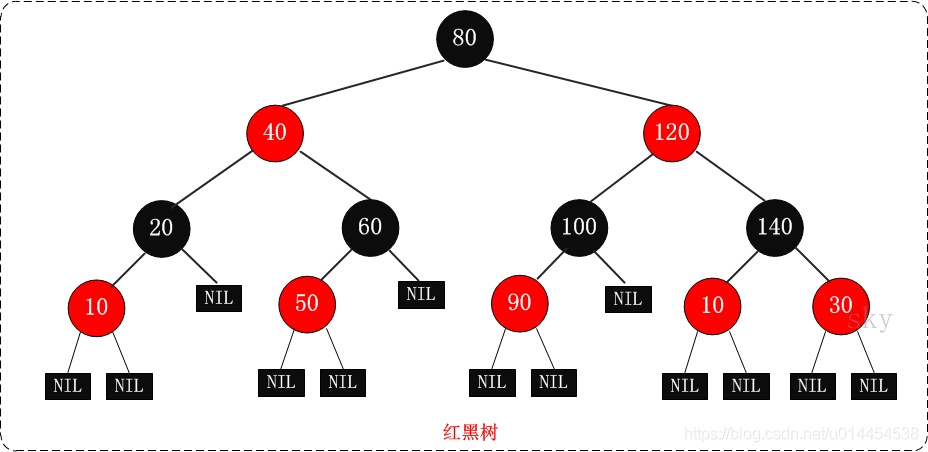

通过这些规则，保证红黑树的自平衡

#### 查询效率这么高，mysql为什么不用？

主要是**红黑树的高度会比较高**，磁盘io太大

#### HashMap为什么用红黑树而不用B树？

**数据都会“挤在”一个结点里面**，这个时候遍历效率就退化成了链表。

B/B+树多用于外存上时，B/B+也被成为一个磁盘友好的数据结构。

HashMap本来是数组+链表的形式，链表由于其查找慢的特点，所以需要被查找效率更高的树结构来替换。如果用B/B+树的话，在数据量不是很多的情况下，**数据都会“挤在”一个结点里面**，这个时候遍历效率就退化成了链表。

### B&B+树


**只有B+树支持顺序查找**（叶子结点存有所有结点，且是双向链表），B树不支持顺序查找

B+树和B树都支持随机查找**，都可做文件的索引结构，平衡多叉树


顺序查找：从头到尾挨个挨个遍历查找

随机查找：通过	下标直接定位访问

### 二叉排序树

#### `可能退化成链表`

### 平衡二叉树(AVL)

#### `每个结点的左右子树高度差至多等于一`

### 五大常用算法


​    **在分支限界法中，每一个活结点只有一次机会成为扩展结点**。活结点一旦成为扩展结点，就一**次性产生其所有儿子结点**。在这些儿子结点中，**导致不可行解或导致非最优解的儿子结点被舍弃**，其余儿子结点被加入活结点表中。  

#### 一、贪心算法

在对问题求解时，总是做出在当前看来是最好的选择，有可能陷入局部最优。 

本例中，5元和10元之间，5元和5元，10元和10元样本之间，没有明显次序，因此也无法“贪心”最优的那个。故贪心算法不适合。

#### 二、分治

将一个难以直接解决的大问题，分割成一些规模较小的相同问题，以便各个击破，分而治之。 

#### 三、动态规划

将待求解的问题分解为若干个子问题（阶段），按顺序求解子阶段，前一子问题的解，为后一子问题的求解提供了有用的信息。**与分治的区别：**经分解后得到的子问题往往不是互相独立的（即下一个子阶段的求解是建立在上一个子阶段的解的基础上，进行进一步的求解）。 

#### 四、回溯

在包含问题的所有解的解空间树中，按照**深度优先**搜索的策略，从根结点出发深度探索解空间树。当探索到某一结点时，要先判断该结点是否包含问题的解，如果包含，就从该结点出发继续探索下去，如果该结点不包含问题的解，则逐层向其祖先结点回溯。 

#### 五、分支限界法

采用**广度优先**的策略，在问题的解空间树T上搜索问题解。**与回溯区别：**回溯法的求解目标是找出T中满足约束条件的所有解，而分支限界法的求解目标则是找出满足约束条件的一个解，或是在满足约束条件的解中找出使某一目标函数值达到极大或极小的解，即在某种意义下的最优解。 


  至于题目，题意为排队购票，大的调整肯定不行，否则我直接喊所有5块的站前边，10块的站后边，排队的人肯定不乐意。 

  所以，必须**依着本来的排队顺序，一步一步走**，即从根结点出发，一步一步判断。就是分支限界的FIFO搜索：**将活节点表组织成一个队列**，并将队列的先进先出原则，选取下一个节点为当前扩展节点。（其实都不知道自己在说什么）


这个是卡特兰数的经典应用。但是这个问题不是一两句话能说得清的，介绍卡特兰数的文章都用大量的篇幅讲他的原理。这里给你一个类似问题的描述，看看能不能看懂。 

  问题描述: 

  12个高矮不同的人，排成两排，每排必须是从矮到高排列，而且第二排比对应的第一排的人高，问排列方式有多少种？ 

  这个笔试题，很YD，因为把某个递推关系隐藏得很深。 

  问题分析: 

  我们先把这12个人从低到高排列,然后,选择6个人排在第一排,那么剩下的6个肯定是在第二排. 

  用0表示对应的人在第一排,用1表示对应的人在第二排,那么含有6个0,6个1的序列,就对应一种方案. 

  比如000000111111就对应着 

  第一排：0 1 2 3 4 5 

  第二排：6 7 8 9 10 11 

  010101010101就对应着 

  第一排：0 2 4 6 8 10 

  第二排：1 3 5 7 9 11 

  问题转换为，这样的满足条件的01序列有多少个。 

  观察1的出现，我们考虑这一个出现能不能放在第二排，显然，在这个1之前出现的那些0,1对应的人 

  要么是在这个1左边，要么是在这个1前面。而肯定要有一个0的，在这个1前面，统计在这个1之前的0和1的个数。 

  也就是要求，0的个数大于1的个数。 

  OK，问题已经解决。 

  如果把0看成入栈操作，1看成出栈操作，就是说给定6个元素，合法的入栈出栈序列有多少个。 

  这就是catalan数,这里只是用于栈，等价地描述还有，二叉树的枚举、多边形分成三角形的个数、圆括弧插入公式中的方法数，其通项是c(2n,  n)/(n+1)。 

  在<<计算机程序设计艺术>>，第三版，Donald  E.Knuth著，苏运霖译，第一卷，508页，给出了证明: 

  问题大意是用S表示入栈，X表示出栈，那么合法的序列有多少个(S的个数为n) 

  显然有c(2n, n)个含S，X各n个的序列，剩下的是计算不允许的序列数(它包含正确个数的S和X，但是违背其它条件)。 

  在任何不允许的序列中，定出使得X的个数超过S的个数的第一个X的位置。然后在导致并包括这个X的部分序列中，以S代替所有的X并以X代表所有的S。结果是一个有(n+1)个S和(n-1)个X的序列。反过来，对一垢一种类型的每个序列，我们都能逆转这个过程，而且找出导致它的前一种类型的不允许序列。例如XXSXSSSXXSSS必然来自SSXSXXXXXSSS。这个对应说明，不允许的序列的个数是c(2n,  n-1)，因此an = c(2n, n) - c(2n, n-1)。 

  

   分支限界法常以广度优先或以最小耗费（最大效益）优先的方式搜索问题的解空间树。  

​    **在分支限界法中，每一个活结点只有一次机会成为扩展结点**。活结点一旦成为扩展结点，就一**次性产生其所有儿子结点**。在这些儿子结点中，**导致不可行解或导致非最优解的儿子结点被舍弃**，其余儿子结点被加入活结点表中。  

  

   此后，从活结点表中取下一结点成为当前扩展结点，并重复上述结点扩展过程。这个过程一直持续到找到所需的解或活结点表为空时为止。  

  然后回到本问题，排队买票的每个人都是不同的，n个人有5元，n个人有10美分，最后结果在乘以A（n,n）*A(n,n),即为“[c(2n,  n) - c(2n, n-1)]*A（n,n）*A(n,n)” 

  如果是填空题填多少种方法就是  (2n)!/[n!(n+1)!]

### 邻接表


当一个图为**稀疏图**时，使用[邻接矩阵](https://so.csdn.net/so/search?q=邻接矩阵&spm=1001.2101.3001.7020)表示显然要**浪费大量的存储空间**，而图的邻接表法结合了**顺序**存储和**链式**存储方法，大大减少了这种不必要的浪费。

#### 节点个数(空间复杂度)

有向图：v+e

无向图：v+2e


### 三元组


### 十字链表


对于压缩存储稀疏矩阵，无论是使用[三元组顺序表](http://data.biancheng.net/view/184.html)，还是使用[行逻辑链接的顺序表](http://data.biancheng.net/view/185.html)，归根结底是使用[数组](http://data.biancheng.net/view/309.html)存储稀疏矩阵。介于数组 "不利于插入和删除数据" 的特点，以上两种压缩存储方式都不适合解决类似 "向矩阵中添加或删除非 0 元素" 的问题。

例如，A 和 B 分别为两个矩阵，在实现 "将矩阵 B 加到矩阵 A 上" 的操作时，矩阵 A 中的元素会发生很大的变化，之前的非 0 元素可能变为 0，而 0 元素也可能变为非 0 元素。对于此操作的实现，之前所学的压缩存储方法就显得力不从心。

本节将学习用十字

[链表](http://data.biancheng.net/view/298.html)

存储稀疏矩阵，该存储方式采用的是 "链表+数组" 结构，如


图 1 十字链表示意图


使用十字链表压缩存储稀疏矩阵时，矩阵中各行各列的元素都用一条链表存储，与此同时，将所有行链表的表头存储到一个数组（rhead），将所有列链表的表头存储到另一个数组（chead）中。

各个链表中节点的结构应如图 2 所示：


图 2 十字链表的节点结构


两个指针域分别指向所在行的下一个元素和所在列的下一个元素。

可以用如下的结构体来表示链表中的节点：

```
typedef struct OLNode{    int i,j;//元素的行标和列标    int data;//元素的值    struct OLNode * right,*down;//两个指针域}OLNode, *OLink;
```


在此基础上，表示十字链表的结构体为：

```
typedef struct{    OLink *rhead, *chead; //行和列链表头指针    int mu, nu, tu;  //矩阵的行数,列数和非零元的个数}CrossList;
```


以存储图 1 所示的矩阵为例，十字链表存储该矩阵的 C 语言实现代码为：

```
#include<stdio.h>
#include<stdlib.h>

typedef struct OLNode
{
    int i, j, e; //矩阵三元组i代表行 j代表列 e代表当前位置的数据
    struct OLNode* right, * down; //指针域 右指针 下指针
}OLNode, * OLink;

typedef struct
{
    OLink* rhead, * chead; //行和列链表头指针
    int mu, nu, tu;  //矩阵的行数,列数和非零元的个数
}CrossList;

void CreateMatrix_OL(CrossList* M);
void display(CrossList M);

int main()
{
    CrossList M;
    M.rhead = NULL;
    M.chead = NULL;
    CreateMatrix_OL(&M);

    printf("输出矩阵M:\n");
    display(M);
    return 0;
}

void CreateMatrix_OL(CrossList* M)
{
    int m, n, t;
    int num = 0;
    int i, j, e;
    OLNode* p = NULL, * q = NULL;
    printf("输入矩阵的行数、列数和非0元素个数：");
    scanf("%d%d%d", &m, &n, &t);
    (*M).mu = m;
    (*M).nu = n;
    (*M).tu = t;

    if (!((*M).rhead = (OLink*)malloc((m + 1) * sizeof(OLink))) || !((*M).chead = (OLink*)malloc((n + 1) * sizeof(OLink))))
    {
        printf("初始化矩阵失败");
        exit(0);
    }
   
    for (i = 0; i <= m; i++)
    {
        (*M).rhead[i] = NULL;
    }
    for (j = 0; j <= n; j++)
    {
        (*M).chead[j] = NULL;
    }

    while (num < t) {
        scanf("%d%d%d", &i, &j, &e);
        num++;
        if (!(p = (OLNode*)malloc(sizeof(OLNode))))
        {
            printf("初始化三元组失败");
            exit(0);
        }
        p->i = i;
        p->j = j;
        p->e = e;

        //链接到行的指定位置
        //如果第 i 行没有非 0 元素，或者第 i 行首个非 0 元素位于当前元素的右侧，直接将该元素放置到第 i 行的开头
        if (NULL == (*M).rhead[i] || (*M).rhead[i]->j > j)
        {
            p->right = (*M).rhead[i];
            (*M).rhead[i] = p;
        }
        else
        {
            //找到当前元素的位置
            for (q = (*M).rhead[i]; (q->right) && q->right->j < j; q = q->right);
            //将新非 0 元素插入 q 之后
            p->right = q->right;
            q->right = p;
        }

        //链接到列的指定位置
        //如果第 j 列没有非 0 元素，或者第 j 列首个非 0 元素位于当前元素的下方，直接将该元素放置到第 j 列的开头
        if (NULL == (*M).chead[j] || (*M).chead[j]->i > i)
        {
            p->down = (*M).chead[j];
            (*M).chead[j] = p;
        }
        else
        {
            //找到当前元素要插入的位置
            for (q = (*M).chead[j]; (q->down) && q->down->i < i; q = q->down);
            //将当前元素插入到 q 指针下方
            p->down = q->down;
            q->down = p;
        }
    }
}

void display(CrossList M) {
    int i,j;
    //一行一行的输出
    for (i = 1; i <= M.mu; i++) {
        //如果当前行没有非 0 元素，直接输出 0
        if (NULL == M.rhead[i]) {
            for (j = 1; j <= M.nu; j++) {
                printf("0 ");
            }
            putchar('\n');
        }
        else
        {
            int n = 1;
            OLink p = M.rhead[i];
            //依次输出每一列的元素
            while (n <= M.nu) {
                if (!p || (n < p->j) ) {
                    printf("0 ");
                }
                else
                {
                    printf("%d ", p->e);
                    p = p->right;
                }
                n++;
            }
            putchar('\n');
        } 
    }
}
```

运行结果：

```
输入矩阵的行数、列数和非0元素个数：3 4 4
1 1 3
1 4 5
2 2 -1
3 1 2
输出矩阵M:
3 0 0 5
0 -1 0 0
2 0 0 0
```

### 对角矩阵

对角矩阵(diagonal matrix)是一个主对角线之外的元素皆为0的矩阵，常写为diag（a1，a2,...,an) 。对角矩阵可以认为是矩阵中最简单的一种，值得一提的是：对角线上的元素可以为 0 或其他值，对角线上元素相等的对角矩阵称为数量矩阵；对角线上元素全为1的对角矩阵称为单位矩阵。对角矩阵的运算包括和、差运算、数乘运算、同阶对角阵的乘积运算，且结果仍为对角阵。


### 最大公约数

    // 辗转相除法迭代
    public int gcd2(int m,int n){
        if(n==0)
            return m;
        return gcd2(n,m%n);
    }


```
m*n=最大公约数*最小公倍数

辗转相除法或辗转相减法
```

```java
    // 辗转相除法递归
    public int gcd1(int m,int n){
        while (n!=0){
            int remainder=m%n;
            m=n;
            n=remainder;
        }
        return m;
    }
    // 辗转相除法迭代
    public int gcd2(int m,int n){
        if(n==0)
            return m;
        return gcd2(n,m%n);
    }

    // 辗转相减法
    public int gcd3(int m,int n){
        while(m!=n){
            if(m>n){
                m=m-n;
            }
            else{
                n=n-m;
            }
        }
	    return m;
    }
```

### 二进制序列中1的个数

判定**和1与运算**之后的结果是否等于0，等于0则跳出循环。

```
public class Test {
    //求一个二进制数中的1的个数法2：
 
    public static void main(String[] args) {
 
        int num;
        int count = 0;
        while(num != 0){
            if((num & 1) != 0){
                count++;
            }
            num >>>= 1;    //无符号右移
        }
        System.out.println(count);
    }
}
```


**n& (n-1）**：n-1二进制序列中的1的个数比n中少了1个。


```
public class Test {
    public static void main(String[] args) {
        int num;
        int count = 0;
        while(num != 0){
            count ++;
            num = num & (num - 1);
        }
        System.out.println(count);
    }
}
```


### 快排:会退化成O(n2)

[博客园](https://www.cnblogs.com/MOBIN/p/4681369.html)

```java

    public static void quickSort(int arr[],int _left,int _right){
        int left = _left;
        int right = _right;
        int temp = 0;
        if(left <= right){   //待排序的元素至少有两个的情况
            temp = arr[left];  //待排序的第一个元素作为基准元素
            while(left != right){   //从左右两边交替扫描，直到left = right
                while(right > left && arr[right] >= temp)  
                     right --;        //从右往左扫描，找到第一个比基准元素小的元素
                  arr[left] = arr[right];  //找到这种元素arr[right]后与arr[left]交换
                while(left < right && arr[left] <= temp)
                     left ++;         //从左往右扫描，找到第一个比基准元素大的元素
                  arr[right] = arr[left];  //找到这种元素arr[left]后，与arr[right]交换
            }
            arr[right] = temp;    //基准元素归位
            quickSort(arr,_left,left-1);  //对基准元素左边的元素进行递归排序
            quickSort(arr, right+1,_right);  //对基准元素右边的进行递归排序
        }        
    }
```

### 堆排序`len/2+1为最后一个非叶子结点`

[博客园](https://www.cnblogs.com/chengxiao/p/6129630.html)

```java
package sortdemo;

import java.util.Arrays;

/**
 * Created by chengxiao on 2016/12/17.
 * 堆排序demo
 */
public class HeapSort {
    public static void main(String []args){
        int []arr = {9,8,7,6,5,4,3,2,1};
        sort(arr);
        System.out.println(Arrays.toString(arr));
    }
    public static void sort(int []arr){
        //1.构建大顶堆
        for(int i=arr.length/2-1;i>=0;i--){
            //从第一个非叶子结点从下至上，从右至左调整结构
            adjustHeap(arr,i,arr.length);
        }
        //2.调整堆结构+交换堆顶元素与末尾元素
        for(int j=arr.length-1;j>0;j--){
            swap(arr,0,j);//将堆顶元素与末尾元素进行交换
            adjustHeap(arr,0,j);//重新对堆进行调整
        }

    }

    /**
     * 调整大顶堆（仅是调整过程，建立在大顶堆已构建的基础上）
     * @param arr
     * @param i
     * @param length
     */
    public static void adjustHeap(int []arr,int i,int length){
        int temp = arr[i];//先取出当前元素i
        for(int k=i*2+1;k<length;k=k*2+1){//从i结点的左子结点开始，也就是2i+1处开始
            if(k+1<length && arr[k]<arr[k+1]){//如果左子结点小于右子结点，k指向右子结点
                k++;
            }
            if(arr[k] >temp){//如果子节点大于父节点，将子节点值赋给父节点（不用进行交换）
                arr[i] = arr[k];
                i = k;
            }else{
                break;
            }
        }
        arr[i] = temp;//将temp值放到最终的位置
    }

    /**
     * 交换元素
     * @param arr
     * @param a
     * @param b
     */
    public static void swap(int []arr,int a ,int b){
        int temp=arr[a];
        arr[a] = arr[b];
        arr[b] = temp;
    }
}
```

##### 设一课完全二叉树共有999个结点，则在该二叉树中的叶节点个数是？

```
最后一个结点999/2=499为它的父节点，说明它499之后都是叶子节点，所以999-499=500
```

##### 给定一个由若干 0 和 1 组成的数组 A，我们最多可以将 K 个值从 0 变成 1 ，返回仅包含 1 的最长（连续）子数组的长度

```
    public static int GetMaxConsecutiveOnes(int[] arr, int k) {
        // 判断数组长度是否小于等于将0变为1的长度  若是 则最长连续为数组的长度
        if (arr.length <= k) {
            return arr.length;
        }
        int i = 0;
        // 存储最长连续子数组的长度
        int max = 0;
        // 从索引为0的数组下标开始循环    直到索引大于数组长度减去k的长度
        while (i < arr.length - k) {
            // 定义将0变为1的次数
            int count = 0;
            // 从索引为i处开始循环对比
            int j = i;
            for (; j < arr.length; j++) {
                // 如果索引位置处的值不为1   则将count++  意思为将0变成1了
                if (arr[j] != 1) {
                    count++;
                }
                // 如果将0变为1的次数 大于最初定义的k次数 则将长度和最大值对比  保留最长的长度
                if (count > k) {
                    max = max > j - i ? max : j - i;
                    break;
                }
            }
            // 如果循环完毕最终长度和数组长度相同  则再将长度和最大值对比  保留最长的长度
            if (j==arr.length){
                max = max > j - i ? max : j - i;
            }
            i++;
        }
        return max;

    }
    
    
    
```

## MongoDB

支持副本集部署

数据记录的格式是json，数据存放格式是BSON


### 聚合代码

```
db.driveevent.aggregate([
    {
        $group:{
        _id:null, //null表示不作任何分组
        count:{$sum:1}
        }
    }
])

db.driveevent.aggregate([
    {$match:{'type':1}},
    {
        $group:{
        _id:null, //null表示不作任何分组
        count:{$sum:1}
        }
    }
])

db.driveevent.aggregate([{
    $bucket: {
        groupBy:['$vin','$type'],
        boundaries:[0,1,2,3,4,5,6,7,8,9],
        default:'other',
        output:{'count':{$sum:1}}
    }
}])

db.driveevent.aggregate([
    {
        $match: {
            "event_start_time": {
                "$gt": '2022-1-15 00:00:00'
            },
             "event_end_time": {
                "$lt": '2022-12-15 00:00:00'
            },
            "vo.max_press":{
                "$ne":null
            }
        }
    },
    {$group : [{
        _id :{vin:"$vin",type: "$type"} ,
        总数 : {$sum : 1 }
        }
        ]
    }
]);

db.driveevent.aggregate([
{
    "$facet":{
       "remindTime": [
       {
          "$group": {
             "_id": {vin:"$vin",type: "$type"},
             总数 : {$sum : 1 }
          }
       }],
        "ListOfName22": [
          { "$group": {
             "_id": "$vin",
             总数 : {$sum : 1 }
          }}
       ]
    }
}
]);


db.driveevent.find({
    "broadcast_date":{
    "$ne":null
    }
})

//以下是汇总组多个结果的查询->
db.driveevent.aggregate([
    { "$facet": {
       "remindTime": [
           {$match:{
                "event_start_time": {
                    "$gte": "2022-01-08T03:53:00.000Z"
                },
                 "event_end_time": {
                    "$lte": "2022-12-08T03:53:00.000Z"
                },
                "broadcast_date":{
                    "$ne":null
                }
                }
            },
          { "$group": {
             "_id": {vin:"$vin",type: "$type"},
             remindTime : {$sum : 1 }
          }},
            { "$sort": {"_id.vin":1,"_id.type":1} }
       ],
       "obeyTime": [
                  {$match:{
                "event_start_time": {
                    "$gte": "2022-01-08T03:53:00.000Z"
                },
                 "event_end_time": {
                    "$lte": "2022-12-08T03:53:00.000Z"
                },
                "vo.follow_start_date":{
                    "$ne":null
                }
                }
            },
          { "$group": {
             "_id": {vin:"$vin",type: "$type"},
             obeyTime : {$sum : 1 }
          }},
            { "$sort": {"_id.vin":1,"_id.type":1} }
       ]
    }}
 ])


db.driveevent.aggregate([
    {$match: {vin: {$ne: 1}}
    },
    {$group : {
        _id :{senderId:"$vin",
              rUserId: "$type",
        } ,
        total_num : {$sum : 1 }}
    },
//    {$match: {total_num: {$gt: 10}}}
]);


db.driveevent.aggregate([
    {$match: {vin: {$ne: 1}}
    },
    {$group : {
        _id :{senderId:"$vin",
              rUserId: "$type",
        } ,
        total_num : {$sum : 1 }}
    }
]);
```


## 分布式算法

### paxos算法

分布式共识算法

### raft算法

分布式共识算法

复制日志来实现多副本状态机

动图：https://thesecretlivesofdata.com/raft/

https://blog.csdn.net/daaikuaichuan/article/details/98627822

#### 1、Raft分为哪几个部分？

  **主要是分为leader选举、日志复制、日志压缩、成员变更等**。

#### 2、Raft中任何节点都可以发起选举吗？

  Raft发起选举的情况有如下几种：

- 刚启动时，所有节点都是follower，这个时候发起选举，选出一个leader；
- 当leader挂掉后，**时钟最先跑完的follower发起重新选举操作**，选出一个新的leader。
- 成员变更的时候会发起选举操作。

#### 3、Raft中选举中给候选人投票的前提？

  **Raft确保新当选的Leader包含所有已提交（集群中大多数成员中已提交）的日志条目**。这个保证是在RequestVoteRPC阶段做的，candidate在发送RequestVoteRPC时，会带上自己的**last log entry的term_id和index**，follower在接收到RequestVoteRPC消息时，**如果发现自己的日志比RPC中的更新，就拒绝投票**。日志比较的原则是，如果本地的最后一条log entry的term id更大，则更新，如果term id一样大，则日志更多的更大(index更大)。

#### 4、Raft网络分区下的数据一致性怎么解决？

  发生了网络分区或者网络通信故障，**使得Leader不能访问大多数Follwer了，那么Leader只能正常更新它能访问的那些Follower，而大多数的Follower因为没有了Leader，他们重新选出一个Leader**，然后这个 Leader来接受客户端的请求，如果客户端要求其添加新的日志，这个新的Leader会通知大多数Follower。**如果这时网络故障修复 了，那么原先的Leader就变成Follower，在失联阶段这个老Leader的任何更新都不能算commit，都回滚，接受新的Leader的新的更新（递减查询匹配日志）**。


#### 5、Raft数据一致性如何实现？

  **主要是通过日志复制实现数据一致性，leader将请求指令作为一条新的日志条目添加到日志中，然后发起RPC 给所有的follower，进行日志复制，进而同步数据**。

#### 6、Raft的日志有什么特点？

  **日志由有序编号（log index）的日志条目组成，每个日志条目包含它被创建时的任期号（term）和用于状态机执行的命令**。

#### 7、Raft和Paxos的区别和优缺点？

- Raft的leader有限制，**拥有最新日志的节点才能成为leader**，multi-paxos中对成为Leader的限制比较低，**任何节点都可以成为leader**。
- **Raft中Leader在每一个任期都有Term**号。

#### 8、Raft prevote机制？


  **Prevote（预投票）是一个类似于两阶段提交的协议**，**第一阶段先征求其他节点是否同意选举，如果同意选举则发起真正的选举操作，否则降为Follower角色**。这样就**避免了网络分区节点重新加入集群，触发不必要的选举操作**。

#### 9、Raft里面怎么保证数据被commit，leader宕机了会怎样，之前的没提交的数据会怎样？

  **leader会通过RPC向follower发出日志复制，等待所有的follower复制完成，这个过程是阻塞的**。

  **老的leader里面没提交的数据会回滚，然后同步新leader的数据**。

#### 10、Raft日志压缩是怎么实现的？增加或删除节点呢？？

  在实际的系统中，**不能让日志无限增长**，否则**系统重启时需要花很长的时间进行回放**，从而影响可用性。**Raft采用对整个系统进行snapshot来解决，snapshot之前的日志都可以丢弃（以前的数据已经落盘了）**。

  **snapshot里面主要记录的是日志元数据，即最后一条已提交的 log entry的 log index和term**。

#### 11、Raft里面的lease机制是什么，有什么作用？

  **租约机制确保了一个时刻最多只有一个leader，避免只使用心跳机制产生双主的问题**。**中心思想是每次租约时长内只有一个节点获得租约、到期后必须重新颁发租约**。


#### 12、Raft协议的leader选举，正常情况下，网络抖动造成follower发起leader选举，且该follower的Term比现有leader高，集群中所有结点的日志信息当前一致，这种情况下会选举成功吗？

  **参考网络分区的情况**。

## SringCloud

### setinel

Sentinel实现**限流、隔离、降级、熔断**等功能，本质要做的就是两件事情：

- 统计数据：统计某个资源的访问数据（QPS、RT等信息）
- 规则判断：判断限流规则、隔离规则、降级规则、熔断规则是否满足

总体基于责任链模式，每个链路节点抽象成××slot，一些slot进行数据统计，一些进行规则判断等，然后基于各种限流算法实现对应的限流规则等。主要组件有ProcessorSLotChain处理器链，链路节点Node，资源Entry，上下文Context等


#### 一、限流算法

1、滑动时间窗口计数器算法

限流中的快速失败、warm up、QPS计数


2、令牌桶算法

参数限流


3、漏桶算法

排队等待效


#### 二、概念组件

#### ProcessorSlotChain

setinel的核心骨架是`ProcessorSlotChain`**处理器槽链**，基于**责任链模式**，将不同的功能（限流、降级、系统保护）封装为一个个的Slot，请求进入后逐个执行即可


责任链中的Slot也分为两大类：

- 统计数据构建部分（statistic）
  - NodeSelectorSlot：负责构建簇点链路中的节点（DefaultNode），将这些节点形成链路树
  - ClusterBuilderSlot：负责构建某个资源的ClusterNode，ClusterNode可以保存资源的运行信息（响应时间、QPS、block 数目、线程数、异常数等）以及来源信息（origin名称）
  - StatisticSlot：负责统计实时调用数据，包括运行信息、来源信息等
- 规则判断部分（rule checking）
  - AuthoritySlot：负责授权规则（来源控制）
  - SystemSlot：负责系统保护规则
  - ParamFlowSlot：负责热点参数限流规则
  - FlowSlot：负责限流规则
  - DegradeSlot：负责降级规则

#### Node

链路节点

Sentinel中的簇点链路是由一个个的Node组成的，Node是一个接口，包括下面的实现：

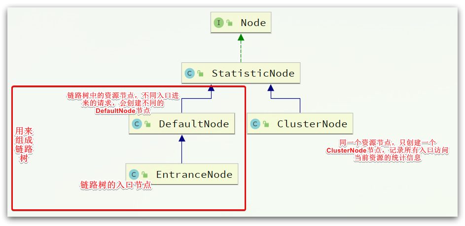

所有的节点都可以记录对资源的访问统计数据，所以都是StatisticNode的子类。

按照作用分为两类Node：

- DefaultNode：代表链路树中的每一个资源，一个资源出现在不同链路中时，会创建不同的DefaultNode节点。而树的入口节点叫EntranceNode，是一种特殊的DefaultNode
- ClusterNode：代表资源，一个资源不管出现在多少链路中，只会有一个ClusterNode。记录的是当前资源被访问的所有统计数据之和。


DefaultNode记录的是资源在当前链路中的访问数据，用来实现基于链路模式的限流规则。ClusterNode记录的是资源在所有链路中的访问数据，实现默认模式、关联模式的限流规则。


例如：我们在一个SpringMVC项目中，有两个业务：

- 业务1：controller中的资源`/order/query`访问了service中的资源`/goods`
- 业务2：controller中的资源`/order/save`访问了service中的资源`/goods`

创建的链路图如下：


#### Entry

基于**AOP**思想，对资源标记的方法环绕增强，完成对**资源**Entry的创建


```java
@Aspect
public class SentinelResourceAspect extends AbstractSentinelAspectSupport {
	// 切点是添加了 @SentinelResource注解的类
    @Pointcut("@annotation(com.alibaba.csp.sentinel.annotation.SentinelResource)")
    public void sentinelResourceAnnotationPointcut() {
    }
	
    // 环绕增强
    @Around("sentinelResourceAnnotationPointcut()")
    public Object invokeResourceWithSentinel(ProceedingJoinPoint pjp) throws Throwable {
        // 获取受保护的方法
        Method originMethod = resolveMethod(pjp);
		// 获取 @SentinelResource注解
        SentinelResource annotation = originMethod.getAnnotation(SentinelResource.class);
        if (annotation == null) {
            // Should not go through here.
            throw new IllegalStateException("Wrong state for SentinelResource annotation");
        }
        // 获取注解上的资源名称
        String resourceName = getResourceName(annotation.value(), originMethod);
        EntryType entryType = annotation.entryType();
        int resourceType = annotation.resourceType();
        Entry entry = null;
        try {
            // 创建资源 Entry
            entry = SphU.entry(resourceName, resourceType, entryType, pjp.getArgs());
            // 执行受保护的方法
            Object result = pjp.proceed();
            return result;
        } catch (BlockException ex) {
            return handleBlockException(pjp, annotation, ex);
        } catch (Throwable ex) {
            Class<? extends Throwable>[] exceptionsToIgnore = annotation.exceptionsToIgnore();
            // The ignore list will be checked first.
            if (exceptionsToIgnore.length > 0 && exceptionBelongsTo(ex, exceptionsToIgnore)) {
                throw ex;
            }
            if (exceptionBelongsTo(ex, annotation.exceptionsToTrace())) {
                traceException(ex);
                return handleFallback(pjp, annotation, ex);
            }

            // No fallback function can handle the exception, so throw it out.
            throw ex;
        } finally {
            if (entry != null) {
                entry.exit(1, pjp.getArgs());
            }
        }
    }
}
```

#### Context

什么是Context呢？

- Context 代表调用链路上下文，贯穿一次调用链路中的所有资源（ `Entry`），基于ThreadLocal。
- Context 维持着入口节点（`entranceNode`）、本次调用链路的 curNode（当前资源节点）、调用来源（`origin`）等信息。
- 后续的Slot都可以通过Context拿到DefaultNode或者ClusterNode，从而获取统计数据，完成规则判断
- Context初始化的过程中，会创建EntranceNode，contextName就是EntranceNode的名称

对应的API如下：

```java
// 创建context，包含两个参数：context名称、 来源名称
ContextUtil.enter("contextName", "originName");
```


在`AbstractSentinelInterceptor`中初始化

`HandlerInterceptor`拦截器会拦截一切进入controller的方法，执行`preHandle`前置拦截方法，而Context的初始化就是在这里完成的。

```java
@Override
public boolean preHandle(HttpServletRequest request, HttpServletResponse response, Object handler)
    throws Exception {
    try {
        // 获取资源名称，一般是controller方法的@RequestMapping路径，例如/order/{orderId}
        String resourceName = getResourceName(request);
        if (StringUtil.isEmpty(resourceName)) {
            return true;
        }
        // 从request中获取请求来源，将来做 授权规则 判断时会用
        String origin = parseOrigin(request);
        
        // 获取 contextName，默认是sentinel_spring_web_context
        String contextName = getContextName(request);
        // 创建 Context
        ContextUtil.enter(contextName, origin);
        // 创建资源，名称就是当前请求的controller方法的映射路径
        Entry entry = SphU.entry(resourceName, ResourceTypeConstants.COMMON_WEB, EntryType.IN);
        request.setAttribute(baseWebMvcConfig.getRequestAttributeName(), entry);
        return true;
    } catch (BlockException e) {
        try {
            handleBlockException(request, response, e);
        } finally {
            ContextUtil.exit();
        }
        return false;
    }
}
```

#### ProcessorSlotChain执行流程

##### StatisticSlot

StatisticSlot负责统计实时调用数据，包括运行信息（访问次数、线程数）、来源信息等。

StatisticSlot是实现限流的关键，其中基于**滑动时间窗口算法**维护了计数器，统计进入某个资源的请求次数。

核心代码：

```java
@Override
public void entry(Context context, ResourceWrapper resourceWrapper, DefaultNode node, 
                  int count, boolean prioritized, Object... args) throws Throwable {
    try {
        // 放行到下一个 slot，做限流、降级等判断
        fireEntry(context, resourceWrapper, node, count, prioritized, args);

        // 请求通过了, 线程计数器 +1 ，用作线程隔离
        node.increaseThreadNum();
        // 请求计数器 +1 用作限流
        node.addPassRequest(count);

        if (context.getCurEntry().getOriginNode() != null) {
            // 如果有 origin，来源计数器也都要 +1
            context.getCurEntry().getOriginNode().increaseThreadNum();
            context.getCurEntry().getOriginNode().addPassRequest(count);
        }

        if (resourceWrapper.getEntryType() == EntryType.IN) {
            // 如果是入口资源，还要给全局计数器 +1.
            Constants.ENTRY_NODE.increaseThreadNum();
            Constants.ENTRY_NODE.addPassRequest(count);
        }

        // 请求通过后的回调.
        for (ProcessorSlotEntryCallback<DefaultNode> handler : StatisticSlotCallbackRegistry.getEntryCallbacks()) {
            handler.onPass(context, resourceWrapper, node, count, args);
        }
    } catch (Throwable e) {
        // 各种异常处理就省略了。。。
        context.getCurEntry().setError(e);

        throw e;
    }
}
```


另外，需要注意的是，所有的计数+1动作都包括两部分，以` node.addPassRequest(count);`为例：

```java
@Override
public void addPassRequest(int count) {
    // DefaultNode的计数器，代表当前链路的 计数器
    super.addPassRequest(count);
    // ClusterNode计数器，代表当前资源的 总计数器
    this.clusterNode.addPassRequest(count);
}
```

具体计数方式，我们后续再看。

接下来，进入规则校验的相关slot了，依次是：

- AuthoritySlot：负责授权规则（来源控制）
- SystemSlot：负责系统保护规则
- ParamFlowSlot：负责热点参数限流规则
- FlowSlot：负责限流规则
- DegradeSlot：负责降级规则

AuthoritySlot

## UML

### 软件生命周期三个阶段


软件生命周期分为**软件定义**、**软件开发**及**软件运行维护**3个阶段。详细设计、软件编码和软件测试都属于软件开发阶段；

维护是软件生命周期的**最后一个阶段**，也是持续**时间最长**、花费**代价最大**的一个阶段**，软件工程学的一个目的就是提高软件的可维护性，降低维护的代价**。

### 软件生命周期模型

#### 1、瀑布模型


#### 2、快速原型模型


#### 3、增量模型


#### 4、螺旋模型


#### 5、喷泉模型


### UML需求分析步骤

（1）利用**用例及用例图**表示**需求**。从业务需求描述出发获取执行者和场景；对场景进行汇总、分类、抽象；形成用例；确定执行者与用例、用例与用例图之间的关系，生成用例图。

（2）利用**包图及类图**表示目标软件系统的**总体框架结构**。根据领域知识、业务需求描述和既往经验设计目标软件系统的顶层架构；从业务需求描述中提取“关键概念”，形成领域概念模型；从概念模型和用例出发，研究系统中主要的类之间的关系，生成类图。

### 数据模型的三元素

数据模型的三要素是**数据结构、数据操作和数据约束**。


### 软件工程


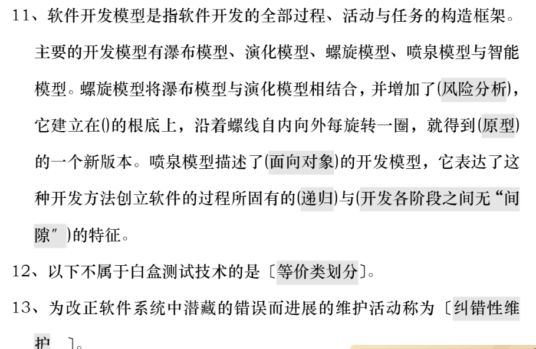

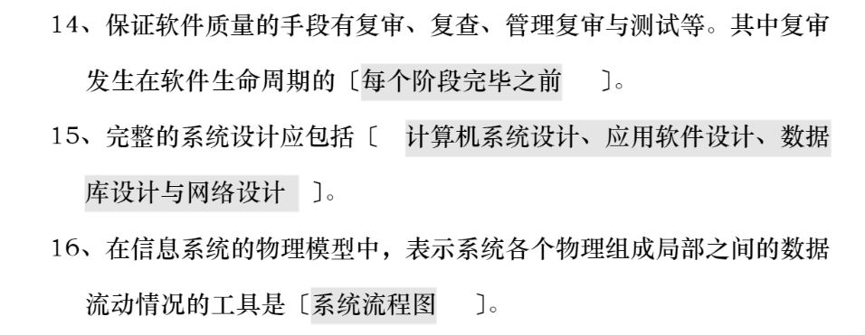

### 六种软件元素

功能性，可靠性，易用性，效率，维护性与可移植性。

软件重用，是指在两次或多次不同的软件开发过程中重复使用相同或相似软件元素的过程。

软件元素包括**程序代码、测试用例、设计文档、设计过程、需求分析文档和领域知识**。

通常，可重用的元素也称作软构件，可重用的软构件越大，重用的粒度越大。

### 面向对象编程OOP

https://www.zhihu.com/collection/719151767

封装、继承和多态

面向对象编程是一种基于以下思路的程序设计方法：

- 将关注点置于对象（Object）本身，对象的构成要素包含对象的行为及操作 ，以此为基础进行编程
- 在面向对象编程中，使用了一种称为“类”的要素，通过把若干个类组装到一起构建一个完整的程序。类就是程序的组件（Component）。
- 在进行面向对象编程的设计时，要在一开始就把所需要的类确定下来，然后再在每个类中列举出该类应该具有的函数和变量，而不要到了后面才把零散的函数和变量组织到类中。

要一边观察作为[程序参照物](https://www.zhihu.com/search?q=程序参照物&search_source=Entity&hybrid_search_source=Entity&hybrid_search_extra={"sourceType"%3A"answer"%2C"sourceId"%3A2416316998})的现实世界，一边思考待解决的问题是由哪些事物（类）构成的。正因为在设计时要去关注对象，这种编程方法才被称为面向对象编程（Object Oriented Programming，其中的 Oriented 就是关注的意思）。而在那些传统的开发方法中，进行设计则是要先考虑程序应该由什么样的功能和数据来构成，然后确定与之相应的函数和变量。与此相对在面向对象编程的设计中，因为一上来就要确定有哪些类，从而构成程序的函数和变量就必然会被组织到类中。


#### 组件化

程序最终就是指令与数据的集合。

在使用 C 语言或 BASIC 等语言编程时，用“函数”表示指令，用“变量”表示数据，程序就是函数和数据的集合。**大型程序中需要用到大量的函数和变量， 很容易使代码凌乱不堪， 开发和维护困难。**于是一种新的编程方法被发明出来：

把**程序中有关联的函数和变量汇集到一起编成组。这里的组就是类。**通常把汇集到类中的函数和变量统称为类的“成员”（Member）。在开发中，有些人只负责制作组件（类），有些人只负责使用组件。还可以把一部分组件的开发任务委托给合作公司，或者买来[商业组件](https://www.zhihu.com/search?q=商业组件&search_source=Entity&hybrid_search_source=Entity&hybrid_search_extra={"sourceType"%3A"answer"%2C"sourceId"%3A2416316998})使用。

#### 问题简化

假设一个程序需要 10000 个函数和 20000 个变量，如果把这个程序用 100 个类组织起来，那么平均一个类里就只有 100 个函数和 200 个变量。程序的复杂度也就降到了原来的 1%。如果使用了封装这种编程技巧（即将函数和变量放入黑盒，使其对外界不可见），还可以更进一步降低复杂度。


#### 符合直觉

在人的直觉中，大件物品都是由组件组装起来的。[面向对象编程方法](https://www.zhihu.com/search?q=面向对象编程方法&search_source=Entity&hybrid_search_source=Entity&hybrid_search_extra={"sourceType"%3A"answer"%2C"sourceId"%3A2416316998})把同样的直觉带给了计算机，创造了一种顺应人类思维习惯的先进的开发方法。在面向对象编程中，可以通过“这个是由什么样的对象构成的呢？”这样的观点来分析即将转换成程序的现实世界。这种分析过程叫作“[建模](https://www.zhihu.com/search?q=建模&search_source=Entity&hybrid_search_source=Entity&hybrid_search_extra={"sourceType"%3A"answer"%2C"sourceId"%3A2416316998})”。建模对于开发者而言，反映的是他们的世界观，也就是在他们的眼中现实世界看起来是什么样子的。

高效易维护

通过继承已存在的类，能高效地生成新的类。如果一个类被多个类所继承，那么只要修正了这个类，就相当于把继承了这个类的所有类都修正了。

#### 封装（黑箱）

在类所拥有的成员中，隐藏掉那些没有必要展现给该类[调用者](https://www.zhihu.com/search?q=调用者&search_source=Entity&hybrid_search_source=Entity&hybrid_search_extra={"sourceType"%3A"answer"%2C"sourceId"%3A2416316998})的成员。通过封装把外界不关心的成员隐藏起来，类就可以被当作是黑盒，变成易于使用且便于维护的组件。由于隐藏起来的成员不能被外界所访问，可以放心地随意修改这些成员。

#### 多态

多态：针对同一种消息，不同的对象可以进行不同的操作。利用多态生成对同一个消息可以执行多种操作的一组类，使用这组类的程序员所需要记忆的东西就减少了。

### 高内聚低耦合

耦合： 模块与模块之间的联系。

内聚：一般指（东西聚集在一起）形成一个模块，例如方法，变量，对象，或者是功能模块。

高内聚：尽可能的让一个**模块内部的代码相关程度高，相互联系的紧密**。模块内部的代码，**相互之间的联系越强，内聚就越高， 模块的独立性就越好**。 一个模块应该尽量去独立的完成一个功能！如果必须写另外的功能，建议拆分成多个模块，低内聚的代码，不好维护，代码也不够健壮。

低耦合：尽可能的**将每一个功能通过模块单独写出去 ，然后通过指定的接口来相互联系**，模块与模块之间的关系越是紧密，独立性就越不好，改变一个模块可能会影响其他的模块。

### 面向对象七大原则

https://zhuanlan.zhihu.com/p/58092071

理解面向对象六大原则，并运用设计模式进行系统设计实现

#### 1、 迪米特法则

**最少知道法则**，类的内部如何实现、如何复杂都与调用者或者依赖，只需要我知道调用的方法就行。例如**外观模式**，对外暴露统一的接口。

#### 2、 单一职责原则

一个类只负责一个功能领域中的相应职责。

功能简单，提高可读性和维护性，降低修改带来的风险

A、 单一职责原则的英文名称是Single Responsibility Principle.
B、 单一职责原则要求一个类**只有一个职责**
C、 单一职责原则有利于对象的稳定，**降低类的复杂性**

#### 3、 接口隔离原则

使用多个专门地接口，而不是使用单一的总接口导致依赖他不需要的接口

#### 4、 开闭原则

对扩展开发，对修改关闭，通过继承来增加新的类

#### 5、 里氏替换原则

所有引用基类（父类）的地方都能**透明地使用子类对象**。

替换子类系统正常工作。

#### 6、 依赖倒置原则

面向接口编程，细节依赖抽象，高层模块不依赖底层模块

#### 7、合成复用原则

尽量使用组合聚合的方式，而不是使用继承


### 设计模式三种类型

#### 1、创建型5

单例模式，工厂模式，原型模式、建造者模式、抽象工厂模式

#### 2、结构型7

适配器模式、桥接模式、**装饰模式**、组合模式、外观模式、享元模式、**代理模式**。

#### 3、行为型11

模版方法模式、命令模式、访问者模式、迭代器模式、观察者模式、中介者模式、备忘录模式、解释器模式（Interpreter模式）、状态模式、策略模式、责任链模式


### 简单工厂

增加类型需要修改代码，不符合开闭原则

### 工厂方法

具有四个角色：抽象工厂，具体工厂，抽象产品，具体产品

工厂方法模式只能处理一个产品等级结构


### 抽象工厂

抽象工厂模式可以处理多个产品等级结构

### 策略模式

```
/**
 * 策略模式：
 * 传入不同的策略，可随意切换算法
 *          环境角色组合策略
 * 三种角色：
 *      1.context环境角色
 *      2.抽象策略
 *      3.具体策略
 *
 * 优点：
 *      1.提供了管理相同算法族的方法，恰好把相同的代码移到父类
 *      2.同个引用的方式让算法使用者和算法本身解耦
 *      3.避免多重条件转换语句
 */
```

### 模板方法

JdbcTemplate


```
	public <T> T execute(ConnectionCallback<T> action) throws DataAccessException {
		Assert.notNull(action, "Callback object must not be null");

		Connection con = DataSourceUtils.getConnection(obtainDataSource());
		try {
			// Create close-suppressing Connection proxy, also preparing returned Statements.
			Connection conToUse = createConnectionProxy(con);
			return action.doInConnection(conToUse);
		}
		catch (SQLException ex) {
			// Release Connection early, to avoid potential connection pool deadlock
			// in the case when the exception translator hasn't been initialized yet.
			String sql = getSql(action);
			DataSourceUtils.releaseConnection(con, getDataSource());
			con = null;
			throw translateException("ConnectionCallback", sql, ex);
		}
		finally {
			DataSourceUtils.releaseConnection(con, getDataSource());
		}
	}
```


### 适配器模式 Adapter

  适配器模式是将一个类的接口转换成客户希望的另外一个接口。适配器模式使得原本由于接口不兼容而不能一起工作的那些类可以一起工作。
  两个成熟的类需要通信，但是接口不同，由于开闭原则，我们不能去修改这两个类的接口，所以就需要一个适配器来完成衔接过程。

### 桥接模式 Bridge

  桥接模式将**抽象部分与它的实现部分分离**，是它们都可以独立地变化。它很好的支持了开闭原则和组合锯和复用原则。实现系统可能有多角度分类，每一种分类都有可能变化，那么就把这些多角度分离出来让他们独立变化，减少他们之间的耦合。

### 组合模式 Composite

  组合模式将对象组合成**树形结构**以表示部分-整体的层次结构，组合模式使得用户对单个对象和组合对象的使用具有一致性。

### 装饰模式 Decorator

装饰模式**动态地给一个对象添加一些额外的职责**，就增加功能来说，它比生成子类更灵活。也可以这样说，装饰模式把复杂类中的核心职责和装饰功能区分开了，这样既简化了复杂类，有去除了相关类中重复的装饰逻辑。 装饰模式没有通过继承原有类来扩展功能，但却达到了一样的目的，而且比继承更加灵活，所以可以说装饰模式是继承关系的一种替代方案。

### 外观模式 Facade

 外观模式为子系统中的一组接口**提供了统一的界面**，外观模式定义了一个高层接口，这个接口使得这一子系统更加容易使用。

外观模式中，客户对各个具体的子系统是不了解的，所以对这些子系统进行了封装，对外只提供了用户所明白的单一而简单的接口，用户直接使用这个接口就可以完成操作，而不用去理睬具体的过程，而且子系统的变化不会影响到用户，这样就做到了信息隐蔽。

### 享元模式 Flyweight

 享元模式为运用共享技术有效的支持大量细粒度的对象。因为它可以通过共享大幅度地减少单个实例的数目，避免了大量非常相似类的开销。大量应用于**各种池化技术**。

  享元模式是一个类别的多个对象共享这个类别的一个对象，而不是各自再实例化各自的对象。这样就达到了节省内存的目的。

### 代理模式 proxy

为其他对象提供一种，并由***对象控制对原对象的引用，以间接控制对原对象的访问。

### 责任链模式

A、有**多个对象可以处理请求**，哪个对象处理该请求，在运行时刻自动确定
C 、你想在**不明确指定接收者的情况下**，向多个对象中的一个提交一个请求
D、一个请求**需要一系列的处理工作**


### 观察者模式

一个类的变化，依赖它的对象都要得到通知


例子：LoggerContext（ch.qos.logback.classic）

```
final private List<LoggerContextListener> loggerContextListenerList = new ArrayList<LoggerContextListener>();
```


注册与删除观察者

```
    // === start listeners ==============================================
    public void addListener(LoggerContextListener listener) {
        loggerContextListenerList.add(listener);
    }

    public void removeListener(LoggerContextListener listener) {
        loggerContextListenerList.remove(listener);
    }

```


通知观察者

```
void fireOnLevelChange(Logger logger, Level level) {
        for (LoggerContextListener listener : loggerContextListenerList) {
            listener.onLevelChange(logger, level);
        }
    }

    private void fireOnReset() {
        for (LoggerContextListener listener : loggerContextListenerList) {
            listener.onReset(this);
        }
    }

    private void fireOnStart() {
        for (LoggerContextListener listener : loggerContextListenerList) {
            listener.onStart(this);
        }
    }

    private void fireOnStop() {
        for (LoggerContextListener listener : loggerContextListenerList) {
            listener.onStop(this);
        }
    }

    // === end listeners ==============================================
```


观察者接口

```
public interface LoggerContextListener {

    /**
     * Some listeners should not be removed when the LoggerContext is
     * reset. Such listeners are said to be reset resistant.
     * @return whether this listener is reset resistant or not.
     */
    boolean isResetResistant();

    void onStart(LoggerContext context);

    void onReset(LoggerContext context);

    void onStop(LoggerContext context);

    void onLevelChange(Logger logger, Level level);
}
```


### 设计模式三大类

创建型模式，共五种：工厂方法模式、抽象工厂模式、单例模式、建造者模式、原型模式。

结构型模式，共七种：适配器模式、装饰器模式、代理模式、外观模式、桥接模式、组合模式、享元模式。

行为型模式，共十一种：策略模式、模板方法模式、观察者模式、迭代子模式、责任链模式、命令模式、备忘录模式、状态模式、访问者模式、中介者模式、解释器模式。

A、创建模式（5种）
工厂方法模式、抽象工厂模式、单例模式、建造者模式、原型模式。

### 1 工厂模式

1.1 简单工厂模式
定义：定义了一个创建对象的类，由这个类来封装实例化对象的行为。

举例：（我们举一个pizza工厂的例子）

pizza工厂一共生产三种类型的pizza：chesse,pepper,greak。通过工厂类（SimplePizzaFactory）实例化这三种类型的对象。类图如下：

工厂类的代码：

```csharp
public class SimplePizzaFactory {
       public Pizza CreatePizza(String ordertype) {
              Pizza pizza = null;
              if (ordertype.equals("cheese")) {
                     pizza = new CheesePizza();
              } else if (ordertype.equals("greek")) {
                     pizza = new GreekPizza();
              } else if (ordertype.equals("pepper")) {
                     pizza = new PepperPizza();
              }
              return pizza;
       }
}
12345678910111213
```

简单工厂存在的问题与解决方法： 简单工厂模式有一个问题就是，类的创建依赖工厂类，也就是说，如果想要拓展程序，必须对工厂类进行修改，这违背了开闭原则，所以，从设计角度考虑，有一定的问题，如何解决？我们可以定义一个创建对象的抽象方法并创建多个不同的工厂类实现该抽象方法，这样一旦需要增加新的功能，直接增加新的工厂类就可以了，不需要修改之前的代码。这种方法也就是我们接下来要说的工厂方法模式。

### 1.2 工厂方法模式

定义：定义了一个创建对象的抽象方法，由子类决定要实例化的类。工厂方法模式将对象的实例化推迟到子类。

举例：（我们依然举pizza工厂的例子，不过这个例子中，pizza产地有两个：伦敦和纽约）。添加了一个新的产地，如果用简单工厂模式的的话，我们要去修改工厂代码，并且会增加一堆的if else语句。而工厂方法模式克服了简单工厂要修改代码的缺点，它会直接创建两个工厂，纽约工厂和伦敦工厂。类图如下：

OrderPizza中有个抽象的方法：

abstract Pizza createPizza();
两个工厂类继承OrderPizza并实现抽象方法：

```csharp
public class LDOrderPizza extends OrderPizza {
       Pizza createPizza(String ordertype) {
              Pizza pizza = null;
              if (ordertype.equals("cheese")) {
                     pizza = new LDCheesePizza();
              } else if (ordertype.equals("pepper")) {
                     pizza = new LDPepperPizza();
              }
              return pizza;
       }
}
public class NYOrderPizza extends OrderPizza {
 
	Pizza createPizza(String ordertype) {
		Pizza pizza = null;
 
		if (ordertype.equals("cheese")) {
			pizza = new NYCheesePizza();
		} else if (ordertype.equals("pepper")) {
			pizza = new NYPepperPizza();
		}
		return pizza;
 
	}
 
}
1234567891011121314151617181920212223242526
```

、通过不同的工厂会得到不同的实例化的对象，PizzaStroe的代码如下：

```csharp
public class PizzaStroe {
       public static void main(String[] args) {
              OrderPizza mOrderPizza;
              mOrderPizza = new NYOrderPizza();
       }
}
123456
```

解决了简单工厂模式的问题：增加一个新的pizza产地（北京），只要增加一个BJOrderPizza类：

```csharp
public class BJOrderPizza extends OrderPizza {
       Pizza createPizza(String ordertype) {
              Pizza pizza = null;
              if (ordertype.equals("cheese")) {
                     pizza = new LDCheesePizza();
              } else if (ordertype.equals("pepper")) {
                     pizza = new LDPepperPizza();
              }
              return pizza;
       }
}
1234567891011
```

其实这个模式的好处就是，如果你现在想增加一个功能，只需做一个实现类就OK了，无需去改动现成的代码。这样做，拓展性较好！

工厂方法存在的问题与解决方法：客户端需要创建类的具体的实例。简单来说就是用户要订纽约工厂的披萨，他必须去纽约工厂，想订伦敦工厂的披萨，必须去伦敦工厂。 当伦敦工厂和纽约工厂发生变化了，用户也要跟着变化，这无疑就增加了用户的操作复杂性。为了解决这一问题，我们可以把工厂类抽象为接口，用户只需要去找默认的工厂提出自己的需求（传入参数），便能得到自己想要产品，而不用根据产品去寻找不同的工厂，方便用户操作。这也就是我们接下来要说的抽象工厂模式。

### 1.3 抽象工厂模式

定义：定义了一个接口用于创建相关或有依赖关系的对象族，而无需明确指定具体类。

举例：（我们依然举pizza工厂的例子，pizza工厂有两个：纽约工厂和伦敦工厂）。类图如下：

工厂的接口：

```csharp
public interface AbsFactory {
       Pizza CreatePizza(String ordertype) ;
}
123
```

工厂的实现：

```csharp
public class LDFactory implements AbsFactory {
       @Override
       public Pizza CreatePizza(String ordertype) {
              Pizza pizza = null;
              if ("cheese".equals(ordertype)) {
                     pizza = new LDCheesePizza();
              } else if ("pepper".equals(ordertype)) {
                     pizza = new LDPepperPizza();
              }
              return pizza;
       }
}
123456789101112
```

PizzaStroe的代码如下：

```csharp
public class PizzaStroe {
       public static void main(String[] args) {
              OrderPizza mOrderPizza;
              mOrderPizza = new OrderPizza("London");
       }
}
123456
```

解决了工厂方法模式的问题：在抽象工厂中PizzaStroe中只需要传入参数就可以实例化对象。

1.4 工厂模式适用的场合
大量的产品需要创建，并且这些产品具有共同的接口 。

1.5 三种工厂模式的使用选择
简单工厂 ： 用来生产同一等级结构中的任意产品。（不支持拓展增加产品）

工厂方法 ：用来生产同一等级结构中的固定产品。（支持拓展增加产品）

抽象工厂 ：用来生产不同产品族的全部产品。（支持拓展增加产品；支持增加产品族）

简单工厂的适用场合：只有伦敦工厂（只有这一个等级），并且这个工厂只生产三种类型的pizza：chesse,pepper,greak（固定产品）。

工厂方法的适用场合：现在不光有伦敦工厂，还增设了纽约工厂（仍然是同一等级结构，但是支持了产品的拓展），这两个工厂依然只生产三种类型的pizza：chesse,pepper,greak（固定产品）。

抽象工厂的适用场合：不光增设了纽约工厂（仍然是同一等级结构，但是支持了产品的拓展），这两个工厂还增加了一种新的类型的pizza：chinese pizza（增加产品族）。

所以说抽象工厂就像工厂，而工厂方法则像是工厂的一种产品生产线。因此，我们可以用抽象工厂模式创建工厂，而用工厂方法模式创建生产线。比如，我们可以使用抽象工厂模式创建伦敦工厂和纽约工厂，使用工厂方法实现cheese pizza和greak pizza的生产。类图如下：

总结一下三种模式：

简单工厂模式就是建立一个实例化对象的类，在该类中对多个对象实例化。工厂方法模式是定义了一个创建对象的抽象方法，由子类决定要实例化的类。这样做的好处是再有新的类型的对象需要实例化只要增加子类即可。抽象工厂模式定义了一个接口用于创建对象族，而无需明确指定具体类。抽象工厂也是把对象的实例化交给了子类，即支持拓展。同时提供给客户端接口，避免了用户直接操作子类工厂。

### 2 单例模式

定义：确保一个类最多只有一个实例，并提供一个全局访问点

单例模式可以分为两种：预加载和懒加载

2.1 预加载
顾名思义，就是预先加载。再进一步解释就是还没有使用该单例对象，但是，该单例对象就已经被加载到内存了。

```csharp
public class PreloadSingleton {
       
       public static PreloadSingleton instance = new PreloadSingleton();
   
       //其他的类无法实例化单例类的对象
       private PreloadSingleton() {
       };
       
       public static PreloadSingleton getInstance() {
              return instance;
       }
}
123456789101112
```

很明显，没有使用该单例对象，该对象就被加载到了内存，会造成内存的浪费。

2.2 懒加载
为了避免内存的浪费，我们可以采用懒加载，即用到该单例对象的时候再创建。

```csharp
public class Singleton {
       
       private static Singleton instance=null;
       
       private Singleton(){
       };
       
       public static Singleton getInstance()
       {
              if(instance==null)
              {
                     instance=new Singleton();
              }
              return instance;
              
       }
}
1234567891011121314151617
```

2.3 单例模式和线程安全
（1）预加载只有一条语句return instance,这显然可以保证线程安全。但是，我们知道预加载会造成内存的浪费。

（2）懒加载不浪费内存，但是无法保证线程的安全。首先，if判断以及其内存执行代码是非原子性的。其次，new Singleton()无法保证执行的顺序性。

不满足原子性或者顺序性，线程肯定是不安全的，这是基本的常识，不再赘述。我主要讲一下为什么new Singleton()无法保证顺序性。我们知道创建一个对象分三步:

```csharp
memory=allocate();//1:初始化内存空间
 
ctorInstance(memory);//2:初始化对象

instance=memory();//3:设置instance指向刚分配的内存地址
12345
```

jvm为了提高程序执行性能，会对没有依赖关系的代码进行重排序，上面2和3行代码可能被重新排序。我们用两个线程来说明线程是不安全的。线程A和线程B都创建对象。其中，A2和A3的重排序，将导致线程B在B1处判断出instance不为空，线程B接下来将访问instance引用的对象。此时，线程B将会访问到一个还未初始化的对象（线程不安全）。


2.4 保证懒加载的线程安全
我们首先想到的就是使用synchronized关键字。synchronized加载getInstace()函数上确实保证了线程的安全。但是，如果要经常的调用getInstance()方法，不管有没有初始化实例，都会唤醒和阻塞线程。为了避免线程的上下文切换消耗大量时间，如果对象已经实例化了，我们没有必要再使用synchronized加锁，直接返回对象。

```csharp
public class Singleton {
       private static Singleton instance = null;
       private Singleton() {
       };
       public static synchronized Singleton getInstance() {
              if (instance == null) {
                     instance = new Singleton();
              }
              return instance;
       }
}
1234567891011
```

我们把sychronized加在if(instance==null)判断语句里面，保证instance未实例化的时候才加锁

```csharp
public class Singleton {
       private static Singleton instance = null;
       private Singleton() {
       };
       public static synchronized Singleton getInstance() {
              if (instance == null) {
                     synchronized (Singleton.class) {
                           if (instance == null) {
                                  instance = new Singleton();
                           }
                     }
              }
              return instance;
       }
}
123456789101112131415
```

我们经过2.3的讨论知道new一个对象的代码是无法保证顺序性的，因此，我们需要使用另一个关键字volatile保证对象实例化过程的顺序性。

```csharp
public class Singleton {
       private static volatile Singleton instance = null;
       private Singleton() {
       };
       public static synchronized Singleton getInstance() {
              if (instance == null) {
                     synchronized (instance) {
                           if (instance == null) {
                                  instance = new Singleton();
                           }
                     }
              }
              return instance;
       }
}
123456789101112131415
```

到此，我们就保证了懒加载的线程安全。

### 3 建造者模式

定义：封装一个复杂对象构造过程，并允许按步骤构造。

定义解释： 我们可以将生成器模式理解为，假设我们有一个对象需要建立，这个对象是由多个组件（Component）组合而成，每个组件的建立都比较复杂，但运用组件来建立所需的对象非常简单，所以我们就可以将构建复杂组件的步骤与运用组件构建对象分离，使用builder模式可以建立。

3.1 模式的结构和代码示例
生成器模式结构中包括四种角色：

（1）产品(Product)：具体生产器要构造的复杂对象；

（2）抽象生成器(Bulider)：抽象生成器是一个接口，该接口除了为创建一个Product对象的各个组件定义了若干个方法之外，还要定义返回Product对象的方法（定义构造步骤）；

（3）具体生产器(ConcreteBuilder)：实现Builder接口的类，具体生成器将实现Builder接口所定义的方法（生产各个组件）；

（4）指挥者(Director)：指挥者是一个类，该类需要含有Builder接口声明的变量。指挥者的职责是负责向用户提供具体生成器，即指挥者将请求具体生成器类来构造用户所需要的Product对象，如果所请求的具体生成器成功地构造出Product对象，指挥者就可以让该具体生产器返回所构造的Product对象。（按照步骤组装部件，并返回Product）

举例（我们如果构建生成一台电脑，那么我们可能需要这么几个步骤（1）需要一个主机（2）需要一个显示器（3）需要一个键盘（4）需要一个鼠标）

虽然我们具体在构建一台主机的时候，每个对象的实际步骤是不一样的，比如，有的对象构建了i7cpu的主机，有的对象构建了i5cpu的主机，有的对象构建了普通键盘，有的对象构建了机械键盘等。但不管怎样，你总是需要经过一个步骤就是构建一台主机，一台键盘。对于这个例子，我们就可以使用生成器模式来生成一台电脑，他需要通过多个步骤来生成。类图如下：


ComputerBuilder类定义构造步骤：

```csharp
public abstract class ComputerBuilder {
   
    protected Computer computer;
   
    public Computer getComputer() {
        return computer;
    }
   
    public void buildComputer() {
        computer = new Computer();
        System.out.println("生成了一台电脑！！！");
    }
    public abstract void buildMaster();
    public abstract void buildScreen();
    public abstract void buildKeyboard();
    public abstract void buildMouse();
    public abstract void buildAudio();
}
123456789101112131415161718
```

HPComputerBuilder定义各个组件：

```csharp
public class HPComputerBuilder extends ComputerBuilder {
    @Override
    public void buildMaster() {
        // TODO Auto-generated method stub
        computer.setMaster("i7,16g,512SSD,1060");
        System.out.println("(i7,16g,512SSD,1060)的惠普主机");
    }
    @Override
    public void buildScreen() {
        // TODO Auto-generated method stub
        computer.setScreen("1080p");
        System.out.println("(1080p)的惠普显示屏");
    }
    @Override
    public void buildKeyboard() {
        // TODO Auto-generated method stub
        computer.setKeyboard("cherry 青轴机械键盘");
        System.out.println("(cherry 青轴机械键盘)的键盘");
    }
    @Override
    public void buildMouse() {
        // TODO Auto-generated method stub
        computer.setMouse("MI 鼠标");
        System.out.println("(MI 鼠标)的鼠标");
    }
    @Override
    public void buildAudio() {
        // TODO Auto-generated method stub
        computer.setAudio("飞利浦 音响");
        System.out.println("(飞利浦 音响)的音响");
    }
}
1234567891011121314151617181920212223242526272829303132
```

Director类对组件进行组装并生成产品

```csharp
public class Director {
   
    private ComputerBuilder computerBuilder;
    public void setComputerBuilder(ComputerBuilder computerBuilder) {
        this.computerBuilder = computerBuilder;
    }
   
    public Computer getComputer() {
        return computerBuilder.getComputer();
    }
   
    public void constructComputer() {
        computerBuilder.buildComputer();
        computerBuilder.buildMaster();
        computerBuilder.buildScreen();
        computerBuilder.buildKeyboard();
        computerBuilder.buildMouse();
        computerBuilder.buildAudio();
    }
}
1234567891011121314151617181920
```

3.2 生成器模式的优缺点
优点
将一个对象分解为各个组件

将对象组件的构造封装起来

可以控制整个对象的生成过程

缺点
对不同类型的对象需要实现不同的具体构造器的类，这可能回答大大增加类的数量

3.3 生成器模式与工厂模式的不同
生成器模式构建对象的时候，对象通常构建的过程中需要多个步骤，就像我们例子中的先有主机，再有显示屏，再有鼠标等等，生成器模式的作用就是将这些复杂的构建过程封装起来。工厂模式构建对象的时候通常就只有一个步骤，调用一个工厂方法就可以生成一个对象。

### 4 原型模式

定义：通过复制现有实例来创建新的实例，无需知道相应类的信息。

简单地理解，其实就是当需要创建一个指定的对象时，我们刚好有一个这样的对象，但是又不能直接使用，我会clone一个一毛一样的新对象来使用；基本上这就是原型模式。关键字：Clone。

4.1 深拷贝和浅拷贝
浅复制：将一个对象复制后，基本数据类型的变量都会重新创建，而引用类型，指向的还是原对象所指向的。

深复制：将一个对象复制后，不论是基本数据类型还有引用类型，都是重新创建的。简单来说，就是深复制进行了完全彻底的复制，而浅复制不彻底。clone明显是深复制，clone出来的对象是是不能去影响原型对象的

4.2 原型模式的结构和代码示例

Client：使用者

Prototype：接口（抽象类），声明具备clone能力，例如java中得Cloneable接口

ConcretePrototype：具体的原型类

可以看出设计模式还是比较简单的，重点在于Prototype接口和Prototype接口的实现类ConcretePrototype。原型模式的具体实现：一个原型类，只需要实现Cloneable接口，覆写clone方法，此处clone方法可以改成任意的名称，因为Cloneable接口是个空接口，你可以任意定义实现类的方法名，如cloneA或者cloneB，因为此处的重点是super.clone()这句话，super.clone()调用的是Object的clone()方法。

```csharp
public class Prototype implements Cloneable {  
     public Object clone() throws CloneNotSupportedException {  
         Prototype proto = (Prototype) super.clone();  
         return proto;  
     }  
}  
123456
```

举例（银行发送大量邮件，使用clone和不使用clone的时间对比）：我们模拟创建一个对象需要耗费比较长的时间，因此，在构造函数中我们让当前线程sleep一会

```csharp
public Mail(EventTemplate et) {
              this.tail = et.geteventContent();
              this.subject = et.geteventSubject();
              try {
                     Thread.sleep(1000);
              } catch (InterruptedException e) {
                     // TODO Auto-generated catch block
                     e.printStackTrace();
              }
       }
12345678910
```

不使用clone,发送十个邮件

```csharp
public static void main(String[] args) {
              int i = 0;
              int MAX_COUNT = 10;
              EventTemplate et = new EventTemplate("9月份信用卡账单", "国庆抽奖活动...");
              long start = System.currentTimeMillis();
              while (i < MAX_COUNT) {
                     // 以下是每封邮件不同的地方
                     Mail mail = new Mail(et);
                     mail.setContent(getRandString(5) + ",先生（女士）:你的信用卡账单..." + mail.getTail());
                     mail.setReceiver(getRandString(5) + "@" + getRandString(8) + ".com");
                     // 然后发送邮件
                     sendMail(mail);
                     i++;
              }
              long end = System.currentTimeMillis();
              System.out.println("用时:" + (end - start));
       }
1234567891011121314151617
```

用时：10001

使用clone,发送十个邮件

```csharp
    public static void main(String[] args) {
              int i = 0;
              int MAX_COUNT = 10;
              EventTemplate et = new EventTemplate("9月份信用卡账单", "国庆抽奖活动...");
              long start=System.currentTimeMillis();
              Mail mail = new Mail(et);         
              while (i < MAX_COUNT) {
                     Mail cloneMail = mail.clone();
                     mail.setContent(getRandString(5) + ",先生（女士）:你的信用卡账单..."
                                  + mail.getTail());
                     mail.setReceiver(getRandString(5) + "@" + getRandString(8) + ".com");
                     sendMail(cloneMail);
                     i++;
              }
              long end=System.currentTimeMillis();
              System.out.println("用时:"+(end-start));
       }
1234567891011121314151617
```

用时：1001

4.3 总结
原型模式的本质就是clone，可以解决构建复杂对象的资源消耗问题，能再某些场景中提升构建对象的效率；还有一个重要的用途就是保护性拷贝，可以通过返回一个拷贝对象的形式，实现只读的限制。

B、结构模式（7种）
适配器模式、装饰器模式、代理模式、外观模式、桥接模式、组合模式、享元模式。

### 5 适配器模式

定义： 适配器模式将某个类的接口转换成客户端期望的另一个接口表示，目的是消除由于接口不匹配所造成的类的兼容性问题。

主要分为三类：类的适配器模式、对象的适配器模式、接口的适配器模式。

5.1 类适配器模式
通过多重继承目标接口和被适配者类方式来实现适配

举例(将USB接口转为VGA接口)，类图如下：

USBImpl的代码：

```csharp
public class USBImpl implements USB{
       @Override
       public void showPPT() {
              // TODO Auto-generated method stub
              System.out.println("PPT内容演示");
       }
}
1234567
```

AdatperUSB2VGA 首先继承USBImpl获取USB的功能，其次，实现VGA接口，表示该类的类型为VGA。

```csharp
public class AdapterUSB2VGA extends USBImpl implements VGA {
       @Override
       public void projection() {
              super.showPPT();
       }
}
123456
```

Projector将USB映射为VGA，只有VGA接口才可以连接上投影仪进行投影

```csharp
public class Projector<T> {
       public void projection(T t) {
              if (t instanceof VGA) {
                     System.out.println("开始投影");
                     VGA v = new VGAImpl();
                     v = (VGA) t;
                     v.projection();
              } else {
                     System.out.println("接口不匹配，无法投影");
              }
       }
}
123456789101112
```

test代码

```csharp
       @Test
       public void test2(){
              //通过适配器创建一个VGA对象，这个适配器实际是使用的是USB的showPPT（）方法
              VGA a=new AdapterUSB2VGA();
              //进行投影
              Projector p1=new Projector();
              p1.projection(a);
       } 
12345678
```

5.2 对象适配器模式
对象适配器和类适配器使用了不同的方法实现适配，对象适配器使用组合，类适配器使用继承。

举例(将USB接口转为VGA接口)，类图如下：


```csharp
public class AdapterUSB2VGA implements VGA {
       USB u = new USBImpl();
       @Override
       public void projection() {
              u.showPPT();
       }
}
1234567
```

实现VGA接口，表示适配器类是VGA类型的，适配器方法中直接使用USB对象。

5.3 接口适配器模式
当不需要全部实现接口提供的方法时，可先设计一个抽象类实现接口，并为该接口中每个方法提供一个默认实现（空方法），那么该抽象类的子类可有选择地覆盖父类的某些方法来实现需求，它适用于一个接口不想使用其所有的方法的情况。

举例(将USB接口转为VGA接口，VGA中的b()和c()不会被实现)，类图如下：

AdapterUSB2VGA抽象类

```csharp
public abstract class AdapterUSB2VGA implements VGA {
       USB u = new USBImpl();
       @Override
       public void projection() {
              u.showPPT();
       }
       @Override
       public void b() {
       };
       @Override
       public void c() {
       };
}
12345678910111213
```

AdapterUSB2VGA实现，不用去实现b()和c()方法。

```csharp
public class AdapterUSB2VGAImpl extends AdapterUSB2VGA {
       public void projection() {
              super.projection();
       }
}
12345
```

5.4 总结
总结一下三种适配器模式的应用场景：

类适配器模式：当希望将一个类转换成满足另一个新接口的类时，可以使用类的适配器模式，创建一个新类，继承原有的类，实现新的接口即可。

对象适配器模式：当希望将一个对象转换成满足另一个新接口的对象时，可以创建一个Wrapper类，持有原类的一个实例，在Wrapper类的方法中，调用实例的方法就行。

接口适配器模式：当不希望实现一个接口中所有的方法时，可以创建一个抽象类Wrapper，实现所有方法，我们写别的类的时候，继承抽象类即可。

命名规则：

我个人理解，三种命名方式，是根据 src是以怎样的形式给到Adapter（在Adapter里的形式）来命名的。

类适配器，以类给到，在Adapter里，就是将src当做类，继承，

对象适配器，以对象给到，在Adapter里，将src作为一个对象，持有。

接口适配器，以接口给到，在Adapter里，将src作为一个接口，实现。

使用选择：

根据合成复用原则，组合大于继承。因此，类的适配器模式应该少用。

### 6 装饰者模式

定义：**动态的将新功能附加到对象**上。在对象功能扩展方面，它比继承更有弹性。

6.1 装饰者模式结构图与代码示例
1.Component（被装饰对象的基类）

定义一个对象接口，可以给这些对象动态地添加职责。

2.ConcreteComponent（具体被装饰对象）

定义一个对象，可以给这个对象添加一些职责。

3.Decorator（装饰者抽象类）

维持一个指向Component实例的引用，并定义一个与Component接口一致的接口。

4.ConcreteDecorator（具体装饰者）

具体的装饰对象，给内部持有的具体被装饰对象，增加具体的职责。

被装饰对象和修饰者继承自同一个超类

举例(咖啡馆订单项目：1）、咖啡种类：Espresso、ShortBlack、LongBlack、Decaf2）、调料（装饰者）：Milk、Soy、Chocolate)，类图如下：
被装饰的对象和装饰者都继承自同一个超类

```csharp
public abstract class Drink {
       public String description="";
       private float price=0f;;
       
       
       public void setDescription(String description)
       {
              this.description=description;
       }
       
       public String getDescription()
       {
              return description+"-"+this.getPrice();
       }
       public float getPrice()
       {
              return price;
       }
       public void setPrice(float price)
       {
              this.price=price;
       }
       public abstract float cost();
       
}
12345678910111213141516171819202122232425
```

被装饰的对象，不用去改造。原来怎么样写，现在还是怎么写。

```csharp
public  class Coffee extends Drink {
       @Override
       public float cost() {
              // TODO Auto-generated method stub
              return super.getPrice();
       }
       
}
12345678
```

coffee类的实现

```csharp
public class Decaf extends Coffee {
       public Decaf()
       {
              super.setDescription("Decaf");
              super.setPrice(3.0f);
       }
}
1234567
```

装饰者

装饰者不仅要考虑自身，还要考虑被它修饰的对象，它是在被修饰的对象上继续添加修饰。例如，咖啡里面加牛奶，再加巧克力。加糖后价格为coffee+milk。再加牛奶价格为coffee+milk+chocolate。

```csharp
public class Decorator extends Drink {
       private Drink Obj;
       public Decorator(Drink Obj) {
              this.Obj = Obj;
       };
       @Override
       public float cost() {
              // TODO Auto-generated method stub
              return super.getPrice() + Obj.cost();
       }
       @Override
       public String getDescription() {
              return super.description + "-" + super.getPrice() + "&&" + Obj.getDescription();
       }
}
123456789101112131415
```

装饰者实例化（加牛奶）。这里面要对被修饰的对象进行实例化。

```csharp
public class Milk extends Decorator {
       public Milk(Drink Obj) {          
              super(Obj);
              // TODO Auto-generated constructor stub
              super.setDescription("Milk");
              super.setPrice(2.0f);
       }
}
12345678
```

coffee店：初始化一个被修饰对象，修饰者实例需要对被修改者实例化，才能对具体的被修饰者进行修饰。

```csharp
public class CoffeeBar {
       public static void main(String[] args) {
              Drink order;
              order = new Decaf();
              System.out.println("order1 price:" + order.cost());
              System.out.println("order1 desc:" + order.getDescription());
              System.out.println("****************");
              order = new LongBlack();
              order = new Milk(order);
              order = new Chocolate(order);
              order = new Chocolate(order);
              System.out.println("order2 price:" + order.cost());
              System.out.println("order2 desc:" + order.getDescription());
       }
}
123456789101112131415
```

6.2 总结

装饰者和被装饰者之间必须是一样的类型,也就是要有共同的超类。在这里应用继承并不是实现方法的复制,而是实现类型的匹配。因为装饰者和被装饰者是同一个类型,因此装饰者可以取代被装饰者,这样就使被装饰者拥有了装饰者独有的行为。根据装饰者模式的理念,我们可以在任何时候,实现新的装饰者增加新的行为。如果是用继承,每当需要增加新的行为时,就要修改原程序了。

### 7 代理模式

定义：代理模式给某一个对象提供一个代理对象，并由代理对象控制对原对象的引用。通俗的来讲代理模式就是我们生活中常见的中介。

举个例子来说明：假如说我现在想买一辆二手车，虽然我可以自己去找车源，做质量检测等一系列的车辆过户流程，但是这确实太浪费我得时间和精力了。我只是想买一辆车而已为什么我还要额外做这么多事呢？于是我就通过中介公司来买车，他们来给我找车源，帮我办理车辆过户流程，我只是负责选择自己喜欢的车，然后付钱就可以了。用图表示如下：

7.1 为什么要用代理模式？
中介隔离作用：在某些情况下，一个客户类不想或者不能直接引用一个委托对象，而代理类对象可以在客户类和委托对象之间起到中介的作用，其特征是代理类和委托类实现相同的接口。

开闭原则，增加功能：代理类除了是客户类和委托类的中介之外，我们还可以通过给代理类增加额外的功能来扩展委托类的功能，这样做我们只需要修改代理类而不需要再修改委托类，符合代码设计的开闭原则。代理类主要负责为委托类预处理消息、过滤消息、把消息转发给委托类，以及事后对返回结果的处理等。代理类本身并不真正实现服务，而是同过调用委托类的相关方法，来提供特定的服务。真正的业务功能还是由委托类来实现，但是可以在业务功能执行的前后加入一些公共的服务。例如我们想给项目加入缓存、日志这些功能，我们就可以使用代理类来完成，而没必要打开已经封装好的委托类。

代理模式分为三类：1. 静态代理 2. 动态代理 3. CGLIB代理

7.2 静态代理

举例(买房），类图如下：

第一步：创建服务类接口

```csharp
public interface BuyHouse {
    void buyHosue();
}
123
```

第二步：实现服务接口

```csharp
public class BuyHouseImpl implements BuyHouse {
       @Override
       public void buyHosue() {
              System.out.println("我要买房");
       }
}
123456
```

第三步：创建代理类

```csharp
public class BuyHouseProxy implements BuyHouse {
       private BuyHouse buyHouse;
       public BuyHouseProxy(final BuyHouse buyHouse) {
              this.buyHouse = buyHouse;
       }
       @Override
       public void buyHosue() {
              System.out.println("买房前准备");
              buyHouse.buyHosue();
              System.out.println("买房后装修");
       }
}
123456789101112
```

总结：

优点：可以做到在符合开闭原则的情况下对目标对象进行功能扩展。

缺点： 代理对象与目标对象要实现相同的接口，我们得为每一个服务都得创建代理类，工作量太大，不易管理。同时接口一旦发生改变，代理类也得相应修改。

7.3 动态代理
动态代理有以下特点:

1.代理对象,不需要实现接口

2.代理对象的生成,是利用JDK的API,动态的在内存中构建代理对象(需要我们指定创建代理对象/目标对象实现的接口的类型)

代理类不用再实现接口了。但是，要求被代理对象必须有接口。

动态代理实现：

Java.lang.reflect.Proxy类可以直接生成一个代理对象

Proxy.newProxyInstance(ClassLoader loader, Class<?>[] interfaces, InvocationHandler h)生成一个代理对象

参数1:ClassLoader loader 代理对象的类加载器 一般使用被代理对象的类加载器

参数2:Class<?>[] interfaces 代理对象的要实现的接口 一般使用的被代理对象实现的接口

参数3:InvocationHandler h (接口)执行处理类

InvocationHandler中的invoke(Object proxy, Method method, Object[] args)方法：调用代理类的任何方法，此方法都会执行

参数3.1:代理对象(慎用)

参数3.2:当前执行的方法

参数3.3:当前执行的方法运行时传递过来的参数

第一步：编写动态处理器

```csharp
public class DynamicProxyHandler implements InvocationHandler {
       private Object object;
       public DynamicProxyHandler(final Object object) {
              this.object = object;
       }
       @Override
       public Object invoke(Object proxy, Method method, Object[] args) throws Throwable {
              System.out.println("买房前准备");
              Object result = method.invoke(object, args);
              System.out.println("买房后装修");
              return result;
       }
}
12345678910111213
```

第二步：编写测试类

```csharp
public class DynamicProxyTest {
    public static void main(String[] args) {
        BuyHouse buyHouse = new BuyHouseImpl();
        BuyHouse proxyBuyHouse = (BuyHouse) Proxy.newProxyInstance(BuyHouse.class.getClassLoader(), new
                Class[]{BuyHouse.class}, new DynamicProxyHandler(buyHouse));
        proxyBuyHouse.buyHosue();
    }
}
12345678
```

动态代理总结：虽然相对于静态代理，动态代理大大减少了我们的开发任务，同时减少了对业务接口的依赖，降低了耦合度。但是还是有一点点小小的遗憾之处，那就是它始终无法摆脱仅支持interface代理的桎梏（我们要使用被代理的对象的接口），因为它的设计注定了这个遗憾。

7.4 CGLIB代理

CGLIB 原理：动态生成一个要代理类的子类，子类重写要代理的类的所有不是final的方法。在子类中采用方法拦截的技术拦截所有父类方法的调用，顺势织入横切逻辑。它比使用java反射的JDK动态代理要快。

CGLIB 底层：使用字节码处理框架ASM，来转换字节码并生成新的类。不鼓励直接使用ASM，因为它要求你必须对JVM内部结构包括class文件的格式和指令集都很熟悉。

CGLIB缺点：对于final方法，无法进行代理。

CGLIB的实现步骤：

第一步：建立拦截器

```csharp
public Object intercept(Object object, Method method, Object[] args, MethodProxy methodProxy) throws Throwable {
 
        System.out.println("买房前准备");
 
        Object result = methodProxy.invoke(object, args);
 
        System.out.println("买房后装修");
 
        return result;
 
    }
1234567891011
```

参数：Object为由CGLib动态生成的代理类实例，Method为上文中实体类所调用的被代理的方法引用，Object[]为参数值列表，MethodProxy为生成的代理类对方法的代理引用。

返回：从代理实例的方法调用返回的值。

其中，proxy.invokeSuper(obj,arg) 调用代理类实例上的proxy方法的父类方法（即实体类TargetObject中对应的方法）

第二步： 生成动态代理类

```csharp
public class CglibProxy implements MethodInterceptor {
    private Object target;
    public Object getInstance(final Object target) {
        this.target = target;
        Enhancer enhancer = new Enhancer();
        enhancer.setSuperclass(this.target.getClass());
        enhancer.setCallback(this);
        return enhancer.create();
    }
    public Object intercept(Object object, Method method, Object[] args, MethodProxy methodProxy) throws Throwable {
        System.out.println("买房前准备");
        Object result = methodProxy.invoke(object, args);
        System.out.println("买房后装修");
        return result;
    }
}
12345678910111213141516
```

这里Enhancer类是CGLib中的一个字节码增强器，它可以方便的对你想要处理的类进行扩展，以后会经常看到它。

首先将被代理类TargetObject设置成父类，然后设置拦截器TargetInterceptor，最后执行enhancer.create()动态生成一个代理类，并从Object强制转型成父类型TargetObject。

第三步：测试

```csharp
public class CglibProxyTest {
    public static void main(String[] args){
        BuyHouse buyHouse = new BuyHouseImpl();
        CglibProxy cglibProxy = new CglibProxy();
        BuyHouseImpl buyHouseCglibProxy = (BuyHouseImpl) cglibProxy.getInstance(buyHouse);
        buyHouseCglibProxy.buyHosue();
    }
}
12345678
```

CGLIB代理总结： CGLIB创建的动态代理对象比JDK创建的动态代理对象的性能更高，但是CGLIB创建代理对象时所花费的时间却比JDK多得多。所以对于单例的对象，因为无需频繁创建对象，用CGLIB合适，反之使用JDK方式要更为合适一些。同时由于CGLib由于是采用动态创建子类的方法，对于final修饰的方法无法进行代理。

### 8 外观模式

定义： 隐藏了系统的复杂性，并向客户端提供了一个可以访问系统的接口。

8.1 模式结构和代码示例

简单来说，该模式就是把一些复杂的流程封装成一个接口供给外部用户更简单的使用。这个模式中，设计到3个角色。

1）.门面角色：外观模式的核心。它被客户角色调用，它熟悉子系统的功能。内部根据客户角色的需求预定了几种功能的组合。（客户调用，同时自身调用子系统功能）

2）.子系统角色:实现了子系统的功能。它对客户角色和Facade时未知的。它内部可以有系统内的相互交互，也可以由供外界调用的接口。（实现具体功能）

3）.客户角色:通过调用Facede来完成要实现的功能（调用门面角色）。

举例（每个Computer都有CPU、Memory、Disk。在Computer开启和关闭的时候，相应的部件也会开启和关闭），类图如下：

首先是子系统类：

```csharp
public class CPU {
 
	public void start() {
		System.out.println("cpu is start...");
	}
 
	public void shutDown() {
		System.out.println("CPU is shutDown...");
	}
}
 
public class Disk {
	public void start() {
		System.out.println("Disk is start...");
	}
 
	public void shutDown() {
		System.out.println("Disk is shutDown...");
	}
}
 
public class Memory {
	public void start() {
		System.out.println("Memory is start...");
	}
 
	public void shutDown() {
		System.out.println("Memory is shutDown...");
	}
}
123456789101112131415161718192021222324252627282930
```

然后是，门面类Facade

```csharp
public class Computer {
 
	private CPU cpu;
	private Memory memory;
	private Disk disk;
 
	public Computer() {
		cpu = new CPU();
		memory = new Memory();
		disk = new Disk();
	}
 
	public void start() {
		System.out.println("Computer start begin");
		cpu.start();
		disk.start();
		memory.start();
		System.out.println("Computer start end");
	}
 
	public void shutDown() {
		System.out.println("Computer shutDown begin");
		cpu.shutDown();
		disk.shutDown();
		memory.shutDown();
		System.out.println("Computer shutDown end...");
	}
}
12345678910111213141516171819202122232425262728
```

最后为，客户角色

```csharp
public class Client {
 
	public static void main(String[] args) {
		Computer computer = new Computer();
		computer.start();
		System.out.println("=================");
		computer.shutDown();
	}
 
}
12345678910
```

8.2 优点
　　- 松散耦合

使得客户端和子系统之间解耦，让子系统内部的模块功能更容易扩展和维护；

\- 简单易用

客户端根本不需要知道子系统内部的实现，或者根本不需要知道子系统内部的构成，它只需要跟Facade类交互即可。

\- 更好的划分访问层次

有些方法是对系统外的，有些方法是系统内部相互交互的使用的。子系统把那些暴露给外部的功能集中到门面中，这样就可以实现客户端的使用，很好的隐藏了子系统内部的细节。

### 9 桥接模式

定义： 将抽象部分与它的实现部分分离，使它们都可以独立地变化。

9.1 案例
看下图手机与手机软件的类图


增加一款新的手机软件，需要在所有手机品牌类下添加对应的手机软件类，当手机软件种类较多时，将导致类的个数急剧膨胀，难以维护

手机和手机中的软件是什么关系？

手机中的软件从本质上来说并不是一种手机，手机软件运行在手机中，是一种包含与被包含关系，而不是一种父与子或者说一般与特殊的关系，通过继承手机类实现手机软件类的设计是违反一般规律的。

如果Oppo手机实现了wifi功能，继承它的Oppo应用商城也会继承wifi功能，并且Oppo手机类的任何变动，都会影响其子类

换一种解决思路

从类图上看起来更像是手机软件类图，涉及到手机本身相关的功能，比如说：wifi功能，放到哪个类中实现呢？放到OppoAppStore中实现显然是不合适的

引起整个结构变化的元素有两个，一个是手机品牌，一个是手机软件，所以我们将这两个点抽出来，分别进行封装

9.2 桥接模式结构和代码示例

类图：

实现：

```csharp
public interface Software {
	public void run();
 
}
public class AppStore implements Software {
	 
    @Override
    public void run() {
        System.out.println("run app store");
    }
}
public class Camera implements Software {
	 
    @Override
    public void run() {
        System.out.println("run camera");
    }
}
123456789101112131415161718
```

抽象：

```csharp
public abstract class Phone {
 
	protected Software software;
 
	public void setSoftware(Software software) {
		this.software = software;
	}
 
	public abstract void run();
 
}
public class Oppo extends Phone {
	 
    @Override
    public void run() {
        software.run();
    }
}
public class Vivo extends Phone {
	 
    @Override
    public void run() {
        software.run();
    }
}
12345678910111213141516171819202122232425
```

对比最初的设计，将抽象部分（手机）与它的实现部分（手机软件类）分离，将实现部分抽象成单独的类，使它们都可以独立地变化。整个类图看起来像一座桥，所以称为桥接模式

继承是一种强耦合关系，子类的实现与它的父类有非常紧密的依赖关系，父类的任何变化 都会导致子类发生变化，因此继承或者说强耦合关系严重影响了类的灵活性，并最终限制了可复用性

从桥接模式的设计上我们可以看出聚合是一种比继承要弱的关联关系，手机类和软件类都可独立的进行变化，不会互相影响

9.3 适用场景
桥接模式通常适用于以下场景。

当一个类存在两个独立变化的维度，且这两个维度都需要进行扩展时。

当一个系统不希望使用继承或因为多层次继承导致系统类的个数急剧增加时。

当一个系统需要在构件的抽象化角色和具体化角色之间增加更多的灵活性时。

9.4 优缺点
优点：

(1)在很多情况下，桥接模式可以取代多层继承方案，多层继承方案违背了“单一职责原则”，复用性较差，且类的个数非常多，桥接模式是比多层继承方案更好的解决方法，它极大减少了子类的个数。

(2)桥接模式提高了系统的可扩展性，在两个变化维度中任意扩展一个维度，都不需要修改原有系统，符合“开闭原则”。

缺点：

桥接模式的使用会增加系统的理解与设计难度，由于关联关系建立在抽象层，要求开发者一开始就针对抽象层进行设计与编程。

### 10 组合模式

定义：有时又叫作部分-整体模式，它是一种将对象组合成树状的层次结构的模式，用来表示“部分-整体”的关系，使用户对单个对象和组合对象具有一致的访问性。

意图：将对象组合成树形结构以表示"部分-整体"的层次结构。组合模式使得用户对单个对象和组合对象的使用具有一致性。

主要解决：它在我们树型结构的问题中，模糊了简单元素和复杂元素的概念，客户程序可以向处理简单元素一样来处理复杂元素，从而使得客户程序与复杂元素的内部结构解耦。

何时使用： 1、您想表示对象的部分-整体层次结构（树形结构）。 2、您希望用户忽略组合对象与单个对象的不同，用户将统一地使用组合结构中的所有对象。

如何解决：树枝和叶子实现统一接口，树枝内部组合该接口。

关键代码：树枝内部组合该接口，并且含有内部属性 List，里面放 Component。

组合模式的主要优点有：

组合模式使得客户端代码可以一致地处理单个对象和组合对象，无须关心自己处理的是单个对象，还是组合对象，这简化了客户端代码；

更容易在组合体内加入新的对象，客户端不会因为加入了新的对象而更改源代码，满足“开闭原则”；

其主要缺点是：

设计较复杂，客户端需要花更多时间理清类之间的层次关系；

不容易限制容器中的构件；

不容易用继承的方法来增加构件的新功能；
10.1 模式结构和代码示例

抽象构件（Component）角色：它的主要作用是为树叶构件和树枝构件声明公共接口，并实现它们的默认行为。在透明式的组合模式中抽象构件还声明访问和管理子类的接口；在安全式的组合模式中不声明访问和管理子类的接口，管理工作由树枝构件完成。

树叶构件（Leaf）角色：是组合中的叶节点对象，它没有子节点，用于实现抽象构件角色中 声明的公共接口。

树枝构件（Composite）角色：是组合中的分支节点对象，它有子节点。它实现了抽象构件角色中声明的接口，它的主要作用是存储和管理子部件，通常包含 Add()、Remove()、GetChild() 等方法

举例（访问一颗树），类图如下：


1 组件

```csharp
public interface Component {
    public void add(Component c);
    public void remove(Component c);
    public Component getChild(int i);
    public void operation();
 
}
1234567
```

2 叶子

```csharp
public class Leaf implements Component{
    
	private String name;
	
	
	public Leaf(String name) {
		this.name = name;
	}
 
	@Override
	public void add(Component c) {}
 
	@Override
	public void remove(Component c) {}
 
	@Override
	public Component getChild(int i) {
		// TODO Auto-generated method stub
		return null;
	}
 
	@Override
	public void operation() {
		// TODO Auto-generated method stub
		 System.out.println("树叶"+name+"：被访问！"); 
	}
 
}
12345678910111213141516171819202122232425262728
```

3 树枝

```csharp
public class Composite implements Component {
 
	private ArrayList<Component> children = new ArrayList<Component>();
 
	public void add(Component c) {
		children.add(c);
	}
 
	public void remove(Component c) {
		children.remove(c);
	}
 
	public Component getChild(int i) {
		return children.get(i);
	}
 
	public void operation() {
		for (Object obj : children) {
			((Component) obj).operation();
		}
	}
}
12345678910111213141516171819202122
```

### 11 享元模式

定义：通过共享的方式高效的支持大量细粒度的对象。

主要解决：在有大量对象时，有可能会造成内存溢出，我们把其中共同的部分抽象出来，如果有相同的业务请求，直接返回在内存中已有的对象，避免重新创建。

何时使用： 1、系统中有大量对象。 2、这些对象消耗大量内存。 3、这些对象的状态大部分可以外部化。 4、这些对象可以按照内蕴状态分为很多组，当把外蕴对象从对象中剔除出来时，每一组对象都可以用一个对象来代替。 5、系统不依赖于这些对象身份，这些对象是不可分辨的。

如何解决：用唯一标识码判断，如果在内存中有，则返回这个唯一标识码所标识的对象。

关键代码：用 HashMap 存储这些对象。

应用实例： 1、JAVA 中的 String，如果有则返回，如果没有则创建一个字符串保存在字符串缓存池里面。

优点：大大减少对象的创建，降低系统的内存，使效率提高。

缺点：提高了系统的复杂度，需要分离出外部状态和内部状态，而且外部状态具有固有化的性质，不应该随着内部状态的变化而变化，否则会造成系统的混乱。

简单来说，我们抽取出一个对象的外部状态（不能共享）和内部状态（可以共享）。然后根据外部状态的决定是否创建内部状态对象。内部状态对象是通过哈希表保存的，当外部状态相同的时候，不再重复的创建内部状态对象，从而减少要创建对象的数量。

11.1 享元模式的结构图和代码示例

1、Flyweight (享元抽象类)：一般是接口或者抽象类，定义了享元类的公共方法。这些方法可以分享内部状态的数据，也可以调用这些方法修改外部状态。

2、ConcreteFlyweight(具体享元类)：具体享元类实现了抽象享元类的方法，为享元对象开辟了内存空间来保存享元对象的内部数据，同时可以通过和单例模式结合只创建一个享元对象。

3、FlyweightFactory(享元工厂类)：享元工厂类创建并且管理享元类，享元工厂类针对享元类来进行编程，通过提供一个享元池来进行享元对象的管理。一般享元池设计成键值对，或者其他的存储结构来存储。当客户端进行享元对象的请求时，如果享元池中有对应的享元对象则直接返回对应的对象，否则工厂类创建对应的享元对象并保存到享元池。

举例（JAVA 中的 String，如果有则返回，如果没有则创建一个字符串保存在字符串缓存池里面）。类图如下：

（1）创建享元对象接口

```csharp
public interface IFlyweight {
    void print();
}
123
```

（2）创建具体享元对象

```csharp
public class Flyweight implements IFlyweight {
    private String id;
    public Flyweight(String id){
        this.id = id;
    }
    @Override
    public void print() {
        System.out.println("Flyweight.id = " + getId() + " ...");
    }
    public String getId() {
        return id;
    }
}
12345678910111213
```

（3）创建工厂，这里要特别注意，为了避免享元对象被重复创建，我们使用HashMap中的key值保证其唯一。

```csharp
public class FlyweightFactory {
    private Map<String, IFlyweight> flyweightMap = new HashMap();
    public IFlyweight getFlyweight(String str){
        IFlyweight flyweight = flyweightMap.get(str);
        if(flyweight == null){
            flyweight = new Flyweight(str);
            flyweightMap.put(str, flyweight);
        }
        return  flyweight;
    }
    public int getFlyweightMapSize(){
        return flyweightMap.size();
    }
}
1234567891011121314
```

（4）测试，我们创建三个字符串，但是只会产生两个享元对象

```csharp
public class MainTest {
	public static void main(String[] args) {
        FlyweightFactory flyweightFactory = new FlyweightFactory();
        IFlyweight flyweight1 = flyweightFactory.getFlyweight("A");
        IFlyweight flyweight2 = flyweightFactory.getFlyweight("B");
        IFlyweight flyweight3 = flyweightFactory.getFlyweight("A");
        flyweight1.print();
        flyweight2.print();
        flyweight3.print();
        System.out.println(flyweightFactory.getFlyweightMapSize());
    }
 
}
12345678910111213
```


C、关系模式（11种）
先来张图，看看这11中模式的关系：

第一类：通过父类与子类的关系进行实现。

第二类：两个类之间。

第三类：类的状态。

第四类：通过中间类


### 12 策略模式

定义： 策略模式定义了一系列算法，并将每个算法封装起来，使他们可以相互替换，且算法的变化不会影响到使用算法的客户。

意图：定义一系列的算法,把它们一个个封装起来, 并且使它们可相互替换。

主要解决：在有多种算法相似的情况下，使用 if…else 所带来的复杂和难以维护。

何时使用：一个系统有许多许多类，而区分它们的只是他们直接的行为。

如何解决：将这些算法封装成一个一个的类，任意地替换。

关键代码：实现同一个接口。

优点： 1、算法可以自由切换。 2、避免使用多重条件判断。 3、扩展性良好。

缺点： 1、策略类会增多。 2、所有策略类都需要对外暴露。

12.1 策略模式结构和示例代码

抽象策略角色: 这个是一个抽象的角色，通常情况下使用接口或者抽象类去实现。对比来说，就是我们的Comparator接口。

具体策略角色: 包装了具体的算法和行为。对比来说，就是实现了Comparator接口的实现一组实现类。

环境角色: 内部会持有一个抽象角色的引用，给客户端调用。

举例如下（ 实现一个加减的功能），类图如下：

1、定义抽象策略角色

```csharp
public interface Strategy {
 
	public int calc(int num1,int num2);
}
1234
```

2、定义具体策略角色

```csharp
public class AddStrategy implements Strategy {
 
	@Override
	public int calc(int num1, int num2) {
		// TODO Auto-generated method stub
		return num1 + num2;
	}
 
}
public class SubstractStrategy implements Strategy {
 
	@Override
	public int calc(int num1, int num2) {
		// TODO Auto-generated method stub
		return num1 - num2;
	}
 
}
123456789101112131415161718
```

3、环境角色

```csharp
public class Environment {
	private Strategy strategy;
 
	public Environment(Strategy strategy) {
		this.strategy = strategy;
	}
 
	public int calculate(int a, int b) {
		return strategy.calc(a, b);
	}
 
}
123456789101112
```

4、测试

```csharp
public class MainTest {
	public static void main(String[] args) {
		
		Environment environment=new Environment(new AddStrategy());
		int result=environment.calculate(20, 5);
		System.out.println(result);
		
		Environment environment1=new Environment(new SubstractStrategy());
		int result1=environment1.calculate(20, 5);
		System.out.println(result1);
	}
 
}
12345678910111213
```

### 13 模板模式

定义：定义一个操作中算法的骨架，而将一些步骤延迟到子类中，模板方法使得子类可以不改变算法的结构即可重定义该算法的某些特定步骤。

通俗点的理解就是 ：完成一件事情，有固定的数个步骤，但是每个步骤根据对象的不同，而实现细节不同；就可以在父类中定义一个完成该事情的总方法，按照完成事件需要的步骤去调用其每个步骤的实现方法。每个步骤的具体实现，由子类完成。

13.1 模式结构和代码示例

抽象父类（AbstractClass）：实现了模板方法，定义了算法的骨架。

具体类（ConcreteClass)：实现抽象类中的抽象方法，即不同的对象的具体实现细节。

举例（ 我们做菜可以分为三个步骤 （1）备料 （2）具体做菜 （3）盛菜端给客人享用，这三部就是算法的骨架 ；然而做不同菜需要的料，做的方法，以及如何盛装给客人享用都是不同的这个就是不同的实现细节。）。类图如下：

a. 先来写一个抽象的做菜父类：

```csharp
public abstract class Dish {    
    /**
     * 具体的整个过程
     */
    protected void dodish(){
        this.preparation();
        this.doing();
        this.carriedDishes();
    }
    /**
     * 备料
     */
    public abstract void preparation();
    /**
     * 做菜
     */
    public abstract void doing();
    /**
     * 上菜
     */
    public abstract void carriedDishes ();
}
12345678910111213141516171819202122
```

b. 下来做两个番茄炒蛋（EggsWithTomato）和红烧肉（Bouilli）实现父类中的抽象方法

```csharp
public class EggsWithTomato extends Dish {
 
	@Override
	public void preparation() {
		System.out.println("洗并切西红柿，打鸡蛋。");
	}
 
	@Override
	public void doing() {
		System.out.println("鸡蛋倒入锅里，然后倒入西红柿一起炒。");
	}
 
	@Override
	public void carriedDishes() {
		System.out.println("将炒好的西红寺鸡蛋装入碟子里，端给客人吃。");
	}
 
}
public class Bouilli extends Dish{
 
    @Override
    public void preparation() {
        System.out.println("切猪肉和土豆。");
    }
 
    @Override
    public void doing() {
        System.out.println("将切好的猪肉倒入锅中炒一会然后倒入土豆连炒带炖。");
    }
 
    @Override
    public void carriedDishes() {
        System.out.println("将做好的红烧肉盛进碗里端给客人吃。");
    }
 
}
123456789101112131415161718192021222324252627282930313233343536
```

c. 在测试类中我们来做菜：

```csharp
public class MainTest {
	public static void main(String[] args) {
		Dish eggsWithTomato = new EggsWithTomato();
		eggsWithTomato.dodish();
 
		System.out.println("-----------------------------");
 
		Dish bouilli = new Bouilli();
		bouilli.dodish();
	}
 
}
123456789101112
```

13.2 模板模式的优点和缺点
优点：

（1）具体细节步骤实现定义在子类中，子类定义详细处理算法是不会改变算法整体结构。

（2）代码复用的基本技术，在数据库设计中尤为重要。

（3）存在一种反向的控制结构，通过一个父类调用其子类的操作，通过子类对父类进行扩展增加新的行为，符合“开闭原则”。

缺点：
每个不同的实现都需要定义一个子类，会导致类的个数增加，系统更加庞大。

### 14 观察者模式

定义： 定义对象间的一种一对多的依赖关系，当一个对象的状态发生改变时，所有依赖于它的对象都得到通知并被自动更新。

主要解决：一个对象状态改变给其他对象通知的问题，而且要考虑到易用和低耦合，保证高度的协作。

何时使用：一个对象（目标对象）的状态发生改变，所有的依赖对象（观察者对象）都将得到通知，进行广播通知。

如何解决：使用面向对象技术，可以将这种依赖关系弱化。

关键代码：在抽象类里有一个 ArrayList 存放观察者们。

优点： 1、观察者和被观察者是抽象耦合的。 2、建立一套触发机制。

缺点： 1、如果一个被观察者对象有很多的直接和间接的观察者的话，将所有的观察者都通知到会花费很多时间。 2、如果在观察者和观察目标之间有循环依赖的话，观察目标会触发它们之间进行循环调用，可能导致系统崩溃。 3、观察者模式没有相应的机制让观察者知道所观察的目标对象是怎么发生变化的，而仅仅只是知道观察目标发生了变化。

14.1 模式结构图和代码示例

抽象被观察者角色：也就是一个抽象主题，它把所有对观察者对象的引用保存在一个集合中，每个主题都可以有任意数量的观察者。抽象主题提供一个接口，可以增加和删除观察者角色。一般用一个抽象类和接口来实现。

抽象观察者角色：为所有的具体观察者定义一个接口，在得到主题通知时更新自己。

具体被观察者角色：也就是一个具体的主题，在集体主题的内部状态改变时，所有登记过的观察者发出通知。

具体观察者角色：实现抽象观察者角色所需要的更新接口，一边使本身的状态与制图的状态相协调。

举例（有一个微信公众号服务，不定时发布一些消息，关注公众号就可以收到推送消息，取消关注就收不到推送消息。）类图如下：

1、定义一个抽象被观察者接口

```csharp
public interface Subject {
	
	  public void registerObserver(Observer o);
	  public void removeObserver(Observer o);
	  public void notifyObserver();
 
}
1234567
```

2、定义一个抽象观察者接口

```csharp
public interface Observer {
	
	public void update(String message);
 
}
12345
```

3、定义被观察者，实现了Observerable接口，对Observerable接口的三个方法进行了具体实现，同时有一个List集合，用以保存注册的观察者，等需要通知观察者时，遍历该集合即可。

```csharp
public class WechatServer implements Subject {
 
	private List<Observer> list;
	private String message;
 
	public WechatServer() {
		list = new ArrayList<Observer>();
	}
 
	@Override
	public void registerObserver(Observer o) {
		// TODO Auto-generated method stub
		list.add(o);
	}
 
	@Override
	public void removeObserver(Observer o) {
		// TODO Auto-generated method stub
		if (!list.isEmpty()) {
			list.remove(o);
		}
	}
 
	@Override
	public void notifyObserver() {
		// TODO Auto-generated method stub
		for (Observer o : list) {
			o.update(message);
		}
	}
 
	public void setInfomation(String s) {
		this.message = s;
		System.out.println("微信服务更新消息： " + s);
		// 消息更新，通知所有观察者
		notifyObserver();
	}
 
}
123456789101112131415161718192021222324252627282930313233343536373839
```

4、定义具体观察者，微信公众号的具体观察者为用户User

```csharp
public class User implements Observer {
 
	private String name;
	private String message;
 
	public User(String name) {
		this.name = name;
	}
 
	@Override
	public void update(String message) {
		this.message = message;
		read();
	}
 
	public void read() {
		System.out.println(name + " 收到推送消息： " + message);
	}
 
}
1234567891011121314151617181920
```

5、编写一个测试类

```csharp
public class MainTest {
	
	 public static void main(String[] args) {
		 
	        WechatServer server = new WechatServer();
	        
	        Observer userZhang = new User("ZhangSan");
	        Observer userLi = new User("LiSi");
	        Observer userWang = new User("WangWu");
	        
	        server.registerObserver(userZhang);
	        server.registerObserver(userLi);
	        server.registerObserver(userWang);
	        server.setInfomation("PHP是世界上最好用的语言！");
	        
	        System.out.println("----------------------------------------------");
	        server.removeObserver(userZhang);
	        server.setInfomation("JAVA是世界上最好用的语言！");
	        
	    }
 
}
12345678910111213141516171819202122
```

### 15 迭代器模式

定义：提供一种方法顺序访问一个聚合对象中各个元素, 而又无须暴露该对象的内部表示。

简单来说，不同种类的对象可能需要不同的遍历方式，我们对每一种类型的对象配一个迭代器，最后多个迭代器合成一个。

主要解决：不同的方式来遍历整个整合对象。

何时使用：遍历一个聚合对象。

如何解决：把在元素之间游走的责任交给迭代器，而不是聚合对象。

关键代码：定义接口：hasNext, next。

应用实例：JAVA 中的 iterator。

优点： 1、它支持以不同的方式遍历一个聚合对象。 2、迭代器简化了聚合类。 3、在同一个聚合上可以有多个遍历。 4、在迭代器模式中，增加新的聚合类和迭代器类都很方便，无须修改原有代码。

缺点：由于迭代器模式将存储数据和遍历数据的职责分离，增加新的聚合类需要对应增加新的迭代器类，类的个数成对增加，这在一定程度上增加了系统的复杂性。

15.1 模式结构和代码示例

(1)迭代器角色（Iterator）:定义遍历元素所需要的方法，一般来说会有这么三个方法：取得下一个元素的方法next()，判断是否遍历结束的方法hasNext()），移出当前对象的方法remove(),

(2)具体迭代器角色（Concrete Iterator）：实现迭代器接口中定义的方法，完成集合的迭代。

(3)容器角色(Aggregate): 一般是一个接口，提供一个iterator()方法，例如java中的Collection接口，List接口，Set接口等

(4)具体容器角色（ConcreteAggregate）：就是抽象容器的具体实现类，比如List接口的有序列表实现ArrayList，List接口的链表实现LinkList，Set接口的哈希列表的实现HashSet等。

举例（咖啡厅和中餐厅合并，他们两个餐厅的菜单一个是数组保存的，一个是ArrayList保存的。遍历方式不一样，使用迭代器聚合访问，只需要一种方式）

1 迭代器接口

```csharp
public interface Iterator {
	
	public boolean hasNext();
	public Object next();
	
}
123456
```

2 咖啡店菜单和咖啡店菜单遍历器

```csharp
public class CakeHouseMenu {
	private ArrayList<MenuItem> menuItems;
	
	
	public CakeHouseMenu() {
		menuItems = new ArrayList<MenuItem>();
		
		addItem("KFC Cake Breakfast","boiled eggs&toast&cabbage",true,3.99f);
		addItem("MDL Cake Breakfast","fried eggs&toast",false,3.59f);
		addItem("Stawberry Cake","fresh stawberry",true,3.29f);
		addItem("Regular Cake Breakfast","toast&sausage",true,2.59f);
	}
 
	private void addItem(String name, String description, boolean vegetable,
			float price) {
		MenuItem menuItem = new MenuItem(name, description, vegetable, price);
		menuItems.add(menuItem);
	}
	
 
	
	public Iterator getIterator()
	{
		return new CakeHouseIterator() ;
	}
	
	class CakeHouseIterator implements  Iterator
	 {		
		private int position=0;
		public CakeHouseIterator()
		{
			  position=0;
		}
		
		 	@Override
			public boolean hasNext() {
			// TODO Auto-generated method stub
			if(position<menuItems.size())
			{
				return true;
			}
			
			return false;
		}
 
		@Override
		public Object next() {
			// TODO Auto-generated method stub
			MenuItem menuItem =menuItems.get(position);
			position++;
			return menuItem;
		}};
	//鍏朵粬鍔熻兘浠ｇ爜
	
}
12345678910111213141516171819202122232425262728293031323334353637383940414243444546474849505152535455
```

3 中餐厅菜单和中餐厅菜单遍历器

```csharp
public class DinerMenu {
	private final static int Max_Items = 5;
	private int numberOfItems = 0;
	private MenuItem[] menuItems;
 
	public DinerMenu() {
		menuItems = new MenuItem[Max_Items];
		addItem("vegetable Blt", "bacon&lettuce&tomato&cabbage", true, 3.58f);
		addItem("Blt", "bacon&lettuce&tomato", false, 3.00f);
		addItem("bean soup", "bean&potato salad", true, 3.28f);
		addItem("hotdog", "onions&cheese&bread", false, 3.05f);
 
	}
 
	private void addItem(String name, String description, boolean vegetable,
			float price) {
		MenuItem menuItem = new MenuItem(name, description, vegetable, price);
		if (numberOfItems >= Max_Items) {
			System.err.println("sorry,menu is full!can not add another item");
		} else {
			menuItems[numberOfItems] = menuItem;
			numberOfItems++;
		}
 
	}
 
	public Iterator getIterator() {
		return new DinerIterator();
	}
 
	class DinerIterator implements Iterator {
		private int position;
 
		public DinerIterator() {
			position = 0;
		}
 
		@Override
		public boolean hasNext() {
			// TODO Auto-generated method stub
			if (position < numberOfItems) {
				return true;
			}
			
			return false;
		}
 
		@Override
		public Object next() {
			// TODO Auto-generated method stub
			MenuItem menuItem = menuItems[position];
			position++;
			return menuItem;
		}
	};
}
1234567891011121314151617181920212223242526272829303132333435363738394041424344454647484950515253545556
```

4 女服务员

```csharp
public class Waitress {
	private ArrayList<Iterator> iterators = new ArrayList<Iterator>();
 
	public Waitress() {
 
	}
 
	public void addIterator(Iterator iterator) {
		iterators.add(iterator);
 
	}
 
	public void printMenu() {
		Iterator iterator;
		MenuItem menuItem;
		for (int i = 0, len = iterators.size(); i < len; i++) {
			iterator = iterators.get(i);
 
			while (iterator.hasNext()) {
				menuItem = (MenuItem) iterator.next();
				System.out
						.println(menuItem.getName() + "***" + menuItem.getPrice() + "***" + menuItem.getDescription());
 
			}
 
		}
 
	}
 
	public void printBreakfastMenu() {
 
	}
 
	public void printLunchMenu() {
 
	}
 
	public void printVegetableMenu() {
 
	}
}
1234567891011121314151617181920212223242526272829303132333435363738394041
```

### 16 责任链模式

定义：如果有多个对象有机会处理请求，责任链可使请求的发送者和接受者解耦，请求沿着责任链传递，直到有一个对象处理了它为止。

主要解决：职责链上的处理者负责处理请求，客户只需要将请求发送到职责链上即可，无须关心请求的处理细节和请求的传递，所以职责链将请求的发送者和请求的处理者解耦了。

何时使用：在处理消息的时候以过滤很多道。

如何解决：拦截的类都实现统一接口。

关键代码：Handler 里面聚合它自己，在 HandlerRequest 里判断是否合适，如果没达到条件则向下传递，向谁传递之前 set 进去。

16.1 模式的结构和代码示例

抽象处理者（Handler）角色：定义一个处理请求的接口，包含抽象处理方法和一个后继连接。

具体处理者（Concrete Handler）角色：实现抽象处理者的处理方法，判断能否处理本次请求，如果可以处理请求则处理，否则将该请求转给它的后继者。

客户类（Client）角色：创建处理链，并向链头的具体处理者对象提交请求，它不关心处理细节和请求的传递过程。

举例（购买请求决策，价格不同要由不同的级别决定：组长、部长、副部、总裁）。类图如下：

1 决策者抽象类，包含对请求处理的函数，同时还包含指定下一个决策者的函数

```csharp
public abstract class Approver {
	 Approver successor;
	 String Name;
	public Approver(String Name)
	{
		this.Name=Name;
	}
	public abstract void ProcessRequest( PurchaseRequest request);
	public void SetSuccessor(Approver successor) {
		// TODO Auto-generated method stub
		this.successor=successor;
	}
}
12345678910111213
```

2 客户端以及请求

```csharp
public class PurchaseRequest {
	private int Type = 0;
	private int Number = 0;
	private float Price = 0;
	private int ID = 0;
 
	public PurchaseRequest(int Type, int Number, float Price) {
		this.Type = Type;
		this.Number = Number;
		this.Price = Price;
	}
 
	public int GetType() {
		return Type;
	}
 
	public float GetSum() {
		return Number * Price;
	}
 
	public int GetID() {
		return (int) (Math.random() * 1000);
	}
}
public class Client {
 
	public Client() {
 
	}
 
	public PurchaseRequest sendRequst(int Type, int Number, float Price) {
		return new PurchaseRequest(Type, Number, Price);
	}
 
}
1234567891011121314151617181920212223242526272829303132333435
```

3 组长、部长。。。继承决策者抽象类

```csharp
public class GroupApprover extends Approver {
 
	public GroupApprover(String Name) {
		super(Name + " GroupLeader");
		// TODO Auto-generated constructor stub
 
	}
 
	@Override
	public void ProcessRequest(PurchaseRequest request) {
		// TODO Auto-generated method stub
 
		if (request.GetSum() < 5000) {
			System.out.println("**This request " + request.GetID() + " will be handled by " + this.Name + " **");
		} else {
			successor.ProcessRequest(request);
		}
	}
 
}
public class DepartmentApprover extends Approver {
 
	public DepartmentApprover(String Name) {
		super(Name + " DepartmentLeader");
 
	}
 
	@Override
	public void ProcessRequest(PurchaseRequest request) {
		// TODO Auto-generated method stub
 
		if ((5000 <= request.GetSum()) && (request.GetSum() < 10000)) {
			System.out.println("**This request " + request.GetID()
					+ " will be handled by " + this.Name + " **");
		} else {
			successor.ProcessRequest(request);
		}
 
	}
 
}
1234567891011121314151617181920212223242526272829303132333435363738394041
```

4测试

```csharp
public class MainTest {
 
	public static void main(String[] args) {
 
		Client mClient = new Client();
		Approver GroupLeader = new GroupApprover("Tom");
		Approver DepartmentLeader = new DepartmentApprover("Jerry");
		Approver VicePresident = new VicePresidentApprover("Kate");
		Approver President = new PresidentApprover("Bush");
 
		GroupLeader.SetSuccessor(VicePresident);
		DepartmentLeader.SetSuccessor(President);
		VicePresident.SetSuccessor(DepartmentLeader);
		President.SetSuccessor(GroupLeader);
 
		GroupLeader.ProcessRequest(mClient.sendRequst(1, 10000, 40));
 
	}
 
}
1234567891011121314151617181920
```

### 17 命令模式

定义：将一个请求封装为一个对象，使发出请求的责任和执行请求的责任分割开。这样两者之间通过命令对象进行沟通，这样方便将命令对象进行储存、传递、调用、增加与管理。

意图：将一个请求封装成一个对象，从而使您可以用不同的请求对客户进行参数化。

主要解决：在软件系统中，行为请求者与行为实现者通常是一种紧耦合的关系，但某些场合，比如需要对行为进行记录、撤销或重做、事务等处理时，这种无法抵御变化的紧耦合的设计就不太合适。

何时使用：在某些场合，比如要对行为进行"记录、撤销/重做、事务"等处理，这种无法抵御变化的紧耦合是不合适的。在这种情况下，如何将"行为请求者"与"行为实现者"解耦？将一组行为抽象为对象，可以实现二者之间的松耦合。

如何解决：通过调用者调用接受者执行命令，顺序：调用者→接受者→命令。

17.1模式结构和代码示例

1抽象命令类（Command）角色：声明执行命令的接口，拥有执行命令的抽象方法 execute()。
2具体命令角色（Concrete Command）角色：是抽象命令类的具体实现类，它拥有接收者对象，并通过调用接收者的功能来完成命令要执行的操作。
3实现者/接收者（Receiver）角色：执行命令功能的相关操作，是具体命令对象业务的真正实现者。
4调用者/请求者（Invoker）角色：是请求的发送者，它通常拥有很多的命令对象，并通过访问命令对象来执行相关请求，它不直接访问接收者。
代码举例（开灯和关灯），类图如下：

1 命令抽象类

```csharp
public interface Command {
	
	public void excute();
	public void undo();
 
}
123456
```

2 具体命令对象

```csharp
public class TurnOffLight implements Command {
 
	private Light light;
 
	public TurnOffLight(Light light) {
		this.light = light;
	}
 
	@Override
	public void excute() {
		// TODO Auto-generated method stub
		light.Off();
	}
 
	@Override
	public void undo() {
		// TODO Auto-generated method stub
		light.On();
	}
 
}
123456789101112131415161718192021
```

3 实现者

```csharp
public class Light {
 
	String loc = "";
 
	public Light(String loc) {
		this.loc = loc;
	}
 
	public void On() {
 
		System.out.println(loc + " On");
	}
 
	public void Off() {
 
		System.out.println(loc + " Off");
	}
 
}
12345678910111213141516171819
```

4 请求者

```csharp
public class Contral{
 
	public void CommandExcute(Command command) {
		// TODO Auto-generated method stub
		command.excute();
	}
 
	public void CommandUndo(Command command) {
		// TODO Auto-generated method stub
		command.undo();
	}
 
}
12345678910111213
```

### 18 状态模式

定义： 在状态模式中，我们创建表示各种状态的对象和一个行为随着状态对象改变而改变的 context 对象。

简单理解，一个拥有状态的context对象，在不同的状态下，其行为会发生改变。

意图：允许对象在内部状态发生改变时改变它的行为，对象看起来好像修改了它的类。

主要解决：对象的行为依赖于它的状态（属性），并且可以根据它的状态改变而改变它的相关行为。

何时使用：代码中包含大量与对象状态有关的条件语句。

如何解决：将各种具体的状态类抽象出来。

关键代码：通常命令模式的接口中只有一个方法。而状态模式的接口中有一个或者多个方法。而且，状态模式的实现类的方法，一般返回值，或者是改变实例变量的值。也就是说，状态模式一般和对象的状态有关。实现类的方法有不同的功能，覆盖接口中的方法。状态模式和命令模式一样，也可以用于消除 if…else 等条件选择语句。

优点： 1、封装了转换规则。 2、枚举可能的状态，在枚举状态之前需要确定状态种类。 3、将所有与某个状态有关的行为放到一个类中，并且可以方便地增加新的状态，只需要改变对象状态即可改变对象的行为。 4、允许状态转换逻辑与状态对象合成一体，而不是某一个巨大的条件语句块。 5、可以让多个环境对象共享一个状态对象，从而减少系统中对象的个数。

缺点： 1、状态模式的使用必然会增加系统类和对象的个数。 2、状态模式的结构与实现都较为复杂，如果使用不当将导致程序结构和代码的混乱。 3、状态模式对"开闭原则"的支持并不太好，对于可以切换状态的状态模式，增加新的状态类需要修改那些负责状态转换的源代码，否则无法切换到新增状态，而且修改某个状态类的行为也需修改对应类的源代码。

18.1 模式结构和代码示例

State抽象状态角色

接口或抽象类，负责对象状态定义，并且封装环境角色以实现状态切换。

ConcreteState具体状态角色

具体状态主要有两个职责：一是处理本状态下的事情，二是从本状态如何过渡到其他状态。

Context环境角色

定义客户端需要的接口，并且负责具体状态的切换。

举例（人物在地点A向地点B移动，在地点B向地点A移动）。类图如下：

1 state接口

```csharp
public interface State {
	public void stop();
	public void move();
 
}
12345
```

2 状态实例

```csharp
public class PlaceA implements State {
 
	private Player context;
 
	public PlaceA(Player context) {
		this.context = context;
	}
 
	@Override
	public void move() {
		System.out.println("处于地点A,开始向B移动");
		System.out.println("--------");
		context.setDirection("AB");
		context.setState(context.onMove);
 
	}
 
	@Override
	public void stop() {
		// TODO Auto-generated method stub
		System.out.println("正处在地点A，不用停止移动");
		System.out.println("--------");
	}
 
}
12345678910111213141516171819202122232425
```

3 context(player)拥有状态的对象

```csharp
public class Player {
 
	State placeA;
	State placeB;
	State onMove;
	private State state;
	private String direction;
 
	public Player() {
		direction = "AB";
		placeA = new PlaceA(this);
		placeB = new PlaceB(this);
		onMove = new OnMove(this);
		this.state = placeA;
	}
 
	public void move() {
		System.out.println("指令:开始移动");
		state.move();
	}
 
	public void stop() {
		System.out.println("指令:停止移动");
		state.stop();
	}
 
	public State getState() {
		return state;
	}
 
	public void setState(State state) {
		this.state = state;
	}
 
	public void setDirection(String direction) {
		this.direction = direction;
	}
 
	public String getDirection() {
		return direction;
	}
 
}
12345678910111213141516171819202122232425262728293031323334353637383940414243
```

### 19 备忘录模式

定义： 在不破坏封装性的前提下，捕获一个对象的内部状态，并在该对象之外保存这个状态，以便以后当需要时能将该对象恢复到原先保存的状态。该模式又叫快照模式。

备忘录模式是一种对象行为型模式，其主要优点如下。

提供了一种可以恢复状态的机制。当用户需要时能够比较方便地将数据恢复到某个历史的状态。

实现了内部状态的封装。除了创建它的发起人之外，其他对象都不能够访问这些状态信息。

简化了发起人类。发起人不需要管理和保存其内部状态的各个备份，所有状态信息都保存在备忘录中，并由管理者进行管理，这符合单一职责原则。

其主要缺点是：资源消耗大。如果要保存的内部状态信息过多或者特别频繁，将会占用比较大的内存资源。

19.1 模式结构图和代码示例

1发起人（Originator）角色：记录当前时刻的内部状态信息，提供创建备忘录和恢复备忘录数据的功能，实现其他业务功能，它可以访问备忘录里的所有信息。

2备忘录（Memento）角色：负责存储发起人的内部状态，在需要的时候提供这些内部状态给发起人。

3管理者（Caretaker）角色：对备忘录进行管理，提供保存与获取备忘录的功能，但其不能对备忘录的内容进行访问与修改。
举例（发起者通过备忘录存储信息和获取信息），类图如下：

1 备忘录接口

```csharp
public interface MementoIF {
 
}
123
```

2 备忘录

```csharp
public class Memento implements MementoIF{
	
	private String state;
 
	public Memento(String state) {
		this.state = state;
	}
	
	public String getState(){
		return state;
	}
	
 
}
1234567891011121314
```

3 发起者

```csharp
public class Originator {
 
	private String state;
 
	public String getState() {
		return state;
	}
 
	public void setState(String state) {
		this.state = state;
	}
 
	public Memento saveToMemento() {
		return new Memento(state);
	}
 
	public String getStateFromMemento(MementoIF memento) {
		return ((Memento) memento).getState();
	}
 
}
123456789101112131415161718192021
```

4 管理者

```csharp
public class CareTaker {
	
	private List<MementoIF> mementoList = new ArrayList<MementoIF>();
 
	public void add(MementoIF memento) {
		mementoList.add(memento);
	}
 
	public MementoIF get(int index) {
		return mementoList.get(index);
	}
 
}
12345678910111213
```

### 20 访问者模式

定义：将作用于某种数据结构中的各元素的操作分离出来封装成独立的类，使其在不改变数据结构的前提下可以添加作用于这些元素的新的操作，为数据结构中的每个元素提供多种访问方式。它将对数据的操作与数据结构进行分离。

访问者（Visitor）模式是一种对象行为型模式，其主要优点如下。

扩展性好。能够在不修改对象结构中的元素的情况下，为对象结构中的元素添加新的功能。

复用性好。可以通过访问者来定义整个对象结构通用的功能，从而提高系统的复用程度。

灵活性好。访问者模式将数据结构与作用于结构上的操作解耦，使得操作集合可相对自由地演化而不影响系统的数据结构。

符合单一职责原则。访问者模式把相关的行为封装在一起，构成一个访问者，使每一个访问者的功能都比较单一。

访问者（Visitor）模式的主要缺点如下。

增加新的元素类很困难。在访问者模式中，每增加一个新的元素类，都要在每一个具体访问者类中增加相应的具体操作，这违背了“开闭原则”。

破坏封装。访问者模式中具体元素对访问者公布细节，这破坏了对象的封装性。

违反了依赖倒置原则。访问者模式依赖了具体类，而没有依赖抽象类。

20.1 模式结构和代码示例

访问者模式包含以下主要角色。

1抽象访问者（Visitor）角色：定义一个访问具体元素的接口，为每个具体元素类对应一个访问操作 visit() ，该操作中的参数类型标识了被访问的具体元素。

2具体访问者（ConcreteVisitor）角色：实现抽象访问者角色中声明的各个访问操作，确定访问者访问一个元素时该做什么。

3抽象元素（Element）角色：声明一个包含接受操作 accept() 的接口，被接受的访问者对象作为 accept() 方法的参数。

4具体元素（ConcreteElement）角色：实现抽象元素角色提供的 accept() 操作，其方法体通常都是 visitor.visit(this) ，另外具体元素中可能还包含本身业务逻辑的相关操作。

5对象结构（Object Structure）角色：是一个包含元素角色的容器，提供让访问者对象遍历容器中的所有元素的方法，通常由 List、Set、Map 等聚合类实现。

1 抽象访问者

```csharp
public interface Visitor {
 
	abstract public void Visit(Element element);
}
1234
```

2 具体访问者

```csharp
public class CompensationVisitor implements Visitor {
 
	@Override
	public void Visit(Element element) {
		// TODO Auto-generated method stub
		Employee employee = ((Employee) element);
 
		System.out.println(
				employee.getName() + "'s Compensation is " + (employee.getDegree() * employee.getVacationDays() * 10));
	}
 
}
123456789101112
```

3 抽象元素

```csharp
public interface Element {
	abstract public void Accept(Visitor visitor);
 
}
1234
```

4 具体元素

```csharp
public class CompensationVisitor implements Visitor {
 
	@Override
	public void Visit(Element element) {
		// TODO Auto-generated method stub
		Employee employee = ((Employee) element);
 
		System.out.println(
				employee.getName() + "'s Compensation is " + (employee.getDegree() * employee.getVacationDays() * 10));
	}
 
}
123456789101112
```

5 对象结构

```csharp
public class ObjectStructure {
	private HashMap<String, Employee> employees;
 
	public ObjectStructure() {
		employees = new HashMap();
	}
 
	public void Attach(Employee employee) {
		employees.put(employee.getName(), employee);
	}
 
	public void Detach(Employee employee) {
		employees.remove(employee);
	}
 
	public Employee getEmployee(String name) {
		return employees.get(name);
	}
 
	public void Accept(Visitor visitor) {
		for (Employee e : employees.values()) {
			e.Accept(visitor);
		}
	}
}
```

### 21 中介者模式

定义：定义一个**中介对象来封装一系列对象之间的交互**，使原有对象之间的耦合松散，且可以独立地改变它们之间的交互。中介者模式又叫调停模式，它是**迪米特法则**的典型应用。

中介者模式是一种对象行为型模式，其主要优点如下。

降低了对象之间的耦合性，使得对象易于独立地被复用。

将对象间的一对多关联转变为一对一的关联，提高系统的灵活性，使得系统易于维护和扩展。

其主要缺点是：当同事类太多时，中介者的职责将很大，它会变得复杂而庞大，以至于系统难以维护。

21.1 模式结构和代码示例


抽象中介者（Mediator）角色：它是中介者的接口，提供了同事对象注册与转发同事对象信息的抽象方法。

具体中介者（ConcreteMediator）角色：实现中介者接口，定义一个 List 来管理同事对象，协调各个同事角色之间的交互关系，因此它依赖于同事角色。

抽象同事类（Colleague）角色：定义同事类的接口，保存中介者对象，提供同事对象交互的抽象方法，实现所有相互影响的同事类的公共功能。

具体同事类（Concrete Colleague）角色：是抽象同事类的实现者，当需要与其他同事对象交互时，由中介者对象负责后续的交互。

举例（通过中介卖方），类图如下：


1 抽象中介者

```csharp
public interface Mediator {
 
	void register(Colleague colleague); // 客户注册
 
	void relay(String from, String to,String ad); // 转发
 
}
1234567
```

2 具体中介者

```csharp
public class ConcreteMediator implements Mediator {
 
	private List<Colleague> colleagues = new ArrayList<Colleague>();
 
	@Override
	public void register(Colleague colleague) {
		// TODO Auto-generated method stub
		if (!colleagues.contains(colleague)) {
			colleagues.add(colleague);
			colleague.setMedium(this);
		}
	}
 
	@Override
	public void relay(String from, String to, String ad) {
		// TODO Auto-generated method stub
		for (Colleague cl : colleagues) {
 
			String name = cl.getName();
			if (name.equals(to)) {
				cl.receive(from, ad);
			}
 
		}
 
	}
 
}
12345678910111213141516171819202122232425262728
```

3 抽象同事类

```csharp
public abstract class Colleague {
 
	protected Mediator mediator;
	protected String name;
 
	public Colleague(String name) {
		this.name = name;
	}
 
	public void setMedium(Mediator mediator) {
 
		this.mediator = mediator;
 
	}
 
	public String getName() {
		return name;
	}
 
	public abstract void Send(String to, String ad);
 
	public abstract void receive(String from, String ad);
 
}
123456789101112131415161718192021222324
```

4 具体同事类

```csharp
public class Buyer extends Colleague {
 
	public Buyer(String name) {
 
		super(name);
 
	}
 
	@Override
	public void Send(String to, String ad) {
		// TODO Auto-generated method stub
		mediator.relay(name, to, ad);
	}
 
	@Override
	public void receive(String from, String ad) {
		// TODO Auto-generated method stub
		System.out.println(name + "接收到来自" + from + "的消息:" + ad);
	}
 
}
```


### 依赖关系

表现为函数中的参数，使用到其他类的方法，即依赖到其他类的定义。

具体可为：局部变量、方法的形参、静态方法的调用

```
class Driver {  
    //使用形参方式发生依赖关系  
    public void drive1(Car car){  
        car.run();  
    }  
    //使用局部变量发生依赖关系  
    public void drive2(){  
        Car car = new Car();  
        car.run();  
    }  
    //使用静态变量发生依赖关系  
    public void drive3(){  
        Car.run();  
    }  
}
```

关联关系（特殊的依赖关系）：是类的成员变量（has a）

比如人拥有身份证，身份证对应一个人

```
class Driver {  
    //使用成员变量形式实现关联  
    Car mycar=new Car();
}
```

聚合关系（较强的关联关系）：是类的成员变量，创建的时候可以不传入对象，通过setter传入对象

车由车轮组成，车没了，车轮可以单独存在

```
class Driver {  
	// 生命周期不一致
    Car mycar;  
    // setter方法中传入对象，实现聚合
    public void setCar(Car car){  
    	mycar = car;  
	}
}
```

组合关系（更强的关联关系）：是类的成员变量，通过构造传入对象，一起创建（生命周期一致）

人由头和驱干组成，人没了，头和驱干不存在

```
class Driver {  
	// 生命周期一致
    Car mycar;  
    // 构造方法中传入对象，实现组合
    public Driver(Car car){  
    	mycar = car;  
	}
}
```

has

dependency 依赖（ operation(a : A)       ）

aggregation  聚合（ a : A      setA(a : A)   ）

composite    组合（ a : A =new A ()          ）

尽量不用继承 is


##### 依赖（虚实线箭头）


##### 关联（实线箭头）


##### 聚合（整体和部分可分割）


##### 组合（不可分割）


迭代器


解释器：解析表达式，对于+-*使用不同的解释器


就是根据不同的需要，返回不同的解释器


## git

### reset&revert

reset:版本**回退**

reset:**反做**取消commit2的提交，保留commit3，并生成commit4

方法一：git [reset](https://so.csdn.net/so/search?q=reset&spm=1001.2101.3001.7020)
原理： git reset的作用是修改HEAD的位置，即将HEAD指向的位置改变为之前存在的某个版本，如下图所示，假设我们要回退到版本一：

适用场景： 如果想恢复到之前某个提交的版本，且那个版本之后提交的版本我们都不要了，就可以用这种方法。

方法二：git revert
原理： git revert是用于“反做”某一个版本，以达到撤销该版本的修改的目的。比如，我们commit了三个版本（版本一、版本二、 版本三），突然发现版本二不行（如：有bug），想要撤销版本二，但又不想影响撤销版本三的提交，就可以用 git revert 命令来反做版本二，生成新的版本四，这个版本四里会保留版本三的东西，但撤销了版本二的东西。如下图所示：

适用场景： 如果我们想撤销之前的某一版本，但是又想保留该目标版本后面的版本，记录下这整个版本变动流程，就可以用这种方法。
————————————————
版权声明：本文为CSDN博主「李俊的博客」的原创文章，遵循CC 4.0 BY-SA版权协议，转载请附上原文出处链接及本声明。
原文链接：https://blog.csdn.net/qq_36441027/article/details/124032290

### rebase和merge区别

merge:进行合并

rebase:zhu分支合并到当前分支

merge

只需解决一次冲突，产生一次**合并**冲突


rebase

你的提交记录更加清晰可读,rebase 翻译为变基，他的作用和 merge 很相似，用于把一个分支的修改合并到当前分支上。**让master集成变支变基到当前分支上。**


```
特别注意，只能在自己使用的 feature 分支上进行 rebase 操作，不允许在集成分支上进行 rebase，因为这种操作会修改集成分支的历史记录。
```

### 添加两个远程仓库

```
同步方式
命令方式同步
先删除已关联的名为origin的远程库：

git remote rm origin
然后，再关联GitHub的远程库：

git remote add github git@github.com:chloneda/demo.git
接着，再关联码云的远程库：

git remote add gitee git@gitee.com:chloneda/demo.git

提交到github
git push github master
提交到码云
git push gitee master

箭头打不开
删除子文件夹里面的.git文件
执行git rm --cached [文件夹名]
```

### 标签管理和分支管理

```
git branch -r # 查看远程分支


1、打标签
$ git tag v1.0 (默认最新commit上)
3、创建带有说明的标签，其中-a指定标签名，-m指定说明的文字
$ git tag -a 标签名 -m '说明文字'

git tag 命令查看所有的标签

历史提交打标签
$ git tag v0.9 xxxxxxx # xxxxxxx表示刚才提交的commit id

2、查看标签信息
$ git show tagname # tagname表示标签的名字 例如：v0.9、v1.0


给历史提交打带有说明的标签
$ git tag -a 标签名 -m '说明文字' commitId # xxxxxxx表示需要打标签的
注意：标签总是和某个commit挂钩，如果这个commit既出现在master分支，又出现在dev分支，那么在这两个分支上都可以看到这个标签

4、删除tag

$ git tag -d v0.9
因为创建的标签都只存储在本地，不会自动推送到远程；所以，打错的标签可以在本地安全删除

5、推送标签至远程
$ git push origin v1.0 # 推送单个标签至远程
$ git push origin --tags # 一次性推送全部尚未推送到远程的本地标签

6、删除远程的标签
需要先从本次删除，删除本地的标签

$ git tag -d v1.0
然后从远程删除，删除命令也是push，格式如下

$ git push origin :refs/tags/v1.0

```

### 常用代码

```bash
#用于输出git提交日志 
alias git-log='git log --pretty=oneline --all --graph --abbrev-commit'

git config --global user.name “xxx”
git config --global user.email xxx@qq.com

查看配置信息
git config --global user.name
git config --global user.email

cd existing_git_repo
git remote rm origin
git remote add origin https://gitee.com/xxx/xxx.git

git add . #添加暂存区
git commit -m “init my project” #加入本地仓库
git push --set-upstream origin master(重点)

#查看我的公匙
cd ~/.ssh
cat id_rsa.pub

#清除缓存（更新gitignore）
git rm -r --cached .

#查看本地分支
git branch

#查看远程分支
git branch -r

#切换分支
git checkout 分支名称

#创建新分支
git branch 新分支名称


#指定远程分支，和本地分支
git pull origin 远程分支名称:本地分支名称

```

**工作原理**


```bash
#用于输出git提交日志 
alias git-log='git log --pretty=oneline --all --graph --abbrev-commit'
```


## HU

### 项目深挖


#### 一、基于**Redis**实现社区模块的点赞评论功能，使用**Quartz**定时任务将缓存数据更新到MySQl 

#### 帖子：

帖子：存在es中


评论点赞都是操作redis中hash，定期再同步到mysql中


1、评论：


点赞功能：评论对应的点赞数增加

set实现：  String key = "set:thumb:" + entityId + ":" + type;

list 存放列表


zset:qid:comment  commentId权值加一


保留最火的100条评论


list存储最新的评论

zset存评论id，权值为点赞数

hash存实体


点赞数和平


list：存最新的帖子对象，让最新的帖子有一定的优先级(保存100条最新的评论)，续命

zset：存帖子id和热度

hash：key为帖子id，hk是字段，hv是字段值，方便增加点赞数

set：key为帖子id，value为用户id，防止重复点赞


#### 评论：

list：存最新的评论对象，让最新的评论有一定的优先级

zset：存评论id和点赞数

hash：key为帖子id，hk是评论id，hv是评论对象（用户，帖子，内容，时间）


贴子和评论都是下面这个套路：

1、list:area:id 最新的帖子，使用阻塞队列判断是否需要移除老的评论

2、zset:areaId 时间戳作为初始分值，点赞评论浏览增加权值

同时数据库持久化点赞和评论记录，评论会额外插入list中


点赞评论如何记录是谁，如何实时显示帖子的点赞和评论？

set保存点赞的人，防止重复点赞；帖子的点赞评论计数采用hash字段进行增加

评论数据使用list存起来


3、hash:area id:entity

使用list存最新的帖子，使用zset去维护帖子的热度，hash存实体。


#### 如何保证热点数据？

使用阻塞队列**异步删除数据**，如果超过容量，删除后面的

同时每次访问会将**过期时间续命**


使用**Quartz**更新哪些数据到MySQl中 ？

帖子实体、点赞数据

评论是直接落库的，同时会存进list中

### 读写分离

```
1、AOP拦截dao层的方法，把读写类型存到threadLoacl中
2、继承AbstractRoutingDataSource，重写determineCurrentLookupKey动态切换数据源，通过threadLoacl获取需要的数据源
```

### es和mysql数据一致性

上面两种方案中都存在硬编码问题，也就是有任何对mysq进行增删改查的地方要么植入ES代码，要么替换为MQ代码，代码的侵入性太强。

如果对实时性要求不高的情况下，可以考虑用定时器来处理，具体步骤如下：

数据库的相关表中增加一个字段为timestamp的字段，任何crud操作都会导致该字段的时间发生变化；原来程序中的CURD操作不做任何变化；增加一个**定时器程序**（京东内部叫Worker），让该程序按**一定的时间周期扫描指定的表**，把该时间段内**发生变化的数据提取出来；逐条写入到ES中**。入下图所示

优点：

不改变原来代码，没有侵入性、没有硬编码；

没有业务强耦合；不改变原来程序的性能；

Worker代码编写简单不需要考虑增删改查。

缺点：

时效性较差，由于定时器工作周期不可能设在秒级，所以实时性没有上面2中好；

对数据库有一定的轮询压力，一种改进方法是将轮询放到压力不大的从库上。

### elk

日志整合es

https://www.cnblogs.com/kebibuluan/p/15933706.html


#### 启动命令

```
D:/my-log/logstash-7.3.0/bin/logstash.bat -f ./config/my-log.conf

D:/app/logstash-7.3.0/bin/logstash.bat -f D:\app\logstash-7.3.0\config\kafka.conf
```

#### 收集kafka中的日志

```
# Sample Logstash configuration for creating a simple
# Beats -> Logstash -> Elasticsearch pipeline.

input {
	kafka{
		bootstrap_servers =>["192.168.42.100:9092"]	
		group_id => "logstash_group"
		auto_offset_reset => "latest"
		consumer_threads => 5
		decorate_events => true # 记录kafka主题分区偏移量元信息
		topics => ["first"]
		type => "default"
		codec => json
	}
}

filter {
	   
}

# 输出信息到 es
output {
	elasticsearch {
		hosts => "192.168.42.100:9200"
		index => "job_kafka_%{+YYYY-MM-dd}"
		retry_on_conflict => 5
		document_id => "%{[@metadata][kafka][topic]}-%{[@metadata][kafka][partition]}-%{[@metadata][kafka][offset]}" #指定document_id，去重目的
		codec => plain { charset => "UTF-8" }
	}
}

```

#### 收集文件my-log日志

```
# Sample Logstash configuration for creating a simple
# Beats -> Logstash -> Elasticsearch pipeline.

input {
  file {
    path => ["D:/my-log/*"]
  }
}

filter {
  grok {
    match => { "message" => "%{TIMESTAMP_ISO8601:datetime} (?<thread>(\[.*\])) %{DATA:level} %{DATA:class} - %{GREEDYDATA:message}" }
  }
mutate{
	gsub => ["thread","["",""],
	gsub => ["thread","]"",""]
}
}

# 输出信息到 es
output {
    if "_grokparsefailure" not in [tags]{ # grok匹配成功存es的info-表
        elasticsearch { 
            hosts => ["192.168.42.100:9200"] #配置Es地址
           index => "logstash-%{+YYYY.MM.dd}"        #配置es索引(表名)
        }
    } else { # grok匹配失败存es的error-表
        elasticsearch { 
            # host（同message配置）：string or array
            hosts => ["192.168.42.100:9200"] #配置Es地址
            index => "error-%{+YYYY.MM.dd}" #配置es索引(表名)
        }
    }
}

```

### es

function_score：主要用于让用户自定义查询相关性得分，实现精细化控制评分的目的

https://blog.csdn.net/w1014074794/article/details/120523550


1.综合社区帖子的热度和用户历史浏览搜索数据

点赞量和浏览量

存储帖子的tag字段和对应的区arean

ame


作为算分函数functions的过滤条件

总体采用function_score进行查询，

```
    /**
     * 需要传入参数：关键字、分区、标签；索引自带：点赞数和浏览次数
     * 基于ElasticSearch的function_score，综合社区帖子的热度（点赞和浏览数）和用户历史浏览搜索数据（关键字，分区和标签）
     *
     * @param param keyword areaName tag
     * @return
     */
    private SearchRequest buildSearchRequestMulti(SearchParam param) {
        log.info("查询参数：" + param);
        String keyword = param.getKeyword();
        String areaName = param.getAreaName();
        String tag = param.getTag();
        Integer from = param.getFrom();
        Integer size = param.getFrom();

        if (!StringUtils.hasText(areaName)) {
            areaName = "";
        }
        if (!StringUtils.hasText(tag)) {
            tag = "";
        }
        if (from == null) {
            from = 1;
        }
        if (size == null) {
            size = 10;
        }
        // 获取用户浏览次数最多的分区和标签
        List<String> areaName_tag = max_areaName_tag(1l);
        if (areaName_tag.size() == 2) {
            areaName = areaName_tag.get(0);
            tag = areaName_tag.get(1);
            log.info("用户历史记录：{areaName:" + areaName + ",tag:" + tag + "}");
        }

        // 指定索引
        SearchRequest request = new SearchRequest(QuestionConstants.INDEX_NAME_QUESTION);
        // 构建查询条件，包含functionScoreQuery
        SearchSourceBuilder builder = new SearchSourceBuilder();

        // 构建bool查询,放到functionScoreQuery里面作为原始查询
        BoolQueryBuilder boolQuery = QueryBuilders.boolQuery();

        // 关键字keyword拼接为 bool查询的must条件
        // 效果一样，多字段查询性能差点
//            MultiMatchQueryBuilder matchQueryBuilder = QueryBuilders.
//                    multiMatchQuery(keyword,"title",  keyword, "description", keyword, "tag",keyword, "areaName");
        // 关键字查询
        if (StringUtils.hasLength(keyword)) {
            MatchQueryBuilder matchQueryBuilder = QueryBuilders.matchQuery("all", keyword);
            boolQuery.should(matchQueryBuilder);
        } else {
            MatchAllQueryBuilder matchAllQueryBuilder = QueryBuilders.matchAllQuery();
            boolQuery.should(matchAllQueryBuilder);
        }

        // 1、算分控制 自定义算分函数：增加点赞次数、浏览次数的分值、分区和标签
        FunctionScoreQueryBuilder functionScoreQuery =
                QueryBuilders.functionScoreQuery(
                        // 原始查询，相关性算分的查询
                        boolQuery,
                        // function score的数组
                        new FunctionScoreQueryBuilder.FilterFunctionBuilder[]{
                                // 其中的一个function score 元素
                                new FunctionScoreQueryBuilder.FilterFunctionBuilder(
                                        ScoreFunctionBuilders.scriptFunction("_score + doc['likeCount'].value*10+doc['viewCount'].value")
                                ),
                                new FunctionScoreQueryBuilder.FilterFunctionBuilder(
                                        // 过滤条件
                                        QueryBuilders.termQuery("areaName", areaName),
                                        // 算分函数
                                        ScoreFunctionBuilders.weightFactorFunction(10)
                                ),
                                new FunctionScoreQueryBuilder.FilterFunctionBuilder(
                                        // 过滤条件
                                        QueryBuilders.termQuery("tag", tag),
                                        // 算分函数
                                        ScoreFunctionBuilders.weightFactorFunction(10)
                                )
                        }).boostMode(CombineFunction.AVG);

        // 构建高亮
        HighlightBuilder highlightBuilder = new HighlightBuilder();
        highlightBuilder.field("title").field("description").field("tag").field("areaName")
                .preTags("<b style='color:red'>").postTags("</b>").requireFieldMatch(false);
        builder.highlighter(highlightBuilder);

        // 分页信息
        request.source().from(from);
        request.source().size(size);

        // 使用functionScoreQuery
        builder.query(functionScoreQuery);
        request.source(builder);
        return request;
    }
```

query采用普通的bool查询查所有，

通过functions中的**script_score**对点赞次数字段和浏览次数字段进行自定义权值计算，同时使用**filter**传参进行过滤。

#### question request构建的语句

```
{
  "function_score" : {
    "query" : {
      "bool" : {
        "should" : [
          {
            "match" : {
              "all" : {
                "query" : "java",
                "operator" : "OR",
                "prefix_length" : 0,
                "max_expansions" : 50,
                "fuzzy_transpositions" : true,
                "lenient" : false,
                "zero_terms_query" : "NONE",
                "auto_generate_synonyms_phrase_query" : true,
                "boost" : 1.0
              }
            }
          }
        ],
        "adjust_pure_negative" : true,
        "boost" : 1.0
      }
    },
    "functions" : [
      {
        "filter" : {
          "match_all" : {
            "boost" : 1.0
          }
        },
        "script_score" : {
          "script" : {
            "source" : "_score + doc['likeCount'].value*10+doc['viewCount'].value",
            "lang" : "painless"
          }
        }
      },
      {
        "filter" : {
          "term" : {
            "areaName" : {
              "value" : "钓鱼区",
              "boost" : 1.0
            }
          }
        },
        "weight" : 10.0
      },
      {
        "filter" : {
          "term" : {
            "tag" : {
              "value" : "java",
              "boost" : 1.0
            }
          }
        },
        "weight" : 10.0
      }
    ],
    "score_mode" : "multiply",
    "boost_mode" : "avg",
    "max_boost" : 3.4028235E38,
    "boost" : 1.0
  }
}
```


#### question查询DSL语句

```json
GET /question/_search
{
  "query": {
    "function_score": {
      "query": {
        "bool": {
          "should": [
            {
              "match": {
                "all": "区"
              }
            }
          ]
        }
      },
      "functions": [
        {
          "script_score": {
            "script": "_score + doc['likeCount'].value*10+doc['viewCount'].value"
          }
        },
        {
          "filter": {
            "term": {
              "areaName": "钓鱼区"
            }
          },
          "weight": 10
        },
        {
          "filter": {
            "terms": {
              "tag": [
                "c++;c"
              ]
            }
          },
          "weight": 10
        }
      ],
      "boost_mode": "avg"
    }
  },
  "from": 0,
  "size": 20, 
  "highlight": {
    "fields": [
      {
        "areaName": {
          "require_field_match": "false"
        }
      },
      {
        "title": {
          "require_field_match": "false"
        }
      },
      {
        "tag": {
          "require_field_match": "false"
        }
      },
      {
        "areaName": {
          "require_field_match": "false"
        }
      }
    ]
  }
}
```


#### question索引映射

all字段有：title、description、tag、areaName

```json
PUT /question
{
  "settings": {
    "analysis": {
      "analyzer": {
        "text_analyzer":{
          "tokenizer":"ik_max_word",
          "filter":"py"
        },
        "completion_anylyzer":{
          "tokenizer":"keyword",
          "filter":"py"
        }
      },
      "filter": {
        "py":{
          "type":"pinyin",
          "keep_full_pinyin": false,
          "keep_joined_full_pinyin": true,
          "keep_original": true,
          "limit_first_letter_length": 16,
          "remove_duplicated_term": true,
          "none_chinese_pinyin_tokenize": false
        }
      }
    }
  }, 
  "mappings": {
    "properties": {
      "id": {
        "type": "long"
      },
      "title": {
        "type": "text",
        "analyzer": "text_analyzer",
        "search_analyzer": "ik_smart", 
        "copy_to": "all"
      },
      "description": {
        "type": "text",
        "analyzer": "ik_smart",
        "copy_to": "all"
      },
      "createTime": {
        "type": "date"
      },
      "modifiedTime": {
        "type": "date"
      },
      "creatorId": {
        "type": "keyword"
      },
      "creatorName": {
        "type": "text",
        "analyzer": "text_analyzer"
      },
      "commentCount": {
        "type": "long"
      },
      "viewCount": {
        "type": "long"
      },
      "likeCount": {
        "type": "long"
      },
      "tag": {
        "type": "keyword",
        "copy_to": "all"
      },
      "sticky": {
        "type": "long"
      },
      "areaId": {
        "type": "long"
      },
      "areaName": {
        "type": "keyword",
        "copy_to": "all"
      },
      "img": {
        "type": "keyword"
      },
      "all":{
        "type": "text",
        "analyzer": "text_analyzer",
        "search_analyzer": "ik_smart"
      },
      "suggestion":{
        "type": "completion",
        "analyzer": "completion_anylyzer"
      }
    }
  }
}
```

#### user_record索引映射

```
{
  "mappings": {
    "properties": {
      "userId": {
        "type": "long"
      },
      "areaName": {
        "type": "keyword"
      },
      "tag": {
        "type": "keyword"
      },
      "keyWord":{
        "type": "keyword"
      },
      "createTime": {
        "type": "date"
      }
    }
  }
}
```


​                               

在项目的多个模块中，比如养聊站模块，由于帖子数量庞大，在分布式的场景下，采用普通的SQL检索遇到了很大的性能瓶颈。于是，我们引入了开源的分布式搜索引擎ElasticSearch，通过构建特定的索引，将MySQL中的数据批量导入ElasticSearch中，对外提供统一的全文检索服务，解决了系统海量数据的全文检索难点。

为缓解数据库的压力，在饮食运动养聊模块的数据读写都使用Redis作为缓存中间件，提高了系统的性能。同时，为解决高可用和海量数据读写问题，搭建了Redis的分片集群。

版本选择：

```
canal服务器·使用的是canal1.1.5

canal-adapter-1.1.6 es适配器
```

canal采用tcp模式，同时配备两个instance实例（example,rabbitmq），example实例负责同步es,rabbitmq实例同步redis缓存。

另外只同步health_community的中的community_question到es中

### 点赞评论模块

1、用户点赞

参数：用户id+帖子id

数据库实体：点赞记录表，帖子表点赞数增加

redis设计：hash存储questionLike，key(questionId::userId) value(1:tiemstamp)

2、用户评论：

参数：父评论id,帖子id,评论人id

数据库实体：评论表，帖子表评论数增加

redis设计：hash存储questionComment, key(questionId:userId:parentUserId:tiemStamp) value(comment)


用户评论->异步通知文章评论数加一-》持久化到数据库中

获取文章列表是用了缓存的，开启定时器，定期扫描去删除缓存

### canal订阅过滤规则

```
* a. 如果本次订阅中filter信息为空，则直接使用canal server服务端配置的filter信息
* b. 如果本次订阅中filter信息不为空，目前会直接替换canal server服务端配置的filter信息，以本次提交的为准
```

全库全表	

```
connector.subscribe(".*\\..*")
```

指定库全表	

```
connector.subscribe("test\\..*")
```

单表

```
connector.subscribe("test.user")
```

多规则组合使用

```
connector.subscribe("test\\..*,test2.user1,test3.user2")
```

### cannal server instance client概念

server-server 对应JVM,instance就是真正的数据队列，instance承载着EventParser(解析binlog),EventSink(过滤路由加工),EventStore（时间存储）

### canal高可用HA设计

通过多实例，创建成功就是对应的canal instance,失败就是standby备用状态。当实例消息，zookeeper会重新创建实例

1. canal server要启动某个canal instance时都先向zookeeper进行一次尝试启动判断 (实现：创建EPHEMERAL节点，谁创建成功就允许谁启动)
2. 创建zookeeper节点成功后，对应的canal server就启动对应的canal instance，没有创建成功的canal instance就会处于standby状态
3. 一旦zookeeper发现canal server A创建的节点消失后，立即通知其他的canal server再次进行步骤1的操作，重新选出一个canal server启动instance.
4. canal client每次进行connect时，会首先向zookeeper询问当前是谁启动了canal instance，然后和其建立链接，一旦链接不可用，会重新尝试connect.

Canal Client的方式和canal server方式类似，也是利用zookeeper的抢占EPHEMERAL节点的方式进行控制.

### canal实例只能被消费一次

一个canal实例（比如example）只能被消费一次

### canal执行流程


### 认证逻辑

使用JWT+HMAC签名（哈希消息验证码(对称)）

对用户id和nickname进行加密，放入负载中，并签名

```java
/**
 * jwt使用rsa非对称加解密工具类
 */
public class JwtRsaUtil {
    private static final String SECRET="sdfdsfs"; // 密匙
    public static String generateJwtTokenHMAC(PayLoad userInfoPayLoad) throws UnsupportedEncodingException {
        Assert.notNull(userInfoPayLoad,"userInfoPayLoad不能为空");
        return  JWT.create()
                    .withIssuer("HU")
                    .withClaim("userInfo", JSON.toJSONString(userInfoPayLoad))
                    .sign(Algorithm.HMAC256(SECRET));
    }

    public static PayLoad getInfoFromToken(String token) throws NoSuchAlgorithmException, UnsupportedEncodingException {
        JWTVerifier verifier = JWT.require(Algorithm.HMAC256(SECRET))
                .withIssuer("HU")
                .build();
        DecodedJWT jwt = verifier.verify(token);
        Claim claim = jwt.getClaim("userInfo");
        String payload = claim.asString();
        PayLoad payLoad = JSON.parseObject(payload, PayLoad.class);
        return payLoad;
    }
}
```

### node版本


### 使用到的设计模式

### 哪里用到redis

##### 运动模块：运动运动小贴士

存储：hash  health:sport:type  id   typeEntity

并使用到了分布式锁

```java
public static final String SPORT_TYPE="health:sport:type";

    public static  final String TYPE_LOCK="lock:health:sport:type";

    /**
     * 获取运动小贴士，数据读多写少
     * 对象采用hash结构 health:sport:type  id   typeEntity
     * @param params
     * @return
     */
    @Override
    public PageUtils queryPage(Map<String, Object> params) {
        List<TypeEntity> entities= getRedis(params);
        if(entities==null){
            // 采用分布式锁，解决缓存击穿问题
            RLock lock = redissonClient.getLock(TYPE_LOCK);
            lock.lock(); // 休眠阻塞
            entities=getRedis(params); // 双检，别的线程可能已经获取到数据了
            if(entities==null){
                IPage<TypeEntity> page = this.page(
                        new Query<TypeEntity>().getPage(params),
                        new QueryWrapper<TypeEntity>()
                );
                entities=page.getRecords();
                saveToRedis(page); // 保存到缓存中
            }
            lock.unlock(); // 记得解锁
        }
        return new PageUtils(new Page<TypeEntity>(1,entities.size(),entities.size()).setRecords(entities));
    }

    private List<TypeEntity> getRedis(Map<String, Object> params) {
        BoundHashOperations<String, String, String> hashOps = redisTemplate.boundHashOps(SPORT_TYPE);
        List<String> values = hashOps.values();
        List<TypeEntity> entities=null;
        if(values!=null&&!values.isEmpty()){
            entities=values.stream().map(v-> JSON.parseObject(v,TypeEntity.class)).collect(Collectors.toList());
        }
        return entities;
    }


    private void saveToRedis(IPage<TypeEntity> page) {
        BoundHashOperations<String, String, String> hashOps = redisTemplate.boundHashOps(SPORT_TYPE);
        List<TypeEntity> entities = page.getRecords();
        for (TypeEntity entity : entities) {
            hashOps.put(entity.getId().toString(), JSON.toJSONString(entity));
        } // 这里不设置过期时间，因为每个人都要访问，且数据量不大
    }
```

## 大就业

### swagger

springboot 2.6.5 ✚ swagger 3.0.0配置属下

```
<parent>
	<groupId>org.springframework.boot</groupId>
	<artifactId>spring-boot-starter-parent</artifactId>
	<version>2.6.5</version>
</parent>
<dependency>
	<groupId>io.springfox</groupId>
	<artifactId>springfox-boot-starter</artifactId>
	<version>3.0.0</version>
</dependency>

```

application.yml 或applicaiton.properties 中添 必须 加如下配置

```
spring:
  mvc:
    pathmatch:
      matching-strategy: ant_path_matcher
```

只需要在启动类上加 `@EnableSwagger2` 注解即可
访问地址：http://127.0.0.1:88/swagger-ui/index.html

注解说明

```
@Api : 用在类上，说明该类的主要作用。

@ApiOperation：用在方法上，给API增加方法说明。

@ApiImplicitParams : 用在方法上，包含一组参数说明。

@ApiImplicitParam：用来注解来给方法入参增加说明。

@ApiResponses：用于表示一组响应。

@ApiResponse：用在@ApiResponses中，一般用于表达一个错误的响应信息

@ApiModel：用在返回对象类上，描述一个Model的信息（一般用在请求参数无法使用@ApiImplicitParam注解进行描述的时候）

@ApiModelProperty：描述一个model的属性
————————————————
版权声明：本文为CSDN博主「被子里」的原创文章，遵循CC 4.0 BY-SA版权协议，转载请附上原文出处链接及本声明。
原文链接：https://blog.csdn.net/jjs15259655776/article/details/107753312
```


### 项目介绍

#### 1、如何缓存热点职位

hash结构存储职位所有信息

zset结构保存职位的热度

定期将zset中低热度的内容从hash中清除掉

使用淘汰策略，lru清除冷门数据

#### 2、热点职位

ZSet：job:hot     key(jobId)   score(时间戳+点击量)

Hash：job:entity    key(jobId)   value(jobEntity)


用户行为：浏览职位，投递职位

kafka对应三个话题：job-browse   job-delivery

每种都会增加职位的热度：一小时毫秒数，2小时


**如果一个用户点赞，那么****5****分钟内就不能在点赞了**

**新发布的职位也会缓存，****zset—****当前时间戳**

**Hset: jobId : jobEntity**

**Zset: jobId: timestamp+click** **以时间戳****+****浏览次数（每次加三分钟对应的秒数）**

#### 3、SpringSecurity逻辑

（1）重写 UsernamePasswordAuthenticationFilter的认证成功方法，生成token并把权限列表保存在redis;另外这里也可以自定义登录路径。

（2）重写BasicAuthenticationFilter的doFilterInternal授权方法，改为从根据token从redis中获取；

（3）在WebSecurityConfigurerAdapter添加自定义的过滤器；另外使用自定义的userDetailsService和PasswordEncoder

 

登录逻辑，先到health-acl进行登录服务，获取token（里面包含用户名，10分钟）

以后访问各个微服务，都要header都要携带token，不然访问失败

原理：在BasicAuthenticationFilter的doFilterInternal中，会根据token到redsis中获取权限列表，获取成功，放入到security上下文中

SecurityContextHolder.*getContext*().setAuthentication(authRequest)

#### 用户登录流程

调用接口

请求参数

后端逻辑：

（1）远程调用acl服务保存当前当前用户到acl-user（账号密码都是openid）,同时授予默认权限

（2）使用openId进行登录，同时返回token

返回当前用户

权限控制逻辑

（1）不登录也可以访问

（2）没有标注@PreAuth

需要先登录，但可以没有权限

（3）标注@PreAuth

要登录，并且有相应的权限

#### 接口幂等性

基于token机制+redis解决了页面重复提交问题

首先申请token，并把token存到redis中，页面请求的时候把在header中携带token,如果token存在则成功。然后先删除token，再保存数据。

先删Token还是先保存数据：采用先删token

如果保存数据失败，重新保存的时候只需要请求token即可

如果采用先保存数据，如果数据保存成功，删token删失败，那么还是会导致数据重复提交。

#### 聊天逻辑

再app.js中连接socket

message页面，订阅私人频道和公共频道

dialog页面：订阅私人频道，如果私人频道有消息且是当前对面，则队列增加消息。

在消息中在异步持久化

#### 用户信息解密


### dubbo依赖

```
<?xml version="1.0" encoding="UTF-8"?>
<project xmlns="http://maven.apache.org/POM/4.0.0" xmlns:xsi="http://www.w3.org/2001/XMLSchema-instance"
         xsi:schemaLocation="http://maven.apache.org/POM/4.0.0 https://maven.apache.org/xsd/maven-4.0.0.xsd">
    <modelVersion>4.0.0</modelVersion>

<!--    <parent>-->
<!--        <groupId>org.apache.dubbo.samples</groupId>-->
<!--        <artifactId>dubbo-spring-boot-service-introspection-zookeeper-samples</artifactId>-->
<!--        <version>2.7.10-SNAPSHOT</version>-->
<!--        <relativePath>../pom.xml</relativePath>-->
<!--    </parent>-->
    <parent>
        <groupId>org.springframework.boot</groupId>
        <artifactId>spring-boot-starter</artifactId>
        <version>2.3.0.RELEASE</version>
    </parent>

    <properties>
        <mybatisplus.version>3.3.1</mybatisplus.version>
    </properties>

    <groupId>com.lhf.dajiuye</groupId>
    <artifactId>dajiuye-job-service</artifactId>
    <version>0.0.1-SNAPSHOT</version>
    <name>dajiuye-job-service</name>
    <description>Demo project for Spring Boot</description>
    <dependencies>
        <!-- Spring Boot dependencies -->
        <dependency>
            <groupId>org.springframework.boot</groupId>
            <artifactId>spring-boot-starter</artifactId>
        </dependency>

        <dependency>
            <groupId>org.apache.dubbo</groupId>
            <artifactId>dubbo-spring-boot-starter</artifactId>
            <version>2.7.8</version>
        </dependency>

        <!-- Apache Zookeeper -->
        <dependency>
            <groupId>org.apache.zookeeper</groupId>
            <artifactId>zookeeper</artifactId>
            <version>3.4.8</version>
            <exclusions>
                <exclusion>
                    <groupId>org.slf4j</groupId>
                    <artifactId>slf4j-log4j12</artifactId>
                </exclusion>
            </exclusions>
        </dependency>

        <dependency>
            <groupId>org.apache.curator</groupId>
            <artifactId>curator-x-discovery</artifactId>
            <version>4.3.0</version>
        </dependency>

        <dependency>
            <groupId>com.alibaba</groupId>
            <artifactId>fastjson</artifactId>
            <version>1.2.53</version>
        </dependency>

        <dependency>
            <groupId>ch.qos.logback</groupId>
            <artifactId>logback-classic</artifactId>
        </dependency>
    </dependencies>

    <build>
        <plugins>
            <plugin>
                <groupId>org.apache.maven.plugins</groupId>
                <artifactId>maven-compiler-plugin</artifactId>
                <version>3.8.1</version>
                <configuration>
                    <source>1.8</source>
                    <target>1.8</target>
                    <encoding>UTF-8</encoding>
                </configuration>
            </plugin>
            <plugin>
                <groupId>org.springframework.boot</groupId>
                <artifactId>spring-boot-maven-plugin</artifactId>
                <version>2.3.7.RELEASE</version>
                <configuration>
                    <mainClass>com.lhf.dajiuye.job.service.DajiuyeJobServiceApplication</mainClass>
                </configuration>
                <executions>
                    <execution>
                        <id>repackage</id>
                        <goals>
                            <goal>repackage</goal>
                        </goals>
                    </execution>
                </executions>
            </plugin>
        </plugins>
    </build>

</project>

```


### app.js生命周期

```
　onLaunch 生命周期函数–监听小程序初始化 
　　当小程序初始化完成时，会触发 onLaunch（全局只触发一次）。

　　onShow  生命周期函数–监听小程序显示
　　当小程序启动，或从后台进入前台显示，会触发 onShow

　　onHide 生命周期函数–监听小程序隐藏
　　当小程序从前台进入后台，会触发 onHide

　　onError 错误监听函数
　　当小程序发生脚本错误，或者 api 调用失败时，会触发 onError 并带上错误信息
```

### 原生websocket

```
import {
    request
} from "../../requests/index.js";
Page({

    /**
     * 页面的初始数据
     */
    data: {
        userInfo: {},
        allMessage: [],
        isDisConnection:false//是否是手动断开锻炼
    },

    /**
     * 生命周期函数--监听页面加载
     */
    onLoad: function (options) {
        // this.startSetInter()
    },

    /**
     * 生命周期函数--监听页面显示
     */
    onShow: function () {
        const socketUrl = 'ws://127.0.0.1:9977/message-server/webSocketOneToOne/0/2'
        var that=this
        wx.connectSocket({
            url: socketUrl,
            success: function () {
                console.log('websocket连接成功~')
                wx.onSocketMessage((res) => {
                    //接收到消息
                    console.log("接收到消息" + JSON.stringify(res));
                })
                wx.onSocketOpen(() => {
                    console.log('WebSocket连接打开')
                    that.sendmsg()
                })
                wx.onSocketError((res) => {
                    console.log('WebSocket连接打开失败')
                    that.reconnect()
                })
                wx.onSocketClose((res) => {
                    console.log('WebSocket 已关闭！');
                    socketOpen = false;
                    if (that.data.isDisConnection) {
                        that.reconnect()
                    }
                })
            },
            fail: function () {
                console.log('websocket连接失败~')
            }
        })


        const userInfo = wx.getStorageSync('userInfo')
        if (!userInfo) {
            wx.switchTab({
                url: '../user/index', //注意switchTab只能跳转到带有tab的页面，不能跳转到不带tab的页面
            })
            wx.showToast({
                title: '请先登录',
                icon: 'none',
                image: '',
                duration: 1000,
                mask: false,
            });
            return;
        }
        this.setData({
            userInfo
        })
        this.setAllMessage(userInfo.openId)
    },

     /**
   * 生命周期函数--监听页面隐藏
   */
  onHide: function () {
    this.setData({
      isDisConnection:true
    })
    wx.closeSocket()
  },

    sendmsg(){
        console.log("准备发送消息")
        var message = {
            "msgContent": "asda",
            "targetId":"asdada"
          }
        wx.sendSocketMessage({
            data: JSON.stringify(message),
            success(res) {
              console.log("发送消息成功")
            },
            fail: function (e) {
                console.log(e)
                console.log("发送失败")
              }
          })
    },

    startSetInter: function () {
        var that = this;
        //将计时器赋值给setInter
        that.data.setInter = setInterval(
            function () {
                that.setAllMessage(that.data.userInfo.openId)
            }, 30000);
    },
    endSetInter: function () {
        var that = this;
        //清除计时器  即清除setInter
        clearInterval(that.data.setInter)
    },
    async setAllMessage(openId) {
        var that = this
        const result = await request({
            url: "/own/user/getAllMessage",
            data: {
                openId
            }
        });
        that.setData({
            allMessage: result
        })
    },
    setList(e) {
        console.log("hahah")
        console.log(e)
        wx.setStorageSync('msgs', this.data.allMessage[e.currentTarget.dataset.msgs])
        wx.navigateTo({ //---wx.  传当前页面的数据到另外一个页面！！！
            url: "/pages/dialog/index"
        })
    }
})
```

### 业务设计

#### 1、首页就是工作匹配，填好简历一键为你匹配职业；

#### 2、中间就是工作区，并加多一些筛选。

#### 3、我的 就基本没有变

#### 4、校招区 连list,list里面放校招图片，有筛选功能（右边弹出，有地区、字母排序），有搜索功能

#### 5、刷题区

### 小程序知识点

#### for循环

-    ```html
     微信小程序的for循环的选项是item,下标是index。
     <view wx:for="{{arr}}">
        <text>{{index}}--- {{item}}</text>
     </view>
     也可以指定遍历选项和下标的别名，
     指定遍历选项的别名：wx:for-item="xxx"　
     指定遍历下标的别名 ：wx:for-index="yyy"
     <!-- 给遍历的item指定别名，给遍历的下标指定别名 -->
     <view wx:for="{{arr}}" wx:for-item="testItem" wx:for-index="i">
       <text>{{testItem}} === {{i}}</text>
     </view>
     
     ```

#### 元素隐藏

- ```html
  wx:if="{{schoolObj.schImg3!==''}}"
  hidden="{{}}"
  style="display:none"
  style="opacity:{{opacity}}"
  ```

#### 两个页面间传递参数

- ```js
  //这里假设要把一个名为ob的对象进行传输
  	var str= JSON.stringify(ob);
     wx.navigateTo({
       url: '../要传递的页面/要传递的页面?str=' + str
     })
  ```

- ```js
  onLoad: function (options) {
      //将第一个页面中传过来的数据解析成对象放到onedata中
      var onedata = JSON.parse(options.str)
      //console.log(onedata)
      //之后进行使用即可
    }
  ```


#### 小程序调用组件的方法

- 假如我们已经有了一个自定义组件toast
  
  
  
  组件里面有个方法控制toast的显示
  
  
  
  假如我要在登录界面引用toast，那如何调用自定义组件的方法控制toast显示？
  
  1.首先在登录的json页面引用组件
  
  
  
  2.在登录的wxml页面引用组件（一定要设置id），这一步的<toast>标签名就是上一步引入组件时的key名，两者要保持一致
  
  
  
  3.在登录页的js页面的生命周期中获取组件（图中的传入的参数就是第2步设置的组件id）
  
  
  
  4.用(this.toast.方法名)即可调用自定义组件的方法
  
  
  
  5.参照以上方法基本上是能够调用的，如果调用过程中selectComponent返回null，你可以看看我的这篇文章，对这个问题进行了一些分析

#### 字符串

```
比较大小
str1.localeCompare(str2)
```


### 接口api

#### 1、轮播图

**简要描述**

- 轮播图

**请求URL**：

- ```
  http://localhost:8080/home/swiperdata
  ```

**请求方式：**

- GET

**请求头参数**：

**请求体参数**：

**返回示例：**

```json
{
    "message": [{
            "open_type": "navigate",
            "navigator_url": "/pages/goods_detail/main?goods_id=129",
            "goods_id": 129,
            "image_src": "https://img.coolcr.cn/2021/08/30/5a7136e08e6b7.jpg"
        },
        {
            "open_type": "navigate",
            "navigator_url": "/pages/goods_detail/main?goods_id=395",
            "goods_id": 395,
            "image_src": "https://img.coolcr.cn/2021/08/30/a1791fbe530e2.jpg"
        },
        {
            "open_type": "",
            "navigator_url": "",
            "goods_id": 0,
            "image_src": "https://img.coolcr.cn/2021/08/30/f0b258bd5c4ab.jpg"
        }
    ],
    "meta": {
        "msg": "获取成功",
        "status": 200
    }
}
```

#### 2、分类导航图

**简要描述**

- 分类导航图

**请求URL**：

- ```
  http://localhost:8080/home/catitems
  ```

**请求方式：**

- GET

**请求头参数**：

**请求体参数**：

**返回示例：**

```json
{
    "message": [{
            "open_type": "switchTab",
            "navigator_url": "/pages/category/main",
            "name": "校招",
            "image_src": "https://img.coolcr.cn/2021/08/30/8b059d980545e.png"
        },
        {
            "open_type": "switchTab",
            "navigator_url": "/pages/category/main",
            "name": "实习",
            "image_src": "https://img.coolcr.cn/2021/08/30/8b059d980545e.png"
        },
        {
            "open_type": "switchTab",
            "navigator_url": "/pages/category/main",
            "name": "分类",
            "image_src": "https://img.coolcr.cn/2021/08/30/8b059d980545e.png"
        },
        {
            "open_type": "switchTab",
            "navigator_url": "/pages/category/main",
            "name": "定制",
            "image_src": "https://img.coolcr.cn/2021/08/30/8b059d980545e.png"
        }
    ],
    "meta": {
        "msg": "获取成功",
        "status": 200
    }
}
```

#### 3、职位信息列表

**简要描述**

- 职位信息列表

**请求URL**：

- ```
  http://localhost:8080/home/jobdata
  ```

**请求方式：**

- GET

**请求头参数**：

**请求体参数**：

**返回示例：**

```json
{
    "message": [
        {
            "jobCreateTime": "2019/7/2",
            "jobAuthor": "",
            "jobComId": "jakd1a_asd",
            "jobField2": "短视频",
            "jobField1": "直播",
            "jobUpdateTime": "2019/2/3",
            "jobEdu": "本科",
            "jobPriority": "1",
            "jobName": "java开发工程师",
            "jobRequire1": "掌握WEB后端开发技术: 协议、架构、存储、缓存、安全等；",
            "jobSalary": "20k/月",
            "jobRequire2": "掌握WEB后端开发技术: 协议、架构、存储、缓存、安全等；",
            "jobRequire3": "掌握WEB后端开发技术: 协议、架构、存储、缓存、安全等；",
            "jobRequire4": "掌握WEB后端开发技术: 协议、架构、存储、缓存、安全等；",
            "jobComFinancing": "",
            "jobAge": "应届生",
            "jobImg": "http://asdkak.cja.com",
            "jobPlace": "广州深圳",
            "jobId": "asdadad",
            "schStat": "",
            "internshipTime": "5天/周",
            "schViewCnt": "",
            "jobComName": "",
            "jobDesc1": "参与公司企业级产品后端的研发，确保系统的安全、高可用性和可靠性；",
            "jobDesc3": "参与公司企业级产品后端的研发，确保系统的安全、高可用性和可靠性；",
            "jobDesc2": "参与公司企业级产品后端的研发，确保系统的安全、高可用性和可靠性；",
            "jobDesc4": "参与公司企业级产品后端的研发，确保系统的安全、高可用性和可靠性；"
        },
        {
            "jobCreateTime": "2019/7/2",
            "jobAuthor": "",
            "jobComId": "jakd1a_asd",
            "jobField2": "短视频",
            "jobField1": "直播",
            "jobUpdateTime": "2019/2/3",
            "jobEdu": "本科",
            "jobPriority": "1",
            "jobName": "java开发工程师",
            "jobRequire1": "掌握WEB后端开发技术: 协议、架构、存储、缓存、安全等；",
            "jobSalary": "20k/月",
            "jobRequire2": "掌握WEB后端开发技术: 协议、架构、存储、缓存、安全等；",
            "jobRequire3": "",
            "jobRequire4": "掌握WEB后端开发技术: 协议、架构、存储、缓存、安全等；",
            "jobComFinancing": "",
            "jobAge": "应届生",
            "jobImg": "http://asdkak.cja.com",
            "jobPlace": "广州深圳",
            "jobId": "asdasdaasd",
            "schStat": "",
            "internshipTime": "5天/周",
            "schViewCnt": "",
            "jobComName": "",
            "jobDesc1": "参与公司企业级产品后端的研发，确保系统的安全、高可用性和可靠性；",
            "jobDesc3": "参与公司企业级产品后端的研发，确保系统的安全、高可用性和可靠性；",
            "jobDesc2": "参与公司企业级产品后端的研发，确保系统的安全、高可用性和可靠性；",
            "jobDesc4": "参与公司企业级产品后端的研发，确保系统的安全、高可用性和可靠性；"
        }
    ],
    "meta": {
        "msg": "获取成功",
        "status": 200
    }
}
```

## RPC框架

### 分层设计

config---spring反射创建代理对象

registry---zookeeper自动服务暴露服务注册服务发现

remote ---netty远程通信

protocol---心跳检测短线重连，数据的传输格式,负载均衡

seriable---序列化反序列化


common

test

### netty为什么自己实现心跳检测，不是TCP的保活机制

IdleStateHandler

因为TCP只是确认这个连接是否还存在，netty还需要判断服务是否还能正常响应。比如，服务处于高负载，虽然连接存在，但是已经不能提供服务，那么就要选择其他的服务。

心跳检测一般存在于建立长连接 或者 需要保活的场景。

心跳的使用场景

**长连接**的应用场景非常的广泛，比如监控系统，IM系统，即时报价系统，**推送服务**等等。像这些场景都是比较注重**实时性**，如果每次发送数据都要进行一次DNS解析，建立连接的过程肯定是极其影响体验。

而**长连接的维护必然需要一套机制来控制**。比如 HTTP/1.0 通过在 header 头中添加 Connection:Keep-Alive参数，如果当前请求需要保活则添加该参数作为标识，否则服务端就不会保持该连接的状态，发送完数据之后就关闭连接。HTTP/1.1以后 Keep-Alive 是默认打开的。

Netty 是 基于 TCP 协议开发的，在四层协议 TCP 协议的实现中也提供了 keepalive 报文用来探测对端是否可用。TCP 层将在定时时间到后发送相应的 KeepAlive 探针以确定连接可用性。

tcp-keepalive，操作系统内核支持，但是不默认开启,应用需要自行开启，开启之后有三个参数会生效，来决定一个 keepalive 的行为。

```
net.ipv4.tcp_keepalive_time = 7200 

net.ipv4.tcp_keepalive_probes = 9

net.ipv4.tcp_keepalive_intvl = 75
```

tcp_keepalive_time： 在 TCP 保活打开的情况下，最后一次数据交换到 TCP 发送第一个保活探测包的间隔，即允许的持续空闲时长，或者说每次正常发送心跳的周期，默认值为7200s（2h）；

tcp_keepalive_probes： 在 tcp_keepalive_time 之后，没有接收到对方确认，继续发送保活探测包次数，默认值为9（次）；

tcp_keepalive_intvl：在 tcp_keepalive_time 之后，没有接收到对方确认，继续发送保活探测包的发送频率，默认值为75s。

TCP KeepAlive 是用于检测连接的死活，而心跳机制则附带一个额外的功能：检测通讯双方的存活状态。两者听起来似乎是一个意思，但实际上却大相径庭。

考虑一种情况，某台服务器因为某些原因导致**负载超高，CPU 100%，无法响应任何业务请求**，但是使用 **TCP 探针则仍旧能够确定连接状态**，这就是典型的连接活着但业务**提供方已死**的状态，对客户端而言，这时的最好选择就是断线后重新连接其他服务器，而不是一直认为当前服务器是可用状态一直向当前服务器发送些必然会失败的请求。

Netty 中也提供了设置 tcp-keepalive 的设置：


设置：ChannelOption.SO_KEEPALIVE, true 表示打开 TCP 的 keepAlive 设置。

所以基础协议对应用来说不是那么尽善尽美，一个 Netty 服务端可能会面临上万个连接，如何去维护这些连接是应用应该去处理的事情。在 Netty 中提供了 IdleStateHandler 类专门用于处理心跳。

IdleStateHandler 的构造函数如下：

public IdleStateHandler(long readerIdleTime, long writerIdleTime, long allIdleTime,TimeUnit unit){ }
第一个参数是隔多久检查一下读事件是否发生，如果 channelRead() 方法超过 readerIdleTime 时间未被调用则会触发超时事件调用 userEventTrigger() 方法；

第二个参数是隔多久检查一下写事件是否发生，writerIdleTime 写空闲超时时间设定，如果 write() 方法超过 writerIdleTime 时间未被调用则会触发超时事件调用 userEventTrigger() 方法；

第三个参数是全能型参数，隔多久检查读写事件；

第四个参数表示当前的时间单位。

所以这里可以分别控制读，写，读写超时的时间，单位为秒，如果是0表示不检测，所以如果全是0，则相当于没添加这个 IdleStateHandler，连接是个普通的短连接。

Netty 中的心跳逻辑#

下面演示一下在 Netty 中如果使用 IdleStateHandler

## 面试笔试

### 自我介绍

面试官你好，我叫林涣锋，我来自东莞理工学院软件工程专业

大学期间，我**参与开发了许多java相关的项目**，项目也用到了许多分布式微服务相关技术框架，比如消息队列kafka，rabbit，缓存redis，分布式zk,es，我对Mysql，Java相关原理，计网等有一定了解。

目前的话，在广州瑞修得公司进行实习，岗位是java后端开发实习生，负责一些业务需求接口的开发。

另外，我也多次参加计算机设计大赛，蓝桥杯算法竞赛等专业竞赛，积累了竞赛方面的相关经验。

在课内方面，我的计算机专业成绩优异，有获得奖学金

大学实践方面，我担任了校审计处学生助理，社会实践分队负责人，班级团支书等。

这就是我的自我介绍，感谢面试官。


使用map代替原来的两边遍历，将时间统计接口时长从47s优化为7s


自我介绍半分钟到一分钟

1.面试官懒得看简历，自己提炼特长

和职位匹配的经历

为什么你能胜任

求职动机

3个优势和亮点

例子：面试官你好，我叫林涣锋，来自东莞理工学院网络空间安全学院，华为一直是受人尊敬的公司，我这次应聘的职位是java后端开发的工作，从事后端开发的工作一直是我的梦想，为此，我大学期间很早就在结合岗位的要求做准备，包括对各种协议的熟悉，常见算法的实践等，在研究生两年的时间，我也重点选择了网络相关的课题进行研究，希望能加入公司，从事相关后端开发的工作，谢谢

我也一直在学习相关的

课代表来了（自己是在跟人打交道）
1、我是谁
2、亮点 有事实支撑的技能
3、亮点 你对工作的热情
4、亮点 为什么想要这份工作
5、自己适合这份工作的原因

扬长弊端

简历的中心思想和提纲

### 保融面试

1、如果用户下载的内容很大，超过内存怎么办

2、线程安全的对象

3、decimal原理

### 菜鸟面试

自我介绍，项目

为什么设计这个项目

怎么设计这个数据库，表怎么设计，主要表是什么

数据库存储引擎，innodb

索引B+的了解

Mysql的隔离级别

B+ 磁盘最小单位，对应表数据什么

Redis的使用场景

项目中哪些使用到redis了，怎么使用的

Redis宕机了怎么办

Rdb的了解

数据丢失怎么办

aof一定是100%数据不丢失吗

为什么一定要用redis

数据结构这方面的了解，根据时间复杂度对排序进行分类

问下图，如何生成最短路径

线程的整个生命周期，线程创建过程

Waiting time_waiting区别

反问：校招最考察什么

 

建议：打好基础，比如数据结构基础（图），redis，不一定要知识点有多广；数据库怎么设计之类的，有项目更好

其他：环境声音比较吵听不太清楚

**数据页中的记录按照「主键」顺序组成单向链表**

### 网易笔试题

\1.   进程调度算法

\2.   讲一讲你熟悉的一种设计模式

\3.   TCP三次握手种，Time_wait和close_wait的wait分别代表什么

Close_wait：服务端通知高层应用进程客户端要释放了，等待高层服务器关闭花费的时间，还没发完的数据在这段时间赶紧发

Time_wait：客户端等待，以确保服务器收到ACK真正关闭连接

\4.   删除倒数第n个结点

\5.   整数反转：123-》321

\6.   找出每个部门中工资最高的部门名称，员工名字，薪资

\7.   操作系统

\8.   时间片是1，一个进程有100个线程，那么该进程获取到的时间片为多少1

\9.   有静态代码块，有父类，然后调用子类方法，哪些代码块会执行

\10. 死锁的线程n,资源x,至少多少不会死锁

\11. 掩码为255.255.255.0有多少台主机

\1. 挖实习和项目
2.Java垃圾回收啥时候失败
3.Arrays.sort针对快排做了哪些优化
4.MySQL怎么看性能，怎么优化
5.ArrayList扩容机制
6.垃圾回收算法
7.项目代码里用的哪种垃圾回收算法
8.项目有没有用加密，怎么避免外网入侵
9.玩没玩过游戏
10.业务介绍和反问

## 错题集

### 文法树


### 自动化测试技术


### 从0变为9,1转为8,


### 集中式数据库


因为**DBMS和应用程序都存放在同一台计算机上**，所以是集中式的体系结构。主从式(客户机/服务器)是指DBMS存放在服务器上，而应用程序存放在客户机上。分布式数据库是指数据库在物理上分布在不同的场点，而在逻辑上属于一个整体。

### .net Request.Form


Request.Form和Request.QueryString两个接收参数来源不同，前者是接收从[表单](https://so.csdn.net/so/search?q=表单&spm=1001.2101.3001.7020)Form来的参数，后者是从URL来的参数。 


Request.Form：获取以POST方式提交的数据（接收Form提交来的数据）；

Request.QueryString：获取地址栏参数(以GET方式提交的数据)


表单post提交数据不会出现在url中，get数据出现在url中


Request：包含以上两种方式(优先获取GET方式提交的数据)，它会在QueryString、Form、ServerVariable中都搜寻一遍。

### 父子类相同属性


### main方法不带static

正常编译，允许报错


### 异常捕获substring


### 链表相交


### 降低进程优先级的合理时机

进程用完一次时间片，说明该进程刚刚运行过，最好让别的进程运行，此时可降低其优先级。

其他选项均不合理。

如果进程刚刚完成I/O，此时可能**很需要对I/O的结果进行处理**，因此不应降低其优先级。

如果进程**长期处于就绪**队列中，则其等待时间过长，需要的是**升高其优先级**，以防止饥饿，而不是降低优先级。

如果进程从就绪队列转为**运行状态**，它刚刚获得CPU，**控制权在该进程手上**，在其完成其时间片之前**无法降低优先级**。


### Scrum三角色

Scrum团队是具有凝聚力的专业团体，作为一个整体，每个成员都非常重要，大家互相配合一次专注于一个目标，即 产品目标。在团队中，三种角色有不同的分工，由一名**流程管理员（Scrum Master）**，**产品负责人（Product Owner）**，**开发团队（Dev Team）组**成来完成每一次迭代，产出每一次增量，完成每一次目标。

Scrum团队，又叫Scrum Team，是Scrum的基本单位，一般都是小团队，这个团队虽小，但是麻雀虽小，五脏俱全，这是一个跨职能的团队，这个团队具有完成每个迭代所创造的价值的全部技能。 他们是自管理的，这意味着他们在团队内部决定谁做什么、何时做已经如何做。

一般Scrum团队都是10个人左右，这已经是最小单元，没有子团队或结构层次了，规模足够小可以 保持灵活，同时也足以完成一个迭代中重要的工作。小的团队沟通更好，效率更高，如果有问题，站起来直接喊、然后开始讨论把事情解决了。

那如果这个团队人数超过了10人以上，可以把团队拆开成为多个Scrum团队， 这样可以让不同的团队专注到不同的模块，有多个Scrum Master， 还有一个Scum Scrum Master。


### 可操作性，可行性分析

1、可**操作性**

1、**技术**可行性，其研究目的是判断新的系统在当前技术条件下能否实现，或某种新技术能否获得。

2、**组织**可行性，它是研究所建议的系统能否成功地实现。

3、**时间**可行性，研究新系统能否在规定的时间内开发完成。

4、**经济**可行性，研究开发的成本和效益，判断系统运行得到的效益是否能高于系统开发的成本，以及能否在规定的时间内收回开发的成本。


### 语序先后连贯排列


### 单缓冲

C

数据块1从外设到用户工作区的总时间为105，在这段时间中，数据块2没有进行操作。在**数据块1进行分析处理时**，数据块2从外设到用户工作区的总时间为105，**这段时间是并行的**。再加上数据块2进行处理的时间90，总共是300，答案为C。


### 进程同步


### Web攻击


### SQL注入


#### 盲注

盲注就是在注入过程中，获取的数据不能回显至前端页面。此时我们需要利用一些方法进行判断或尝试，这个过程称为盲注

基于布尔的SQL盲注 - 逻辑判断

```
like ‘ro%’   #判断ro或ro...是否成立

regexp ‘^xxx[a-z]’   #判断xxx及xxx...等

mid(a,b,c)    #从b位置开始，截取a字符串的c位

substr(a,b,c)    #从b位置开始截取a字符串的c长度

left(database(), 1), database()    #left(a,b) 从左侧截取a的前b位

length(database())=8    #判断数据库database()名的长度

ord=ascii ascii(x)=97    #判断x的ascii码是否等于97，ord()转换成ascii码
```

基于时间的盲注 - 延时判断

提交对时间敏感的函数SQL语句，通过执行时间的长短判断是否执行成功

```
if，sleep，mid(str,start,lengt），ORD(),Length()version(),database(),user()
```

基于报错的SQL盲注 - 报错回显	

### 磁盘启动

磁盘虽然是共享设备，但是对它进行**读写**操作的话必须先根据信息在磁盘上的指定位置，即**把磁盘移动到指定的柱面**，再等待指定的扇区旋转到磁头位置下。当**磁头在进行读写操作时不能随意地改变磁头的位置，否则会造成错误**。所以，磁盘虽是共享型设备，但任何时刻最多只能允许一个作业进行读写操作


### 导致创建新进程

设备登录只占用端口，不创建新进程

引起创建进程的事件：

1、**用户登录**

2、作业调度

3、提供服务（用户程序提出请求）

4、应用请求（基于应用进程的需求）


### 内存管理-程序的链接和装入

一个进程在**被换出**之前所在的内存位置与后来被从外存重新调入内存时所在的内存位置不同

在这种情况下，**地址映射必须延迟到进程执行时再进行**，把这种装入方式称为**动态运行时装入（动态重定位)**。

动态重定位是在程序执行时对其发出的地址逐条进行翻译。因此，不论程序是否改变存放位置，只需要对翻译机制进行更新即可正确执行。

要保证一个程序在主存中被改变了存放位置后仍能正确执行，则对主存空间应采用（）


### 最大回文字串


### 线性函数


### 二维数组


### 操作系统-内存管理

[操作系统题库解析](https://www.doc88.com/p-1416198931851.html)

#### 改进CPU的利用率


#### 需要增加并发进程数的是

CPU利用率为13%，磁盘利用率为97%。时间都花在页面交换了，CPU使用率低，应**增大内存**或**减少多道程序的度数**（个数），度数少了每个分到的内存自然就多了。

CPU利用率为87%，磁盘利用率为3%。**CPU一直在运行**，很少的进程进行换入换出。**系统正常**。

CPU利用率3%，磁盘利用率3%。CPU利用率较低，且**缺页现象不明显**，可**增加并发进程数，提高CPU利用率**


### 定时器


### 优化道具购买


### 求阵型半径


### 唯一id生成


### 获取99%响应时间


### 概率

#### 小组赛

单循环赛：
单循环赛，是所有参加比赛的队均能相遇一次，最后按各队在全部比赛中的积分、得失分率排列名次。如果参赛队不多，而且时间和场地都有保证，通常都采用这种竞赛方法。
分析：
假设得分1分，那么你只能平一场和你打平得那一队也是平其他都输了，你们两队就都出局，
假设得分2的话那么其他和你打得两只队伍也是平那么它们都是1，然后和其他打输了，那两只队伍就只有1就被淘汰了。自己就出了

所以选择2分


### C&C++

#### 预处理编译链接

编辑阶段创建和修改源程序；

预处理阶段分析**宏定义以及替换宏引用**；

编译过程是把源程序翻译为与之等价的目标程序。

链接是将各个编译单元中的变**量和函数引用与定义进行绑定**，**保证程序中的变量和函数都有对应的实体**，若被调用函数未定义，就在此过程中会发现。**符号引用替换为真实引用**


1.编辑：也就是编写C/C++程序。 

  2.预处理：相当于根据预处理指令组装新的C/C++程序。经过预处理，会产生一个没有宏定义，没有条件编译指令，没有特殊符号的输出文件，这个文件的含义同原本的文件无异，只是内容上有所不同。**宏替换**

  3.编译：将预处理完的文件进行一系列**词法分析、语法分析、语义分析及优化**后，产生相应的汇编代码文件。

  4.链接：通过链接器将一个个目标文件（或许还会有库文件）链接在一起生成一个完整的可执行程序。  链接程序的主要工作就是将有关的目标文件彼此相连接，也就是将在一个文件中引用的符号同该符号在另外一个文件中的定义连接起来，使得所有的这些目标文件成为一个能够***作系统装入执行的统一整体。在此过程中会发现被调用的函数未被定义。


#### 堆栈

  首先要理解的是**递归是借助栈来实现**的，**自动变量是存储在栈里面的，随着递归的进行，自动创建和销毁**。 

  **外部变量和静态变量存放在静态存储区。外部变量和静态变量是不能作为递归函数的参数的**。那么有同学会问了，为什么呢？首先，如果可以，那还要这个参数干什么呢？直接函数内改变不就行了？其次，递归的过程中，会创建变量存放在栈顶，如果是静态变量，递归结束后是不会被销毁的，如果忘记了，那就会造成空间很大的浪费。想想是不是不合理呢？编译器会禁止这么用的。 

  最后，**自动变量可以大体上等价于局部变量。但也不完全相同**，是C++11的新特性，很好很强大。深入了解的话，建议专门看一下。


#### char a[10],*p;p=a="china"错在哪了？

*符号，在定义的语句中，表示**声明了一个指针的类型**；
*符号，在赋值语句中，表示一个运算，**取这个变量的指向内容**

&就是取地址符

**p=a是对的**！也可以写成**p=&a[0]**
p是指针，指向一个地址，**数组名就是它的第一个元素的地址**。

a="china"把字符串赋值给一个地址，显然是**不对**的！
可以这样char
**a[10]="china",或是*p="china"**

#### 题目2


char a[]="abcdefg" ; 定义字符数组a，并将字符串abcdefg存储到该数组中，数组没有给定宽度，其宽度为abcdefg的长度+\0，即7+1=8.
可通过printf("%d", sizeof(a) ) ; 来输出其宽度。

A中a[10]已经声明了长度位10，后面a[]长度不能再变化了

#### 内存分几个区


内存到底分几个区？

1、栈区（stack）— 由编译器自动分配释放 ，存放函数的参数值，局部变量的值等。

2、堆区（heap） — 一般由程序员分配释放， 若程序员不释放，程序结束时可能由os回收 。注意它与数据结构中的堆是两回事，分配方式倒是类似于链表。

3、全局区（静态区）（static）—**全局变量和静态变量**的存储是放在一块的，初始化的全局变量和静态变量在一块区域， 未初始化的全局变量和未初始化的静态变量在相邻的另一块区域。程序结束后有系统释放。

4、文字常量区 — 常量字符串就是放在这里的。 程序结束后由系统释放。

5、程序代码区 — 存放函数体的二进制代码。

#### sizeof

[字符串](https://so.csdn.net/so/search?q=字符串&spm=1001.2101.3001.7020)是连续的字符序列，最后以空字符'\0'作为终止符。一个字符串的长度指所有字符的数量，但**不包括终止符**。

char str1[30] = "Let's go"; // 字符串长度：8；数组长度：30

**在32位系统上，对任意指针求sizeof，得到的结果都是4**

**在64位系统上，对任意指针求sizeof，得到的结果都是8**


### 数据结构时间复杂度


### 进程内存空间

函数参数，局部变量自动分配在栈上。

栈上的内存随着方法出栈内存就释放了，不会造成泄露


### unicode

去掉utf8的前缀对应的十六进制数


### 改善磁盘设备的IO性能

```
重排IO请求次序
预读和滞后写
优化文件物理块的分布
```


### linux文件权限


### extend&super

```
/**
 * List<? super A>： A和A的父类
 * List<? extends A>： A和A的子类对象
 */
```


### 基本数据类型


### JUC工具类


### 字符匹配复杂度

```
1 2 3 4 5     n=5
1 2           m=2
      1 2
最坏4次，n-m+1
```


### 线性链表


### RestFul&RPC

1、RESTful是一种软件**约束风格**，用于约束客户端和服务器交互，满足这些约束条件和原则的应用程序或设计就是 RESTful。比如HTTP协议使用同一个URL地址，通过GET，POST，PUT，DELETE等方式实现查询、提交、删除数据。

2、RPC是远程过程**调用模型**，是用于解决分布式系统服务间调用的一种方式。RPC采用客户端与服务端模式，双方通过约定的接口（常见为通过IDL定义或者是代码定义）以类似本地方法调用的方式来进行交互，客户端根据约定传输调用函数+参数给服务端（一般是网络传输TCP/UDP），服务端处理完按照约定将返回值返回给客户端。

可分为两大部分RPC +服务治理
RPC部分 = IDL  +客户端/服务端实现层 +协议层 +数据传输层
服务治理 =服务管理（注册中心） +服务监控 +服务容灾 +服务鉴权

### Service Mesh

Service Mesh为了**解决传统微服务框架"胖客户端"**方式，引入的如下问题：
与业务无关的服务治理逻辑与业务代码强耦合，框架、SDK的升级与业务代码强绑定，多语言的胖客户端支持起来性价比极低。

Service Mesh又译作“**服务网格**”，作为**服务间通信的基础设施层**， 作为下一代微服务技术。负责服务之间的网络调用、限流、熔断和监控，对于编写应用程序来说一般无须关心这一层。

微服务 (Microservices) 是一种软件架构风格，它是以专注于单一责任与功能的小型功能区块 (Small Building Blocks) 为基础，利用模块化的方式组合出复杂的大型应用程序，各功能区块使用与***语言无关\*** (Language-Independent/Language agnostic) 的 API 集相互通信。

### ++A++


### spring

1、ContextLoaderListener

2、ContextLoaderServlet


### 二叉树


#### 解法一：

（１）二叉树性质

２、总结点数＝各结点度之和＋１（ｎ＝ｎ0＊0＋ｎ1＊1＋ｎ2＊2＋１）

３、叶子节点数＝度为２的结点数＋１（ｎ0＝ｎ2＋1）

已知该完全二叉树叶子节点数为124，即可得完全二叉树**ｎ2＝ｎ0－１**＝123

（2）完全二叉树性质

１、**完全二叉树，度为１的结点数不是0就是1**

２、深度为ｈ的完全二叉树，１～h－１层必定是满的，且第ｈ层结点集中在左侧

完全二叉树最多结点数ｎ＝ｎ0＋ｎ1＋ｎ2＝**124＋１＋123＝248**

#### 解法二：

（１）完全二叉树叶子节点数为124个，即可推导出最底层深度为8，且第8层最多可有128个叶子节点（128－124＝4，即最右侧分布4个节点）

（２）此时有两种情况，第一种。上一层最右侧的4个节点都是叶子节点，第二种，最右侧3个叶子节点＋其中一个靠左的叶子节点存在一个左节点

（３）显然第二种情况节点数是最多的，１～７层共127个节点、第8层有121个叶子节点，共127＋121＝248

### 循环队列


### 地址


### 编译

java程序编译后结果不一定只有一个


```
22.下列说法中，不正确的是_B。

A．一个java源程序经过编译后，得到的文件的扩展名一定是.class
B．一个java源程序编译通过后，得到的结果文件数也只有一个
C．一个java源程序只能有一个public class类定义，且源文件的名字与public class的类名相同，扩展名必须是.java
D．一个java源程序可以包含多个class类

一般情况下一个Java文件代表一个类，在编译时会产生一个字节码.class文件。
但是在Java中 一个源文件中可以包含多个类，但是只能有一个public类，其他的都成为内部类，这时编译时会生成多个字节码文件。一个是那个public类也是该源文件名对应的.class 另一个就是public类名$内部类名.class
```


### 类成员

实例方法不属于类成员，静态的才属于类成员


### 概率题


### 递归算法看出栈


### 海量数据

[海量数据](https://www.nowcoder.com/jump/super-jump/word?word=海量数据)中找出重复次数最多的一个/前N个数据，我们的解决方法是： **分而治之/Hash映射 + HashMap/前缀树统计频率 + 堆/快速/归并[排序](https://www.nowcoder.com/jump/super-jump/word?word=排序)**

#### 一、海量日志数据，提取出某日访问[百度]()次数最多的IP。 

1、通过hash算法%1000把每个ip分到小文件中（同个ip一定会分到同个文件）

2、找出每个文件次数最多的ip（hash/堆）

3、对这1000个再进行堆排序

 假设内存无穷大，我们可以用常规的HashMap(ip，value)来统计ip出现的频率，统计完后利用[排序]()[算法]()得到次数最多的IP，这里的[排序]()[算法]()一般是堆[排序]()或快速[排序]()。 

 但考虑实际情况，我们的内存是有限的，所以无法将海量日志数据一次性塞进内存里，那应该如何处理呢？很简单**，分而治之**！即将这些IP数据**通过Hash映射[算法]()划分为多个小文件**，比如模1000，把整个大文件映射为1000个小文件，再找**出每个小文件中出现频率最大的IP**，最后在这1000个最大的IP中，找出那个频率最大的IP，即为所求（是不是很像Map Reduce的思想？）。 

 这里鬼仔再多说一句：Hash取模是一种等价映射[算法]()，不会存在同一个元素分散到不同小文件中的情况，这保证了我们分别在小文件统计IP出现频率的正确性。我们对IP进行模1000的时候，**相同的IP在Hash取模后，只可能落在同一个小文件中，不可能被分散的**。因为如果两个IP相等，那么经过Hash(IP)之后的哈希值是相同的，将此哈希值取模（如模1000），必定仍然相等。 

 总结一下，该类题型的解决方法分三步走： 

1.  分而治之、hash映射； 
2.  HashMap（或前缀树）统计频率； 
3.  应用[排序]()[算法]()（堆[排序]()或快速[排序]()）。 

 如果将题目改为：海量日志数据，提取出某日访问[百度]()次数最多的前N个IP。牛油们知道怎么处理吗？把答案写在评论区吧～ 

####  二、搜索引擎会通过日志文件把用户每次检索使用的所有查询串都记录下来，每个查询长度不超过 255 字节。假设目前有一千万个记录（这些查询串的重复度比较高，虽然总数是1千万，但如果除去重复后，不超过3百万个。一个查询串的重复度越高，说明查询它的用户越多，也就是越热门），请你统计最热门的10个查询串，要求使用的内存不能超过1G。 

 我们首先分析题意：一千万个记录，除去重复后，实际上只有300万个不同的记录，每个记录假定为最大长度255Byte，则最多占用内存为：3M*1K/4=0.75G<1G，完全可以将所以查询记录存放在内存中进行处理。相较于第一道题目，这题还更简单了，直接HashMap（或前缀树）+堆[排序]()即可。 

 具体做法如下： 

1.  遍历一遍左右的Query串，利用HashMap（或前缀树）统计频率，时间复杂度为O(N)，N=1000万； 
2.  建立并维护一个大小为10的最小堆，然后遍历300万Query的频率，分别和根元素（最小值）进行对比，最后找到Top K，时间复杂度为N‘logK，N‘=300万，K=10。 

####  三、有一个1G大小的一个文件，里面每一行是一个词，词的大小不超过16字节，内存限制大小是1M。返回频数最高的100个词。 

 经过前两道题的训练，第三道题相信大家已经游刃有余了，这类题型都有相同的特点：文件size很大，内存有限，解决方法还是经典三步走：分而治之 + hash统计 + 堆/快速[排序]()。 

 具体做法如下： 

1.  分而治之、hash映射：遍历一遍文件，对于每个词x，取hash(x)并模5000，这样可以将文件里的所有词分别存到5000个小文件中，如果哈希函数设计得合理的话，每个文件大概是200k左右。就算其中有些文件超过了1M大小，还可以按照同样的方法继续往下分，直到分解得到的小文件的大小都不超过1M； 
2.  HashMap（或前缀树）统计频率：对于每个小文件，利用HashMap（或前缀树）统计词频； 
3.  堆[排序]()：构建最小堆，堆的大小为100，找到频率最高的100个词。 

####  四、给定a、b两个文件，各存放50亿个url，每个url各占64字节，内存限制是4G，让你找出a、b文件共同的url？ 

 每个url是64字节，50亿*64=5G×64=320G，内存限制为4G，所以不能直接放入内存中。怎么办？分而治之！ 

 具体做法如下： 

1.  遍历文件a中的url，对url进行hash(url)%1000，将50亿的url分到1000个文件中存储（a0，a1，a2.......），每个文件大约300多M，对文件b进行同样的操作，因为**hash函数相同，所以相同的url必然会落到对应的文件中**，比如文件a中的url1与文件b中的url2相同，那么它们经过hash(url)%1000也是相同的。即url1落入第n个文件中，url2也会落入到第n个文件中。 
2.  遍历a0中的url，存入HashSet中，同时遍历b0中的url，查看是否在HashSet中存在，如果存在则保存到单独的文件中。然后以此遍历剩余的小文件即可。 

 小结 

  讲完了这四道例题，我们再来总结一下，这几道题都有一个共性， **那就是要求在[海量数据]()中找出重复次数最多的一个/前N个数据**，我们的解决方法也很朴实： **分而治之/Hash映射 + HashMap/前缀树统计频率 + 堆/快速/归并[排序]()**，具体来说就是先做hash，然后求模映射为小文件，求出每个小文件中重复次数最多的一个，并记录重复次数，最后利用堆这个数据结构高效地取出前N个出现次数最多的数据。

### 计算题


### UML


### 分段机制


### 引起进程调度

问题的核心应该是进程调度的定义：进程调度的主要功能是按照一定的策略选择—个处于就绪状态的进程，使其获得处理机执行；

然后找是不是就绪状态即可；

C不是就绪状态，所以C；

**只要是就绪状态就可能发生进程调度**


**进程调度的定义**：进程调度的主要功能是按照一定的策略**选择—个处于就绪状态的进程，使其获得处理机执行**；

然后找是不是就绪状态即可

C不是就绪状态，所以C；


就绪状态 >>> 运行状态 (这个过程会出现任务调度)

A. 当任务完成之后，就会从从运行状态转换为**就绪**状态。

B.当进程访问临界区时，其他进程加锁，那么他就处于就绪状态,当其他程序释放所之后，他就会进入运行状态

C.当一个进程执行了一条转移指令后，这里我们举例：中断就是一个转移指令，当我们产生中断时程序会**从运行状态变为阻塞状态**，并不会引起任务调度

D.当我们创建一个新的进程时，新的进程**处于就绪状态**


### 不可重复读和幻读

不可重复读

在一个事务内多次读取**同一个数据**，如果出现前后两次读到的数据不一样的情况，就意味着发生了「不可重复读」现象。

幻读

在一个事务内多次查询某个**符合查询条件**的「记录数量」，如果出现前后两次查询到的记录数量不一样的情况，就意味着发生了「幻读」现象。


### 出栈顺序


### 快排

没经过一躺排序，会有一个元素的位置被确定，当然大于左边小于右边


### 缺页中断

注意是FIFO，不是LRU

缺页中断，看清题目，刚开始的三个页应该也需要算进去。如果是页面置换的次数就不用算前面三个页。


### 并发作业时间计算

计算的时候可以输入，输出的时候可以计算，所以最后应该是2+3+4+4+4=17


### Integer不可变类

```
Integer和String一样是final修饰的最终类，不可被继承，里面的char数组是final修饰，因此也是不可变性
```


### mount

-r: 将文件系统作为**只读文件**系统进行**安装**，而不考虑它先前在 /etc/file systems 文件中指定的内容或者先前的任何命令行选项。
ro : 将**已安装**的文件指定为**只读文件**，而不考虑它先前在 /etc/file systems 文件中指定的选项或者先前的任何命令行选项。缺省值是 rw。


### 值&引用类型

```
实例是针对于对象的概念，当类实例化为对象的时候，这个时候可以称为是类的一个实例。
封装的概念也是针对类而言的，值类型数据不存在封装概念。
值类型变量可以作为成员变量存储在堆里，例如一个Class A中包含一个int value，那么value是作为成员变量存储在堆中的。
```


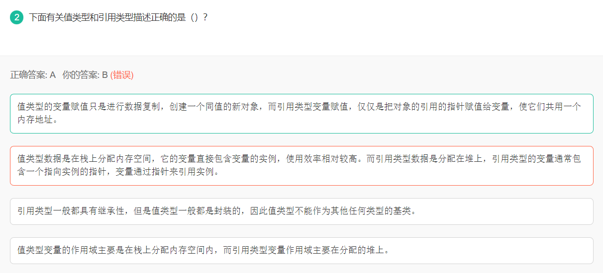

### 增量模型

增量模型是把待开发的软件系统模块化，将每个模块作为一个**增量组件**，从而分批次地分析、设计、编码和测试这些增量组件。运用增量模型的软件开发过程是**递增式**的过程。

相对于瀑布模型而言，采用增量模型进行开发，开发人员不需要一次性地把整个软件产品提交给用户，而是可以**分批次进行提交**。


### 砝码称重

```
9个分为3个，那边轻就在哪边，不然就在第三组。
```


### x++ + ++y+y


### byte+byte

```
byte b1=1,b2=2,b3,b6; 
final byte b4=4,b5=6; 
b6=b4+b5; // 编译器常量，不需要运行期自动转为int
b3=(b1+b2); // 自动转为int型，需要强制转换
System.out.println(b3+b6);

被final修饰的变量是常量，这里的b6=b4+b5可以看成是b6=10；在编译时就已经变为b6=10了

而b1和b2是byte类型，java中进行计算时候将他们提升为int类型，再进行计算，b1+b2计算后已经是int类型，赋值给b3，b3是byte类型，类型不匹配，编译不会通过，需要进行强制转换。

Java中的byte，short，char进行计算时都会提升为int类型。

```


### 数据库


题目是小于连接，答案×表示笛卡尔积，对应的属性位置为1，4


### pctfree&pctused

null值多，那么要加大空闲空间

```
pctfree:当空闲空间占比低于pctfree，就会把当前块移除空闲链表freelist，可以被insert
pctused:当使用率小于pctused会重新加入空闲链表。

pctfree默认是10，pctused默认是40，且规定pctfree+pctused < 90
此道题A、D大于90排除，又因为字段中有大量空值，为保证后续空间有足够空间更新，需要增大空闲比率，所以选B
```


### 二分查找

最差O(n)，退化成链表

### 先来先服务&时间片轮转

1、**先来先服务**算法, 有利于**CPU密集型**作业, 不利于IO密集型作业
因为CPU密集型说明会长时间占用CPU，进程IO中断让出CPU,排到队尾，那么就得等很长时间才能被重新调度


2、**时间片轮转**算法, 有利于**cpu密集型**作业, 不利于io密集型作业

### T(n)=T(n-1)+n时间复杂度

设某算法的时间复杂度函数的递推方程是 T(n) = T(n - 1) + n（n 为正整数）及 T(0) = 1，则该算法的时间复杂度为n^2

```
T(n-1)+n
=T(n-2)+n-1+n
=T(n-3)+n-2+n-1+n
=(1+n)n/2=n^2

大概趋势就是1 2 3  因此等差数列 n(n-1)/2
```

### HTTP报文三部分

HTTP响应报文由三部分组成，
**响应行**：由报文协议及版本、状态码及描述组成。
响应头：和请求头一样，由属性组成。
响应体：是服务器返回给客户端的文本信息。

### 两个栈模拟队列

用俩个栈模拟实现一个队列，如果栈的容量分别是O和P(O>P),那么模拟实现的队列最大容量是多少？**2p+1**

两个栈都存较小的数量，大的栈可多存一个，即可满足先进先出的特点

1、选取较大O作为缓冲区，先入栈p个元素，再全部出栈到p中，再把O入栈p+1个元素。

2、此时就得p先出栈，再把O中p个元素放到p中，然后O先出栈，再p出栈


https://blog.csdn.net/SCS199411/article/details/91443928

### 普通方法构造方法

普通方法**可以跟类重名**，但**一定要有返回值**；没有返回值就是构造方法；

### 网站运营商广告

DNS劫持或HTTP劫持
DNS劫持:访问马化腾的网站，返回了运营商的中间服务器IP。访问该ip一致性**返回302**临时重定向，跳转至预处理的网页，在这个**网页上再打开原网页的内容**
HTTP劫持：一种是类似DNS的302，一种是js插入广告

### 实例方法

实例方法**不能**调用超类或**其他类的私有方法**


### 精度转换

int x=1;float y=2; 求x/y 自动转为精度高的

```
int x=1;
float y=2;
System.out.println(x/y); // 0.5
```

## Nginx

#### 简介


#### 反向代理


#### 简单调优


**内核网络参数**


**提升网络效率**


```
server
{
    listen 80;
    server_name 47.106.21.242;

    include enable-php-56.conf;
    
    include 		/www/server/panel/vhost/rewrite/47.106.21.242.conf;

    location / {
    	    index  index.html;
    		alias /www/wwwroot/http;
    }
    access_log  /www/wwwlogs/47.106.21.242.log;
    error_log  /www/wwwlogs/47.106.21.242.error.log;
}
```

#### dockercompose

```
version: '3.1'
services:
    nginx:
        image: nginx:1.21.6-alpine     # 镜像名称
        container_name: nginx     # 容器名字
        restart: always     # 开机自动重启
        ports:     # 端口号绑定（宿主机:容器内）
            - '80:80'
            - '443:443'
        volumes:      # 目录映射（宿主机:容器内）
            - ./conf/nginx.conf:/etc/nginx/nginx.conf
            - ./conf.d:/etc/nginx/conf.d
            - ./html:/usr/share/nginx/html
            - ./ssl:/etc/ssl
```

#### default.conf

```
server {                                                                                                                                                                                                         
    listen       80;                                                                                                                                                                                             
    listen  [::]:80;                                                                                                                                                                          
    #access_log  /var/log/nginx/host.access.log  main;                                                                                                                                                           
    location / {                                                                                 
        root   /usr/share/nginx/html;                                                                       
        index  index.html index.htm;                                                                                                                                                                             
    }                                                                                                   
    #error_page  404              /404.html;                                                                            
    # redirect server error pages to the static page /50x.html                                                                                             
    error_page   500 502 503 504  /50x.html;                                                                                                                                                                     
    location = /50x.html {                                                                              
        root   /usr/share/nginx/html; 
    }                                                                                               
    # proxy the PHP scripts to Apache listening on 127.0.0.1:80                                                                                                 
    #location ~ \.php$ {                                                                      
    #    proxy_pass   http://127.0.0.1;  
    #}                                                                                              
    # pass the PHP scripts to FastCGI server listening on 127.0.0.1:9000                                                                           
    #location ~ \.php$ {                                                                                    
    #    root           html;                                                                               
    #    fastcgi_pass   127.0.0.1:9000;               
    #    fastcgi_index  index.php;                                                                        
    #    fastcgi_param  SCRIPT_FILENAME  /scripts$fastcgi_script_name;     
    #    include        fastcgi_params;      
    #}                                                                                
    # deny access to .htaccess files, if Apache's document root    
    # concurs with nginx's one                                                                             
    #location ~ /\.ht {     
    #    deny  all;                                                                                     
    #}           
}
```

#### nginx.conf

```
user  nginx;
worker_processes  auto;

error_log  /var/log/nginx/error.log notice;
pid        /var/run/nginx.pid;


events {
    worker_connections  1024; 
}


http {
    include       /etc/nginx/mime.types;
    default_type  application/octet-stream;

    log_format  main  '$remote_addr - $remote_user [$time_local] "$request" '
                      '$status $body_bytes_sent "$http_referer" '
                      '"$http_user_agent" "$http_x_forwarded_for"';

    access_log  /var/log/nginx/access.log  main;

    sendfile        on;
    #tcp_nopush     on;

    keepalive_timeout  65;

    #gzip  on;

    include /etc/nginx/conf.d/*.conf;
}

```

#### 配置文件

```
events{
	accept_mutex on; # 惊群
	multi_accept on; 
	worker_commections 1024; # 单个worker的最大连接数
	use epoll;
}
```


#### 浏览器的缓存


### Kafka


## RabbitMQ

### 如何保证消息可靠性

- 生产者确认机制confirmCallback（通过confirm回调的result判断结果）和returnCallBack（消息到达队列失败触发的回调）
- 生产者事务
- 消息持久化
- 消费者确认
- 失败重试

#### 1、生产者确认

confirmCallback（判断是否到达交换机）和returnCallback（未到达队列触发回调）

生产者将[信道](https://so.csdn.net/so/search?q=信道&spm=1001.2101.3001.7020)设置成`confirm`模式，一旦信道进入`confirm`模式，所有在该信道上面发布的消息都会被指派一个唯一的id(从1开始)，一旦消息被投递到匹配的队列之后，rabbitmq就会发送一个确认(`Basic.Ack`)和`deliverTag`(消息id)给生产者。

如果消息和队列是持久化的那么消息会在持久化之后被发出。rabbitmq除了回传`deliverTag`之外，还有`multiple`参数，表示到这个序号之前所有的消息都得到了处理。所有的消息只会被`Ack`或`Nack`一次，不会出现既被`Ack`又被`Nack`

消息有没有到达**交换机**，通过**confirmCallback**的result获取，Nack表示没有正常到达队列

```java
		// 1.准备消息
        String message = "hello, spring amqp!";
        // 2.准备CorrelationData
        // 2.1.消息ID
        CorrelationData correlationData = new CorrelationData(UUID.randomUUID().toString());
        // 2.2.准备ConfirmCallback
        correlationData.getFuture().addCallback(result -> {
            // 判断结果
            if (result.isAck()) {
                // ACK
                log.debug("消息成功投递到交换机！消息ID: {}", correlationData.getId());
            } else {
                // NACK
                log.error("消息投递到交换机失败！消息ID：{}", correlationData.getId());
                // 重发消息
            }
        }, ex -> {
            // 记录日志
            log.error("消息发送失败！", ex);
            // 重发消息
        });
        // 3.发送消息
        rabbitTemplate.convertAndSend("amq.topic", "a.simple.test", message, correlationData);
```

消息到达交换机但**没到达队列**，触发**returnCallback**

```java
        // 配置ReturnCallback,消息到达队列失败触发
        rabbitTemplate.setReturnCallback((message, replyCode, replyText, exchange, routingKey) -> {
            // 判断是否是延迟消息
            Integer receivedDelay = message.getMessageProperties().getReceivedDelay();
            if (receivedDelay != null && receivedDelay > 0) {
                // 是一个延迟消息，忽略这个错误提示
                return;
            }
            // 记录日志
            log.error("消息发送到队列失败，响应码：{}, 失败原因：{}, 交换机: {}, 路由key：{}, 消息: {}",
                     replyCode, replyText, exchange, routingKey, message.toString());
            // 如果有需要的话，重发消息
        });
```

#### 2、事务机制

rabbitmq与事务相关的方法:

- `channel.txSelect()`: 将当前信道设置成事务模式
- `channel.txCommit()`: 用于提交事务
- `channel.txRollback()`: 用于回滚事务

**通过事务实现机制，只有消息成功被rabbitmq服务器接收，事务才能提交成功，否则便可在捕获异常之后进行回滚，然后进行消息重发，但是事务非常影响rabbitmq的性能。还有就是事务机制是阻塞的过程，只有等待服务器回应之后才会处理下一条消息**

示例：

```java
public class TransactionSender {


    private static final String ex_name = "ex_tx";
    private static final String q_name = "q_tx";
    private static final String rt_name = "rt_tx";

    public static void main(String[] args) throws IOException, TimeoutException {

        ConnectionFactory factory = new ConnectionFactory();
        factory.setHost("localhost");
        Connection connection = factory.newConnection();
        Channel channel = connection.createChannel();

        channel.exchangeDeclare(ex_name, BuiltinExchangeType.DIRECT);
        channel.queueDeclare(q_name, false, false, false, null);
        channel.queueBind(q_name, ex_name, rt_name);

        channel.txSelect();
        try {
            channel.basicPublish(ex_name, rt_name, null, "hello".getBytes());
            //显示抛出RuntimeException
            int a = 1/0;
            channel.txCommit();
        } catch (IOException e) {
            e.printStackTrace();
            channel.txRollback();
        }
    }
}
```

#### 3、持久化

交换机持久化、队列持久化、消息持久化

#### 4、消费者确认机制

消费者设置手动提交或自动提交

RabbitMQ支持消费者确认机制，即：消费者处理消息后可以向MQ发送ack回执，**MQ收到ack回执后才会删除该消息**。而SpringAMQP则允许配置三种确认模式：

- manual：手动ack，需要在业务代码结束后，调用api发送ack。

- auto：自动ack，**由spring监测listener代码是否出现异常，没有异常则返回ack**；抛出异常则返回nack

- none：关闭ack，MQ假定消费者获取消息后会成功处理，因此消息投递后立即被删除

#### 5、失败重试机制

当消费者出现异常后，消息会不断requeue（重新入队）到队列，再重新发送给消费者，然后再次异常，再次requeue，无限循环，导致mq的消息处理飙升，带来不必要的压力

MessageRecoverer，重试耗尽后，将**失败消息投递到指定的交换机**，由人工进行处理

```
@Bean
public MessageRecoverer republishMessageRecoverer(RabbitTemplate rabbitTemplate){
	return new RepublishMessageRecoverer(rabbitTemplate, "error.direct", "error");
}
```

### 死信交换机

#### 1、什么样的消息会成为死信？

- 消息被消费者**reject**或者返回nack

- 消息**超时**未消费

- **队列满了**

#### 2、如何给队列绑定死信交换机？

- 给队列设置dead-letter-exchange属性，指定一个交换机

- 给队列设置dead-letter-routing-key属性，设置死信交换机与死信队列的RoutingKey

#### 3、如何实现发送一个消息20秒后消费者才收到消息？

- 给消息的目标队列指定死信交换机

- 消费者监听与死信交换机绑定的队列

- 发送消息时给消息设置ttl为20秒

### 延迟队列

利用TTL结合死信交换机，我们实现了消息发出后，消费者延迟收到消息的效果。这种消息模式就称为延迟队列（Delay Queue）模式。

因为延迟队列的需求非常多，所以RabbitMQ的官方也推出了一个插件，原生支持延迟队列效果。


延迟队列插件的使用步骤包括哪些？

- 声明一个交换机，添加delayed属性为true

- 发送消息时，添加x-delay头，值为超时时间

### 惰性队列

#### 消息堆积问题

- 增加**更多消费者**，提高消费速度

- 在消费者内**开启线程池**加快消息处理速度

- **扩大队列容积**，提高堆积上限

#### 惰性队列

指定x-queue-mode属性为lazy即可

- 接收到消息后**直接存入磁盘**而非内存

- 消费者要**消费消息时才会从磁盘中读取**并加载到内存

- 支持数百万条的消息存储

优点：

- 基于磁盘存储，消息上限高

- 没有间歇性的page-out，性能比较稳定

缺点：

- 基于磁盘存储，消息时效性会降低

- 性能受限于磁盘的IO

### MQ集群

#### 两种模式

- **普通模式**：普通模式集群**不进行数据同步**，只会进行**元数据信息**（交换器、队列、绑定关系、vhost元数据）的**同步**。例如我们有2个MQ：mq1，和mq2，如果你的消息在mq1，而你连接到了mq2，那么mq2会去mq1拉取消息，然后返回给你。如果mq1宕机，**消息就会丢失**。
- **镜像模式**：与普通模式不同，**队列会在各个mq的镜像节点之间同步**，因此你连接到任何一个镜像节点，均可获取到消息。而且如果一个节点宕机，并**不会导致数据丢失**。不过，这种方式增加了数据同步的带宽消耗。

#### 获取cookie

RabbitMQ底层依赖于Erlang，而Erlang虚拟机就是一个面向分布式的语言，默认就支持集群模式。集群模式中的每个RabbitMQ 节点使**用 cookie 来确定它们是否被允许相互通信**。

要使两个节点能够通信，它们必须具有相同的共享秘密，称为**Erlang cookie**。cookie 只是一串最多 255 个字符的字母数字字符。

每个集群节点必须具有**相同的 cookie**。实例之间也需要它来相互通信。

#### 镜像模式

- 镜像队列结构是一主多从（从就是镜像）
- 所有操作都是主节点完成，然后同步给镜像节点
- 主宕机后，镜像节点会替代成新的主（如果在主从同步完成前，主就已经宕机，可能出现数据丢失）
- 不具备负载均衡功能，因为所有操作都会有主节点完成（但是不同队列，其主节点可以不同，可以利用这个提高吞吐量）

镜像队列是基于普通的集群模式的

2.1. 镜像队列的结构
镜像队列基本上就是一个特殊的BackingQueue，它内部包裹了一个普通的BackingQueue做本地消息持久化处理，在此基础上增加了将消息和ack复制到所有镜像的功能。所有对mirror_queue_master的操作，会通过**可靠组播GM的方式同步到各slave节点**。GM负责消息的广播，mirror_queue_slave负责回调处理，而master上的回调处理是由coordinator负责完成。mirror_queue_slave中包含了普通的BackingQueue进行消息的存储，master节点中BackingQueue包含在mirror_queue_master中由AMQQueue进行调用。

消息的发布（除了Basic.Publish之外）与消费都是通过master节点完成。master节点对消息进行处理的同时将消息的处理动作通过GM广播给所有的slave节点，slave节点的GM收到消息后，通过回调交由mirror_queue_slave进行实际的处理。

对于Basic.Publish，消息同时发送到master和所有slave上，如果此时master宕掉了，消息还发送slave上，这样当slave提升为master的时候消息也不会丢失。

2.2. GM（Guarenteed Multicast）
GM模块实现的一种**可靠的组播通讯协议**，该协议能够保证组播**消息的原子性**，即保证组中活着的节点要么都收到消息要么都收不到。

它的实现大致如下：

将所有的节点形成一个循环链表，每个节点都会监控位于自己左右两边的节点，当有节点新增时，相邻的节点保证当前广播的消息会复制到新的节点上；当有节点失效时，相邻的节点会接管保证本次广播的消息会复制到所有的节点。在master节点和slave节点上的这些gm形成一个group，group（gm_group）的信息会记录在mnesia中。不同的镜像队列形成不同的group。消息从master节点对于的gm发出后，顺着链表依次传送到所有的节点，由于所有节点组成一个循环链表，master节点对应的gm最终会收到自己发送的消息，这个时候master节点就知道消息已经复制到所有的slave节点了。

### RabbitMQ 消息怎么传输？

由于 TCP 链接的创建和销毁开销较大，且并发数受系统资源限制，会造成性能瓶颈，所以 RabbitMQ **使用信道**的方式来传输数据。

信道（Channel）是生产者、消费者与 RabbitMQ 通信的渠道，信道是**建立在 TCP 链接上的虚拟链接**，且每条 TCP 链接上的信道数量没有限制。就是说 RabbitMQ 在一条 TCP 链接上建立成百上千个信道来达到多个线程处理，这个 **TCP 被多个线程共享**，每个**信道在 RabbitMQ 都有唯一的 ID，保证了信道私有性**，每个信道对应一个线程使用

### docker-compose.yml

```
version: '3'
services:
  rabbitmq:
    image: rabbitmq:3.8.3-management
    container_name: rabbitmq
    restart: always
    hostname: myRabbitmq
    ports:
      - 15672:15672
      - 5672:5672
    volumes:
      - ./data:/var/lib/rabbitmq
    environment:
      - RABBITMQ_DEFAULT_USER=root
      - RABBITMQ_DEFAULT_PASS=root
```

RabbitListener和Rabbithandler的注意

传对象的时候，注意全类名要一致，不然数据转换异常

## Kafka

### 消息有序

单分区

max.inflight<=5 服务缓存最近的5个请求，可以保证有序


Kafka 分布式的单位是 partition，同一个 partition 用一个 write ahead log 组织，所以可以保证 FIFO 的顺序。不同 partition 之间不能保证顺序。但是绝大多数用

户都可以通过 message key 来定义，因为同一个 key 的 message 可以保证只发

送到同一个 partition。

Kafka 中发送 1 条消息的时候，可以指定(**topic, partition, key**) 3 个参数。

partiton 和 key 是可选的。如果你指定了 partition，那就是所有消息发往同 1

个 partition，就是有序的。并且在消费端，Kafka 保证，1 个 partition 只能被

1 个 consumer 消费。或者你指定 key（比如 order id），具有同 1 个 key 的

所有消息，会发往同 1 个 partition。

## Dubbo

service

registry

remote

protocol

seriable


#### 设计模式

```
装饰者模式

```


模板方法


#### spring报错

```
org.springframework.beans.factory.BeanCurrentlyInCreationException: Error creating bean with name 'referenceBean': Requested bean is currently in creation: Is there an unresolvable circular reference?
```


**报错分析：**

当ReferenceBean的setApplicationContext方法被调用时，其本身生命周期肯定还未结束，此时再调用applicationContext.getBean(beanDefinitionName)获取本身的时候就报错了，因为本身还处在bean生命周期，即还没创建成功

具体在下面的时候抛出异常，获取不到singleton实例


**解决方案：**

代码逻辑延后到了afterSingletonsInstantiated中执行

#### 心跳机制和超时重连

```
超时后服务端主动断开客户端(或者客户端链接不上服务端的时候)，会触发客户端的的

channelInactive 所以我们需要在这个地方实现的我们的重连
```

#### 序列化方式：

基于SPI机制，支持两种序列化方式，prostuff和hessian

SPI优势：面向接口编程，实现解耦，可配置切换序列化方式。不用硬编码导入实现类。

缺点：遍历的方式获取，个人优化：通过map和枚举，O(1)获取对应的实例

[官网框架设计概览](https://dubbo.apache.org/zh/docs/v2.7/dev/design/)

#### Hessian反序列化

Caused by: com.alibaba.com.caucho.hessian.io.HessianProtocolException: ClasA could not be instantiated
at com.alibaba.com.caucho.hessian.io.JavaDeserializer.instantiate(JavaDeserializer.java:317)

```
dubbo 使用Hessian反序列化的时候可能要使用到无参构造，不然报空指针异常，所以序列化对象最好有一个无参构造
```

#### 领域模型

Protocol 是服务域，它是 Invoker 暴露和引用的主功能入口，它负责 Invoker 的生命周期管理。

Invoker 是实体域，它是 Dubbo 的核心模型，其它模型都向它靠扰，或转换成它，它代表一个可执行体，可向它发起 invoke 调用，它有可能是一个本地的实现，也可能是一个远程的实现，也可能一个集群实现。

Invocation 是会话域，它持有调用过程中的变量，比如方法名，参数等。

#### 负载均衡策略

```
随机
轮询
最少活跃数
一致性哈希
最短响应时间
```


#### 整体设计图


#### 各层说明

- **config 配置层**：对外配置接口，以 `ServiceConfig`, `ReferenceConfig` 为中心，可以直接初始化配置类，也可以通过 spring 解析配置生成配置类
- **proxy 服务代理层**：服务接口透明代理，生成服务的客户端 Stub 和服务器端 Skeleton, 以 `ServiceProxy` 为中心，扩展接口为 `ProxyFactory`
- **registry 注册中心层**：封装服务地址的注册与发现，以服务 URL 为中心，扩展接口为 `RegistryFactory`, `Registry`, `RegistryService`
- **cluster 路由层**：封装多个提供者的路由及负载均衡，并桥接注册中心，以 `Invoker` 为中心，扩展接口为 `Cluster`, `Directory`, `Router`, `LoadBalance`
- **monitor 监控层**：RPC 调用次数和调用时间监控，以 `Statistics` 为中心，扩展接口为 `MonitorFactory`, `Monitor`, `MonitorService`
- **protocol 远程调用层**：封装 RPC 调用，以 `Invocation`, `Result` 为中心，扩展接口为 `Protocol`, `Invoker`, `Exporter`
- **exchange 信息交换层**：封装请求响应模式，同步转异步，以 `Request`, `Response` 为中心，扩展接口为 `Exchanger`, `ExchangeChannel`, `ExchangeClient`, `ExchangeServer`
- **transport 网络传输层**：抽象 mina 和 netty 为统一接口，以 `Message` 为中心，扩展接口为 `Channel`, `Transporter`, `Client`, `Server`, `Codec`
- **serialize 数据序列化层**：可复用的一些工具，扩展接口为 `Serialization`, `ObjectInput`, `ObjectOutput`, `ThreadPool`

#### 关系说明

```
Remoting是Dubbo协议的实现，又分为Exchange信息交换层和Transport网络传输层。Transport层只负责单项消息传输，是对Netty的封装，Exchange层建立在Transport层之上，封装了请求和响应。
```

**RegistryProtocol#doLocalExport(Invoker<T> invoker,URL providerUrl)**

```java
    private <T> Exporter doLocalExport(Invoker<T> invoker,URL providerUrl) {
        DubboProtocol dubboProtocol = new DubboProtocol();
        return dubboProtocol.export(invoker);
    }
```

**DubboProtocol#export(Invoker<T> invoker)**

```java
    public <T> Exporter<T> export(Invoker<T> invoker) {
        URL url = invoker.getUrl();
        // 服务key
        String key = serviceKey(url);

        openServer(url); // 开启netty服务

        return super.export(invoker);
    }
    // 创建ExchangeServer
    private void openServer(URL url) {
        //TODO 先从缓存获取
        createServer(url);
    }

    /**
     * 得到交换层的ExchangeServer对象
     * @param url
     * @return
     */
    private ExchangeServer createServer(URL url) {
        ExchangeServer server= Exchangers.bind(url,requestHandler);
        return server;
    }
```

**Exchangers.bind(url,requestHandler)本质是HeaderExchanger.bind(url,handler)**

```java
    public ExchangeServer bind(URL url, ExchangeHandler handler) {
        return new HeaderExchangeServer(Transporters.bind(url,handler));
    }
```

Transporters.bind(url,handler))本质是

NettyTransporter.bind(url,handler)

```java
    public RemotingServer bind(URL url, ChannelHandler handler) {
        return new NettyServer(url,handler);
    }
```

靠invoker传来传去

```java
// 本地暴露接口，通过DubboProtocol暴露接口，最终会去调用RegistryProtocol#export    
@SuppressWarnings({"unchecked", "rawtypes"})
    private void doExportUrl(URL url, boolean withMetaData) {
        Invoker<?> invoker = proxyFactory.getInvoker(ref, (Class) interfaceClass, url);
        if (withMetaData) {
            invoker = new DelegateProviderMetaDataInvoker(invoker, this);
        }
        Exporter<?> exporter = protocolSPI.export(invoker);
        exporters.add(exporter);
    }

// DubboProtocol暴露服务
    @Override
    public <T> Exporter<T> export(Invoker<T> invoker) throws RpcException {
        checkDestroyed();
        URL url = invoker.getUrl();

        // export service.
        String key = serviceKey(url);
        DubboExporter<T> exporter = new DubboExporter<T>(invoker, key, exporterMap);

        //export a stub service for dispatching event
        Boolean isStubSupportEvent = url.getParameter(STUB_EVENT_KEY, DEFAULT_STUB_EVENT);
        Boolean isCallbackservice = url.getParameter(IS_CALLBACK_SERVICE, false);
        if (isStubSupportEvent && !isCallbackservice) {
            String stubServiceMethods = url.getParameter(STUB_EVENT_METHODS_KEY);
            if (stubServiceMethods == null || stubServiceMethods.length() == 0) {
                if (logger.isWarnEnabled()) {
                    logger.warn(new IllegalStateException("consumer [" + url.getParameter(INTERFACE_KEY) +
                            "], has set stubproxy support event ,but no stub methods founded."));
                }

            }
        }

        openServer(url);
        optimizeSerialization(url);

        return exporter;
    }
```

```
RegistryConfig转换成URL
```

ServiceConfig进行服务的暴露

```
    private void doExportUrl(URL url, boolean withMetaData) {
        Invoker<?> invoker = proxyFactory.getInvoker(ref, (Class) interfaceClass, url);
        if (withMetaData) {
            invoker = new DelegateProviderMetaDataInvoker(invoker, this);
        }
        Exporter<?> exporter = protocolSPI.export(invoker);
        exporters.add(exporter);
    }
```

```
    /**
     * always export injvm
     */
    private void exportLocal(URL url) {
        URL local = URLBuilder.from(url)
                .setProtocol(LOCAL_PROTOCOL)
                .setHost(LOCALHOST_VALUE)
                .setPort(0)
                .build();
        local = local.setScopeModel(getScopeModel())
            .setServiceModel(providerModel);
        doExportUrl(local, false);
        logger.info("Export dubbo service " + interfaceClass.getName() + " to local registry url : " + local);
    }
```

RegistryProtocol#export(Invoker)

```
    /**
     * RegistryProtocol进行服务暴露，传入一个invoker对象，Invoker就是一个中间人，
     * 最终也会委托给DubboRegistry进行服务注册
     * 将invoker进一步封装，然后交给不同协议的Registry去注册服务
     * @param originInvoker
     * @param <T>
     * @return
     * @throws RpcException
     */
    @Override
    public <T> Exporter<T> export(final Invoker<T> originInvoker) throws RpcException {
        // zookeeper注册中心的url
        // zookeeper://192.168.42.101:2181/org.apache.dubbo.registry.RegistryService?application=dajiuye-swipper-service&dubbo=2.0.2&export=dubbo%3A%2F%2F10.63.138.191%3A7072%2Fcom.lhf.dajiuye.api.service.swipper.SchoolService%3Fanyhost%3Dtrue%26application%3Ddajiuye-swipper-service%26bind.ip%3D10.63.138.191%26bind.port%3D7072%26deprecated%3Dfalse%26dubbo%
        URL registryUrl = getRegistryUrl(originInvoker);
        // url to export locally 服务本地暴露的url
        // dubbo://10.63.138.191:7072/com.lhf.dajiuye.api.service.swipper.SchoolService?anyhost=true&application=da
        URL providerUrl = getProviderUrl(originInvoker);

        // Subscribe the override data
        // FIXME When the provider subscribes, it will affect the scene : a certain JVM exposes the service and call
        //  the same service. Because the subscribed is cached key with the name of the service, it causes the
        //  subscription information to cover.
        final URL overrideSubscribeUrl = getSubscribedOverrideUrl(providerUrl);
        final OverrideListener overrideSubscribeListener = new OverrideListener(overrideSubscribeUrl, originInvoker);
        Map<URL, NotifyListener> overrideListeners = getProviderConfigurationListener(providerUrl).getOverrideListeners();
        overrideListeners.put(registryUrl, overrideSubscribeListener);
        // 根据配置信息对原来服务暴露的url进行重写
        providerUrl = overrideUrlWithConfig(providerUrl, overrideSubscribeListener);
        //export invoker 交给DubboProtocol协议进行服务暴露，比如创建NettyServer监听端口和保存服务实例
        final ExporterChangeableWrapper<T> exporter = doLocalExport(originInvoker, providerUrl);

        // url to registry 获取ZookeeperRegistry注册中心对象（与注册中心创建TCP连接）
        final Registry registry = getRegistry(registryUrl);
        // 服务注册的url
        // dubbo://10.63.138.191:7072/com.lhf.dajiuye.api.service.swipper.SchoolService?anyhost=true&application=dajiuye-swipper-service&deprecated=false&dubbo=2.0.2&dynamic=true&generic=false&interface=com.lhf.dajiuye.api.service.swipper.SchoolService
        final URL registeredProviderUrl = getUrlToRegistry(providerUrl, registryUrl);

        // decide if we need to delay publish (provider itself and registry should both need to register)
        boolean register = providerUrl.getParameter(REGISTER_KEY, true) && registryUrl.getParameter(REGISTER_KEY, true);
        if (register) {
            // 服务注册
            register(registry, registeredProviderUrl);
        }

        // register stated url on provider model
        registerStatedUrl(registryUrl, registeredProviderUrl, register);


        exporter.setRegisterUrl(registeredProviderUrl);
        exporter.setSubscribeUrl(overrideSubscribeUrl);

        if (!registry.isServiceDiscovery()) {
            // Deprecated! Subscribe to override rules in 2.6.x or before.
            registry.subscribe(overrideSubscribeUrl, overrideSubscribeListener);
        }

        notifyExport(exporter);
        //Ensure that a new exporter instance is returned every time export
        return new DestroyableExporter<>(exporter);
    }
```

最终调用DubboProtocol#export进行服务暴露

通过这个ExchangeHandler进行层与层的通信


#### Dubbo Channel和Netty Channel如何建立联系


## VUE

avaScript的基本数据类型有：（1）**Undefined**、（2）**Null**、（3）**Boolean**、（4）**String**、（5）**Number**、（6）**Symbol**、（7）**Object**。ES6 增加了Symbol类型


### elementUI

```
element-plus不适配vue3，官方已将vue3版本的更新为element-plus

npm install element-plus --save

引入
import ElementPlus from 'element-plus'
import 'element-plus/dist/index.css'
```

## Docker

### 原理


内核与硬件交互，提供操作硬件的指令

系统应用封装内核指令为函数，便于程序员调用

用户程序基于系统函数库实现功能

Ubuntu和CentOS都是基于Linux内核，只是系统应用不同，提供的函数库有差异

Docker将用户程序和系统应用（ubuntu或centos）一起打包，基于操作系统的内核就可以运行，屏蔽了系统应用函数库依赖等问题。

### 架构


### docker&虚拟机


#### 环境资源隔离

docker基于**namespace**实现环境隔离，**cgroup**实现资源隔离，**镜像**实现根目录隔离

https://blog.csdn.net/weixin_40391011/article/details/118545349

docker Engine可以简单看成对[Linux](https://link.jianshu.com/?t=http://lib.csdn.net/base/linux)的NameSpace、Cgroup、镜像管理文件系统操作的封装。docker并没有和虚拟机一样利用一个完全独立的Guest OS实现环境隔离，它利用的是目前[linux](https://link.jianshu.com/?t=http://lib.csdn.net/base/linux)内核本身支持的容器方式实现资源和环境隔离。

简单的说，docker利用**namespace**实现系统**环境的隔离**；利用**Cgroup**实现**资源限制**；利用**镜像**实现**根目录环境的隔离**。


（1）docker有着比虚拟机更少的抽象层。由于docker不需要Hypervisor实现硬件资源虚拟化，运行在docker容器上的程序直接使用的都是实际物理机的硬件资源。因此在CPU、内存利用率上docker将会在效率上有优势，具体的效率对比在下几个小节里给出。在IO设备虚拟化上，docker的镜像管理有多种方案，比如利用Aufs文件系统或者Device Mapper实现docker的文件管理，各种实现方案的效率略有不同。

（2）docker利用的是宿主机的内核，而不需要Guest OS。因此，当新建一个容器时，**docker不需要和虚拟机一样重新加载一个操作系统内核。**我们知道，**引导、加载操作系统内核是一个比较费时费资源的过程，当新建一个虚拟机时，虚拟机软件需要加载Guest OS，这个新建过程是分钟级别的**。而docker由于直接利用宿主机的操作系统，则省略了这个过程，因此新建一个docker容器只需要几秒钟。另外，**现代操作系统是复杂的系统，在一台物理机上新增加一个操作系统的资源开销是比较大的**，因此，docker对比虚拟机在资源消耗上也占有比较大的优势。事实上，在一台物理机上我们可以很容易建立成百上千的容器，而只能建立几个虚拟机。


计算效率

虚拟机的**计算能力**损耗在50%左右。

为什么会有这么大的性能损耗呢？一方面是因为虚拟机增加了一层虚拟硬件层，运行在虚拟机上的应用程序在进行数值计算时是运行在**Hypervisor虚拟的CPU上**的；另外一方面是由于计算程序本身的特性导致的差异。虚拟机虚拟的**cpu[架构](https://link.jianshu.com/?t=http://lib.csdn.net/base/architecture)不同于实际cpu架构**，数值计算程序一般针对特定的cpu架构有一定的**优化措施**，**虚拟化使这些措施作废**，甚至起到反效果。比如对于本次实验的平台，实际的CPU架构是2块物理CPU，每块CPU拥有16个核，共32个核，采用的是NUMA架构；而虚拟机则将CPU虚拟化成一块拥有32个核的CPU。这就导致了计算程序在进行计算时无法根据实际的CPU架构进行优化，大大减低了计算效率。


#### 内存随机访问效率更高。

#### 快速启动、低系统资源消耗

docker**直接利用宿主机的系统内核，避免了虚拟机启动时所需的系统引导时间和操作系统运行的资源消耗**。利用docker能在**几秒钟之内启动大量的容器**，这是虚拟机无法办到的。快速启动、低系统资源消耗的优点使docker在弹性**云平台和自动运维**系统方面有着很好的应用前景。


#### [docker的劣势](https://blog.csdn.net/weixin_40391011/article/details/118545349)

前面的内容主要论述docker相对于虚拟机的优势，但docker也不是完美的系统。相对于虚拟机，docker还存在着以下几个缺点：

> 1.**资源隔离**方面不如虚拟机，docker是利用cgroup实现资源限制的，只能限制资源消耗的最大值，而不能隔绝其他程序占用自己的资源。
>
> 2.**安全性**问题。docker目前并不能分辨具体执行指令的用户，**只要一个用户拥有执行docker的权限**，那么他就可以对docker的容器进行所有操作，不管该容器是否是由该用户创建。比如A和B都拥有执行docker的权限，由于docker的server端并不会具体判断docker cline是由哪个用户发起的，A可以删除B创建的容器，存在一定的安全风险。
>
> 3.docker目前还在版本的快速更新中，细节功能调整比较大。一些**核心模块依赖于高版本内核，存在版本兼容**问题

### 容器操作

docker exec -it CONTAINER bash # 以终端交互的模式

docker run -p 端口映射 -e 环境变量 -d 后台运行

docker start&restart

docker ps [-a] 查看容器（所有）

docker logs -f 查看日志

docker rm 删除容器

docker inspect container_id | grep # 查看容器详细信息


### 数据卷操作

```
docker volumn create&inspect&ls&prune&rm
```


### 镜像操作

docker save保存镜像为压缩包

docker load加载压缩包为镜像

docker pull和docker push为镜像推送和镜像拉取

docker images 查看镜像

docker rmi删除镜像

通过使用docker build和Dockerfile构建镜像


### 批量删除容器或镜像

```
sudo docker ps -a | grep Exited | awk '{print $1}' | xargs sudo docker rm 删除异常停止的docker容器

sudo docker images | grep '<none>' | awk '{print $3}'| xargs sudo docker rmi -f 删除名称或标签为none的镜像
```

### docker-compose

```
docker-compose 

-f：指定使用的compose模板文件，默认为当前目录下的docker-compose.yaml文件，可以多次指定。

-p：指定项目的名称，默认将使用所在目录名称作为项目名。

–verbose：输出更多调试信息。

-v：打印版本信息并退出


build 构建（重新构建）项目中的服务容器

config 检测compose文件的错误

up 启动服务

down 停止容器

images 列出项目中所包含的镜像

logs 查看服务容器的日志

kill 发送 SIGKILL 信号来强制停止服务容器

port 查看某个容器端口所映射的公共端口

ps 列出项目中目前的所有容器

restart 重启项目中的服务

rm 删除所有停止状态的服务容器

run 在指定服务上运行一个命令

scale 设置指定服务运行的容器个数

stop 停止处于运行状态的容器

start 启动被stop的服务容器

top 查看各个服务容器内运行的进程

pause 暂停一个服务容器

unpause 恢复处于暂停状态中的服务
```


### 蓝绿发布：蓝绿一个好一个坏，切换

金丝雀发布：一个一个替换

### Harbor位置

```
/opt/harbor
```

### 启动命令

```
docker 启动命令
sudo systemctl start docker
 
docker 重启命令
systemctl restart docker

docker 查看状态命令
systemctl status docker
```

### 开机自启动

```
docker update name --restart
	no -  容器退出时，不重启容器；

    on-failure - 只有在非0状态退出时才从新启动容器；

    always - 无论退出状态是如何，都重启容器；
```

### docker 镜像启动成功但是无法访问

解决办法：

`vi /etc/sysctl.conf或者vi /usr/lib/sysctl.d/00-system.conf`

添加如下代码：
`net.ipv4.ip_forward=1`

重启network服务

`systemctl restart network`

查看是否修改成功

`sysctl net.ipv4.ip_forward`
如果返回为“net.ipv4.ip_forward = 1”则表示成功了

## k8s

master默认有污点不能部署:强制措施：

```
kubectl taint nodes --all node-role.kubernetes.io/master-
```

卸载看s集群

```
kubeadm reset -f
modprobe -r ipip
lsmod
rm -rf ~/.kube/
rm -rf /etc/kubernetes/
rm -rf /etc/systemd/system/kubelet.service.d
rm -rf /etc/systemd/system/kubelet.service
rm -rf /usr/bin/kube*
rm -rf /etc/cni
rm -rf /opt/cni
rm -rf /var/lib/etcd
rm -rf /var/etcd
yum clean all
yum remove kube*
```

## jenkins

war包启动命令（采用）

```
nohup java -jar jenkins.war &
```

rpm方式安装

```
wget https://pkg.jenkins.io/redhat-stable/jenkins-2.121.2-1.1.noarch.rpm

rpm -ivh jenkins-2.121.2-1.1.noarch.rpm
```

docker运行命令

```
docker run -d --name jenkins_v2 -p 8680:8080 -p 56000:50000 -v jenkins_data:/var/jenkins_home jenkins/jenkins
```

修改插件地址

```

cd /var/lib/jenkins/updates/

sed -i 's#http:\/\/updates.jekins-ci.org\/download#https:\/\/mirrors.tuna.tsinghua.edu.cn\/jenkins#g' default.json && sed -i '#/http:\/\/www.google.com#https:\/\/www.baidu.com#g' default.json
```

## es

### 自定义分词器


将pinyin分词插件安装到elasticsearch的plugin目录


elasticsearch中分词器（analyzer）的组成包含三部分：

- character filters：在tokenizer之前**对文本进行处理**。例如删除字符、替换字符
- tokenizer：将文本按照一定的规则**切割成词条**（term）。例如keyword，就是不分词；还有ik_smart
- tokenizer filter：将tokenizer输出的**词条做进一步处理**。例如大小写转换、同义词处理、拼音处理等


### 深度分页问题

那如果我要查询9900~10000的数据呢？是不是要先查询TOP10000呢？那每个节点都要查询10000条？汇总到内存中？


当查询分页深度较大时，汇总数据过多，对内存和CPU会产生非常大的压力，因此elasticsearch会禁止from+ size 超过10000的请求。


分页查询的常见实现方案以及优缺点：

- `from + size`：
  - 优点：支持随机翻页
  - 缺点：深度分页问题，默认查询上限（from + size）是10000
  - 场景：百度、京东、谷歌、淘宝这样的随机翻页搜索
- `after search`：
  - 优点：没有查询上限（单次查询的size不超过10000）
  - 缺点：只能向后逐页查询，不支持随机翻页
  - 场景：没有随机翻页需求的搜索，例如手机向下滚动翻页

- `scroll`：
  - 优点：没有查询上限（单次查询的size不超过10000）
  - 缺点：会有额外内存消耗，并且搜索结果是非实时的
  - 场景：海量数据的获取和迁移。从ES7.1开始不推荐，建议用 after search方案。

### 分片

主分片数不能修改，因为是根据id哈希取模路由，所以会导致找不到数据

副本分片就可以随时增删


高可用 主从切换 负载均衡

### 知识点

在在es6中**_all**被禁止了，使用copy_to代替

PUT my_index
{
  "mappings": {
    "properties": {
      "first_name": {
        "type": "text",
        "copy_to": "full_name" 
      },
      "last_name": {
        "type": "text",
        "copy_to": "full_name" 
      },
      "full_name": {
        "type": "text",
        "store": true
      }
    }
  }
}

store:true 那么就可以把full_name也查出来

### 单节点es备份

```
# 查询所有
GET _search
{
  "query": {
    "match_all": {}
  }
}

DELETE /hot

PUT /hot
{
  "mappings": {
    "properties": {
      "hotWord":{
        "type": "keyword"
      }
    }
  }
}

# 测试补全
PUT test
{
  "mappings":{
    "properties":{
      "title":{
        "type":"completion"
      }
    }
  }
}

GET /question

GET /question/_search
{
  "query": {"match_all": {}}
}

POST /test/_doc
{
  "title":["Sony","dsadasda"]
}


GET /question/_search
{
  "suggest": {
    "title_suggest": {
      "text": "java;php;",
      "completion": {
        "field": "suggestion",
        "skip_duplicates":true,
        "size":10
      }
    }
  }
}

GET /question/_search
{
  "query": {"match_all": {}}
}

DELETE /question

PUT /question
{
  "settings": {
    "analysis": {
      "analyzer": {
        "text_analyzer":{
          "tokenizer":"ik_max_word",
          "filter":"py"
        },
        "completion_anylyzer":{
          "tokenizer":"keyword",
          "filter":"py"
        }
      },
      "filter": {
        "py":{
          "type":"pinyin",
          "keep_full_pinyin": false,
          "keep_joined_full_pinyin": true,
          "keep_original": true,
          "limit_first_letter_length": 16,
          "remove_duplicated_term": true,
          "none_chinese_pinyin_tokenize": false
        }
      }
    }
  }, 
  "mappings": {
    "properties": {
      "id": {
        "type": "long"
      },
      "title": {
        "type": "text",
        "analyzer": "text_analyzer",
        "search_analyzer": "ik_smart", 
        "copy_to": "all"
      },
      "description": {
        "type": "text",
        "analyzer": "ik_smart",
        "copy_to": "all"
      },
      "createTime": {
        "type": "date"
      },
      "modifiedTime": {
        "type": "date"
      },
      "creatorId": {
        "type": "keyword"
      },
      "creatorName": {
        "type": "text",
        "analyzer": "ik_smart"
      },
      "commentCount": {
        "type": "long"
      },
      "viewCount": {
        "type": "long"
      },
      "likeCount": {
        "type": "long"
      },
      "tag": {
        "type": "text",
        "analyzer": "ik_smart",
        "copy_to": "all"
      },
      "sticky": {
        "type": "long"
      },
      "areaId": {
        "type": "long"
      },
      "areaName": {
        "type": "text",
        "analyzer": "ik_smart",
        "copy_to": "all"
      },
      "img": {
        "type": "keyword"
      },
      "all":{
        "type": "text",
        "analyzer": "text_analyzer",
        "search_analyzer": "ik_smart"
      },
      "suggestion":{
        "type": "completion",
        "analyzer": "completion_anylyzer"
      }
    }
  }
}


# 测试拼音分词器


# 老的question映射
PUT /question
{
  "question" : {
    "aliases" : { },
    "mappings" : {
      "properties" : {
        "all" : {
          "type" : "text",
          "fields" : {
            "keyword" : {
              "type" : "keyword",
              "ignore_above" : 256
            }
          }
        },
        "areaId" : {
          "type" : "long"
        },
        "areaName" : {
          "type" : "text",
          "copy_to" : [
            "all"
          ],
          "analyzer" : "ik_smart"
        },
        "commentCount" : {
          "type" : "long"
        },
        "createTime" : {
          "type" : "date"
        },
        "creatorId" : {
          "type" : "keyword"
        },
        "creatorName" : {
          "type" : "text",
          "analyzer" : "ik_smart"
        },
        "description" : {
          "type" : "text",
          "copy_to" : [
            "all"
          ],
          "analyzer" : "ik_smart"
        },
        "id" : {
          "type" : "long"
        },
        "img" : {
          "type" : "keyword"
        },
        "likeCount" : {
          "type" : "long"
        },
        "modifiedTime" : {
          "type" : "date"
        },
        "sticky" : {
          "type" : "long"
        },
        "suggestion" : {
          "type" : "text",
          "fields" : {
            "keyword" : {
              "type" : "keyword",
              "ignore_above" : 256
            }
          }
        },
        "tag" : {
          "type" : "text",
          "copy_to" : [
            "all"
          ],
          "analyzer" : "ik_smart"
        },
        "title" : {
          "type" : "text",
          "copy_to" : [
            "all"
          ],
          "analyzer" : "ik_smart"
        },
        "viewCount" : {
          "type" : "long"
        }
      }
    },
    "settings" : {
      "index" : {
        "routing" : {
          "allocation" : {
            "include" : {
              "_tier_preference" : "data_content"
            }
          }
        },
        "number_of_shards" : "1",
        "provided_name" : "question",
        "creation_date" : "1648203917549",
        "number_of_replicas" : "1",
        "uuid" : "tLMZaYGNRCGZqkIeHM8_tw",
        "version" : {
          "created" : "7120199"
        }
      }
    }
  }
}               
```

### HU帖子Mapping

hot

```
PUT /hot
{
  "mappings": {
    "properties": {
      "hotWord":{
        "type": "keyword"
      }
    }
  }
}
```

question

```
PUT /question
{
  "settings": {
    "analysis": {
      "analyzer": {
        "text_analyzer":{
          "tokenizer":"ik_max_word",
          "filter":"py"
        },
        "completion_anylyzer":{
          "tokenizer":"keyword",
          "filter":"py"
        }
      },
      "filter": {
        "py":{
          "type":"pinyin",
          "keep_full_pinyin": false,
          "keep_joined_full_pinyin": true,
          "keep_original": true,
          "limit_first_letter_length": 16,
          "remove_duplicated_term": true,
          "none_chinese_pinyin_tokenize": false
        }
      }
    }
  }, 
  "mappings": {
    "properties": {
      "id": {
        "type": "long"
      },
      "title": {
        "type": "text",
        "analyzer": "text_analyzer",
        "search_analyzer": "ik_smart", 
        "copy_to": "all"
      },
      "description": {
        "type": "text",
        "analyzer": "ik_smart",
        "copy_to": "all"
      },
      "createTime": {
        "type": "date"
      },
      "modifiedTime": {
        "type": "date"
      },
      "creatorId": {
        "type": "keyword"
      },
      "creatorName": {
        "type": "text",
        "analyzer": "ik_smart"
      },
      "commentCount": {
        "type": "long"
      },
      "viewCount": {
        "type": "long"
      },
      "likeCount": {
        "type": "long"
      },
      "tag": {
        "type": "text",
        "analyzer": "ik_smart",
        "copy_to": "all"
      },
      "sticky": {
        "type": "long"
      },
      "areaId": {
        "type": "long"
      },
      "areaName": {
        "type": "text",
        "analyzer": "ik_smart",
        "copy_to": "all"
      },
      "img": {
        "type": "keyword"
      },
      "all":{
        "type": "text",
        "analyzer": "text_analyzer",
        "search_analyzer": "ik_smart"
      },
      "suggestion":{
        "type": "completion",
        "analyzer": "completion_anylyzer"
      }
    }
  }
}
```


### 常见DSL语句

```json
GET _search
{
  "query": {
    "match_all": {}
  }
}

GET /_analyze
{
  "analyzer": "ik_max_word",
  "text": "黑马程序员"
}

GET /_analyze
{
  "analyzer": "ik_max_word",
  "text": "传智播客Java就业超过90%,奥力给！"
}

GET /_analyze
{
  "analyzer": "ik_smart",
  "text": "传智播客Java就业超过90%,奥力给！"
}

GET /_analyze
{
  "analyzer": "ik_max_word",
  "text": "传智播客Java就业率超过95%,习大大都点赞,奥力给！"
}

PUT /heima
{
  "mappings": {
    "properties": {
      "age": {
        "type": "keyword"
      },
      "weight": {
        "type": "float"
      },
      "isMarried": {
        "type": "boolean"
      },
      "info": {
        "type": "text",
        "analyzer": "ik_smart"
      },
      "email": {
        "type": "keyword",
        "index": false
      },
      "score": {
        "type": "float"
      },
      "name": {
        "properties": {
          "firstName": {
            "type": "keyword"
          },
          "lastName": {
            "type": "keyword"
          }
        }
      }
    }
  }
}


GET /heima

# 新增数据
POST /heima/_doc/1
{
  "age":"21",
  "weight":52.1,
  "isMarried":false,
  "info":"黑马程序员Java讲师",
    "email":"zy@itcast.cn",
    "score":[99.1, 99.5, 98.9],
    "name":{
      "firstName":"云",
      "lastName":"赵"
      
    }
}


# 可新增字段，但那不可以修改
PUT /heima/_mapping
{
  "properties":{
    "age":{
      "type":"integer"
    }
  }
}

# 查询文档
GET /hotel/_doc/434082

# 删除文档
DELETE /hotel/_doc/61083

# 增量修改
POST /heima/_update/1
{
  "doc":{
    "info":"py数分"
  }
}

# 黑马旅游索引库
PUT /hotel
{
  "mappings": {
    "properties": {
      "id": {
        "type": "keyword"
      },
      "name":{
        "type": "text",
        "analyzer": "ik_max_word",
        "copy_to": "all"
      },
      "address":{
        "type": "keyword",
        "index": false
      },
      "price":{
        "type": "integer"
      },
      "score":{
        "type": "integer"
      },
      "brand":{
        "type": "keyword",
        "copy_to": "all"
      },
      "city":{
        "type": "keyword",
        "copy_to": "all"
      },
      "starName":{
        "type": "keyword"
      },
      "business":{
        "type": "keyword"
      },
      "location":{
        "type": "geo_point"
      },
      "pic":{
        "type": "keyword",
        "index": false
      },
      "all":{
        "type": "text",
        "analyzer": "ik_max_word"
      }
    }
  }
}

# day2

# 查询所有
GET /hotel/_search
{
  "query": {
    "match_all": {}
  }
}

# match查询
GET /hotel/_search
{
  "query": {
    "match": {
      "all": "外滩如家"
    }
  }
}

# multi_match查询
GET /hotel/_search
{
  "query": {
    "multi_match": {
      "query": "外滩如家",
      "fields": ["brand","name","business"]
    }
  }
}

# term查询，精确匹配
GET /hotel/_search
{
  "query": {
    "term": {
      "city": {
        "value": "杭州上海"
      }
    }
  }
}

# range查询
GET /hotel/_search
{
  "query": {
    "range": {
      "price": {
        "gte": 1000,
        "lte": 3000
      }
    }
  }
}

# distance查询
GET /hotel/_search
{
  "query": {
    "geo_distance":{
      "distance":"2km",
      "location":"31.21,121.5"
    }
  }
}

# function score 查询
GET /hotel/_search
{
  "query": {
    "function_score": {
      "query": {
        "match": {
          "all": "外滩"
        }
      }
    }
  }
}

# function score 查询
GET /hotel/_search
{
  "query": {
    "function_score": {
      "query": {
        "match": {
          "all": "外滩"
        }
      },
      "functions": [
        {
          "filter": {
            "term": {
              "brand": "如家"
            }
          },
          "weight": 10
        }
      ],
      "boost_mode": "multiply"
    }
  }
}

# bool查询
GET /hotel/_search
{
  "query": {
    "bool": {
      "must": [
        {
          "term": {
            "name": {
              "value": "如家"
            }
          }
        }
      ],
      "must_not": [
        {
          "range": {
            "FIELD": {
              "gt": 400
            }
          }
        }
      ],
      "filter": [
        {
          "geo_distance": {
            "distance": "100km",
            "location": {
              "lat": 32.21,
              "lon": 121.5
            }
          }
        }
      ]
    }
  }
}

# 普通字段排序
GET /hotel/_search
{
  "query": {
    "match_all": {}
  },
  "sort": [
    {
      "score": "desc"
    },
    {
      "price": "asc"
    }
  ]
}

# 地理坐标排序
GET /hotel/_search
{
  "query": {
    "match_all": {}
  },
  "sort": [
    {
      "_geo_distance": {
        "location": {
          "lat": 31.03,
          "lon": 121.61
        },
        "order": "asc",
        "unit": "km"
      }
    }
  ]
}

# 分页
GET /hotel/_search
{
  "query": {
    "match_all": {}
  },
  "from": 10,
  "size": 3,
  "sort": [
    {
      "price": {
        "order": "asc"
      }
    }
  ]
}

# 高亮查询
GET /hotel/_search
{
  "query": {
    "match": {
      "name": "如家"
    }
  },
  "from": 0,
  "size": 20,
  "sort": [
    {
      "price": "asc"
    },
    {
      "_geo_distance": {
        "location":"31.040699,121.618075",
        "order": "asc",
        "unit": "km"
      }
    }
  ],
  "highlight": {
    "fields": {
      "name": {
        "pre_tags": "<em>",
        "post_tags": "</em>"
      }
    }
  }
}

# 434082
# 添加广告标记
POST /hotel/_update/434082
{
  "doc": {
    "isAD":true
  }
}

# bucket聚合，即分组
GET /hotel/_search
{
  "query": {
    "range": {
      "price": {
        "gte": 100,
        "lte": 202
      }
    }
  }, 
  "size": 20,
  "aggs": {
    "brandAgg": {
      "terms": {
        "field": "brand",
        "order": {
          "_count": "asc"
        }, 
        "size": 20
      }
    }
  }
}

# 度量聚合
GET /hotel/_search
{
  "size": 0,
  "aggs": {
    "brandAgg": {
      "terms": {
        "field": "brand",
        "size": 10,
        "order": {
          "scoreAgg.avg": "desc"
        }
      },
      "aggs": {
        "scoreAgg": {
          "stats": {
            "field": "score"
          }
        }
      }
    }
  }
}

# 查询索引mapping
GET /hotel

# 自定义分词器
PUT /test
{
  "settings": {
    "analysis": {
      "analyzer": {
        "my_analyzer":{
          "tokenizer":"ik_max_word",
          "filter":"py"
        }
      },
      "filter": {
        "py":{
          "type":"pinyin",
          "keep_full_pinyin":false,
          "keep_joined_full_pinyin":true,
          "keep_original":true,
          "limit_first_letter_length":16,
          "remove_duplicated_term":true,
          "none_chinese_pinyin_tokenize":false
        }
      }
    }
  },
  "mappings": {
    "properties": {
      "title":{
        "type": "completion",
        "analyzer": "my_analyzer",
        "search_analyzer": "ik_smart"
      }
    }
  }
}

# 删除索引库
DELETE /hotel

# 测试自定义分词器
POST /test/_analyze
{
  "text": "如家酒店还不错",
  "analyzer": "my_analyzer"
}

# 创建索引库
PUT test
{
  "mappings": {
    "properties": {
      "title":{
        "type": "completion"
      }
    }
  }
}

# 插入文档
POST test/_doc
{
  "title":["sony","WH-1000XM3"]
}

POST test/_doc
{
  "title":["SK-II","PITERA"]
}

POST test/_doc
{
  "title":["Nintendo","switch"]
}

# 自动补全查询
GET /test/_search
{
  "suggest": {
    "title_suggest": {
      "text": "s",
      "completion":{
        "field":"title",
        "skip_duplicates":true,
        "size":10
      }
    }
  }
}

# 修改酒店映射结构，实现自动补全
PUT /hotel
{
  "settings": {
    "analysis": {
      "analyzer": {
        "text_analyzer":{
          "tokenizer":"ik_max_word",
          "filter":"py"
        },
        "completion_analyzer":{
          "tokenizer":"keyword",
          "filter":"py"
        }
      },
      "filter": {
        "py":{
          "type":"pinyin",
          "keep_full_pinyin":false,
          "keep_joined_full_pinyin": true,
          "keep_original":true,
          "limit_first_letter_length":16,
          "remove_duplicated_term":true,
          "none_chinese_pinyin_tokenize":false
        }
      }
    }
  },
  "mappings": {
    "properties": {
      "id":{
        "type": "keyword"
      },
      "name":{
        "type": "text",
        "analyzer": "text_analyzer",
        "search_analyzer": "ik_smart",
        "copy_to": "all"
      },
      "address":{
        "type": "keyword",
        "index": false
      },
      "price":{
        "type": "integer"
      },
      "score":{
        "type": "integer"
      },
      "brand":{
        "type": "keyword"
      },
      "city":{
        "type": "keyword"
      },
      "starName":{
        "type": "keyword"
      },
      "business":{
        "type": "keyword",
        "copy_to": "all"
      },
      "location":{
        "type": "geo_point"
      },
      "pic":{
        "type": "keyword",
        "index": false
      },
      "all":{
        "type": "text",
        "analyzer": "text_analyzer",
        "search_analyzer": "ik_smart"
      },
      "suggestion":{
        "type": "completion",
        "analyzer": "completion_analyzer"
      }
    }
  }
}

# 酒店自动补全测试
GET /hotel/_search
{
  "suggest": {
    "YOUR_SUGGESTION": {
      "text": "hs",
      "completion":{
        "field":"suggestion",
        "skip_duplicates":true,
        "size":10
      }
    }
  }
}


```
